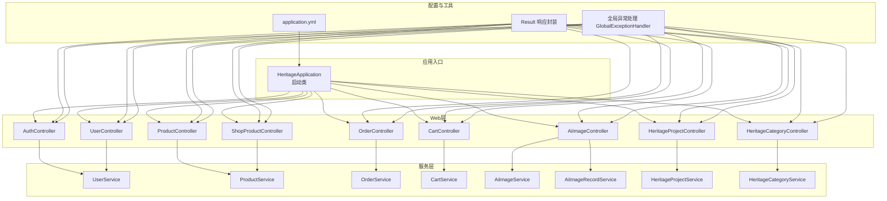
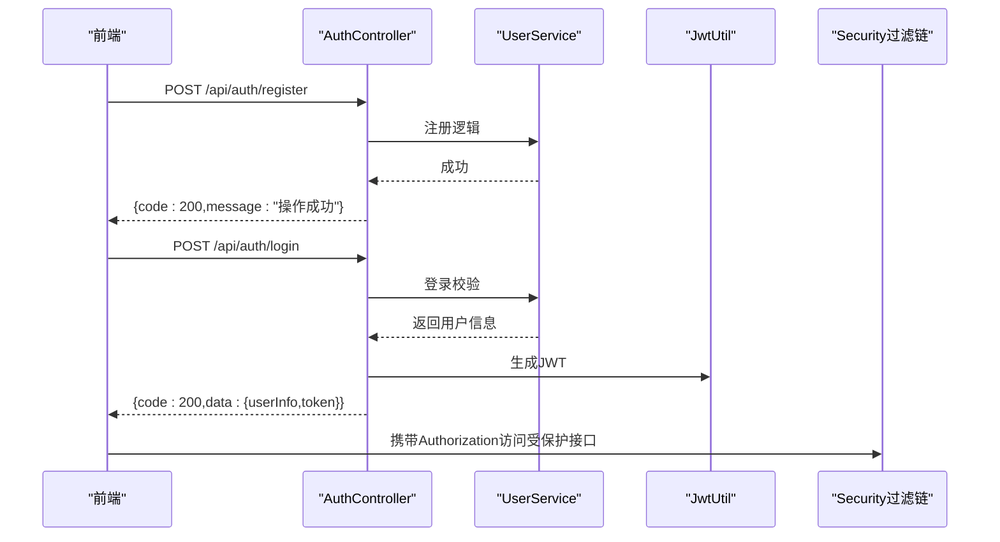
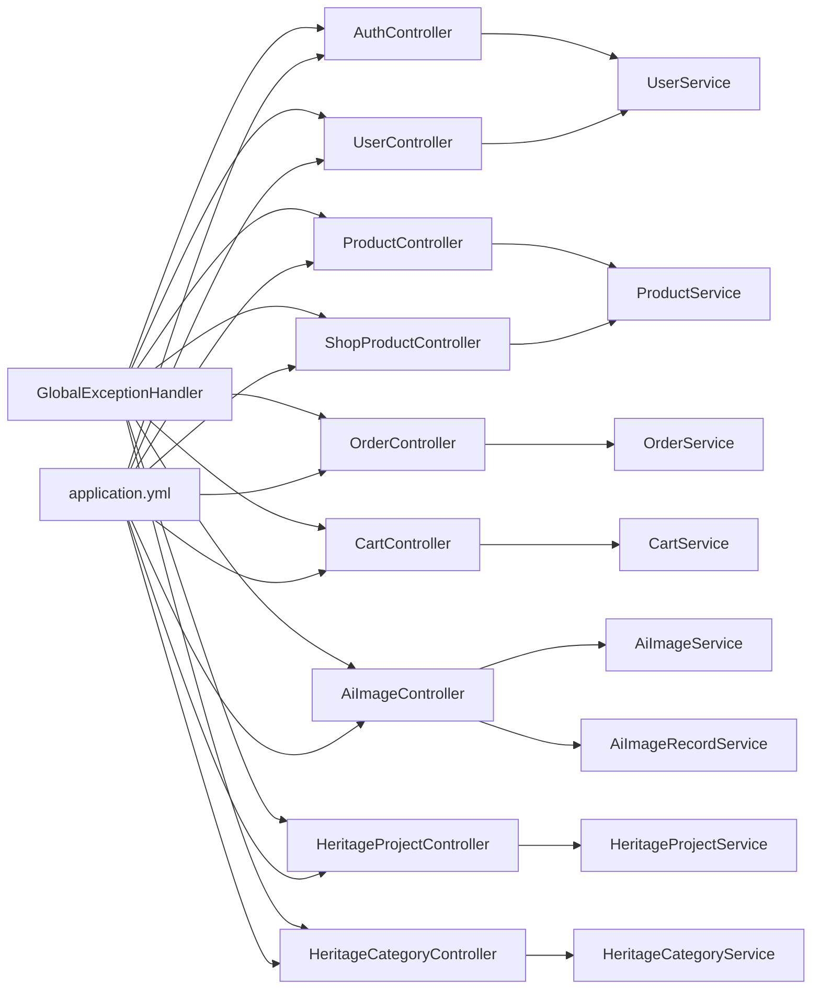

# API接口文档

<cite>
**本文引用的文件**
- [HeritageApplication.java](file://backend/src/main/java/com/heritage/HeritageApplication.java)
- [application.yml](file://backend/src/main/resources/application.yml)
- [pom.xml](file://backend/pom.xml)
- [Result.java](file://backend/src/main/java/com/heritage/common/Result.java)
- [GlobalExceptionHandler.java](file://backend/src/main/java/com/heritage/common/GlobalExceptionHandler.java)
- [BusinessException.java](file://backend/src/main/java/com/heritage/common/BusinessException.java)
- [AuthController.java](file://backend/src/main/java/com/heritage/controller/AuthController.java)
- [UserController.java](file://backend/src/main/java/com/heritage/controller/UserController.java)
- [ProductController.java](file://backend/src/main/java/com/heritage/controller/ProductController.java)
- [OrderController.java](file://backend/src/main/java/com/heritage/controller/OrderController.java)
- [CartController.java](file://backend/src/main/java/com/heritage/controller/CartController.java)
- [AiImageController.java](file://backend/src/main/java/com/heritage/controller/AiImageController.java)
- [HeritageProjectController.java](file://backend/src/main/java/com/heritage/controller/HeritageProjectController.java)
- [HeritageCategoryController.java](file://backend/src/main/java/com/heritage/controller/HeritageCategoryController.java)
- [ShopProductController.java](file://backend/src/main/java/com/heritage/controller/ShopProductController.java)
- [LoginRequest.java](file://backend/src/main/java/com/heritage/dto/LoginRequest.java)
</cite>

## 目录
1. [简介](#简介)
2. [项目结构](#项目结构)
3. [核心组件](#核心组件)
4. [架构总览](#架构总览)
5. [详细组件分析](#详细组件分析)
6. [依赖关系分析](#依赖关系分析)
7. [性能与安全考虑](#性能与安全考虑)
8. [故障排查指南](#故障排查指南)
9. [结论](#结论)
10. [附录](#附录)

## 简介
本API接口文档面向“非遗产品智能定制商城系统”，覆盖认证、用户管理、商品管理、非遗文化、智能定制（AI生图）、订单交易等模块。文档提供RESTful端点规范、请求参数、响应格式、错误码说明、认证机制、参数校验规则与数据格式规范，并给出常见使用场景与最佳实践，便于前后端协同开发。

## 项目结构
后端基于Spring Boot 3.2 + Spring Security + MyBatis-Plus，采用分层架构：控制器层（Controller）、服务层（Service）、数据访问层（Mapper）、实体与DTO、通用结果封装与全局异常处理。配置文件集中于application.yml，包含数据库、Redis、JWT、文件上传、Knife4j文档等关键配置。

图表来源
- [HeritageApplication.java](file://backend/src/main/java/com/heritage/HeritageApplication.java#L1-L13)
- [application.yml](file://backend/src/main/resources/application.yml#L1-L63)
- [Result.java](file://backend/src/main/java/com/heritage/common/Result.java#L1-L44)
- [GlobalExceptionHandler.java](file://backend/src/main/java/com/heritage/common/GlobalExceptionHandler.java#L1-L62)

章节来源
- [HeritageApplication.java](file://backend/src/main/java/com/heritage/HeritageApplication.java#L1-L13)
- [application.yml](file://backend/src/main/resources/application.yml#L1-L63)

## 核心组件
- 统一响应封装：Result<T> 提供统一的code/message/data结构，简化前端处理。
- 全局异常处理：对认证、权限、参数校验、业务异常进行统一拦截与返回。
- JWT认证：登录成功后生成JWT令牌，后续接口通过拦截器鉴权。
- 文件上传：支持multipart上传与本地持久化，AI生图历史记录可落盘到uploads目录。
- 文档：Knife4j启用OpenAPI文档，便于联调与测试。

章节来源
- [Result.java](file://backend/src/main/java/com/heritage/common/Result.java#L1-L44)
- [GlobalExceptionHandler.java](file://backend/src/main/java/com/heritage/common/GlobalExceptionHandler.java#L1-L62)
- [application.yml](file://backend/src/main/resources/application.yml#L39-L62)

## 架构总览
系统采用前后端分离，后端提供RESTful API，前端通过HTTP请求与后端交互。认证流程由AuthController提供登录/注册，随后携带JWT访问受保护资源；部分管理端接口需ADMIN/MERCHANT角色。

图表来源
- [AuthController.java](file://backend/src/main/java/com/heritage/controller/AuthController.java#L1-L48)
- [application.yml](file://backend/src/main/resources/application.yml#L39-L41)

## 详细组件分析

### 认证管理
- 作用域：用户注册、登录等认证相关接口。
- 关键点：登录成功后生成JWT令牌；注册成功返回统一成功响应。

端点一览
- POST /api/auth/register
  - 请求体：RegisterRequest（注册请求）
  - 响应：Result<Void>
  - 错误：参数校验失败、业务异常
- POST /api/auth/login
  - 请求体：LoginRequest（账号、密码）
  - 响应：Result<LoginResponse>，包含token
  - 错误：参数校验失败、业务异常

参数校验规则
- 账号与密码均不能为空（见LoginRequest）

章节来源
- [AuthController.java](file://backend/src/main/java/com/heritage/controller/AuthController.java#L1-L48)
- [LoginRequest.java](file://backend/src/main/java/com/heritage/dto/LoginRequest.java#L1-L15)

### 用户管理
- 作用域：当前用户信息查询与更新、密码修改；管理员视角的用户列表、删除、状态与信息更新。
- 关键点：需要认证；管理员接口需ADMIN角色。

端点一览
- GET /api/user/profile
  - 响应：Result<UserVO>
- PUT /api/user/profile
  - 请求体：UserUpdateRequest
  - 响应：Result<Void>
- PUT /api/user/password
  - 请求体：PasswordUpdateRequest
  - 响应：Result<Void>
- GET /api/user/list
  - 查询参数：PageQuery
  - 响应：Result<Page<UserVO>>
  - 角色：ADMIN
- DELETE /api/user/{id}
  - 响应：Result<Void>
  - 角色：ADMIN
- PUT /api/user/{id}/status
  - 请求体：UserUpdateRequest
  - 响应：Result<Void>
  - 角色：ADMIN
- PUT /api/user/{id}/update
  - 请求体：UserUpdateRequest
  - 响应：Result<Void>
  - 角色：ADMIN

章节来源
- [UserController.java](file://backend/src/main/java/com/heritage/controller/UserController.java#L1-L91)

### 商品管理
- 作用域：商品增删改查、上下架、图片管理；管理员与商家均可操作。
- 关键点：根据当前用户是否ADMIN决定权限；图片管理支持新增、更新、删除。

端点一览
- POST /api/products
  - 请求体：ProductCreateRequest
  - 响应：Result<Long>（productId）
  - 角色：ADMIN或MERCHANT
- PUT /api/products/{id}
  - 请求体：ProductUpdateRequest
  - 响应：Result<Void>
  - 角色：ADMIN或MERCHANT
- PUT /api/products/{id}/status
  - 请求体：ProductStatusUpdateRequest（status）
  - 响应：Result<Void>
  - 角色：ADMIN或MERCHANT
- DELETE /api/products/{id}
  - 响应：Result<Void>
  - 角色：ADMIN或MERCHANT
- GET /api/products
  - 查询参数：PageQuery、status
  - 响应：Result<Page<ProductVO>>
  - 角色：ADMIN或MERCHANT
- GET /api/products/{id}/images
  - 响应：Result<List<ProductImageVO>>
  - 角色：ADMIN或MERCHANT
- POST /api/products/{id}/images
  - 请求体：ProductImageAddRequest
  - 响应：Result<List<ProductImageVO>>
  - 角色：ADMIN或MERCHANT
- PUT /api/products/images/{imageId}
  - 请求体：ProductImageUpdateRequest
  - 响应：Result<Void>
  - 角色：ADMIN或MERCHANT
- DELETE /api/products/images/{imageId}
  - 响应：Result<Void>
  - 角色：ADMIN或MERCHANT

章节来源
- [ProductController.java](file://backend/src/main/java/com/heritage/controller/ProductController.java#L1-L130)

### 商城展示
- 作用域：前台商品展示、随机推荐。
- 关键点：无需认证；提供商品详情与随机推荐列表。

端点一览
- GET /api/shop/recommend
  - 查询参数：count（默认20）
  - 响应：Result<List<ProductVO>>
- GET /api/shop/products/{id}
  - 响应：Result<ProductVO>

章节来源
- [ShopProductController.java](file://backend/src/main/java/com/heritage/controller/ShopProductController.java#L1-L38)

### 非遗文化
- 作用域：非遗项目列表与详情、分类树。
- 关键点：无需认证；支持按分类筛选项目。

端点一览
- GET /api/heritage/projects
  - 查询参数：PageQuery、categoryId
  - 响应：Result<Page<HeritageProjectListItemVO>>
- GET /api/heritage/projects/{id}
  - 响应：Result<HeritageProjectDetailVO>
- GET /api/heritage/categories/tree
  - 响应：Result<List<HeritageCategoryTreeVO>>

章节来源
- [HeritageProjectController.java](file://backend/src/main/java/com/heritage/controller/HeritageProjectController.java#L1-L40)
- [HeritageCategoryController.java](file://backend/src/main/java/com/heritage/controller/HeritageCategoryController.java#L1-L30)

### 智能定制（AI生图）
- 作用域：文生图、图生图、历史记录分页；支持上传原图与多种参数控制。
- 关键点：需要认证；历史结果与参考图会落盘至uploads目录；支持远程URL、data URL、Base64三种图片输入。

端点一览
- POST /api/customize/ai-image/text-to-image
  - 请求体：AiTextToImageRequest
  - 响应：Result<AiImageGenerateResponse>
- GET /api/customize/ai-image/records
  - 查询参数：PageQuery
  - 响应：Result<Page<AiImageRecordVO>>
- POST /api/customize/ai-image/image-to-image
  - 表单参数：file（MultipartFile）、prompt、negativePrompt、strength、resolution、enhanceImage、restoreFace、styles、count、rspImgType
  - 响应：Result<AiImageGenerateResponse>

章节来源
- [AiImageController.java](file://backend/src/main/java/com/heritage/controller/AiImageController.java#L1-L320)

### 购物车
- 作用域：加入购物车、列表、修改数量、勾选状态、删除、汇总。
- 关键点：需要认证；所有操作基于当前用户。

端点一览
- POST /api/cart/items
  - 请求体：CartItemAddRequest
  - 响应：Result<Long>（购物车条目ID）
- GET /api/cart/items
  - 响应：Result<List<CartItemVO>>
- PUT /api/cart/items/{id}/quantity
  - 请求体：CartItemQuantityUpdateRequest
  - 响应：Result<Void>
- PUT /api/cart/items/{id}/selected
  - 请求体：CartItemSelectedUpdateRequest
  - 响应：Result<Void>
- DELETE /api/cart/items/{id}
  - 响应：Result<Void>
- GET /api/cart/summary
  - 响应：Result<CartSummaryVO>

章节来源
- [CartController.java](file://backend/src/main/java/com/heritage/controller/CartController.java#L1-L86)

### 订单交易
- 作用域：从购物车创建订单、我的订单分页、订单详情、取消订单。
- 关键点：需要认证；仅能操作自己的订单。

端点一览
- POST /api/orders
  - 请求体：OrderCreateRequest
  - 响应：Result<Long>（orderId）
- GET /api/orders
  - 查询参数：PageQuery、status
  - 响应：Result<Page<OrderVO>>
- GET /api/orders/{id}
  - 响应：Result<OrderVO>
- PUT /api/orders/{id}/cancel
  - 响应：Result<Void>

章节来源
- [OrderController.java](file://backend/src/main/java/com/heritage/controller/OrderController.java#L1-L67)

## 依赖关系分析
- 控制器依赖服务接口，服务实现具体业务；控制器通过统一Result封装返回。
- 全局异常处理器统一捕获认证、权限、参数校验与业务异常，返回标准错误响应。
- JWT配置在application.yml中定义密钥与过期时间；Knife4j开启文档功能。

图表来源
- [AuthController.java](file://backend/src/main/java/com/heritage/controller/AuthController.java#L1-L48)
- [UserController.java](file://backend/src/main/java/com/heritage/controller/UserController.java#L1-L91)
- [ProductController.java](file://backend/src/main/java/com/heritage/controller/ProductController.java#L1-L130)
- [OrderController.java](file://backend/src/main/java/com/heritage/controller/OrderController.java#L1-L67)
- [CartController.java](file://backend/src/main/java/com/heritage/controller/CartController.java#L1-L86)
- [AiImageController.java](file://backend/src/main/java/com/heritage/controller/AiImageController.java#L1-L320)
- [HeritageProjectController.java](file://backend/src/main/java/com/heritage/controller/HeritageProjectController.java#L1-L40)
- [HeritageCategoryController.java](file://backend/src/main/java/com/heritage/controller/HeritageCategoryController.java#L1-L30)
- [ShopProductController.java](file://backend/src/main/java/com/heritage/controller/ShopProductController.java#L1-L38)
- [GlobalExceptionHandler.java](file://backend/src/main/java/com/heritage/common/GlobalExceptionHandler.java#L1-L62)
- [application.yml](file://backend/src/main/resources/application.yml#L1-L63)

## 性能与安全考虑
- 安全
  - 认证：JWT令牌有效期与密钥在配置文件中设置；建议生产环境使用HTTPS与安全存储密钥。
  - 权限：管理端接口使用@PreAuthorize限制ADMIN/MERCHANT角色；普通用户接口要求登录。
  - 参数校验：DTO上使用Jakarta Validation注解，配合全局异常处理返回清晰错误信息。
- 性能
  - 分页：列表接口统一使用PageQuery，避免一次性返回大量数据。
  - 缓存：Redis配置已引入，可在高频读取场景使用缓存降低数据库压力。
  - 文件上传：限制单文件与请求大小，AI生图历史结果落盘，注意磁盘空间与清理策略。
- 可用性
  - 文档：Knife4j启用，便于联调与自动化测试。
  - 统一响应：Result封装统一返回结构，便于前端一致化处理。

章节来源
- [application.yml](file://backend/src/main/resources/application.yml#L1-L63)
- [GlobalExceptionHandler.java](file://backend/src/main/java/com/heritage/common/GlobalExceptionHandler.java#L1-L62)
- [Result.java](file://backend/src/main/java/com/heritage/common/Result.java#L1-L44)

## 故障排查指南
- 401 未登录或登录已过期
  - 触发：认证异常、JWT过期或无效。
  - 处理：前端重新登录获取新token。
- 403 无权限访问
  - 触发：角色不足（如非ADMIN访问管理员接口）。
  - 处理：确认用户角色或调整接口权限。
- 422 参数校验失败/绑定失败
  - 触发：DTO字段校验不通过或请求体格式不符。
  - 处理：检查请求体字段类型与必填项。
- 500 业务异常/系统异常
  - 触发：业务逻辑异常或未知异常。
  - 处理：查看后端日志定位问题。

章节来源
- [GlobalExceptionHandler.java](file://backend/src/main/java/com/heritage/common/GlobalExceptionHandler.java#L1-L62)
- [BusinessException.java](file://backend/src/main/java/com/heritage/common/BusinessException.java#L1-L20)

## 结论
本API文档覆盖了非遗产品智能定制商城系统的主要功能模块，明确了各端点的HTTP方法、URL模式、请求参数、响应格式与错误码。结合统一响应封装与全局异常处理，系统具备良好的一致性与可维护性。建议在前后端联调时优先使用Knife4j文档与示例请求，确保接口行为符合预期。

## 附录
- 统一响应结构
  - 字段：code（整数）、message（字符串）、data（对象或null）
  - 成功：code通常为200；失败：code为具体错误码，message描述错误信息
- 错误码约定
  - 400：参数校验失败
  - 401：未登录/登录过期
  - 403：无权限
  - 500：业务异常/系统异常
- 最佳实践
  - 前端统一处理Result结构，区分code与message
  - 管理端接口务必携带有效JWT
  - 图片上传与AI生图注意文件大小与类型限制
  - 使用分页参数控制列表规模，提升性能