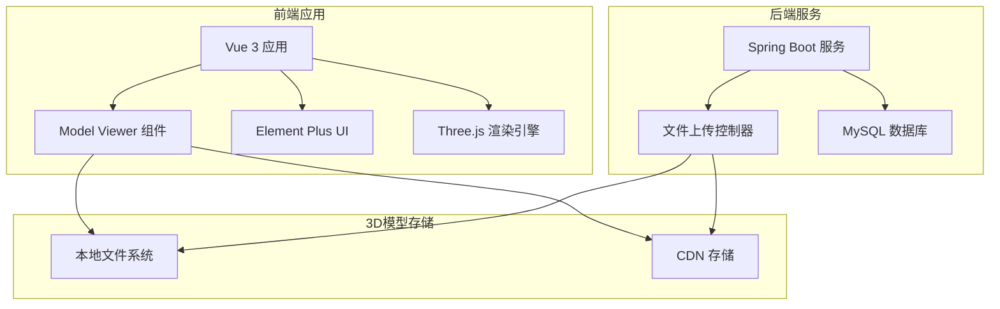
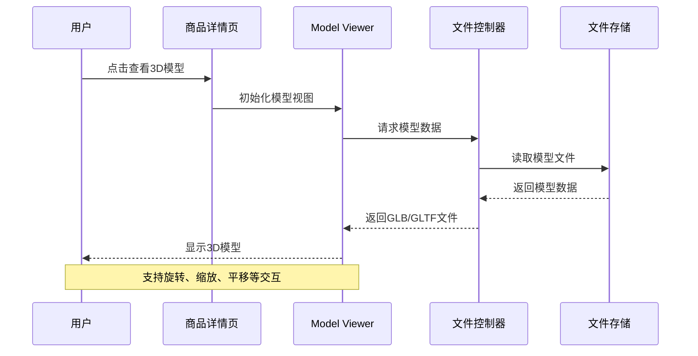
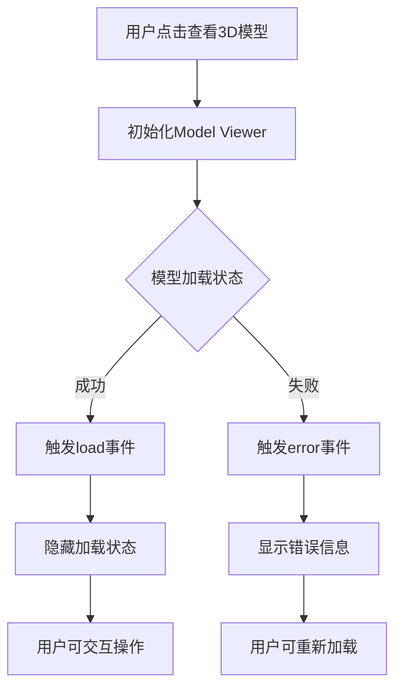
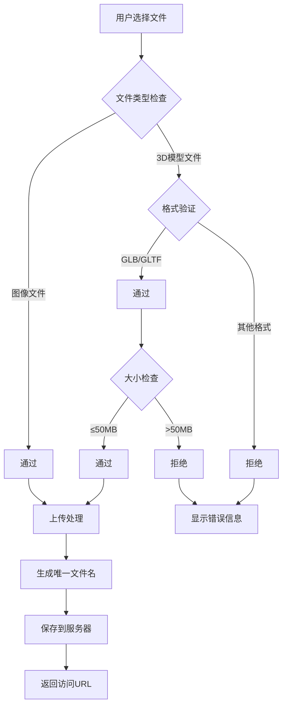
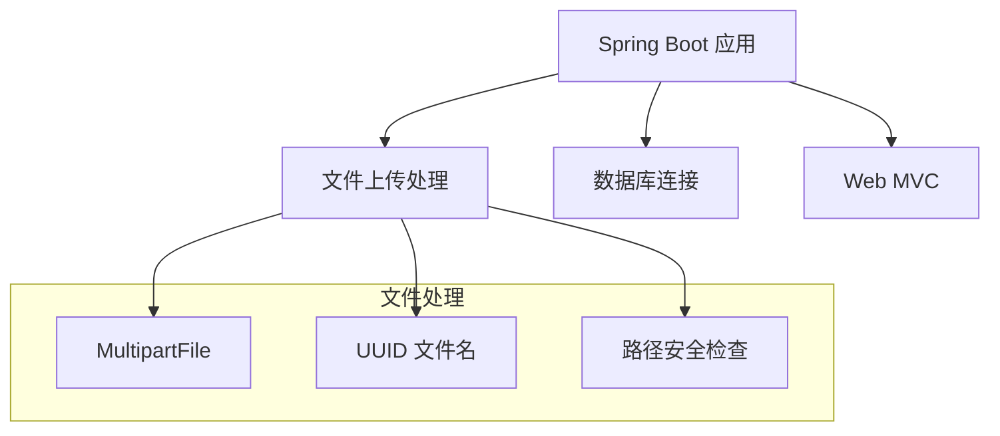

# 3D模型展示系统

<cite>
**本文档引用的文件**
- [ProductDetail.vue](file://frontend/src/views/ProductDetail.vue)
- [main.js](file://frontend/src/main.js)
- [shop.js](file://frontend/src/api/shop.js)
- [Products.vue（管理员）](file://frontend/src/views/admin/Products.vue)
- [Products.vue（商户）](file://frontend/src/views/merchant/Products.vue)
- [FileController.java](file://backend/src/main/java/com/heritage/controller/FileController.java)
- [application.yml](file://backend/src/main/resources/application.yml)
- [package.json](file://frontend/package.json)
- [vite.config.js](file://frontend/vite.config.js)
</cite>

## 目录
1. [引言](#引言)
2. [项目结构](#项目结构)
3. [核心组件](#核心组件)
4. [架构概览](#架构概览)
5. [详细组件分析](#详细组件分析)
6. [依赖关系分析](#依赖关系分析)
7. [性能考虑](#性能考虑)
8. [故障排除指南](#故障排除指南)
9. [结论](#结论)

## 引言

本系统为非遗产品智能定制商城的3D模型展示功能，基于Google Model Viewer和Three.js构建，提供GLTF/GLB模型的加载、材质处理和光照效果展示。系统支持用户在商品详情页查看3D模型，管理员和商户后台可以上传、预览和管理3D模型资产。

## 项目结构

前端采用Vue 3 + Vite架构，后端使用Spring Boot提供文件上传服务。3D模型展示通过Google Model Viewer组件实现，支持多种交互控制和优化策略。



**图表来源**
- [main.js](file://frontend/src/main.js#L1-L24)
- [FileController.java](file://backend/src/main/java/com/heritage/controller/FileController.java#L1-L62)

**章节来源**
- [main.js](file://frontend/src/main.js#L1-L24)
- [package.json](file://frontend/package.json#L1-L27)

## 核心组件

### Model Viewer集成组件

系统在多个页面集成了Model Viewer组件，提供统一的3D模型展示体验：

- **商品详情页**: 主要的3D模型展示入口
- **管理员后台**: 商品管理界面的3D模型预览
- **商户后台**: 商品编辑界面的实时预览

### 文件上传服务

后端提供统一的文件上传接口，支持3D模型文件的上传和管理：

- 支持GLB和GLTF格式
- 文件大小限制和类型验证
- 自动生成唯一文件名
- 安全的文件存储路径

**章节来源**
- [ProductDetail.vue](file://frontend/src/views/ProductDetail.vue#L80-L107)
- [Products.vue（管理员）](file://frontend/src/views/admin/Products.vue#L176-L202)
- [Products.vue（商户）](file://frontend/src/views/merchant/Products.vue#L176-L202)
- [FileController.java](file://backend/src/main/java/com/heritage/controller/FileController.java#L29-L60)

## 架构概览

系统采用前后端分离架构，3D模型展示通过Web组件实现，支持多种模型格式和交互控制。



**图表来源**
- [ProductDetail.vue](file://frontend/src/views/ProductDetail.vue#L80-L107)
- [shop.js](file://frontend/src/api/shop.js#L11-L16)
- [FileController.java](file://backend/src/main/java/com/heritage/controller/FileController.java#L29-L60)

## 详细组件分析

### Model Viewer配置详解

#### 基础配置参数

| 参数 | 默认值 | 说明 | 使用场景 |
|------|--------|------|----------|
| camera-controls | true | 启用相机控制 | 用户手动旋转模型 |
| auto-rotate | true | 自动旋转效果 | 展示模型外观 |
| shadow-intensity | 1 | 阴影强度 | 增强立体感 |
| exposure | 1 | 曝光度 | 调整亮度 |
| touch-action | pan-y | 触摸交互 | 移动端适配 |

#### 事件处理机制



**图表来源**
- [ProductDetail.vue](file://frontend/src/views/ProductDetail.vue#L177-L185)

#### 加载状态管理

系统实现了完整的加载状态管理机制：

- **加载中状态**: 显示"模型加载中..."提示
- **成功状态**: 隐藏加载提示，允许用户交互
- **错误状态**: 显示具体错误信息，支持重试

**章节来源**
- [ProductDetail.vue](file://frontend/src/views/ProductDetail.vue#L80-L107)
- [ProductDetail.vue](file://frontend/src/views/ProductDetail.vue#L177-L185)

### 文件上传与验证

#### 支持的文件格式

| 格式 | 扩展名 | 大小限制 | 用途 |
|------|--------|----------|------|
| GLB | .glb | 50MB | 二进制格式，包含所有资源 |
| GLTF | .gltf | 50MB | 文本格式，便于调试 |

#### 上传流程验证



**图表来源**
- [Products.vue（管理员）](file://frontend/src/views/admin/Products.vue#L176-L202)
- [Products.vue（商户）](file://frontend/src/views/merchant/Products.vue#L176-L202)

**章节来源**
- [Products.vue（管理员）](file://frontend/src/views/admin/Products.vue#L176-L202)
- [Products.vue（商户）](file://frontend/src/views/merchant/Products.vue#L176-L202)
- [FileController.java](file://backend/src/main/java/com/heritage/controller/FileController.java#L29-L60)

### 交互控制机制

#### 相机控制系统

Model Viewer提供了丰富的相机控制功能：

- **旋转控制**: 支持鼠标拖拽和触摸手势
- **缩放控制**: 支持滚轮和双指捏合
- **平移控制**: 支持右键拖拽和单指拖拽
- **自动旋转**: 可配置的自动旋转效果

#### 光照效果配置

系统通过以下参数控制光照效果：

- **环境光**: 提供基础照明
- **方向光**: 模拟太阳光效果
- **阴影**: 增强立体感和真实感
- **曝光**: 控制整体亮度

**章节来源**
- [ProductDetail.vue](file://frontend/src/views/ProductDetail.vue#L83-L95)

### 错误处理与降级策略

#### 错误分类处理

| 错误类型 | 处理方式 | 用户提示 |
|----------|----------|----------|
| 网络错误 | 重试机制 | "网络连接失败，请重试" |
| 文件格式错误 | 格式验证 | "不支持的文件格式" |
| 文件大小超限 | 大小检查 | "文件大小超出限制" |
| 服务器错误 | 服务端日志 | "服务器处理失败" |

#### 降级策略

当3D模型加载失败时，系统提供以下降级方案：

- 显示占位符图像
- 提供下载链接
- 显示详细错误信息
- 允许用户重新加载

**章节来源**
- [ProductDetail.vue](file://frontend/src/views/ProductDetail.vue#L182-L185)
- [Products.vue（管理员）](file://frontend/src/views/admin/Products.vue#L503-L506)

## 依赖关系分析

### 前端依赖关系

```mermaid
graph TD
A[Vue 3 应用] --> B[@google/model-viewer]
A --> C[three.js]
A --> D[element-plus]
B --> E[Web Components]
C --> F[Three.js 核心库]
D --> G[UI 组件库]
subgraph "运行时依赖"
H[浏览器 WebGL 支持]
I[现代 JavaScript 环境]
end
B --> H
C --> H
A --> I
```

**图表来源**
- [package.json](file://frontend/package.json#L10-L21)
- [main.js](file://frontend/src/main.js#L6)

### 后端依赖关系



**图表来源**
- [FileController.java](file://backend/src/main/java/com/heritage/controller/FileController.java#L1-L62)

**章节来源**
- [package.json](file://frontend/package.json#L10-L21)
- [FileController.java](file://backend/src/main/java/com/heritage/controller/FileController.java#L1-L62)

## 性能考虑

### 模型优化策略

#### 文件格式选择

- **GLB格式优势**: 包含所有资源，减少HTTP请求
- **GLTF格式优势**: 文本格式，便于调试和修改
- **压缩策略**: 使用纹理压缩和几何简化

#### 加载优化

- **延迟加载**: 首屏只加载必要资源
- **渐进式加载**: 先显示低质量版本再切换高质量版本
- **缓存策略**: 利用浏览器缓存机制

### 性能监控方案

#### 关键指标监控

| 指标类型 | 监控方法 | 阈值标准 |
|----------|----------|----------|
| 加载时间 | 性能API测量 | < 3秒 |
| 渲染帧率 | requestAnimationFrame | > 60 FPS |
| 内存使用 | Performance API | < 500MB |
| GPU使用 | WebGL 上下文 | < 90% |

#### 优化建议

- 实施LOD（Level of Detail）技术
- 使用Web Workers处理复杂计算
- 实现虚拟化渲染
- 采用分块加载策略

## 故障排除指南

### 常见问题诊断

#### 模型无法加载

**症状**: 页面显示"模型加载失败"

**排查步骤**:
1. 检查网络连接状态
2. 验证模型文件格式是否正确
3. 确认文件大小是否超出限制
4. 检查服务器文件权限

**解决方案**:
- 重新上传模型文件
- 检查文件完整性
- 联系技术支持

#### 交互功能异常

**症状**: 无法旋转或缩放模型

**排查步骤**:
1. 检查浏览器兼容性
2. 验证WebGL支持状态
3. 确认触摸事件处理
4. 检查CSS样式冲突

**解决方案**:
- 更新浏览器版本
- 禁用可能干扰的浏览器扩展
- 检查CSS z-index 设置

#### 性能问题

**症状**: 模型加载缓慢或卡顿

**排查步骤**:
1. 分析网络带宽使用情况
2. 检查模型文件大小
3. 监控内存使用情况
4. 评估GPU性能

**解决方案**:
- 优化模型文件大小
- 实施分层加载策略
- 调整渲染参数

**章节来源**
- [ProductDetail.vue](file://frontend/src/views/ProductDetail.vue#L182-L185)
- [Products.vue（管理员）](file://frontend/src/views/admin/Products.vue#L503-L506)

### 开发环境配置

#### 本地开发设置

1. **安装依赖包**:
   ```bash
   npm install
   ```

2. **启动开发服务器**:
   ```bash
   npm run dev
   ```

3. **配置代理设置**:
   - 前端: http://localhost:3030
   - 后端: http://localhost:8080

#### 生产环境部署

1. **构建应用**:
   ```bash
   npm run build
   ```

2. **配置静态资源**:
   - 配置CDN加速
   - 设置缓存策略
   - 优化文件压缩

3. **监控部署**:
   - 设置健康检查
   - 配置日志收集
   - 监控性能指标

**章节来源**
- [vite.config.js](file://frontend/vite.config.js#L12-L20)
- [application.yml](file://backend/src/main/resources/application.yml#L1-L63)

## 结论

本3D模型展示系统通过Google Model Viewer和Three.js的深度集成，为非遗产品智能定制商城提供了现代化的3D展示解决方案。系统具备以下优势：

1. **技术先进性**: 采用最新的Web 3D渲染技术
2. **用户体验**: 提供流畅的交互式3D浏览体验
3. **可扩展性**: 支持多种模型格式和自定义配置
4. **稳定性**: 完善的错误处理和降级策略
5. **性能优化**: 多层次的性能优化和监控机制

通过合理的架构设计和优化策略，系统能够有效支撑非遗文化的数字化展示和智能定制业务的发展需求。