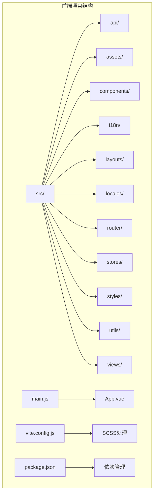
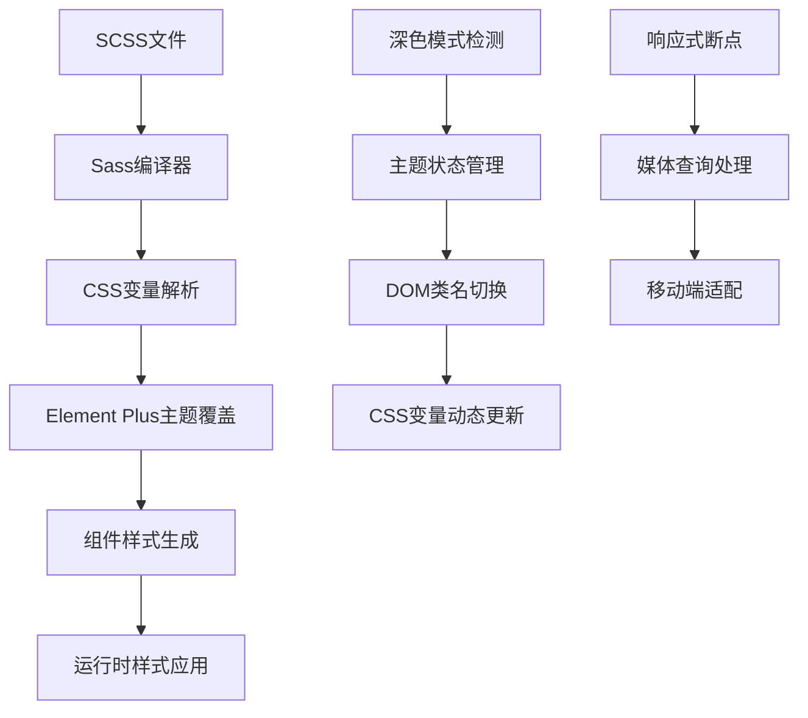
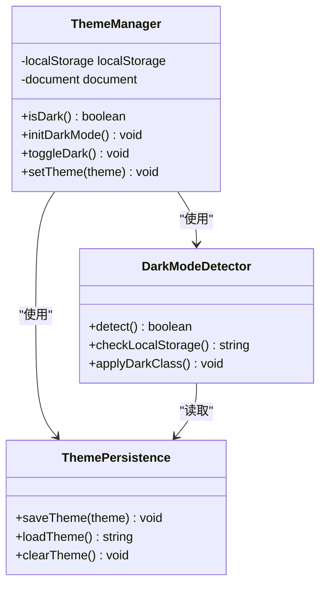
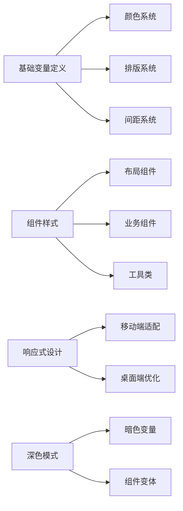
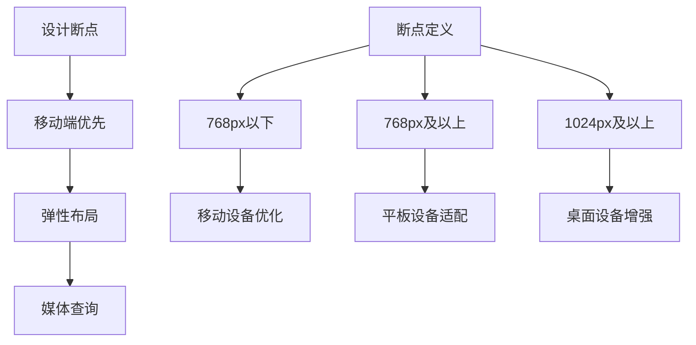

# 主题定制与样式系统

<cite>
**本文档引用的文件**
- [frontend/package.json](file://frontend/package.json)
- [frontend/vite.config.js](file://frontend/vite.config.js)
- [frontend/src/main.js](file://frontend/src/main.js)
- [frontend/src/App.vue](file://frontend/src/App.vue)
- [frontend/src/styles/main.scss](file://frontend/src/styles/main.scss)
- [frontend/src/utils/theme.js](file://frontend/src/utils/theme.js)
- [frontend/src/components/Header.vue](file://frontend/src/components/Header.vue)
</cite>

## 目录
1. [引言](#引言)
2. [项目结构](#项目结构)
3. [核心组件](#核心组件)
4. [架构概览](#架构概览)
5. [详细组件分析](#详细组件分析)
6. [依赖分析](#依赖分析)
7. [性能考虑](#性能考虑)
8. [故障排除指南](#故障排除指南)
9. [结论](#结论)

## 引言

非遗产品智能定制商城系统采用现代化的前端技术栈，基于Vue 3、Element Plus和SCSS构建主题定制与样式系统。本系统实现了完整的主题定制机制，包括CSS变量系统、深色模式支持、品牌色彩规范和响应式设计。

系统通过SCSS预处理器提供强大的样式编译能力，结合Element Plus的主题覆盖机制，实现了灵活的主题定制和组件样式隔离。同时，系统还集成了国际化支持和移动端适配功能。

## 项目结构

前端项目采用模块化组织方式，主要结构如下：



**图表来源**
- [frontend/src/main.js](file://frontend/src/main.js#L1-L25)
- [frontend/vite.config.js](file://frontend/vite.config.js#L1-L22)

**章节来源**
- [frontend/package.json](file://frontend/package.json#L1-L28)
- [frontend/vite.config.js](file://frontend/vite.config.js#L1-L22)

## 核心组件

### SCSS预处理器配置

系统使用Vite作为构建工具，集成Sass/SCSS支持。在package.json中配置了sass开发依赖，确保能够正确编译SCSS文件。

### CSS变量系统

系统建立了完整的CSS变量体系，包括基础颜色变量、文本颜色变量、边框颜色变量和背景颜色变量。这些变量统一管理品牌色彩规范，确保视觉一致性。

### Element Plus主题覆盖

通过导入Element Plus的暗色CSS变量文件，系统实现了对Element Plus组件库的深度定制。这种覆盖机制允许在不修改组件源码的情况下调整组件外观。

**章节来源**
- [frontend/src/styles/main.scss](file://frontend/src/styles/main.scss#L1-L174)
- [frontend/src/utils/theme.js](file://frontend/src/utils/theme.js#L1-L26)

## 架构概览

系统采用分层架构设计，从底层到顶层的样式处理流程如下：



**图表来源**
- [frontend/src/styles/main.scss](file://frontend/src/styles/main.scss#L1-L174)
- [frontend/src/utils/theme.js](file://frontend/src/utils/theme.js#L1-L26)

## 详细组件分析

### 主题管理系统

主题管理系统是整个样式系统的核心，负责深色模式的检测、切换和持久化存储。



**图表来源**
- [frontend/src/utils/theme.js](file://frontend/src/utils/theme.js#L1-L26)

#### 深色模式实现机制

深色模式通过CSS类名切换实现，主要逻辑包括：

1. **初始化检查**：从localStorage读取用户偏好设置
2. **类名切换**：通过classList.toggle方法在html元素上添加或移除'dark'类
3. **状态持久化**：将当前主题状态保存到localStorage
4. **实时响应**：CSS变量根据类名变化自动更新

**章节来源**
- [frontend/src/utils/theme.js](file://frontend/src/utils/theme.js#L1-L26)

### 全局样式管理

全局样式通过main.scss文件统一管理，采用模块化设计原则：



**图表来源**
- [frontend/src/styles/main.scss](file://frontend/src/styles/main.scss#L1-L174)

#### 品牌色彩规范

系统建立了完整的品牌色彩体系：

| 色彩类别 | 变量名称 | 颜色值 | 使用场景 |
|---------|---------|--------|----------|
| 主色调 | `--primary-color` | #409EFF | 主要按钮、链接、重要信息 |
| 成功色 | `--success-color` | #67C23A | 成功状态、确认操作 |
| 警告色 | `--warning-color` | #E6A23C | 警告提示、注意信息 |
| 危险色 | `--danger-color` | #F56C6C | 错误状态、删除操作 |
| 辅助色 | `--info-color` | #909399 | 一般信息、辅助文字 |

**章节来源**
- [frontend/src/styles/main.scss](file://frontend/src/styles/main.scss#L3-L18)

### 组件样式隔离

系统采用多种策略确保组件样式隔离：

#### 深度选择器使用

在Header组件中，使用`:deep()`选择器来作用于Element Plus内部结构：

```scss
:deep(.header-menu.el-menu--horizontal) {
    // 菜单样式
}

:deep(.header-menu.el-menu--horizontal .el-menu-item) {
    // 菜单项样式
}
```

#### 作用域样式

每个Vue组件都具有独立的作用域样式，避免样式泄漏：

```vue
<style scoped>
/* 组件特定样式 */
</style>
```

**章节来源**
- [frontend/src/components/Header.vue](file://frontend/src/components/Header.vue#L247-L282)

### 响应式设计实现

系统实现了完整的响应式设计体系：



**图表来源**
- [frontend/src/components/Header.vue](file://frontend/src/components/Header.vue#L211-L215)

#### 移动端适配策略

针对768px以下屏幕的特殊处理：

- 减少内边距和外边距
- 调整字体大小和行高
- 优化触摸目标尺寸
- 简化导航结构

**章节来源**
- [frontend/src/components/Header.vue](file://frontend/src/components/Header.vue#L211-L215)

## 依赖分析

系统依赖关系清晰明确，主要依赖包括：

```mermaid
graph TB
subgraph "运行时依赖"
A[Vue 3.3.4] --> B[核心框架]
C[Element Plus 2.4.4] --> D[UI组件库]
E[Axios 1.6.2] --> F[HTTP客户端]
G[Vue Router 4.2.5] --> H[路由管理]
I[Pinia 2.1.7] --> J[状态管理]
end
subgraph "开发时依赖"
K[Vite 5.0.10] --> L[构建工具]
M[Sass 1.69.5] --> N[SCSS编译]
O[@vitejs/plugin-vue 4.5.2] --> P[Vue支持]
end
Q[Google Model Viewer] --> R[3D模型展示]
S[Three.js 0.172.0] --> T[3D渲染引擎]
U[Vue i18n 9.14.5] --> V[国际化支持]
```

**图表来源**
- [frontend/package.json](file://frontend/package.json#L10-L26)

**章节来源**
- [frontend/package.json](file://frontend/package.json#L1-L28)

## 性能考虑

### 样式加载优化

1. **按需加载**：Element Plus组件按需引入，减少初始包体积
2. **CSS压缩**：生产环境自动压缩CSS文件
3. **缓存策略**：合理利用浏览器缓存机制

### 渲染性能优化

1. **CSS变量计算**：使用CSS变量减少JavaScript计算开销
2. **硬件加速**：合理使用transform和opacity属性
3. **选择器优化**：避免复杂的选择器嵌套

### 包体积控制

通过依赖管理和代码分割，控制最终打包体积在合理范围内。

## 故障排除指南

### 常见问题及解决方案

#### 主题切换无效

**问题描述**：深色模式切换后样式没有变化

**可能原因**：
1. localStorage数据损坏
2. CSS变量未正确更新
3. 浏览器缓存问题

**解决步骤**：
1. 检查localStorage中的theme键值
2. 刷新页面强制重新计算CSS变量
3. 清除浏览器缓存后重试

#### Element Plus样式冲突

**问题描述**：自定义样式影响Element Plus组件外观

**解决方法**：
1. 使用`:deep()`选择器进行样式穿透
2. 提高CSS选择器特异性
3. 避免全局样式污染

#### 响应式布局异常

**问题描述**：移动端显示效果不符合预期

**排查步骤**：
1. 检查媒体查询断点设置
2. 验证视口meta标签配置
3. 测试不同设备分辨率

**章节来源**
- [frontend/src/utils/theme.js](file://frontend/src/utils/theme.js#L1-L26)
- [frontend/src/styles/main.scss](file://frontend/src/styles/main.scss#L1-L174)

## 结论

非遗产品智能定制商城系统的主题定制与样式系统展现了现代前端开发的最佳实践。通过SCSS预处理器、CSS变量系统和Element Plus主题覆盖机制的有机结合，实现了高度可定制的视觉体验。

系统的主要优势包括：

1. **统一的色彩管理体系**：通过CSS变量实现品牌色彩的一致性
2. **灵活的主题切换**：深色模式与浅色模式无缝切换
3. **完整的响应式支持**：移动端和桌面端的优化适配
4. **组件化样式隔离**：避免样式冲突，提高维护性
5. **性能优化策略**：合理的加载和渲染优化

这套样式系统为非遗产品的数字化展示提供了专业的视觉基础，同时也为未来的功能扩展和界面定制奠定了坚实的技术基础。