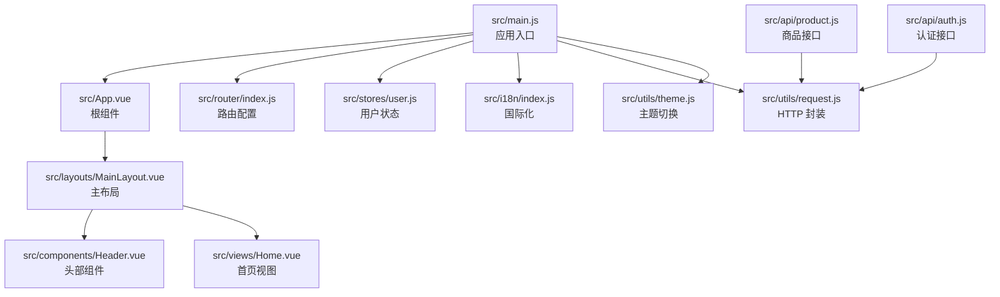
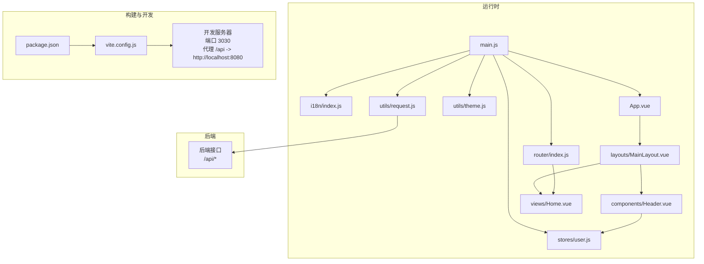
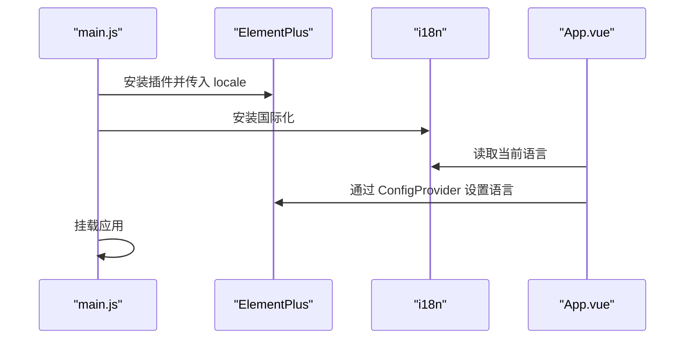
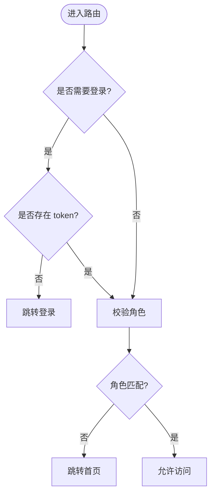
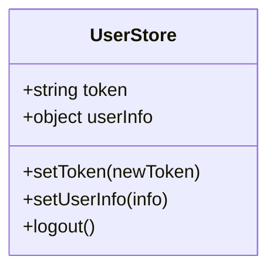
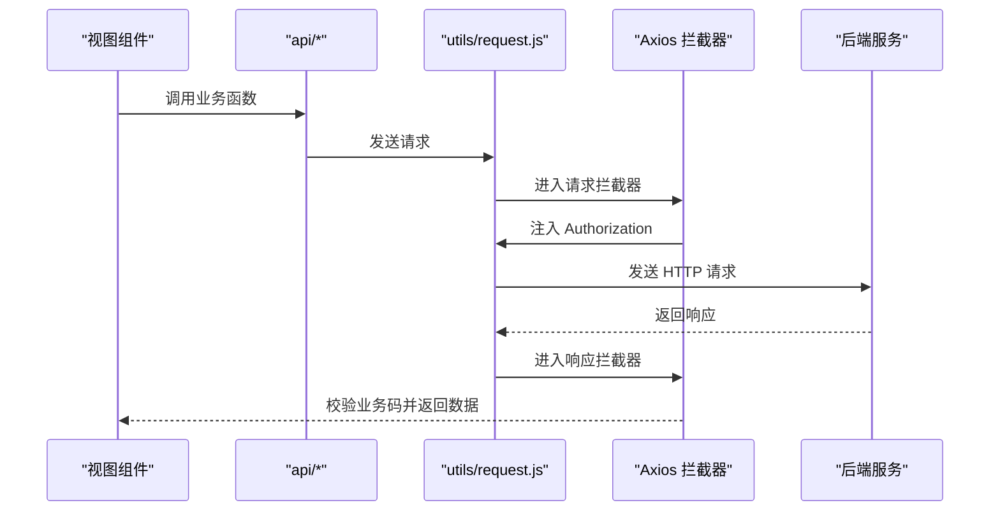
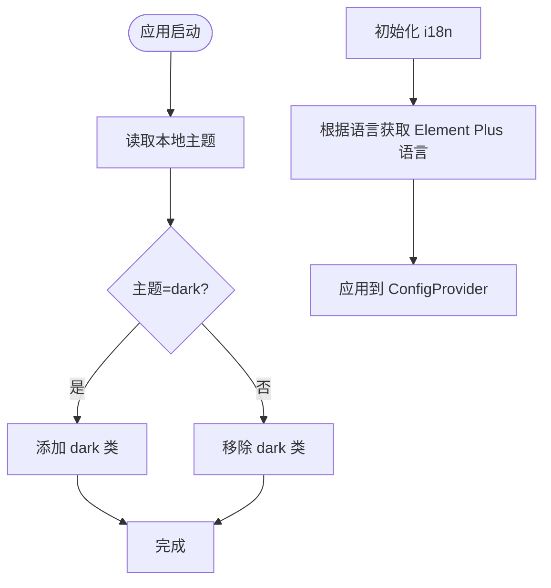
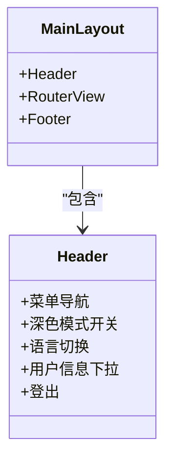
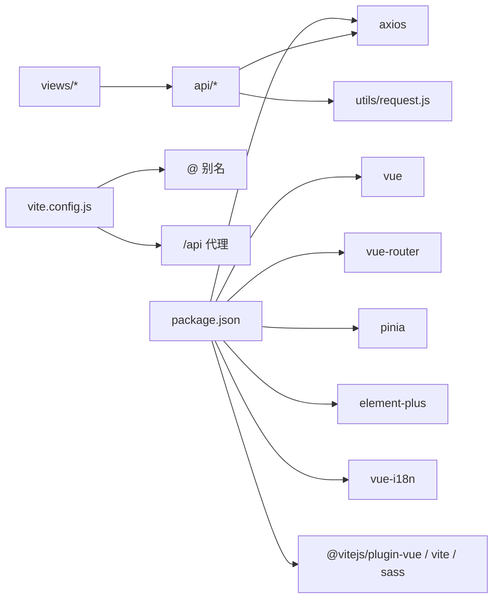

# 前端架构设计

<cite>
**本文引用的文件**
- [package.json](file://frontend/package.json)
- [vite.config.js](file://frontend/vite.config.js)
- [main.js](file://frontend/src/main.js)
- [App.vue](file://frontend/src/App.vue)
- [router/index.js](file://frontend/src/router/index.js)
- [i18n/index.js](file://frontend/src/i18n/index.js)
- [stores/user.js](file://frontend/src/stores/user.js)
- [utils/request.js](file://frontend/src/utils/request.js)
- [utils/theme.js](file://frontend/src/utils/theme.js)
- [styles/main.scss](file://frontend/src/styles/main.scss)
- [layouts/MainLayout.vue](file://frontend/src/layouts/MainLayout.vue)
- [components/Header.vue](file://frontend/src/components/Header.vue)
- [views/Home.vue](file://frontend/src/views/Home.vue)
- [api/product.js](file://frontend/src/api/product.js)
- [api/auth.js](file://frontend/src/api/auth.js)
</cite>

## 目录
1. [引言](#引言)
2. [项目结构](#项目结构)
3. [核心组件](#核心组件)
4. [架构总览](#架构总览)
5. [详细组件分析](#详细组件分析)
6. [依赖关系分析](#依赖关系分析)
7. [性能考虑](#性能考虑)
8. [故障排查指南](#故障排查指南)
9. [结论](#结论)
10. [附录](#附录)

## 引言
本设计文档面向“非遗产品智能定制商城”系统的前端架构，围绕基于 Vue 3 + Element Plus 的现代化前端体系展开，系统性阐述应用初始化流程、插件与构建工具配置、组件化与模块化组织、依赖管理策略、国际化与主题定制、以及开发与生产环境的优化与部署建议。文档旨在帮助开发者快速理解并高效扩展该前端工程。

## 项目结构
前端工程采用典型的单页应用（SPA）目录组织方式，以功能域驱动模块划分，结合路由与状态管理实现清晰的职责边界与可维护性。

- 根目录与关键文件
  - package.json：定义脚本、依赖与版本信息
  - vite.config.js：Vite 构建与开发服务器配置
  - src/main.js：应用入口，负责插件安装与全局挂载
  - src/App.vue：根组件，提供全局样式与 Element Plus 国际化桥接
  - src/router/index.js：路由定义与导航守卫
  - src/stores/user.js：用户状态管理（Pinia）
  - src/utils/request.js：HTTP 请求封装与拦截器
  - src/utils/theme.js：深色/浅色主题切换
  - src/styles/main.scss：全局样式与 Element Plus 深色变量
  - src/i18n/index.js：国际化配置与 Element Plus 语言映射
  - src/layouts/*：布局组件（主站、管理后台、商户后台）
  - src/components/*：通用组件（头部、底部、分页等）
  - src/views/*：页面视图（首页、商品、定制、个人中心等）
  - src/api/*：业务接口封装（按领域拆分）

图表来源
- [main.js](file://frontend/src/main.js#L1-L25)
- [App.vue](file://frontend/src/App.vue#L1-L40)
- [router/index.js](file://frontend/src/router/index.js#L1-L176)
- [stores/user.js](file://frontend/src/stores/user.js#L1-L33)
- [i18n/index.js](file://frontend/src/i18n/index.js#L1-L24)
- [utils/request.js](file://frontend/src/utils/request.js#L1-L45)
- [utils/theme.js](file://frontend/src/utils/theme.js#L1-L26)
- [layouts/MainLayout.vue](file://frontend/src/layouts/MainLayout.vue#L1-L28)
- [components/Header.vue](file://frontend/src/components/Header.vue#L1-L283)
- [views/Home.vue](file://frontend/src/views/Home.vue#L1-L649)
- [api/product.js](file://frontend/src/api/product.js#L1-L71)
- [api/auth.js](file://frontend/src/api/auth.js#L1-L132)

章节来源
- [package.json](file://frontend/package.json#L1-L28)
- [vite.config.js](file://frontend/vite.config.js#L1-L22)

## 核心组件
- 应用入口与初始化
  - 创建 Vue 应用实例，安装 Pinia、路由、国际化、Element Plus，并挂载到 DOM
  - 动态注册 Element Plus 图标组件，统一在模板中使用
- 根组件与国际化桥接
  - 使用 Element Plus ConfigProvider 包裹，将 i18n 语言切换映射到 Element Plus 组件语言
- 路由与权限控制
  - 定义多级嵌套路由，支持登录、首页、商品、定制、个人中心、购物车、订单等页面
  - 导航前置守卫实现登录态校验与角色权限控制（ADMIN/MERCHANT）
- 状态管理
  - 用户令牌与用户信息持久化存储于本地，提供登录、登出、信息更新方法
- HTTP 与拦截器
  - 统一设置基础路径与超时；自动注入 Authorization 头；对响应进行统一错误提示与业务码校验
- 主题与国际化
  - 支持深色/浅色主题切换与本地持久化；国际化支持中英双语，Element Plus 语言同步

章节来源
- [main.js](file://frontend/src/main.js#L1-L25)
- [App.vue](file://frontend/src/App.vue#L1-L40)
- [router/index.js](file://frontend/src/router/index.js#L147-L173)
- [stores/user.js](file://frontend/src/stores/user.js#L1-L33)
- [utils/request.js](file://frontend/src/utils/request.js#L1-L45)
- [utils/theme.js](file://frontend/src/utils/theme.js#L1-L26)
- [i18n/index.js](file://frontend/src/i18n/index.js#L1-L24)

## 架构总览
整体采用“入口装配 + 路由驱动 + 状态管理 + 接口封装”的分层架构，配合 Vite 提供的热更新与按需打包能力，实现开发体验与构建效率的平衡。

图表来源
- [main.js](file://frontend/src/main.js#L1-L25)
- [router/index.js](file://frontend/src/router/index.js#L1-L176)
- [stores/user.js](file://frontend/src/stores/user.js#L1-L33)
- [i18n/index.js](file://frontend/src/i18n/index.js#L1-L24)
- [utils/request.js](file://frontend/src/utils/request.js#L1-L45)
- [utils/theme.js](file://frontend/src/utils/theme.js#L1-L26)
- [App.vue](file://frontend/src/App.vue#L1-L40)
- [layouts/MainLayout.vue](file://frontend/src/layouts/MainLayout.vue#L1-L28)
- [components/Header.vue](file://frontend/src/components/Header.vue#L1-L283)
- [views/Home.vue](file://frontend/src/views/Home.vue#L1-L649)
- [package.json](file://frontend/package.json#L5-L8)
- [vite.config.js](file://frontend/vite.config.js#L12-L20)

## 详细组件分析

### 应用初始化流程
- 入口装配顺序
  - 注册 Element Plus 图标组件
  - 安装 Pinia、路由、国际化、Element Plus（传入当前语言）
  - 加载全局样式与第三方模型查看器
  - 挂载应用
- 国际化桥接
  - 根组件通过计算属性将 i18n 语言映射到 Element Plus 语言对象，确保 UI 组件语言一致

图表来源
- [main.js](file://frontend/src/main.js#L15-L22)
- [App.vue](file://frontend/src/App.vue#L7-L11)
- [i18n/index.js](file://frontend/src/i18n/index.js#L20-L23)

章节来源
- [main.js](file://frontend/src/main.js#L1-L25)
- [App.vue](file://frontend/src/App.vue#L1-L40)
- [i18n/index.js](file://frontend/src/i18n/index.js#L1-L24)

### 路由与权限控制
- 路由结构
  - 主站布局：首页、非遗文化、商品、定制、个人中心、购物车、订单
  - 管理后台：用户管理、商品管理、非遗文化管理
  - 商家后台：商品管理
  - 登录页与兜底页
- 权限控制
  - requiresAuth：需要登录
  - requiresAdmin / requiresMerchant：角色限制
  - 未满足条件重定向至首页或登录页

图表来源
- [router/index.js](file://frontend/src/router/index.js#L147-L173)

章节来源
- [router/index.js](file://frontend/src/router/index.js#L1-L176)

### 状态管理（用户）
- 数据模型
  - token：字符串，本地持久化
  - userInfo：对象，本地持久化
- 方法
  - setToken、setUserInfo：写入本地存储
  - logout：清空本地存储并重置状态
- 使用场景
  - 登录成功写入 token 与用户信息
  - 导航守卫读取 token 判断登录态
  - 头部组件读取用户信息展示头像与下拉菜单

图表来源
- [stores/user.js](file://frontend/src/stores/user.js#L4-L32)

章节来源
- [stores/user.js](file://frontend/src/stores/user.js#L1-L33)

### HTTP 请求封装与拦截器
- 基础配置
  - baseURL：后端服务地址
  - 超时：未设置（默认无限）
- 请求拦截
  - 自动附加 Authorization 头（Bearer token）
- 响应拦截
  - 业务码校验：非 200 统一弹窗提示
  - 特定接口错误提示增强（如商品图片相关）
  - 网络错误统一提示
- 接口封装
  - 按领域拆分（商品、认证、订单、支付、AI 图像等），统一通过 request 发起

图表来源
- [utils/request.js](file://frontend/src/utils/request.js#L4-L42)
- [api/product.js](file://frontend/src/api/product.js#L1-L71)
- [api/auth.js](file://frontend/src/api/auth.js#L1-L132)

章节来源
- [utils/request.js](file://frontend/src/utils/request.js#L1-L45)
- [api/product.js](file://frontend/src/api/product.js#L1-L71)
- [api/auth.js](file://frontend/src/api/auth.js#L1-L132)

### 主题与国际化
- 主题
  - 深色/浅色模式切换，本地持久化
  - 初始化时根据本地存储设置主题
- 国际化
  - 中英双语，Element Plus 语言同步
  - 语言切换时更新 Element Plus 组件语言

图表来源
- [utils/theme.js](file://frontend/src/utils/theme.js#L3-L15)
- [i18n/index.js](file://frontend/src/i18n/index.js#L20-L23)
- [App.vue](file://frontend/src/App.vue#L7-L11)

章节来源
- [utils/theme.js](file://frontend/src/utils/theme.js#L1-L26)
- [i18n/index.js](file://frontend/src/i18n/index.js#L1-L24)
- [App.vue](file://frontend/src/App.vue#L1-L40)

### 布局与头部组件
- 布局
  - MainLayout：包含 Header、主内容区、Footer，主内容区占满剩余高度
- 头部
  - 左侧品牌与菜单，中间主导航菜单，右侧深色模式切换、语言切换、用户信息下拉
  - 根据用户角色显示不同管理入口
  - 登录/注册按钮与登出逻辑

图表来源
- [layouts/MainLayout.vue](file://frontend/src/layouts/MainLayout.vue#L1-L28)
- [components/Header.vue](file://frontend/src/components/Header.vue#L1-L283)

章节来源
- [layouts/MainLayout.vue](file://frontend/src/layouts/MainLayout.vue#L1-L28)
- [components/Header.vue](file://frontend/src/components/Header.vue#L1-L283)

### 首页视图与数据加载
- 功能概览
  - 首屏横幅、特色板块、热门商品、非遗文化、统计信息
  - 并行加载多个接口数据，提升首屏性能
- 关键点
  - 使用 Promise.allSettled 并行请求，避免部分失败影响整体
  - 对商品封面图与头像 URL 进行规范化处理
  - 使用 Element Plus 的 Loading 与 Empty 组件优化用户体验

章节来源
- [views/Home.vue](file://frontend/src/views/Home.vue#L1-L649)

## 依赖关系分析
- 依赖分层
  - 运行时依赖：Vue 3、Element Plus、Vue Router、Pinia、axios、vue-i18n、three、@google/model-viewer
  - 开发依赖：Vite、@vitejs/plugin-vue、sass
- 构建与开发
  - Vite 插件链：Vue 插件 + 路径别名（@ -> src）
  - 开发服务器：端口 3030，/api 代理到后端 8080
- 模块耦合
  - 视图组件通过 API 层与后端交互，避免直接依赖具体接口实现
  - 路由与状态管理解耦，权限控制集中在导航守卫

图表来源
- [package.json](file://frontend/package.json#L10-L26)
- [vite.config.js](file://frontend/vite.config.js#L7-L20)
- [utils/request.js](file://frontend/src/utils/request.js#L1-L45)
- [api/product.js](file://frontend/src/api/product.js#L1-L71)
- [api/auth.js](file://frontend/src/api/auth.js#L1-L132)

章节来源
- [package.json](file://frontend/package.json#L1-L28)
- [vite.config.js](file://frontend/vite.config.js#L1-L22)

## 性能考虑
- 构建与打包
  - 使用 Vite 的原生 ES 模块与按需编译，减少打包体积与启动时间
  - 合理拆分异步路由组件，降低首屏 JS 体积
- 网络与缓存
  - 并行加载多个接口数据，缩短首屏等待时间
  - 对图片与头像 URL 进行规范化处理，避免重复请求
- UI 与交互
  - 在长列表与复杂视图中使用 Loading 与骨架屏，提升感知性能
  - 合理使用 Element Plus 组件的懒加载与虚拟滚动（如表格）
- 主题与样式
  - 使用 CSS 变量与 SCSS 模块化，避免全局污染
  - 深色模式通过类切换实现，避免重复渲染

## 故障排查指南
- 登录态失效
  - 现象：进入受保护页面被重定向至登录
  - 排查：检查本地 token 是否存在；导航守卫是否正确判断
- 权限不足
  - 现象：访问管理后台或商户后台被重定向
  - 排查：确认用户角色是否为 ADMIN 或 MERCHANT
- 接口报错
  - 现象：统一错误提示或业务错误提示
  - 排查：查看响应码与消息；特定接口（如商品图片）有增强提示
- 代理失败
  - 现象：/api 请求 404 或跨域
  - 排查：确认开发服务器代理配置与后端服务端口一致

章节来源
- [router/index.js](file://frontend/src/router/index.js#L147-L173)
- [utils/request.js](file://frontend/src/utils/request.js#L22-L42)
- [vite.config.js](file://frontend/vite.config.js#L14-L19)

## 结论
该前端架构以 Vue 3 为核心，结合 Element Plus、Pinia、Vue Router 与 Vite，实现了高内聚、低耦合的模块化组织与清晰的职责边界。通过统一的请求封装、国际化与主题管理、路由权限控制，系统具备良好的可维护性与扩展性。建议在后续迭代中持续优化资源加载策略、完善错误监控与埋点，并逐步引入类型系统与自动化测试，以进一步提升质量与交付效率。

## 附录
- 开发环境配置
  - 启动命令：dev（端口 3030）、build（生产构建）、preview（预览构建产物）
  - 代理规则：/api -> http://localhost:8080
- 生产环境优化建议
  - 启用压缩与 Tree Shaking（Vite 默认开启）
  - 分包策略：将第三方库与业务代码分离
  - 静态资源 CDN 化与缓存策略
- 部署策略
  - 构建产物部署至 Nginx/Apache 静态目录
  - 配置反向代理与缓存头
  - 与后端联调，确保 /api 代理与 CORS 正常

章节来源
- [package.json](file://frontend/package.json#L5-L8)
- [vite.config.js](file://frontend/vite.config.js#L12-L20)