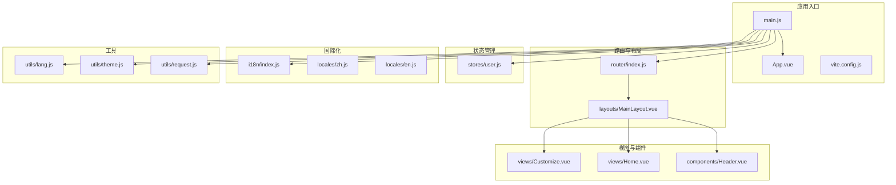
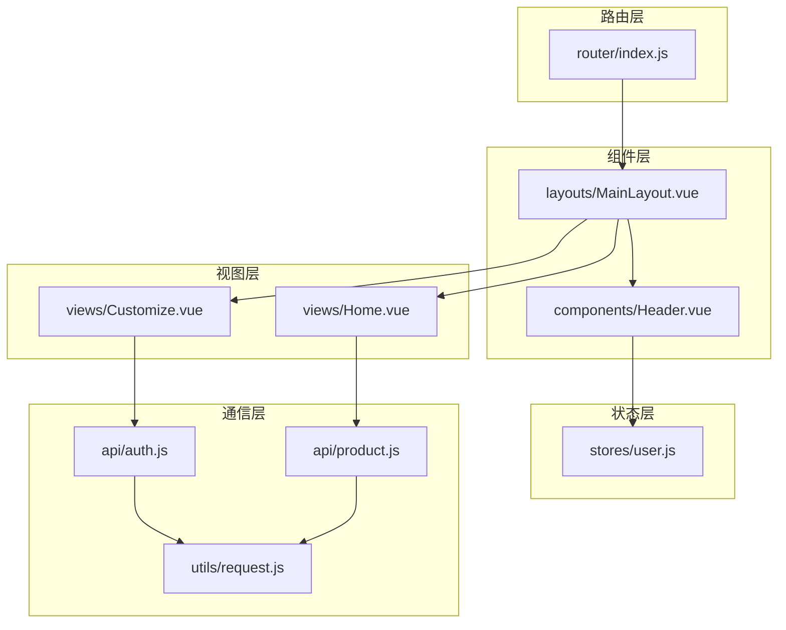
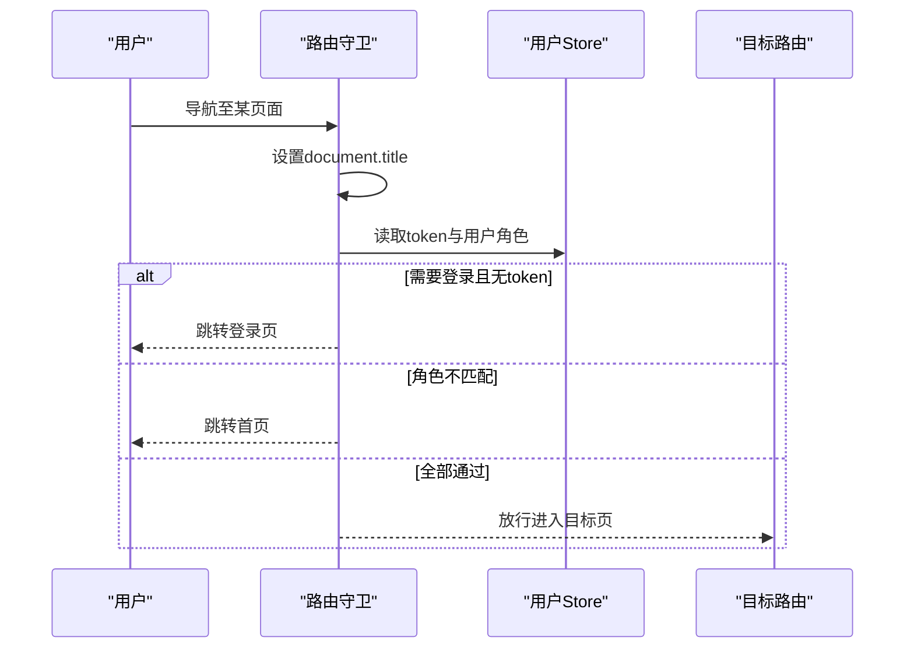
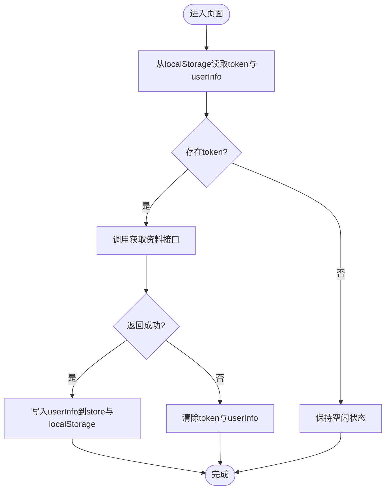
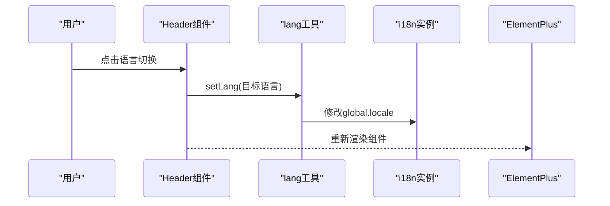
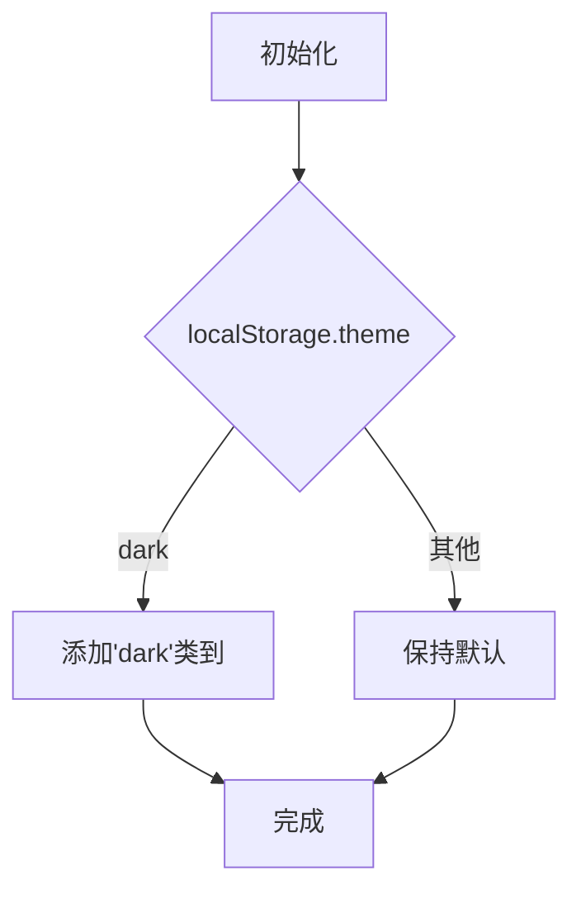
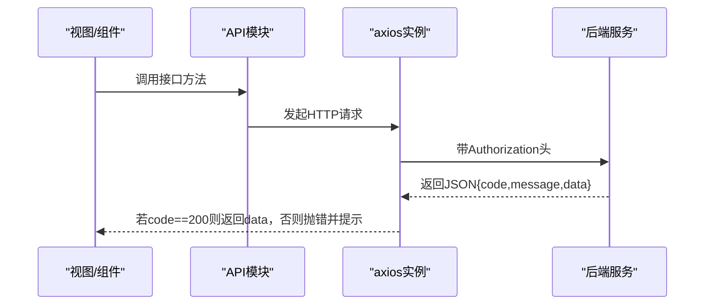
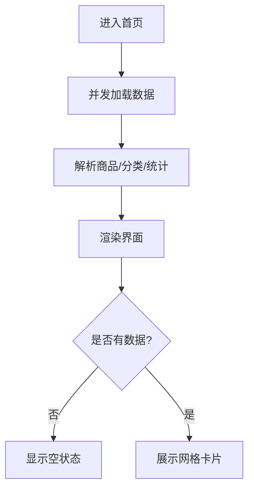
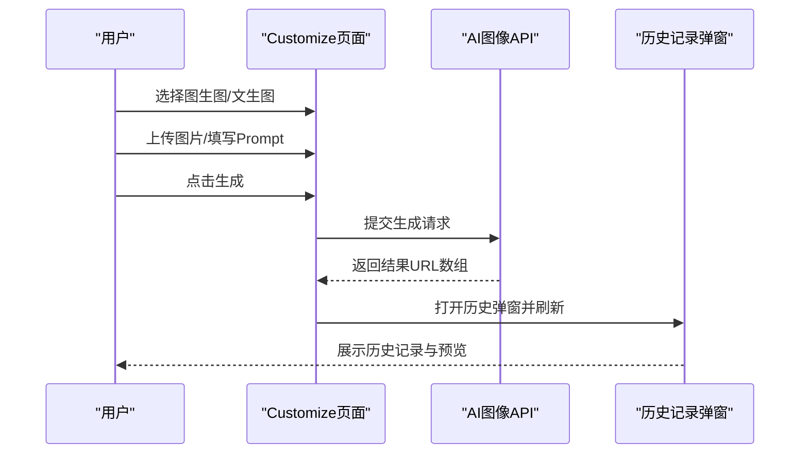
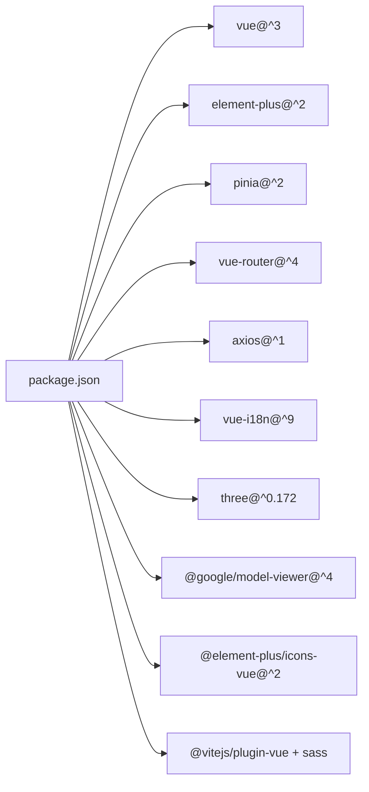

# 前端系统设计

<cite>
**本文引用的文件**
- [package.json](file://frontend/package.json)
- [main.js](file://frontend/src/main.js)
- [App.vue](file://frontend/src/App.vue)
- [vite.config.js](file://frontend/vite.config.js)
- [router/index.js](file://frontend/src/router/index.js)
- [stores/user.js](file://frontend/src/stores/user.js)
- [i18n/index.js](file://frontend/src/i18n/index.js)
- [locales/zh.js](file://frontend/src/locales/zh.js)
- [locales/en.js](file://frontend/src/locales/en.js)
- [utils/theme.js](file://frontend/src/utils/theme.js)
- [layouts/MainLayout.vue](file://frontend/src/layouts/MainLayout.vue)
- [components/Header.vue](file://frontend/src/components/Header.vue)
- [api/auth.js](file://frontend/src/api/auth.js)
- [api/product.js](file://frontend/src/api/product.js)
- [views/Home.vue](file://frontend/src/views/Home.vue)
- [views/Customize.vue](file://frontend/src/views/Customize.vue)
- [utils/request.js](file://frontend/src/utils/request.js)
- [utils/lang.js](file://frontend/src/utils/lang.js)
</cite>

## 目录
1. [引言](#引言)
2. [项目结构](#项目结构)
3. [核心组件](#核心组件)
4. [架构总览](#架构总览)
5. [详细组件分析](#详细组件分析)
6. [依赖关系分析](#依赖关系分析)
7. [性能考虑](#性能考虑)
8. [故障排查指南](#故障排查指南)
9. [结论](#结论)
10. [附录](#附录)

## 引言
本设计文档面向“非遗产品智能定制商城系统”的前端部分，基于 Vue 3 + Element Plus 技术栈，系统性阐述组件化开发模式、响应式状态管理与路由设计策略；明确页面布局组件、业务组件封装与 UI 组件库使用规范；深入解析 Pinia 状态管理的数据流机制；并给出国际化支持、主题切换与 3D 模型展示等高级功能的实现方案。文档同时提供组件设计原则、样式规范与用户体验优化策略，帮助开发者在保持一致性的同时提升可维护性与扩展性。

## 项目结构
前端采用 Vite 构建工具，目录组织遵循“按功能域分层 + 组件化”的方式：
- 应用入口与全局配置：main.js、App.vue、vite.config.js
- 路由与布局：router/index.js、layouts/*.vue
- 状态管理：stores/user.js
- 国际化：i18n/index.js、locales/*.js
- 工具函数：utils/request.js、utils/theme.js、utils/lang.js
- 视图与组件：views/*.vue、components/*.vue
- API 封装：api/*.js

图表来源
- [main.js](file://frontend/src/main.js#L1-L25)
- [App.vue](file://frontend/src/App.vue#L1-L40)
- [vite.config.js](file://frontend/vite.config.js#L1-L22)
- [router/index.js](file://frontend/src/router/index.js#L1-L176)
- [layouts/MainLayout.vue](file://frontend/src/layouts/MainLayout.vue#L1-L28)
- [stores/user.js](file://frontend/src/stores/user.js#L1-L33)
- [i18n/index.js](file://frontend/src/i18n/index.js#L1-L24)
- [locales/zh.js](file://frontend/src/locales/zh.js#L1-L45)
- [locales/en.js](file://frontend/src/locales/en.js#L1-L45)
- [utils/request.js](file://frontend/src/utils/request.js#L1-L45)
- [utils/theme.js](file://frontend/src/utils/theme.js#L1-L26)
- [utils/lang.js](file://frontend/src/utils/lang.js#L1-L9)
- [views/Home.vue](file://frontend/src/views/Home.vue#L1-L649)
- [views/Customize.vue](file://frontend/src/views/Customize.vue#L1-L1014)
- [components/Header.vue](file://frontend/src/components/Header.vue#L1-L283)

章节来源
- [package.json](file://frontend/package.json#L1-L28)
- [vite.config.js](file://frontend/vite.config.js#L1-L22)

## 核心组件
- 应用根组件与全局注入：在应用根组件中完成 Element Plus、国际化、路由、Pinia 的安装与挂载，并通过 Config Provider 实现语言切换联动。
- 主布局组件：MainLayout 负责头部、主内容区与页脚的整体排版，统一承载导航与页面内容。
- 头部导航组件：Header 集成菜单、语言切换、主题切换、用户下拉菜单与登出逻辑，具备权限控制与头像地址规范化处理。
- 用户状态存储：Pinia Store 封装 token 与用户信息的本地持久化与读取，提供登出清理能力。
- 国际化与主题：i18n 提供中英双语消息与 Element Plus 语言包映射；theme 工具负责暗黑模式初始化与切换。
- 请求封装：axios 实例统一设置基础路径与超时，拦截器处理鉴权头与错误提示。

章节来源
- [main.js](file://frontend/src/main.js#L1-L25)
- [App.vue](file://frontend/src/App.vue#L1-L40)
- [layouts/MainLayout.vue](file://frontend/src/layouts/MainLayout.vue#L1-L28)
- [components/Header.vue](file://frontend/src/components/Header.vue#L1-L283)
- [stores/user.js](file://frontend/src/stores/user.js#L1-L33)
- [i18n/index.js](file://frontend/src/i18n/index.js#L1-L24)
- [utils/theme.js](file://frontend/src/utils/theme.js#L1-L26)
- [utils/request.js](file://frontend/src/utils/request.js#L1-L45)

## 架构总览
系统采用“单页应用 + 组件化 + 状态集中管理”的架构：
- 路由层：基于 Vue Router 4 的 History 模式，定义多级嵌套路由与权限守卫。
- 视图层：各页面视图以功能域划分，如首页、定制页、商品页等。
- 组件层：通用布局与业务组件分离，Header 作为横切关注点复用。
- 状态层：Pinia Store 管理用户态，结合本地存储实现持久化。
- 通信层：API 层对 axios 进行二次封装，统一处理鉴权与错误提示。
- 外观层：Element Plus 提供 UI 组件库，配合自定义样式与暗黑模式。

图表来源
- [router/index.js](file://frontend/src/router/index.js#L1-L176)
- [layouts/MainLayout.vue](file://frontend/src/layouts/MainLayout.vue#L1-L28)
- [components/Header.vue](file://frontend/src/components/Header.vue#L1-L283)
- [views/Home.vue](file://frontend/src/views/Home.vue#L1-L649)
- [views/Customize.vue](file://frontend/src/views/Customize.vue#L1-L1014)
- [stores/user.js](file://frontend/src/stores/user.js#L1-L33)
- [api/auth.js](file://frontend/src/api/auth.js#L1-L132)
- [api/product.js](file://frontend/src/api/product.js#L1-L71)
- [utils/request.js](file://frontend/src/utils/request.js#L1-L45)

## 详细组件分析

### 路由与权限控制
- 路由结构：主应用路由、管理后台路由、商家后台路由三套布局，均通过懒加载引入视图组件。
- 权限守卫：根据 meta 字段判断是否需要登录、管理员或商户角色，未满足条件则跳转首页或登录页。
- 页面标题：在 beforeEach 中动态设置 document.title，提升 SEO 与可访问性。

图表来源
- [router/index.js](file://frontend/src/router/index.js#L147-L173)
- [stores/user.js](file://frontend/src/stores/user.js#L1-L33)

章节来源
- [router/index.js](file://frontend/src/router/index.js#L1-L176)
- [stores/user.js](file://frontend/src/stores/user.js#L1-L33)

### Pinia 状态管理与数据流
- 用户状态：token 与 userInfo 通过 ref 响应式存储，结合 localStorage 实现持久化；提供 setToken、setUserInfo、logout 方法。
- 在 Header 组件中调用用户 Store 获取角色与头像，实现菜单项的动态显示与跳转。

图表来源
- [stores/user.js](file://frontend/src/stores/user.js#L1-L33)
- [components/Header.vue](file://frontend/src/components/Header.vue#L99-L121)

章节来源
- [stores/user.js](file://frontend/src/stores/user.js#L1-L33)
- [components/Header.vue](file://frontend/src/components/Header.vue#L1-L283)

### 国际化与 Element Plus 语言同步
- i18n 配置：支持 zh/en 双语，消息与 Element Plus 语言包合并；通过 getElementLocale 将当前语言映射到 Element Plus 语言对象。
- App.vue 使用 el-config-provider 包裹，使全局组件语言随 i18n 切换而变化。
- Header.vue 中语言切换通过 utils/lang.js 更新全局语言并持久化。

图表来源
- [i18n/index.js](file://frontend/src/i18n/index.js#L1-L24)
- [utils/lang.js](file://frontend/src/utils/lang.js#L1-L9)
- [App.vue](file://frontend/src/App.vue#L1-L12)
- [components/Header.vue](file://frontend/src/components/Header.vue#L170-L172)

章节来源
- [i18n/index.js](file://frontend/src/i18n/index.js#L1-L24)
- [utils/lang.js](file://frontend/src/utils/lang.js#L1-L9)
- [App.vue](file://frontend/src/App.vue#L1-L12)
- [components/Header.vue](file://frontend/src/components/Header.vue#L1-L283)

### 主题切换与暗黑模式
- 初始化：根据 localStorage 中的主题偏好添加/移除 html 的 dark 类名。
- 切换：通过工具函数切换类名并持久化；Header 中的 Switch 控制触发。
- 样式：通过 CSS 自定义属性与类名组合实现整体配色与卡片阴影的适配。

图表来源
- [utils/theme.js](file://frontend/src/utils/theme.js#L1-L26)
- [components/Header.vue](file://frontend/src/components/Header.vue#L165-L168)

章节来源
- [utils/theme.js](file://frontend/src/utils/theme.js#L1-L26)
- [components/Header.vue](file://frontend/src/components/Header.vue#L1-L283)

### API 通信与错误处理
- axios 实例：设置 baseURL 与超时；请求拦截器自动附加 Authorization 头；响应拦截器统一校验 code 并提示错误。
- API 模块：按领域拆分 auth.js、product.js 等，统一导出方法供视图与组件调用。

图表来源
- [utils/request.js](file://frontend/src/utils/request.js#L1-L45)
- [api/auth.js](file://frontend/src/api/auth.js#L1-L132)
- [api/product.js](file://frontend/src/api/product.js#L1-L71)

章节来源
- [utils/request.js](file://frontend/src/utils/request.js#L1-L45)
- [api/auth.js](file://frontend/src/api/auth.js#L1-L132)
- [api/product.js](file://frontend/src/api/product.js#L1-L71)

### 首页与智能定制页面

#### 首页（Home）
- 功能要点：轮播横幅、特色板块、热门商品、非遗分类、统计数据；使用 Element Plus 图标与按钮；网格布局响应式适配。
- 数据加载：并发请求推荐商品、非遗分类树、项目统计与生图记录，Promise.allSettled 容错处理。
- 图片处理：占位图与 URL 规范化，避免空链接导致的异常。

图表来源
- [views/Home.vue](file://frontend/src/views/Home.vue#L199-L251)

章节来源
- [views/Home.vue](file://frontend/src/views/Home.vue#L1-L649)

#### 智能定制（Customize）
- 功能要点：图生图与文生图双标签页；上传参考图、参数调节（增强、面部优化、强度、尺寸、数量）、生成结果预览与历史记录弹窗。
- 表单校验：文件类型、大小、尺寸限制；Prompt 必填与长度限制。
- 结果管理：生成成功后刷新历史记录；支持多图预览与缩放。

图表来源
- [views/Customize.vue](file://frontend/src/views/Customize.vue#L545-L623)
- [api/auth.js](file://frontend/src/api/auth.js#L73-L94)

章节来源
- [views/Customize.vue](file://frontend/src/views/Customize.vue#L1-L1014)
- [api/auth.js](file://frontend/src/api/auth.js#L1-L132)

### 布局与组件设计原则
- 布局组件：MainLayout 采用 Flex 布局，固定头部、流式主内容、底部自适应，确保在不同屏幕下的稳定性。
- 头部组件：菜单水平排列、下拉菜单按角色动态显示、语言与主题切换集成，Avatar 优先使用头像地址，否则使用首字母占位。
- 组件复用：将国际化文案与 Element Plus 语言包解耦，通过 i18n 模块集中管理；主题切换通过工具函数抽象，便于全局生效。

章节来源
- [layouts/MainLayout.vue](file://frontend/src/layouts/MainLayout.vue#L1-L28)
- [components/Header.vue](file://frontend/src/components/Header.vue#L1-L283)
- [i18n/index.js](file://frontend/src/i18n/index.js#L1-L24)
- [utils/theme.js](file://frontend/src/utils/theme.js#L1-L26)

## 依赖关系分析
- 运行时依赖：Vue 3、Element Plus、Pinia、Vue Router、axios、vue-i18n、three、@google/model-viewer 等。
- 构建依赖：Vite、@vitejs/plugin-vue、sass。
- 代理配置：开发服务器将 /api 前缀转发到后端服务地址，便于前后端联调。

图表来源
- [package.json](file://frontend/package.json#L10-L26)
- [vite.config.js](file://frontend/vite.config.js#L1-L22)

章节来源
- [package.json](file://frontend/package.json#L1-L28)
- [vite.config.js](file://frontend/vite.config.js#L1-L22)

## 性能考虑
- 资源懒加载：路由与视图组件采用动态导入，减少首屏体积。
- 并发请求：首页使用 Promise.allSettled 并发获取多个数据源，缩短首屏等待时间。
- 图片优化：占位图与 URL 规范化减少无效请求；上传前进行尺寸与大小校验，降低后端压力。
- 暗黑模式：通过类名切换与 CSS 变量，避免重复计算与重绘。
- 请求缓存：可在 utils/request 中扩展缓存策略（如基于 URL 的简单缓存），减少重复请求。

## 故障排查指南
- 登录态失效：路由守卫检测到无 token 或后端返回非 200 时，自动跳转登录页并清空本地状态。
- 网络错误：响应拦截器统一提示错误信息；若为系统异常，针对特定接口给出更友好的提示。
- 语言切换无效：检查 i18n.global.locale 是否被正确修改，以及 localStorage 中的 lang 键是否更新。
- 主题切换不生效：确认 html 上的 dark 类名是否添加，以及 localStorage 中的 theme 值是否正确。

章节来源
- [router/index.js](file://frontend/src/router/index.js#L147-L173)
- [utils/request.js](file://frontend/src/utils/request.js#L22-L42)
- [utils/lang.js](file://frontend/src/utils/lang.js#L1-L9)
- [utils/theme.js](file://frontend/src/utils/theme.js#L1-L26)

## 结论
该前端系统以 Vue 3 为核心，结合 Element Plus 与 Pinia，构建了清晰的路由、状态与国际化体系；通过 API 封装与拦截器实现了稳定的前后端通信；在首页与定制页中体现了良好的交互体验与数据加载策略。建议后续在现有基础上完善缓存与错误恢复、接入更细粒度的权限控制与埋点监控，持续优化首屏性能与可访问性。

## 附录
- 开发与构建命令：dev、build、preview。
- 代理规则：/api 前缀代理至 http://localhost:8080。
- 国际化消息：header、login 等模块文案分别在 locales 中维护，Element Plus 语言包通过 getElementLocale 自动映射。

章节来源
- [package.json](file://frontend/package.json#L5-L9)
- [vite.config.js](file://frontend/vite.config.js#L12-L20)
- [i18n/index.js](file://frontend/src/i18n/index.js#L1-L24)
- [locales/zh.js](file://frontend/src/locales/zh.js#L1-L45)
- [locales/en.js](file://frontend/src/locales/en.js#L1-L45)