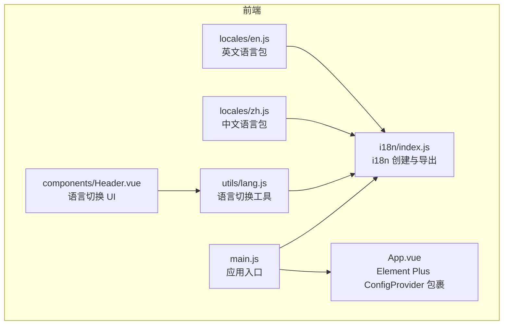
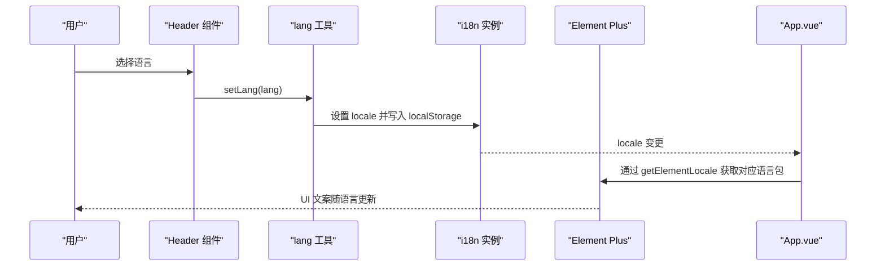
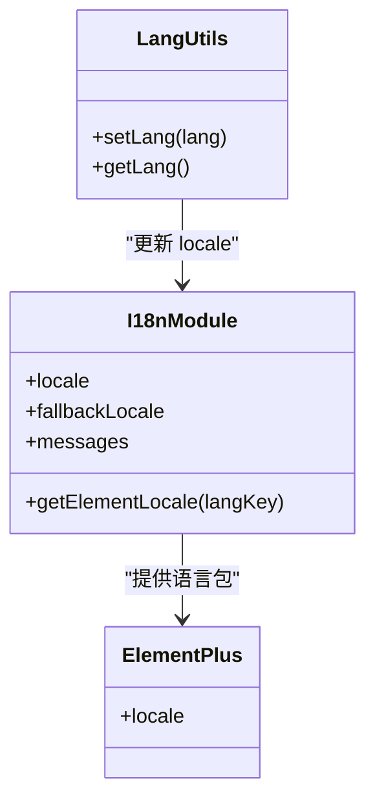
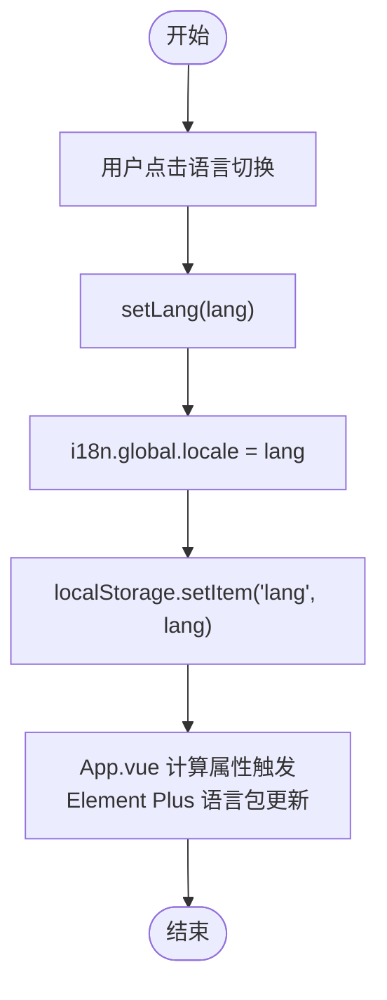
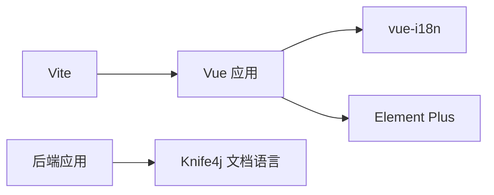

# 国际化与本地化

<cite>
**本文引用的文件**
- [frontend/src/i18n/index.js](file://frontend/src/i18n/index.js)
- [frontend/src/utils/lang.js](file://frontend/src/utils/lang.js)
- [frontend/src/locales/zh.js](file://frontend/src/locales/zh.js)
- [frontend/src/locales/en.js](file://frontend/src/locales/en.js)
- [frontend/src/main.js](file://frontend/src/main.js)
- [frontend/src/App.vue](file://frontend/src/App.vue)
- [frontend/src/components/Header.vue](file://frontend/src/components/Header.vue)
- [frontend/package.json](file://frontend/package.json)
- [frontend/vite.config.js](file://frontend/vite.config.js)
- [backend/src/main/resources/application.yml](file://backend/src/main/resources/application.yml)
</cite>

## 目录
1. [简介](#简介)
2. [项目结构](#项目结构)
3. [核心组件](#核心组件)
4. [架构总览](#架构总览)
5. [详细组件分析](#详细组件分析)
6. [依赖关系分析](#依赖关系分析)
7. [性能考量](#性能考量)
8. [故障排查指南](#故障排查指南)
9. [结论](#结论)
10. [附录](#附录)

## 简介
本设计文档围绕“非遗产品智能定制商城系统”的国际化与本地化展开，聚焦前端 Vue 应用的多语言实现方案，涵盖 i18n 配置、语言包管理、动态语言切换机制，以及与 UI 组件库（Element Plus）的本地化集成。文档同时给出文本翻译、日期/数字/货币等本地化处理建议、语言检测与默认语言策略、用户偏好持久化、RTL 支持与字体适配、文化适应性设计、翻译工作流与语言包维护流程，以及性能优化实践。

## 项目结构
前端国际化相关文件组织清晰，采用按功能分层与按语言分包的混合方式：
- i18n 配置集中于 i18n 模块，统一创建与导出实例及 Element Plus 语言映射工具函数
- 语言包按语言拆分存放，便于维护与扩展
- 工具模块负责语言状态的读取与写入
- 入口文件完成 i18n 与 Element Plus 的安装与初始化
- 页面组件通过 $t 与 Element Plus 的 ConfigProvider 实现本地化渲染

图表来源
- [frontend/src/main.js](file://frontend/src/main.js#L1-L25)
- [frontend/src/i18n/index.js](file://frontend/src/i18n/index.js#L1-L24)
- [frontend/src/App.vue](file://frontend/src/App.vue#L1-L40)
- [frontend/src/utils/lang.js](file://frontend/src/utils/lang.js#L1-L9)
- [frontend/src/locales/zh.js](file://frontend/src/locales/zh.js#L1-L45)
- [frontend/src/locales/en.js](file://frontend/src/locales/en.js#L1-L45)
- [frontend/src/components/Header.vue](file://frontend/src/components/Header.vue#L1-L283)

章节来源
- [frontend/src/i18n/index.js](file://frontend/src/i18n/index.js#L1-L24)
- [frontend/src/utils/lang.js](file://frontend/src/utils/lang.js#L1-L9)
- [frontend/src/locales/zh.js](file://frontend/src/locales/zh.js#L1-L45)
- [frontend/src/locales/en.js](file://frontend/src/locales/en.js#L1-L45)
- [frontend/src/main.js](file://frontend/src/main.js#L1-L25)
- [frontend/src/App.vue](file://frontend/src/App.vue#L1-L40)
- [frontend/src/components/Header.vue](file://frontend/src/components/Header.vue#L1-L283)

## 核心组件
- i18n 配置与消息体
  - 使用 vue-i18n 创建 i18n 实例，启用组合式 API（legacy=false），全局注入（globalInjection=true）
  - locale/fallbackLocale 默认值从 localStorage 读取或回退到 zh
  - messages 中合并 Element Plus 语言包，确保 UI 组件文案随语言切换
- 语言切换工具
  - setLang：更新 i18n.global.locale 并持久化到 localStorage
  - getLang：从 localStorage 读取当前语言
- 语言包
  - zh.js 与 en.js 分别提供公共键空间（如 header、login、common）
  - 键名采用层级结构，便于维护与查找
- 应用初始化
  - main.js 安装 i18n 与 Element Plus，并以当前语言加载 Element Plus 语言包
  - App.vue 通过 el-config-provider 将 Element Plus 语言包注入全局
- 语言切换 UI
  - Header.vue 提供下拉菜单切换语言，调用 setLang 更新语言并持久化

章节来源
- [frontend/src/i18n/index.js](file://frontend/src/i18n/index.js#L1-L24)
- [frontend/src/utils/lang.js](file://frontend/src/utils/lang.js#L1-L9)
- [frontend/src/locales/zh.js](file://frontend/src/locales/zh.js#L1-L45)
- [frontend/src/locales/en.js](file://frontend/src/locales/en.js#L1-L45)
- [frontend/src/main.js](file://frontend/src/main.js#L1-L25)
- [frontend/src/App.vue](file://frontend/src/App.vue#L1-L40)
- [frontend/src/components/Header.vue](file://frontend/src/components/Header.vue#L1-L283)

## 架构总览
前端国际化整体流程如下：
- 初始化阶段：从 localStorage 读取语言，创建 i18n 实例，合并 Element Plus 语言包
- 运行阶段：组件通过 $t 访问翻译；Header 切换语言时调用 setLang，更新 i18n.locale 并持久化
- UI 层：App.vue 的 el-config-provider 基于当前语言选择 Element Plus 语言包

图表来源
- [frontend/src/components/Header.vue](file://frontend/src/components/Header.vue#L170-L172)
- [frontend/src/utils/lang.js](file://frontend/src/utils/lang.js#L3-L6)
- [frontend/src/i18n/index.js](file://frontend/src/i18n/index.js#L20-L23)
- [frontend/src/App.vue](file://frontend/src/App.vue#L11)
- [frontend/src/main.js](file://frontend/src/main.js#L22)

章节来源
- [frontend/src/main.js](file://frontend/src/main.js#L1-L25)
- [frontend/src/App.vue](file://frontend/src/App.vue#L1-L40)
- [frontend/src/i18n/index.js](file://frontend/src/i18n/index.js#L1-L24)
- [frontend/src/utils/lang.js](file://frontend/src/utils/lang.js#L1-L9)
- [frontend/src/components/Header.vue](file://frontend/src/components/Header.vue#L1-L283)

## 详细组件分析

### i18n 配置与 Element Plus 集成
- 设计要点
  - 使用 vue-i18n 的组合式 API，避免 legacy 模式带来的兼容成本
  - messages 中合并 Element Plus 语言包，确保日期选择器、对话框等组件文案同步
  - getElementLocale 动态返回当前语言对应的 Element Plus 语言对象
- 复杂度与性能
  - 语言切换仅变更 i18n.global.locale，Element Plus 语言包通过 computed 与 ConfigProvider 注入，开销极低
  - 语言包为静态对象，不涉及运行时编译

图表来源
- [frontend/src/i18n/index.js](file://frontend/src/i18n/index.js#L9-L23)
- [frontend/src/utils/lang.js](file://frontend/src/utils/lang.js#L3-L8)

章节来源
- [frontend/src/i18n/index.js](file://frontend/src/i18n/index.js#L1-L24)
- [frontend/src/utils/lang.js](file://frontend/src/utils/lang.js#L1-L9)

### 语言包管理与键空间设计
- 键空间划分
  - common：通用文案（确认、取消、登出成功提示等）
  - header：导航栏与语言切换标签
  - login：登录/注册相关文案
- 维护建议
  - 采用层级命名，避免键冲突
  - 新增语言时，保持键集合一致，减少缺失键导致的回退与闪烁
  - 对 UI 组件文案统一收敛到 Element Plus 语言包，避免重复定义

章节来源
- [frontend/src/locales/zh.js](file://frontend/src/locales/zh.js#L1-L45)
- [frontend/src/locales/en.js](file://frontend/src/locales/en.js#L1-L45)

### 动态语言切换机制
- 切换流程
  - Header 下拉触发 handleSetLang，调用 setLang
  - setLang 更新 i18n.global.locale 并写入 localStorage
  - App.vue 的 computed 基于当前 locale 返回 Element Plus 语言包
- 用户偏好持久化
  - localStorage 存储用户语言选择，刷新后仍保持

图表来源
- [frontend/src/components/Header.vue](file://frontend/src/components/Header.vue#L170-L172)
- [frontend/src/utils/lang.js](file://frontend/src/utils/lang.js#L3-L6)
- [frontend/src/App.vue](file://frontend/src/App.vue#L11)

章节来源
- [frontend/src/components/Header.vue](file://frontend/src/components/Header.vue#L1-L283)
- [frontend/src/utils/lang.js](file://frontend/src/utils/lang.js#L1-L9)
- [frontend/src/App.vue](file://frontend/src/App.vue#L1-L40)

### 本地化处理（文本、日期、数字、货币）
- 文本翻译
  - 使用 $t 访问语言包键值，组件内直接渲染
- 日期格式化
  - 建议在需要的页面引入 Intl.DateTimeFormat 或 dayjs + locale 插件，按语言设置 locale
- 数字格式化
  - 使用 Intl.NumberFormat，根据 locale 自动处理千分位、小数点等
- 货币显示
  - 使用 Intl.NumberFormat 的 style: 'currency'，locale 对应语言，currencyCode 对应币种
- Element Plus 日期组件
  - 通过 getElementLocale 与 el-config-provider 自动应用对应语言的日期选择器文案

章节来源
- [frontend/src/i18n/index.js](file://frontend/src/i18n/index.js#L20-L23)
- [frontend/src/App.vue](file://frontend/src/App.vue#L1-L40)

### 语言检测、默认语言与用户偏好
- 语言检测
  - 优先从 localStorage 读取；若不存在则默认 zh
- 默认语言
  - fallbackLocale 设为 zh，确保缺失键回退中文
- 用户偏好
  - setLang 同步写入 localStorage，刷新后恢复

章节来源
- [frontend/src/i18n/index.js](file://frontend/src/i18n/index.js#L7-L13)
- [frontend/src/utils/lang.js](file://frontend/src/utils/lang.js#L5-L6)

### RTL 语言支持、字体适配与文化适应
- RTL 支持
  - 为阿拉伯语、希伯来语等 RTL 语言准备样式变量与布局方向控制
  - 在 App.vue 或全局样式中根据语言动态切换 direction 与 text-align
- 字体适配
  - 当前已包含中英文常用字体栈，可针对特定语言补充 Noto Sans CJK、Arabic 字体族
- 文化适应
  - 颜色与图标需符合目标文化语境；日期/时间单位与表达习惯需本地化

（本节为通用指导，不直接分析具体文件）

### 翻译工作流、语言包维护与性能优化
- 翻译工作流
  - 由翻译人员维护 zh.js 与 en.js，确保键集合一致
  - 引入键校验脚本，启动时扫描缺失键并告警
- 语言包维护
  - 采用模块化语言包，按功能域拆分（如 common/header/login/product 等）
  - 对 UI 组件文案统一收敛至 Element Plus 语言包
- 性能优化
  - 语言包为静态对象，无需运行时编译
  - 切换语言仅更新 i18n.locale 与 Element Plus 语言包引用，开销极低
  - 避免在热路径频繁创建新对象；复用 getElementLocale 返回的语言包对象

章节来源
- [frontend/src/locales/zh.js](file://frontend/src/locales/zh.js#L1-L45)
- [frontend/src/locales/en.js](file://frontend/src/locales/en.js#L1-L45)
- [frontend/src/i18n/index.js](file://frontend/src/i18n/index.js#L1-L24)

## 依赖关系分析
- 前端依赖
  - vue-i18n：提供多语言能力
  - element-plus：提供 UI 组件与本地化语言包
  - vite：构建与代理配置
- 后端依赖
  - knife4j：接口文档语言设置为 zh_cn
- 关系图

图表来源
- [frontend/package.json](file://frontend/package.json#L10-L21)
- [frontend/vite.config.js](file://frontend/vite.config.js#L1-L22)
- [backend/src/main/resources/application.yml](file://backend/src/main/resources/application.yml#L54-L57)

章节来源
- [frontend/package.json](file://frontend/package.json#L1-L28)
- [frontend/vite.config.js](file://frontend/vite.config.js#L1-L22)
- [backend/src/main/resources/application.yml](file://backend/src/main/resources/application.yml#L1-L63)

## 性能考量
- 语言切换
  - 仅修改 i18n.global.locale 与 Element Plus 语言包引用，无重渲染
- 语言包大小
  - 建议按需加载语言包（懒加载），减少首屏体积
- 缓存策略
  - localStorage 持久化语言选择，避免每次请求后端判断
- 渲染优化
  - 使用 computed 与响应式数据，避免不必要的重新计算

（本节提供通用指导）

## 故障排查指南
- 语言切换无效
  - 检查 setLang 是否正确更新 i18n.global.locale 与 localStorage
  - 确认 App.vue 的 el-config-provider 是否基于当前 locale 返回语言包
- 缺失键导致回退
  - 检查语言包键集合是否一致；必要时增加键或在 fallbackLocale 中补齐
- Element Plus 组件文案未更新
  - 确认 getElementLocale 返回了正确的语言包对象，并传入 el-config-provider

章节来源
- [frontend/src/utils/lang.js](file://frontend/src/utils/lang.js#L1-L9)
- [frontend/src/i18n/index.js](file://frontend/src/i18n/index.js#L20-L23)
- [frontend/src/App.vue](file://frontend/src/App.vue#L1-L40)

## 结论
本系统前端已实现完善的国际化基础：i18n 配置、语言包管理、动态语言切换与 Element Plus 本地化集成。建议后续完善日期/数字/货币的本地化处理、RTL 支持与字体适配、语言包按需加载与键校验流程，以进一步提升用户体验与可维护性。

## 附录
- 开发与构建
  - 前端开发服务器端口与代理已在 vite.config.js 中配置
- 后端文档语言
  - knife4j 文档语言默认 zh_cn

章节来源
- [frontend/vite.config.js](file://frontend/vite.config.js#L1-L22)
- [backend/src/main/resources/application.yml](file://backend/src/main/resources/application.yml#L54-L57)