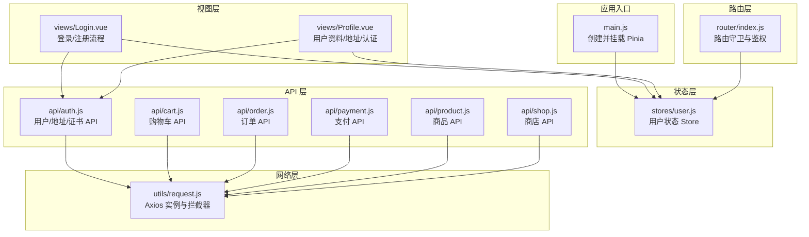
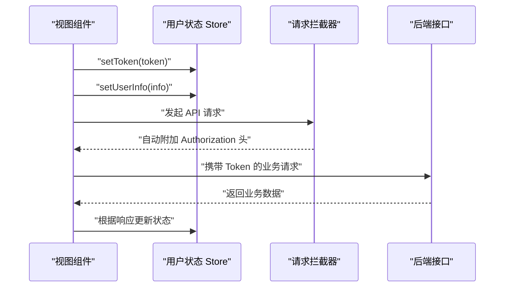
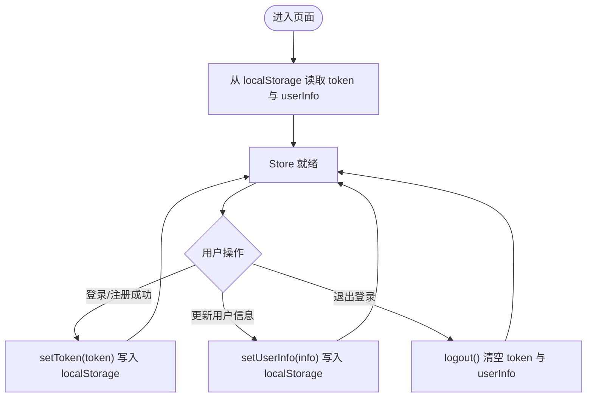
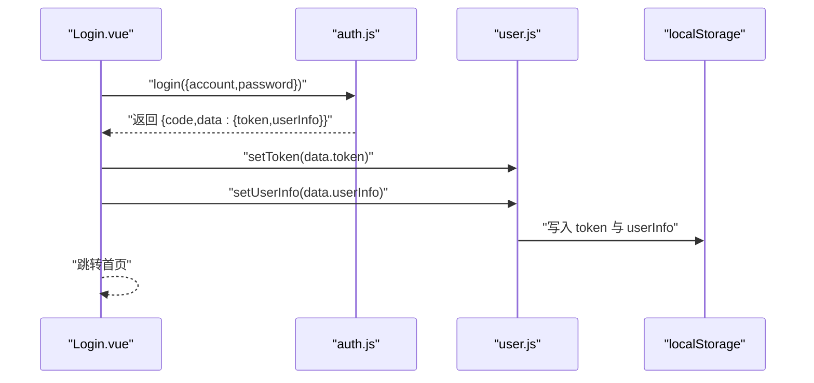
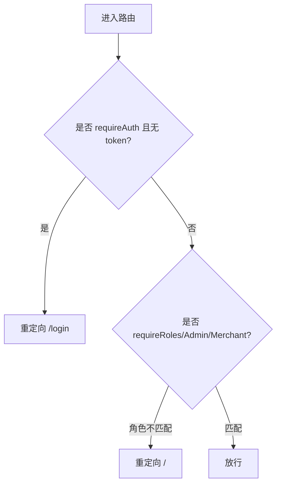
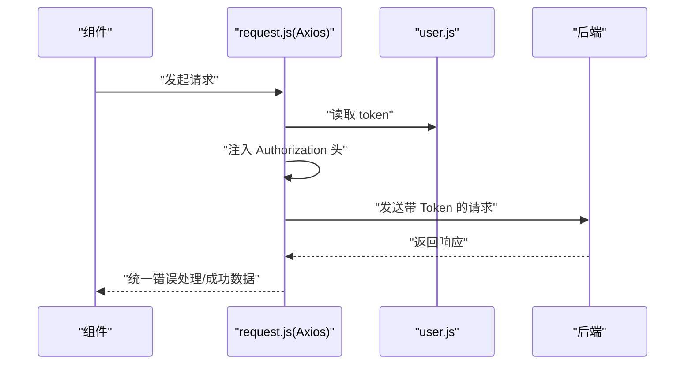
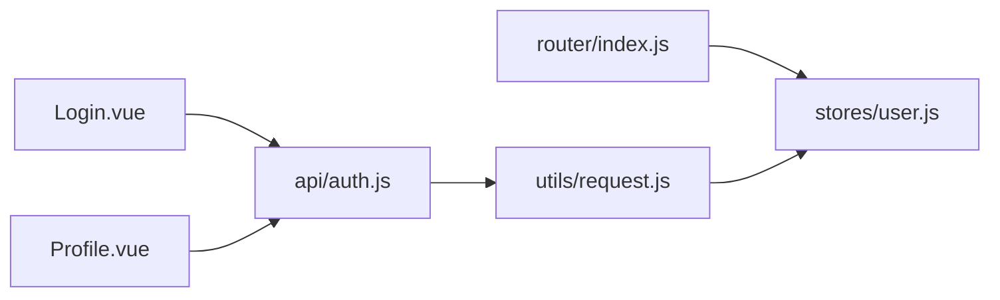

# 状态管理设计

<cite>
**本文引用的文件**
- [frontend/src/stores/user.js](file://frontend/src/stores/user.js)
- [frontend/src/main.js](file://frontend/src/main.js)
- [frontend/src/utils/request.js](file://frontend/src/utils/request.js)
- [frontend/src/router/index.js](file://frontend/src/router/index.js)
- [frontend/src/views/Login.vue](file://frontend/src/views/Login.vue)
- [frontend/src/views/Profile.vue](file://frontend/src/views/Profile.vue)
- [frontend/src/api/auth.js](file://frontend/src/api/auth.js)
- [frontend/src/api/cart.js](file://frontend/src/api/cart.js)
- [frontend/src/api/order.js](file://frontend/src/api/order.js)
- [frontend/src/api/payment.js](file://frontend/src/api/payment.js)
- [frontend/src/api/product.js](file://frontend/src/api/product.js)
- [frontend/src/api/shop.js](file://frontend/src/api/shop.js)
</cite>

## 目录
1. [引言](#引言)
2. [项目结构](#项目结构)
3. [核心组件](#核心组件)
4. [架构总览](#架构总览)
5. [详细组件分析](#详细组件分析)
6. [依赖分析](#依赖分析)
7. [性能考虑](#性能考虑)
8. [故障排查指南](#故障排查指南)
9. [结论](#结论)
10. [附录](#附录)

## 引言
本设计文档围绕“非遗产品智能定制商城系统”的状态管理展开，聚焦 Pinia 在本项目中的应用方式与最佳实践。当前系统采用组合式 API（Composition API）风格的 Store 定义，结合 Axios 封装的请求拦截器与路由守卫，形成从用户态到业务态的统一状态管理闭环。本文将系统性阐述：
- 用户状态、全局状态与业务状态的划分与职责边界
- 状态的定义、修改与订阅机制
- 与 API 的集成模式与异步状态处理
- 状态持久化策略与跨组件通信
- 状态模块化设计、状态守卫与调试技巧
- 性能优化建议与常见问题排查

## 项目结构
前端项目采用模块化组织，状态管理集中在 stores 目录，API 请求封装在 utils/request.js 中，路由守卫在 router/index.js 中，视图组件通过 API 层与 Store 进行交互。

图表来源
- [frontend/src/main.js](file://frontend/src/main.js#L1-L25)
- [frontend/src/stores/user.js](file://frontend/src/stores/user.js#L1-L33)
- [frontend/src/utils/request.js](file://frontend/src/utils/request.js#L1-L45)
- [frontend/src/router/index.js](file://frontend/src/router/index.js#L1-L176)
- [frontend/src/views/Login.vue](file://frontend/src/views/Login.vue#L1-L716)
- [frontend/src/views/Profile.vue](file://frontend/src/views/Profile.vue#L1-L936)
- [frontend/src/api/auth.js](file://frontend/src/api/auth.js#L1-L132)
- [frontend/src/api/cart.js](file://frontend/src/api/cart.js#L1-L48)
- [frontend/src/api/order.js](file://frontend/src/api/order.js#L1-L33)
- [frontend/src/api/payment.js](file://frontend/src/api/payment.js#L1-L26)
- [frontend/src/api/product.js](file://frontend/src/api/product.js#L1-L71)
- [frontend/src/api/shop.js](file://frontend/src/api/shop.js#L1-L18)

章节来源
- [frontend/src/main.js](file://frontend/src/main.js#L1-L25)
- [frontend/src/stores/user.js](file://frontend/src/stores/user.js#L1-L33)
- [frontend/src/utils/request.js](file://frontend/src/utils/request.js#L1-L45)
- [frontend/src/router/index.js](file://frontend/src/router/index.js#L1-L176)

## 核心组件
- 用户状态 Store（user.js）
  - 负责用户令牌与用户信息的读取、写入与清理，并与本地存储联动，实现轻量持久化。
  - 提供 setToken、setUserInfo、logout 方法，便于视图层直接调用以驱动 UI 更新。
- 请求封装（request.js）
  - 基于 Axios 创建实例，统一设置基础路径与超时；在请求拦截器中注入 Authorization 头；在响应拦截器中集中处理错误与消息提示。
- 路由守卫（router/index.js）
  - 在导航前置钩子中校验登录态与角色权限，结合用户 Store 的 token 与 userInfo 实现细粒度访问控制。
- 视图组件（Login.vue、Profile.vue）
  - 登录页负责调用认证 API 并写入用户状态；个人中心页负责读取与更新用户信息、地址与认证状态。

章节来源
- [frontend/src/stores/user.js](file://frontend/src/stores/user.js#L1-L33)
- [frontend/src/utils/request.js](file://frontend/src/utils/request.js#L1-L45)
- [frontend/src/router/index.js](file://frontend/src/router/index.js#L147-L173)
- [frontend/src/views/Login.vue](file://frontend/src/views/Login.vue#L375-L418)
- [frontend/src/views/Profile.vue](file://frontend/src/views/Profile.vue#L374-L404)

## 架构总览
Pinia 在本项目中的定位是“轻量级状态容器”，与路由守卫、API 层协同工作，形成“状态驱动 UI”的闭环。用户态贯穿全局，业务态通过 API 调用与本地缓存相结合，避免重复请求与状态漂移。

图表来源
- [frontend/src/stores/user.js](file://frontend/src/stores/user.js#L8-L23)
- [frontend/src/utils/request.js](file://frontend/src/utils/request.js#L9-L20)
- [frontend/src/api/auth.js](file://frontend/src/api/auth.js#L3-L8)

## 详细组件分析

### 用户状态 Store 设计
- 状态定义
  - token：字符串，用于鉴权；来源于本地存储初始化，支持写入与清理。
  - userInfo：对象，包含用户基本信息；来源于本地存储初始化，支持写入与清理。
- 修改机制
  - setToken：更新内存值并同步写入本地存储。
  - setUserInfo：更新内存值并同步写入本地存储。
  - logout：清空内存与本地存储中的 token 与 userInfo。
- 订阅机制
  - 组合式 API 返回响应式引用与方法，视图层通过解构使用，实现自动响应式更新。
- 与本地存储的耦合
  - 初始化与持久化均基于 localStorage，实现刷新后状态恢复。

图表来源
- [frontend/src/stores/user.js](file://frontend/src/stores/user.js#L4-L23)

章节来源
- [frontend/src/stores/user.js](file://frontend/src/stores/user.js#L1-L33)

### 登录流程与状态同步
- 登录页通过认证 API 获取 token 与用户信息，随后调用 Store 的 setToken 与 setUserInfo，完成状态写入与 UI 切换。
- 登录页同时维护“记住密码”逻辑，将账号与密码写入本地存储，提升用户体验。

图表来源
- [frontend/src/views/Login.vue](file://frontend/src/views/Login.vue#L388-L405)
- [frontend/src/api/auth.js](file://frontend/src/api/auth.js#L3-L8)
- [frontend/src/stores/user.js](file://frontend/src/stores/user.js#L8-L16)

章节来源
- [frontend/src/views/Login.vue](file://frontend/src/views/Login.vue#L375-L418)
- [frontend/src/api/auth.js](file://frontend/src/api/auth.js#L1-L132)
- [frontend/src/stores/user.js](file://frontend/src/stores/user.js#L1-L33)

### 路由守卫与状态守卫
- 导航前置守卫在进入受保护路由前检查：
  - 是否需要登录：若未登录则重定向至登录页。
  - 角色权限：根据用户角色限制访问特定管理后台。
- 与用户状态的耦合点在于读取 token 与 userInfo，实现细粒度的访问控制。

图表来源
- [frontend/src/router/index.js](file://frontend/src/router/index.js#L147-L173)

章节来源
- [frontend/src/router/index.js](file://frontend/src/router/index.js#L147-L173)

### 请求拦截器与 API 集成
- 请求拦截器
  - 自动从本地存储读取 token 并注入 Authorization 头，简化各组件调用。
- 响应拦截器
  - 统一处理业务错误码与网络异常，集中提示消息，减少重复代码。
- API 层
  - 按功能拆分模块（auth、cart、order、payment、product、shop），每个模块导出函数，视图层按需调用。

图表来源
- [frontend/src/utils/request.js](file://frontend/src/utils/request.js#L9-L42)
- [frontend/src/stores/user.js](file://frontend/src/stores/user.js#L5-L6)

章节来源
- [frontend/src/utils/request.js](file://frontend/src/utils/request.js#L1-L45)
- [frontend/src/api/auth.js](file://frontend/src/api/auth.js#L1-L132)
- [frontend/src/api/cart.js](file://frontend/src/api/cart.js#L1-L48)
- [frontend/src/api/order.js](file://frontend/src/api/order.js#L1-L33)
- [frontend/src/api/payment.js](file://frontend/src/api/payment.js#L1-L26)
- [frontend/src/api/product.js](file://frontend/src/api/product.js#L1-L71)
- [frontend/src/api/shop.js](file://frontend/src/api/shop.js#L1-L18)

### 业务状态与跨组件通信
- 业务状态示例
  - 购物车：通过 cart.js 的 API 获取与更新购物车项，结合本地缓存与 Store 可实现更复杂的业务状态管理（当前仓库未提供专门的购物车 Store，可在后续扩展）。
  - 订单与支付：通过 order.js 与 payment.js 的 API 获取订单与支付状态，驱动 UI 更新。
- 跨组件通信
  - 通过 Pinia Store 共享用户态，所有视图组件均可读取与更新用户信息，实现松耦合的状态共享。
  - 对于非用户态的业务状态，建议在后续扩展中引入独立的 Store 模块，保持关注点分离。

章节来源
- [frontend/src/api/cart.js](file://frontend/src/api/cart.js#L1-L48)
- [frontend/src/api/order.js](file://frontend/src/api/order.js#L1-L33)
- [frontend/src/api/payment.js](file://frontend/src/api/payment.js#L1-L26)

## 依赖分析
- 组件耦合
  - 视图组件依赖 API 层与用户 Store；API 层依赖请求封装；路由守卫依赖用户 Store。
- 外部依赖
  - Vue 3、Element Plus、Axios、Pinia。
- 潜在风险
  - 当前仅用户态有 Store，业务态分散在 API 层，存在状态漂移风险；建议引入业务 Store 以增强可维护性。

图表来源
- [frontend/src/views/Login.vue](file://frontend/src/views/Login.vue#L220-L221)
- [frontend/src/views/Profile.vue](file://frontend/src/views/Profile.vue#L211-L212)
- [frontend/src/api/auth.js](file://frontend/src/api/auth.js#L1-L132)
- [frontend/src/utils/request.js](file://frontend/src/utils/request.js#L1-L45)
- [frontend/src/router/index.js](file://frontend/src/router/index.js#L2-L150)
- [frontend/src/stores/user.js](file://frontend/src/stores/user.js#L1-L33)

章节来源
- [frontend/src/views/Login.vue](file://frontend/src/views/Login.vue#L1-L716)
- [frontend/src/views/Profile.vue](file://frontend/src/views/Profile.vue#L1-L936)
- [frontend/src/api/auth.js](file://frontend/src/api/auth.js#L1-L132)
- [frontend/src/utils/request.js](file://frontend/src/utils/request.js#L1-L45)
- [frontend/src/router/index.js](file://frontend/src/router/index.js#L1-L176)
- [frontend/src/stores/user.js](file://frontend/src/stores/user.js#L1-L33)

## 性能考虑
- 状态持久化
  - 用户态通过 localStorage 持久化，减少重复登录成本；建议对大对象进行序列化与反序列化时注意体积控制。
- 请求拦截器
  - 统一注入 Token 与错误处理，减少重复代码；注意避免在高频请求中频繁读写本地存储。
- 组件渲染
  - 使用组合式 API 的响应式引用，仅在状态变化时触发更新；对复杂列表建议分页与懒加载。
- 并发与缓存
  - 对首页等多源并发场景，可考虑缓存策略与去重，避免重复请求。
- 调试与可观测性
  - 建议在开发环境启用 Pinia DevTools，结合浏览器 Network 面板观察请求与响应。

## 故障排查指南
- 登录后无法访问受保护页面
  - 检查路由守卫是否正确读取 token 与 userInfo；确认登录流程是否调用了 setToken 与 setUserInfo。
- 请求失败或 401
  - 检查请求拦截器是否正确注入 Authorization 头；确认后端 Token 校验逻辑。
- 错误消息未显示
  - 检查响应拦截器的错误分支与消息提示逻辑；确认后端返回的 code 与 message 字段。
- 本地存储异常
  - 检查 localStorage 的可用性与容量；确认键名一致性（token、userInfo、rememberedAccount、rememberedPassword）。

章节来源
- [frontend/src/router/index.js](file://frontend/src/router/index.js#L147-L173)
- [frontend/src/utils/request.js](file://frontend/src/utils/request.js#L22-L42)
- [frontend/src/views/Login.vue](file://frontend/src/views/Login.vue#L393-L410)

## 结论
本项目采用 Pinia 管理用户态，结合 Axios 请求拦截器与路由守卫，实现了清晰、可维护的状态管理方案。建议在后续迭代中：
- 引入业务 Store（如购物车、订单、支付）以模块化管理业务状态
- 增强状态持久化策略（如 sessionStorage、IndexedDB）以适配不同场景
- 加强状态调试工具链与监控埋点，提升可观测性
- 优化并发请求与缓存策略，提升首屏与交互性能

## 附录
- 最佳实践清单
  - 用户态：始终通过 Store 写入与读取，避免直接操作 DOM 或全局变量
  - API 层：按功能模块拆分，统一返回结构，便于拦截器处理
  - 路由守卫：明确 requireAuth 与角色权限，避免越权访问
  - 调试：开启 Pinia DevTools，结合浏览器 Network 面板定位问题
  - 性能：合理使用响应式引用，避免不必要的状态膨胀