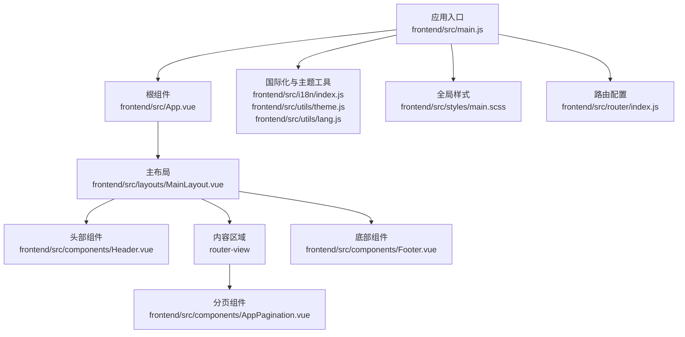
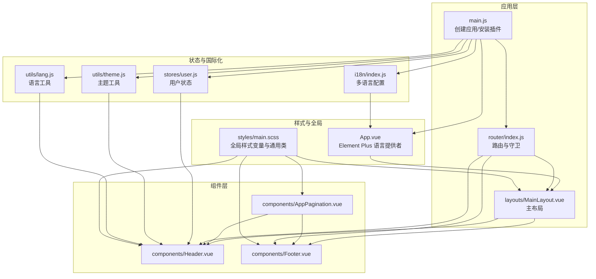
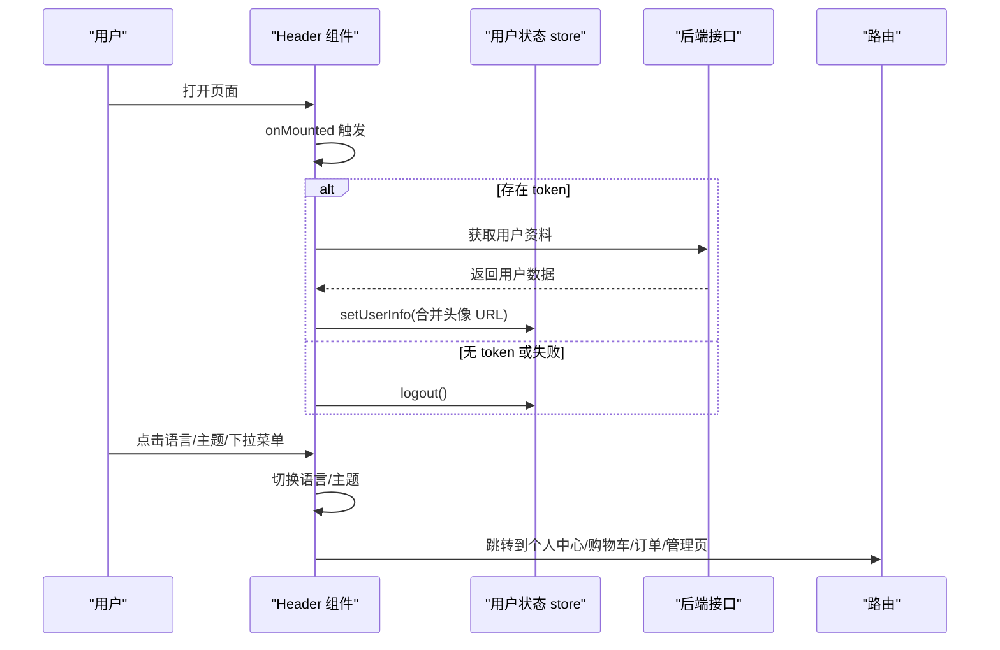
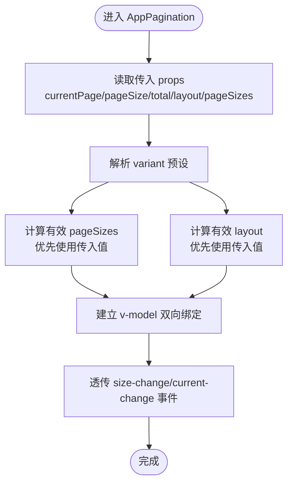
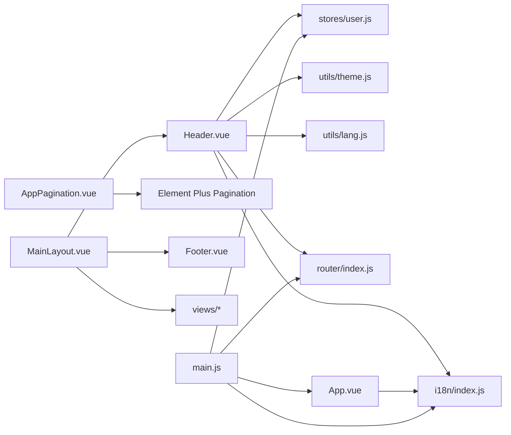

# 组件系统设计

<cite>
**本文引用的文件**
- [frontend/src/components/Header.vue](file://frontend/src/components/Header.vue)
- [frontend/src/components/Footer.vue](file://frontend/src/components/Footer.vue)
- [frontend/src/components/AppPagination.vue](file://frontend/src/components/AppPagination.vue)
- [frontend/src/layouts/MainLayout.vue](file://frontend/src/layouts/MainLayout.vue)
- [frontend/src/App.vue](file://frontend/src/App.vue)
- [frontend/src/main.js](file://frontend/src/main.js)
- [frontend/src/stores/user.js](file://frontend/src/stores/user.js)
- [frontend/src/utils/theme.js](file://frontend/src/utils/theme.js)
- [frontend/src/utils/lang.js](file://frontend/src/utils/lang.js)
- [frontend/src/i18n/index.js](file://frontend/src/i18n/index.js)
- [frontend/src/styles/main.scss](file://frontend/src/styles/main.scss)
- [frontend/src/router/index.js](file://frontend/src/router/index.js)
- [frontend/src/views/Home.vue](file://frontend/src/views/Home.vue)
- [frontend/package.json](file://frontend/package.json)
</cite>

## 目录
1. [引言](#引言)
2. [项目结构](#项目结构)
3. [核心组件](#核心组件)
4. [架构总览](#架构总览)
5. [组件详细分析](#组件详细分析)
6. [依赖关系分析](#依赖关系分析)
7. [性能考量](#性能考量)
8. [故障排查指南](#故障排查指南)
9. [结论](#结论)
10. [附录](#附录)

## 引言
本设计文档面向“非遗产品智能定制商城系统”的前端组件体系，聚焦可复用组件的设计原则与实现规范，覆盖头部导航、底部信息、分页等核心UI组件，并系统阐述组件间通信、状态共享、生命周期管理、可扩展性、主题与无障碍支持、开发最佳实践、性能优化与测试策略。目标是帮助开发者在保持一致交互与视觉体验的同时，提升组件的可维护性与可扩展性。

## 项目结构
前端采用 Vue 3 + Vite + Element Plus + Pinia + vue-i18n 技术栈，组件位于 src/components，布局位于 src/layouts，全局样式位于 src/styles，国际化资源位于 src/locales，应用入口位于 src/main.js，路由位于 src/router/index.js。

图表来源
- [frontend/src/main.js](file://frontend/src/main.js#L1-L25)
- [frontend/src/App.vue](file://frontend/src/App.vue#L1-L40)
- [frontend/src/layouts/MainLayout.vue](file://frontend/src/layouts/MainLayout.vue#L1-L28)
- [frontend/src/components/Header.vue](file://frontend/src/components/Header.vue#L1-L283)
- [frontend/src/components/Footer.vue](file://frontend/src/components/Footer.vue#L1-L96)
- [frontend/src/components/AppPagination.vue](file://frontend/src/components/AppPagination.vue#L1-L92)
- [frontend/src/i18n/index.js](file://frontend/src/i18n/index.js#L1-L24)
- [frontend/src/utils/theme.js](file://frontend/src/utils/theme.js#L1-L26)
- [frontend/src/utils/lang.js](file://frontend/src/utils/lang.js#L1-L9)
- [frontend/src/styles/main.scss](file://frontend/src/styles/main.scss#L1-L174)
- [frontend/src/router/index.js](file://frontend/src/router/index.js#L1-L176)

章节来源
- [frontend/src/main.js](file://frontend/src/main.js#L1-L25)
- [frontend/src/App.vue](file://frontend/src/App.vue#L1-L40)
- [frontend/src/layouts/MainLayout.vue](file://frontend/src/layouts/MainLayout.vue#L1-L28)

## 核心组件
本节对三大核心组件进行概览式说明，后续章节将深入其设计与实现。

- 头部导航组件（Header）
  - 职责：品牌标识、主导航菜单、语言切换、主题切换、用户下拉菜单（含头像、昵称、操作项）、登录/注册按钮。
  - 关键能力：动态菜单高亮、角色权限控制、用户资料加载与持久化、Element Plus 国际化联动。
- 底部组件（Footer）
  - 职责：公司简介、快速链接、联系方式、版权信息。
  - 关键能力：响应式布局、链接跳转、基础样式封装。
- 分页组件（AppPagination）
  - 职责：基于 Element Plus Pagination 的二次封装，提供预设变体与双向绑定。
  - 关键能力：variant 预设、layout/pageSizes 动态选择、v-model:current-page/v-model:page-size 双向绑定、事件透传。

章节来源
- [frontend/src/components/Header.vue](file://frontend/src/components/Header.vue#L1-L283)
- [frontend/src/components/Footer.vue](file://frontend/src/components/Footer.vue#L1-L96)
- [frontend/src/components/AppPagination.vue](file://frontend/src/components/AppPagination.vue#L1-L92)

## 架构总览
组件系统围绕“布局-页面-组件”三层结构组织，通过 Pinia 管理用户状态，通过 vue-i18n 与 Element Plus 国际化对接，通过路由守卫实现鉴权与角色控制。

图表来源
- [frontend/src/main.js](file://frontend/src/main.js#L1-L25)
- [frontend/src/router/index.js](file://frontend/src/router/index.js#L1-L176)
- [frontend/src/layouts/MainLayout.vue](file://frontend/src/layouts/MainLayout.vue#L1-L28)
- [frontend/src/components/Header.vue](file://frontend/src/components/Header.vue#L1-L283)
- [frontend/src/components/Footer.vue](file://frontend/src/components/Footer.vue#L1-L96)
- [frontend/src/components/AppPagination.vue](file://frontend/src/components/AppPagination.vue#L1-L92)
- [frontend/src/stores/user.js](file://frontend/src/stores/user.js#L1-L33)
- [frontend/src/utils/theme.js](file://frontend/src/utils/theme.js#L1-L26)
- [frontend/src/utils/lang.js](file://frontend/src/utils/lang.js#L1-L9)
- [frontend/src/i18n/index.js](file://frontend/src/i18n/index.js#L1-L24)
- [frontend/src/styles/main.scss](file://frontend/src/styles/main.scss#L1-L174)
- [frontend/src/App.vue](file://frontend/src/App.vue#L1-L40)

## 组件详细分析

### 头部导航组件（Header）设计与实现
- 设计原则
  - 单一职责：负责顶部导航、用户态展示与操作、主题与语言切换。
  - 权限驱动：根据用户角色动态显示管理入口。
  - 一致性：与 Element Plus 主题与国际化保持一致。
- Props 定义
  - 无外部 props：通过路由高亮当前菜单，通过 Pinia 用户状态决定显示逻辑。
- 事件处理
  - 主题切换：toggleDark/isDark，写入 localStorage 并更新根节点类名。
  - 语言切换：setLang/getLang，写入 localStorage 并更新 i18n 全局语言。
  - 登录/注册/退出：路由跳转与用户登出。
  - 下拉菜单：个人中心、购物车、订单、用户管理、商品管理、非遗管理等。
- 插槽使用
  - 未使用具名/作用域插槽；通过模板结构组合内部元素。
- 样式封装策略
  - 使用 :deep 选择器覆盖 Element Plus 菜单样式，避免影响其他菜单。
  - 响应式容器与固定定位，移动端间距调整。
- 生命周期与状态
  - onMounted 中校验 token 并拉取用户资料，失败则登出。
  - 用户信息变更通过 Pinia store 同步到本地存储。
- 可扩展性
  - 可新增菜单项或权限判断分支，不影响现有结构。
  - 主题与语言工具函数可被其他组件复用。
- 无障碍支持
  - 使用语义化标签与可访问的图标替代文本。
  - 下拉菜单使用 Element Plus 提供的键盘导航能力。

图表来源
- [frontend/src/components/Header.vue](file://frontend/src/components/Header.vue#L99-L121)
- [frontend/src/stores/user.js](file://frontend/src/stores/user.js#L18-L23)
- [frontend/src/utils/theme.js](file://frontend/src/utils/theme.js#L11-L15)
- [frontend/src/utils/lang.js](file://frontend/src/utils/lang.js#L3-L6)
- [frontend/src/router/index.js](file://frontend/src/router/index.js#L147-L173)

章节来源
- [frontend/src/components/Header.vue](file://frontend/src/components/Header.vue#L1-L283)
- [frontend/src/stores/user.js](file://frontend/src/stores/user.js#L1-L33)
- [frontend/src/utils/theme.js](file://frontend/src/utils/theme.js#L1-L26)
- [frontend/src/utils/lang.js](file://frontend/src/utils/lang.js#L1-L9)
- [frontend/src/i18n/index.js](file://frontend/src/i18n/index.js#L1-L24)
- [frontend/src/router/index.js](file://frontend/src/router/index.js#L147-L173)

### 底部组件（Footer）设计与实现
- 设计原则
  - 结构清晰、信息明确、易于维护。
  - 响应式布局，适配小屏设备。
- Props 定义
  - 无 props，纯展示型组件。
- 事件处理
  - 通过 router-link 实现内部导航。
- 插槽使用
  - 未使用插槽。
- 样式封装策略
  - 使用通用类与响应式断点，统一颜色与排版。
- 可扩展性
  - 可通过新增 section 或链接列表扩展信息。
- 无障碍支持
  - 使用语义化标题与链接，具备基本可访问性。

章节来源
- [frontend/src/components/Footer.vue](file://frontend/src/components/Footer.vue#L1-L96)
- [frontend/src/styles/main.scss](file://frontend/src/styles/main.scss#L34-L95)

### 分页组件（AppPagination）设计与实现
- 设计原则
  - 对外暴露标准分页行为，内部提供预设变体以减少重复配置。
  - 支持 v-model 双向绑定，同时透传原生事件，便于上层统一处理。
- Props 定义
  - variant: String，默认 default，支持 default/orders/history。
  - currentPage: Number（必填），当前页。
  - pageSize: Number（必填），每页条数。
  - total: Number（必填），总数。
  - pageSizes: Array（可选），自定义页容量集合。
  - layout: String（可选），自定义布局字符串。
- 事件处理
  - update:currentPage/update:pageSize：用于 v-model 双向绑定。
  - size-change/current-change：透传原生事件。
- 插槽使用
  - 未使用插槽。
- 样式封装策略
  - 通过通用分页样式类统一右侧对齐与间距。
- 可扩展性
  - 新增 variant 预设无需改动上层调用方式。
- 性能与可用性
  - 通过计算属性与 v-model getter/setter 降低重渲染成本。
  - layout 与 pageSizes 优先使用传入值，否则回退到预设。

图表来源
- [frontend/src/components/AppPagination.vue](file://frontend/src/components/AppPagination.vue#L18-L90)

章节来源
- [frontend/src/components/AppPagination.vue](file://frontend/src/components/AppPagination.vue#L1-L92)
- [frontend/src/styles/main.scss](file://frontend/src/styles/main.scss#L109-L113)

### 布局与页面集成
- MainLayout 将 Header、router-view、Footer 组合，设置内容区上边距以避开固定头部。
- Home 页面作为示例页面，展示分页组件在实际业务中的使用方式（如商品列表分页场景）。

章节来源
- [frontend/src/layouts/MainLayout.vue](file://frontend/src/layouts/MainLayout.vue#L1-L28)
- [frontend/src/views/Home.vue](file://frontend/src/views/Home.vue#L1-L649)

## 依赖关系分析
- 组件依赖
  - Header 依赖：Pinia 用户 store、Element Plus 图标与消息组件、i18n、主题工具、语言工具、路由。
  - Footer 依赖：router-link、基础样式。
  - AppPagination 依赖：Element Plus Pagination、计算属性。
- 状态与国际化
  - 用户状态通过 Pinia 管理，持久化到 localStorage。
  - Element Plus 语言随 i18n 全局语言变化而变化。
- 路由与鉴权
  - 路由守卫根据用户 token 与角色控制访问权限。

图表来源
- [frontend/src/components/Header.vue](file://frontend/src/components/Header.vue#L74-L83)
- [frontend/src/stores/user.js](file://frontend/src/stores/user.js#L1-L33)
- [frontend/src/i18n/index.js](file://frontend/src/i18n/index.js#L1-L24)
- [frontend/src/utils/theme.js](file://frontend/src/utils/theme.js#L1-L26)
- [frontend/src/utils/lang.js](file://frontend/src/utils/lang.js#L1-L9)
- [frontend/src/router/index.js](file://frontend/src/router/index.js#L1-L176)
- [frontend/src/components/AppPagination.vue](file://frontend/src/components/AppPagination.vue#L1-L92)
- [frontend/src/layouts/MainLayout.vue](file://frontend/src/layouts/MainLayout.vue#L1-L28)
- [frontend/src/App.vue](file://frontend/src/App.vue#L1-L40)
- [frontend/src/main.js](file://frontend/src/main.js#L1-L25)

章节来源
- [frontend/src/main.js](file://frontend/src/main.js#L1-L25)
- [frontend/src/router/index.js](file://frontend/src/router/index.js#L147-L173)

## 性能考量
- 渲染优化
  - 使用 computed 与 v-model getter/setter 减少不必要的重渲染。
  - 在 Header 中仅在挂载时校验 token 并拉取用户资料，避免频繁请求。
- 样式优化
  - 使用 CSS 变量与通用类，减少重复样式定义。
  - 通过 :deep 选择器精准覆盖第三方组件样式，避免全局污染。
- 资源加载
  - Element Plus 图标按需注册，避免全量引入。
- 可访问性
  - 使用语义化标签与可聚焦元素，结合 Element Plus 的键盘导航增强可访问性。

## 故障排查指南
- 主题切换无效
  - 检查主题工具是否正确切换根节点类名与 localStorage。
  - 确认 App.vue 中 Element Plus 是否使用了正确的语言配置。
- 语言切换不生效
  - 检查 i18n 全局语言是否更新，以及 Element Plus 语言是否同步。
- 用户登录后仍提示未登录
  - 检查路由守卫中 token 与角色判断逻辑，确认用户 store 是否正确写入本地存储。
- 分页不更新
  - 确认 v-model:current-page 与 v-model:page-size 是否正确绑定，事件是否透传。

章节来源
- [frontend/src/utils/theme.js](file://frontend/src/utils/theme.js#L1-L26)
- [frontend/src/i18n/index.js](file://frontend/src/i18n/index.js#L20-L23)
- [frontend/src/router/index.js](file://frontend/src/router/index.js#L147-L173)
- [frontend/src/components/AppPagination.vue](file://frontend/src/components/AppPagination.vue#L74-L90)

## 结论
该组件系统以布局-页面-组件分层组织，配合 Pinia、i18n、路由守卫与 Element Plus，实现了统一的主题、语言与权限控制。头部、底部与分页组件遵循单一职责与可复用原则，具备良好的可扩展性与可维护性。建议在后续迭代中持续完善可访问性、测试覆盖率与文档化，以进一步提升质量与协作效率。

## 附录
- 开发最佳实践
  - 统一使用 Element Plus 组件与样式变量，避免自定义样式绕过全局主题。
  - 通过 store 管理跨组件共享状态，避免深层传递 props。
  - 为关键组件编写单元测试与端到端测试，覆盖主要交互路径。
- 性能优化建议
  - 对长列表使用虚拟滚动或分页加载。
  - 图片懒加载与占位符，减少首屏阻塞。
  - 使用浏览器缓存与 CDN 加速静态资源。
- 测试策略
  - 单元测试：针对组件 props/事件/状态转换。
  - 集成测试：针对路由守卫与鉴权流程。
  - 端到端测试：覆盖登录、分页、主题切换、语言切换等关键流程。