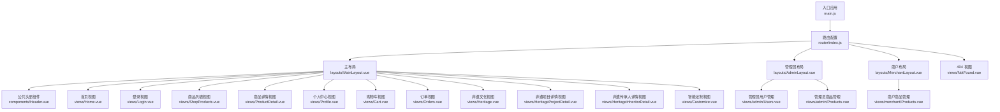
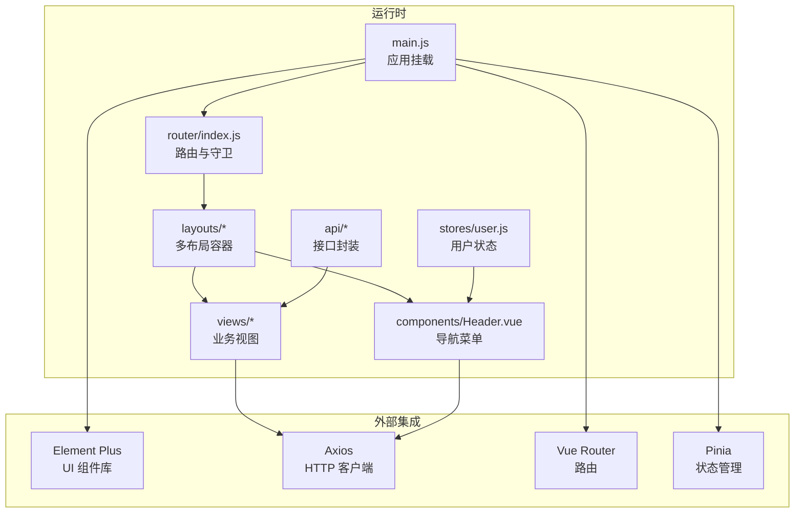
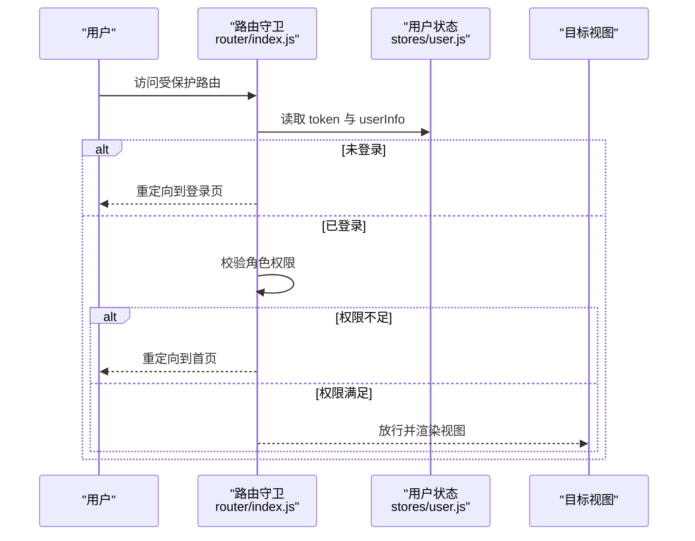
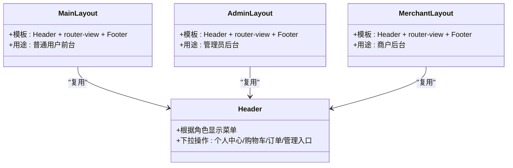
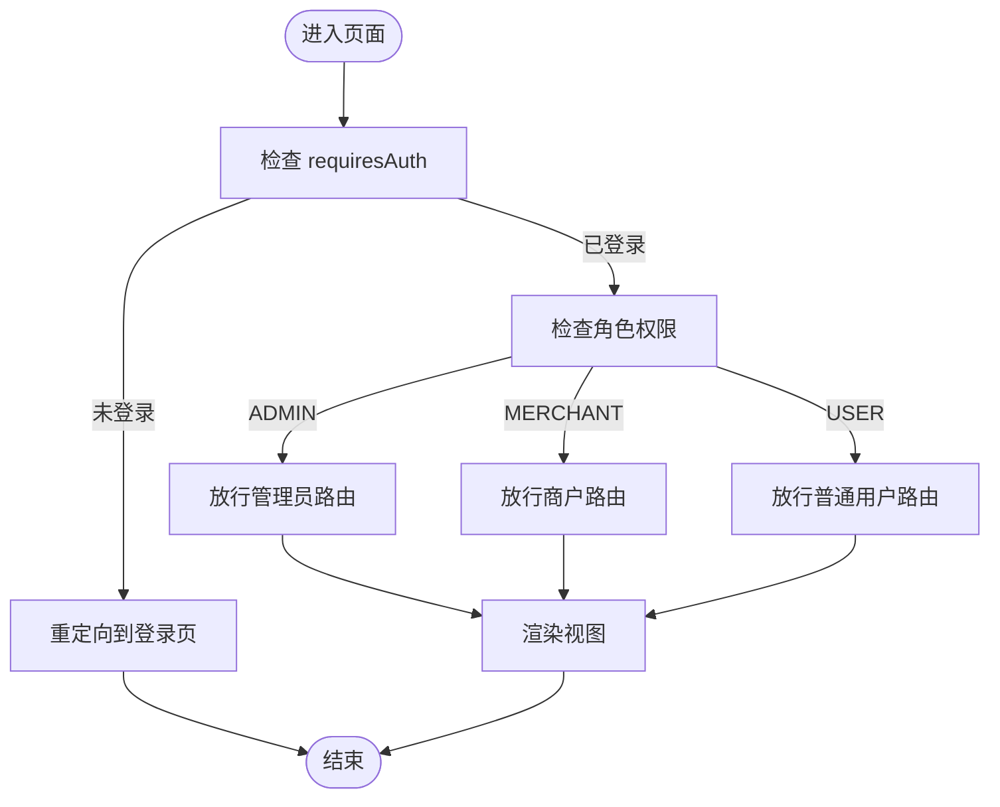
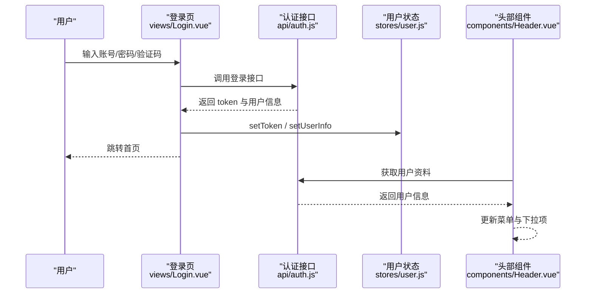
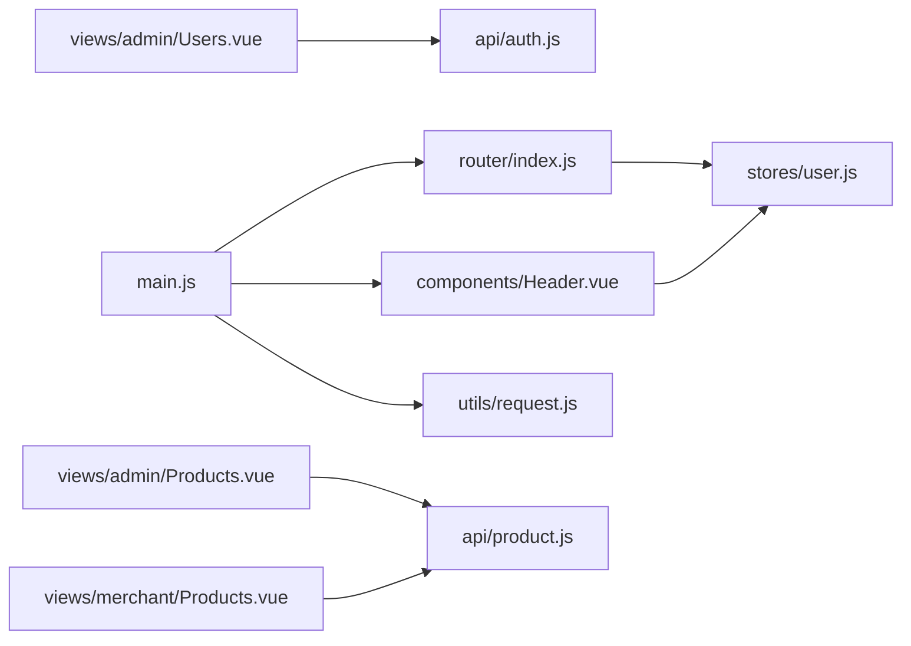

# 路由与导航设计

<cite>
**本文引用的文件**
- [frontend/src/router/index.js](file://frontend/src/router/index.js)
- [frontend/src/main.js](file://frontend/src/main.js)
- [frontend/src/layouts/MainLayout.vue](file://frontend/src/layouts/MainLayout.vue)
- [frontend/src/layouts/AdminLayout.vue](file://frontend/src/layouts/AdminLayout.vue)
- [frontend/src/layouts/MerchantLayout.vue](file://frontend/src/layouts/MerchantLayout.vue)
- [frontend/src/stores/user.js](file://frontend/src/stores/user.js)
- [frontend/src/components/Header.vue](file://frontend/src/components/Header.vue)
- [frontend/src/views/admin/Users.vue](file://frontend/src/views/admin/Users.vue)
- [frontend/src/views/admin/Products.vue](file://frontend/src/views/admin/Products.vue)
- [frontend/src/views/merchant/Products.vue](file://frontend/src/views/merchant/Products.vue)
- [frontend/src/views/Login.vue](file://frontend/src/views/Login.vue)
- [frontend/src/views/Home.vue](file://frontend/src/views/Home.vue)
- [frontend/src/views/NotFound.vue](file://frontend/src/views/NotFound.vue)
- [frontend/src/api/auth.js](file://frontend/src/api/auth.js)
- [frontend/src/i18n/index.js](file://frontend/src/i18n/index.js)
- [frontend/src/utils/request.js](file://frontend/src/utils/request.js)
- [frontend/package.json](file://frontend/package.json)
</cite>

## 目录
1. [简介](#简介)
2. [项目结构](#项目结构)
3. [核心组件](#核心组件)
4. [架构总览](#架构总览)
5. [详细组件分析](#详细组件分析)
6. [依赖关系分析](#依赖关系分析)
7. [性能考虑](#性能考虑)
8. [故障排查指南](#故障排查指南)
9. [结论](#结论)

## 简介
本设计文档围绕非遗产品智能定制商城系统的“路由与导航”进行系统化梳理，重点覆盖：
- Vue Router 路由配置策略与导航守卫
- 多布局系统（主布局、管理员布局、商户布局）的实现差异
- 动态路由生成、嵌套路由配置与路由懒加载优化
- 页面权限控制、导航菜单生成与面包屑导航的实现方案
- 路由参数传递、查询字符串处理与路由过渡动画的完整指南

## 项目结构
前端采用基于功能分层的目录组织方式，路由集中在 router 目录，布局位于 layouts，视图位于 views，状态管理位于 stores，接口封装位于 api，工具函数位于 utils。

图表来源
- [frontend/src/main.js](file://frontend/src/main.js#L1-L25)
- [frontend/src/router/index.js](file://frontend/src/router/index.js#L1-L176)
- [frontend/src/layouts/MainLayout.vue](file://frontend/src/layouts/MainLayout.vue#L1-L28)
- [frontend/src/layouts/AdminLayout.vue](file://frontend/src/layouts/AdminLayout.vue#L1-L32)
- [frontend/src/layouts/MerchantLayout.vue](file://frontend/src/layouts/MerchantLayout.vue#L1-L31)
- [frontend/src/components/Header.vue](file://frontend/src/components/Header.vue#L1-L283)
- [frontend/src/views/Home.vue](file://frontend/src/views/Home.vue#L1-L649)
- [frontend/src/views/Login.vue](file://frontend/src/views/Login.vue#L1-L716)
- [frontend/src/views/admin/Users.vue](file://frontend/src/views/admin/Users.vue#L1-L482)
- [frontend/src/views/admin/Products.vue](file://frontend/src/views/admin/Products.vue#L1-L1065)
- [frontend/src/views/merchant/Products.vue](file://frontend/src/views/merchant/Products.vue#L1-L1055)
- [frontend/src/views/NotFound.vue](file://frontend/src/views/NotFound.vue#L1-L76)

章节来源
- [frontend/src/router/index.js](file://frontend/src/router/index.js#L1-L176)
- [frontend/src/main.js](file://frontend/src/main.js#L1-L25)

## 核心组件
- 路由配置与导航守卫：集中于路由配置文件，定义路径、组件懒加载、嵌套路由与权限元信息，并通过全局前置守卫统一校验登录态与角色权限。
- 多布局系统：主布局用于普通用户，管理员布局与商户布局分别提供后台管理能力，三者共享头部组件以实现一致的导航体验。
- 用户状态管理：使用 Pinia Store 存储 token 与用户信息，支持登录、登出与本地持久化。
- 导航菜单与权限：头部组件根据用户角色动态渲染菜单项与下拉操作，实现“可见即可用”的导航体验。

章节来源
- [frontend/src/router/index.js](file://frontend/src/router/index.js#L1-L176)
- [frontend/src/stores/user.js](file://frontend/src/stores/user.js#L1-L33)
- [frontend/src/components/Header.vue](file://frontend/src/components/Header.vue#L1-L283)

## 架构总览
系统采用“路由驱动视图”的单页应用架构，结合 Pinia 状态管理与 Element Plus 组件库，实现清晰的权限控制与良好的用户体验。

图表来源
- [frontend/src/main.js](file://frontend/src/main.js#L1-L25)
- [frontend/src/router/index.js](file://frontend/src/router/index.js#L1-L176)
- [frontend/src/stores/user.js](file://frontend/src/stores/user.js#L1-L33)
- [frontend/src/utils/request.js](file://frontend/src/utils/request.js#L1-L45)

## 详细组件分析

### 路由配置与导航守卫
- 路由策略
  - 主布局路由组：根路径重定向至首页，子路由覆盖首页、非遗文化、商品、详情、定制、个人中心、购物车、订单等。
  - 管理员路由组：以 /manage 开头，子路由包含用户管理、商品管理、非遗文化管理；通过 requiresAdmin 元信息限制访问。
  - 商户路由组：以 /merchant 开头，子路由包含商品管理；通过 requiresMerchant 元信息限制访问。
  - 404 路由：兜底未匹配路径，统一跳转到 404 视图。
  - 路由懒加载：所有页面组件均通过动态导入实现按需加载，降低首屏体积。
- 导航守卫
  - 全局前置守卫：设置页面标题、校验登录态与角色权限；支持 requiresAuth、requiresAdmin、requiresMerchant 以及自定义 requiresRoles 元信息。
  - 登录后跳转：登录成功后根据用户角色自动跳转至对应后台入口或首页。

图表来源
- [frontend/src/router/index.js](file://frontend/src/router/index.js#L147-L173)
- [frontend/src/stores/user.js](file://frontend/src/stores/user.js#L1-L33)

章节来源
- [frontend/src/router/index.js](file://frontend/src/router/index.js#L1-L176)

### 多布局系统设计
- 主布局（MainLayout）
  - 结构：顶部 Header、中间内容区 router-view、底部 Footer。
  - 作用：承载普通用户的前台页面，提供统一的导航与内容展示区域。
- 管理员布局（AdminLayout）
  - 结构：顶部 Header、中间内容区 router-view、底部 Footer。
  - 作用：承载管理员后台页面，提供后台管理功能入口。
- 商户布局（MerchantLayout）
  - 结构：顶部 Header、中间内容区 router-view、底部 Footer。
  - 作用：承载商户后台页面，提供商品管理等能力。
- 布局差异
  - 三者在样式与背景方面略有差异，但共享同一套 Header 组件，确保导航一致性。

图表来源
- [frontend/src/layouts/MainLayout.vue](file://frontend/src/layouts/MainLayout.vue#L1-L28)
- [frontend/src/layouts/AdminLayout.vue](file://frontend/src/layouts/AdminLayout.vue#L1-L32)
- [frontend/src/layouts/MerchantLayout.vue](file://frontend/src/layouts/MerchantLayout.vue#L1-L31)
- [frontend/src/components/Header.vue](file://frontend/src/components/Header.vue#L1-L283)

章节来源
- [frontend/src/layouts/MainLayout.vue](file://frontend/src/layouts/MainLayout.vue#L1-L28)
- [frontend/src/layouts/AdminLayout.vue](file://frontend/src/layouts/AdminLayout.vue#L1-L32)
- [frontend/src/layouts/MerchantLayout.vue](file://frontend/src/layouts/MerchantLayout.vue#L1-L31)
- [frontend/src/components/Header.vue](file://frontend/src/components/Header.vue#L1-L283)

### 动态路由生成与嵌套路由
- 动态路由
  - 商品详情与非遗详情使用动态段占位符，如 /product/:id、/heritage/projects/:id、/heritage/inheritors/:id，便于在视图内读取路由参数并发起数据请求。
- 嵌套路由
  - 主布局、管理员布局与商户布局均采用 children 定义子路由，形成清晰的层级关系；管理员与商户路由组还包含仪表盘重定向逻辑，提升后台入口体验。
- 路由懒加载
  - 所有视图组件均通过动态导入实现懒加载，减少初始包体，提升首屏性能。

章节来源
- [frontend/src/router/index.js](file://frontend/src/router/index.js#L1-L176)

### 页面权限控制与导航菜单生成
- 权限控制
  - requiresAuth：要求登录态。
  - requiresAdmin：仅 ADMIN 可访问。
  - requiresMerchant：仅 MERCHANT 可访问。
  - 自定义 requiresRoles：支持更细粒度的角色白名单控制。
- 导航菜单生成
  - Header 组件根据用户角色动态渲染菜单项与下拉操作，如“用户管理”“商品管理”“非遗文化管理”等，确保用户只能看到其具备权限的操作。
  - 登录后，Header 会从后端获取用户资料并写入本地存储，后续守卫与菜单渲染均依赖该信息。

图表来源
- [frontend/src/router/index.js](file://frontend/src/router/index.js#L147-L173)
- [frontend/src/components/Header.vue](file://frontend/src/components/Header.vue#L91-L94)

章节来源
- [frontend/src/router/index.js](file://frontend/src/router/index.js#L147-L173)
- [frontend/src/components/Header.vue](file://frontend/src/components/Header.vue#L91-L94)

### 面包屑导航与页面标题
- 页面标题
  - 全局守卫在每次导航时根据路由元信息设置 document.title，确保浏览器标签页与页面标题一致。
- 面包屑导航
  - 当前代码未实现专门的面包屑组件，建议在需要的视图中按需引入 Element Plus 的 Breadcrumb 组件，并结合路由路径与元信息动态生成。

章节来源
- [frontend/src/router/index.js](file://frontend/src/router/index.js#L147-L149)

### 路由参数传递、查询字符串处理与过渡动画
- 路由参数传递
  - 使用动态段占位符（如 /product/:id）传递参数；在视图中通过路由实例读取参数并发起请求。
- 查询字符串处理
  - 在导航时可通过对象形式传入 query 参数，例如在首页跳转商品详情时携带 from 参数，便于回退或记录来源。
- 过渡动画
  - 当前未配置全局路由过渡动画；可在需要时为 router-view 设置过渡类名并在样式中定义动画效果。

章节来源
- [frontend/src/views/Home.vue](file://frontend/src/views/Home.vue#L245-L247)

### 登录流程与权限联动
- 登录流程
  - 登录页完成表单校验与验证码校验后调用登录接口，成功后将 token 与用户信息写入本地存储，并跳转首页。
- 权限联动
  - Header 组件在挂载时验证 token 并从后端获取用户资料，确保导航菜单与守卫逻辑的数据基础。

图表来源
- [frontend/src/views/Login.vue](file://frontend/src/views/Login.vue#L375-L418)
- [frontend/src/api/auth.js](file://frontend/src/api/auth.js#L1-L132)
- [frontend/src/stores/user.js](file://frontend/src/stores/user.js#L1-L33)
- [frontend/src/components/Header.vue](file://frontend/src/components/Header.vue#L99-L121)

章节来源
- [frontend/src/views/Login.vue](file://frontend/src/views/Login.vue#L375-L418)
- [frontend/src/api/auth.js](file://frontend/src/api/auth.js#L1-L132)
- [frontend/src/stores/user.js](file://frontend/src/stores/user.js#L1-L33)
- [frontend/src/components/Header.vue](file://frontend/src/components/Header.vue#L99-L121)

### 后台管理页面示例（用户管理与商品管理）
- 用户管理（管理员）
  - 支持按名称与角色筛选、分页、头像上传、新增/编辑/删除用户等操作；通过守卫确保仅 ADMIN 可访问。
- 商品管理（管理员与商户）
  - 支持商品列表、上下架切换、图片上传与封面设置、3D 模型上传与预览、溯源二维码上传等；根据角色自动选择管理员或商户入口。

章节来源
- [frontend/src/views/admin/Users.vue](file://frontend/src/views/admin/Users.vue#L1-L482)
- [frontend/src/views/admin/Products.vue](file://frontend/src/views/admin/Products.vue#L1-L1065)
- [frontend/src/views/merchant/Products.vue](file://frontend/src/views/merchant/Products.vue#L1-L1055)

## 依赖关系分析
- 运行时依赖
  - Vue 3、Vue Router、Pinia、Element Plus、Axios。
- 关键耦合点
  - 路由守卫依赖用户状态；头部组件依赖用户状态与国际化；视图组件依赖接口封装与状态管理。
- 外部集成
  - 请求拦截器统一注入 Authorization 头，简化接口调用；国际化配置与 Element Plus 语言包联动。

图表来源
- [frontend/src/router/index.js](file://frontend/src/router/index.js#L1-L176)
- [frontend/src/stores/user.js](file://frontend/src/stores/user.js#L1-L33)
- [frontend/src/components/Header.vue](file://frontend/src/components/Header.vue#L1-L283)
- [frontend/src/views/admin/Users.vue](file://frontend/src/views/admin/Users.vue#L1-L482)
- [frontend/src/views/admin/Products.vue](file://frontend/src/views/admin/Products.vue#L1-L1065)
- [frontend/src/views/merchant/Products.vue](file://frontend/src/views/merchant/Products.vue#L1-L1055)
- [frontend/src/api/auth.js](file://frontend/src/api/auth.js#L1-L132)
- [frontend/src/utils/request.js](file://frontend/src/utils/request.js#L1-L45)
- [frontend/src/main.js](file://frontend/src/main.js#L1-L25)

章节来源
- [frontend/package.json](file://frontend/package.json#L10-L26)

## 性能考虑
- 路由懒加载：所有视图组件均采用动态导入，有效降低首屏资源压力。
- 组件复用：Header 组件在多个布局中复用，减少重复渲染与逻辑分散。
- 请求拦截：统一注入 Authorization 头，避免在各视图中重复处理鉴权头。
- 建议优化
  - 对高频访问的页面可考虑预取关键数据，进一步缩短首屏等待时间。
  - 对大型图片与 3D 模型资源可启用 CDN 与缓存策略。

## 故障排查指南
- 登录后无法进入后台
  - 检查用户角色是否正确写入本地存储；确认守卫中 requiresAdmin/ requiresMerchant 判断逻辑。
- 菜单项不显示
  - 检查 Header 中角色判断逻辑与后端返回的用户角色是否一致。
- 图片/模型上传失败
  - 检查上传接口返回值与错误提示；确认 Authorization 头是否正确注入。
- 404 页面频繁出现
  - 检查路由配置与路径拼写；确认未匹配路由是否指向 404 视图。

章节来源
- [frontend/src/router/index.js](file://frontend/src/router/index.js#L147-L173)
- [frontend/src/components/Header.vue](file://frontend/src/components/Header.vue#L91-L94)
- [frontend/src/utils/request.js](file://frontend/src/utils/request.js#L9-L20)

## 结论
本系统通过清晰的路由分层、完善的导航守卫与多布局体系，实现了面向不同角色的差异化导航体验。配合路由懒加载与状态管理，整体具备良好的可维护性与扩展性。建议后续补充面包屑导航与路由过渡动画，并持续优化资源加载策略与错误处理机制。