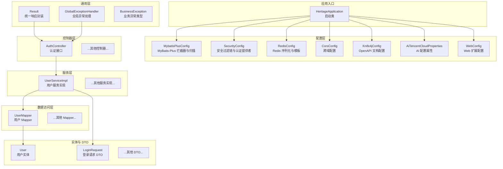
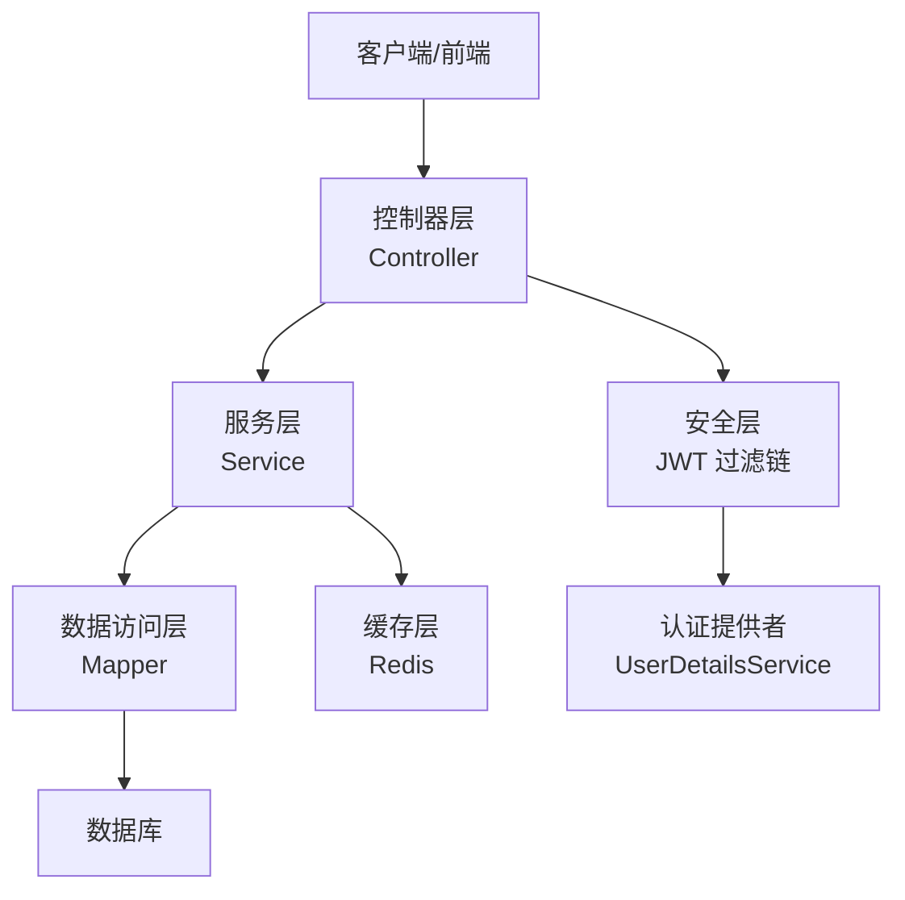
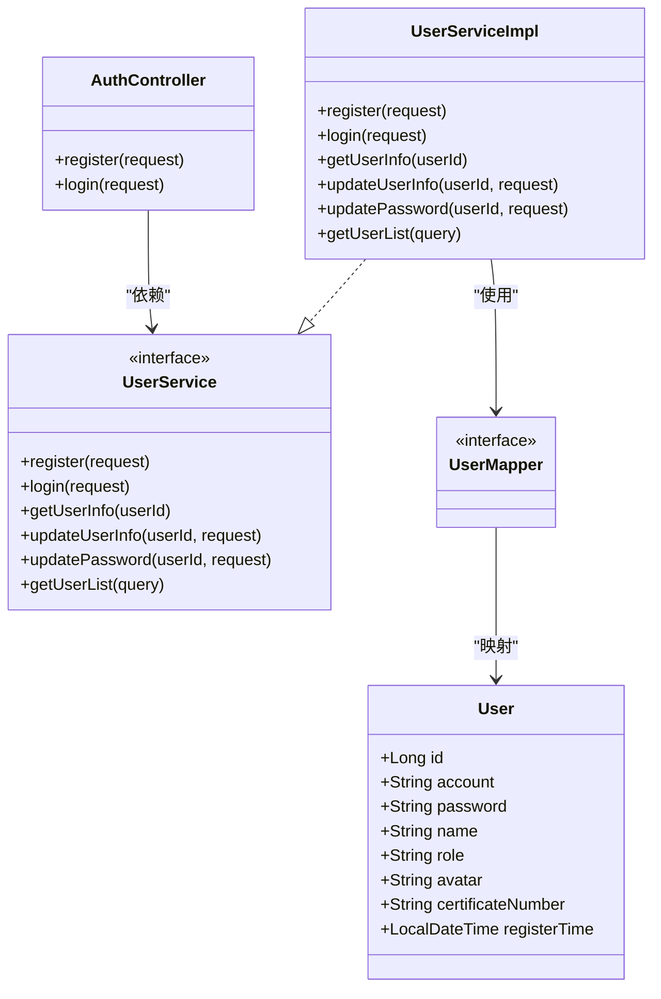
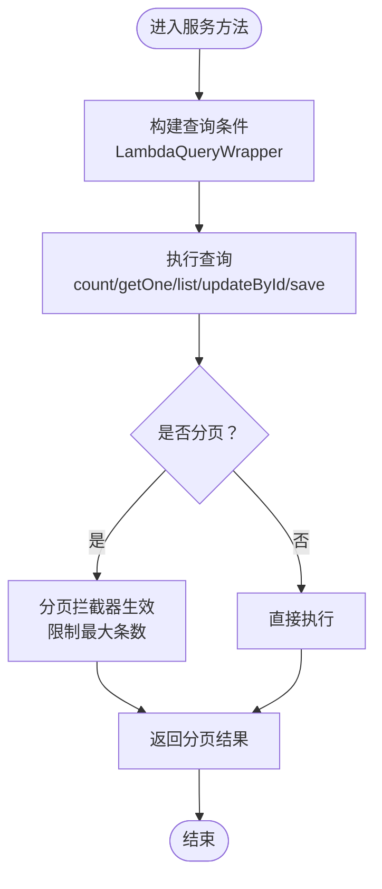
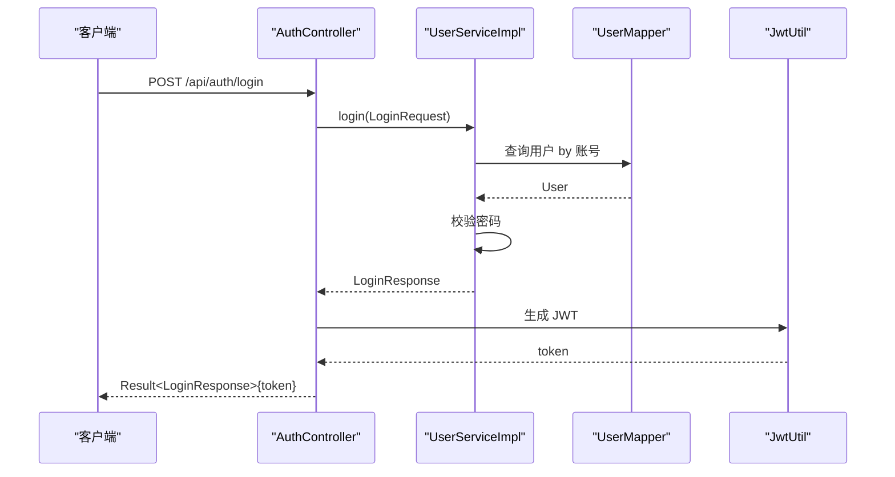
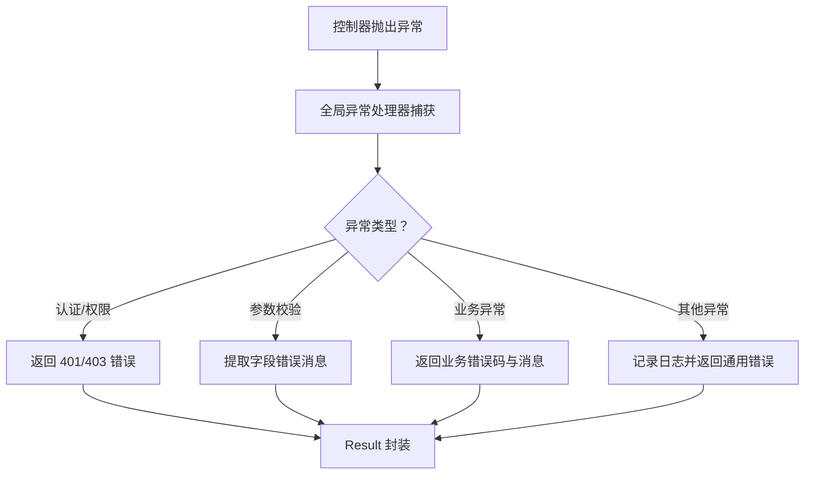
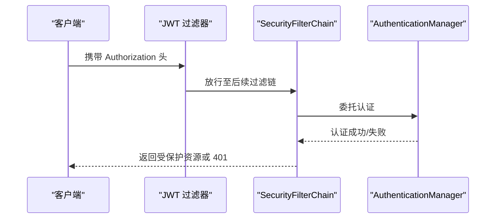
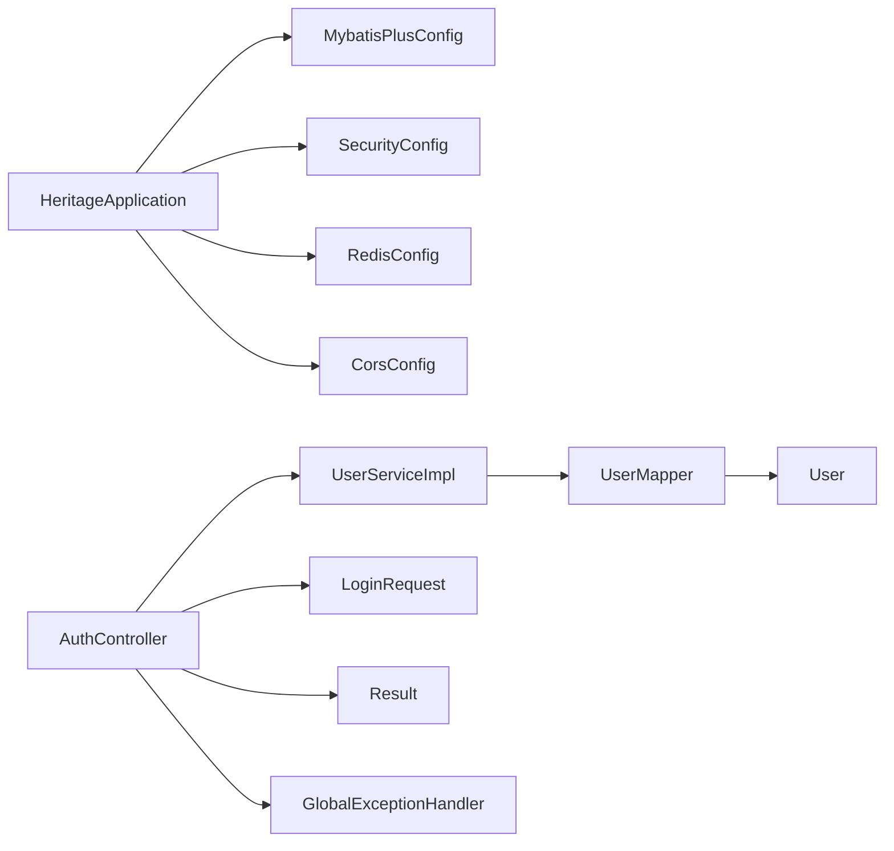

# 后端系统设计

<cite>
**本文引用的文件**
- [HeritageApplication.java](file://backend/src/main/java/com/heritage/HeritageApplication.java)
- [pom.xml](file://backend/pom.xml)
- [application.yml](file://backend/src/main/resources/application.yml)
- [Result.java](file://backend/src/main/java/com/heritage/common/Result.java)
- [GlobalExceptionHandler.java](file://backend/src/main/java/com/heritage/common/GlobalExceptionHandler.java)
- [BusinessException.java](file://backend/src/main/java/com/heritage/common/BusinessException.java)
- [MybatisPlusConfig.java](file://backend/src/main/java/com/heritage/config/MybatisPlusConfig.java)
- [SecurityConfig.java](file://backend/src/main/java/com/heritage/config/SecurityConfig.java)
- [RedisConfig.java](file://backend/src/main/java/com/heritage/config/RedisConfig.java)
- [CorsConfig.java](file://backend/src/main/java/com/heritage/config/CorsConfig.java)
- [AuthController.java](file://backend/src/main/java/com/heritage/controller/AuthController.java)
- [UserServiceImpl.java](file://backend/src/main/java/com/heritage/service/impl/UserServiceImpl.java)
- [UserMapper.java](file://backend/src/main/java/com/heritage/mapper/UserMapper.java)
- [User.java](file://backend/src/main/java/com/heritage/entity/User.java)
- [LoginRequest.java](file://backend/src/main/java/com/heritage/dto/LoginRequest.java)
- [JwtUtil.java](file://backend/src/main/java/com/heritage/util/JwtUtil.java)
</cite>

## 目录
1. [引言](#引言)
2. [项目结构](#项目结构)
3. [核心组件](#核心组件)
4. [架构总览](#架构总览)
5. [详细组件分析](#详细组件分析)
6. [依赖关系分析](#依赖关系分析)
7. [性能考虑](#性能考虑)
8. [故障排查指南](#故障排查指南)
9. [结论](#结论)
10. [附录](#附录)

## 引言
本设计文档面向“非遗产品智能定制商城系统”的后端，围绕基于 Spring Boot 的分层架构与模块化组织进行系统性阐述。重点覆盖以下方面：
- 分层架构模式：控制器层、服务层、数据访问层的职责与协作方式
- 依赖注入与自动装配：通过注解驱动的组件扫描与装配机制
- 模块化组织：按功能域划分的包结构与职责边界
- MyBatis-Plus 在数据持久化中的应用：实体映射、CRUD、分页、乐观锁与安全拦截
- 业务逻辑设计：参数校验、领域模型转换、事务边界
- 异常处理机制：全局异常统一响应与业务异常隔离
- 安全与鉴权：基于 JWT 的无状态认证与授权过滤链
- 性能优化与最佳实践：缓存、连接池、分页限制与日志策略

## 项目结构
后端采用标准 Maven 多模块风格（尽管当前仓库为单模块），以功能域划分包结构，遵循“控制器-服务-数据访问-实体-DTO-配置-工具”分层组织。

图表来源
- [HeritageApplication.java](file://backend/src/main/java/com/heritage/HeritageApplication.java#L1-L13)
- [MybatisPlusConfig.java](file://backend/src/main/java/com/heritage/config/MybatisPlusConfig.java#L1-L31)
- [SecurityConfig.java](file://backend/src/main/java/com/heritage/config/SecurityConfig.java#L1-L67)
- [RedisConfig.java](file://backend/src/main/java/com/heritage/config/RedisConfig.java#L1-L46)
- [CorsConfig.java](file://backend/src/main/java/com/heritage/config/CorsConfig.java#L1-L27)
- [AuthController.java](file://backend/src/main/java/com/heritage/controller/AuthController.java#L1-L48)
- [UserServiceImpl.java](file://backend/src/main/java/com/heritage/service/impl/UserServiceImpl.java#L1-L181)
- [UserMapper.java](file://backend/src/main/java/com/heritage/mapper/UserMapper.java#L1-L27)
- [User.java](file://backend/src/main/java/com/heritage/entity/User.java#L1-L38)
- [LoginRequest.java](file://backend/src/main/java/com/heritage/dto/LoginRequest.java#L1-L15)
- [Result.java](file://backend/src/main/java/com/heritage/common/Result.java#L1-L44)
- [GlobalExceptionHandler.java](file://backend/src/main/java/com/heritage/common/GlobalExceptionHandler.java#L1-L62)
- [BusinessException.java](file://backend/src/main/java/com/heritage/common/BusinessException.java#L1-L20)

章节来源
- [HeritageApplication.java](file://backend/src/main/java/com/heritage/HeritageApplication.java#L1-L13)
- [pom.xml](file://backend/pom.xml#L1-L129)
- [application.yml](file://backend/src/main/resources/application.yml#L1-L63)

## 核心组件
- 应用启动类：负责引导 Spring Boot 应用上下文，启用自动配置与组件扫描。
- 统一响应封装：Result 提供统一的响应结构，简化控制器返回值。
- 全局异常处理：集中处理认证、权限、参数校验与业务异常，保证对外一致的错误语义。
- 安全配置：基于 Spring Security 的无状态认证体系，集成 JWT 过滤器与密码编码器。
- MyBatis-Plus 配置：开启分页、乐观锁与防全表更新拦截，统一 Mapper 扫描路径。
- Redis 配置：定义 JSON 序列化策略与模板，支持缓存注解与高性能读写。
- 跨域配置：开放开发环境跨域访问，便于前后端联调。
- 控制器与服务：控制器负责请求接入与参数校验，服务层承载业务逻辑与事务控制，Mapper 负责数据持久化。

章节来源
- [Result.java](file://backend/src/main/java/com/heritage/common/Result.java#L1-L44)
- [GlobalExceptionHandler.java](file://backend/src/main/java/com/heritage/common/GlobalExceptionHandler.java#L1-L62)
- [BusinessException.java](file://backend/src/main/java/com/heritage/common/BusinessException.java#L1-L20)
- [SecurityConfig.java](file://backend/src/main/java/com/heritage/config/SecurityConfig.java#L1-L67)
- [MybatisPlusConfig.java](file://backend/src/main/java/com/heritage/config/MybatisPlusConfig.java#L1-L31)
- [RedisConfig.java](file://backend/src/main/java/com/heritage/config/RedisConfig.java#L1-L46)
- [CorsConfig.java](file://backend/src/main/java/com/heritage/config/CorsConfig.java#L1-L27)

## 架构总览
系统采用经典的三层架构与六边形架构思想：
- 表现层：控制器接收请求，进行参数校验与入参 DTO 转换，调用服务层。
- 领域层：服务层实现业务规则与流程编排，必要时进行领域对象转换与校验。
- 基础设施层：数据访问层通过 MyBatis-Plus 与数据库交互；安全层通过 Spring Security 与 JWT；缓存层通过 Redis 提升性能。

图表来源
- [AuthController.java](file://backend/src/main/java/com/heritage/controller/AuthController.java#L1-L48)
- [UserServiceImpl.java](file://backend/src/main/java/com/heritage/service/impl/UserServiceImpl.java#L1-L181)
- [UserMapper.java](file://backend/src/main/java/com/heritage/mapper/UserMapper.java#L1-L27)
- [SecurityConfig.java](file://backend/src/main/java/com/heritage/config/SecurityConfig.java#L1-L67)
- [RedisConfig.java](file://backend/src/main/java/com/heritage/config/RedisConfig.java#L1-L46)

## 详细组件分析

### 分层架构与职责划分
- 控制器层（Controller）
  - 职责：接收 HTTP 请求，进行参数校验（@Valid），调用服务层，组装统一响应。
  - 示例：认证控制器负责注册与登录接口，生成 JWT 并返回结果。
- 服务层（Service）
  - 职责：承载业务逻辑、事务边界、领域对象转换与校验。
  - 示例：用户服务实现注册、登录、信息更新与列表分页查询。
- 数据访问层（Mapper/DAO）
  - 职责：基于 MyBatis-Plus 实现 CRUD、条件查询与批量查询。
  - 示例：用户 Mapper 继承 BaseMapper，并自定义批量查询 SQL。

图表来源
- [AuthController.java](file://backend/src/main/java/com/heritage/controller/AuthController.java#L1-L48)
- [UserServiceImpl.java](file://backend/src/main/java/com/heritage/service/impl/UserServiceImpl.java#L1-L181)
- [UserMapper.java](file://backend/src/main/java/com/heritage/mapper/UserMapper.java#L1-L27)
- [User.java](file://backend/src/main/java/com/heritage/entity/User.java#L1-L38)

章节来源
- [AuthController.java](file://backend/src/main/java/com/heritage/controller/AuthController.java#L1-L48)
- [UserServiceImpl.java](file://backend/src/main/java/com/heritage/service/impl/UserServiceImpl.java#L1-L181)
- [UserMapper.java](file://backend/src/main/java/com/heritage/mapper/UserMapper.java#L1-L27)
- [User.java](file://backend/src/main/java/com/heritage/entity/User.java#L1-L38)

### MyBatis-Plus 数据持久化
- 实体映射：通过注解标注表名、字段名与自动填充策略，确保 ORM 一致性。
- CRUD 与条件构造：使用 LambdaQueryWrapper 构建查询条件，支持动态拼接与类型安全。
- 分页与乐观锁：启用分页拦截器与乐观锁拦截器，限制最大分页条数，避免全表扫描与并发冲突。
- 批量查询：自定义 XML SQL 实现 IN 查询，提升批量读取效率。
- 自动填充：利用元对象处理器设置创建时间等字段，减少重复代码。

图表来源
- [MybatisPlusConfig.java](file://backend/src/main/java/com/heritage/config/MybatisPlusConfig.java#L1-L31)
- [UserServiceImpl.java](file://backend/src/main/java/com/heritage/service/impl/UserServiceImpl.java#L1-L181)
- [UserMapper.java](file://backend/src/main/java/com/heritage/mapper/UserMapper.java#L1-L27)

章节来源
- [MybatisPlusConfig.java](file://backend/src/main/java/com/heritage/config/MybatisPlusConfig.java#L1-L31)
- [UserServiceImpl.java](file://backend/src/main/java/com/heritage/service/impl/UserServiceImpl.java#L1-L181)
- [UserMapper.java](file://backend/src/main/java/com/heritage/mapper/UserMapper.java#L1-L27)
- [User.java](file://backend/src/main/java/com/heritage/entity/User.java#L1-L38)

### 业务逻辑设计与事务管理
- 参数校验：控制器与 DTO 层结合 Bean Validation 注解，统一校验失败响应。
- 密码安全：注册与修改密码使用 BCrypt 编码，登录时匹配验证。
- 事务边界：服务方法标注 @Transactional，确保业务原子性；对写操作进行事务包裹。
- 领域转换：使用 BeanUtils 或手动映射 VO，避免直接暴露实体字段。
- 列表排序与分页：服务层对结果集进行排序与分页切片，保证接口稳定性。

图表来源
- [AuthController.java](file://backend/src/main/java/com/heritage/controller/AuthController.java#L1-L48)
- [UserServiceImpl.java](file://backend/src/main/java/com/heritage/service/impl/UserServiceImpl.java#L1-L181)
- [UserMapper.java](file://backend/src/main/java/com/heritage/mapper/UserMapper.java#L1-L27)
- [JwtUtil.java](file://backend/src/main/java/com/heritage/util/JwtUtil.java)

章节来源
- [AuthController.java](file://backend/src/main/java/com/heritage/controller/AuthController.java#L1-L48)
- [UserServiceImpl.java](file://backend/src/main/java/com/heritage/service/impl/UserServiceImpl.java#L1-L181)
- [LoginRequest.java](file://backend/src/main/java/com/heritage/dto/LoginRequest.java#L1-L15)

### 异常处理机制
- 全局异常：通过@RestControllerAdvice 统一捕获认证、权限、参数校验与业务异常。
- 业务异常：自定义 BusinessException，携带业务错误码与消息，便于前端识别与提示。
- 统一响应：所有异常最终包装为 Result 结构，保持接口一致性。

图表来源
- [GlobalExceptionHandler.java](file://backend/src/main/java/com/heritage/common/GlobalExceptionHandler.java#L1-L62)
- [BusinessException.java](file://backend/src/main/java/com/heritage/common/BusinessException.java#L1-L20)
- [Result.java](file://backend/src/main/java/com/heritage/common/Result.java#L1-L44)

章节来源
- [GlobalExceptionHandler.java](file://backend/src/main/java/com/heritage/common/GlobalExceptionHandler.java#L1-L62)
- [BusinessException.java](file://backend/src/main/java/com/heritage/common/BusinessException.java#L1-L20)
- [Result.java](file://backend/src/main/java/com/heritage/common/Result.java#L1-L44)

### 安全与鉴权
- 无状态会话：禁用 Session，采用 JWT 令牌进行身份标识。
- 过滤链：自定义 JWT 过滤器在用户名密码过滤器之前执行，解析并注入认证信息。
- 认证提供者：基于 UserDetailsService 与密码编码器完成认证。
- 资源保护：对公开接口放行，其余接口要求认证；Swagger 文档路径放行用于调试。

图表来源
- [SecurityConfig.java](file://backend/src/main/java/com/heritage/config/SecurityConfig.java#L1-L67)
- [JwtUtil.java](file://backend/src/main/java/com/heritage/util/JwtUtil.java)

章节来源
- [SecurityConfig.java](file://backend/src/main/java/com/heritage/config/SecurityConfig.java#L1-L67)

### 缓存与性能优化
- Redis 配置：定义 JSON 序列化策略，支持复杂对象缓存；开启注解式缓存。
- 连接池：Lettuce 连接池参数合理配置，避免阻塞与资源浪费。
- 分页限制：MyBatis-Plus 分页拦截器限制最大条数，防止大页导致内存压力。
- 日志与监控：全局异常记录日志，便于定位性能瓶颈与异常根因。

章节来源
- [RedisConfig.java](file://backend/src/main/java/com/heritage/config/RedisConfig.java#L1-L46)
- [MybatisPlusConfig.java](file://backend/src/main/java/com/heritage/config/MybatisPlusConfig.java#L1-L31)

## 依赖关系分析
- 启动类依赖于 Spring Boot 自动装配，无需显式配置即可加载各组件。
- 控制器依赖服务接口与 DTO；服务实现依赖 Mapper 与实体；Mapper 依赖数据库。
- 安全配置依赖 JWT 过滤器与用户详情服务；全局异常依赖 Result 统一响应。
- MyBatis-Plus 配置依赖数据库类型与拦截器插件；Redis 配置依赖连接工厂。

图表来源
- [HeritageApplication.java](file://backend/src/main/java/com/heritage/HeritageApplication.java#L1-L13)
- [MybatisPlusConfig.java](file://backend/src/main/java/com/heritage/config/MybatisPlusConfig.java#L1-L31)
- [SecurityConfig.java](file://backend/src/main/java/com/heritage/config/SecurityConfig.java#L1-L67)
- [RedisConfig.java](file://backend/src/main/java/com/heritage/config/RedisConfig.java#L1-L46)
- [CorsConfig.java](file://backend/src/main/java/com/heritage/config/CorsConfig.java#L1-L27)
- [AuthController.java](file://backend/src/main/java/com/heritage/controller/AuthController.java#L1-L48)
- [UserServiceImpl.java](file://backend/src/main/java/com/heritage/service/impl/UserServiceImpl.java#L1-L181)
- [UserMapper.java](file://backend/src/main/java/com/heritage/mapper/UserMapper.java#L1-L27)
- [User.java](file://backend/src/main/java/com/heritage/entity/User.java#L1-L38)
- [LoginRequest.java](file://backend/src/main/java/com/heritage/dto/LoginRequest.java#L1-L15)
- [Result.java](file://backend/src/main/java/com/heritage/common/Result.java#L1-L44)
- [GlobalExceptionHandler.java](file://backend/src/main/java/com/heritage/common/GlobalExceptionHandler.java#L1-L62)

章节来源
- [pom.xml](file://backend/pom.xml#L1-L129)
- [application.yml](file://backend/src/main/resources/application.yml#L1-L63)

## 性能考虑
- 数据访问层
  - 使用分页拦截器限制每页最大条数，避免超大数据量查询。
  - 对高频读取场景引入 Redis 缓存，降低数据库压力。
  - 批量查询使用 IN 子句或批量 ID 查询，减少多次往返。
- 业务层
  - 对列表查询先在内存中排序再分页，避免数据库排序成本过高。
  - 严格控制 DTO 映射范围，避免不必要的字段拷贝。
- 安全层
  - JWT 令牌短小精悍，避免在令牌中携带敏感信息。
  - 使用无状态会话，减少服务器端状态存储。
- 配置层
  - 合理设置 Redis 连接池参数与超时时间，避免连接泄漏。
  - 控制文件上传大小与请求大小，防止内存溢出。

## 故障排查指南
- 登录失败
  - 检查账号是否存在与密码是否正确；确认密码编码与匹配逻辑。
- 权限异常
  - 确认请求头是否携带有效 JWT；检查安全过滤链配置。
- 参数校验失败
  - 查看 DTO 字段注解与错误消息；核对请求体格式。
- 业务异常
  - 捕获 BusinessException 获取具体错误码与消息；查看日志定位。
- 数据库异常
  - 检查分页参数与最大限制；确认乐观锁版本号是否冲突。

章节来源
- [GlobalExceptionHandler.java](file://backend/src/main/java/com/heritage/common/GlobalExceptionHandler.java#L1-L62)
- [BusinessException.java](file://backend/src/main/java/com/heritage/common/BusinessException.java#L1-L20)
- [UserServiceImpl.java](file://backend/src/main/java/com/heritage/service/impl/UserServiceImpl.java#L1-L181)

## 结论
本系统以 Spring Boot 为基础，采用清晰的分层架构与模块化组织，结合 MyBatis-Plus 的高效数据访问能力、Spring Security 的安全防护与 Redis 的缓存优化，形成了高内聚、低耦合且易于扩展的后端架构。通过统一响应与全局异常处理，提升了系统的可维护性与用户体验。建议在后续迭代中持续完善缓存策略、埋点监控与灰度发布流程，以进一步提升系统稳定性与可观测性。

## 附录
- 代码规范与最佳实践
  - 包命名：按功能域划分，如 controller、service、mapper、entity、dto、config、util。
  - 类命名：使用名词短语，接口以 I 前缀或抽象类前缀区分；实现类以 Impl 结尾。
  - 方法命名：使用动词短语，体现职责；事务方法使用 @Transactional 标注。
  - DTO 设计：请求 DTO 与响应 DTO 分离，避免直接暴露实体字段。
  - 日志：使用 SLF4J 记录关键路径与异常堆栈，避免生产输出敏感信息。
- 性能优化建议
  - 对热点数据引入 Redis 缓存，设置合理的过期策略。
  - 对复杂查询建立合适索引，避免全表扫描。
  - 控制分页大小与深度，避免一次性加载过多数据。
  - 使用连接池与超时配置，避免资源泄露与阻塞。