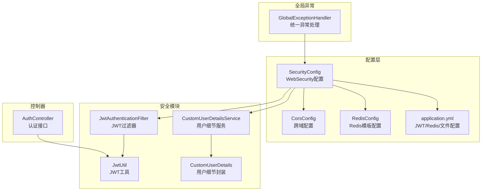
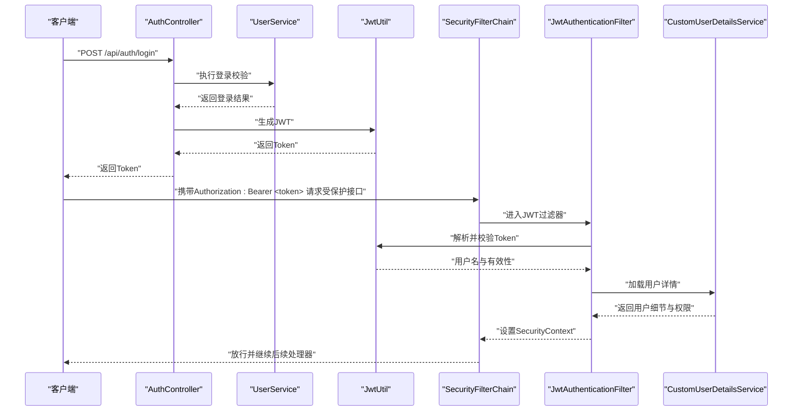
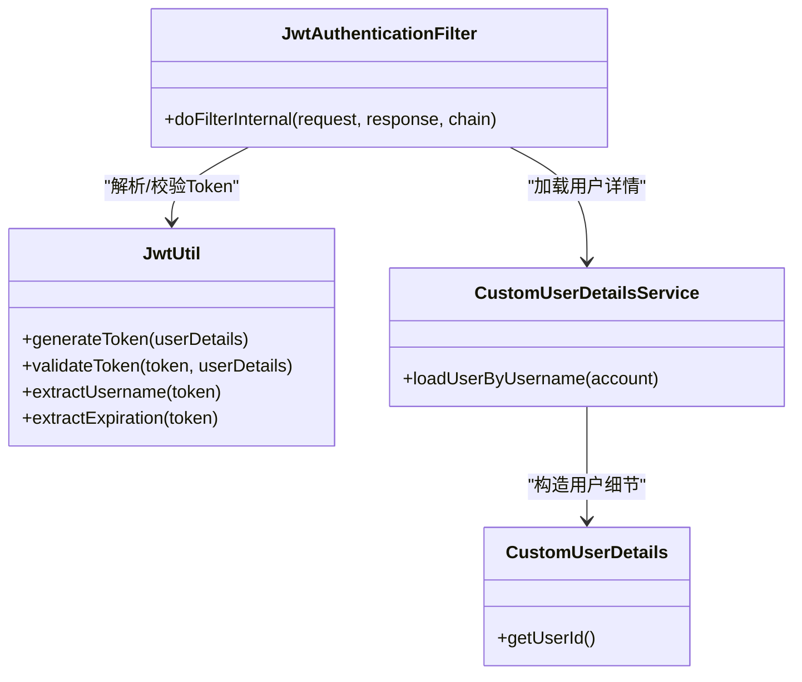
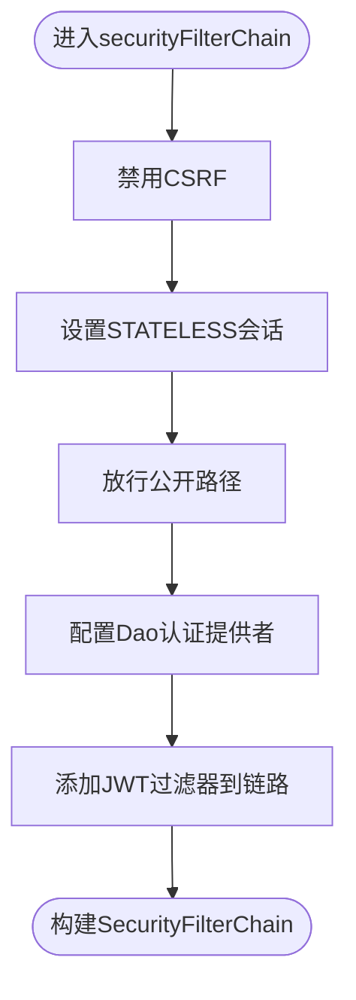
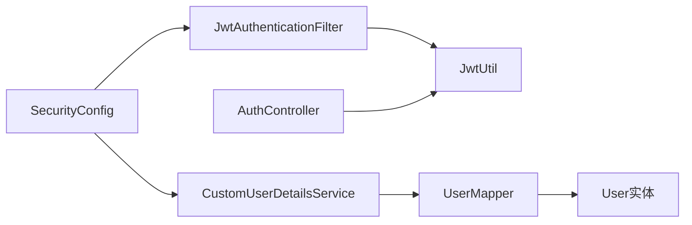

# 安全与性能

<cite>
**本文引用的文件**
- [SecurityConfig.java](file://backend/src/main/java/com/heritage/config/SecurityConfig.java)
- [JwtAuthenticationFilter.java](file://backend/src/main/java/com/heritage/security/JwtAuthenticationFilter.java)
- [CustomUserDetailsService.java](file://backend/src/main/java/com/heritage/security/CustomUserDetailsService.java)
- [CustomUserDetails.java](file://backend/src/main/java/com/heritage/security/CustomUserDetails.java)
- [JwtUtil.java](file://backend/src/main/java/com/heritage/util/JwtUtil.java)
- [AuthController.java](file://backend/src/main/java/com/heritage/controller/AuthController.java)
- [application.yml](file://backend/src/main/resources/application.yml)
- [GlobalExceptionHandler.java](file://backend/src/main/java/com/heritage/common/GlobalExceptionHandler.java)
- [CorsConfig.java](file://backend/src/main/java/com/heritage/config/CorsConfig.java)
- [RedisConfig.java](file://backend/src/main/java/com/heritage/config/RedisConfig.java)
- [UserService.java](file://backend/src/main/java/com/heritage/service/UserService.java)
- [UserMapper.java](file://backend/src/main/java/com/heritage/mapper/UserMapper.java)
- [User.java](file://backend/src/main/java/com/heritage/entity/User.java)
</cite>

## 目录
1. [简介](#简介)
2. [项目结构](#项目结构)
3. [核心组件](#核心组件)
4. [架构总览](#架构总览)
5. [详细组件分析](#详细组件分析)
6. [依赖分析](#依赖分析)
7. [性能考虑](#性能考虑)
8. [故障排查指南](#故障排查指南)
9. [结论](#结论)
10. [附录](#附录)

## 简介
本文件面向“非遗产品智能定制商城系统”，聚焦于安全与性能优化主题，系统性阐述以下内容：
- JWT认证机制的实现原理、密钥与过期策略、权限控制方案
- Spring Security在系统中的应用：过滤器链配置、用户细节服务、自定义认证逻辑
- 数据加密、输入验证与常见攻击防护（如CSRF、会话劫持、越权）
- 缓存策略设计、数据库性能优化与前端性能调优
- 监控指标与日志策略、故障排查流程与高并发稳定性保障

## 项目结构
后端采用标准分层架构：控制器层、服务层、持久层、配置层、工具与安全模块。安全相关的关键位置如下：
- 配置层：SecurityConfig（WebSecurity配置）、CorsConfig（跨域）、RedisConfig（缓存序列化）
- 安全模块：JwtAuthenticationFilter（JWT过滤器）、CustomUserDetailsService（用户细节服务）、JwtUtil（JWT工具）
- 控制器：AuthController（认证接口）
- 全局异常：GlobalExceptionHandler（统一异常处理）
- 配置文件：application.yml（JWT密钥、过期时间、Redis连接池、文件上传限制）

图表来源
- [SecurityConfig.java](file://backend/src/main/java/com/heritage/config/SecurityConfig.java#L50-L65)
- [JwtAuthenticationFilter.java](file://backend/src/main/java/com/heritage/security/JwtAuthenticationFilter.java#L24-L71)
- [CustomUserDetailsService.java](file://backend/src/main/java/com/heritage/security/CustomUserDetailsService.java#L17-L38)
- [JwtUtil.java](file://backend/src/main/java/com/heritage/util/JwtUtil.java#L18-L80)
- [AuthController.java](file://backend/src/main/java/com/heritage/controller/AuthController.java#L21-L47)
- [CorsConfig.java](file://backend/src/main/java/com/heritage/config/CorsConfig.java#L10-L26)
- [RedisConfig.java](file://backend/src/main/java/com/heritage/config/RedisConfig.java#L18-L44)
- [application.yml](file://backend/src/main/resources/application.yml#L39-L41)

章节来源
- [SecurityConfig.java](file://backend/src/main/java/com/heritage/config/SecurityConfig.java#L22-L67)
- [application.yml](file://backend/src/main/resources/application.yml#L1-L63)

## 核心组件
- WebSecurity配置（SecurityConfig）
  - 禁用CSRF，启用方法级安全注解
  - 无状态会话（STATELESS），基于请求头的JWT认证
  - 放行公开接口（认证、静态资源、Swagger）
  - 注入自定义JWT过滤器与用户细节服务
- JWT过滤器（JwtAuthenticationFilter）
  - 从Authorization头解析Bearer Token
  - 使用JwtUtil提取用户名并校验有效性
  - 加载用户详情并写入SecurityContext
- 用户细节服务（CustomUserDetailsService）
  - 基于UserMapper按账号查询用户
  - 构造CustomUserDetails并赋予角色权限
- JWT工具（JwtUtil）
  - 密钥加载与校验（支持最小长度保护）
  - 生成与验证Token（签发时间、过期时间）
- 认证控制器（AuthController）
  - 登录接口生成JWT返回客户端
- 统一异常处理（GlobalExceptionHandler）
  - 处理认证/授权异常与参数校验异常
- 跨域与缓存
  - CorsConfig提供宽松跨域策略
  - RedisConfig提供JSON序列化与连接池配置

章节来源
- [SecurityConfig.java](file://backend/src/main/java/com/heritage/config/SecurityConfig.java#L31-L65)
- [JwtAuthenticationFilter.java](file://backend/src/main/java/com/heritage/security/JwtAuthenticationFilter.java#L29-L70)
- [CustomUserDetailsService.java](file://backend/src/main/java/com/heritage/security/CustomUserDetailsService.java#L21-L37)
- [JwtUtil.java](file://backend/src/main/java/com/heritage/util/JwtUtil.java#L26-L79)
- [AuthController.java](file://backend/src/main/java/com/heritage/controller/AuthController.java#L33-L46)
- [GlobalExceptionHandler.java](file://backend/src/main/java/com/heritage/common/GlobalExceptionHandler.java#L16-L60)
- [CorsConfig.java](file://backend/src/main/java/com/heritage/config/CorsConfig.java#L12-L25)
- [RedisConfig.java](file://backend/src/main/java/com/heritage/config/RedisConfig.java#L20-L44)

## 架构总览
下图展示了认证与授权在系统中的端到端流程。

图表来源
- [AuthController.java](file://backend/src/main/java/com/heritage/controller/AuthController.java#L33-L46)
- [JwtAuthenticationFilter.java](file://backend/src/main/java/com/heritage/security/JwtAuthenticationFilter.java#L29-L70)
- [JwtUtil.java](file://backend/src/main/java/com/heritage/util/JwtUtil.java#L36-L79)
- [CustomUserDetailsService.java](file://backend/src/main/java/com/heritage/security/CustomUserDetailsService.java#L21-L37)
- [SecurityConfig.java](file://backend/src/main/java/com/heritage/config/SecurityConfig.java#L50-L65)

## 详细组件分析

### JWT认证机制与安全配置
- 密钥与过期策略
  - 密钥来源于配置文件，内部对密钥长度进行保护性校验
  - 过期时间以毫秒为单位，可在配置中调整
- Token生成与校验
  - 登录成功后由控制器生成JWT并返回
  - 过滤器在每次请求时解析并校验Token，确保未过期且与用户匹配
- 无状态会话
  - SessionCreationPolicy设为STATELESS，避免会话存储带来的扩展性问题
- 权限控制
  - 角色前缀为“ROLE_”，由用户角色映射而来
  - 方法级安全注解已启用，便于在服务层使用注解细化权限

图表来源
- [JwtUtil.java](file://backend/src/main/java/com/heritage/util/JwtUtil.java#L61-L79)
- [JwtAuthenticationFilter.java](file://backend/src/main/java/com/heritage/security/JwtAuthenticationFilter.java#L29-L70)
- [CustomUserDetailsService.java](file://backend/src/main/java/com/heritage/security/CustomUserDetailsService.java#L21-L37)
- [CustomUserDetails.java](file://backend/src/main/java/com/heritage/security/CustomUserDetails.java#L14-L21)

章节来源
- [application.yml](file://backend/src/main/resources/application.yml#L39-L41)
- [JwtUtil.java](file://backend/src/main/java/com/heritage/util/JwtUtil.java#L20-L41)
- [AuthController.java](file://backend/src/main/java/com/heritage/controller/AuthController.java#L35-L46)
- [SecurityConfig.java](file://backend/src/main/java/com/heritage/config/SecurityConfig.java#L50-L65)

### Spring Security过滤器链与用户细节服务
- 过滤器链配置要点
  - 禁用CSRF，适合无状态API
  - 设置无状态会话
  - 放行认证、静态资源、Swagger等路径
  - 在用户名密码过滤器之前添加JWT过滤器
- 用户细节服务
  - 通过账号查询用户，构建带角色权限的用户细节对象
  - 未找到用户抛出认证异常

图表来源
- [SecurityConfig.java](file://backend/src/main/java/com/heritage/config/SecurityConfig.java#L50-L65)

章节来源
- [SecurityConfig.java](file://backend/src/main/java/com/heritage/config/SecurityConfig.java#L31-L65)
- [CustomUserDetailsService.java](file://backend/src/main/java/com/heritage/security/CustomUserDetailsService.java#L21-L37)

### 输入验证与防攻击措施
- 参数校验
  - 控制器层使用校验注解，配合全局异常处理返回明确错误信息
- 异常处理
  - 对认证异常、权限不足、参数校验失败进行统一拦截与格式化输出
- CSRF防护
  - 已禁用CSRF，适用于JWT无状态认证
- 跨域策略
  - 提供宽松跨域配置，生产环境建议限定来源与头部

章节来源
- [GlobalExceptionHandler.java](file://backend/src/main/java/com/heritage/common/GlobalExceptionHandler.java#L46-L60)
- [CorsConfig.java](file://backend/src/main/java/com/heritage/config/CorsConfig.java#L12-L25)
- [SecurityConfig.java](file://backend/src/main/java/com/heritage/config/SecurityConfig.java#L52-L53)

### 缓存策略设计
- Redis模板配置
  - 使用Jackson2JsonRedisSerializer进行对象序列化
  - 键与哈希键采用String序列化，值采用JSON序列化
  - 提供连接工厂与线程池参数，便于扩展
- 应用建议
  - 对热点读取（如用户信息、分类树、商品列表）进行缓存
  - 明确TTL与失效策略，避免缓存穿透与雪崩

章节来源
- [RedisConfig.java](file://backend/src/main/java/com/heritage/config/RedisConfig.java#L20-L44)

### 数据库性能优化
- 查询优化
  - 用户批量查询使用IN子句，减少多次往返
- 索引建议（参考设计文档）
  - 订单表：唯一索引订单号、用户索引、用户+状态、用户+地址
  - 地址表：用户索引、用户+默认、用户+区域深度
  - 分类表：父级索引
- 建议
  - 结合慢查询日志与执行计划，持续优化热点SQL
  - 对高频字段建立复合索引，避免回表

章节来源
- [UserMapper.java](file://backend/src/main/java/com/heritage/mapper/UserMapper.java#L15-L25)
- [TODO/数据库设计.md](file://TODO/数据库设计.md#L224-L249)

### 前端性能调优方案
- 图片与静态资源
  - 合理压缩与懒加载，CDN加速
- 接口优化
  - 分页查询、条件筛选、缓存命中优先
- 交互体验
  - 骨架屏、骨架屏与骨架屏结合，提升感知性能

（本小节为通用建议，不直接分析具体文件）

## 依赖分析
- 组件耦合
  - SecurityConfig依赖JwtAuthenticationFilter与UserDetailsService
  - JwtAuthenticationFilter依赖JwtUtil与UserDetailsService
  - AuthController依赖JwtUtil与UserService
  - CustomUserDetailsService依赖UserMapper与User实体
- 外部依赖
  - Spring Security、Spring MVC、MyBatis-Plus、Redis、Knife4j/Swagger

图表来源
- [SecurityConfig.java](file://backend/src/main/java/com/heritage/config/SecurityConfig.java#L28-L29)
- [JwtAuthenticationFilter.java](file://backend/src/main/java/com/heritage/security/JwtAuthenticationFilter.java#L26-L27)
- [AuthController.java](file://backend/src/main/java/com/heritage/controller/AuthController.java#L23-L24)
- [CustomUserDetailsService.java](file://backend/src/main/java/com/heritage/security/CustomUserDetailsService.java#L19)

章节来源
- [SecurityConfig.java](file://backend/src/main/java/com/heritage/config/SecurityConfig.java#L28-L47)
- [JwtAuthenticationFilter.java](file://backend/src/main/java/com/heritage/security/JwtAuthenticationFilter.java#L26-L49)
- [AuthController.java](file://backend/src/main/java/com/heritage/controller/AuthController.java#L23-L46)
- [CustomUserDetailsService.java](file://backend/src/main/java/com/heritage/security/CustomUserDetailsService.java#L19-L36)
- [UserMapper.java](file://backend/src/main/java/com/heritage/mapper/UserMapper.java#L13-L26)
- [User.java](file://backend/src/main/java/com/heritage/entity/User.java#L11-L37)

## 性能考虑
- 认证性能
  - JWT无状态认证避免服务器端会话存储，降低扩展成本
  - 建议对用户详情进行本地缓存（短期TTL），减少数据库压力
- 网络与IO
  - 合理设置Redis连接池参数，避免阻塞
  - 文件上传大小与请求大小限制已在配置中设定
- 并发与稳定性
  - 无状态设计利于水平扩展
  - 建议引入限流与熔断（如Sentinel/Resilience4j），防止突发流量击穿

章节来源
- [application.yml](file://backend/src/main/resources/application.yml#L12-L15)
- [application.yml](file://backend/src/main/resources/application.yml#L29-L34)

## 故障排查指南
- 认证失败
  - 检查Authorization头是否为Bearer Token
  - 核对JWT密钥与过期时间配置
  - 查看过滤器日志与异常处理返回码
- 权限不足
  - 确认用户角色是否正确映射为“ROLE_”前缀
  - 检查方法级安全注解是否生效
- 参数校验失败
  - 关注全局异常处理对校验异常的统一返回
- 跨域问题
  - 生产环境收紧允许来源与头部，避免*策略

章节来源
- [JwtAuthenticationFilter.java](file://backend/src/main/java/com/heritage/security/JwtAuthenticationFilter.java#L38-L66)
- [GlobalExceptionHandler.java](file://backend/src/main/java/com/heritage/common/GlobalExceptionHandler.java#L16-L60)
- [CorsConfig.java](file://backend/src/main/java/com/heritage/config/CorsConfig.java#L15-L18)

## 结论
本系统通过JWT无状态认证与Spring Security过滤器链实现了清晰的安全边界，配合合理的异常处理与跨域配置，满足REST API的安全与可用性要求。建议在生产环境中进一步完善密钥管理、限流熔断、缓存策略与数据库索引优化，并建立完善的监控与日志体系，以保障高并发场景下的稳定性与安全性。

## 附录
- 配置项摘要
  - JWT密钥与过期时间：见配置文件
  - Redis连接与池化参数：见配置文件
  - 文件上传大小限制：见配置文件
- 数据模型要点
  - 用户实体包含账号、密码、角色等字段，密码字段在JSON序列化时忽略输出

章节来源
- [application.yml](file://backend/src/main/resources/application.yml#L39-L41)
- [application.yml](file://backend/src/main/resources/application.yml#L24-L34)
- [application.yml](file://backend/src/main/resources/application.yml#L12-L15)
- [User.java](file://backend/src/main/java/com/heritage/entity/User.java#L16-L27)