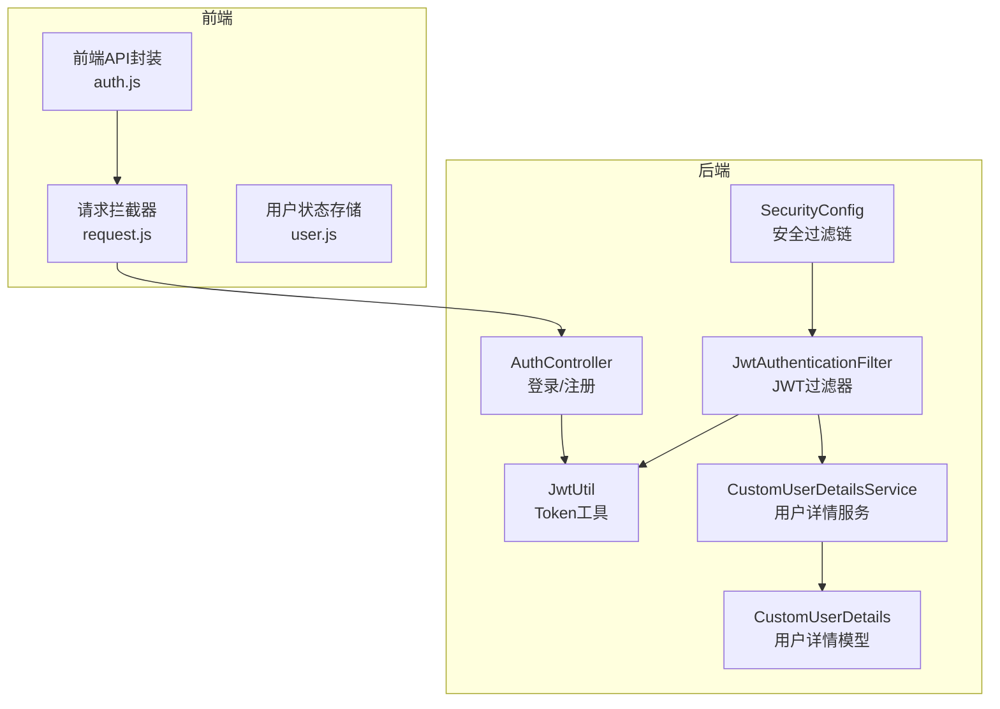
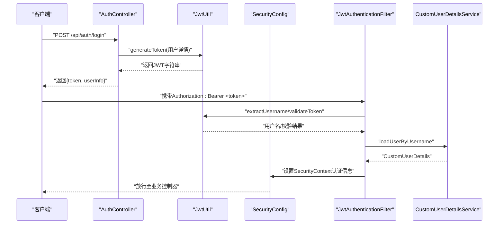
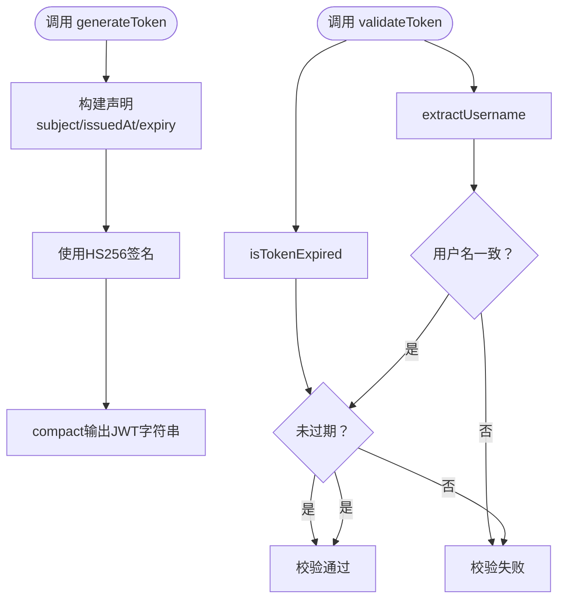
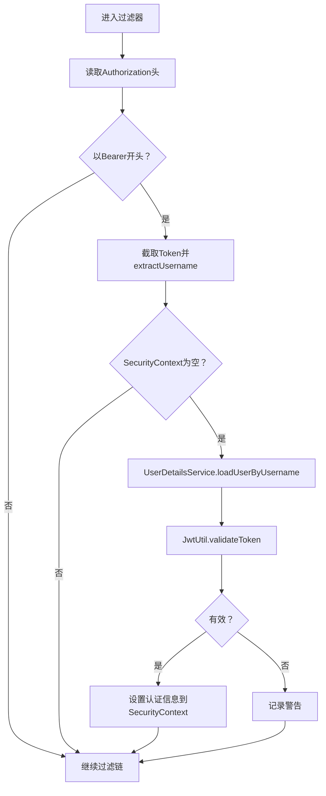
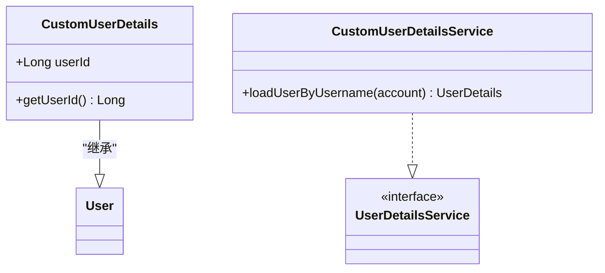
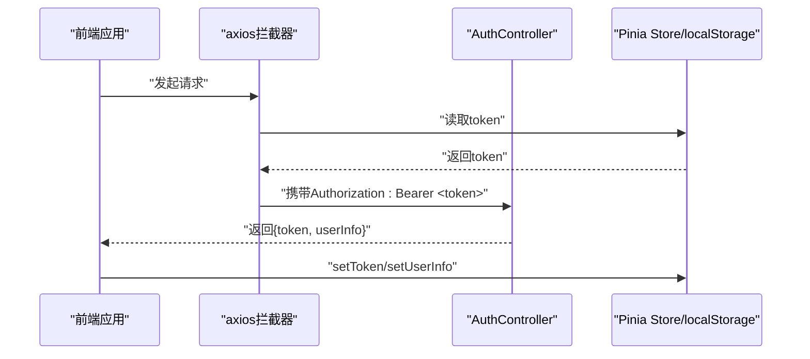
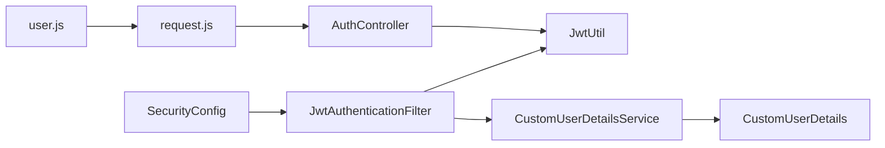

# JWT认证机制

<cite>
**本文引用的文件列表**
- [JwtAuthenticationFilter.java](file://backend/src/main/java/com/heritage/security/JwtAuthenticationFilter.java)
- [JwtUtil.java](file://backend/src/main/java/com/heritage/util/JwtUtil.java)
- [CustomUserDetailsService.java](file://backend/src/main/java/com/heritage/security/CustomUserDetailsService.java)
- [CustomUserDetails.java](file://backend/src/main/java/com/heritage/security/CustomUserDetails.java)
- [SecurityConfig.java](file://backend/src/main/java/com/heritage/config/SecurityConfig.java)
- [AuthController.java](file://backend/src/main/java/com/heritage/controller/AuthController.java)
- [application.yml](file://backend/src/main/resources/application.yml)
- [request.js](file://frontend/src/utils/request.js)
- [user.js](file://frontend/src/stores/user.js)
- [auth.js](file://frontend/src/api/auth.js)
- [LoginRequest.java](file://backend/src/main/java/com/heritage/dto/LoginRequest.java)
- [LoginResponse.java](file://backend/src/main/java/com/heritage/dto/LoginResponse.java)
</cite>

## 目录
1. [简介](#简介)
2. [项目结构与角色定位](#项目结构与角色定位)
3. [核心组件总览](#核心组件总览)
4. [架构概览](#架构概览)
5. [详细组件分析](#详细组件分析)
6. [依赖关系分析](#依赖关系分析)
7. [性能与安全考量](#性能与安全考量)
8. [故障排查指南](#故障排查指南)
9. [结论](#结论)
10. [附录：配置参数与最佳实践](#附录配置参数与最佳实践)

## 简介
本文件面向非遗产品智能定制商城系统的JWT认证机制，系统性阐述从Token生成、验证到请求头传递与安全存储的完整流程。重点覆盖：
- JWT Token结构与签名算法选择
- 过期时间管理策略
- JwtAuthenticationFilter的实现原理（Token提取、验证与用户身份解析）
- 请求头中Token的传递方式与前端安全存储方案
- JWT配置参数说明、性能优化建议与常见问题解决

## 项目结构与角色定位
后端采用Spring Security + Spring MVC + MyBatis-Plus架构，JWT认证通过自定义过滤器在请求链路中拦截并校验Token，结合自定义UserDetails服务完成用户身份解析与授权。

图表来源
- [SecurityConfig.java](file://backend/src/main/java/com/heritage/config/SecurityConfig.java#L50-L65)
- [JwtAuthenticationFilter.java](file://backend/src/main/java/com/heritage/security/JwtAuthenticationFilter.java#L24-L71)
- [JwtUtil.java](file://backend/src/main/java/com/heritage/util/JwtUtil.java#L17-L80)
- [CustomUserDetailsService.java](file://backend/src/main/java/com/heritage/security/CustomUserDetailsService.java#L15-L38)
- [CustomUserDetails.java](file://backend/src/main/java/com/heritage/security/CustomUserDetails.java#L9-L22)
- [AuthController.java](file://backend/src/main/java/com/heritage/controller/AuthController.java#L17-L47)

章节来源
- [SecurityConfig.java](file://backend/src/main/java/com/heritage/config/SecurityConfig.java#L22-L65)
- [JwtAuthenticationFilter.java](file://backend/src/main/java/com/heritage/security/JwtAuthenticationFilter.java#L24-L71)
- [JwtUtil.java](file://backend/src/main/java/com/heritage/util/JwtUtil.java#L17-L80)
- [CustomUserDetailsService.java](file://backend/src/main/java/com/heritage/security/CustomUserDetailsService.java#L15-L38)
- [CustomUserDetails.java](file://backend/src/main/java/com/heritage/security/CustomUserDetails.java#L9-L22)
- [AuthController.java](file://backend/src/main/java/com/heritage/controller/AuthController.java#L17-L47)

## 核心组件总览
- JwtUtil：负责Token生成、解析、校验与过期判断，使用HS256签名算法与配置项控制密钥与有效期。
- JwtAuthenticationFilter：在每个HTTP请求进入业务控制器前，从Authorization头提取Token并进行验证，成功后将认证信息写入SecurityContext。
- CustomUserDetailsService：根据账号查询用户并构建包含角色权限的CustomUserDetails对象。
- SecurityConfig：配置无状态会话策略、放行路径以及将JWT过滤器插入到UsernamePasswordAuthenticationFilter之前。
- AuthController：登录时生成Token并返回给客户端；注册接口用于用户创建。
- 前端：通过请求拦截器统一注入Authorization头，使用Pinia与localStorage持久化保存Token与用户信息。

章节来源
- [JwtUtil.java](file://backend/src/main/java/com/heritage/util/JwtUtil.java#L17-L80)
- [JwtAuthenticationFilter.java](file://backend/src/main/java/com/heritage/security/JwtAuthenticationFilter.java#L24-L71)
- [CustomUserDetailsService.java](file://backend/src/main/java/com/heritage/security/CustomUserDetailsService.java#L15-L38)
- [SecurityConfig.java](file://backend/src/main/java/com/heritage/config/SecurityConfig.java#L22-L65)
- [AuthController.java](file://backend/src/main/java/com/heritage/controller/AuthController.java#L17-L47)
- [request.js](file://frontend/src/utils/request.js#L9-L20)
- [user.js](file://frontend/src/stores/user.js#L4-L32)

## 架构概览
下图展示一次典型登录与后续请求的JWT认证流程。

图表来源
- [AuthController.java](file://backend/src/main/java/com/heritage/controller/AuthController.java#L33-L46)
- [JwtUtil.java](file://backend/src/main/java/com/heritage/util/JwtUtil.java#L61-L79)
- [SecurityConfig.java](file://backend/src/main/java/com/heritage/config/SecurityConfig.java#L49-L65)
- [JwtAuthenticationFilter.java](file://backend/src/main/java/com/heritage/security/JwtAuthenticationFilter.java#L29-L70)
- [CustomUserDetailsService.java](file://backend/src/main/java/com/heritage/security/CustomUserDetailsService.java#L21-L37)

## 详细组件分析

### JwtUtil：Token生成、解析与校验
- 密钥管理：从配置读取jwt.secret，若长度不足32字节则回退到内置安全密钥；使用HS256签名算法。
- Token结构：包含签发时间、过期时间、主题（用户名）等声明。
- 生成流程：设置签发时间、过期时间与签名算法，最终compact输出。
- 解析与校验：解析所有声明，提取用户名与过期时间，校验用户名一致且未过期。
- 过期时间：由配置jwt.expiration控制（毫秒），默认7天。

图表来源
- [JwtUtil.java](file://backend/src/main/java/com/heritage/util/JwtUtil.java#L61-L79)
- [JwtUtil.java](file://backend/src/main/java/com/heritage/util/JwtUtil.java#L49-L59)

章节来源
- [JwtUtil.java](file://backend/src/main/java/com/heritage/util/JwtUtil.java#L17-L80)
- [application.yml](file://backend/src/main/resources/application.yml#L39-L41)

### JwtAuthenticationFilter：请求拦截与认证注入
- 头部解析：从Authorization头提取Bearer Token，截取“Bearer ”后的字符串。
- 用户名提取：调用JwtUtil.extractUsername解析出用户名。
- 安全上下文注入：当SecurityContext中无认证信息时，加载用户详情并校验Token，成功后创建UsernamePasswordAuthenticationToken并设置到SecurityContextHolder。
- 日志与异常：对关键步骤进行日志记录，并捕获异常避免中断请求链。

图表来源
- [JwtAuthenticationFilter.java](file://backend/src/main/java/com/heritage/security/JwtAuthenticationFilter.java#L29-L70)

章节来源
- [JwtAuthenticationFilter.java](file://backend/src/main/java/com/heritage/security/JwtAuthenticationFilter.java#L24-L71)

### CustomUserDetailsService 与 CustomUserDetails：用户模型与权限
- CustomUserDetailsService：按账号查询用户，构造包含角色权限的CustomUserDetails对象（角色前缀为ROLE_）。
- CustomUserDetails：扩展Spring Security的User，增加userId字段以便在业务层直接获取用户标识。

图表来源
- [CustomUserDetails.java](file://backend/src/main/java/com/heritage/security/CustomUserDetails.java#L9-L22)
- [CustomUserDetailsService.java](file://backend/src/main/java/com/heritage/security/CustomUserDetailsService.java#L15-L38)

章节来源
- [CustomUserDetailsService.java](file://backend/src/main/java/com/heritage/security/CustomUserDetailsService.java#L15-L38)
- [CustomUserDetails.java](file://backend/src/main/java/com/heritage/security/CustomUserDetails.java#L9-L22)

### SecurityConfig：无状态安全过滤链
- 会话策略：STATELESS，禁用CSRF，放行公开接口（如认证、静态资源、Swagger）。
- 过滤器链：将JwtAuthenticationFilter插入到UsernamePasswordAuthenticationFilter之前，确保每次请求都进行JWT校验。

章节来源
- [SecurityConfig.java](file://backend/src/main/java/com/heritage/config/SecurityConfig.java#L49-L65)

### AuthController：登录与Token下发
- 登录流程：调用业务层登录获取用户信息，随后使用JwtUtil生成Token并返回给客户端。
- 注册流程：调用业务层注册接口创建新用户。

章节来源
- [AuthController.java](file://backend/src/main/java/com/heritage/controller/AuthController.java#L26-L46)

### 前端集成：请求头传递与本地存储
- 请求拦截器：在请求发送前从localStorage读取token，若存在则在Authorization头中添加Bearer前缀。
- 用户状态：使用Pinia store保存token与userInfo，支持登出清理。
- API封装：统一调用后端认证接口，登录成功后将返回的token存入store与localStorage。

图表来源
- [request.js](file://frontend/src/utils/request.js#L9-L20)
- [user.js](file://frontend/src/stores/user.js#L4-L32)
- [auth.js](file://frontend/src/api/auth.js#L3-L8)

章节来源
- [request.js](file://frontend/src/utils/request.js#L9-L20)
- [user.js](file://frontend/src/stores/user.js#L4-L32)
- [auth.js](file://frontend/src/api/auth.js#L3-L8)

## 依赖关系分析
- JwtAuthenticationFilter依赖JwtUtil进行Token解析与校验，依赖UserDetailsService加载用户详情。
- SecurityConfig将JwtAuthenticationFilter装配进过滤链，配置无状态会话与放行规则。
- AuthController依赖JwtUtil生成Token并返回给前端。
- 前端通过request.js统一注入Authorization头，user.js持久化token与用户信息。

图表来源
- [AuthController.java](file://backend/src/main/java/com/heritage/controller/AuthController.java#L23-L24)
- [SecurityConfig.java](file://backend/src/main/java/com/heritage/config/SecurityConfig.java#L28-L29)
- [JwtAuthenticationFilter.java](file://backend/src/main/java/com/heritage/security/JwtAuthenticationFilter.java#L26-L27)
- [JwtUtil.java](file://backend/src/main/java/com/heritage/util/JwtUtil.java#L17-L24)
- [CustomUserDetailsService.java](file://backend/src/main/java/com/heritage/security/CustomUserDetailsService.java#L19)
- [request.js](file://frontend/src/utils/request.js#L9-L16)
- [user.js](file://frontend/src/stores/user.js#L4-L16)

章节来源
- [AuthController.java](file://backend/src/main/java/com/heritage/controller/AuthController.java#L23-L24)
- [SecurityConfig.java](file://backend/src/main/java/com/heritage/config/SecurityConfig.java#L28-L29)
- [JwtAuthenticationFilter.java](file://backend/src/main/java/com/heritage/security/JwtAuthenticationFilter.java#L26-L27)
- [JwtUtil.java](file://backend/src/main/java/com/heritage/util/JwtUtil.java#L17-L24)
- [CustomUserDetailsService.java](file://backend/src/main/java/com/heritage/security/CustomUserDetailsService.java#L19)
- [request.js](file://frontend/src/utils/request.js#L9-L16)
- [user.js](file://frontend/src/stores/user.js#L4-L16)

## 性能与安全考量
- 性能优化
  - Token解析：JwtUtil使用HS256，解析开销较小；建议在高并发场景下配合Redis缓存用户详情（当前实现为数据库查询，可按需引入缓存）。
  - 过滤器链：仅在需要鉴权的接口上启用，已通过SecurityConfig放行公开接口，减少不必要的校验。
  - 会话策略：STATELESS避免服务器端会话存储，降低内存占用。
- 安全建议
  - 密钥管理：生产环境务必使用强密钥并通过环境变量或配置中心注入，避免硬编码在配置文件中。
  - 传输安全：强制HTTPS，防止Token在传输过程中被窃取。
  - Token泄露：建议实现黑名单/撤销机制（当前未实现），可在Redis中维护短期黑名单。
  - 刷新策略：当前未实现Refresh Token，建议引入refresh token机制以降低频繁登录成本。
  - 前端存储：localStorage易受XSS攻击，建议结合HttpOnly Cookie与SameSite策略（当前前端使用localStorage，需评估风险）。

[本节为通用建议，不直接分析具体文件]

## 故障排查指南
- Token无效或过期
  - 检查jwt.expiration配置是否合理；确认客户端是否正确携带Authorization头。
  - 查看JwtAuthenticationFilter日志，确认Token解析与校验分支。
- 用户不存在
  - CustomUserDetailsService在用户不存在时抛出异常，检查账号是否正确或数据库是否存在该用户。
- CSRF与会话问题
  - 确认SecurityConfig已禁用CSRF并设置为STATELESS。
- 前端无法携带Token
  - 检查request.js拦截器是否正确读取localStorage并注入Authorization头。

章节来源
- [JwtAuthenticationFilter.java](file://backend/src/main/java/com/heritage/security/JwtAuthenticationFilter.java#L38-L66)
- [CustomUserDetailsService.java](file://backend/src/main/java/com/heritage/security/CustomUserDetailsService.java#L27-L29)
- [SecurityConfig.java](file://backend/src/main/java/com/heritage/config/SecurityConfig.java#L52-L53)
- [request.js](file://frontend/src/utils/request.js#L9-L16)

## 结论
本系统基于Spring Security实现了标准的JWT认证流程：登录生成Token，请求阶段通过JwtAuthenticationFilter解析与校验，成功后将认证信息注入SecurityContext供后续业务使用。整体架构清晰、职责分离明确，具备良好的扩展性。建议在生产环境中强化密钥管理、引入HTTPS与刷新策略，并考虑缓存与黑名单机制以提升性能与安全性。

[本节为总结性内容，不直接分析具体文件]

## 附录：配置参数与最佳实践

### JWT配置参数说明
- jwt.secret：JWT签名密钥，建议使用至少32字节的强密钥。
- jwt.expiration：Token有效期（毫秒），默认7天。

章节来源
- [application.yml](file://backend/src/main/resources/application.yml#L39-L41)

### Token结构与签名算法
- 签名算法：HS256（对称密钥）。
- 主要声明：subject（用户名）、issuedAt（签发时间）、expiration（过期时间）。
- 用户名提取：通过JwtUtil.extractUsername从Token中解析。

章节来源
- [JwtUtil.java](file://backend/src/main/java/com/heritage/util/JwtUtil.java#L36-L42)
- [JwtUtil.java](file://backend/src/main/java/com/heritage/util/JwtUtil.java#L66-L74)

### 请求头传递与前端存储
- 请求头格式：Authorization: Bearer <token>。
- 前端存储：localStorage保存token与userInfo，Pinia store提供setToken/setUserInfo与logout方法。

章节来源
- [request.js](file://frontend/src/utils/request.js#L9-L16)
- [user.js](file://frontend/src/stores/user.js#L4-L32)

### 登录流程与数据结构
- 登录请求体：account、password。
- 登录响应体：token、userInfo。
- 登录实现：AuthController调用JwtUtil生成Token并返回。

章节来源
- [LoginRequest.java](file://backend/src/main/java/com/heritage/dto/LoginRequest.java#L7-L14)
- [LoginResponse.java](file://backend/src/main/java/com/heritage/dto/LoginResponse.java#L6-L9)
- [AuthController.java](file://backend/src/main/java/com/heritage/controller/AuthController.java#L33-L46)

### 最佳实践
- 生产环境密钥管理：使用环境变量或配置中心注入，定期轮换。
- HTTPS与CORS：确保跨域与传输安全。
- Token刷新：引入refresh token与黑名单机制，降低频繁登录成本。
- 前端安全：优先使用HttpOnly Cookie与SameSite策略，避免localStorage暴露于XSS风险。
- 监控与日志：增强JwtAuthenticationFilter与JwtUtil的关键日志，便于问题定位。

[本节为通用建议，不直接分析具体文件]