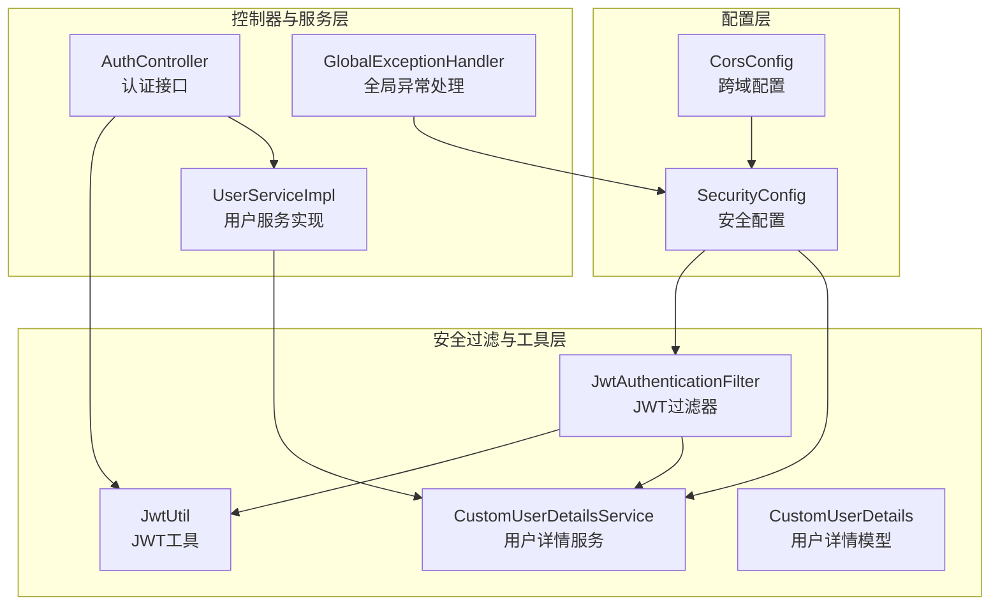
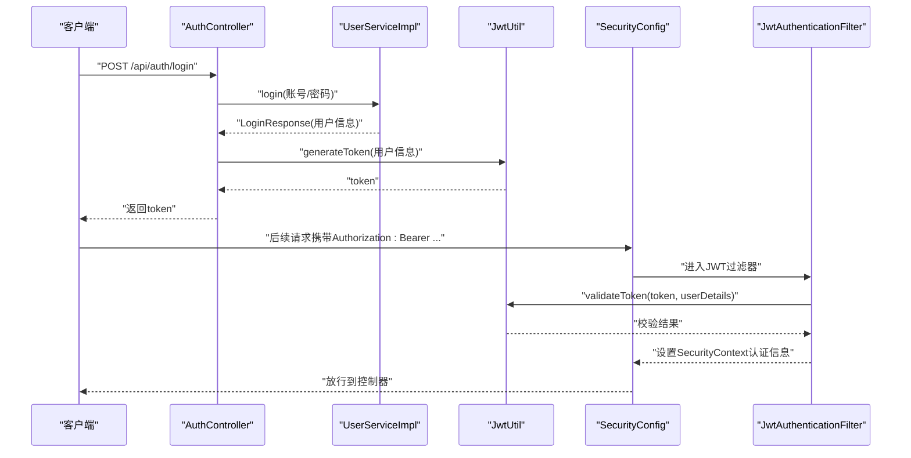
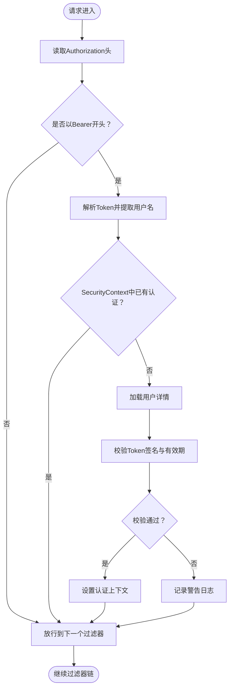
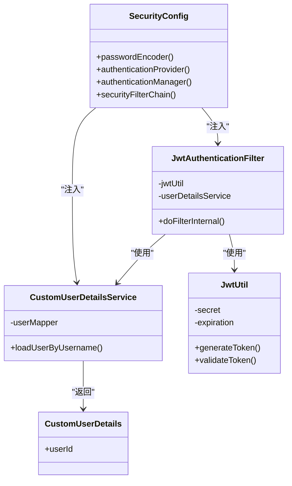
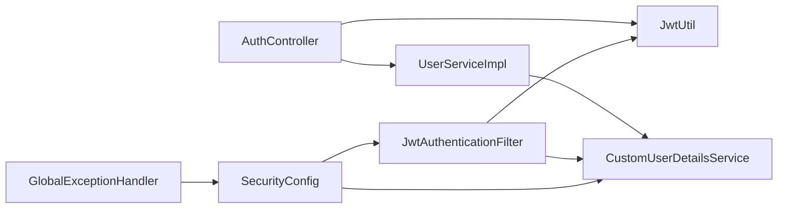

# 安全架构设计

<cite>
**本文引用的文件**
- [SecurityConfig.java](file://backend/src/main/java/com/heritage/config/SecurityConfig.java)
- [JwtAuthenticationFilter.java](file://backend/src/main/java/com/heritage/security/JwtAuthenticationFilter.java)
- [CustomUserDetailsService.java](file://backend/src/main/java/com/heritage/security/CustomUserDetailsService.java)
- [CustomUserDetails.java](file://backend/src/main/java/com/heritage/security/CustomUserDetails.java)
- [JwtUtil.java](file://backend/src/main/java/com/heritage/util/JwtUtil.java)
- [AuthController.java](file://backend/src/main/java/com/heritage/controller/AuthController.java)
- [UserService.java](file://backend/src/main/java/com/heritage/service/UserService.java)
- [UserServiceImpl.java](file://backend/src/main/java/com/heritage/service/impl/UserServiceImpl.java)
- [GlobalExceptionHandler.java](file://backend/src/main/java/com/heritage/common/GlobalExceptionHandler.java)
- [CorsConfig.java](file://backend/src/main/java/com/heritage/config/CorsConfig.java)
- [application.yml](file://backend/src/main/resources/application.yml)
</cite>

## 目录
1. [引言](#引言)
2. [项目结构](#项目结构)
3. [核心组件](#核心组件)
4. [架构总览](#架构总览)
5. [详细组件分析](#详细组件分析)
6. [依赖关系分析](#依赖关系分析)
7. [性能考虑](#性能考虑)
8. [故障排查指南](#故障排查指南)
9. [结论](#结论)
10. [附录](#附录)

## 引言
本文件面向“非遗产品智能定制商城系统”，提供一套完整且可落地的安全架构设计文档。重点覆盖以下方面：
- JWT认证机制：Token生成、验证与刷新流程
- Spring Security集成：过滤器链、用户详情服务与自定义认证逻辑
- 权限控制策略：基于角色的访问控制（RBAC）与方法级安全注解
- 密码加密机制、跨域与会话管理策略
- 安全配置最佳实践、常见漏洞防范与安全审计方案
- 安全事件处理与异常管理实现细节

## 项目结构
后端采用分层架构，安全相关代码主要集中在配置层、安全过滤与工具层、控制器与服务层：
- 配置层：Spring Security与跨域配置
- 安全过滤与工具层：JWT工具、JWT过滤器、用户详情服务
- 控制器与服务层：认证接口、用户服务与业务接口
- 全局异常处理：统一处理认证、授权与业务异常

图表来源
- [SecurityConfig.java](file://backend/src/main/java/com/heritage/config/SecurityConfig.java#L22-L66)
- [JwtAuthenticationFilter.java](file://backend/src/main/java/com/heritage/security/JwtAuthenticationFilter.java#L24-L71)
- [JwtUtil.java](file://backend/src/main/java/com/heritage/util/JwtUtil.java#L18-L80)
- [CustomUserDetailsService.java](file://backend/src/main/java/com/heritage/security/CustomUserDetailsService.java#L17-L38)
- [CustomUserDetails.java](file://backend/src/main/java/com/heritage/security/CustomUserDetails.java#L10-L22)
- [AuthController.java](file://backend/src/main/java/com/heritage/controller/AuthController.java#L21-L47)
- [UserServiceImpl.java](file://backend/src/main/java/com/heritage/service/impl/UserServiceImpl.java#L22-L180)
- [GlobalExceptionHandler.java](file://backend/src/main/java/com/heritage/common/GlobalExceptionHandler.java#L14-L61)
- [CorsConfig.java](file://backend/src/main/java/com/heritage/config/CorsConfig.java#L10-L26)

章节来源
- [SecurityConfig.java](file://backend/src/main/java/com/heritage/config/SecurityConfig.java#L22-L66)
- [CorsConfig.java](file://backend/src/main/java/com/heritage/config/CorsConfig.java#L10-L26)

## 核心组件
- 安全配置（SecurityConfig）：启用Web安全与方法级安全，禁用CSRF，配置无状态会话，定义URL放行规则，并注入JWT过滤器。
- JWT工具（JwtUtil）：负责密钥生成、Token签发、解析与校验。
- JWT过滤器（JwtAuthenticationFilter）：从请求头提取JWT，调用用户详情服务与JWT工具进行验证，并在上下文中设置认证信息。
- 用户详情服务（CustomUserDetailsService）：按账号查询用户，构建带角色权限的用户详情对象。
- 用户详情模型（CustomUserDetails）：扩展Spring Security用户模型，携带用户ID。
- 认证控制器（AuthController）：提供注册与登录接口，登录时签发JWT。
- 用户服务（UserServiceImpl）：完成注册、登录、密码加解密与用户信息维护。
- 全局异常处理（GlobalExceptionHandler）：集中处理认证、授权、业务与参数校验异常。

章节来源
- [SecurityConfig.java](file://backend/src/main/java/com/heritage/config/SecurityConfig.java#L22-L66)
- [JwtUtil.java](file://backend/src/main/java/com/heritage/util/JwtUtil.java#L18-L80)
- [JwtAuthenticationFilter.java](file://backend/src/main/java/com/heritage/security/JwtAuthenticationFilter.java#L24-L71)
- [CustomUserDetailsService.java](file://backend/src/main/java/com/heritage/security/CustomUserDetailsService.java#L17-L38)
- [CustomUserDetails.java](file://backend/src/main/java/com/heritage/security/CustomUserDetails.java#L10-L22)
- [AuthController.java](file://backend/src/main/java/com/heritage/controller/AuthController.java#L21-L47)
- [UserServiceImpl.java](file://backend/src/main/java/com/heritage/service/impl/UserServiceImpl.java#L22-L180)
- [GlobalExceptionHandler.java](file://backend/src/main/java/com/heritage/common/GlobalExceptionHandler.java#L14-L61)

## 架构总览
系统采用无状态JWT认证，通过自定义过滤器在每个请求到达控制器前完成身份验证与授权上下文设置。方法级安全注解用于细粒度权限控制。

图表来源
- [AuthController.java](file://backend/src/main/java/com/heritage/controller/AuthController.java#L33-L46)
- [UserServiceImpl.java](file://backend/src/main/java/com/heritage/service/impl/UserServiceImpl.java#L48-L75)
- [JwtUtil.java](file://backend/src/main/java/com/heritage/util/JwtUtil.java#L61-L74)
- [SecurityConfig.java](file://backend/src/main/java/com/heritage/config/SecurityConfig.java#L50-L62)
- [JwtAuthenticationFilter.java](file://backend/src/main/java/com/heritage/security/JwtAuthenticationFilter.java#L29-L70)

## 详细组件分析

### JWT认证机制
- Token生成
  - 登录成功后，控制器调用JWT工具生成Token，设置签发时间与过期时间。
  - Token内容包含用户名（主题），签名算法为HS256。
- Token验证
  - 过滤器从请求头读取Authorization头，提取Bearer Token。
  - 使用JWT工具解析并校验签名、过期时间与用户名一致性。
  - 成功则在SecurityContext中设置认证令牌，失败则放行继续后续处理（由后续拦截器或方法级安全决定）。
- Token刷新
  - 当前实现未提供专用刷新接口；建议在生产环境引入刷新令牌（Refresh Token）机制，结合Redis黑名单或短期缓存进行安全管控。

图表来源
- [JwtAuthenticationFilter.java](file://backend/src/main/java/com/heritage/security/JwtAuthenticationFilter.java#L29-L70)
- [JwtUtil.java](file://backend/src/main/java/com/heritage/util/JwtUtil.java#L36-L79)

章节来源
- [AuthController.java](file://backend/src/main/java/com/heritage/controller/AuthController.java#L33-L46)
- [JwtUtil.java](file://backend/src/main/java/com/heritage/util/JwtUtil.java#L18-L80)
- [JwtAuthenticationFilter.java](file://backend/src/main/java/com/heritage/security/JwtAuthenticationFilter.java#L24-L71)

### Spring Security集成
- 过滤器链配置
  - 禁用CSRF，启用方法级安全注解，设置会话策略为无状态。
  - 放行公开接口（认证、部分静态资源与文档），其余请求均需认证。
  - 在用户名密码过滤器之前添加JWT过滤器，确保先完成JWT验证。
- 用户详情服务
  - 按账号查询用户，构造带角色权限的用户详情对象。
  - 角色前缀为“ROLE_”，与方法级注解一致。
- 自定义认证逻辑
  - 过滤器中仅负责验证JWT有效性并设置认证上下文，不参与密码匹配。

图表来源
- [SecurityConfig.java](file://backend/src/main/java/com/heritage/config/SecurityConfig.java#L22-L66)
- [JwtAuthenticationFilter.java](file://backend/src/main/java/com/heritage/security/JwtAuthenticationFilter.java#L24-L71)
- [CustomUserDetailsService.java](file://backend/src/main/java/com/heritage/security/CustomUserDetailsService.java#L17-L38)
- [JwtUtil.java](file://backend/src/main/java/com/heritage/util/JwtUtil.java#L18-L80)
- [CustomUserDetails.java](file://backend/src/main/java/com/heritage/security/CustomUserDetails.java#L10-L22)

章节来源
- [SecurityConfig.java](file://backend/src/main/java/com/heritage/config/SecurityConfig.java#L22-L66)
- [CustomUserDetailsService.java](file://backend/src/main/java/com/heritage/security/CustomUserDetailsService.java#L17-L38)

### 权限控制策略
- 基于角色的访问控制（RBAC）
  - 用户详情服务为每个用户附加“ROLE_”前缀的角色。
  - 控制器方法广泛使用@PreAuthorize注解，如“hasRole('ADMIN')”、“hasRole('MERCHANT')”等。
- 方法级安全注解
  - 已在多个控制器方法上启用，确保在执行业务逻辑前进行权限校验。
- URL级放行
  - 公开接口与静态资源无需认证即可访问。

章节来源
- [CustomUserDetailsService.java](file://backend/src/main/java/com/heritage/security/CustomUserDetailsService.java#L31-L36)
- [UserController.java](file://backend/src/main/java/com/heritage/controller/UserController.java#L58-L63)
- [ProductController.java](file://backend/src/main/java/com/heritage/controller/ProductController.java#L34-L120)
- [SecurityConfig.java](file://backend/src/main/java/com/heritage/config/SecurityConfig.java#L54-L62)

### 密码加密机制
- 注册与修改密码均使用BCrypt进行编码存储。
- 登录时使用BCrypt进行明文与密文匹配。
- 密码字段在用户详情对象中仅保存编码后的值，避免明文泄露。

章节来源
- [UserServiceImpl.java](file://backend/src/main/java/com/heritage/service/impl/UserServiceImpl.java#L28-L46)
- [UserServiceImpl.java](file://backend/src/main/java/com/heritage/service/impl/UserServiceImpl.java#L58-L60)
- [UserServiceImpl.java](file://backend/src/main/java/com/heritage/service/impl/UserServiceImpl.java#L107-L112)
- [UserServiceImpl.java](file://backend/src/main/java/com/heritage/service/impl/UserServiceImpl.java#L129-L131)
- [SecurityConfig.java](file://backend/src/main/java/com/heritage/config/SecurityConfig.java#L32-L34)

### CSRF防护与会话管理
- CSRF防护
  - 在安全配置中显式禁用CSRF，适用于前后端分离的无状态API场景。
- 会话管理
  - 设置为STATELESS，不创建HTTP Session，避免会话劫持与服务器端状态膨胀。

章节来源
- [SecurityConfig.java](file://backend/src/main/java/com/heritage/config/SecurityConfig.java#L52-L53)

### 跨域策略
- 允许所有来源模式、允许凭证、允许所有方法与头部，并设置最大预检缓存时间。
- 该配置对开发与测试友好，生产环境建议限定具体来源与受控头部。

章节来源
- [CorsConfig.java](file://backend/src/main/java/com/heritage/config/CorsConfig.java#L12-L25)

### 安全配置最佳实践
- 密钥管理
  - 生产环境应从环境变量或安全配置中心读取JWT密钥与过期时间，避免硬编码。
- Token刷新
  - 引入刷新令牌与黑名单机制，限制单次访问令牌有效期，降低泄露风险。
- 日志与审计
  - 对认证与授权失败事件进行记录与告警，结合外部审计平台进行追踪。
- 输入校验与参数绑定
  - 结合全局异常处理，统一返回标准化错误信息，避免敏感堆栈泄露。

章节来源
- [application.yml](file://backend/src/main/resources/application.yml#L39-L41)
- [GlobalExceptionHandler.java](file://backend/src/main/java/com/heritage/common/GlobalExceptionHandler.java#L14-L61)

## 依赖关系分析
- 组件耦合
  - SecurityConfig依赖JwtAuthenticationFilter与UserDetailsService，形成清晰的职责边界。
  - JwtAuthenticationFilter依赖JwtUtil与UserDetailsService，承担认证前置校验。
  - AuthController依赖JwtUtil与UserService，完成登录与Token发放。
  - UserServiceImpl依赖BCrypt进行密码处理，依赖UserMapper进行持久化。
- 外部依赖
  - JWT工具依赖第三方库进行签发与解析。
  - 全局异常处理器统一捕获认证与授权异常，输出标准响应。

图表来源
- [SecurityConfig.java](file://backend/src/main/java/com/heritage/config/SecurityConfig.java#L22-L66)
- [JwtAuthenticationFilter.java](file://backend/src/main/java/com/heritage/security/JwtAuthenticationFilter.java#L24-L71)
- [AuthController.java](file://backend/src/main/java/com/heritage/controller/AuthController.java#L21-L47)
- [UserServiceImpl.java](file://backend/src/main/java/com/heritage/service/impl/UserServiceImpl.java#L22-L180)
- [GlobalExceptionHandler.java](file://backend/src/main/java/com/heritage/common/GlobalExceptionHandler.java#L14-L61)

章节来源
- [SecurityConfig.java](file://backend/src/main/java/com/heritage/config/SecurityConfig.java#L22-L66)
- [JwtAuthenticationFilter.java](file://backend/src/main/java/com/heritage/security/JwtAuthenticationFilter.java#L24-L71)
- [AuthController.java](file://backend/src/main/java/com/heritage/controller/AuthController.java#L21-L47)
- [UserServiceImpl.java](file://backend/src/main/java/com/heritage/service/impl/UserServiceImpl.java#L22-L180)
- [GlobalExceptionHandler.java](file://backend/src/main/java/com/heritage/common/GlobalExceptionHandler.java#L14-L61)

## 性能考虑
- 无状态设计降低服务器端会话存储压力，适合水平扩展。
- JWT解析与用户详情加载为轻量操作，建议配合Redis缓存热点用户信息。
- 过滤器链短路与精确的URL放行减少不必要的鉴权开销。

## 故障排查指南
- 认证异常
  - 未登录或Token过期：全局异常处理器返回401提示。
  - 权限不足：返回403提示。
- 参数校验异常
  - 参数校验失败或绑定失败：统一返回对应提示信息。
- 业务异常
  - 账号或密码错误、两次密码不一致等：返回业务异常消息。
- 建议
  - 对认证与授权失败事件进行日志采集与监控告警。
  - 对高并发场景下的JWT解析与用户详情查询进行性能压测与优化。

章节来源
- [GlobalExceptionHandler.java](file://backend/src/main/java/com/heritage/common/GlobalExceptionHandler.java#L16-L60)

## 结论
本安全架构以无状态JWT为核心，结合Spring Security过滤器链与方法级安全注解，实现了从请求级到方法级的多层防护。通过BCrypt保障密码安全，配合严格的URL放行与RBAC策略，满足非遗商城系统的安全需求。建议在生产环境中进一步完善密钥管理、Token刷新与审计能力，持续提升整体安全性与可观测性。

## 附录
- 配置要点
  - JWT密钥与过期时间：从配置文件读取，生产环境建议使用环境变量。
  - CORS策略：开发阶段宽松，生产阶段应收紧来源与头部。
- 常见漏洞与对策
  - JWT泄露：缩短有效期、引入刷新令牌与黑名单。
  - 暴力破解：登录失败次数限制、验证码与账户锁定策略。
  - 参数注入：严格参数校验与输入净化，配合全局异常处理。
- 安全审计
  - 记录登录、登出、权限变更、敏感操作等关键事件，定期审计与回放。

章节来源
- [application.yml](file://backend/src/main/resources/application.yml#L39-L41)
- [CorsConfig.java](file://backend/src/main/java/com/heritage/config/CorsConfig.java#L12-L25)
- [GlobalExceptionHandler.java](file://backend/src/main/java/com/heritage/common/GlobalExceptionHandler.java#L14-L61)