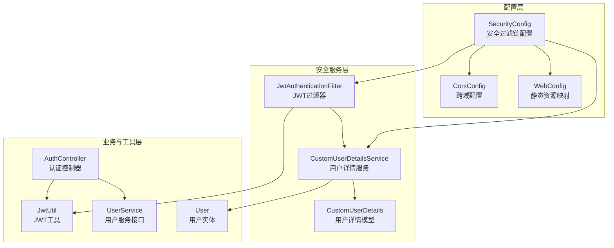
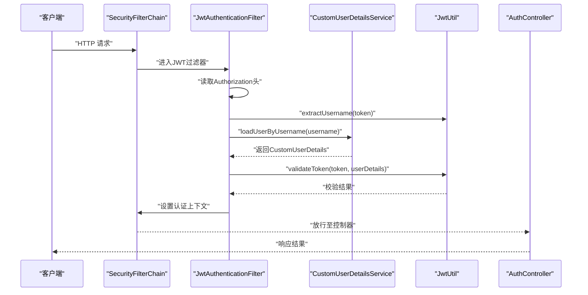
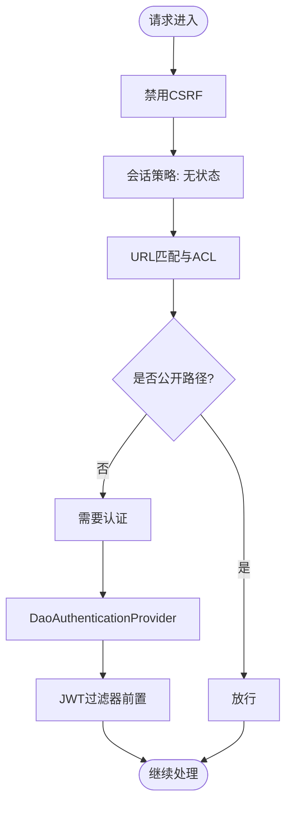
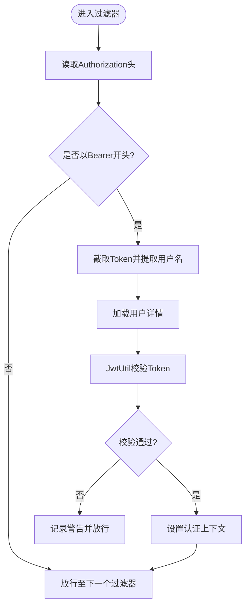
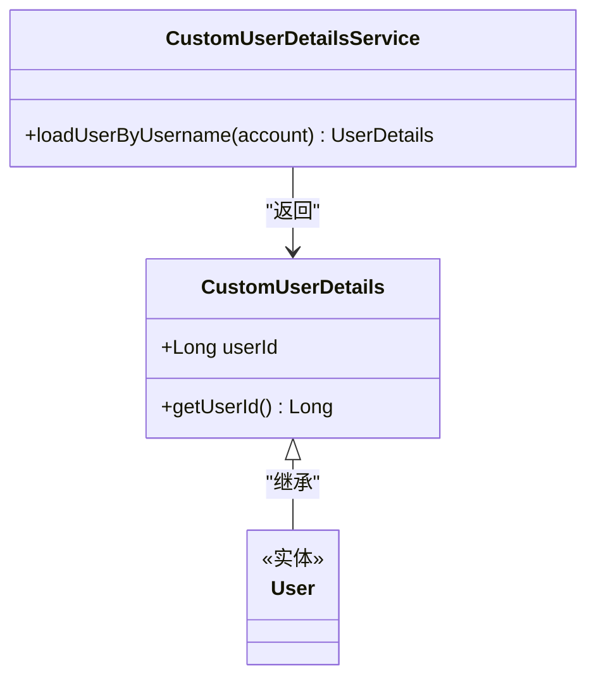
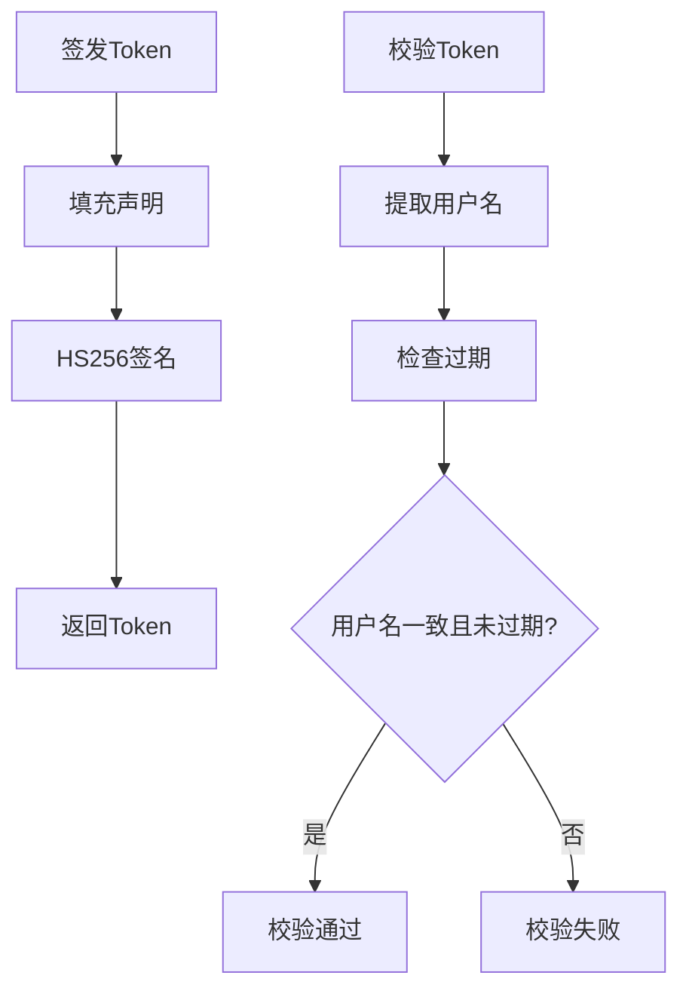
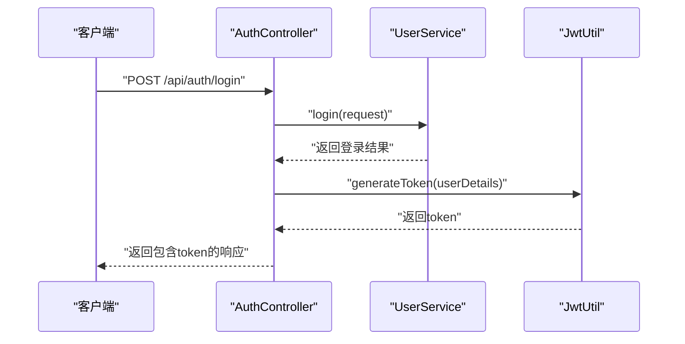
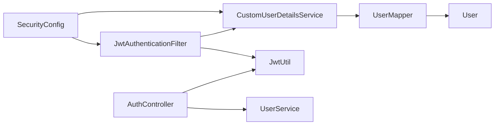

# 安全配置管理

<cite>
**本文引用的文件**
- [SecurityConfig.java](file://backend/src/main/java/com/heritage/config/SecurityConfig.java)
- [JwtAuthenticationFilter.java](file://backend/src/main/java/com/heritage/security/JwtAuthenticationFilter.java)
- [CustomUserDetailsService.java](file://backend/src/main/java/com/heritage/security/CustomUserDetailsService.java)
- [CustomUserDetails.java](file://backend/src/main/java/com/heritage/security/CustomUserDetails.java)
- [JwtUtil.java](file://backend/src/main/java/com/heritage/util/JwtUtil.java)
- [AuthController.java](file://backend/src/main/java/com/heritage/controller/AuthController.java)
- [application.yml](file://backend/src/main/resources/application.yml)
- [CorsConfig.java](file://backend/src/main/java/com/heritage/config/CorsConfig.java)
- [WebConfig.java](file://backend/src/main/java/com/heritage/config/WebConfig.java)
- [UserService.java](file://backend/src/main/java/com/heritage/service/UserService.java)
- [User.java](file://backend/src/main/java/com/heritage/entity/User.java)
</cite>

## 目录
1. [简介](#简介)
2. [项目结构](#项目结构)
3. [核心组件](#核心组件)
4. [架构总览](#架构总览)
5. [详细组件分析](#详细组件分析)
6. [依赖关系分析](#依赖关系分析)
7. [性能考虑](#性能考虑)
8. [故障排查指南](#故障排查指南)
9. [结论](#结论)
10. [附录](#附录)

## 简介
本文件面向非遗产品智能定制商城系统的安全配置管理，聚焦于Spring Security在本项目中的落地与最佳实践。重点解析SecurityConfig类的HTTP安全配置、会话管理策略、CSRF防护、请求URL匹配与访问控制列表（ACL）设计；阐述密码编码器BCrypt选择与强度配置；说明认证提供程序与自定义认证逻辑；给出性能调优建议与常见配置错误排查方法，并提供完整配置示例与环境差异化配置方案。

## 项目结构
后端采用分层+按功能域组织的结构，安全相关代码集中在config与security包中，配合工具类与控制器共同完成认证与授权流程。

图表来源
- [SecurityConfig.java](file://backend/src/main/java/com/heritage/config/SecurityConfig.java#L22-L66)
- [JwtAuthenticationFilter.java](file://backend/src/main/java/com/heritage/security/JwtAuthenticationFilter.java#L21-L72)
- [CustomUserDetailsService.java](file://backend/src/main/java/com/heritage/security/CustomUserDetailsService.java#L15-L39)
- [CustomUserDetails.java](file://backend/src/main/java/com/heritage/security/CustomUserDetails.java#L9-L23)
- [JwtUtil.java](file://backend/src/main/java/com/heritage/util/JwtUtil.java#L17-L81)
- [AuthController.java](file://backend/src/main/java/com/heritage/controller/AuthController.java#L17-L48)
- [CorsConfig.java](file://backend/src/main/java/com/heritage/config/CorsConfig.java#L9-L27)
- [WebConfig.java](file://backend/src/main/java/com/heritage/config/WebConfig.java#L10-L23)
- [UserService.java](file://backend/src/main/java/com/heritage/service/UserService.java#L8-L22)
- [User.java](file://backend/src/main/java/com/heritage/entity/User.java#L9-L38)

章节来源
- [SecurityConfig.java](file://backend/src/main/java/com/heritage/config/SecurityConfig.java#L22-L66)
- [CorsConfig.java](file://backend/src/main/java/com/heritage/config/CorsConfig.java#L9-L27)
- [WebConfig.java](file://backend/src/main/java/com/heritage/config/WebConfig.java#L10-L23)

## 核心组件
- 安全过滤链与策略
  - 禁用CSRF，启用无状态会话（基于JWT）
  - URL匹配与ACL：公开接口（认证、非遗展示、上传、Swagger）与受保护接口（其余）
  - 在用户名密码过滤器之前插入JWT过滤器，实现无状态认证
- 密码编码器
  - 使用BCryptPasswordEncoder，具备自适应成本参数与盐值随机化
- 认证提供程序
  - 基于DaoAuthenticationProvider与自定义UserDetailsService
- JWT工具与过滤器
  - 提取与校验JWT，构建认证上下文
- 跨域与静态资源
  - 允许任意来源与凭证，注册静态资源映射以支持上传文件访问

章节来源
- [SecurityConfig.java](file://backend/src/main/java/com/heritage/config/SecurityConfig.java#L31-L66)
- [JwtAuthenticationFilter.java](file://backend/src/main/java/com/heritage/security/JwtAuthenticationFilter.java#L29-L70)
- [JwtUtil.java](file://backend/src/main/java/com/heritage/util/JwtUtil.java#L26-L79)
- [CorsConfig.java](file://backend/src/main/java/com/heritage/config/CorsConfig.java#L12-L25)
- [WebConfig.java](file://backend/src/main/java/com/heritage/config/WebConfig.java#L16-L21)

## 架构总览
下图展示了从客户端到后端的安全处理流程：请求进入后先经过JWT过滤器解析与验证，再由Spring Security进行授权控制，最终到达业务控制器。

图表来源
- [SecurityConfig.java](file://backend/src/main/java/com/heritage/config/SecurityConfig.java#L49-L65)
- [JwtAuthenticationFilter.java](file://backend/src/main/java/com/heritage/security/JwtAuthenticationFilter.java#L29-L70)
- [CustomUserDetailsService.java](file://backend/src/main/java/com/heritage/security/CustomUserDetailsService.java#L21-L37)
- [JwtUtil.java](file://backend/src/main/java/com/heritage/util/JwtUtil.java#L36-L79)
- [AuthController.java](file://backend/src/main/java/com/heritage/controller/AuthController.java#L33-L46)

## 详细组件分析

### SecurityConfig：HTTP安全、会话与CSRF
- CSRF禁用
  - 适用于前后端分离与移动端场景，避免同站攻击的同时减少复杂性
- 会话策略
  - STATELESS：不创建会话，完全依赖JWT
- URL匹配与ACL
  - 公开路径：认证接口、非遗接口、上传目录、Swagger文档
  - 其他请求均需认证
- 过滤器链
  - 在UsernamePasswordAuthenticationFilter之前插入JWT过滤器，确保鉴权前置
- 认证提供程序
  - 使用DaoAuthenticationProvider绑定自定义UserDetailsService与BCrypt密码编码器

图表来源
- [SecurityConfig.java](file://backend/src/main/java/com/heritage/config/SecurityConfig.java#L50-L65)

章节来源
- [SecurityConfig.java](file://backend/src/main/java/com/heritage/config/SecurityConfig.java#L50-L65)

### JwtAuthenticationFilter：JWT解析与认证上下文设置
- 解析流程
  - 从Authorization头提取Bearer Token
  - 使用JwtUtil提取用户名并校验有效性
- 用户详情加载
  - 通过CustomUserDetailsService按账号查询用户
- 认证上下文
  - 校验通过后构造UsernamePasswordAuthenticationToken并写入SecurityContext
- 异常处理
  - 捕获并记录异常，不影响后续过滤器链

图表来源
- [JwtAuthenticationFilter.java](file://backend/src/main/java/com/heritage/security/JwtAuthenticationFilter.java#L29-L70)
- [JwtUtil.java](file://backend/src/main/java/com/heritage/util/JwtUtil.java#L76-L79)

章节来源
- [JwtAuthenticationFilter.java](file://backend/src/main/java/com/heritage/security/JwtAuthenticationFilter.java#L29-L70)

### CustomUserDetailsService 与 CustomUserDetails：自定义认证主体
- 用户详情加载
  - 依据账号查询数据库用户，不存在则抛出异常
  - 将用户角色映射为“ROLE_”前缀的权限集合
- 自定义用户详情
  - 继承Spring Security的User，扩展userId字段用于业务识别

图表来源
- [CustomUserDetailsService.java](file://backend/src/main/java/com/heritage/security/CustomUserDetailsService.java#L15-L39)
- [CustomUserDetails.java](file://backend/src/main/java/com/heritage/security/CustomUserDetails.java#L9-L23)
- [User.java](file://backend/src/main/java/com/heritage/entity/User.java#L9-L38)

章节来源
- [CustomUserDetailsService.java](file://backend/src/main/java/com/heritage/security/CustomUserDetailsService.java#L21-L37)
- [CustomUserDetails.java](file://backend/src/main/java/com/heritage/security/CustomUserDetails.java#L14-L22)
- [User.java](file://backend/src/main/java/com/heritage/entity/User.java#L16-L27)

### JwtUtil：JWT签发与校验
- 密钥管理
  - 优先使用配置文件中的密钥；若长度不足则回退到内置安全密钥（仅演示用途）
- 签发与过期
  - 使用HS256算法签名，过期时间来自配置
- 校验逻辑
  - 校验主题（用户名）与过期时间

图表来源
- [JwtUtil.java](file://backend/src/main/java/com/heritage/util/JwtUtil.java#L61-L79)

章节来源
- [JwtUtil.java](file://backend/src/main/java/com/heritage/util/JwtUtil.java#L20-L79)

### AuthController：登录与令牌发放
- 登录流程
  - 调用UserService完成登录校验
  - 使用JwtUtil为用户生成JWT并返回
- 注册流程
  - 调用UserService完成注册

图表来源
- [AuthController.java](file://backend/src/main/java/com/heritage/controller/AuthController.java#L33-L46)
- [JwtUtil.java](file://backend/src/main/java/com/heritage/util/JwtUtil.java#L61-L64)

章节来源
- [AuthController.java](file://backend/src/main/java/com/heritage/controller/AuthController.java#L26-L46)

### CORS与静态资源映射
- CORS
  - 允许任意来源模式、凭证、方法与头部，最大缓存时长1小时
- 静态资源
  - 将/uploads/**映射到本地文件系统目录，便于前端直接访问上传文件

章节来源
- [CorsConfig.java](file://backend/src/main/java/com/heritage/config/CorsConfig.java#L12-L25)
- [WebConfig.java](file://backend/src/main/java/com/heritage/config/WebConfig.java#L16-L21)

## 依赖关系分析
- 组件耦合
  - SecurityConfig依赖JwtAuthenticationFilter与UserDetailsService
  - JwtAuthenticationFilter依赖JwtUtil与UserDetailsService
  - CustomUserDetailsService依赖UserMapper与User实体
  - AuthController依赖JwtUtil与UserService
- 外部依赖
  - Spring Security、BCrypt、JWT库
- 可能的循环依赖
  - 当前结构清晰，无明显循环依赖

图表来源
- [SecurityConfig.java](file://backend/src/main/java/com/heritage/config/SecurityConfig.java#L28-L29)
- [JwtAuthenticationFilter.java](file://backend/src/main/java/com/heritage/security/JwtAuthenticationFilter.java#L26-L27)
- [CustomUserDetailsService.java](file://backend/src/main/java/com/heritage/security/CustomUserDetailsService.java#L19-L19)
- [AuthController.java](file://backend/src/main/java/com/heritage/controller/AuthController.java#L23-L24)

章节来源
- [SecurityConfig.java](file://backend/src/main/java/com/heritage/config/SecurityConfig.java#L28-L47)
- [JwtAuthenticationFilter.java](file://backend/src/main/java/com/heritage/security/JwtAuthenticationFilter.java#L26-L27)
- [CustomUserDetailsService.java](file://backend/src/main/java/com/heritage/security/CustomUserDetailsService.java#L19-L25)
- [AuthController.java](file://backend/src/main/java/com/heritage/controller/AuthController.java#L23-L24)

## 性能考虑
- 无状态会话
  - 减少服务器端会话存储压力，适合高并发场景
- BCrypt成本参数
  - 默认成本已较合理；如遇CPU瓶颈可适当下调，但需平衡安全性
- JWT大小与负载
  - 控制载荷字段数量，避免携带大对象
- 缓存与限流
  - 对登录与敏感接口增加限流与缓存，降低数据库压力
- 日志级别
  - 生产环境降低安全相关日志级别，避免I/O开销

## 故障排查指南
- 无法登录或频繁掉线
  - 检查JWT密钥配置与过期时间
  - 确认客户端是否正确携带Authorization头
- 用户名不存在异常
  - 检查账号是否存在以及UserDetailsService查询条件
- 权限不足
  - 确认用户角色映射为“ROLE_”前缀
- 跨域问题
  - 检查CORS配置与预检请求处理
- 上传文件访问失败
  - 检查静态资源映射路径与文件系统权限

章节来源
- [JwtUtil.java](file://backend/src/main/java/com/heritage/util/JwtUtil.java#L20-L34)
- [JwtAuthenticationFilter.java](file://backend/src/main/java/com/heritage/security/JwtAuthenticationFilter.java#L38-L45)
- [CustomUserDetailsService.java](file://backend/src/main/java/com/heritage/security/CustomUserDetailsService.java#L27-L29)
- [CorsConfig.java](file://backend/src/main/java/com/heritage/config/CorsConfig.java#L14-L19)
- [WebConfig.java](file://backend/src/main/java/com/heritage/config/WebConfig.java#L17-L21)

## 结论
本项目采用无状态JWT认证与Spring Security结合的方式，实现了对公开接口与受保护接口的精细化控制。通过BCrypt保证密码安全，通过DAO认证提供程序与自定义用户详情服务实现灵活的用户模型扩展。建议在生产环境中强化密钥管理、完善限流与审计、优化日志与监控，持续提升系统安全性与稳定性。

## 附录

### 完整配置示例（要点）
- 安全过滤链
  - 禁用CSRF，无状态会话，公开路径与受控路径明确划分
- 密码编码器
  - 使用BCryptPasswordEncoder，默认成本适配大多数场景
- 认证提供程序
  - DaoAuthenticationProvider绑定自定义UserDetailsService与BCrypt
- JWT配置
  - 密钥与过期时间来自配置文件，校验严格
- CORS与静态资源
  - CORS允许凭证与任意来源，静态资源映射上传目录

章节来源
- [SecurityConfig.java](file://backend/src/main/java/com/heritage/config/SecurityConfig.java#L31-L66)
- [application.yml](file://backend/src/main/resources/application.yml#L39-L41)

### 环境差异化配置方案
- 开发环境
  - 允许任意来源与凭证，便于联调
  - JWT密钥可使用短密钥，便于测试
- 测试/预发布环境
  - 限制来源白名单，开启更严格的CORS
  - 使用独立的JWT密钥与较短过期时间
- 生产环境
  - 严格限制来源与方法，关闭任意来源
  - 使用强密钥（建议来自环境变量或密钥管理服务），较长过期时间
  - 启用HTTPS与安全响应头

章节来源
- [CorsConfig.java](file://backend/src/main/java/com/heritage/config/CorsConfig.java#L14-L19)
- [application.yml](file://backend/src/main/resources/application.yml#L39-L41)