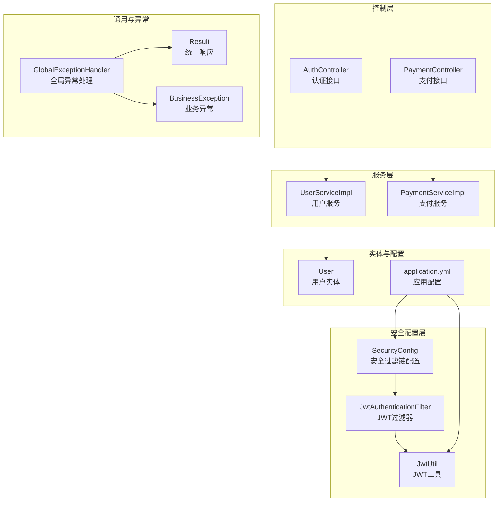
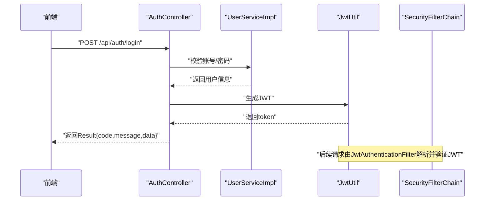
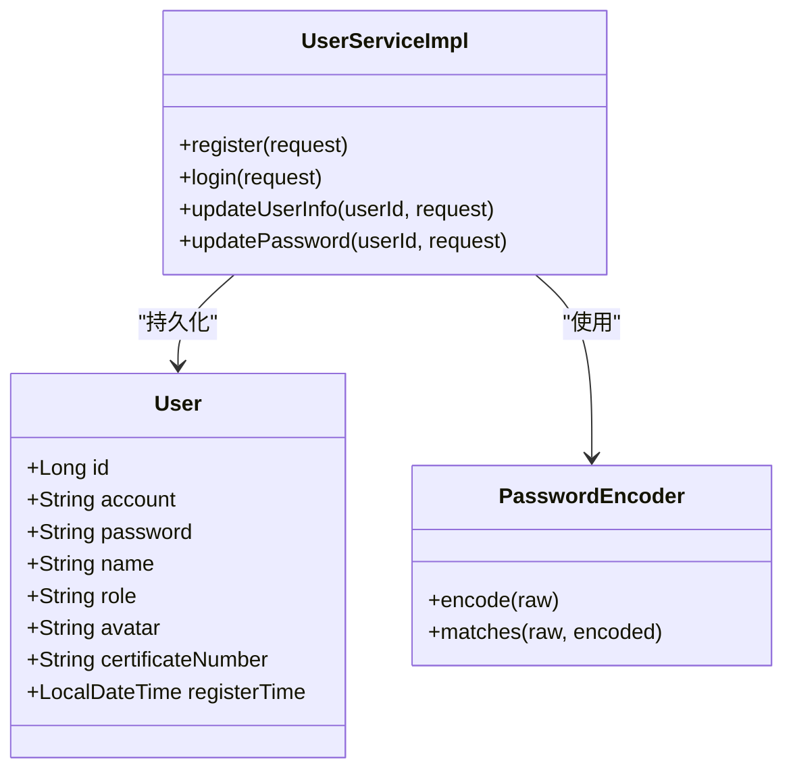
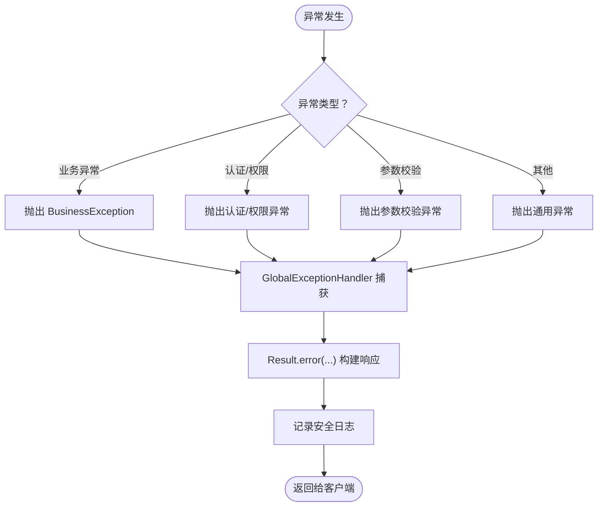
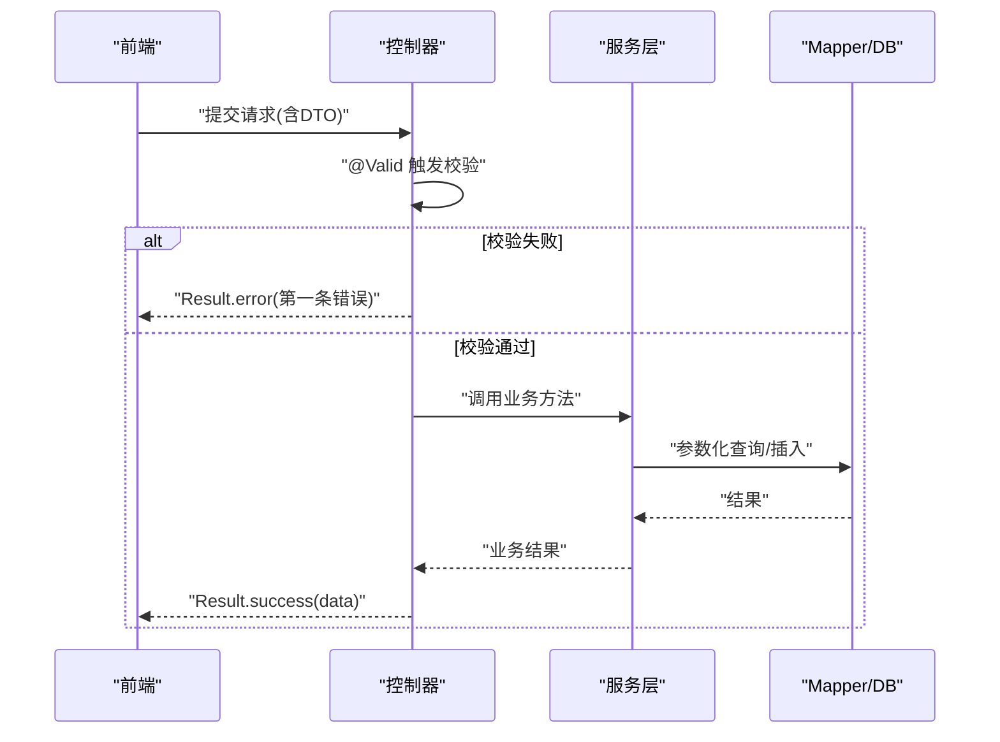
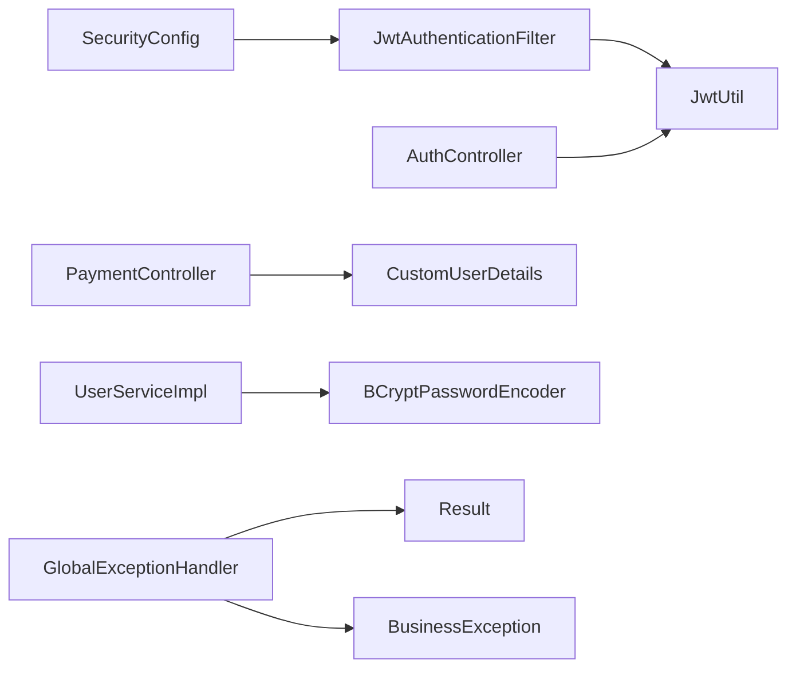

# 数据安全保护

<cite>
**本文引用的文件**
- [GlobalExceptionHandler.java](file://backend/src/main/java/com/heritage/common/GlobalExceptionHandler.java)
- [BusinessException.java](file://backend/src/main/java/com/heritage/common/BusinessException.java)
- [Result.java](file://backend/src/main/java/com/heritage/common/Result.java)
- [SecurityConfig.java](file://backend/src/main/java/com/heritage/config/SecurityConfig.java)
- [JwtAuthenticationFilter.java](file://backend/src/main/java/com/heritage/security/JwtAuthenticationFilter.java)
- [JwtUtil.java](file://backend/src/main/java/com/heritage/util/JwtUtil.java)
- [User.java](file://backend/src/main/java/com/heritage/entity/User.java)
- [application.yml](file://backend/src/main/resources/application.yml)
- [AuthController.java](file://backend/src/main/java/com/heritage/controller/AuthController.java)
- [UserServiceImpl.java](file://backend/src/main/java/com/heritage/service/impl/UserServiceImpl.java)
- [PaymentController.java](file://backend/src/main/java/com/heritage/controller/PaymentController.java)
- [PaymentServiceImpl.java](file://backend/src/main/java/com/heritage/service/impl/PaymentServiceImpl.java)
- [PasswordUpdateRequest.java](file://backend/src/main/java/com/heritage/dto/PasswordUpdateRequest.java)
- [CustomUserDetails.java](file://backend/src/main/java/com/heritage/security/CustomUserDetails.java)
- [AiImageServiceImpl.java](file://backend/src/main/java/com/heritage/service/impl/AiImageServiceImpl.java)
- [冗余文件处理计划.md](file://TODO/冗余文件处理计划.md)
- [问题记录.md](file://TODO/问题记录.md)
</cite>

## 目录
1. [引言](#引言)
2. [项目结构](#项目结构)
3. [核心组件](#核心组件)
4. [架构总览](#架构总览)
5. [详细组件分析](#详细组件分析)
6. [依赖关系分析](#依赖关系分析)
7. [性能考虑](#性能考虑)
8. [故障排查指南](#故障排查指南)
9. [结论](#结论)
10. [附录](#附录)

## 引言
本文件面向非遗产品智能定制商城系统的数据安全保护，围绕以下目标展开：敏感数据加密存储策略（用户密码、支付信息、个人隐私）、全局异常处理与错误返回安全策略、输入验证与数据清理以抵御常见安全威胁、数据传输安全（HTTPS、脱敏与日志安全）、数据备份与恢复、访问审计与合规、以及安全漏洞扫描与渗透测试实施指南。文档基于实际代码与配置进行分析，确保可操作与可落地。

## 项目结构
后端采用 Spring Boot + Spring Security + JWT 的认证授权体系，配合全局异常处理与 DTO 校验，形成从传输层到持久层的整体安全闭环。前端通过统一请求封装与表单校验减少恶意输入。

图表来源
- [SecurityConfig.java](file://backend/src/main/java/com/heritage/config/SecurityConfig.java#L50-L65)
- [JwtAuthenticationFilter.java](file://backend/src/main/java/com/heritage/security/JwtAuthenticationFilter.java#L29-L70)
- [JwtUtil.java](file://backend/src/main/java/com/heritage/util/JwtUtil.java#L61-L79)
- [AuthController.java](file://backend/src/main/java/com/heritage/controller/AuthController.java#L26-L46)
- [PaymentController.java](file://backend/src/main/java/com/heritage/controller/PaymentController.java#L29-L53)
- [UserServiceImpl.java](file://backend/src/main/java/com/heritage/service/impl/UserServiceImpl.java#L26-L75)
- [PaymentServiceImpl.java](file://backend/src/main/java/com/heritage/service/impl/PaymentServiceImpl.java#L26-L32)
- [GlobalExceptionHandler.java](file://backend/src/main/java/com/heritage/common/GlobalExceptionHandler.java#L16-L60)
- [BusinessException.java](file://backend/src/main/java/com/heritage/common/BusinessException.java#L6-L18)
- [Result.java](file://backend/src/main/java/com/heritage/common/Result.java#L18-L42)
- [User.java](file://backend/src/main/java/com/heritage/entity/User.java#L19-L21)
- [application.yml](file://backend/src/main/resources/application.yml#L39-L41)

章节来源
- [SecurityConfig.java](file://backend/src/main/java/com/heritage/config/SecurityConfig.java#L1-L67)
- [application.yml](file://backend/src/main/resources/application.yml#L1-L63)

## 核心组件
- 全局异常处理：集中捕获业务异常、认证/权限异常、参数校验异常与通用异常，统一输出安全的错误信息。
- 安全认证与授权：基于 JWT 的无状态认证，Spring Security 过滤链控制访问。
- 密码加密：BCrypt 密码编码器，用户密码入库前强制加密。
- 输入校验：DTO 使用 Jakarta Validation 注解进行参数校验，结合全局异常处理返回明确错误。
- 统一响应：Result 封装 code/message/data，便于前后端一致处理与日志记录。

章节来源
- [GlobalExceptionHandler.java](file://backend/src/main/java/com/heritage/common/GlobalExceptionHandler.java#L16-L60)
- [BusinessException.java](file://backend/src/main/java/com/heritage/common/BusinessException.java#L6-L18)
- [Result.java](file://backend/src/main/java/com/heritage/common/Result.java#L18-L42)
- [SecurityConfig.java](file://backend/src/main/java/com/heritage/config/SecurityConfig.java#L32-L42)
- [UserServiceImpl.java](file://backend/src/main/java/com/heritage/service/impl/UserServiceImpl.java#L41-L41)

## 架构总览
系统采用前后端分离，后端通过 Spring Security + JWT 实现无状态认证，所有受保护接口需携带合法 JWT。全局异常处理器保证错误信息不会泄露内部细节。敏感数据在入库前进行加密或脱敏处理，传输层通过 HTTPS 保障数据完整性与机密性。

图表来源
- [AuthController.java](file://backend/src/main/java/com/heritage/controller/AuthController.java#L33-L46)
- [UserServiceImpl.java](file://backend/src/main/java/com/heritage/service/impl/UserServiceImpl.java#L48-L75)
- [JwtUtil.java](file://backend/src/main/java/com/heritage/util/JwtUtil.java#L61-L79)
- [SecurityConfig.java](file://backend/src/main/java/com/heritage/config/SecurityConfig.java#L50-L65)

## 详细组件分析

### 敏感数据加密存储策略
- 用户密码
  - 存储前使用 BCrypt 编码器进行哈希加密，确保不可逆。
  - 登录时使用匹配方法比对明文与哈希值。
  - 用户实体字段标注 JSON 序列化忽略，避免密码外泄。
- 支付信息与个人隐私
  - 支付流程通过受控接口与用户上下文绑定，避免越权访问。
  - 日志中避免打印完整敏感字段，必要时进行脱敏。
  - 建议对数据库中涉及支付与隐私字段进行最小化暴露与访问控制。

图表来源
- [User.java](file://backend/src/main/java/com/heritage/entity/User.java#L19-L21)
- [UserServiceImpl.java](file://backend/src/main/java/com/heritage/service/impl/UserServiceImpl.java#L26-L75)
- [SecurityConfig.java](file://backend/src/main/java/com/heritage/config/SecurityConfig.java#L32-L34)

章节来源
- [UserServiceImpl.java](file://backend/src/main/java/com/heritage/service/impl/UserServiceImpl.java#L41-L41)
- [User.java](file://backend/src/main/java/com/heritage/entity/User.java#L19-L21)
- [SecurityConfig.java](file://backend/src/main/java/com/heritage/config/SecurityConfig.java#L32-L34)

### 全局异常处理器与错误返回安全策略
- 分类处理
  - 权限不足、认证失败、类型转换异常等分别映射到明确的 HTTP 语义与提示。
  - 业务异常 BusinessException 直接透传消息，便于前端友好提示。
  - 参数校验与绑定异常统一提取第一条错误信息，避免泄露多字段细节。
- 错误返回安全
  - Result 统一结构，隐藏堆栈与内部实现细节。
  - 日志记录异常摘要，不记录敏感参数与响应体。

图表来源
- [GlobalExceptionHandler.java](file://backend/src/main/java/com/heritage/common/GlobalExceptionHandler.java#L16-L60)
- [BusinessException.java](file://backend/src/main/java/com/heritage/common/BusinessException.java#L6-L18)
- [Result.java](file://backend/src/main/java/com/heritage/common/Result.java#L30-L42)

章节来源
- [GlobalExceptionHandler.java](file://backend/src/main/java/com/heritage/common/GlobalExceptionHandler.java#L16-L60)
- [Result.java](file://backend/src/main/java/com/heritage/common/Result.java#L18-L42)

### 输入验证与数据清理机制
- DTO 校验
  - 使用 Jakarta Validation 注解对必填、格式、长度等进行约束。
  - 密码更新请求对新密码强度进行正则约束。
- 控制器层
  - 使用 @Valid 与 @RequestBody/@RequestParam 自动触发校验。
  - MethodArgumentNotValidException 与 BindException 由全局异常处理器统一处理。
- 数据清理建议
  - 对外部输入进行 trim、长度截断与字符集规范化。
  - 对富文本输入采用白名单过滤或安全 HTML 库。
  - SQL 查询使用参数化预编译（MyBatis Plus 默认支持）。

图表来源
- [PasswordUpdateRequest.java](file://backend/src/main/java/com/heritage/dto/PasswordUpdateRequest.java#L10-L15)
- [GlobalExceptionHandler.java](file://backend/src/main/java/com/heritage/common/GlobalExceptionHandler.java#L46-L60)
- [UserServiceImpl.java](file://backend/src/main/java/com/heritage/service/impl/UserServiceImpl.java#L119-L135)

章节来源
- [PasswordUpdateRequest.java](file://backend/src/main/java/com/heritage/dto/PasswordUpdateRequest.java#L10-L15)
- [GlobalExceptionHandler.java](file://backend/src/main/java/com/heritage/common/GlobalExceptionHandler.java#L46-L60)
- [UserServiceImpl.java](file://backend/src/main/java/com/heritage/service/impl/UserServiceImpl.java#L119-L135)

### 数据传输安全（HTTPS、脱敏与日志安全）
- HTTPS 配置
  - 生产环境应启用 HTTPS，强制 TLS 版本与密码套件策略。
  - Cookie 使用 HttpOnly 与 Secure 标记，SameSite 策略合理设置。
- 数据脱敏
  - 日志中避免输出明文密码、支付卡号、身份证号等。
  - 对数据库导出与审计日志进行字段级脱敏。
- 日志安全
  - 全局异常处理器记录异常摘要，不包含敏感参数。
  - 上传目录与临时文件及时清理，避免敏感数据残留。

章节来源
- [application.yml](file://backend/src/main/resources/application.yml#L1-L63)
- [JwtAuthenticationFilter.java](file://backend/src/main/java/com/heritage/security/JwtAuthenticationFilter.java#L38-L45)
- [GlobalExceptionHandler.java](file://backend/src/main/java/com/heritage/common/GlobalExceptionHandler.java#L18-L37)
- [冗余文件处理计划.md](file://TODO/冗余文件处理计划.md#L85-L103)

### 数据备份恢复策略
- 备份
  - 数据库定期全量/增量备份，保留至少 3 个最近版本。
  - 重要配置与密钥单独加密备份并异地存放。
- 恢复
  - 制定恢复演练计划，验证备份数据可用性与一致性。
  - 发生数据泄露或破坏事件时，按应急预案快速隔离与恢复。

章节来源
- [application.yml](file://backend/src/main/resources/application.yml#L17-L21)

### 访问审计与合规
- 审计
  - 记录关键操作（登录、密码修改、支付、敏感数据访问）的时间、用户、IP、UA 与结果。
  - 定期审查审计日志，识别异常行为。
- 合规
  - 遵循个人信息保护法与网络安全等级保护要求。
  - 对用户数据的收集、使用、存储与销毁制定明确政策与流程。

章节来源
- [PaymentController.java](file://backend/src/main/java/com/heritage/controller/PaymentController.java#L50-L53)
- [UserServiceImpl.java](file://backend/src/main/java/com/heritage/service/impl/UserServiceImpl.java#L119-L135)

### 安全漏洞扫描与渗透测试实施指南
- 扫描
  - 使用自动化工具对 API、数据库与静态资源进行漏洞扫描。
  - 定期对第三方依赖进行安全版本升级与补丁修复。
- 渗透测试
  - 在受控环境中模拟真实攻击场景（SQL 注入、XSS、CSRF、暴力破解等）。
  - 测试后形成报告并跟踪修复闭环。

章节来源
- [AiImageServiceImpl.java](file://backend/src/main/java/com/heritage/service/impl/AiImageServiceImpl.java#L266-L280)
- [问题记录.md](file://TODO/问题记录.md#L1-L33)

## 依赖关系分析
- 认证链路
  - SecurityConfig 配置无状态会话与过滤器链，JwtAuthenticationFilter 从 Authorization 头解析 JWT 并设置认证上下文。
  - JwtUtil 负责签发与验证令牌，Secret 与过期时间来自配置文件。
- 控制流
  - AuthController 登录成功后生成 JWT 返回；PaymentController 通过 SecurityContextHolder 获取当前用户 ID，确保接口级权限控制。
- 异常链路
  - 全局异常处理器覆盖业务异常、认证/权限异常、参数校验异常与通用异常，统一返回 Result 结构。

图表来源
- [SecurityConfig.java](file://backend/src/main/java/com/heritage/config/SecurityConfig.java#L50-L65)
- [JwtAuthenticationFilter.java](file://backend/src/main/java/com/heritage/security/JwtAuthenticationFilter.java#L47-L67)
- [JwtUtil.java](file://backend/src/main/java/com/heritage/util/JwtUtil.java#L61-L79)
- [AuthController.java](file://backend/src/main/java/com/heritage/controller/AuthController.java#L35-L46)
- [PaymentController.java](file://backend/src/main/java/com/heritage/controller/PaymentController.java#L50-L53)
- [CustomUserDetails.java](file://backend/src/main/java/com/heritage/security/CustomUserDetails.java#L14-L21)
- [UserServiceImpl.java](file://backend/src/main/java/com/heritage/service/impl/UserServiceImpl.java#L41-L41)
- [GlobalExceptionHandler.java](file://backend/src/main/java/com/heritage/common/GlobalExceptionHandler.java#L16-L60)
- [BusinessException.java](file://backend/src/main/java/com/heritage/common/BusinessException.java#L6-L18)
- [Result.java](file://backend/src/main/java/com/heritage/common/Result.java#L18-L42)

章节来源
- [SecurityConfig.java](file://backend/src/main/java/com/heritage/config/SecurityConfig.java#L50-L65)
- [JwtAuthenticationFilter.java](file://backend/src/main/java/com/heritage/security/JwtAuthenticationFilter.java#L47-L67)
- [JwtUtil.java](file://backend/src/main/java/com/heritage/util/JwtUtil.java#L61-L79)
- [AuthController.java](file://backend/src/main/java/com/heritage/controller/AuthController.java#L35-L46)
- [PaymentController.java](file://backend/src/main/java/com/heritage/controller/PaymentController.java#L50-L53)
- [GlobalExceptionHandler.java](file://backend/src/main/java/com/heritage/common/GlobalExceptionHandler.java#L16-L60)

## 性能考虑
- JWT 验证开销小，适合高并发场景；建议合理设置过期时间与刷新策略。
- 参数校验与 DTO 绑定在控制器层完成，避免无效请求进入业务层。
- 日志记录注意采样与异步化，降低对主流程的影响。

## 故障排查指南
- 认证失败
  - 检查 Authorization 头格式与签名密钥；确认 Token 未过期。
- 参数校验失败
  - 查看全局异常返回的错误信息，逐项修正请求参数。
- 业务异常
  - 根据 BusinessException 的消息定位具体业务问题并修复。
- 日志与审计
  - 关注全局异常处理器的日志输出，结合审计日志定位问题。

章节来源
- [GlobalExceptionHandler.java](file://backend/src/main/java/com/heritage/common/GlobalExceptionHandler.java#L16-L60)
- [JwtAuthenticationFilter.java](file://backend/src/main/java/com/heritage/security/JwtAuthenticationFilter.java#L64-L66)
- [application.yml](file://backend/src/main/resources/application.yml#L39-L41)

## 结论
本系统通过 JWT 无状态认证、BCrypt 密码加密、DTO 参数校验与全局异常处理，构建了较为完善的数据安全防护体系。建议在生产环境中进一步强化 HTTPS、日志脱敏、访问审计与合规管理，并持续开展漏洞扫描与渗透测试，确保系统长期稳定与安全。

## 附录
- 配置要点
  - JWT 密钥与过期时间：在配置文件中集中管理，避免硬编码。
  - 数据源凭据：使用环境变量或密钥管理服务，不在仓库中保存明文。
- 运行时安全
  - 上传目录与临时文件清理，避免敏感数据泄露。
  - 对第三方服务调用进行超时与重试策略配置，防止资源耗尽。

章节来源
- [application.yml](file://backend/src/main/resources/application.yml#L39-L41)
- [冗余文件处理计划.md](file://TODO/冗余文件处理计划.md#L85-L103)