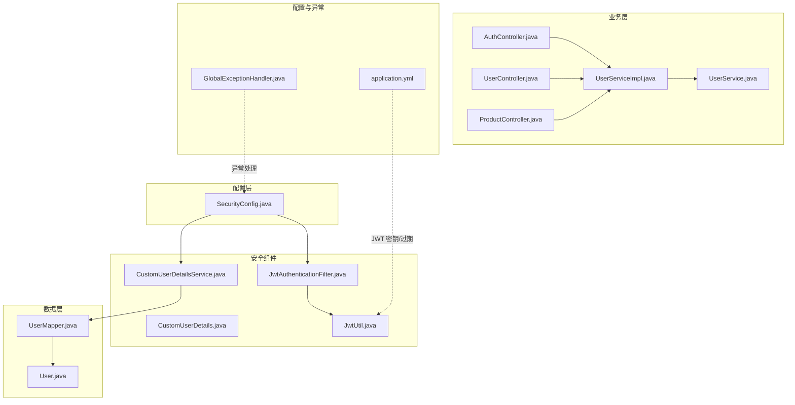
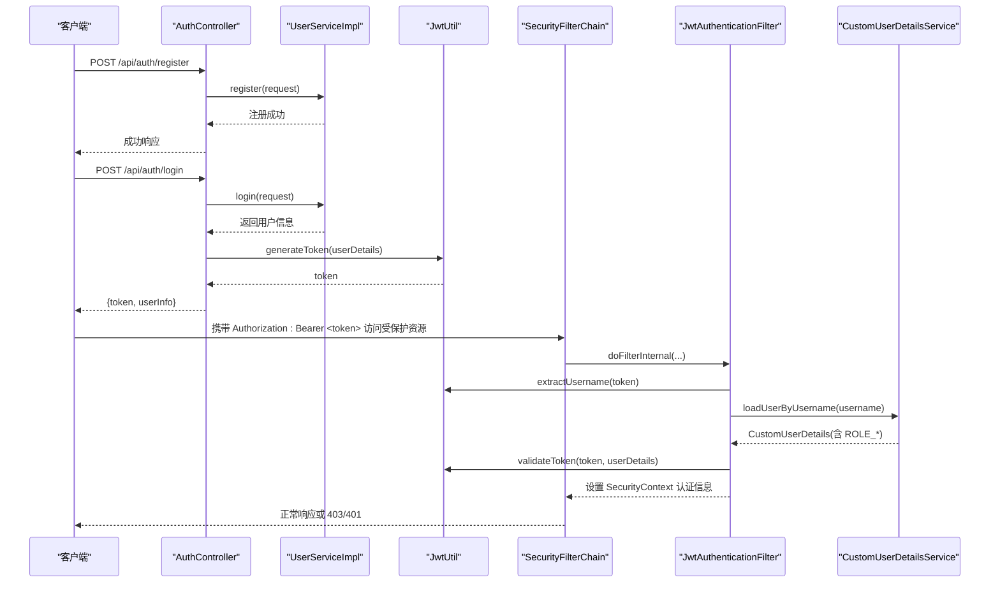
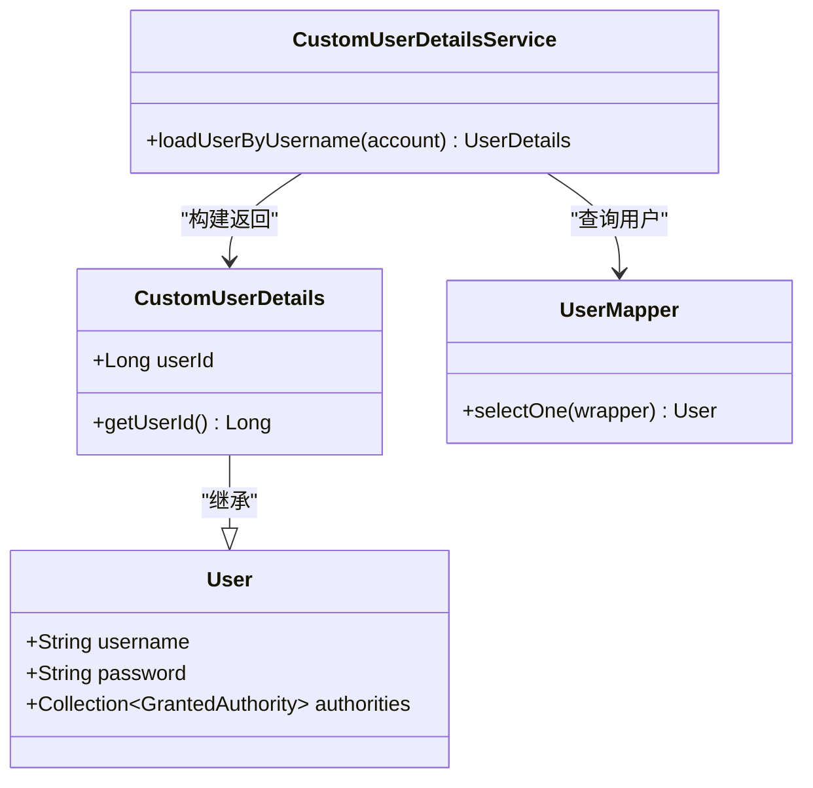
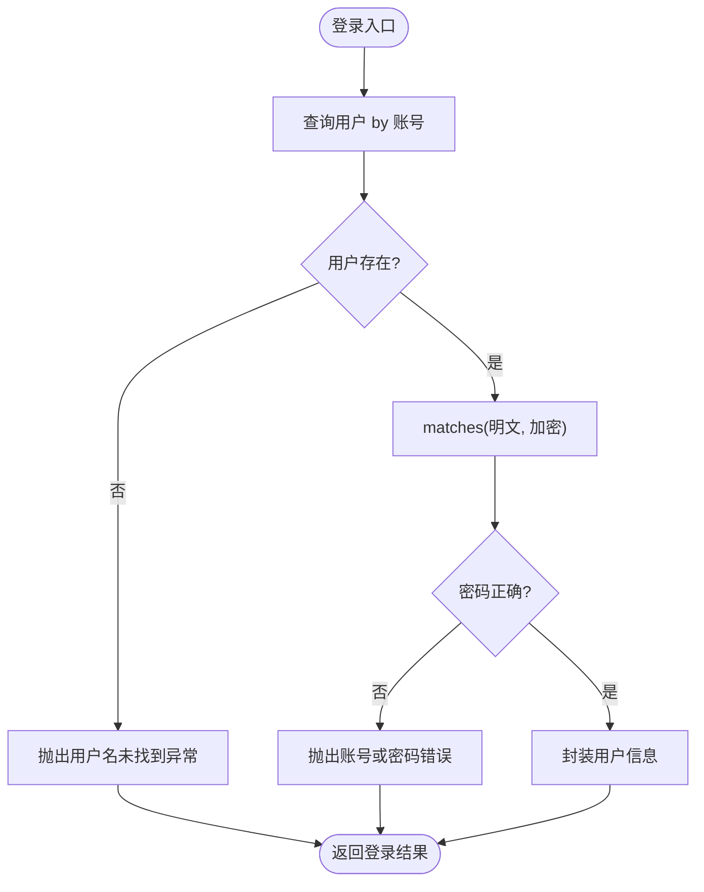
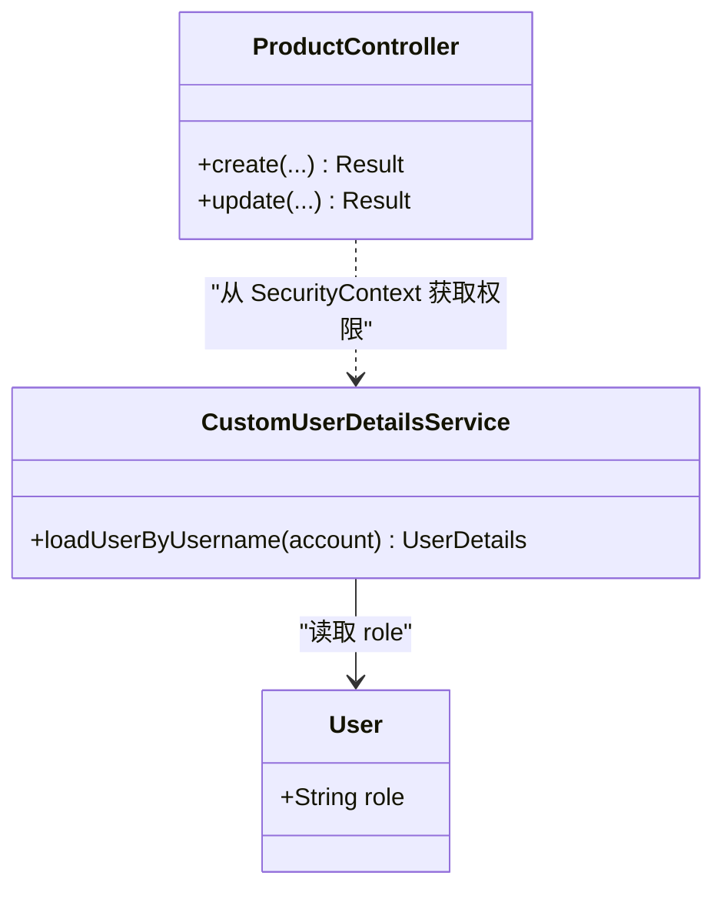
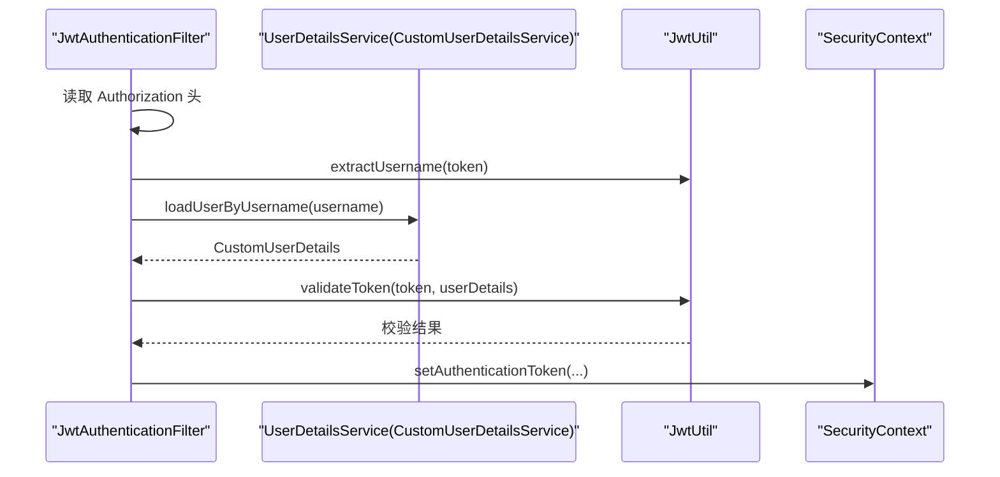
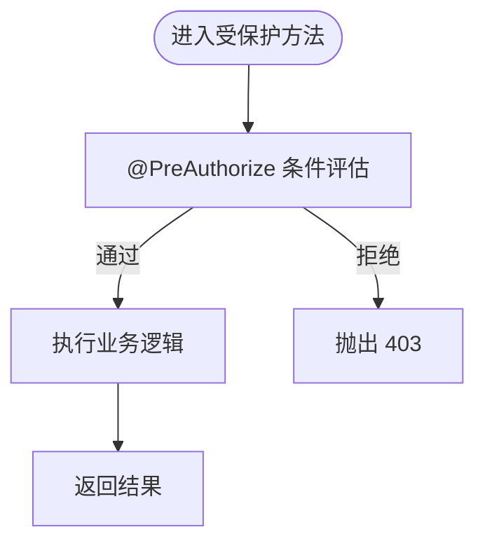
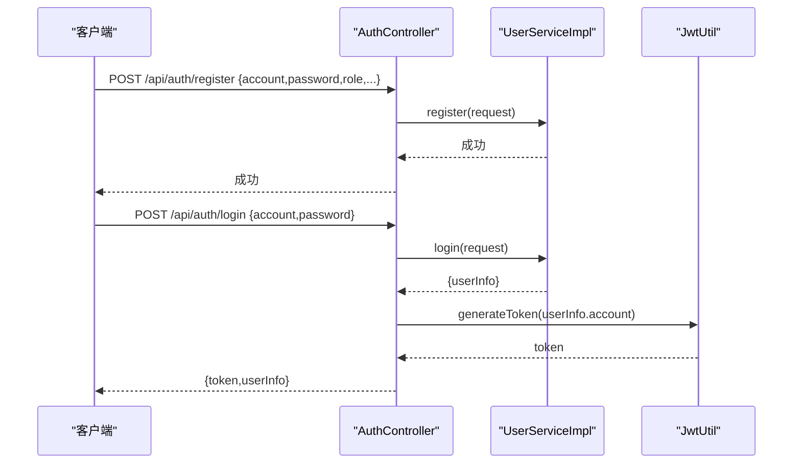
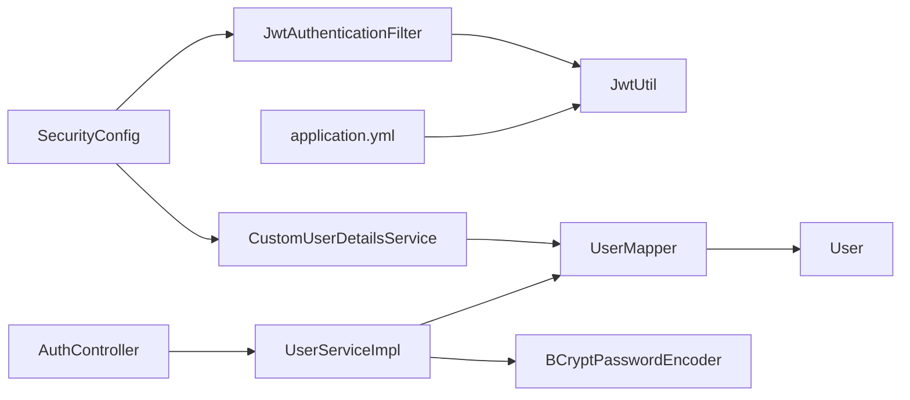

# 用户认证与授权

<cite>
**本文引用的文件**
- [CustomUserDetailsService.java](file://backend/src/main/java/com/heritage/security/CustomUserDetailsService.java)
- [CustomUserDetails.java](file://backend/src/main/java/com/heritage/security/CustomUserDetails.java)
- [JwtAuthenticationFilter.java](file://backend/src/main/java/com/heritage/security/JwtAuthenticationFilter.java)
- [SecurityConfig.java](file://backend/src/main/java/com/heritage/config/SecurityConfig.java)
- [JwtUtil.java](file://backend/src/main/java/com/heritage/util/JwtUtil.java)
- [AuthController.java](file://backend/src/main/java/com/heritage/controller/AuthController.java)
- [UserService.java](file://backend/src/main/java/com/heritage/service/UserService.java)
- [UserServiceImpl.java](file://backend/src/main/java/com/heritage/service/impl/UserServiceImpl.java)
- [User.java](file://backend/src/main/java/com/heritage/entity/User.java)
- [LoginRequest.java](file://backend/src/main/java/com/heritage/dto/LoginRequest.java)
- [RegisterRequest.java](file://backend/src/main/java/com/heritage/dto/RegisterRequest.java)
- [LoginResponse.java](file://backend/src/main/java/com/heritage/dto/LoginResponse.java)
- [UserVO.java](file://backend/src/main/java/com/heritage/dto/UserVO.java)
- [UserController.java](file://backend/src/main/java/com/heritage/controller/UserController.java)
- [ProductController.java](file://backend/src/main/java/com/heritage/controller/ProductController.java)
- [application.yml](file://backend/src/main/resources/application.yml)
- [GlobalExceptionHandler.java](file://backend/src/main/java/com/heritage/common/GlobalExceptionHandler.java)
</cite>

## 目录
1. [简介](#简介)
2. [项目结构](#项目结构)
3. [核心组件](#核心组件)
4. [架构总览](#架构总览)
5. [详细组件分析](#详细组件分析)
6. [依赖关系分析](#依赖关系分析)
7. [性能考虑](#性能考虑)
8. [故障排查指南](#故障排查指南)
9. [结论](#结论)

## 简介
本文件面向非遗产品智能定制商城系统的“用户认证与授权”主题，系统采用 Spring Security + JWT 的无状态认证方案，结合基于角色的访问控制（RBAC）。文档重点覆盖以下内容：
- CustomUserDetailsService 的实现机制：用户信息加载、密码验证、账户状态检查
- RBAC 模型：角色定义、权限分配、访问决策逻辑
- Spring Security 认证流程：UsernamePasswordAuthenticationFilter 工作原理与自定义认证提供程序
- 方法级安全注解：@PreAuthorize、@PostAuthorize 等的使用
- 完整流程：用户注册、登录、权限升级（如角色变更）与异常处理

## 项目结构
后端采用分层架构，认证与授权相关代码主要集中在以下包：
- config：安全配置（SecurityConfig）
- security：用户细节与 JWT 过滤器
- controller：认证接口与受保护资源接口
- service/impl：业务实现（含注册、登录）
- entity/dto：用户实体与 DTO
- util：JWT 工具
- common：全局异常处理

图表来源
- [SecurityConfig.java](file://backend/src/main/java/com/heritage/config/SecurityConfig.java#L22-L66)
- [JwtAuthenticationFilter.java](file://backend/src/main/java/com/heritage/security/JwtAuthenticationFilter.java#L24-L71)
- [CustomUserDetailsService.java](file://backend/src/main/java/com/heritage/security/CustomUserDetailsService.java#L17-L38)
- [JwtUtil.java](file://backend/src/main/java/com/heritage/util/JwtUtil.java#L18-L80)
- [AuthController.java](file://backend/src/main/java/com/heritage/controller/AuthController.java#L21-L47)
- [UserServiceImpl.java](file://backend/src/main/java/com/heritage/service/impl/UserServiceImpl.java#L20-L180)
- [User.java](file://backend/src/main/java/com/heritage/entity/User.java#L11-L37)
- [application.yml](file://backend/src/main/resources/application.yml#L39-L41)
- [GlobalExceptionHandler.java](file://backend/src/main/java/com/heritage/common/GlobalExceptionHandler.java#L14-L60)

章节来源
- [SecurityConfig.java](file://backend/src/main/java/com/heritage/config/SecurityConfig.java#L22-L66)
- [application.yml](file://backend/src/main/resources/application.yml#L39-L41)

## 核心组件
- 自定义用户详情服务：负责按账号加载用户、装配角色权限
- JWT 过滤器：拦截请求解析 Authorization 头，校验 Token 并写入安全上下文
- 安全配置：启用方法级安全、配置无状态会话、注册过滤器与认证提供程序
- JWT 工具：生成与校验 Token，解析用户名与过期时间
- 认证控制器：提供注册与登录接口，登录完成后签发 Token
- 用户服务实现：完成注册、登录时的密码编码与校验、用户信息封装
- 全局异常处理：统一处理认证/授权异常与业务异常

章节来源
- [CustomUserDetailsService.java](file://backend/src/main/java/com/heritage/security/CustomUserDetailsService.java#L17-L38)
- [JwtAuthenticationFilter.java](file://backend/src/main/java/com/heritage/security/JwtAuthenticationFilter.java#L24-L71)
- [SecurityConfig.java](file://backend/src/main/java/com/heritage/config/SecurityConfig.java#L22-L66)
- [JwtUtil.java](file://backend/src/main/java/com/heritage/util/JwtUtil.java#L18-L80)
- [AuthController.java](file://backend/src/main/java/com/heritage/controller/AuthController.java#L21-L47)
- [UserServiceImpl.java](file://backend/src/main/java/com/heritage/service/impl/UserServiceImpl.java#L20-L180)
- [GlobalExceptionHandler.java](file://backend/src/main/java/com/heritage/common/GlobalExceptionHandler.java#L14-L60)

## 架构总览
系统采用“无状态认证 + 基于角色的访问控制”：
- 登录成功后由服务端签发 JWT，客户端在后续请求头携带 Authorization: Bearer <token>
- 请求进入时由 JwtAuthenticationFilter 解析并校验 Token，加载用户详情与权限，写入 SecurityContext
- 方法级安全通过 @PreAuthorize/@PostAuthorize 等注解进行细粒度控制
- 未登录或权限不足分别返回 401/403

图表来源
- [AuthController.java](file://backend/src/main/java/com/heritage/controller/AuthController.java#L26-L46)
- [UserServiceImpl.java](file://backend/src/main/java/com/heritage/service/impl/UserServiceImpl.java#L48-L75)
- [JwtUtil.java](file://backend/src/main/java/com/heritage/util/JwtUtil.java#L61-L79)
- [JwtAuthenticationFilter.java](file://backend/src/main/java/com/heritage/security/JwtAuthenticationFilter.java#L29-L70)
- [CustomUserDetailsService.java](file://backend/src/main/java/com/heritage/security/CustomUserDetailsService.java#L21-L37)
- [SecurityConfig.java](file://backend/src/main/java/com/heritage/config/SecurityConfig.java#L50-L62)

## 详细组件分析

### CustomUserDetailsService 实现机制
- 用户信息加载：根据账号查询用户，若不存在抛出用户名未找到异常
- 权限装配：将用户角色转换为“ROLE_前缀”的 GrantedAuthority 列表
- 返回自定义用户详情：继承 Spring Security 的 User，扩展保存 userId 字段，便于后续业务使用

图表来源
- [CustomUserDetailsService.java](file://backend/src/main/java/com/heritage/security/CustomUserDetailsService.java#L17-L38)
- [CustomUserDetails.java](file://backend/src/main/java/com/heritage/security/CustomUserDetails.java#L10-L22)
- [User.java](file://backend/src/main/java/com/heritage/entity/User.java#L11-L37)

章节来源
- [CustomUserDetailsService.java](file://backend/src/main/java/com/heritage/security/CustomUserDetailsService.java#L17-L38)
- [CustomUserDetails.java](file://backend/src/main/java/com/heritage/security/CustomUserDetails.java#L10-L22)
- [User.java](file://backend/src/main/java/com/heritage/entity/User.java#L11-L37)

### 密码验证与账户状态检查
- 密码验证：登录时使用 PasswordEncoder.matches 对比明文密码与数据库中加密存储的密码
- 账户状态：当前实现未显式检查锁定/禁用等状态字段；如需可扩展 CustomUserDetails 中的用户状态字段并在 loadUserByUsername 中返回相应状态

图表来源
- [UserServiceImpl.java](file://backend/src/main/java/com/heritage/service/impl/UserServiceImpl.java#L48-L75)

章节来源
- [UserServiceImpl.java](file://backend/src/main/java/com/heritage/service/impl/UserServiceImpl.java#L48-L75)

### 基于角色的访问控制（RBAC）
- 角色定义：用户实体 role 字段决定角色字符串，加载时转换为 ROLE_USER/ROLE_MERCHANT/ROLE_ADMIN 等
- 权限分配：CustomUserDetailsService 将单个角色映射为对应 GrantedAuthority
- 访问决策：
  - URL 层面：SecurityConfig 对特定路径放行，其余请求需认证
  - 方法层面：@PreAuthorize("hasRole('ADMIN')") 或组合条件（如“hasRole('ADMIN') or hasRole('MERCHANT')”）

图表来源
- [User.java](file://backend/src/main/java/com/heritage/entity/User.java#L26-L27)
- [CustomUserDetailsService.java](file://backend/src/main/java/com/heritage/security/CustomUserDetailsService.java#L31-L36)
- [ProductController.java](file://backend/src/main/java/com/heritage/controller/ProductController.java#L33-L53)

章节来源
- [User.java](file://backend/src/main/java/com/heritage/entity/User.java#L26-L27)
- [CustomUserDetailsService.java](file://backend/src/main/java/com/heritage/security/CustomUserDetailsService.java#L31-L36)
- [ProductController.java](file://backend/src/main/java/com/heritage/controller/ProductController.java#L33-L53)

### Spring Security 认证流程与过滤器链
- 无状态会话：SessionCreationPolicy.STATELESS
- 放行路径：/api/auth/**、/api/heritage/**、/uploads/**、Swagger 文档路径
- 过滤器顺序：先执行 JwtAuthenticationFilter，再进入 UsernamePasswordAuthenticationFilter（但本项目未启用基于表单的登录，因此该过滤器通常不会触发）
- 认证提供程序：DaoAuthenticationProvider + BCryptPasswordEncoder

图表来源
- [SecurityConfig.java](file://backend/src/main/java/com/heritage/config/SecurityConfig.java#L50-L62)
- [JwtAuthenticationFilter.java](file://backend/src/main/java/com/heritage/security/JwtAuthenticationFilter.java#L29-L70)
- [JwtUtil.java](file://backend/src/main/java/com/heritage/util/JwtUtil.java#L76-L79)
- [CustomUserDetailsService.java](file://backend/src/main/java/com/heritage/security/CustomUserDetailsService.java#L21-L37)

章节来源
- [SecurityConfig.java](file://backend/src/main/java/com/heritage/config/SecurityConfig.java#L50-L62)
- [JwtAuthenticationFilter.java](file://backend/src/main/java/com/heritage/security/JwtAuthenticationFilter.java#L29-L70)

### 方法级安全注解使用
- @PreAuthorize：在方法执行前判断权限，如仅 ADMIN 可见的用户管理接口
- @PostAuthorize：在方法执行后对返回值进行二次校验（本项目未直接使用）
- 在控制器中可通过 SecurityContextHolder 获取当前用户详情与权限，用于动态判定

图表来源
- [SecurityConfig.java](file://backend/src/main/java/com/heritage/config/SecurityConfig.java#L24-L24)
- [UserController.java](file://backend/src/main/java/com/heritage/controller/UserController.java#L57-L90)
- [ProductController.java](file://backend/src/main/java/com/heritage/controller/ProductController.java#L33-L53)

章节来源
- [UserController.java](file://backend/src/main/java/com/heritage/controller/UserController.java#L57-L90)
- [ProductController.java](file://backend/src/main/java/com/heritage/controller/ProductController.java#L33-L53)

### 用户注册、登录与权限升级流程
- 注册流程：校验两次密码一致性、账号唯一性，使用 BCrypt 编码密码入库，角色来自请求
- 登录流程：校验账号存在与密码正确，返回用户信息并签发 JWT
- 权限升级：当前系统未提供角色变更接口；如需可在管理员接口中增加角色更新能力，并在登录后重新签发 Token

图表来源
- [AuthController.java](file://backend/src/main/java/com/heritage/controller/AuthController.java#L26-L46)
- [UserServiceImpl.java](file://backend/src/main/java/com/heritage/service/impl/UserServiceImpl.java#L26-L46)
- [JwtUtil.java](file://backend/src/main/java/com/heritage/util/JwtUtil.java#L61-L64)

章节来源
- [AuthController.java](file://backend/src/main/java/com/heritage/controller/AuthController.java#L26-L46)
- [UserServiceImpl.java](file://backend/src/main/java/com/heritage/service/impl/UserServiceImpl.java#L26-L46)
- [RegisterRequest.java](file://backend/src/main/java/com/heritage/dto/RegisterRequest.java#L9-L28)
- [LoginRequest.java](file://backend/src/main/java/com/heritage/dto/LoginRequest.java#L7-L14)

### 异常处理机制
- 认证异常：AuthenticationException → 401 未登录或过期
- 授权异常：AccessDeniedException → 403 无权限
- 参数校验异常：MethodArgumentNotValidException/BingException → 返回具体字段提示
- 业务异常：BusinessException → 返回业务错误消息

章节来源
- [GlobalExceptionHandler.java](file://backend/src/main/java/com/heritage/common/GlobalExceptionHandler.java#L16-L60)
- [BusinessException.java](file://backend/src/main/java/com/heritage/common/BusinessException.java#L6-L18)

## 依赖关系分析
- 组件耦合
  - SecurityConfig 依赖 JwtAuthenticationFilter 与 UserDetailsService
  - JwtAuthenticationFilter 依赖 JwtUtil 与 UserDetailsService
  - CustomUserDetailsService 依赖 UserMapper 与 User 实体
  - AuthController 依赖 UserService 与 JwtUtil
  - UserServiceImpl 依赖 PasswordEncoder 与 UserMapper
- 外部依赖
  - JWT 密钥与过期时间来源于 application.yml
  - 数据源与 Redis 配置位于同一文件

图表来源
- [SecurityConfig.java](file://backend/src/main/java/com/heritage/config/SecurityConfig.java#L28-L47)
- [JwtAuthenticationFilter.java](file://backend/src/main/java/com/heritage/security/JwtAuthenticationFilter.java#L26-L27)
- [CustomUserDetailsService.java](file://backend/src/main/java/com/heritage/security/CustomUserDetailsService.java#L19-L19)
- [AuthController.java](file://backend/src/main/java/com/heritage/controller/AuthController.java#L23-L24)
- [UserServiceImpl.java](file://backend/src/main/java/com/heritage/service/impl/UserServiceImpl.java#L24-L24)
- [application.yml](file://backend/src/main/resources/application.yml#L39-L41)

章节来源
- [SecurityConfig.java](file://backend/src/main/java/com/heritage/config/SecurityConfig.java#L28-L47)
- [application.yml](file://backend/src/main/resources/application.yml#L39-L41)

## 性能考虑
- Token 校验：每次请求均需解析与校验签名，建议合理设置过期时间，避免频繁签发
- 密码编码：BCrypt 成本因子默认即可，注意不要过度提高以避免登录延迟
- 查询优化：CustomUserDetailsService 使用单条查询，建议在 account 上建立索引
- 过滤器链：仅在必要路径执行，避免不必要的链路开销

## 故障排查指南
- 401 未登录或过期
  - 检查请求头是否包含正确的 Authorization: Bearer <token>
  - 校验 JWT 密钥与过期时间配置
  - 确认 Token 未过期
- 403 无权限
  - 检查用户角色是否满足 @PreAuthorize 条件
  - 确认权限前缀为 ROLE_ 且大小写匹配
- 登录失败
  - 核对账号是否存在与密码是否匹配
  - 检查密码是否使用 BCrypt 编码存储
- 参数校验失败
  - 关注字段校验规则与提示信息

章节来源
- [GlobalExceptionHandler.java](file://backend/src/main/java/com/heritage/common/GlobalExceptionHandler.java#L16-L60)
- [application.yml](file://backend/src/main/resources/application.yml#L39-L41)
- [JwtUtil.java](file://backend/src/main/java/com/heritage/util/JwtUtil.java#L76-L79)

## 结论
本系统通过 CustomUserDetailsService、JwtAuthenticationFilter 与 SecurityConfig 构建了清晰的认证与授权体系，配合基于角色的访问控制与方法级安全注解，实现了从登录到资源访问的全链路安全控制。建议后续完善角色变更与权限动态刷新机制，并持续优化 Token 过期策略与日志监控。