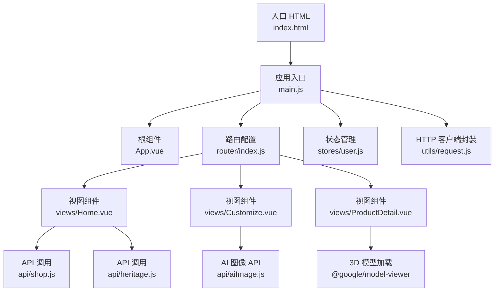
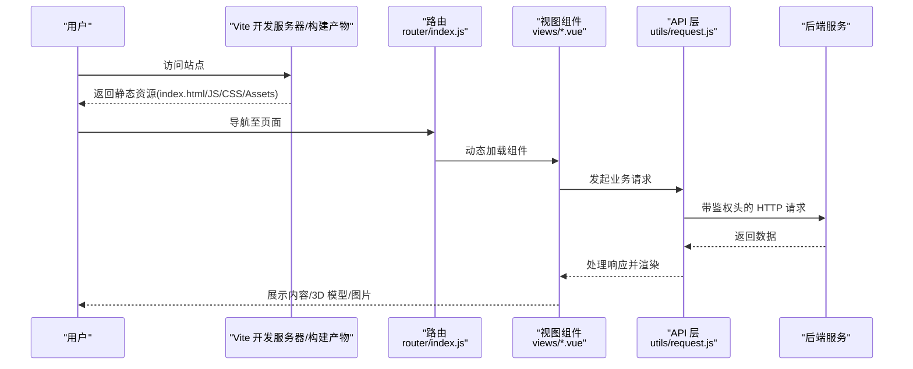
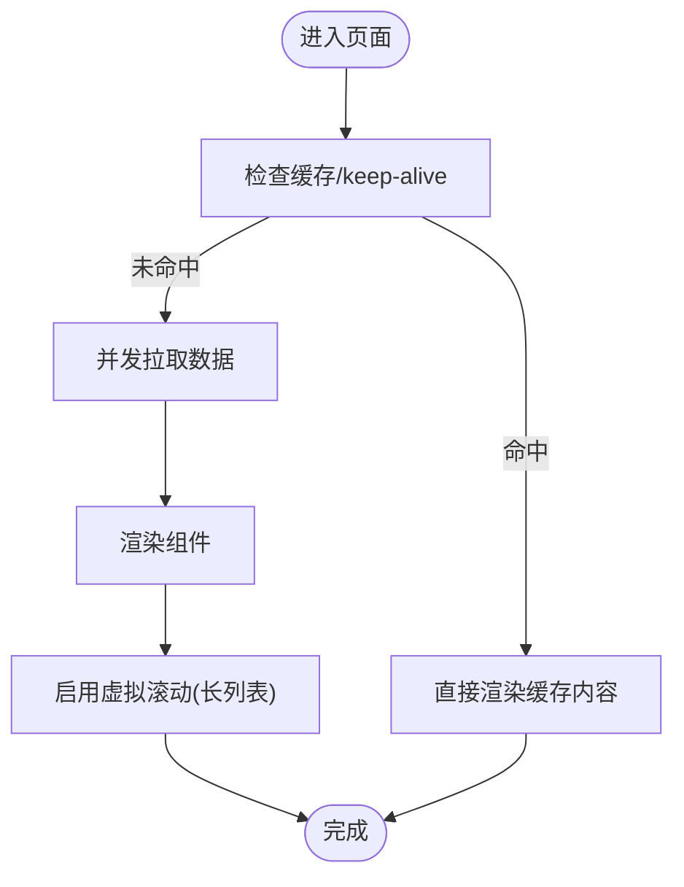
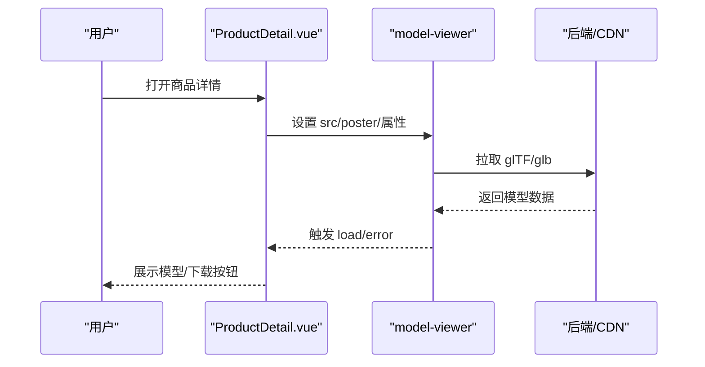
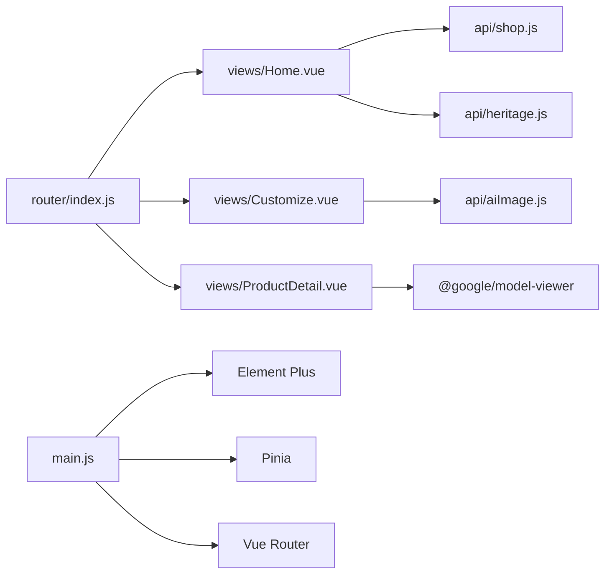

# 前端性能优化

<cite>
**本文引用的文件**
- [vite.config.js](file://frontend/vite.config.js)
- [package.json](file://frontend/package.json)
- [main.js](file://frontend/src/main.js)
- [App.vue](file://frontend/src/App.vue)
- [index.html](file://frontend/index.html)
- [router/index.js](file://frontend/src/router/index.js)
- [stores/user.js](file://frontend/src/stores/user.js)
- [utils/request.js](file://frontend/src/utils/request.js)
- [views/Home.vue](file://frontend/src/views/Home.vue)
- [views/Customize.vue](file://frontend/src/views/Customize.vue)
- [views/ProductDetail.vue](file://frontend/src/views/ProductDetail.vue)
- [layouts/MainLayout.vue](file://frontend/src/layouts/MainLayout.vue)
- [api/shop.js](file://frontend/src/api/shop.js)
- [api/heritage.js](file://frontend/src/api/heritage.js)
</cite>

## 目录
1. [引言](#引言)
2. [项目结构](#项目结构)
3. [核心组件](#核心组件)
4. [架构总览](#架构总览)
5. [详细组件分析](#详细组件分析)
6. [依赖关系分析](#依赖关系分析)
7. [性能考量](#性能考量)
8. [故障排查指南](#故障排查指南)
9. [结论](#结论)
10. [附录](#附录)

## 引言
本文件面向“非遗产品智能定制商城系统”的前端性能优化，围绕 Vite 构建优化、前端资源加载优化、组件性能优化、前端监控与指标、PWA 与离线能力、以及 3D 模型加载与 WebGL 性能调优等方面，给出系统化方案与落地建议。目标是在不改变现有业务逻辑的前提下，显著提升首屏速度、交互流畅度与资源利用效率。

## 项目结构
前端采用 Vue 3 + Vite 的现代工程化架构，路由采用按需加载（动态导入），API 层通过 Axios 封装统一拦截器，状态管理使用 Pinia，UI 组件库为 Element Plus。整体结构清晰，具备良好的可扩展性与优化空间。

图表来源
- [index.html](file://frontend/index.html#L1-L20)
- [main.js](file://frontend/src/main.js#L1-L25)
- [App.vue](file://frontend/src/App.vue#L1-L40)
- [router/index.js](file://frontend/src/router/index.js#L1-L176)
- [stores/user.js](file://frontend/src/stores/user.js#L1-L33)
- [utils/request.js](file://frontend/src/utils/request.js#L1-L45)
- [views/Home.vue](file://frontend/src/views/Home.vue#L1-L649)
- [views/Customize.vue](file://frontend/src/views/Customize.vue#L1-L800)
- [views/ProductDetail.vue](file://frontend/src/views/ProductDetail.vue#L1-L715)
- [api/shop.js](file://frontend/src/api/shop.js#L1-L18)
- [api/heritage.js](file://frontend/src/api/heritage.js#L1-L153)

章节来源
- [index.html](file://frontend/index.html#L1-L20)
- [main.js](file://frontend/src/main.js#L1-L25)
- [router/index.js](file://frontend/src/router/index.js#L1-L176)

## 核心组件
- 应用入口与全局配置：在入口中注册 Pinia、路由、国际化、主题与 Element Plus 插件，确保全局样式与组件可用。
- 路由与懒加载：所有页面级路由均采用动态导入，减少初始包体与首屏阻塞。
- 请求封装：统一设置基础路径、超时与鉴权头，集中处理响应错误与业务状态码。
- 视图层：首页聚合多接口并发加载；定制页支持大体积图片上传与预览；商品详情页集成 3D 模型预览与下载。

章节来源
- [main.js](file://frontend/src/main.js#L1-L25)
- [router/index.js](file://frontend/src/router/index.js#L1-L176)
- [utils/request.js](file://frontend/src/utils/request.js#L1-L45)
- [views/Home.vue](file://frontend/src/views/Home.vue#L199-L251)
- [views/Customize.vue](file://frontend/src/views/Customize.vue#L545-L623)
- [views/ProductDetail.vue](file://frontend/src/views/ProductDetail.vue#L187-L261)

## 架构总览
下图展示了从浏览器到后端的典型请求链路，以及关键的性能优化点（如 CDN、缓存、懒加载等）。

图表来源
- [router/index.js](file://frontend/src/router/index.js#L1-L176)
- [utils/request.js](file://frontend/src/utils/request.js#L1-L45)
- [views/Home.vue](file://frontend/src/views/Home.vue#L203-L231)
- [views/Customize.vue](file://frontend/src/views/Customize.vue#L569-L619)
- [views/ProductDetail.vue](file://frontend/src/views/ProductDetail.vue#L191-L221)

## 详细组件分析

### Vite 构建优化配置
当前配置较为精简，建议在现有基础上补充以下优化项以获得更佳的构建与运行体验：
- 代码分割策略
  - 使用 Vite 的 rollupOptions.output.manualChunks 进行手动分块，将第三方库（如 three、@google/model-viewer、element-plus）拆分为独立 chunk，提升缓存命中率。
  - 对路由级组件的动态导入进一步细化，避免单页 bundle 过大。
- 资源压缩与预构建
  - 启用压缩（terser 或 esbuild），在生产环境开启最小化与作用域提升。
  - 预构建依赖（optimizeDeps）以加速冷启动与热更新。
- 构建产物分析
  - 使用 rollup-plugin-visualizer 生成包体分析报告，识别超大依赖与重复模块。

章节来源
- [vite.config.js](file://frontend/vite.config.js#L1-L22)
- [package.json](file://frontend/package.json#L1-L28)

### 前端资源加载优化
- 图片懒加载与占位图
  - 首页商品与非遗卡片使用占位 SVG，避免空白闪烁；对大图采用 lazy-load 与合适的尺寸裁剪。
- 字体与图标优化
  - Element Plus 图标按需引入，减少打包体积；字体可通过本地化或 CDN 缓存策略优化。
- CDN 与缓存策略
  - 第三方库与静态资源指向 CDN，结合强缓存与版本号策略，降低带宽与延迟。
- 预加载与预连接
  - 对关键字体与首屏资源使用 rel="prefetch/preload"；对 API 域名使用 rel="dns-prefetch/dpr-preconnect"。

章节来源
- [views/Home.vue](file://frontend/src/views/Home.vue#L164-L184)
- [views/ProductDetail.vue](file://frontend/src/views/ProductDetail.vue#L147-L156)
- [main.js](file://frontend/src/main.js#L1-L25)

### 组件性能优化方案
- 虚拟滚动
  - 在长列表（如商品列表、历史记录）中采用虚拟滚动，限制 DOM 节点数量，显著降低重排与重绘成本。
- 组件缓存
  - 利用 keep-alive 缓存高频访问但数据变化较少的页面（如首页、商品列表），减少重复渲染与请求。
- 渲染优化
  - 首页并发多个接口，使用 Promise.allSettled 并在 finally 中统一关闭 loading，避免部分接口失败导致整体卡死。
  - 定制页对大图上传前进行尺寸与大小校验，及时释放预览 URL，防止内存泄漏。

图表来源
- [views/Home.vue](file://frontend/src/views/Home.vue#L203-L231)
- [views/Customize.vue](file://frontend/src/views/Customize.vue#L494-L513)
- [router/index.js](file://frontend/src/router/index.js#L1-L176)

章节来源
- [views/Home.vue](file://frontend/src/views/Home.vue#L199-L251)
- [views/Customize.vue](file://frontend/src/views/Customize.vue#L421-L430)

### 前端监控指标设计与性能测量
- 关键指标
  - 首屏时间（FCP/LCP）、交互时间（INP）、页面稳定性（CLS）、网络请求时延与成功率。
- 测量工具
  - 使用 PerformanceObserver、Navigation Timing、Resource Timing 采集原始指标；结合 Web Vitals 或自研埋点上报。
- 用户体验策略
  - 加载态骨架屏与占位图；错误兜底与重试机制；弱网降级（如禁用高分辨率图片、延迟加载非关键资源）。

章节来源
- [utils/request.js](file://frontend/src/utils/request.js#L22-L42)
- [views/Home.vue](file://frontend/src/views/Home.vue#L62-L79)

### PWA 配置、Service Worker 与离线功能
- PWA 配置
  - 注册 Service Worker，配置 manifest 与图标，启用离线缓存策略。
- 缓存策略
  - 静态资源采用 Stale-While-Revalidate；API 数据采用 Cache First 并结合版本化；3D 模型与图片采用 Cache First。
- 离线能力
  - 首页与商品详情页在离线时展示缓存内容或降级界面；支持离线引导与重连提示。

章节来源
- [index.html](file://frontend/index.html#L1-L20)
- [main.js](file://frontend/src/main.js#L1-L25)

### 3D 模型加载优化与 WebGL 性能调优
- 3D 模型加载
  - 使用 @google/model-viewer，合理设置 poster 与加载状态提示；在移动端启用 auto-rotate 与 camera-controls 时注意性能开销。
- WebGL 性能
  - 控制阴影强度与曝光；优先使用较低分辨率纹理；在低端设备上提供简化模型或禁用特效。
- 资源管理
  - 模型加载完成后及时清理事件监听；在对话框关闭时释放资源；提供下载能力以便用户离线保存。

图表来源
- [views/ProductDetail.vue](file://frontend/src/views/ProductDetail.vue#L83-L95)
- [views/ProductDetail.vue](file://frontend/src/views/ProductDetail.vue#L177-L185)

章节来源
- [views/ProductDetail.vue](file://frontend/src/views/ProductDetail.vue#L80-L107)
- [views/ProductDetail.vue](file://frontend/src/views/ProductDetail.vue#L177-L185)

## 依赖关系分析
- 组件耦合
  - 路由与视图组件通过动态导入解耦；API 层与视图组件通过封装的 request 模块解耦。
- 外部依赖
  - Vue 3、Element Plus、Axios、Pinia、Three.js、@google/model-viewer；建议对大体积依赖进行按需引入与分包。
- 可能的循环依赖
  - 当前结构未见明显循环依赖；保持按需导入与模块化组织可避免潜在问题。

图表来源
- [router/index.js](file://frontend/src/router/index.js#L1-L176)
- [views/Home.vue](file://frontend/src/views/Home.vue#L1-L649)
- [views/Customize.vue](file://frontend/src/views/Customize.vue#L1-L800)
- [views/ProductDetail.vue](file://frontend/src/views/ProductDetail.vue#L1-L715)
- [api/shop.js](file://frontend/src/api/shop.js#L1-L18)
- [api/heritage.js](file://frontend/src/api/heritage.js#L1-L153)
- [main.js](file://frontend/src/main.js#L1-L25)

章节来源
- [router/index.js](file://frontend/src/router/index.js#L1-L176)
- [main.js](file://frontend/src/main.js#L1-L25)

## 性能考量
- 构建阶段
  - 启用代码分割与依赖预构建；对静态资源进行压缩与指纹化；生成包体分析报告持续优化。
- 运行阶段
  - 首屏并发请求与骨架屏；图片懒加载与占位图；虚拟滚动与组件缓存；弱网降级与错误重试。
- 3D 与媒体
  - 合理控制模型复杂度与贴图质量；在移动端谨慎启用自动旋转与阴影；提供下载能力。

## 故障排查指南
- 请求失败与鉴权
  - 检查请求拦截器中的 Authorization 头是否正确注入；关注响应状态码与错误消息提示。
- 路由与懒加载
  - 确认动态导入语法正确；检查路由守卫逻辑与权限判断。
- 3D 模型加载
  - 监听 load/error 事件，记录错误信息；在移动端验证相机控制与自动旋转行为。

章节来源
- [utils/request.js](file://frontend/src/utils/request.js#L9-L42)
- [router/index.js](file://frontend/src/router/index.js#L147-L173)
- [views/ProductDetail.vue](file://frontend/src/views/ProductDetail.vue#L177-L185)

## 结论
通过在现有工程基础上完善 Vite 构建优化、资源加载策略、组件渲染与缓存、监控与 PWA 能力，以及针对 3D 模型与 WebGL 的专项优化，可以显著提升非遗商城前端的整体性能与用户体验。建议优先实施代码分割与依赖分包、并发请求与骨架屏、虚拟滚动与缓存策略，并逐步引入 PWA 与离线能力，最终形成可持续的性能优化闭环。

## 附录
- 优化清单
  - 构建：启用 manualChunks、optimizeDeps、压缩与可视化分析。
  - 资源：CDN、缓存策略、预加载/预连接、占位图与懒加载。
  - 组件：虚拟滚动、keep-alive 缓存、并发请求与 finally 关闭 loading。
  - 监控：Web Vitals/自定义埋点、错误上报、弱网降级。
  - PWA：Service Worker、manifest、离线缓存策略。
  - 3D/WebGL：模型简化、贴图优化、事件清理与下载能力。