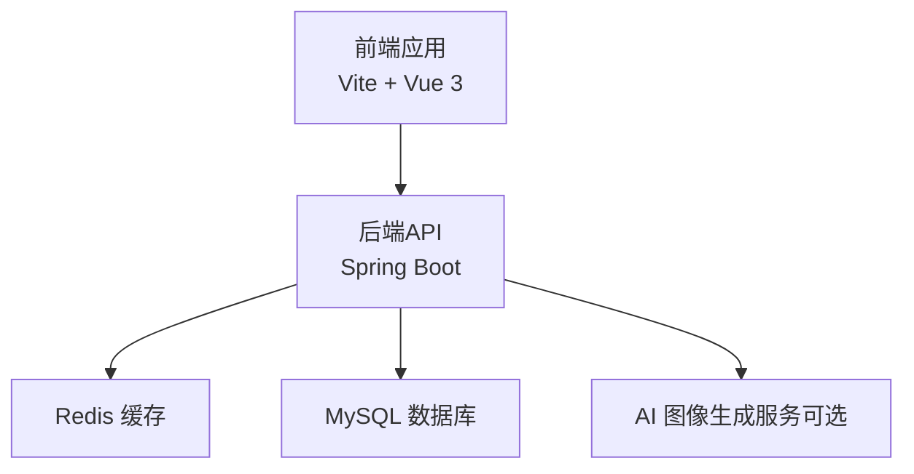
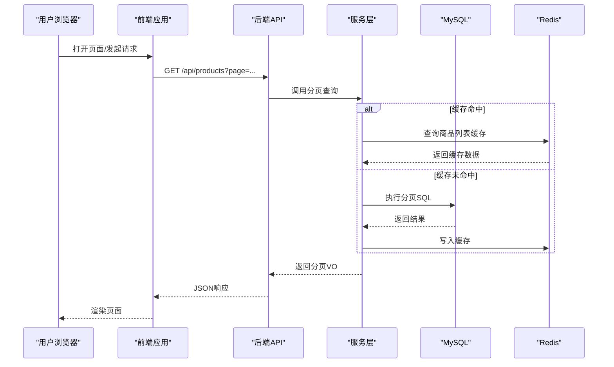
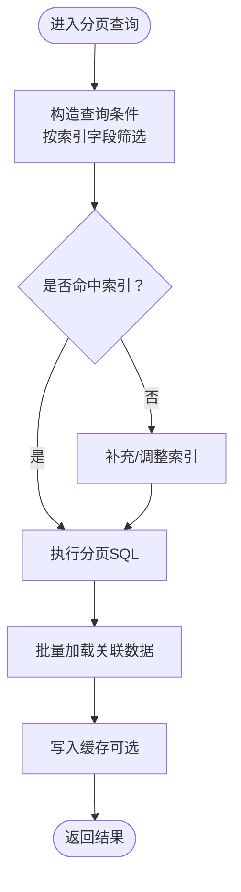
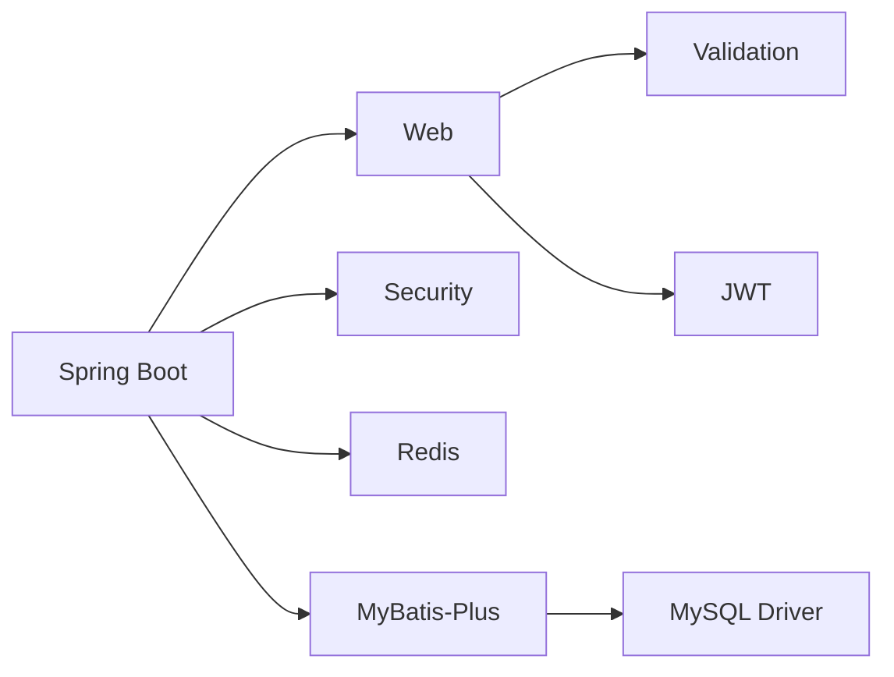

# 性能优化策略

<cite>
**本文引用的文件**
- [application.yml](file://backend/src/main/resources/application.yml)
- [RedisConfig.java](file://backend/src/main/java/com/heritage/config/RedisConfig.java)
- [MybatisPlusConfig.java](file://backend/src/main/java/com/heritage/config/MybatisPlusConfig.java)
- [ProductServiceImpl.java](file://backend/src/main/java/com/heritage/service/impl/ProductServiceImpl.java)
- [CartServiceImpl.java](file://backend/src/main/java/com/heritage/service/impl/CartServiceImpl.java)
- [ProductController.java](file://backend/src/main/java/com/heritage/controller/ProductController.java)
- [CartController.java](file://backend/src/main/java/com/heritage/controller/CartController.java)
- [product.sql](file://backend/src/main/resources/sql/product.sql)
- [cart.sql](file://backend/src/main/resources/sql/cart.sql)
- [user.sql](file://backend/src/main/resources/sql/user.sql)
- [pom.xml](file://backend/pom.xml)
- [vite.config.js](file://frontend/vite.config.js)
- [package.json](file://frontend/package.json)
</cite>

## 目录
1. [简介](#简介)
2. [项目结构](#项目结构)
3. [核心组件](#核心组件)
4. [架构总览](#架构总览)
5. [详细组件分析](#详细组件分析)
6. [依赖关系分析](#依赖关系分析)
7. [性能考虑](#性能考虑)
8. [故障排查指南](#故障排查指南)
9. [结论](#结论)
10. [附录](#附录)

## 简介
本文件面向“非遗产品智能定制商城系统”，围绕后端缓存与数据库、前端构建与运行时性能、系统监控与瓶颈定位、负载均衡与连接池优化、异步处理策略以及性能测试与持续监控等方面，提出系统化的性能优化方案。内容基于仓库现有配置与实现进行提炼与扩展，旨在帮助团队在保证功能正确性的前提下，显著提升系统吞吐量、降低延迟并增强稳定性。

## 项目结构
系统采用前后端分离架构：
- 后端基于 Spring Boot 3 + MyBatis-Plus，使用 Redis 缓存与 MySQL 数据库存储。
- 前端基于 Vite + Vue 3，通过代理访问后端 API。
- 配置集中在 application.yml 与各模块配置类中；业务逻辑集中在控制器与服务层。

图表来源
- [application.yml](file://backend/src/main/resources/application.yml#L17-L35)
- [pom.xml](file://backend/pom.xml#L30-L97)
- [vite.config.js](file://frontend/vite.config.js#L12-L20)

章节来源
- [application.yml](file://backend/src/main/resources/application.yml#L1-L63)
- [pom.xml](file://backend/pom.xml#L1-L129)
- [vite.config.js](file://frontend/vite.config.js#L1-L22)

## 核心组件
- 缓存组件：Redis 客户端连接池与序列化配置，启用注解式缓存。
- ORM 组件：MyBatis-Plus 分页、乐观锁与防全表更新插件。
- 控制器与服务：商品与购物车模块的业务流程与数据聚合。
- 数据库：商品、图片、购物车等核心表的索引设计与约束。

章节来源
- [RedisConfig.java](file://backend/src/main/java/com/heritage/config/RedisConfig.java#L1-L46)
- [MybatisPlusConfig.java](file://backend/src/main/java/com/heritage/config/MybatisPlusConfig.java#L1-L31)
- [ProductController.java](file://backend/src/main/java/com/heritage/controller/ProductController.java#L1-L130)
- [CartController.java](file://backend/src/main/java/com/heritage/controller/CartController.java#L1-L86)
- [product.sql](file://backend/src/main/resources/sql/product.sql#L1-L45)
- [cart.sql](file://backend/src/main/resources/sql/cart.sql#L1-L18)

## 架构总览
后端通过 Spring MVC 暴露 REST 接口，控制器调用服务层，服务层使用 MyBatis-Plus 访问数据库，并在需要时读写 Redis 缓存。前端通过 Vite 开发服务器与代理访问后端，生产环境由 Nginx 或容器编排提供静态资源与反向代理。

图表来源
- [ProductController.java](file://backend/src/main/java/com/heritage/controller/ProductController.java#L77-L86)
- [ProductServiceImpl.java](file://backend/src/main/java/com/heritage/service/impl/ProductServiceImpl.java#L136-L165)
- [RedisConfig.java](file://backend/src/main/java/com/heritage/config/RedisConfig.java#L20-L44)
- [application.yml](file://backend/src/main/resources/application.yml#L23-L35)

## 详细组件分析

### 缓存策略设计（Redis）
- 连接与序列化
  - 使用 Lettuce 连接池，默认最大活跃连接 8，空闲连接上限 8，无最大等待时间限制。
  - 键值序列化：字符串键、哈希键使用字符串序列化，值使用 JSON 序列化，支持泛型类型信息。
- 缓存键策略
  - 规范化命名空间：如 “product:list:{page}:{size}”、“product:detail:{id}”、“cart:{userId}:items”。
  - 参数化键：对分页、筛选条件进行哈希编码，避免键爆炸。
  - 命名一致性：统一前缀、分隔符与大小写，便于运维与清理。
- 失效机制
  - 写路径失效：新增/更新/删除商品后，删除对应详情与列表缓存。
  - 读路径回源：缓存未命中时回源数据库并写入缓存，设置合理 TTL。
  - 热点保护：对高频读取的键设置短 TTL 并结合本地缓存（如 Caffeine）降低热点压力。
- 建议
  - 提升连接池并发能力：根据 QPS 与 RT 调整 max-active、max-idle、min-idle。
  - 引入多级缓存：本地缓存 + Redis，减少网络往返。
  - 使用布隆过滤器：对不存在的 ID 先行拦截，避免缓存穿透。

章节来源
- [application.yml](file://backend/src/main/resources/application.yml#L23-L35)
- [RedisConfig.java](file://backend/src/main/java/com/heritage/config/RedisConfig.java#L1-L46)

### 数据库性能优化（MyBatis-Plus + MySQL）
- MyBatis-Plus 配置
  - 分页内核：MySQL 专用分页拦截器，最大每页 500 条，防止超大分页导致慢查询。
  - 乐观锁：开启乐观锁拦截器，避免并发更新覆盖。
  - 防全表更新：开启防全表更新拦截器，避免误操作。
- 索引与查询优化
  - 商品表：按 merchant_id、status 建立单列索引；分页与筛选常用字段具备索引支撑。
  - 商品图片表：按 product_id 建立索引；复合索引 idx_product_cover 支持封面优先场景。
  - 购物车表：唯一索引 uk_user_product 防重复；按 user_id 及组合索引 idx_user_selected、idx_user_status 支持快速查询与筛选。
- 服务层优化实践
  - 批量加载：服务层使用批量查询与映射，减少 N+1 查询。
  - 字段裁剪：仅查询必要字段，避免 SELECT *。
  - 排序与分页：确保排序字段有索引，避免文件排序。

图表来源
- [MybatisPlusConfig.java](file://backend/src/main/java/com/heritage/config/MybatisPlusConfig.java#L16-L29)
- [product.sql](file://backend/src/main/resources/sql/product.sql#L13-L28)
- [cart.sql](file://backend/src/main/resources/sql/cart.sql#L12-L17)
- [ProductServiceImpl.java](file://backend/src/main/java/com/heritage/service/impl/ProductServiceImpl.java#L352-L400)
- [CartServiceImpl.java](file://backend/src/main/java/com/heritage/service/impl/CartServiceImpl.java#L223-L269)

章节来源
- [MybatisPlusConfig.java](file://backend/src/main/java/com/heritage/config/MybatisPlusConfig.java#L1-L31)
- [product.sql](file://backend/src/main/resources/sql/product.sql#L1-L45)
- [cart.sql](file://backend/src/main/resources/sql/cart.sql#L1-L18)
- [ProductServiceImpl.java](file://backend/src/main/java/com/heritage/service/impl/ProductServiceImpl.java#L352-L400)
- [CartServiceImpl.java](file://backend/src/main/java/com/heritage/service/impl/CartServiceImpl.java#L223-L269)

### 前端性能调优（Vite）
- 构建优化
  - 使用 Vite 的原生 ESM 构建与按需编译，缩短冷启动时间。
  - 生产构建自动进行资源压缩与 Tree-shaking，减少包体。
- 代码分割
  - 路由级懒加载：将大型页面组件按路由拆分，首屏只加载必要模块。
  - 动态导入：第三方库与图标等非首屏依赖使用动态导入。
- 资源优化
  - 图片与模型资源建议 CDN 化与压缩，减少首屏阻塞。
  - 启用 Gzip/Brotli 压缩与 HTTP/2 多路复用。
- 开发体验
  - 本地代理到后端 8080 端口，避免跨域与 CORS 配置复杂度。

章节来源
- [vite.config.js](file://frontend/vite.config.js#L1-L22)
- [package.json](file://frontend/package.json#L1-L28)

### 系统监控指标设计
- 后端指标
  - 响应时间与吞吐量：接口 P50/P95/P99、QPS、错误率。
  - 缓存命中率：keyspace hits/misses 比例、TTL 分布。
  - 数据库指标：慢查询数、连接池使用率、锁等待、行锁冲突。
  - JVM 指标：堆内存、GC 时间、线程数、类加载数。
- 前端指标
  - 首屏渲染时间、交互可用时间、资源体积与加载时间。
- 建议
  - 集成 Micrometer + Prometheus + Grafana 实现统一监控。
  - 对关键链路埋点（控制器 → 服务 → Mapper），定位热点与瓶颈。

[本节为通用指导，无需列出具体文件来源]

### 负载均衡与连接池优化
- 负载均衡
  - 前端：Nginx 反向代理，静态资源缓存与 gzip 压缩。
  - 后端：多实例部署 + 负载均衡器（如 Nginx/HAProxy/K8s Service），会话粘性按需开启。
- 连接池优化
  - MySQL 连接池：根据峰值 QPS 与事务时长估算最大连接数，设置合理的空闲与超时阈值。
  - Redis 连接池：根据并发与 RT 调整 max-active、max-idle、min-idle、max-wait。
- 异步处理
  - 非关键路径异步化：日志上报、统计任务、通知发送等。
  - 消息队列：订单异步落库、库存异步扣减等（可选）。

章节来源
- [application.yml](file://backend/src/main/resources/application.yml#L17-L35)
- [pom.xml](file://backend/pom.xml#L50-L61)

### 性能测试与持续监控
- 基准测试
  - 工具：JMeter/Locust（后端）、WebPageTest/Lighthouse（前端）。
  - 场景：并发用户数递增、混合读写、极限压力测试。
- 持续监控
  - CI 集成：在流水线中加入性能回归检查，设定阈值告警。
  - A/B 评估：新版本上线前后对比指标，确保无回归。
- 建议
  - 建立性能基线与目标值，定期复盘与迭代。

[本节为通用指导，无需列出具体文件来源]

## 依赖关系分析
后端依赖关系如下：
- Spring Boot Web/Security/Redis/Validation
- MyBatis-Plus Starter
- MySQL Connector
- JWT 与工具库
- Knife4j 文档

图表来源
- [pom.xml](file://backend/pom.xml#L30-L97)

章节来源
- [pom.xml](file://backend/pom.xml#L1-L129)

## 性能考虑
- 缓存层
  - 读多写少场景优先缓存；写路径必须失效或更新。
  - 对热点数据设置短 TTL 并配合本地缓存。
- 数据层
  - 为高频查询字段建立合适索引；避免全表扫描。
  - 使用分页与批量加载，控制单次查询数据量。
- 应用层
  - 控制器与服务间职责清晰，避免重复查询。
  - 合理使用乐观锁，减少冲突与重试成本。
- 前端
  - 减少首屏资源体积，按需加载；图片与模型资源 CDN 化。
- 运维
  - 明确 SLA 与告警阈值，建立压测与回归流程。

[本节为通用指导，无需列出具体文件来源]

## 故障排查指南
- 缓存相关
  - 现象：缓存未命中导致 RT 上升。
  - 排查：确认键命名规范、TTL 设置、写路径失效逻辑。
  - 工具：Redis Keyspace 统计、慢查询日志。
- 数据库相关
  - 现象：慢查询增多、连接池耗尽。
  - 排查：EXPLAIN 分析 SQL、检查索引使用情况、确认分页上限。
  - 工具：慢查询日志、Performance Schema。
- 前端相关
  - 现象：首屏加载慢、交互卡顿。
  - 排查：Bundle 体积、资源加载顺序、CDN 延迟。
  - 工具：Chrome DevTools、Lighthouse。

章节来源
- [RedisConfig.java](file://backend/src/main/java/com/heritage/config/RedisConfig.java#L1-L46)
- [MybatisPlusConfig.java](file://backend/src/main/java/com/heritage/config/MybatisPlusConfig.java#L1-L31)
- [product.sql](file://backend/src/main/resources/sql/product.sql#L1-L45)
- [cart.sql](file://backend/src/main/resources/sql/cart.sql#L1-L18)

## 结论
本优化策略从缓存、数据库、前端构建与运行时、监控与压测五个维度给出可落地的建议。建议优先实施缓存与索引优化，再推进前端资源与构建优化，最后完善监控与压测体系，形成闭环。后续可根据实际观测指标持续迭代。

[本节为总结性内容，无需列出具体文件来源]

## 附录
- 关键表结构要点
  - 商品表：主键 id，merchant_id、status 索引，支持按商家与状态筛选。
  - 商品图片表：product_id、(product_id,is_cover) 复合索引，支持封面优先展示。
  - 购物车表：uk_user_product 唯一索引，user_id 及组合索引，支持快速查询与去重。
- 关键配置要点
  - Redis：连接池默认较小，建议根据并发与 RT 调整。
  - MyBatis-Plus：分页上限 500，开启乐观锁与防全表更新。
  - 前端：本地代理指向后端 8080，生产构建自动压缩与 Tree-shaking。

章节来源
- [product.sql](file://backend/src/main/resources/sql/product.sql#L1-L45)
- [cart.sql](file://backend/src/main/resources/sql/cart.sql#L1-L18)
- [user.sql](file://backend/src/main/resources/sql/user.sql#L1-L45)
- [application.yml](file://backend/src/main/resources/application.yml#L23-L35)
- [MybatisPlusConfig.java](file://backend/src/main/java/com/heritage/config/MybatisPlusConfig.java#L16-L29)
- [vite.config.js](file://frontend/vite.config.js#L12-L20)