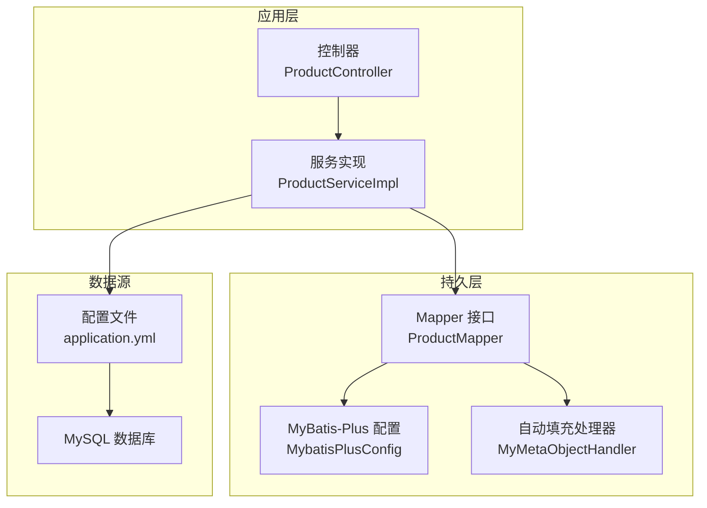
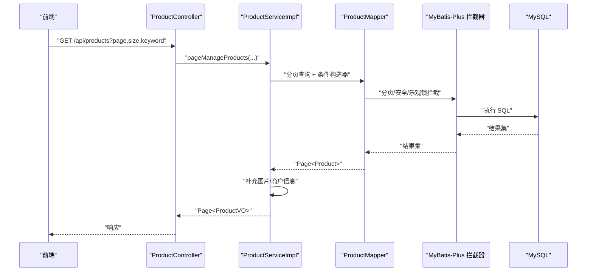
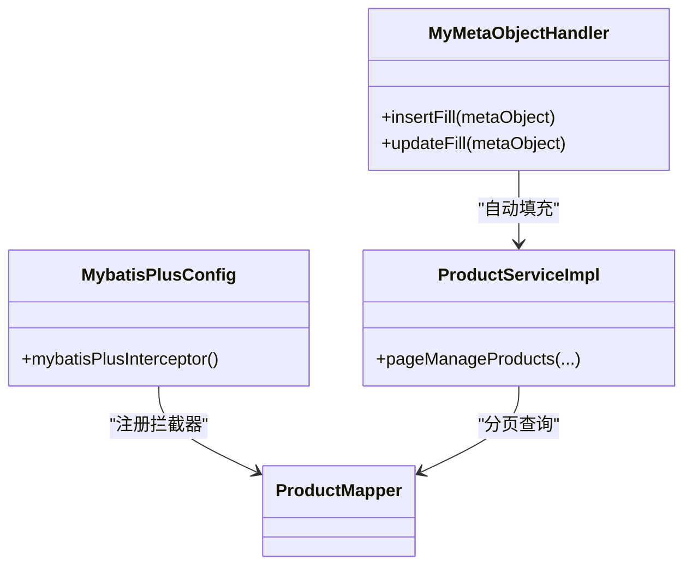
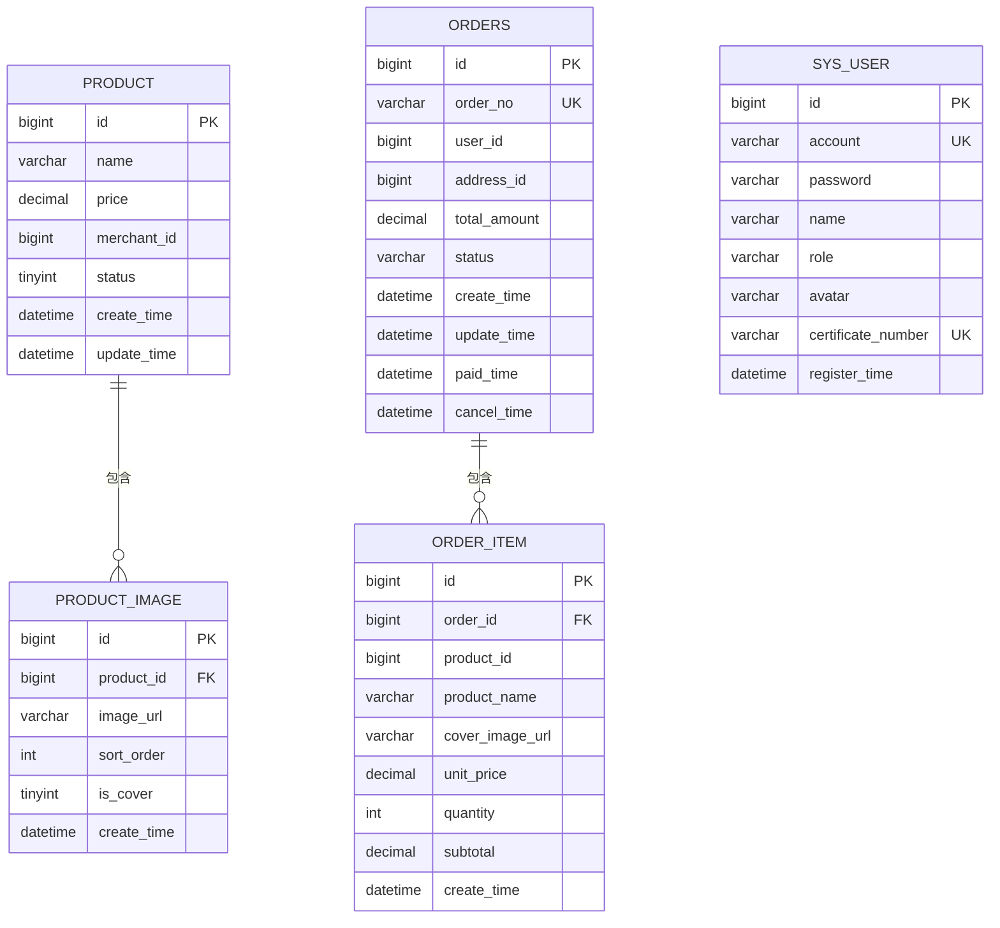
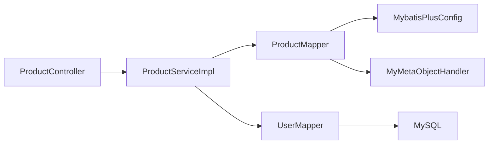

# 数据库性能优化

<cite>
**本文引用的文件**
- [MybatisPlusConfig.java](file://backend/src/main/java/com/heritage/config/MybatisPlusConfig.java)
- [MyMetaObjectHandler.java](file://backend/src/main/java/com/heritage/config/MyMetaObjectHandler.java)
- [application.yml](file://backend/src/main/resources/application.yml)
- [pom.xml](file://backend/pom.xml)
- [product.sql](file://backend/src/main/resources/sql/product.sql)
- [order.sql](file://backend/src/main/resources/sql/order.sql)
- [user.sql](file://backend/src/main/resources/sql/user.sql)
- [ProductMapper.java](file://backend/src/main/java/com/heritage/mapper/ProductMapper.java)
- [Product.java](file://backend/src/main/java/com/heritage/entity/Product.java)
- [PageQuery.java](file://backend/src/main/java/com/heritage/dto/PageQuery.java)
- [ProductServiceImpl.java](file://backend/src/main/java/com/heritage/service/impl/ProductServiceImpl.java)
- [ProductController.java](file://backend/src/main/java/com/heritage/controller/ProductController.java)
- [UserMapper.java](file://backend/src/main/java/com/heritage/mapper/UserMapper.java)
- [User.java](file://backend/src/main/java/com/heritage/entity/User.java)
</cite>

## 目录
1. [简介](#简介)
2. [项目结构与数据库相关配置概览](#项目结构与数据库相关配置概览)
3. [核心组件与性能配置](#核心组件与性能配置)
4. [架构总览与数据流](#架构总览与数据流)
5. [详细组件分析与优化建议](#详细组件分析与优化建议)
6. [依赖关系与耦合度分析](#依赖关系与耦合度分析)
7. [性能考量与优化策略](#性能考量与优化策略)
8. [故障排查与常见问题](#故障排查与常见问题)
9. [结论](#结论)
10. [附录：索引与SQL设计要点](#附录索引与sql设计要点)

## 简介
本文件面向“非遗产品智能定制商城系统”，聚焦数据库性能优化主题，结合现有代码与配置，系统性梳理并提出优化方案。内容涵盖：
- MyBatis-Plus 配置优化：分页插件、安全拦截器、乐观锁与自动填充
- 连接池与数据源优化：连接数、超时、泄漏防护
- 索引与查询优化：复合索引设计、慢查询定位与改进建议
- SQL 与批量操作优化：避免 N+1、减少随机排序、合理批量写入
- 事务配置最佳实践：隔离级别、传播行为、异常回滚策略
- 监控指标与瓶颈识别：连接池、慢查询日志、执行计划
- 集群与高可用：主从复制、只读分离、读写分离策略

## 项目结构与数据库相关配置概览
- MyBatis-Plus 拦截器与扫描路径在配置类中集中定义，启用分页、乐观锁与防全表拦截
- 自动填充通过元对象处理器统一注入创建/更新时间字段
- 数据源采用 MySQL，未见显式连接池参数配置，使用默认值
- 实体与 Mapper 基于 MyBatis-Plus 注解与接口扩展，支持分页与条件构造器
- 控制器层接收分页参数并调用服务层进行分页查询

**图表来源**
- [ProductController.java](file://backend/src/main/java/com/heritage/controller/ProductController.java#L77-L86)
- [ProductServiceImpl.java](file://backend/src/main/java/com/heritage/service/impl/ProductServiceImpl.java#L137-L165)
- [ProductMapper.java](file://backend/src/main/java/com/heritage/mapper/ProductMapper.java#L1-L11)
- [MybatisPlusConfig.java](file://backend/src/main/java/com/heritage/config/MybatisPlusConfig.java#L12-L30)
- [MyMetaObjectHandler.java](file://backend/src/main/java/com/heritage/config/MyMetaObjectHandler.java#L10-L25)
- [application.yml](file://backend/src/main/resources/application.yml#L17-L22)

**章节来源**
- [MybatisPlusConfig.java](file://backend/src/main/java/com/heritage/config/MybatisPlusConfig.java#L12-L30)
- [MyMetaObjectHandler.java](file://backend/src/main/java/com/heritage/config/MyMetaObjectHandler.java#L10-L25)
- [application.yml](file://backend/src/main/resources/application.yml#L17-L22)
- [ProductController.java](file://backend/src/main/java/com/heritage/controller/ProductController.java#L77-L86)
- [ProductServiceImpl.java](file://backend/src/main/java/com/heritage/service/impl/ProductServiceImpl.java#L137-L165)

## 核心组件与性能配置
- 分页插件
  - 已启用 MySQL 分页拦截器，并限制最大每页条数，防止超大分页导致资源消耗
  - 建议：结合业务场景评估最大分页上限，避免极端请求影响数据库
- 安全拦截器
  - 启用防全表更新/删除拦截器，降低误操作风险
- 乐观锁
  - 启用乐观锁拦截器，配合版本号字段使用，提升并发一致性
- 自动填充
  - 统一注入创建/更新时间字段，减少重复代码与遗漏
- 数据源与连接池
  - 当前未显式配置连接池参数，使用默认值；建议根据 QPS 与线程模型调优
- 事务与批量
  - 服务层多处使用事务注解，需关注批量写入与 N+1 查询的优化

**章节来源**
- [MybatisPlusConfig.java](file://backend/src/main/java/com/heritage/config/MybatisPlusConfig.java#L16-L29)
- [MyMetaObjectHandler.java](file://backend/src/main/java/com/heritage/config/MyMetaObjectHandler.java#L14-L24)
- [application.yml](file://backend/src/main/resources/application.yml#L17-L22)
- [ProductServiceImpl.java](file://backend/src/main/java/com/heritage/service/impl/ProductServiceImpl.java#L37-L105)

## 架构总览与数据流
下图展示从前端到数据库的关键调用链路与性能相关节点。

**图表来源**
- [ProductController.java](file://backend/src/main/java/com/heritage/controller/ProductController.java#L77-L86)
- [ProductServiceImpl.java](file://backend/src/main/java/com/heritage/service/impl/ProductServiceImpl.java#L137-L165)
- [ProductMapper.java](file://backend/src/main/java/com/heritage/mapper/ProductMapper.java#L1-L11)
- [MybatisPlusConfig.java](file://backend/src/main/java/com/heritage/config/MybatisPlusConfig.java#L16-L29)

## 详细组件分析与优化建议

### MyBatis-Plus 配置优化
- 分页插件
  - 已限制最大分页条数，建议在 DTO 中对 size 做边界校验，避免客户端传入过大值
- 安全拦截器
  - 防止全表更新/删除，建议在生产环境保持开启
- 乐观锁
  - 建议在实体中增加版本号字段并在更新时使用，避免并发覆盖
- 自动填充
  - 建议统一使用注解或处理器，确保所有实体遵循一致的时间字段命名与填充策略

**图表来源**
- [MybatisPlusConfig.java](file://backend/src/main/java/com/heritage/config/MybatisPlusConfig.java#L16-L29)
- [MyMetaObjectHandler.java](file://backend/src/main/java/com/heritage/config/MyMetaObjectHandler.java#L14-L24)
- [ProductServiceImpl.java](file://backend/src/main/java/com/heritage/service/impl/ProductServiceImpl.java#L137-L165)
- [ProductMapper.java](file://backend/src/main/java/com/heritage/mapper/ProductMapper.java#L1-L11)

**章节来源**
- [MybatisPlusConfig.java](file://backend/src/main/java/com/heritage/config/MybatisPlusConfig.java#L16-L29)
- [MyMetaObjectHandler.java](file://backend/src/main/java/com/heritage/config/MyMetaObjectHandler.java#L14-L24)
- [ProductServiceImpl.java](file://backend/src/main/java/com/heritage/service/impl/ProductServiceImpl.java#L137-L165)

### 数据库连接池优化策略
- 当前未显式配置连接池参数，使用默认值
- 建议在配置文件中明确设置以下参数（示例项，按实际压测调整）
  - 最小空闲连接、最大活跃连接、最大等待时间、连接超时、空闲回收周期
- 超时设置
  - 连接超时、命令超时、事务超时，避免长时间占用连接
- 连接泄漏防护
  - 使用连接池健康检查、定期回收空闲连接、严格关闭资源
- 连接池选型
  - 推荐 HikariCP 或 Druid，具备更好的性能与可观测性

**章节来源**
- [application.yml](file://backend/src/main/resources/application.yml#L17-L22)

### 索引优化策略
- 复合索引设计
  - 订单表：用户+状态、用户+地址等组合查询频繁，建议保留现有复合索引
  - 商品表：按商户与状态过滤，建议维持现有索引；如存在按名称模糊查询，考虑建立合适前缀索引或全文索引
  - 用户表：按角色、账号、实名号等维度查询，建议保留现有索引
- 查询性能分析
  - 使用 EXPLAIN 分析慢查询，确认是否命中索引、是否存在回表、是否使用临时表
- 慢查询优化
  - 避免 SELECT *，仅返回必要列
  - 将 ORDER BY RAND() 改为基于索引的随机取样策略
  - 对 LIKE '%keyword%' 的反向匹配改为前缀匹配或搜索引擎

**图表来源**
- [product.sql](file://backend/src/main/resources/sql/product.sql#L1-L45)
- [order.sql](file://backend/src/main/resources/sql/order.sql#L4-L39)
- [user.sql](file://backend/src/main/resources/sql/user.sql#L7-L41)

**章节来源**
- [product.sql](file://backend/src/main/resources/sql/product.sql#L14-L16)
- [order.sql](file://backend/src/main/resources/sql/order.sql#L21-L24)
- [user.sql](file://backend/src/main/resources/sql/user.sql#L17-L19)

### SQL 查询优化技巧
- 避免 N+1 查询
  - 在服务层一次性加载关联数据，使用 in 批量查询并按主键聚合
- 减少随机排序
  - 将 ORDER BY RAND() 替换为基于索引的随机采样策略（如先查主键范围再回表）
- 合理使用分页
  - 结合业务限制最大页大小，避免深分页导致的扫描成本
- 条件过滤
  - 将高频过滤条件置于 WHERE 前部，尽量使用等值匹配与范围查询

**章节来源**
- [ProductServiceImpl.java](file://backend/src/main/java/com/heritage/service/impl/ProductServiceImpl.java#L352-L400)
- [ProductServiceImpl.java](file://backend/src/main/java/com/heritage/service/impl/ProductServiceImpl.java#L414-L421)

### 批量操作优化
- 批量插入/更新
  - 使用 JDBC 批处理或 MyBatis 批处理工具，减少网络往返
- 关联批量
  - 先查主表 ID 列表，再批量写入子表，避免逐条循环
- 事务边界
  - 将批量操作包裹在单个事务中，失败回滚，保证一致性

**章节来源**
- [ProductServiceImpl.java](file://backend/src/main/java/com/heritage/service/impl/ProductServiceImpl.java#L206-L249)

### 事务配置最佳实践
- 传播行为
  - 默认 REQUIRED，确保同一事务内的一致性
- 隔离级别
  - READ_COMMITTED 或 REPEATABLE_READ，平衡一致性与并发
- 异常回滚
  - 明确声明运行时异常触发回滚，避免受检异常导致的隐式提交
- 长事务
  - 缩短事务时间，避免持有锁过久

**章节来源**
- [ProductServiceImpl.java](file://backend/src/main/java/com/heritage/service/impl/ProductServiceImpl.java#L37-L105)

### 数据库监控指标与瓶颈识别
- 连接池指标
  - 活跃连接数、空闲连接数、等待队列长度、拒绝次数
- SQL 指标
  - 慢查询数量、平均执行时间、最大执行时间、回表率
- 瓶颈识别
  - 通过慢查询日志与 EXPLAIN 分析热点 SQL，定位索引缺失与全表扫描
- 压测建议
  - 使用数据库压测工具模拟峰值流量，观察连接池与磁盘 IO、CPU 占用

**章节来源**
- [application.yml](file://backend/src/main/resources/application.yml#L17-L22)

### 数据库集群配置方案
- 主从复制
  - 读写分离：写库承担写入，读库承担查询；热点表可独立从库
- 只读实例
  - 将报表、搜索、分页查询路由至只读实例
- 分库分表
  - 按用户/订单维度拆分，降低单表规模与锁竞争
- 高可用
  - 集群部署、自动切换、备份策略与恢复演练

[本节为通用方案说明，无需具体文件引用]

## 依赖关系与耦合度分析
- 组件耦合
  - 控制器依赖服务，服务依赖 Mapper，Mapper 依赖 MyBatis-Plus 拦截器与自动填充处理器
- 外部依赖
  - Spring Boot Starter、MyBatis-Plus、MySQL Connector、Redis（缓存）

**图表来源**
- [ProductController.java](file://backend/src/main/java/com/heritage/controller/ProductController.java#L77-L86)
- [ProductServiceImpl.java](file://backend/src/main/java/com/heritage/service/impl/ProductServiceImpl.java#L34-L36)
- [ProductMapper.java](file://backend/src/main/java/com/heritage/mapper/ProductMapper.java#L1-L11)
- [MybatisPlusConfig.java](file://backend/src/main/java/com/heritage/config/MybatisPlusConfig.java#L16-L29)
- [MyMetaObjectHandler.java](file://backend/src/main/java/com/heritage/config/MyMetaObjectHandler.java#L14-L24)
- [UserMapper.java](file://backend/src/main/java/com/heritage/mapper/UserMapper.java#L12-L26)

**章节来源**
- [ProductController.java](file://backend/src/main/java/com/heritage/controller/ProductController.java#L77-L86)
- [ProductServiceImpl.java](file://backend/src/main/java/com/heritage/service/impl/ProductServiceImpl.java#L34-L36)
- [ProductMapper.java](file://backend/src/main/java/com/heritage/mapper/ProductMapper.java#L1-L11)
- [UserMapper.java](file://backend/src/main/java/com/heritage/mapper/UserMapper.java#L12-L26)

## 性能考量与优化策略
- 分页与排序
  - 控制分页大小，避免深度分页；对排序字段建立合适索引
- 随机查询
  - 替代 ORDER BY RAND()，采用基于索引的随机采样
- 批量写入
  - 合理批大小，避免单次事务过大
- 事务与锁
  - 缩短事务时间，避免长事务与行级锁竞争
- 缓存与降级
  - 热点数据引入 Redis 缓存，异常时提供降级策略

[本节提供通用指导，无需具体文件引用]

## 故障排查与常见问题
- 分页异常或超大页
  - 检查分页拦截器的最大限制与 DTO 参数校验
- 更新失败或并发冲突
  - 检查乐观锁版本号字段与并发更新策略
- 自动填充字段为空
  - 确认实体字段映射与自动填充处理器生效
- 连接池耗尽
  - 检查最大连接数、超时与泄漏情况，必要时启用健康检查与回收策略

**章节来源**
- [MybatisPlusConfig.java](file://backend/src/main/java/com/heritage/config/MybatisPlusConfig.java#L20-L22)
- [MyMetaObjectHandler.java](file://backend/src/main/java/com/heritage/config/MyMetaObjectHandler.java#L14-L24)
- [application.yml](file://backend/src/main/resources/application.yml#L17-L22)

## 结论
本项目已具备基础的 MyBatis-Plus 分页、安全与乐观锁能力，并通过自动填充统一时间字段。为进一步提升数据库性能，建议：
- 明确连接池参数并进行压测调优
- 针对热点表与查询模式完善索引设计
- 优化随机查询与批量写入策略
- 建立完善的监控与慢查询治理机制
- 规划读写分离与分库分表方案，支撑业务增长

[本节为总结性内容，无需具体文件引用]

## 附录：索引与SQL设计要点
- 商品表
  - 常用过滤：merchant_id、status；常用排序：create_time
  - 建议：保持现有索引；如需模糊搜索名称，评估前缀索引或搜索引擎
- 订单表
  - 常用过滤：user_id、status、user_id+address_id
  - 建议：保留现有复合索引；避免 SELECT *，仅取必要列
- 用户表
  - 常用过滤：role、account、certificate_number
  - 建议：保持现有索引；注意密码字段不参与查询索引

**章节来源**
- [product.sql](file://backend/src/main/resources/sql/product.sql#L14-L16)
- [order.sql](file://backend/src/main/resources/sql/order.sql#L21-L24)
- [user.sql](file://backend/src/main/resources/sql/user.sql#L17-L19)