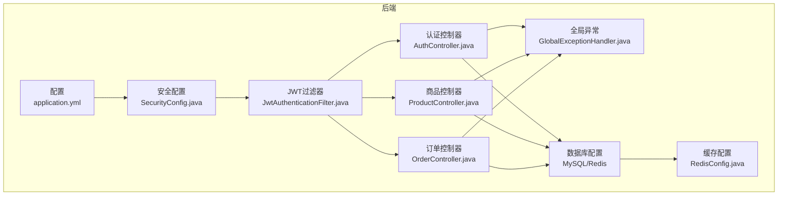
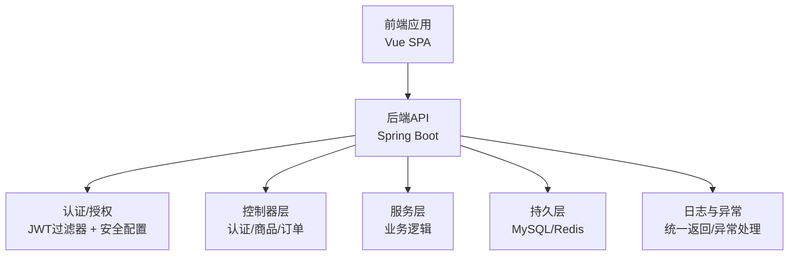
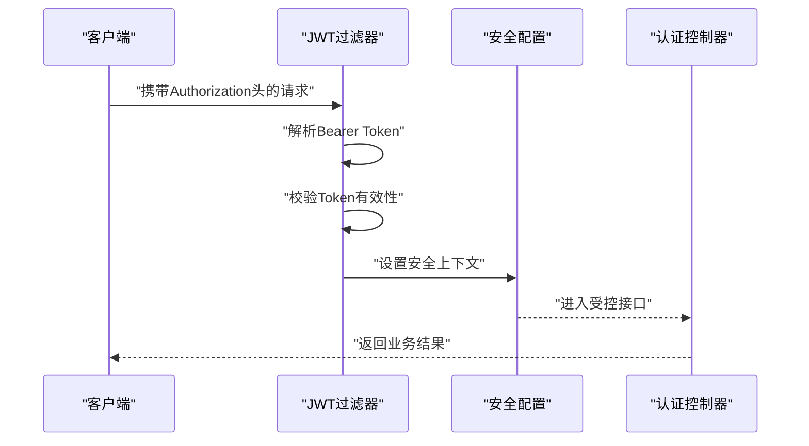
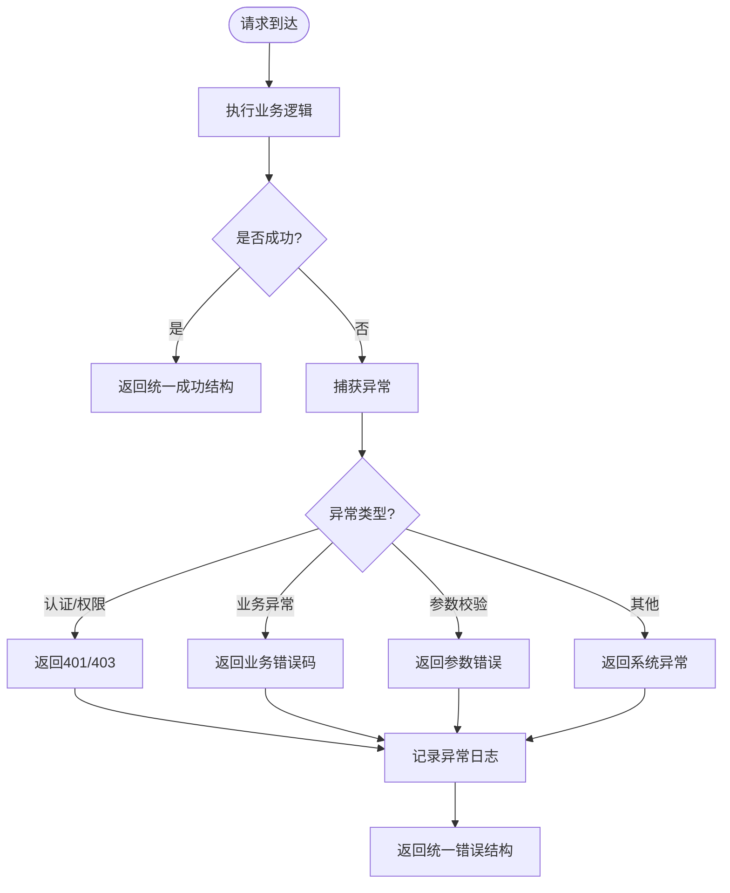
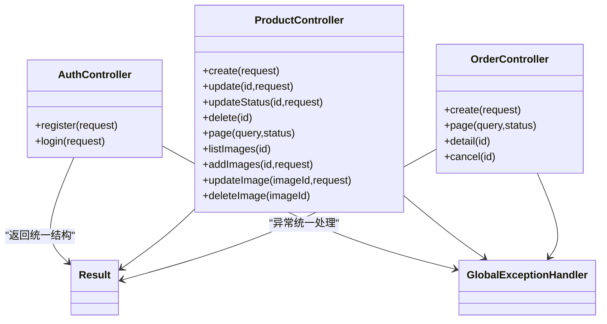
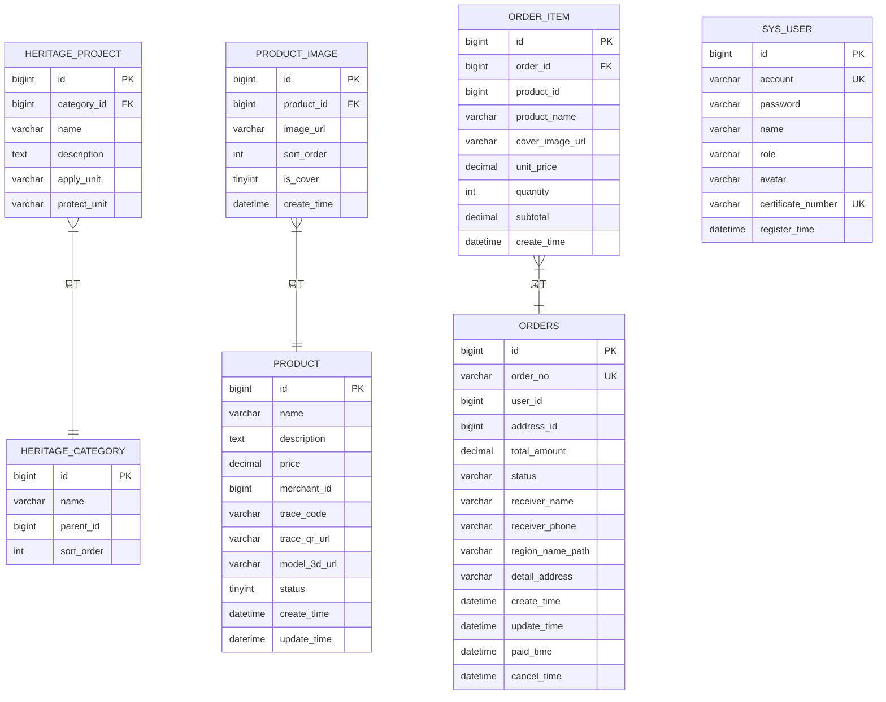
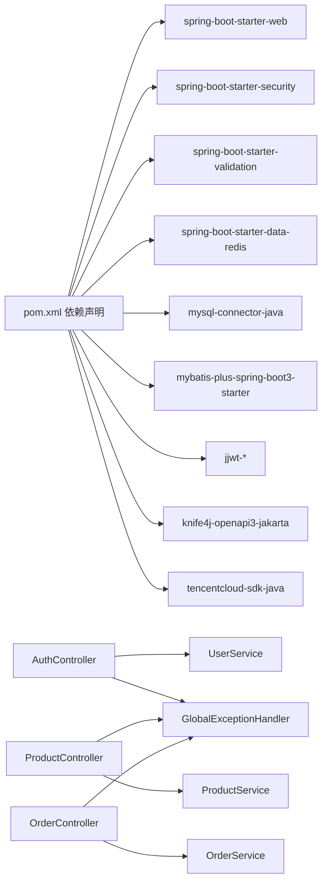

# 系统监控与指标

<cite>
**本文引用的文件**
- [application.yml](file://backend/src/main/resources/application.yml)
- [pom.xml](file://backend/pom.xml)
- [SecurityConfig.java](file://backend/src/main/java/com/heritage/config/SecurityConfig.java)
- [RedisConfig.java](file://backend/src/main/java/com/heritage/config/RedisConfig.java)
- [JwtAuthenticationFilter.java](file://backend/src/main/java/com/heritage/security/JwtAuthenticationFilter.java)
- [GlobalExceptionHandler.java](file://backend/src/main/java/com/heritage/common/GlobalExceptionHandler.java)
- [Result.java](file://backend/src/main/java/com/heritage/common/Result.java)
- [AuthController.java](file://backend/src/main/java/com/heritage/controller/AuthController.java)
- [ProductController.java](file://backend/src/main/java/com/heritage/controller/ProductController.java)
- [OrderController.java](file://backend/src/main/java/com/heritage/controller/OrderController.java)
- [heritage.sql](file://backend/src/main/resources/sql/heritage.sql)
- [product.sql](file://backend/src/main/resources/sql/product.sql)
- [order.sql](file://backend/src/main/resources/sql/order.sql)
- [user.sql](file://backend/src/main/resources/sql/user.sql)
</cite>

## 目录
1. [简介](#简介)
2. [项目结构](#项目结构)
3. [核心组件](#核心组件)
4. [架构总览](#架构总览)
5. [详细组件分析](#详细组件分析)
6. [依赖关系分析](#依赖关系分析)
7. [性能考虑](#性能考虑)
8. [故障排查指南](#故障排查指南)
9. [结论](#结论)
10. [附录](#附录)

## 简介
本文件面向“非遗产品智能定制商城系统”，围绕系统监控与指标进行系统化设计与落地建议，覆盖关键性能指标（KPI）、健康检查、日志与异常追踪、性能基准与容量规划、分布式链路追踪与APM集成、以及安全与合规审计指标。文档基于现有代码与配置进行分析，并提供可操作的实施建议。

## 项目结构
后端采用Spring Boot工程，主要模块包括：
- 配置层：应用配置、安全配置、缓存配置
- 控制器层：认证、商品、订单等业务接口
- 异常处理层：全局异常统一返回
- 数据层：MySQL与Redis配置及实体映射
- 前端：Vue单页应用，提供用户界面与交互

图表来源
- [application.yml](file://backend/src/main/resources/application.yml#L1-L63)
- [SecurityConfig.java](file://backend/src/main/java/com/heritage/config/SecurityConfig.java#L1-L67)
- [JwtAuthenticationFilter.java](file://backend/src/main/java/com/heritage/security/JwtAuthenticationFilter.java#L1-L72)
- [AuthController.java](file://backend/src/main/java/com/heritage/controller/AuthController.java#L1-L48)
- [ProductController.java](file://backend/src/main/java/com/heritage/controller/ProductController.java#L1-L130)
- [OrderController.java](file://backend/src/main/java/com/heritage/controller/OrderController.java#L1-L67)
- [GlobalExceptionHandler.java](file://backend/src/main/java/com/heritage/common/GlobalExceptionHandler.java#L1-L62)
- [RedisConfig.java](file://backend/src/main/java/com/heritage/config/RedisConfig.java#L1-L46)

章节来源
- [application.yml](file://backend/src/main/resources/application.yml#L1-L63)
- [pom.xml](file://backend/pom.xml#L1-L129)

## 核心组件
- 应用配置与外部依赖
  - 数据源与Redis连接、文件上传路径、Knife4j文档、JWT参数等集中于配置文件中，便于统一治理与环境切换。
- 安全与认证
  - 基于JWT的无状态认证，通过过滤器在每次请求时解析与验证令牌，设置安全上下文。
- 全局异常处理
  - 统一返回结构与错误码，便于前端展示与监控侧采集。
- 控制器层
  - 认证、商品、订单等接口均返回统一结果对象，便于埋点与指标统计。

章节来源
- [application.yml](file://backend/src/main/resources/application.yml#L1-L63)
- [SecurityConfig.java](file://backend/src/main/java/com/heritage/config/SecurityConfig.java#L1-L67)
- [JwtAuthenticationFilter.java](file://backend/src/main/java/com/heritage/security/JwtAuthenticationFilter.java#L1-L72)
- [GlobalExceptionHandler.java](file://backend/src/main/java/com/heritage/common/GlobalExceptionHandler.java#L1-L62)
- [Result.java](file://backend/src/main/java/com/heritage/common/Result.java#L1-L44)
- [AuthController.java](file://backend/src/main/java/com/heritage/controller/AuthController.java#L1-L48)
- [ProductController.java](file://backend/src/main/java/com/heritage/controller/ProductController.java#L1-L130)
- [OrderController.java](file://backend/src/main/java/com/heritage/controller/OrderController.java#L1-L67)

## 架构总览
系统采用前后端分离架构，后端提供REST接口，前端通过Axios发起HTTP请求；认证通过JWT实现，控制器层负责业务编排，异常层统一输出，数据层通过MySQL与Redis支撑。

图表来源
- [SecurityConfig.java](file://backend/src/main/java/com/heritage/config/SecurityConfig.java#L1-L67)
- [JwtAuthenticationFilter.java](file://backend/src/main/java/com/heritage/security/JwtAuthenticationFilter.java#L1-L72)
- [AuthController.java](file://backend/src/main/java/com/heritage/controller/AuthController.java#L1-L48)
- [ProductController.java](file://backend/src/main/java/com/heritage/controller/ProductController.java#L1-L130)
- [OrderController.java](file://backend/src/main/java/com/heritage/controller/OrderController.java#L1-L67)
- [GlobalExceptionHandler.java](file://backend/src/main/java/com/heritage/common/GlobalExceptionHandler.java#L1-L62)

## 详细组件分析

### 认证与安全过滤链
- 过滤器职责：解析Authorization头中的Bearer Token，提取用户名并校验有效性，注入安全上下文供后续鉴权与业务使用。
- 安全配置：禁用CSRF，会话策略为STATELESS，开放部分公开接口，其余需认证。

图表来源
- [JwtAuthenticationFilter.java](file://backend/src/main/java/com/heritage/security/JwtAuthenticationFilter.java#L1-L72)
- [SecurityConfig.java](file://backend/src/main/java/com/heritage/config/SecurityConfig.java#L1-L67)
- [AuthController.java](file://backend/src/main/java/com/heritage/controller/AuthController.java#L1-L48)

章节来源
- [JwtAuthenticationFilter.java](file://backend/src/main/java/com/heritage/security/JwtAuthenticationFilter.java#L1-L72)
- [SecurityConfig.java](file://backend/src/main/java/com/heritage/config/SecurityConfig.java#L1-L67)

### 全局异常处理与统一返回
- 统一返回结构：包含code、message、data，便于监控侧采集与前端展示。
- 异常分类：认证、权限、业务、参数校验等异常分别处理并记录日志。

图表来源
- [GlobalExceptionHandler.java](file://backend/src/main/java/com/heritage/common/GlobalExceptionHandler.java#L1-L62)
- [Result.java](file://backend/src/main/java/com/heritage/common/Result.java#L1-L44)

章节来源
- [GlobalExceptionHandler.java](file://backend/src/main/java/com/heritage/common/GlobalExceptionHandler.java#L1-L62)
- [Result.java](file://backend/src/main/java/com/heritage/common/Result.java#L1-L44)

### 控制器层与业务接口
- 认证接口：注册、登录生成JWT。
- 商品接口：新增、更新、上下架、删除、分页、图片管理等。
- 订单接口：创建、分页、详情、取消。

图表来源
- [AuthController.java](file://backend/src/main/java/com/heritage/controller/AuthController.java#L1-L48)
- [ProductController.java](file://backend/src/main/java/com/heritage/controller/ProductController.java#L1-L130)
- [OrderController.java](file://backend/src/main/java/com/heritage/controller/OrderController.java#L1-L67)
- [GlobalExceptionHandler.java](file://backend/src/main/java/com/heritage/common/GlobalExceptionHandler.java#L1-L62)
- [Result.java](file://backend/src/main/java/com/heritage/common/Result.java#L1-L44)

章节来源
- [AuthController.java](file://backend/src/main/java/com/heritage/controller/AuthController.java#L1-L48)
- [ProductController.java](file://backend/src/main/java/com/heritage/controller/ProductController.java#L1-L130)
- [OrderController.java](file://backend/src/main/java/com/heritage/controller/OrderController.java#L1-L67)

### 缓存与数据存储
- Redis配置：启用缓存注解，定义JSON序列化策略，支持对象缓存。
- MySQL表结构：包含非遗项目、商品、订单、用户等核心业务表，具备必要的索引与约束。

图表来源
- [heritage.sql](file://backend/src/main/resources/sql/heritage.sql#L1-L88)
- [product.sql](file://backend/src/main/resources/sql/product.sql#L1-L45)
- [order.sql](file://backend/src/main/resources/sql/order.sql#L1-L39)
- [user.sql](file://backend/src/main/resources/sql/user.sql#L1-L45)

章节来源
- [RedisConfig.java](file://backend/src/main/java/com/heritage/config/RedisConfig.java#L1-L46)
- [heritage.sql](file://backend/src/main/resources/sql/heritage.sql#L1-L88)
- [product.sql](file://backend/src/main/resources/sql/product.sql#L1-L45)
- [order.sql](file://backend/src/main/resources/sql/order.sql#L1-L39)
- [user.sql](file://backend/src/main/resources/sql/user.sql#L1-L45)

## 依赖关系分析
- 外部依赖：Spring Web、Security、Validation、Redis、MySQL驱动、MyBatis-Plus、JWT、Knife4j、腾讯云SDK等。
- 内部依赖：控制器依赖服务层，服务层依赖Mapper与实体；全局异常处理贯穿各控制器。

图表来源
- [pom.xml](file://backend/pom.xml#L1-L129)
- [AuthController.java](file://backend/src/main/java/com/heritage/controller/AuthController.java#L1-L48)
- [ProductController.java](file://backend/src/main/java/com/heritage/controller/ProductController.java#L1-L130)
- [OrderController.java](file://backend/src/main/java/com/heritage/controller/OrderController.java#L1-L67)
- [GlobalExceptionHandler.java](file://backend/src/main/java/com/heritage/common/GlobalExceptionHandler.java#L1-L62)

章节来源
- [pom.xml](file://backend/pom.xml#L1-L129)

## 性能考虑
- 响应时间
  - 指标：P50/P90/P95响应时间、慢查询阈值告警。
  - 建议：对热点接口（如商品列表、订单分页）增加Redis缓存；数据库查询添加必要索引；控制单次请求数据量。
- 吞吐量
  - 指标：每秒请求数（QPS）、并发连接数、线程池队列长度。
  - 建议：合理设置Tomcat线程池与连接超时；对高并发接口做异步化与限流。
- 错误率
  - 指标：HTTP 4xx/5xx占比、业务异常占比、认证/权限异常占比。
  - 建议：结合统一异常返回结构进行分类统计；对高频错误建立根因分析。
- 资源利用率
  - 指标：CPU使用率、内存占用、堆外内存、GC频率、Redis命中率、数据库连接池使用率。
  - 建议：定期压测评估峰值承载能力；对慢查询与缓存失效进行专项优化。

[本节为通用性能建议，不直接分析具体文件]

## 故障排查指南
- 认证失败
  - 现象：返回401/403或提示未登录/权限不足。
  - 排查：确认Authorization头格式、Token有效期、用户是否存在、权限是否匹配。
- 参数校验失败
  - 现象：返回参数错误。
  - 排查：检查请求体字段、必填项、格式与范围。
- 业务异常
  - 现象：返回业务错误码。
  - 排查：查看业务逻辑分支与数据库约束冲突。
- 系统异常
  - 现象：返回系统异常。
  - 排查：查看异常堆栈日志，定位具体调用链。

章节来源
- [GlobalExceptionHandler.java](file://backend/src/main/java/com/heritage/common/GlobalExceptionHandler.java#L1-L62)
- [JwtAuthenticationFilter.java](file://backend/src/main/java/com/heritage/security/JwtAuthenticationFilter.java#L1-L72)

## 结论
本系统具备清晰的认证与异常处理机制，控制器层统一返回结构便于监控侧采集。建议在现有基础上完善链路追踪与APM集成、日志标准化与聚合、性能基线与容量规划，并建立健康检查与告警闭环，以保障系统在高并发场景下的稳定性与可观测性。

[本节为总结性内容，不直接分析具体文件]

## 附录

### 关键性能指标（KPI）设计建议
- 响应时间
  - 指标：接口P50/P90/P95；数据库查询P95；缓存命中率。
  - 来源：控制器层接口与数据库访问路径。
- 吞吐量
  - 指标：QPS、并发用户数、数据库连接池使用率。
  - 来源：应用服务器与数据库连接池配置。
- 错误率
  - 指标：HTTP 4xx/5xx、业务异常、认证/权限异常。
  - 来源：统一异常处理与控制器返回结构。
- 资源利用率
  - 指标：CPU、内存、Redis命中率、GC频率。
  - 来源：JVM与Redis配置与监控。

章节来源
- [application.yml](file://backend/src/main/resources/application.yml#L1-L63)
- [RedisConfig.java](file://backend/src/main/java/com/heritage/config/RedisConfig.java#L1-L46)
- [GlobalExceptionHandler.java](file://backend/src/main/java/com/heritage/common/GlobalExceptionHandler.java#L1-L62)

### 系统健康检查机制
- 服务可用性检测
  - 健康端点：/actuator/health（若引入Actuator）。
  - 自检：定时任务检查数据库连通性、Redis连通性、关键依赖服务可达性。
- 依赖服务监控
  - 数据库：连接池健康、慢查询、锁等待。
  - Redis：连接数、命令耗时、内存使用、键空间过期。
  - 文件存储：上传目录可用空间、访问权限。
- 故障告警配置
  - 告警维度：错误率阈值、响应时间阈值、资源使用率阈值、依赖不可用时长。
  - 通知渠道：邮件/IM/电话分级告警。

[本节为通用机制建议，不直接分析具体文件]

### 日志收集与分析策略
- 结构化日志格式
  - 字段：trace_id、span_id、timestamp、level、service、module、method、uri、cost_ms、code、msg、stack。
  - 输出：统一输出到标准输出，由Agent采集至日志平台。
- 日志聚合
  - 平台：ELK/EFK或云日志服务。
  - 分析：异常TopN、慢请求TopN、接口成功率趋势、用户行为画像。
- 异常追踪
  - 串联：trace_id贯穿请求全链路，定位异常发生位置与调用栈。

[本节为通用策略建议，不直接分析具体文件]

### 性能基准测试与容量规划
- 基准测试
  - 工具：JMeter/Locust/K6。
  - 场景：登录、商品浏览、下单、支付（模拟）。
  - 指标：TPS、P95响应时间、错误率、资源占用。
- 负载测试
  - 渐进式加压：从基线到峰值，观察系统拐点与恢复时间。
  - 突发流量：模拟促销活动，评估弹性与降级策略。
- 容量规划
  - 依据：峰值QPS、平均响应时间、资源上限、SLA目标。
  - 方案：水平扩展、缓存优化、数据库读写分离、CDN加速。

[本节为通用方法建议，不直接分析具体文件]

### 分布式链路追踪与APM集成
- 链路追踪
  - 标准：OpenTelemetry或Zipkin/SkyWalking。
  - 埋点：HTTP客户端/服务端、数据库、Redis、消息队列（如有）。
- APM工具
  - 选择：SkyWalking、Pinpoint、New Relic、云厂商APM。
  - 功能：调用链、事务分析、错误分析、资源监控、告警联动。

[本节为通用集成建议，不直接分析具体文件]

### 监控仪表板设计
- 仪表板分层
  - 基础设施：CPU、内存、磁盘、网络、连接数。
  - 应用层：QPS、响应时间、错误率、业务指标（订单量、GMV）。
  - 业务层：转化漏斗、用户活跃度、商品热度、支付成功率。
- 可视化建议
  - 实时看板：近15分钟滚动窗口。
  - 历史对比：同比/环比、周同比/月同比。
  - 预警面板：告警列表、处置建议、责任人。

[本节为通用设计建议，不直接分析具体文件]

### 安全事件监控与合规性审计
- 安全事件监控
  - 指标：异常登录、暴力破解尝试、越权访问、敏感接口高频调用。
  - 行为：登录失败次数、IP封禁、二次验证触发。
- 合规性审计
  - 审计范围：用户注册/登录、订单创建/取消、商品上下架、权限变更。
  - 存储：审计日志保留周期、只读归档、访问授权。
  - 报告：合规报告模板、监管报送口径。

[本节为通用合规建议，不直接分析具体文件]