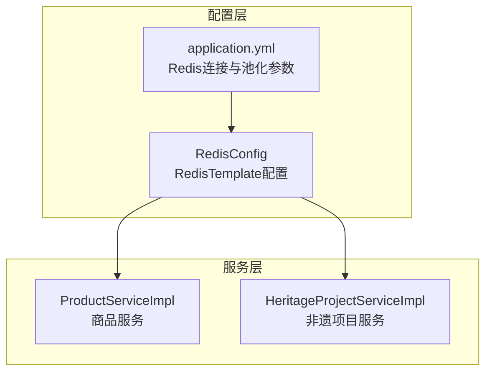
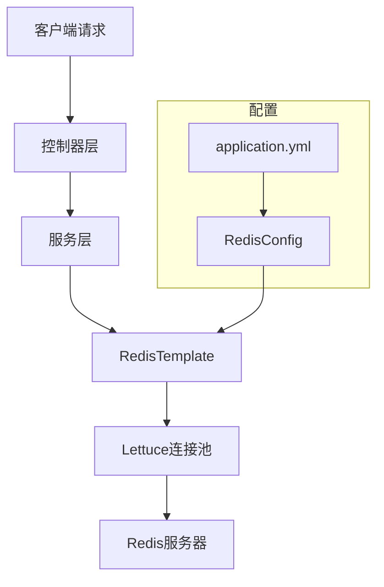
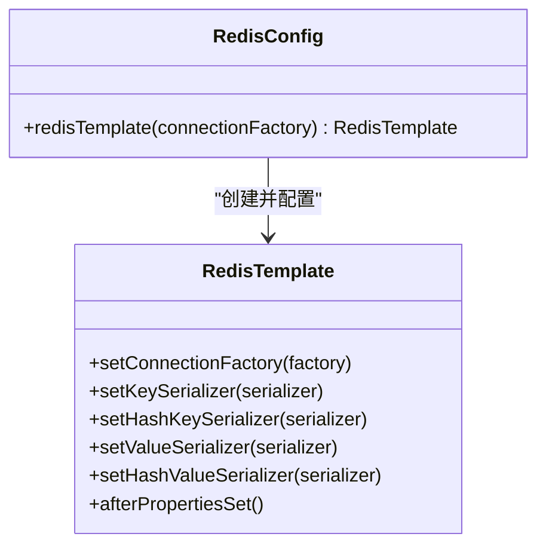
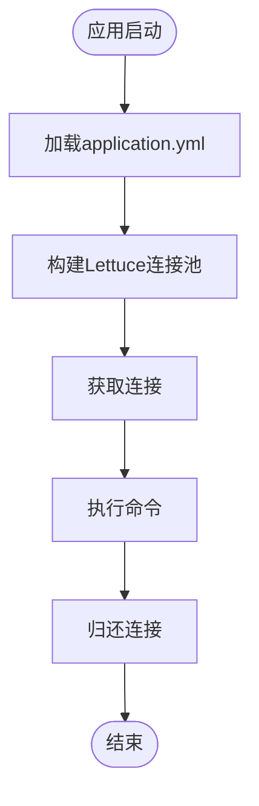
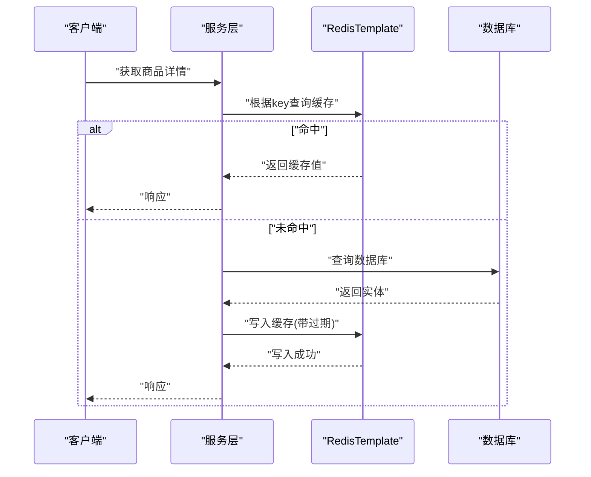
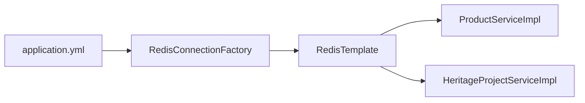

# 缓存策略设计

<cite>
**本文引用的文件**
- [RedisConfig.java](file://backend/src/main/java/com/heritage/config/RedisConfig.java)
- [application.yml](file://backend/src/main/resources/application.yml)
- [ProductServiceImpl.java](file://backend/src/main/java/com/heritage/service/impl/ProductServiceImpl.java)
- [HeritageProjectServiceImpl.java](file://backend/src/main/java/com/heritage/service/impl/HeritageProjectServiceImpl.java)
</cite>

## 目录
1. [引言](#引言)
2. [项目结构](#项目结构)
3. [核心组件](#核心组件)
4. [架构总览](#架构总览)
5. [详细组件分析](#详细组件分析)
6. [依赖关系分析](#依赖关系分析)
7. [性能考量](#性能考量)
8. [故障排查指南](#故障排查指南)
9. [结论](#结论)
10. [附录](#附录)

## 引言
本设计文档面向“非遗产品智能定制商城系统”，围绕Redis缓存策略进行系统化设计与落地说明。内容涵盖Redis配置实现（RedisTemplate、序列化器、连接工厂）、缓存键策略设计（命名规范、键空间管理、前缀策略）、缓存失效机制（过期时间、更新策略、穿透防护）、命中率优化与内存监控、缓存集群配置建议，并结合现有代码示例展示在服务层如何使用缓存注解与手动缓存操作。

## 项目结构
系统采用Spring Boot工程，后端位于backend目录，Redis相关配置集中在配置类中，应用配置位于application.yml中。服务层通过RedisTemplate进行缓存读写。

图表来源
- [RedisConfig.java](file://backend/src/main/java/com/heritage/config/RedisConfig.java#L16-L45)
- [application.yml](file://backend/src/main/resources/application.yml#L23-L35)
- [ProductServiceImpl.java](file://backend/src/main/java/com/heritage/service/impl/ProductServiceImpl.java#L30-L32)
- [HeritageProjectServiceImpl.java](file://backend/src/main/java/com/heritage/service/impl/HeritageProjectServiceImpl.java#L43-L45)

章节来源
- [RedisConfig.java](file://backend/src/main/java/com/heritage/config/RedisConfig.java#L16-L45)
- [application.yml](file://backend/src/main/resources/application.yml#L23-L35)

## 核心组件
- RedisTemplate配置：定义键/值序列化策略，启用@EnableCaching以支持注解式缓存。
- 连接与池化：通过application.yml配置host/port/database/timeout及Lettuce连接池参数。
- 服务层缓存实践：结合业务场景选择注解式缓存或手动缓存操作。

章节来源
- [RedisConfig.java](file://backend/src/main/java/com/heritage/config/RedisConfig.java#L16-L45)
- [application.yml](file://backend/src/main/resources/application.yml#L23-L35)

## 架构总览
下图展示了Redis在系统中的位置与交互关系，以及服务层对RedisTemplate的依赖。

图表来源
- [RedisConfig.java](file://backend/src/main/java/com/heritage/config/RedisConfig.java#L20-L44)
- [application.yml](file://backend/src/main/resources/application.yml#L23-L35)

## 详细组件分析

### Redis配置实现
- RedisTemplate Bean：设置连接工厂、键/哈希键/值/哈希值序列化器，完成afterPropertiesSet后返回模板实例。
- 序列化器选择：
  - 键/哈希键：StringRedisSerializer，保证键可读且兼容性好。
  - 值/哈希值：Jackson2JsonRedisSerializer，开启默认类型信息，确保对象序列化与反序列化正确。
- 启用缓存：@EnableCaching，为后续使用缓存注解提供基础。

图表来源
- [RedisConfig.java](file://backend/src/main/java/com/heritage/config/RedisConfig.java#L20-L44)

章节来源
- [RedisConfig.java](file://backend/src/main/java/com/heritage/config/RedisConfig.java#L16-L45)

### 连接工厂与连接池配置
- 连接参数：host、port、database、timeout。
- 连接池参数：最大活跃数、最大空闲、最小空闲、最大等待时间。
- 连接池行为：当达到最大活跃数时，新请求将阻塞直到有连接释放。

图表来源
- [application.yml](file://backend/src/main/resources/application.yml#L23-L35)

章节来源
- [application.yml](file://backend/src/main/resources/application.yml#L23-L35)

### 缓存键策略设计
- 命名规范
  - 使用“业务域:资源类型:主键”的层级命名，例如“product:detail:{productId}”、“heritage:project:list”。
  - 资源类型采用小写动词或名词短语，便于检索与维护。
- 键空间管理
  - 按业务域划分键空间，如“product:*”、“heritage:*”，避免键冲突。
  - 对于列表/聚合数据，使用集合类键（如set/zset）承载子键，便于批量失效。
- 缓存前缀策略
  - 统一在键前添加前缀，如“shop:prod:”、“shop:proj:”，提升可读性与可维护性。
  - 可按环境区分前缀（如dev/test/prod），避免跨环境污染。

### 缓存失效机制
- 过期时间设置
  - 热点详情页：短期过期（如5-15分钟），降低陈旧风险。
  - 列表页：中等过期（如1-5分钟），平衡新鲜度与压力。
  - 基础数据：较长过期（如30分钟-1小时），减少频繁查询。
- 缓存更新策略
  - 先删后写：写入数据库成功后再删除对应缓存键，确保下次读取时生成新值。
  - 写后读：写入成功后立即读取最新数据回填缓存，适用于强一致场景。
- 缓存穿透防护
  - 空值缓存：对查询结果为空的对象也缓存一个短命键（如1-5分钟），防止持续击穿。
  - 唯一索引：对输入参数做唯一约束校验，避免非法参数导致的穿透。
  - 限流与布隆过滤器：对高频异常访问进行限流；对不存在的主键提前拦截。

### 命中率优化方案
- 分级缓存：热点数据放本地缓存（如Caffeine），非热点放Redis。
- 预热策略：系统启动或低峰期预热热门键，降低冷启动抖动。
- 键粒度控制：避免超大对象整条缓存，拆分为细粒度键（如用户信息分字段缓存）。
- 复合键设计：将维度信息纳入键，便于按条件筛选与失效。

### 内存使用监控与告警
- 监控指标：used_memory、connected_clients、evicted_keys、expired_keys、keyspace命中率。
- 告警阈值：内存使用率超过80%、淘汰键数量突增、过期键比例异常。
- 优化手段：定期清理过期键、调整maxmemory策略（如allkeys-lru）、拆分业务域键空间。

### 缓存集群配置建议
- 主从复制：主节点写入，从节点读取，提升可用性与读扩展能力。
- 哨兵模式：自动故障转移，保障高可用。
- 分片集群：按业务域或主键哈希分片，提升吞吐量与容量。
- 客户端优化：开启连接复用、合理设置超时与重试策略。

### 在服务层使用缓存注解与手动缓存操作
- 注解式缓存（基于@EnableCaching）
  - 场景：只读查询、热点详情页、列表页等。
  - 实现要点：在方法上添加@Cacheable/@CacheEvict/@CachePut，指定cacheNames与key表达式。
  - 注意事项：key表达式需稳定且可预测，避免因参数顺序或空值导致键分散。
- 手动缓存操作（基于RedisTemplate）
  - 场景：复杂更新流程、批量失效、带过期时间的写入。
  - 实现要点：注入RedisTemplate，使用opsForValue().set/get、opsForSet().add/remove、expire设置TTL。
  - 一致性：先写数据库，再删除或更新缓存键，避免脏读。

图表来源
- [ProductServiceImpl.java](file://backend/src/main/java/com/heritage/service/impl/ProductServiceImpl.java#L167-L178)
- [RedisConfig.java](file://backend/src/main/java/com/heritage/config/RedisConfig.java#L20-L44)

章节来源
- [ProductServiceImpl.java](file://backend/src/main/java/com/heritage/service/impl/ProductServiceImpl.java#L167-L178)
- [RedisConfig.java](file://backend/src/main/java/com/heritage/config/RedisConfig.java#L16-L45)

## 依赖关系分析
- RedisConfig依赖RedisConnectionFactory与序列化器，向服务层暴露RedisTemplate。
- 服务层通过RedisTemplate访问Redis，实现缓存读写。
- application.yml提供Redis连接与池化参数，影响连接稳定性与性能。

图表来源
- [application.yml](file://backend/src/main/resources/application.yml#L23-L35)
- [RedisConfig.java](file://backend/src/main/java/com/heritage/config/RedisConfig.java#L20-L44)
- [ProductServiceImpl.java](file://backend/src/main/java/com/heritage/service/impl/ProductServiceImpl.java#L30-L32)
- [HeritageProjectServiceImpl.java](file://backend/src/main/java/com/heritage/service/impl/HeritageProjectServiceImpl.java#L43-L45)

章节来源
- [application.yml](file://backend/src/main/resources/application.yml#L23-L35)
- [RedisConfig.java](file://backend/src/main/java/com/heritage/config/RedisConfig.java#L16-L45)

## 性能考量
- 序列化成本：JSON序列化较通用，但体积与CPU开销略高于MessagePack；可根据数据规模权衡。
- 过期策略：合理设置TTL，避免集中过期造成瞬时压力；对热点键可考虑动态刷新。
- 并发与锁：分布式锁用于保护缓存更新过程，避免“缓存击穿”。
- 热点治理：对极少数热点键增加副本或本地缓存，降低单点压力。

## 故障排查指南
- 连接失败
  - 检查host/port/database/timeout是否正确。
  - 观察连接池耗尽情况（max-wait、max-active）。
- 缓存不生效
  - 确认@EnableCaching已启用。
  - 检查key表达式是否稳定，避免因空值或顺序导致键分散。
- 数据不一致
  - 确保写入数据库后删除或更新对应缓存键。
  - 对批量更新采用批量失效策略。
- 内存压力
  - 监控淘汰键与过期键比例，调整maxmemory与淘汰策略。
  - 对超大对象拆分为细粒度键。

## 结论
本设计文档基于现有配置与服务实现，给出了Redis在系统中的完整落地方案。通过规范的键策略、合理的失效与更新机制、以及面向性能的优化与监控，可显著提升系统响应速度与稳定性。建议在生产环境中进一步引入注解式缓存与手动缓存相结合的方式，并完善监控与告警体系。

## 附录
- 代码片段路径参考
  - RedisTemplate配置：[RedisConfig.java](file://backend/src/main/java/com/heritage/config/RedisConfig.java#L20-L44)
  - 连接与池化参数：[application.yml](file://backend/src/main/resources/application.yml#L23-L35)
  - 商品详情查询示例：[ProductServiceImpl.java](file://backend/src/main/java/com/heritage/service/impl/ProductServiceImpl.java#L167-L178)
  - 非遗项目详情查询示例：[HeritageProjectServiceImpl.java](file://backend/src/main/java/com/heritage/service/impl/HeritageProjectServiceImpl.java#L88-L160)