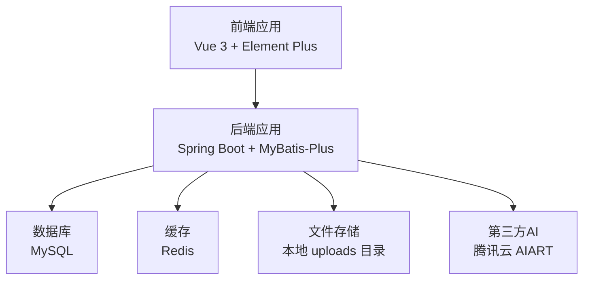
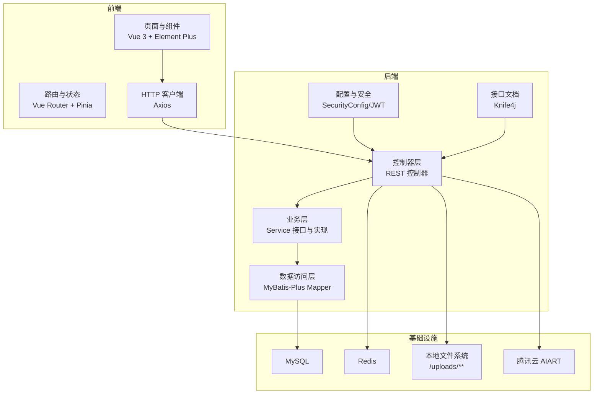
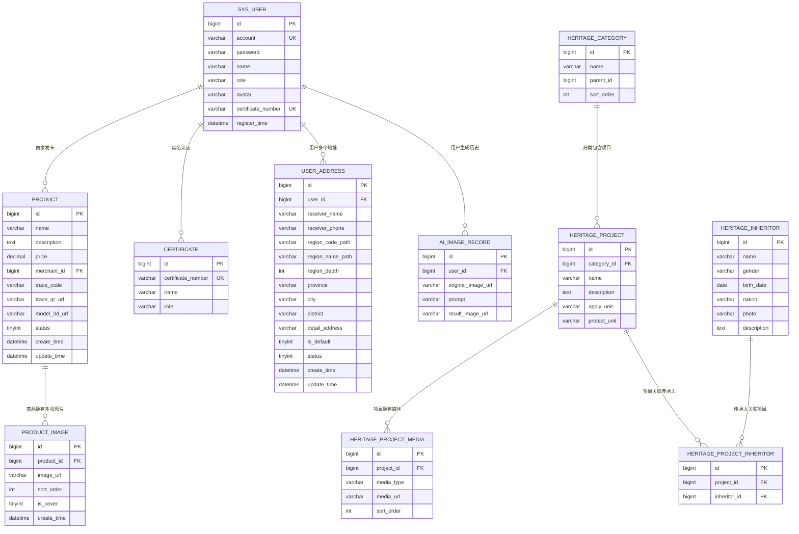
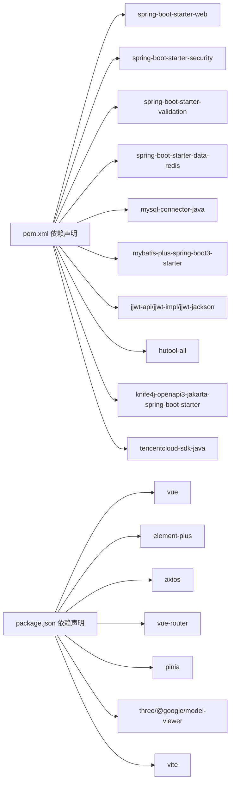

# 开发指南

<cite>
**本文引用的文件**   
- [HeritageApplication.java](file://backend/src/main/java/com/heritage/HeritageApplication.java)
- [pom.xml](file://backend/pom.xml)
- [application.yml](file://backend/src/main/resources/application.yml)
- [package.json](file://frontend/package.json)
- [系统设计.md](file://TODO/系统设计.md)
- [接口清单表.md](file://TODO/接口清单表.md)
- [数据库设计.md](file://TODO/数据库设计.md)
- [商品模块开发任务清单.md](file://TODO/商品模块开发任务清单.md)
- [订单模块开发任务清单.md](file://TODO/订单模块开发任务清单.md)
- [非遗模块开发任务清单.md](file://TODO/非遗模块开发任务清单.md)
- [非遗智能定制模块开发任务清单.md](file://TODO/非遗智能定制模块开发任务清单.md)
</cite>

## 目录
1. [简介](#简介)
2. [项目结构](#项目结构)
3. [核心组件](#核心组件)
4. [架构总览](#架构总览)
5. [详细组件分析](#详细组件分析)
6. [依赖分析](#依赖分析)
7. [性能考虑](#性能考虑)
8. [故障排查指南](#故障排查指南)
9. [结论](#结论)
10. [附录](#附录)

## 简介
本开发指南面向“非遗产品智能定制商城系统”的研发团队，旨在统一开发规范、Git 工作流与代码审查标准，明确从需求分析、设计评审、编码实现到测试验证的完整流程。文档覆盖后端 Spring Boot 与前端 Vue 的技术栈、模块化设计与接口契约、测试策略（单元测试、集成测试、端到端测试）、调试与性能分析方法、常见问题与解决方案，以及新功能开发模板、模块扩展指南与第三方集成方法，最终保障团队开发效率与代码质量的一致性。

## 项目结构
项目采用前后端分离架构：
- 后端基于 Spring Boot，使用 MyBatis-Plus、Spring Security、Redis、Knife4j/OpenAPI 等技术栈，统一通过 RESTful API 提供服务。
- 前端基于 Vue 3 + Element Plus，使用 Vite 构建，提供用户交互与页面展示。
- 数据库采用 MySQL，配合 Redis 缓存与本地文件上传目录（/uploads/**）。
- 配置集中于 application.yml，包含数据库、Redis、JWT、文件上传、AI 腾讯云配置等。

图表来源
- [application.yml](file://backend/src/main/resources/application.yml#L1-L63)
- [pom.xml](file://backend/pom.xml#L30-L97)
- [package.json](file://frontend/package.json#L10-L26)

章节来源
- [系统设计.md](file://TODO/系统设计.md#L23-L61)
- [application.yml](file://backend/src/main/resources/application.yml#L1-L63)
- [pom.xml](file://backend/pom.xml#L30-L97)
- [package.json](file://frontend/package.json#L10-L26)

## 核心组件
- 应用入口与启动
  - 后端应用入口类负责启动 Spring Boot 应用，统一暴露 REST API。
- 配置中心
  - application.yml 集中管理数据库连接、Redis、JWT、文件上传、Knife4j、AI 腾讯云等配置。
- 依赖管理
  - pom.xml 管理后端依赖，包含 web、security、validation、data-redis、mysql、mybatis-plus、jwt、knife4j、tencentcloud-sdk 等。
- 前端依赖
  - package.json 管理 Vue 3、Element Plus、Axios、Pinia、Vue Router、Vite、Three.js、@google/model-viewer 等依赖。

章节来源
- [HeritageApplication.java](file://backend/src/main/java/com/heritage/HeritageApplication.java#L1-L13)
- [application.yml](file://backend/src/main/resources/application.yml#L1-L63)
- [pom.xml](file://backend/pom.xml#L30-L97)
- [package.json](file://frontend/package.json#L10-L26)

## 架构总览
系统采用前后端分离架构，后端提供 RESTful API，前端通过 Axios 调用接口，实现用户管理、商品与商城、交易链路、非遗文化、智能定制与文件管理等功能。认证采用 Spring Security + JWT，接口文档通过 Knife4j/OpenAPI 自动生成。

图表来源
- [系统设计.md](file://TODO/系统设计.md#L23-L61)
- [application.yml](file://backend/src/main/resources/application.yml#L17-L62)
- [pom.xml](file://backend/pom.xml#L30-L97)

## 详细组件分析

### 后端启动与配置
- 启动类 HeritageApplication 作为应用入口，负责引导 Spring Boot 应用启动。
- application.yml 提供数据库、Redis、JWT、文件上传、Knife4j、AI 腾讯云等配置项，确保服务正常运行与接口文档可用。
- pom.xml 管理后端依赖，涵盖 web、security、validation、data-redis、mysql、mybatis-plus、jwt、knife4j、tencentcloud-sdk 等，满足系统功能与安全需求。

章节来源
- [HeritageApplication.java](file://backend/src/main/java/com/heritage/HeritageApplication.java#L1-L13)
- [application.yml](file://backend/src/main/resources/application.yml#L1-L63)
- [pom.xml](file://backend/pom.xml#L30-L97)

### 数据库设计与 ER 关系
- 数据库采用 MySQL，遵循第三范式，减少冗余，支持扩展与安全（密码加密、角色分离）。
- 核心模块表包括：用户与实名认证、商品与图片、收货地址、非遗分类/项目/媒体/传承人、智能定制历史记录等。
- ER 关系体现外键关联，保证数据一致性，并为后续扩展提供基础。

图表来源
- [数据库设计.md](file://TODO/数据库设计.md#L31-L337)

章节来源
- [数据库设计.md](file://TODO/数据库设计.md#L15-L370)

### 接口契约与权限控制
- 接口采用 RESTful 风格，按模块划分路径，结合用户角色实现访问控制。
- 示例接口清单覆盖认证与用户、商品管理、实名认证、收货地址、购物车、订单、支付、文件管理、智能定制、非遗文化等模块。
- JWT 用于认证，请求头携带 Authorization: Bearer <token>，Knife4j 提供在线接口文档与调试。

章节来源
- [接口清单表.md](file://TODO/接口清单表.md#L1-L222)
- [系统设计.md](file://TODO/系统设计.md#L47-L61)

### 模块开发流程与任务清单
- 商品模块：从数据库表设计、SQL 初始化、实体与 Mapper、DTO/VO、Service/Controller 到前端 API 与页面对接，形成闭环。
- 订单模块：购物车、订单、支付链路的数据库设计、实体与 Mapper、DTO/VO、Service/Controller、前端 API 与页面对接。
- 非遗模块：分类树、项目列表/详情、传承人详情与管理端 CRUD，配套前端页面与 API。
- 非遗智能定制模块：文生图/图生图接口、历史记录分页、本地文件存储与第三方 AI 调用封装。

章节来源
- [商品模块开发任务清单.md](file://TODO/商品模块开发任务清单.md#L1-L160)
- [订单模块开发任务清单.md](file://TODO/订单模块开发任务清单.md#L1-L198)
- [非遗模块开发任务清单.md](file://TODO/非遗模块开发任务清单.md#L1-L186)
- [非遗智能定制模块开发任务清单.md](file://TODO/非遗智能定制模块开发任务清单.md#L1-L114)

### 开发规范与 Git 工作流
- 分支策略
  - main：稳定发布分支
  - develop：集成与测试分支
  - feature/<模块>/<功能点>：功能开发分支
  - hotfix/<问题编号>：紧急修复分支
- 提交规范
  - type(scope): subject
  - 示例：feat(auth): 用户登录接口新增 JWT 验证
- 代码审查
  - PR 必须包含需求说明、接口清单、数据库变更、测试用例与风险评估
  - 至少一名 reviewer 通过并解决评论后方可合并
- 冲突解决
  - 优先 rebase develop，保持线性历史；冲突时及时沟通与三方合并

章节来源
- [系统设计.md](file://TODO/系统设计.md#L23-L61)
- [接口清单表.md](file://TODO/接口清单表.md#L203-L206)

### 代码审查标准
- 正确性：接口行为与需求一致，边界条件与异常处理完备
- 可维护性：命名规范、模块职责单一、日志与异常信息清晰
- 性能：避免 N+1 查询、合理使用缓存、IO 与第三方调用超时控制
- 安全：输入校验、权限控制、敏感信息脱敏、JWT 安全配置
- 文档：接口文档、数据库变更说明、模块设计说明

章节来源
- [接口清单表.md](file://TODO/接口清单表.md#L203-L206)
- [系统设计.md](file://TODO/系统设计.md#L47-L61)

### 测试策略
- 单元测试
  - Service 层：Mock Mapper/依赖，覆盖核心业务逻辑与异常分支
  - Controller 层：Mock Service，验证接口契约与权限控制
- 集成测试
  - 数据库：使用 H2 或 MySQL 测试库，验证事务与索引
  - 第三方：Mock 腾讯云 AI，验证参数透传与错误映射
- 端到端测试
  - 前后端联调：覆盖登录、商品浏览、下单、支付、智能定制全流程
  - 性能压测：使用 JMeter/Artillery，关注接口 RT 与吞吐

章节来源
- [商品模块开发任务清单.md](file://TODO/商品模块开发任务清单.md#L111-L125)
- [订单模块开发任务清单.md](file://TODO/订单模块开发任务清单.md#L163-L189)
- [非遗智能定制模块开发任务清单.md](file://TODO/非遗智能定制模块开发任务清单.md#L86-L102)

### 调试技巧与性能分析
- 后端
  - 日志：开启 DEBUG 级别，定位 SQL、缓存命中与异常堆栈
  - 断点：在 Controller → Service → Mapper 分层断点，逐步缩小问题范围
  - 性能：使用 Micrometer + Prometheus/Grafana 监控接口耗时与线程池
- 前端
  - DevTools：Network 面板检查请求与响应，Console 查看错误
  - Vue DevTools：检查组件状态与路由守卫
- 数据库
  - EXPLAIN 分析慢查询，补充必要索引
- 第三方
  - 腾讯云 SDK：开启 SDK 日志，核对 SecretId/SecretKey/Region/Endpoint

章节来源
- [application.yml](file://backend/src/main/resources/application.yml#L43-L57)
- [pom.xml](file://backend/pom.xml#L30-L97)

### 常见问题与解决方案
- 登录失败/权限异常
  - 检查 JWT Secret 与过期配置，确认请求头 Authorization 正确
- 文件上传失败
  - 检查 multipart 配置与 uploads 目录权限，确认 public-base-url 与静态资源映射
- 数据库连接异常
  - 校验 application.yml 中的 JDBC URL、用户名与密码
- 第三方 AI 调用失败
  - 校验腾讯云 SecretId/SecretKey/Region/Endpoint，确认网络可达与签名参数

章节来源
- [application.yml](file://backend/src/main/resources/application.yml#L17-L62)
- [pom.xml](file://backend/pom.xml#L94-L97)

### 新功能开发模板
- 需求分析
  - 明确业务目标、用户角色、前置条件与验收标准
- 设计评审
  - 接口设计（RESTful、参数、权限）、数据库设计（ER、索引、约束）、第三方集成方案
- 编码实现
  - 后端：实体/Mapper/DTO/VO/Service/Controller，配置与日志
  - 前端：API 封装、页面组件、路由与权限
- 测试验证
  - 单元测试、集成测试、端到端联调
- 发布与回滚
  - PR 审查、灰度发布、监控告警、回滚预案

章节来源
- [系统设计.md](file://TODO/系统设计.md#L64-L74)
- [接口清单表.md](file://TODO/接口清单表.md#L203-L206)

### 模块扩展指南
- 新增模块步骤
  - 数据库：新增表与索引，编写初始化 SQL
  - 后端：Entity/Mapper/DTO/VO/Service/Controller，权限与异常处理
  - 前端：API 封装、页面与路由，国际化与主题
  - 文档：接口清单、数据库变更、模块设计说明
- 扩展点
  - 缓存：热点数据使用 Redis，注意缓存穿透与一致性
  - 安全：新增接口补充权限控制与参数校验
  - 监控：埋点与指标上报，异常告警

章节来源
- [数据库设计.md](file://TODO/数据库设计.md#L15-L370)
- [系统设计.md](file://TODO/系统设计.md#L64-L74)

### 第三方集成方法
- 腾讯云 AI（AIART）
  - 配置 SecretId/SecretKey/Region/Endpoint，封装 SDK 调用与错误映射
  - 参考智能定制模块的实现，统一参数透传与结果落盘
- 文件存储
  - 本地存储：/uploads/**，配置 public-base-url 与静态资源映射
  - 生产环境：可替换为对象存储（如 COS），抽象 StorageService

章节来源
- [application.yml](file://backend/src/main/resources/application.yml#L43-L57)
- [pom.xml](file://backend/pom.xml#L94-L97)
- [非遗智能定制模块开发任务清单.md](file://TODO/非遗智能定制模块开发任务清单.md#L36-L50)

## 依赖分析
后端依赖关系围绕 Spring Boot 启动、Web、安全、数据访问、缓存、文档与第三方服务展开；前端依赖围绕 Vue 3 生态与构建工具构成。

图表来源
- [pom.xml](file://backend/pom.xml#L30-L97)
- [package.json](file://frontend/package.json#L10-L26)

章节来源
- [pom.xml](file://backend/pom.xml#L30-L97)
- [package.json](file://frontend/package.json#L10-L26)

## 性能考虑
- 数据库
  - 为高频查询字段建立索引，避免全表扫描；分页查询使用 LIMIT/OFFSET 或基于游标的分页
  - 合理使用连接池与超时配置，避免阻塞
- 缓存
  - 热点数据使用 Redis 缓存，注意缓存穿透与双写一致性
- 接口
  - 控制响应体大小，避免 N+1 查询；批量查询与懒加载结合
- 第三方
  - 设置合理的超时与重试策略，避免阻塞主线程
- 前端
  - 图片懒加载、组件按需引入、路由懒加载与缓存

章节来源
- [数据库设计.md](file://TODO/数据库设计.md#L15-L370)
- [application.yml](file://backend/src/main/resources/application.yml#L23-L35)
- [pom.xml](file://backend/pom.xml#L30-L97)

## 故障排查指南
- 启动失败
  - 检查 Java 版本与 Maven 依赖是否正确解析
- 接口异常
  - 查看后端日志与异常堆栈，确认参数校验与权限控制
- 数据库异常
  - 校验连接串、用户名密码与数据库状态
- 文件上传异常
  - 检查 multipart 配置与 uploads 目录权限
- 第三方调用异常
  - 校验 SecretId/SecretKey/Region/Endpoint，查看 SDK 日志

章节来源
- [application.yml](file://backend/src/main/resources/application.yml#L17-L62)
- [pom.xml](file://backend/pom.xml#L30-L97)

## 结论
本开发指南从架构、模块、流程、测试、调试与第三方集成等维度，为非遗产品智能定制商城系统提供系统化的开发与运维实践。团队应严格遵循开发规范与 Git 工作流，持续完善测试与监控体系，确保系统高质量交付与稳定运行。

## 附录
- 快速检查清单
  - 后端：启动成功、Knife4j 可用、数据库连通、Redis 可用、AI 配置正确
  - 前端：依赖安装完成、代理配置正确、页面可访问
  - 接口：登录成功、权限校验通过、分页与筛选正常
  - 测试：单元测试通过、集成测试覆盖关键路径、端到端联调完成