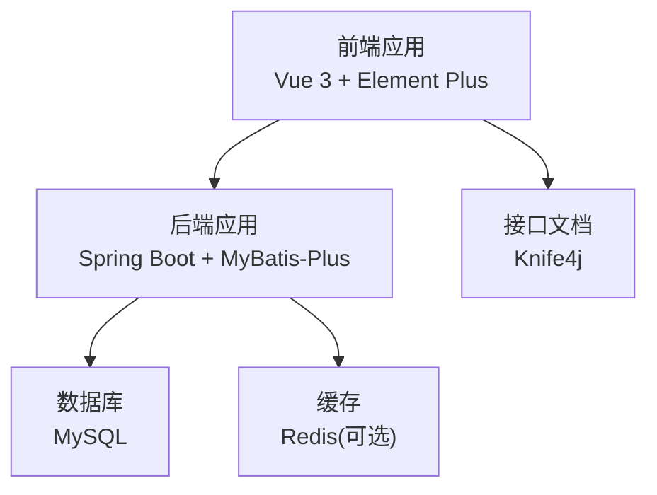
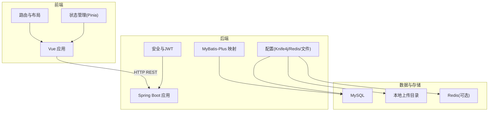
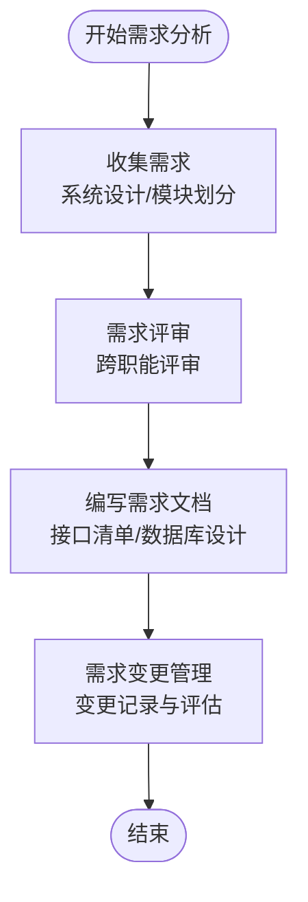
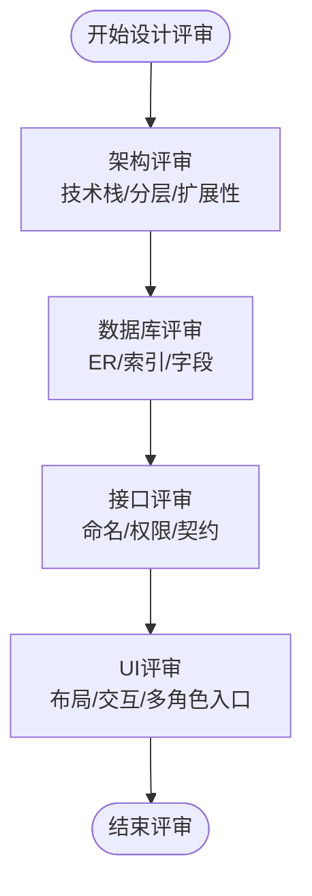
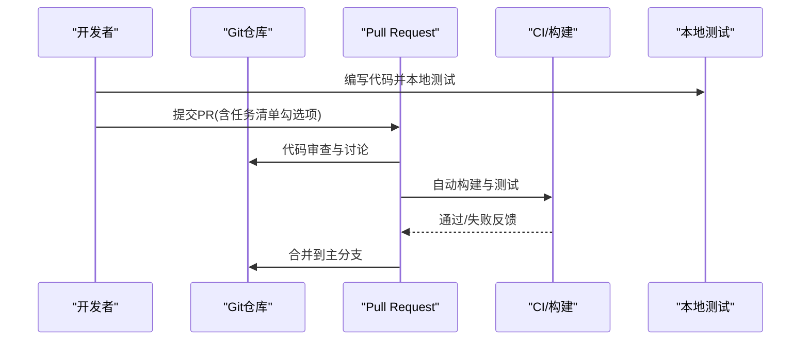
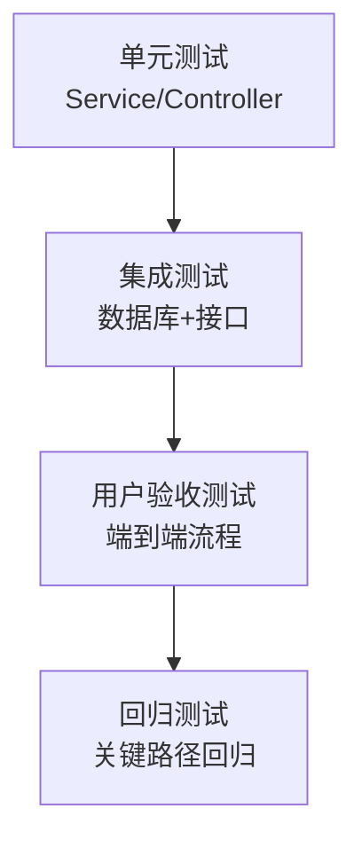
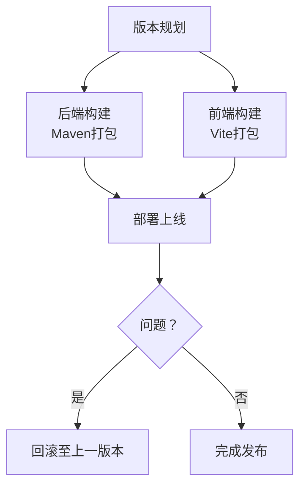
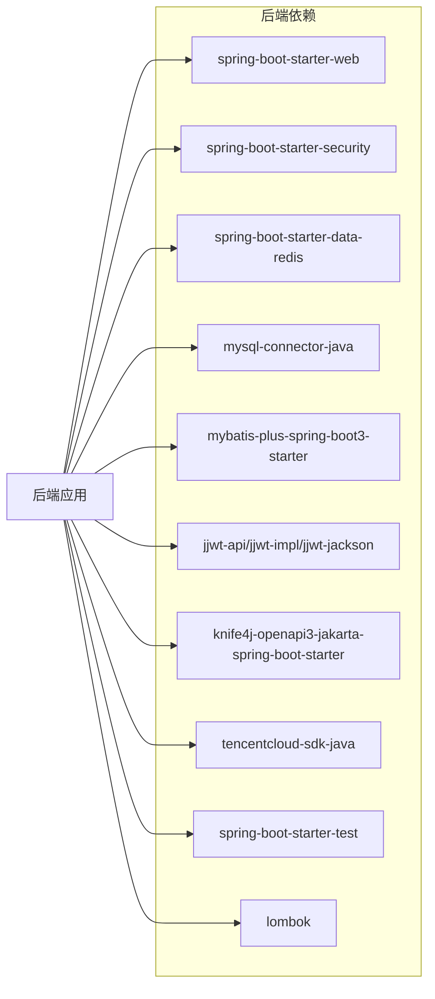

# 开发流程

<cite>
**本文引用的文件**
- [系统设计.md](file://TODO/系统设计.md)
- [数据库设计.md](file://TODO/数据库设计.md)
- [接口清单表.md](file://TODO/接口清单表.md)
- [商品模块开发任务清单.md](file://TODO/商品模块开发任务清单.md)
- [订单模块开发任务清单.md](file://TODO/订单模块开发任务清单.md)
- [非遗模块开发任务清单.md](file://TODO/非遗模块开发任务清单.md)
- [非遗智能定制模块开发任务清单.md](file://TODO/非遗智能定制模块开发任务清单.md)
- [HeritageApplication.java](file://backend/src/main/java/com/heritage/HeritageApplication.java)
- [pom.xml](file://backend/pom.xml)
- [application.yml](file://backend/src/main/resources/application.yml)
- [package.json](file://frontend/package.json)
- [user.sql](file://backend/src/main/resources/sql/user.sql)
- [product.sql](file://backend/src/main/resources/sql/product.sql)
- [heritage.sql](file://backend/src/main/resources/sql/heritage.sql)
- [ai_image_record.sql](file://backend/src/main/resources/sql/ai_image_record.sql)
</cite>

## 目录
1. [简介](#简介)
2. [项目结构](#项目结构)
3. [核心组件](#核心组件)
4. [架构总览](#架构总览)
5. [详细组件分析](#详细组件分析)
6. [依赖分析](#依赖分析)
7. [性能考虑](#性能考虑)
8. [故障排查指南](#故障排查指南)
9. [结论](#结论)
10. [附录](#附录)

## 简介
本开发流程文档面向“非遗产品智能定制商城系统”，基于仓库现有设计文档、接口清单与任务清单，梳理从需求到上线的完整开发流程，覆盖需求分析、设计评审、编码实现、测试验证、版本发布与项目管理等环节，确保项目按时高质量交付。

## 项目结构
系统采用前后端分离架构：
- 前端：Vue 3 + Element Plus，Vite 构建，提供用户界面与交互。
- 后端：Spring Boot，RESTful API，MyBatis-Plus，JWT + Spring Security，Knife4j 提供接口文档。
- 数据库：MySQL，配套 Redis（可选），文件上传使用本地 uploads 目录。
- 工具链：Maven 管理后端依赖与构建，前端使用 npm scripts。

图表来源
- [HeritageApplication.java](file://backend/src/main/java/com/heritage/HeritageApplication.java#L1-L13)
- [pom.xml](file://backend/pom.xml#L1-L129)
- [application.yml](file://backend/src/main/resources/application.yml#L1-L63)
- [package.json](file://frontend/package.json#L1-L28)

章节来源
- [系统设计.md](file://TODO/系统设计.md#L23-L61)
- [HeritageApplication.java](file://backend/src/main/java/com/heritage/HeritageApplication.java#L1-L13)
- [pom.xml](file://backend/pom.xml#L1-L129)
- [application.yml](file://backend/src/main/resources/application.yml#L1-L63)
- [package.json](file://frontend/package.json#L1-L28)

## 核心组件
- 用户与权限模块：注册登录、个人中心、管理员用户管理、实名认证。
- 商品与商城模块：商品管理（管理员/商家）、前台展示（推荐/详情）。
- 交易链路模块：购物车、收货地址、订单、支付。
- 非遗文化模块：分类、项目、传承人，含管理端。
- 智能定制模块：AI 生图与历史记录。
- 文件管理模块：文件上传与静态资源访问。

章节来源
- [系统设计.md](file://TODO/系统设计.md#L64-L74)
- [接口清单表.md](file://TODO/接口清单表.md#L1-L222)

## 架构总览
系统采用前后端分离，后端通过 RESTful API 提供能力，前端按模块路由组织页面，后端通过 MyBatis-Plus 访问数据库，使用 JWT 进行无状态鉴权，Knife4j 提供在线接口文档与调试。

图表来源
- [系统设计.md](file://TODO/系统设计.md#L23-L61)
- [application.yml](file://backend/src/main/resources/application.yml#L1-L63)
- [pom.xml](file://backend/pom.xml#L30-L97)

## 详细组件分析

### 需求分析流程
- 需求收集：依据系统设计文档与模块划分，明确用户角色、业务域与功能边界。
- 需求评审：组织跨职能评审，确认模块职责、接口范围与数据模型。
- 需求文档编写：输出接口清单表与数据库设计，形成可执行的开发依据。
- 需求变更管理：建立变更记录与影响评估机制，确保版本演进有序。

章节来源
- [系统设计.md](file://TODO/系统设计.md#L1-L306)
- [接口清单表.md](file://TODO/接口清单表.md#L1-L222)
- [数据库设计.md](file://TODO/数据库设计.md#L1-L370)

### 设计评审流程
- 架构设计评审：确认前后端分离、鉴权与接口风格、扩展性与性能考虑。
- 数据库设计评审：核对 ER 关系、索引与字段设计，确保一致性与可扩展性。
- 接口设计评审：统一 RESTful 命名、参数与权限控制，保障前后端契约稳定。
- UI 设计评审：确认页面布局、交互与多角色入口，确保可用性与一致性。

章节来源
- [系统设计.md](file://TODO/系统设计.md#L23-L61)
- [数据库设计.md](file://TODO/数据库设计.md#L325-L337)
- [接口清单表.md](file://TODO/接口清单表.md#L153-L200)

### 编码实现流程
- 任务分配：依据模块与任务清单，将后端实体/DTO/Service/Controller 与前端 API/页面开发拆分到开发人员。
- 代码编写：遵循模块边界，后端使用 MyBatis-Plus 与 Spring Boot，前端使用 Vue 3 组件化开发。
- 本地测试：后端通过 mvn test，前端通过 Vite dev server 进行联调。
- 代码审查：通过 Pull Request 流程，关注接口契约、鉴权与异常处理。
- 合并流程：通过 CI/CD 或手动打包，确保构建通过与依赖版本一致。

章节来源
- [商品模块开发任务清单.md](file://TODO/商品模块开发任务清单.md#L1-L160)
- [订单模块开发任务清单.md](file://TODO/订单模块开发任务清单.md#L1-L198)
- [非遗模块开发任务清单.md](file://TODO/非遗模块开发任务清单.md#L1-L186)
- [非遗智能定制模块开发任务清单.md](file://TODO/非遗智能定制模块开发任务清单.md#L1-L114)

### 测试验证流程
- 单元测试：后端 Service/Controller 层针对核心业务规则进行断言。
- 集成测试：数据库初始化脚本与接口联调，覆盖购物车/订单/支付链路。
- 用户验收测试：从前端页面到后端接口的整体流程验证，确保业务闭环。
- 回归测试：每次变更后执行关键路径回归，避免破坏既有功能。

章节来源
- [商品模块开发任务清单.md](file://TODO/商品模块开发任务清单.md#L109-L125)
- [订单模块开发任务清单.md](file://TODO/订单模块开发任务清单.md#L161-L180)
- [非遗模块开发任务清单.md](file://TODO/非遗模块开发任务清单.md#L151-L167)

### 版本发布流程
- 版本规划：依据任务清单与里程碑，确定版本范围与交付内容。
- 构建打包：后端使用 Maven 打包，前端使用 Vite 构建产物。
- 部署上线：后端 Jar 包部署，前端静态资源部署至 Nginx 或 CDN。
- 回滚策略：保留上一版本制品，出现重大问题时快速回滚。

章节来源
- [pom.xml](file://backend/pom.xml#L112-L127)
- [package.json](file://frontend/package.json#L5-L9)

### 项目进度跟踪与风险管理
- 进度跟踪：以任务清单为基准，每日站会同步进展，里程碑节点评审。
- 风险管理：识别技术风险（AI 服务、数据库性能、鉴权复杂度），制定应对预案与降级方案。

章节来源
- [商品模块开发任务清单.md](file://TODO/商品模块开发任务清单.md#L1-L160)
- [订单模块开发任务清单.md](file://TODO/订单模块开发任务清单.md#L1-L198)
- [非遗模块开发任务清单.md](file://TODO/非遗模块开发任务清单.md#L1-L186)
- [非遗智能定制模块开发任务清单.md](file://TODO/非遗智能定制模块开发任务清单.md#L1-L114)

## 依赖分析
后端依赖包括 Web、Security、Redis、MySQL、MyBatis-Plus、JWT、Knife4j、腾讯云 SDK、测试与 Lombok 等；前端依赖 Vue 3、Element Plus、Axios、Pinia、Vue Router 等。

图表来源
- [pom.xml](file://backend/pom.xml#L30-L109)

章节来源
- [pom.xml](file://backend/pom.xml#L1-L129)

## 性能考虑
- 数据库层面：为高频查询字段建立索引，避免 N+1 查询，合理分页与排序。
- 接口层面：统一异常处理与参数校验，避免无效请求放大后端压力。
- 缓存层面：Redis 可用于热点数据与会话缓存（按需启用）。
- 文件层面：上传大小限制与静态资源访问路径规划，避免过大文件影响性能。

章节来源
- [数据库设计.md](file://TODO/数据库设计.md#L14-L23)
- [application.yml](file://backend/src/main/resources/application.yml#L12-L15)
- [application.yml](file://backend/src/main/resources/application.yml#L23-L35)

## 故障排查指南
- 启动与端口：确认后端端口与数据库连接配置，检查 application.yml。
- 接口文档：通过 Knife4j 在线调试接口，核对请求头 Authorization 与参数。
- 文件上传：确认 uploads 目录可写与 PUBLIC_BASE_URL 配置，避免 404。
- AI 服务：检查腾讯云 SecretId/SecretKey 配置，确保网络可达。

章节来源
- [application.yml](file://backend/src/main/resources/application.yml#L1-L63)
- [HeritageApplication.java](file://backend/src/main/java/com/heritage/HeritageApplication.java#L1-L13)

## 结论
本流程文档以系统设计、接口清单与任务清单为基础，建立了覆盖需求、设计、实现、测试、发布与运维的全流程规范，配合任务清单与依赖配置，可确保项目在可控节奏下高质量交付。

## 附录
- 数据库初始化脚本位置与用途：
  - 用户与证书：初始化用户表与预置证件数据，便于注册/登录与实名认证演示。
  - 商品与图片：初始化商品与图片数据，支撑商品管理与前台展示。
  - 非遗模块：初始化分类、项目、媒体、传承人与关联关系。
  - AI 生图记录：初始化智能定制历史记录表。

章节来源
- [user.sql](file://backend/src/main/resources/sql/user.sql#L1-L45)
- [product.sql](file://backend/src/main/resources/sql/product.sql#L1-L45)
- [heritage.sql](file://backend/src/main/resources/sql/heritage.sql#L1-L88)
- [ai_image_record.sql](file://backend/src/main/resources/sql/ai_image_record.sql#L1-L10)