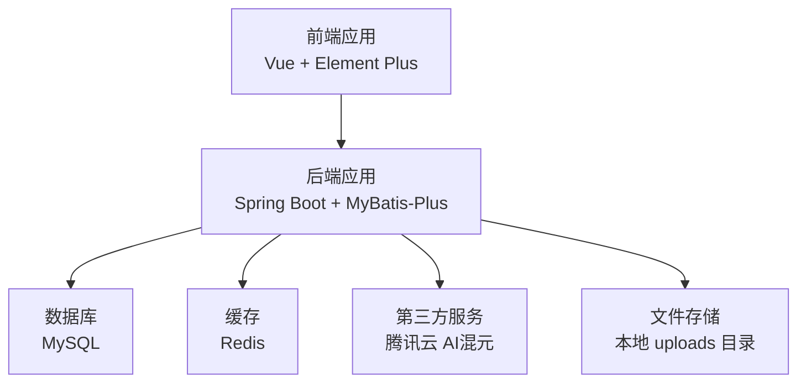
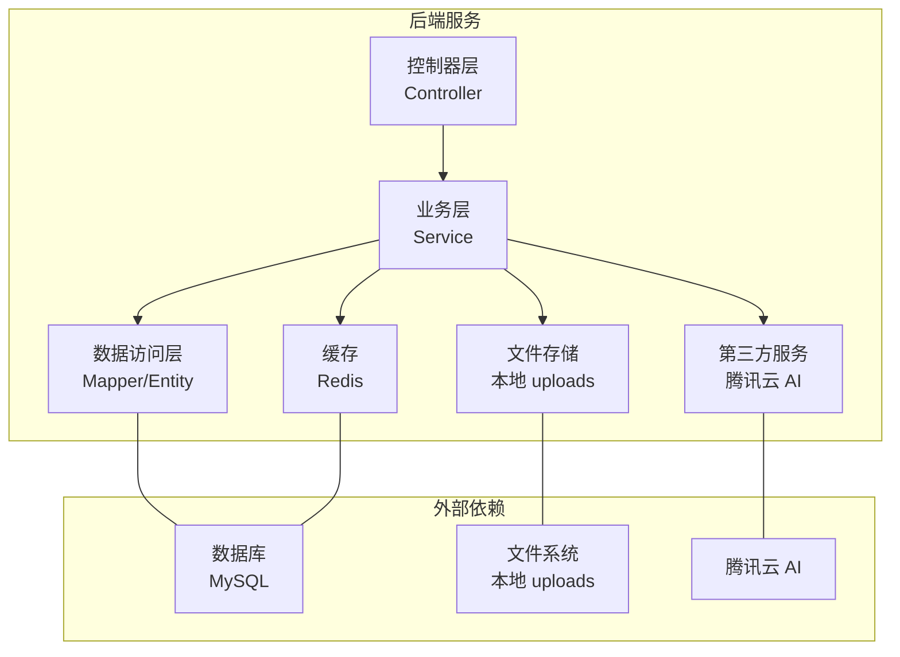
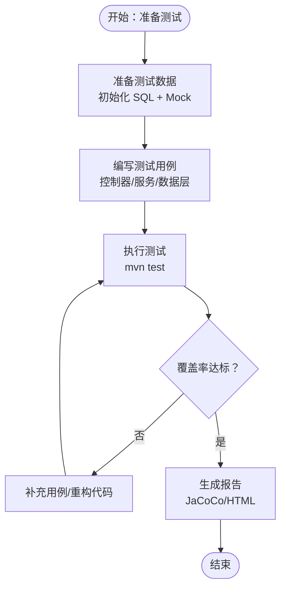
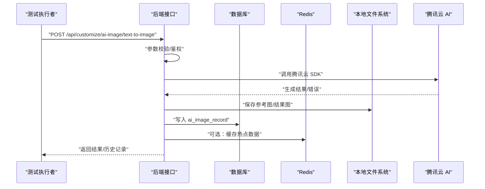
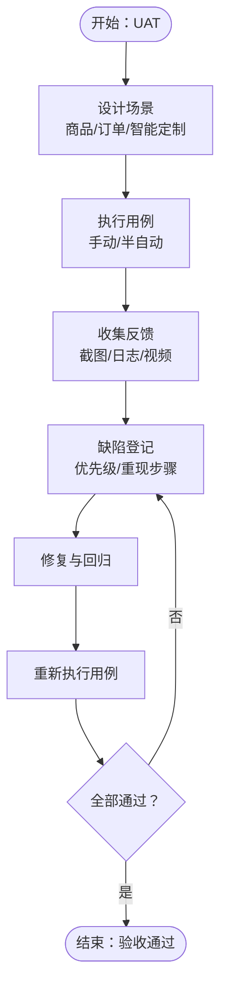
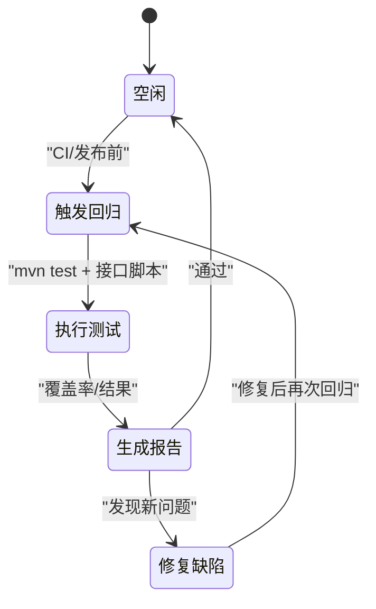
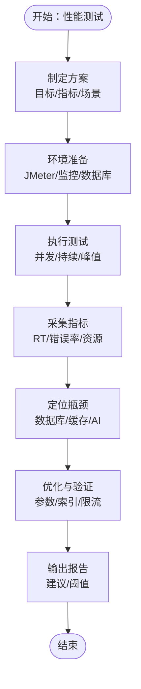
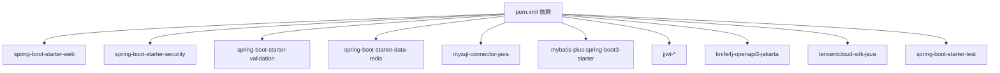

# 测试验证流程

<cite>
**本文引用的文件**
- [pom.xml](file://backend/pom.xml)
- [application.yml](file://backend/src/main/resources/application.yml)
- [系统设计.md](file://TODO/系统设计.md)
- [商品模块开发任务清单.md](file://TODO/商品模块开发任务清单.md)
- [订单模块开发任务清单.md](file://TODO/订单模块开发任务清单.md)
- [非遗智能定制模块开发任务清单.md](file://TODO/非遗智能定制模块开发任务清单.md)
- [product.sql](file://backend/src/main/resources/sql/product.sql)
- [user.sql](file://backend/src/main/resources/sql/user.sql)
- [ai_image_record.sql](file://backend/src/main/resources/sql/ai_image_record.sql)
- [cart.sql](file://backend/src/main/resources/sql/cart.sql)
- [order.sql](file://backend/src/main/resources/sql/order.sql)
- [payment.sql](file://backend/src/main/resources/sql/payment.sql)
- [user_address.sql](file://backend/src/main/resources/sql/user_address.sql)
</cite>

## 目录
1. [简介](#简介)
2. [项目结构](#项目结构)
3. [核心组件](#核心组件)
4. [架构总览](#架构总览)
5. [详细组件分析](#详细组件分析)
6. [依赖分析](#依赖分析)
7. [性能考虑](#性能考虑)
8. [故障排查指南](#故障排查指南)
9. [结论](#结论)
10. [附录](#附录)

## 简介
本文件面向“非遗产品智能定制商城系统”，制定从单元测试到用户验收、回归测试与性能测试的完整验证流程，确保系统在功能正确性、接口稳定性、数据一致性、第三方服务可用性与并发性能方面的质量与可靠性。文档依据仓库现有后端技术栈（Spring Boot、MyBatis-Plus、MySQL、Redis、JWT、Knife4j）、配置与模块清单，结合系统设计说明，形成可执行、可追踪、可量化的测试方案。

## 项目结构
系统采用前后端分离架构，后端基于 Spring Boot，使用 MyBatis-Plus 访问 MySQL，Redis 提供缓存，Knife4j 提供接口文档，JWT 实现认证。测试相关的关键位置与文件如下：
- 后端依赖与插件：pom.xml
- 应用配置：application.yml（数据库、Redis、JWT、AI 腾讯云配置、文件上传路径）
- 模块开发任务清单：商品模块、订单模块、非遗智能定制模块
- 数据库初始化脚本：product、user、ai_image_record、cart、order、payment、user_address
- 系统设计说明：技术选型与模块划分

**图表来源**
- [系统设计.md](file://TODO/系统设计.md#L23-L61)
- [application.yml](file://backend/src/main/resources/application.yml#L17-L35)
- [pom.xml](file://backend/pom.xml#L30-L97)

**章节来源**
- [pom.xml](file://backend/pom.xml#L30-L103)
- [application.yml](file://backend/src/main/resources/application.yml#L1-L63)
- [系统设计.md](file://TODO/系统设计.md#L23-L61)

## 核心组件
- 用户与权限模块：认证、授权、角色管理、实名认证
- 商品与商城模块：商品管理、前台展示、3D/溯源展示
- 交易链路模块：购物车、收货地址、订单、支付
- 非遗文化模块：分类、项目、传承人、媒体管理
- 智能定制模块：文生图/图生图、历史记录、文件落盘
- 文件管理模块：上传、静态资源映射

以上模块均通过 RESTful API 提供服务，测试应覆盖接口行为、数据一致性、异常处理与第三方服务可用性。

**章节来源**
- [系统设计.md](file://TODO/系统设计.md#L64-L74)

## 架构总览
后端服务通过控制器层暴露接口，业务层处理领域逻辑，数据访问层通过 MyBatis-Plus 访问数据库，Redis 缓存热点数据，文件上传落地本地 uploads 目录，AI 生成通过腾讯云 SDK 调用。

**图表来源**
- [系统设计.md](file://TODO/系统设计.md#L23-L61)
- [application.yml](file://backend/src/main/resources/application.yml#L17-L35)
- [pom.xml](file://backend/pom.xml#L30-L97)

## 详细组件分析

### 单元测试流程
- 测试框架与工具
  - 使用 Spring Boot Test 与 JUnit（pom.xml 中声明了 spring-boot-starter-test）
  - 使用 @WebMvcTest/@DataJpaTest/@Import 等组合进行控制器与数据层测试
- 测试用例设计
  - 控制器层：针对每个 Controller 的增删改查、分页、鉴权与参数校验
  - 业务层：Service 方法的正向与异常分支、幂等性、事务边界
  - 数据层：Mapper 的 CRUD、条件构造器、分页查询、索引命中
- 覆盖率要求
  - 关键路径：Service 方法行覆盖率≥80%，分支覆盖率≥60%
  - 核心模块（商品、订单、智能定制）：行覆盖率≥85%，分支覆盖率≥70%
- 测试数据准备
  - 使用初始化 SQL（product、user、ai_image_record、cart、order、payment、user_address）准备最小化测试集
  - 使用 @Sql 或事务回滚方式隔离测试数据
- 自动化执行
  - Maven 目标：mvn test
  - CI 集成：在流水线中执行 mvn test 并输出报告（可接入 JaCoCo）

**章节来源**
- [pom.xml](file://backend/pom.xml#L100-L103)
- [商品模块开发任务清单.md](file://TODO/商品模块开发任务清单.md#L109-L125)
- [订单模块开发任务清单.md](file://TODO/订单模块开发任务清单.md#L161-L180)
- [非遗智能定制模块开发任务清单.md](file://TODO/非遗智能定制模块开发任务清单.md#L84-L102)

### 集成测试流程
- 接口测试
  - 使用 Knife4j/OpenAPI 在线调试与冒烟测试
  - 使用 REST Assured/JMeter/Postman 进行接口回归与边界测试
- 数据库测试
  - 基于初始化 SQL 验证表结构、索引、约束与默认数据
  - 验证事务边界与并发下的数据一致性（插入/更新/删除）
- 第三方服务测试
  - 腾讯云 AI：验证鉴权参数、请求参数、错误映射、超时与重试策略
  - 文件上传：验证大小限制、类型限制、URL 可访问性
- 环境兼容性测试
  - Java 17、MySQL 8、Redis 6+、Linux/Windows
  - 配置 profile（mock/production）差异验证

**图表来源**
- [application.yml](file://backend/src/main/resources/application.yml#L43-L53)
- [pom.xml](file://backend/pom.xml#L93-L97)
- [ai_image_record.sql](file://backend/src/main/resources/sql/ai_image_record.sql#L1-L20)

**章节来源**
- [application.yml](file://backend/src/main/resources/application.yml#L17-L63)
- [pom.xml](file://backend/pom.xml#L93-L97)
- [ai_image_record.sql](file://backend/src/main/resources/sql/ai_image_record.sql#L1-L20)

### 用户验收测试流程
- 测试场景设计
  - 商品模块：管理员/商家 CRUD、前台随机展示、删除级联
  - 订单模块：购物车加购/勾选/数量变更、下单、支付模拟、取消
  - 智能定制：文生图/图生图、历史记录分页、并发与额度控制
- 用户反馈收集
  - 使用测试用例清单作为验收检查点，逐项打钩
  - 记录缺陷：优先级（P0/P1/P2）、重现步骤、截图/日志
- 缺陷跟踪
  - 通过任务清单中的“测试与优化”部分闭环缺陷修复
- 验收标准
  - 功能正确性：所有场景通过
  - 性能门槛：接口响应时间、并发吞吐、内存占用
  - 安全性：鉴权失败、越权访问拦截

**章节来源**
- [商品模块开发任务清单.md](file://TODO/商品模块开发任务清单.md#L109-L125)
- [订单模块开发任务清单.md](file://TODO/订单模块开发任务清单.md#L161-L180)
- [非遗智能定制模块开发任务清单.md](file://TODO/非遗智能定制模块开发任务清单.md#L84-L102)

### 回归测试策略
- 回归测试计划
  - 每次发布前执行全量回归（商品/订单/智能定制/用户模块）
  - 重大变更（数据库结构、第三方服务参数）专项回归
- 测试用例维护
  - 用例与任务清单绑定，随功能迭代同步更新
- 自动化回归执行
  - CI 中配置 mvn test + 覆盖率检查
  - 接口测试脚本（REST Assured/JMeter）纳入流水线

**章节来源**
- [商品模块开发任务清单.md](file://TODO/商品模块开发任务清单.md#L109-L125)
- [订单模块开发任务清单.md](file://TODO/订单模块开发任务清单.md#L161-L180)
- [pom.xml](file://backend/pom.xml#L100-L103)

### 性能测试流程
- 负载测试
  - 使用 JMeter/LoadRunner 对核心接口（商品列表、下单、AI 生成）施压
  - 关注 P95/P99 响应时间、错误率、资源使用
- 压力测试
  - 逐步提升并发，观察系统瓶颈（数据库锁、Redis 限流、AI 调用超时）
- 并发测试
  - 购物车并发加购、订单并发创建、AI 并发生成
- 性能监控
  - JVM GC、CPU、内存、线程数、数据库连接池、Redis 连接数
  - 日志采样与告警阈值设置

**章节来源**
- [application.yml](file://backend/src/main/resources/application.yml#L23-L35)
- [pom.xml](file://backend/pom.xml#L30-L97)

## 依赖分析
- 后端依赖
  - Web、Security、Validation、Redis、MySQL、MyBatis-Plus、JWT、Knife4j、腾讯云 SDK、Lombok
- 外部依赖
  - MySQL、Redis、腾讯云 AI、本地文件系统
- 配置依赖
  - application.yml 中的数据库、Redis、JWT、AI、文件上传路径

**图表来源**
- [pom.xml](file://backend/pom.xml#L30-L103)

**章节来源**
- [pom.xml](file://backend/pom.xml#L30-L103)
- [application.yml](file://backend/src/main/resources/application.yml#L17-L63)

## 性能考虑
- 数据库层面
  - 索引设计（如商品 status、用户 address 等）与查询优化
  - 事务边界与批量操作（购物车聚合、订单快照写入）
- 缓存层面
  - Redis 连接池配置与热点数据缓存
- 文件与 AI
  - 上传大小限制、AI 生成并发与超时控制、结果落盘策略
- 接口与安全
  - JWT 过期与刷新、接口限流与熔断

**章节来源**
- [商品模块开发任务清单.md](file://TODO/商品模块开发任务清单.md#L40-L45)
- [订单模块开发任务清单.md](file://TODO/订单模块开发任务清单.md#L82-L90)
- [application.yml](file://backend/src/main/resources/application.yml#L17-L63)

## 故障排查指南
- 常见问题定位
  - 数据库连接失败：核对 application.yml 中的数据库 URL、账号、密码
  - Redis 连接失败：核对 host/port/database/timeout
  - JWT 鉴权失败：核对 secret 与过期时间
  - AI 调用失败：核对腾讯云 SecretId/SecretKey、Region、Endpoint
  - 文件上传失败：核对上传大小限制与 uploads 路径
- 日志与监控
  - 开启后端日志与慢查询日志
  - 使用 Knife4j 查看接口调用与错误
- 回归与修复
  - 将问题登记到对应模块的任务清单中，形成闭环

**章节来源**
- [application.yml](file://backend/src/main/resources/application.yml#L17-L63)
- [pom.xml](file://backend/pom.xml#L93-L97)
- [商品模块开发任务清单.md](file://TODO/商品模块开发任务清单.md#L109-L125)
- [订单模块开发任务清单.md](file://TODO/订单模块开发任务清单.md#L161-L180)
- [非遗智能定制模块开发任务清单.md](file://TODO/非遗智能定制模块开发任务清单.md#L84-L102)

## 结论
通过完善的单元测试、集成测试、用户验收测试、回归测试与性能测试流程，结合仓库现有的技术栈与模块设计，可以系统性地保障非遗产品智能定制商城系统的功能正确性、稳定性与可扩展性。建议在 CI 中固化测试与覆盖率检查，持续改进测试用例与性能基线。

## 附录
- 测试用例清单模板（可参考任务清单格式）
  - 商品模块：管理员/商家 CRUD、前台随机展示、删除级联
  - 订单模块：购物车加购/勾选/数量变更、下单、支付模拟、取消
  - 智能定制：文生图/图生图、历史记录分页、并发与额度控制
- 数据准备脚本
  - product.sql、user.sql、ai_image_record.sql、cart.sql、order.sql、payment.sql、user_address.sql

**章节来源**
- [商品模块开发任务清单.md](file://TODO/商品模块开发任务清单.md#L109-L125)
- [订单模块开发任务清单.md](file://TODO/订单模块开发任务清单.md#L161-L180)
- [非遗智能定制模块开发任务清单.md](file://TODO/非遗智能定制模块开发任务清单.md#L84-L102)
- [product.sql](file://backend/src/main/resources/sql/product.sql#L1-L45)
- [user.sql](file://backend/src/main/resources/sql/user.sql#L1-L45)
- [ai_image_record.sql](file://backend/src/main/resources/sql/ai_image_record.sql#L1-L20)
- [cart.sql](file://backend/src/main/resources/sql/cart.sql#L1-L200)
- [order.sql](file://backend/src/main/resources/sql/order.sql#L1-L200)
- [payment.sql](file://backend/src/main/resources/sql/payment.sql#L1-L200)
- [user_address.sql](file://backend/src/main/resources/sql/user_address.sql#L1-L200)