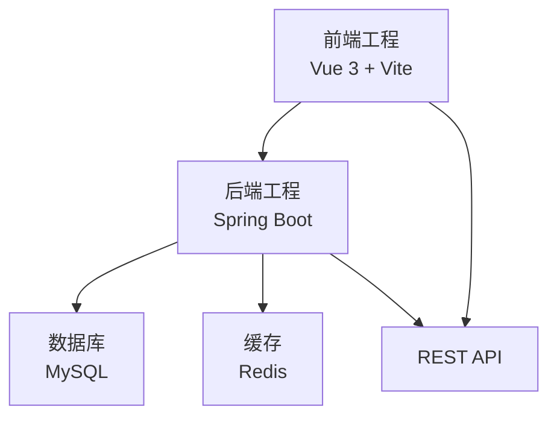
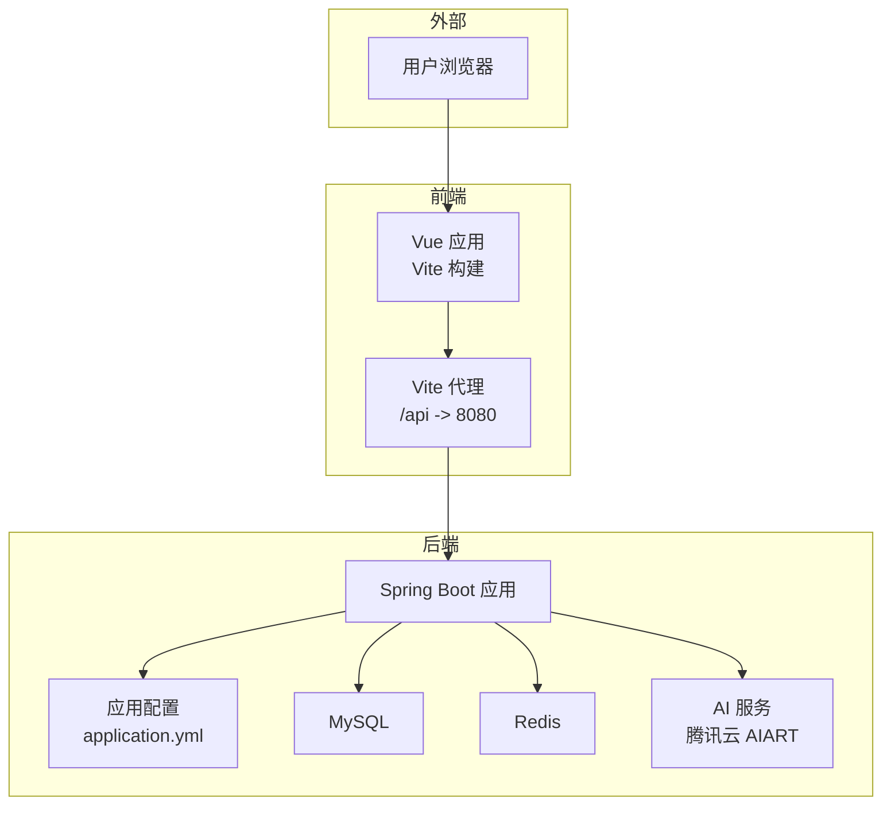
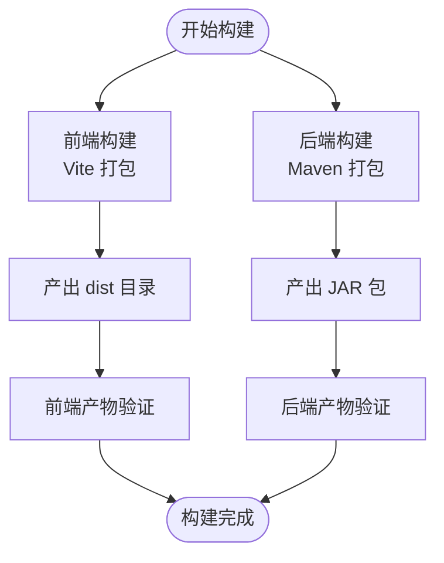
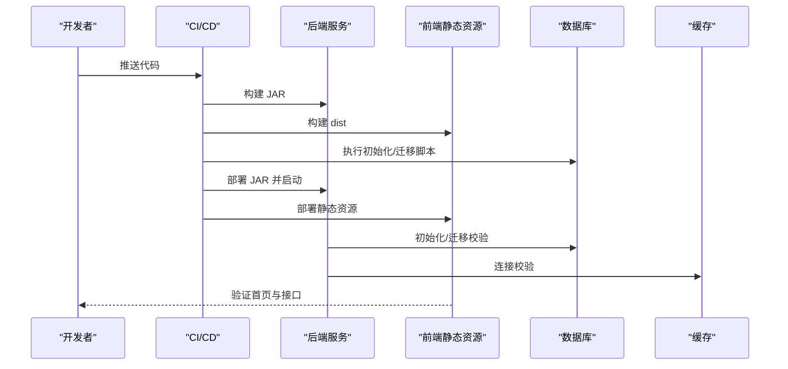
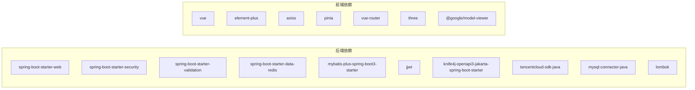

# 版本发布流程

<cite>
**本文引用的文件**
- [pom.xml](file://backend/pom.xml)
- [application.yml](file://backend/src/main/resources/application.yml)
- [HeritageApplication.java](file://backend/src/main/java/com/heritage/HeritageApplication.java)
- [package.json](file://frontend/package.json)
- [vite.config.js](file://frontend/vite.config.js)
- [系统设计.md](file://TODO/系统设计.md)
- [数据库设计.md](file://TODO/数据库设计.md)
- [接口清单表.md](file://TODO/接口清单表.md)
- [user.sql](file://backend/src/main/resources/sql/user.sql)
- [product.sql](file://backend/src/main/resources/sql/product.sql)
- [setup-maven.ps1](file://setup-maven.ps1)
</cite>

## 目录
1. [简介](#简介)
2. [项目结构](#项目结构)
3. [核心组件](#核心组件)
4. [架构总览](#架构总览)
5. [详细组件分析](#详细组件分析)
6. [依赖分析](#依赖分析)
7. [性能考虑](#性能考虑)
8. [故障排查指南](#故障排查指南)
9. [结论](#结论)
10. [附录](#附录)

## 简介
本文件为“非遗产品智能定制商城系统”的版本发布流程文档，覆盖版本规划策略、构建打包流程、部署上线流程、回滚策略、发布监控机制与可追溯性保障。系统采用前后端分离架构，后端基于 Spring Boot，前端基于 Vue 3 + Vite，数据库为 MySQL，缓存为 Redis，集成智能定制能力（文生图/图生图）。

## 项目结构
- 后端工程（Spring Boot）
  - 构建与依赖：Maven，版本号在 POM 中定义
  - 运行入口：Spring Boot 应用启动类
  - 配置：application.yml（端口、数据库、Redis、JWT、文件上传、AI 配置等）
  - SQL 初始化脚本：用户、商品、智能定制等表结构与测试数据
- 前端工程（Vue 3 + Vite）
  - 构建脚本：Vite 打包
  - 开发代理：本地代理到后端 8080 端口
- 发布工具链
  - Maven 环境变量配置脚本（Windows PowerShell）

**图表来源**
- [HeritageApplication.java](file://backend/src/main/java/com/heritage/HeritageApplication.java#L1-L13)
- [application.yml](file://backend/src/main/resources/application.yml#L1-L63)
- [pom.xml](file://backend/pom.xml#L1-L129)
- [package.json](file://frontend/package.json#L1-L28)
- [vite.config.js](file://frontend/vite.config.js#L1-L22)

**章节来源**
- [pom.xml](file://backend/pom.xml#L1-L129)
- [application.yml](file://backend/src/main/resources/application.yml#L1-L63)
- [HeritageApplication.java](file://backend/src/main/java/com/heritage/HeritageApplication.java#L1-L13)
- [package.json](file://frontend/package.json#L1-L28)
- [vite.config.js](file://frontend/vite.config.js#L1-L22)
- [系统设计.md](file://TODO/系统设计.md#L1-L306)

## 核心组件
- 版本号管理
  - 后端：POM 中定义 artifactId、version
  - 前端：package.json 中定义 name、version
- 发布周期
  - 建议采用“双周迭代 + 月度发布”节奏，配合里程碑评审与回归测试
- 功能里程碑
  - 用户/商品/订单/支付/非遗文化/智能定制等模块分阶段上线
- 风险评估
  - 数据库结构变更、第三方 AI 服务稳定性、文件上传容量与安全、JWT 令牌有效期

**章节来源**
- [pom.xml](file://backend/pom.xml#L15-L18)
- [package.json](file://frontend/package.json#L1-L4)
- [系统设计.md](file://TODO/系统设计.md#L64-L74)

## 架构总览
系统采用前后端分离架构，后端提供 RESTful API，前端通过代理访问后端接口；数据库负责持久化，Redis 用于缓存（按需启用）；AI 定制能力通过腾讯云 AIART 接口实现。

**图表来源**
- [vite.config.js](file://frontend/vite.config.js#L12-L20)
- [application.yml](file://backend/src/main/resources/application.yml#L1-L63)
- [系统设计.md](file://TODO/系统设计.md#L23-L61)

## 详细组件分析

### 版本规划策略
- 版本号管理
  - 后端：artifactId 与 version 在 POM 中集中管理，便于 CI/CD 自动注入
  - 前端：name 与 version 在 package.json 中集中管理
- 发布周期
  - 迭代周期：双周一次，月度发布一次稳定版
  - 里程碑：用户模块、商品模块、订单支付模块、非遗文化模块、智能定制模块
- 风险评估
  - 数据库变更：采用灰度发布与回滚预案
  - 第三方服务：AI 服务限流与降级策略
  - 文件上传：大小限制与白名单校验

**章节来源**
- [pom.xml](file://backend/pom.xml#L15-L18)
- [package.json](file://frontend/package.json#L1-L4)
- [系统设计.md](file://TODO/系统设计.md#L64-L74)

### 构建打包流程
- 后端（Spring Boot）
  - 依赖安装与打包：Maven 插件生成可执行 JAR
  - 构建产物：target 下的 heritage-shop-*.jar
- 前端（Vue 3 + Vite）
  - 依赖安装与打包：npm scripts 调用 Vite
  - 构建产物：dist 目录（静态资源与 index.html）
- 依赖管理
  - 后端：Spring Boot Starter、MyBatis-Plus、Redis、JWT、Knife4j、腾讯云 SDK 等
  - 前端：Vue 3、Element Plus、Axios、Pinia、路由与国际化等
- 构建产物验证
  - 后端：校验 JAR 可运行、日志输出、健康检查端点
  - 前端：校验 dist 资源完整性、首页可访问

**图表来源**
- [pom.xml](file://backend/pom.xml#L112-L127)
- [package.json](file://frontend/package.json#L5-L9)
- [vite.config.js](file://frontend/vite.config.js#L1-L22)

**章节来源**
- [pom.xml](file://backend/pom.xml#L30-L110)
- [package.json](file://frontend/package.json#L1-L28)
- [vite.config.js](file://frontend/vite.config.js#L1-L22)

### 部署上线流程
- 部署环境准备
  - 后端：JDK 17、MySQL 8、Redis（可选）、Nginx（可选）
  - 前端：静态服务器（Nginx/Apache）或对象存储
- 配置文件管理
  - application.yml：数据库连接、Redis、JWT、文件上传路径、AI 服务密钥等
  - 前端：无需构建期配置，运行期通过反向代理访问后端
- 数据库迁移
  - 使用初始化 SQL 脚本创建表与测试数据
  - 建议引入数据库迁移工具（如 Flyway/Liquibase）管理结构变更
- 上线检查清单
  - 数据库连通性、Redis 连通性（如启用）、AI 服务可用性
  - 接口文档（Knife4j）可用性、静态资源可访问
  - 日志与健康检查端点可用

**图表来源**
- [application.yml](file://backend/src/main/resources/application.yml#L17-L35)
- [user.sql](file://backend/src/main/resources/sql/user.sql#L1-L45)
- [product.sql](file://backend/src/main/resources/sql/product.sql#L1-L45)

**章节来源**
- [application.yml](file://backend/src/main/resources/application.yml#L1-L63)
- [user.sql](file://backend/src/main/resources/sql/user.sql#L1-L45)
- [product.sql](file://backend/src/main/resources/sql/product.sql#L1-L45)

### 回滚策略
- 回滚预案
  - 后端：保留上一版本 JAR，配置反向代理指向旧实例
  - 前端：保留上一版本 dist，静态资源回退
  - 数据库：保留快照或增量备份，必要时回滚到上一版本结构
- 快速恢复机制
  - 健康检查失败自动切流至备用实例
  - Nginx/CDN 缓存失效策略
- 数据备份
  - 定期全量备份与增量备份，保留至少 7 天
- 回滚执行流程
  - 触发条件：接口异常率升高、数据库写入异常、AI 服务不可用
  - 执行步骤：停止新流量、回滚前端/后端/数据库、验证健康检查、恢复流量

**章节来源**
- [数据库设计.md](file://TODO/数据库设计.md#L1-L11)

### 发布监控机制
- 系统监控
  - CPU、内存、磁盘、网络使用情况
- 性能监控
  - 接口响应时间、吞吐量、错误率
- 错误监控
  - 异常堆栈、告警阈值、日志聚合
- 用户反馈收集
  - 前端埋点、错误上报、用户满意度调查

**章节来源**
- [系统设计.md](file://TODO/系统设计.md#L23-L61)

## 依赖分析
- 后端依赖
  - Web、Security、Validation、Data Redis、MySQL Connector、MyBatis-Plus、JWT、Knife4j、腾讯云 SDK、Lombok
- 前端依赖
  - Vue 3、Element Plus、Axios、Pinia、Vue Router、Three.js、@google/model-viewer
- 构建插件
  - Spring Boot Maven Plugin（排除 Lombok）

**图表来源**
- [pom.xml](file://backend/pom.xml#L30-L110)
- [package.json](file://frontend/package.json#L10-L26)

**章节来源**
- [pom.xml](file://backend/pom.xml#L21-L110)
- [package.json](file://frontend/package.json#L10-L26)

## 性能考虑
- 接口性能
  - 合理分页与索引设计，避免 N+1 查询
- 缓存策略
  - Redis 缓存热点数据（按需启用）
- 文件上传
  - 控制文件大小与类型，使用 CDN 加速静态资源
- 数据库优化
  - 索引与查询优化，读写分离（视规模扩展）

[本节为通用建议，无需特定文件引用]

## 故障排查指南
- 启动失败
  - 检查 JDK 版本、端口占用、数据库连接参数
- 接口异常
  - 查看 Knife4j 接口文档与后端日志
- 文件上传失败
  - 检查上传目录权限、大小限制、代理配置
- AI 服务异常
  - 校验密钥与网络连通性，查看第三方服务状态

**章节来源**
- [application.yml](file://backend/src/main/resources/application.yml#L17-L63)
- [vite.config.js](file://frontend/vite.config.js#L12-L20)
- [接口清单表.md](file://TODO/接口清单表.md#L1-L222)

## 结论
本发布流程文档从版本规划、构建打包、部署上线、回滚策略与监控机制五个维度，结合系统的技术栈与模块划分，给出了可落地的实施建议。建议在 CI/CD 中固化流程，配合数据库迁移工具与监控体系，确保发布过程的可控性与可追溯性。

[本节为总结性内容，无需特定文件引用]

## 附录
- 关键接口清单（节选）
  - 认证与用户：注册、登录、个人中心
  - 商品与商城：商品列表、详情、图片管理
  - 实名认证：提交认证、查询认证信息
  - 收货地址：增删改查、设默认
  - 购物车：加入、列表、修改数量、汇总
  - 订单与支付：创建订单、订单列表、查询支付单
  - 文件上传：multipart/form-data
  - 智能定制：文生图、图生图、历史记录分页
  - 非遗文化：分类树、项目分页/详情、传承人详情、管理端 CRUD

**章节来源**
- [接口清单表.md](file://TODO/接口清单表.md#L13-L222)