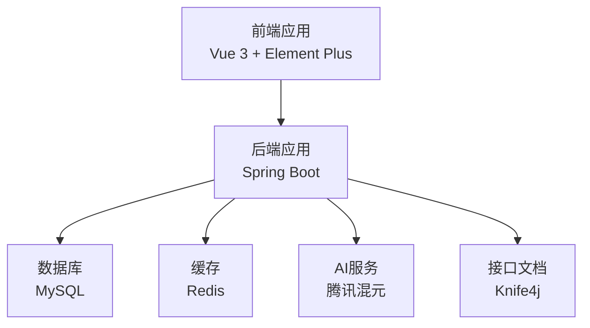
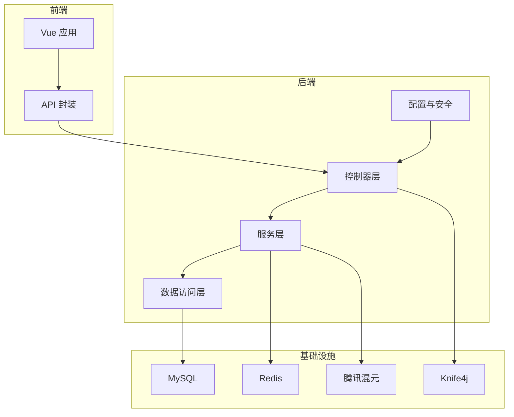
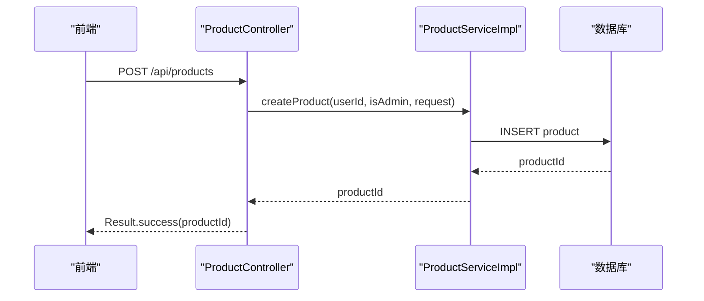
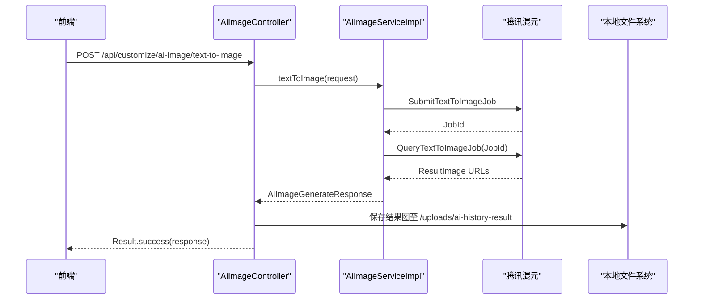
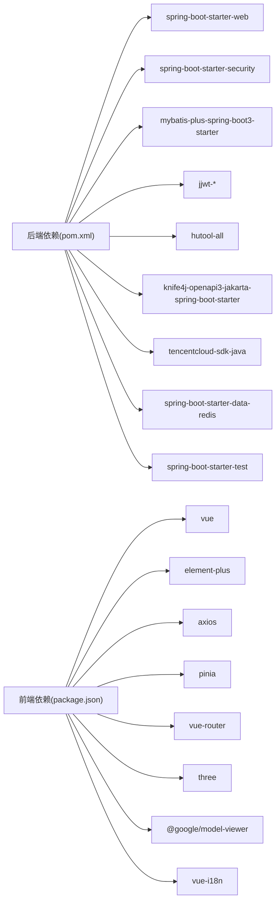

# 编码实现流程

<cite>
**本文引用的文件**
- [系统设计.md](file://TODO/系统设计.md)
- [商品模块开发任务清单.md](file://TODO/商品模块开发任务清单.md)
- [订单模块开发任务清单.md](file://TODO/订单模块开发任务清单.md)
- [非遗模块开发任务清单.md](file://TODO/非遗模块开发任务清单.md)
- [非遗智能定制模块开发任务清单.md](file://TODO/非遗智能定制模块开发任务清单.md)
- [接口清单表.md](file://TODO/接口清单表.md)
- [数据库设计.md](file://TODO/数据库设计.md)
- [Result.java](file://backend/src/main/java/com/heritage/common/Result.java)
- [GlobalExceptionHandler.java](file://backend/src/main/java/com/heritage/common/GlobalExceptionHandler.java)
- [BusinessException.java](file://backend/src/main/java/com/heritage/common/BusinessException.java)
- [pom.xml](file://backend/pom.xml)
- [package.json](file://frontend/package.json)
- [application.yml](file://backend/src/main/resources/application.yml)
- [ProductController.java](file://backend/src/main/java/com/heritage/controller/ProductController.java)
- [ProductServiceImpl.java](file://backend/src/main/java/com/heritage/service/impl/ProductServiceImpl.java)
- [AiImageController.java](file://backend/src/main/java/com/heritage/controller/AiImageController.java)
- [AiImageServiceImpl.java](file://backend/src/main/java/com/heritage/service/impl/AiImageServiceImpl.java)
</cite>

## 目录
1. [简介](#简介)
2. [项目结构](#项目结构)
3. [核心组件](#核心组件)
4. [架构总览](#架构总览)
5. [详细组件分析](#详细组件分析)
6. [依赖分析](#依赖分析)
7. [性能考虑](#性能考虑)
8. [故障排查指南](#故障排查指南)
9. [结论](#结论)
10. [附录](#附录)

## 简介
本文件面向“非遗产品智能定制商城系统”的开发团队，提供一套可落地的编码实现流程文档，覆盖任务分配机制、代码编写规范、本地测试流程、代码审查制度与合并流程管理，确保在保障代码质量的同时提升开发效率。

## 项目结构
系统采用前后端分离架构，后端基于 Spring Boot，前端基于 Vue 3 + Element Plus，数据库为 MySQL，辅以 Redis、Knife4j 文档与腾讯混元 AI 能力。项目模块化程度高，便于分阶段交付与维护。

图表来源
- [系统设计.md](file://TODO/系统设计.md#L23-L61)
- [application.yml](file://backend/src/main/resources/application.yml#L17-L35)

章节来源
- [系统设计.md](file://TODO/系统设计.md#L23-L61)
- [pom.xml](file://backend/pom.xml#L30-L109)
- [package.json](file://frontend/package.json#L10-L26)

## 核心组件
- 统一响应包装：Result<T> 提供统一的返回结构，简化前后端契约。
- 全局异常处理：GlobalExceptionHandler 将各类异常转换为统一的 Result 错误响应。
- 业务异常：BusinessException 用于承载业务错误码与消息。
- 控制器层：按模块划分控制器，如商品模块 ProductController、智能定制模块 AiImageController。
- 服务层：实现业务规则与权限校验，如商品 Service 的归属校验、AI 服务封装腾讯云 SDK。
- 配置与依赖：后端使用 Maven 管理依赖，前端使用 npm 管理依赖；应用配置集中于 application.yml。

章节来源
- [Result.java](file://backend/src/main/java/com/heritage/common/Result.java#L1-L44)
- [GlobalExceptionHandler.java](file://backend/src/main/java/com/heritage/common/GlobalExceptionHandler.java#L1-L62)
- [BusinessException.java](file://backend/src/main/java/com/heritage/common/BusinessException.java#L1-L20)
- [ProductController.java](file://backend/src/main/java/com/heritage/controller/ProductController.java#L1-L130)
- [ProductServiceImpl.java](file://backend/src/main/java/com/heritage/service/impl/ProductServiceImpl.java#L1-L507)
- [AiImageController.java](file://backend/src/main/java/com/heritage/controller/AiImageController.java#L1-L320)
- [AiImageServiceImpl.java](file://backend/src/main/java/com/heritage/service/impl/AiImageServiceImpl.java#L1-L430)
- [application.yml](file://backend/src/main/resources/application.yml#L1-L63)

## 架构总览
系统采用分层架构：前端负责视图与交互，后端负责业务与数据访问，数据库持久化数据，AI 服务提供智能定制能力，Knife4j 提供在线接口文档。

图表来源
- [系统设计.md](file://TODO/系统设计.md#L23-L61)
- [application.yml](file://backend/src/main/resources/application.yml#L17-L62)

## 详细组件分析

### 商品模块实现流程
- 任务分解：按数据库设计、实体/DTO/Service/Controller、前端 API 与页面对接、测试与优化分阶段推进。
- 权限与校验：服务层对商家归属进行严格校验，管理员可全量操作；状态字段仅允许 0/1。
- 数据一致性：删除商品时级联删除图片记录，确保数据完整性。
- 前端对接：管理端与前台分别暴露不同接口，管理端支持分页、筛选与图片管理。

图表来源
- [ProductController.java](file://backend/src/main/java/com/heritage/controller/ProductController.java#L33-L42)
- [ProductServiceImpl.java](file://backend/src/main/java/com/heritage/service/impl/ProductServiceImpl.java#L38-L53)

章节来源
- [商品模块开发任务清单.md](file://TODO/商品模块开发任务清单.md#L1-L160)
- [ProductController.java](file://backend/src/main/java/com/heritage/controller/ProductController.java#L1-L130)
- [ProductServiceImpl.java](file://backend/src/main/java/com/heritage/service/impl/ProductServiceImpl.java#L1-L507)
- [接口清单表.md](file://TODO/接口清单表.md#L43-L71)

### 智能定制模块实现流程
- 接口设计：文生图与图生图接口，历史记录分页接口，均要求登录态。
- AI 服务封装：统一调用腾讯混元 SDK，处理任务提交、轮询、错误映射与结果落盘。
- 文件落盘：参考图与结果图保存至 uploads 目录，支持远程 URL、data URL 与 Base64 三种来源解析。
- 参数规范：分辨率、强度、样式等参数进行范围与格式校验。

图表来源
- [AiImageController.java](file://backend/src/main/java/com/heritage/controller/AiImageController.java#L58-L97)
- [AiImageServiceImpl.java](file://backend/src/main/java/com/heritage/service/impl/AiImageServiceImpl.java#L52-L91)
- [application.yml](file://backend/src/main/resources/application.yml#L59-L62)

章节来源
- [非遗智能定制模块开发任务清单.md](file://TODO/非遗智能定制模块开发任务清单.md#L1-L114)
- [AiImageController.java](file://backend/src/main/java/com/heritage/controller/AiImageController.java#L1-L320)
- [AiImageServiceImpl.java](file://backend/src/main/java/com/heritage/service/impl/AiImageServiceImpl.java#L1-L430)
- [接口清单表.md](file://TODO/接口清单表.md#L153-L162)

### 订单与支付模块（概览）
- 购物车：支持加入、列表、数量与勾选更新、删除与汇总。
- 订单：从购物车创建订单，写入快照与地址快照，支持分页与详情。
- 支付：创建支付单并模拟收银台动作，幂等处理与失败规则由系统决定。
- 权限与校验：下单前校验勾选条目，支付单仅允许未支付状态发起。

章节来源
- [订单模块开发任务清单.md](file://TODO/订单模块开发任务清单.md#L1-L198)
- [接口清单表.md](file://TODO/接口清单表.md#L103-L140)

## 依赖分析
- 后端依赖：Spring Boot Web、Security、Validation、MyBatis-Plus、JWT、Hutool、Knife4j、腾讯云 SDK、Redis Starter、Test。
- 前端依赖：Vue 3、Element Plus、Axios、Pinia、Vue Router、Three.js、@google/model-viewer、vue-i18n。
- 配置：数据库连接、Redis、JWT 秘钥与过期、文件上传大小、AI 云配置、Knife4j 开启与语言。

图表来源
- [pom.xml](file://backend/pom.xml#L30-L109)
- [package.json](file://frontend/package.json#L10-L26)

章节来源
- [pom.xml](file://backend/pom.xml#L1-L129)
- [package.json](file://frontend/package.json#L1-L28)
- [application.yml](file://backend/src/main/resources/application.yml#L1-L63)

## 性能考虑
- 数据访问：合理使用索引与分页，避免 N+1 查询；批量查询用户名称与图片列表。
- AI 调用：任务轮询采用指数退避策略，最大等待时间与超时控制，避免阻塞接口。
- 文件落盘：支持多种来源解析，优先落盘本地以降低外部依赖风险；公网访问需配置 file.public-base-url。
- 缓存：Redis 可用于会话、验证码、热点数据缓存（按需启用）。

章节来源
- [ProductServiceImpl.java](file://backend/src/main/java/com/heritage/service/impl/ProductServiceImpl.java#L352-L400)
- [AiImageServiceImpl.java](file://backend/src/main/java/com/heritage/service/impl/AiImageServiceImpl.java#L380-L418)
- [application.yml](file://backend/src/main/resources/application.yml#L23-L35)

## 故障排查指南
- 统一错误响应：通过 GlobalExceptionHandler 将异常映射为 Result 错误，便于前端统一处理。
- 业务异常：使用 BusinessException 抛出业务错误，携带错误码与消息。
- 参数校验：MethodArgumentNotValidException 与 BindException 统一映射为字段级错误提示。
- AI 调用失败：捕获 TencentCloudSDKException 并进行消息截断与友好提示。
- 文件上传：multipart 配置限制单文件与总大小，超出将触发异常。

章节来源
- [GlobalExceptionHandler.java](file://backend/src/main/java/com/heritage/common/GlobalExceptionHandler.java#L1-L62)
- [BusinessException.java](file://backend/src/main/java/com/heritage/common/BusinessException.java#L1-L20)
- [AiImageServiceImpl.java](file://backend/src/main/java/com/heritage/service/impl/AiImageServiceImpl.java#L266-L280)
- [application.yml](file://backend/src/main/resources/application.yml#L12-L15)

## 结论
通过模块化任务分解、严格的权限与校验、统一的响应与异常处理、完善的接口文档与配置管理，系统在保证代码质量的同时提升了开发效率。建议持续完善测试与监控，逐步引入缓存与异步任务，以进一步提升性能与稳定性。

## 附录

### 任务分配机制与进度跟踪
- 阶段化推进：依据任务清单按阶段完成数据库设计、实体/DTO/Service/Controller、前端 API 与页面对接、测试与优化。
- 权限与归属：服务层对管理员与商家权限进行严格区分，确保数据安全。
- 进度可视化：使用任务清单勾选项与变更记录追踪完成度。

章节来源
- [商品模块开发任务清单.md](file://TODO/商品模块开发任务清单.md#L1-L160)
- [非遗模块开发任务清单.md](file://TODO/非遗模块开发任务清单.md#L1-L186)
- [非遗智能定制模块开发任务清单.md](file://TODO/非遗智能定制模块开发任务清单.md#L1-L114)

### 代码编写规范
- 命名约定：包名 com.heritage.*，类名采用 PascalCase，方法与变量采用 camelCase，常量全大写。
- 注释规范：使用 Swagger 注解标注接口用途与参数，控制器与服务方法提供简要说明。
- 统一返回：所有接口返回 Result<T>，错误使用统一异常处理器。
- 参数校验：使用 @Valid 与 DTO 校验，必要时在服务层补充业务校验。

章节来源
- [ProductController.java](file://backend/src/main/java/com/heritage/controller/ProductController.java#L15-L28)
- [AiImageController.java](file://backend/src/main/java/com/heritage/controller/AiImageController.java#L13-L26)
- [Result.java](file://backend/src/main/java/com/heritage/common/Result.java#L1-L44)
- [GlobalExceptionHandler.java](file://backend/src/main/java/com/heritage/common/GlobalExceptionHandler.java#L1-L62)

### 本地测试流程
- 单元测试：针对 Service 层业务规则与校验进行单元测试（如商品状态校验、图片封面维护）。
- 集成测试：使用 Knife4j 在本地启动后端，调用接口验证权限、参数与返回结构。
- 代码质量：使用 Maven Test 运行后端测试，前端使用 npm scripts 进行开发与构建。
- 本地环境验证：配置 application.yml 中数据库、Redis、JWT、AI 云参数，确保接口可访问。

章节来源
- [商品模块开发任务清单.md](file://TODO/商品模块开发任务清单.md#L111-L125)
- [订单模块开发任务清单.md](file://TODO/订单模块开发任务清单.md#L161-L180)
- [pom.xml](file://backend/pom.xml#L100-L109)
- [package.json](file://frontend/package.json#L5-L9)
- [application.yml](file://backend/src/main/resources/application.yml#L1-L63)

### 代码审查制度
- 审查标准：接口设计是否符合 RESTful、权限控制是否到位、异常处理是否统一、参数校验是否完整。
- 审查流程：提交 PR 前完成本地测试与代码质量检查，Reviewer 重点关注业务逻辑与可维护性。
- 反馈机制：Review comments 明确问题与修改建议，作者及时回复与修订。
- 问题修复跟踪：使用任务清单与变更记录跟踪问题闭环。

章节来源
- [接口清单表.md](file://TODO/接口清单表.md#L1-L222)
- [商品模块开发任务清单.md](file://TODO/商品模块开发任务清单.md#L111-L125)
- [非遗模块开发任务清单.md](file://TODO/非遗模块开发任务清单.md#L151-L167)

### 合并流程管理
- 分支策略：master/main 用于稳定发布，feature/* 用于功能开发，hotfix/* 用于紧急修复。
- 合并条件：通过 CI/本地测试、代码审查通过、无阻塞性问题。
- 冲突解决：优先 rebase 保持线性历史，冲突手动解决并验证。
- 版本发布准备：更新版本号、变更记录与数据库脚本，确保 Knife4j 文档同步。

章节来源
- [系统设计.md](file://TODO/系统设计.md#L1-L306)
- [数据库设计.md](file://TODO/数据库设计.md#L341-L356)