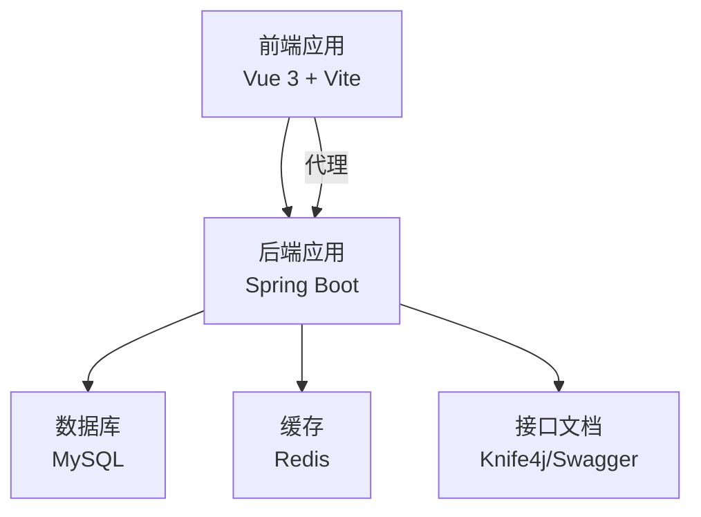
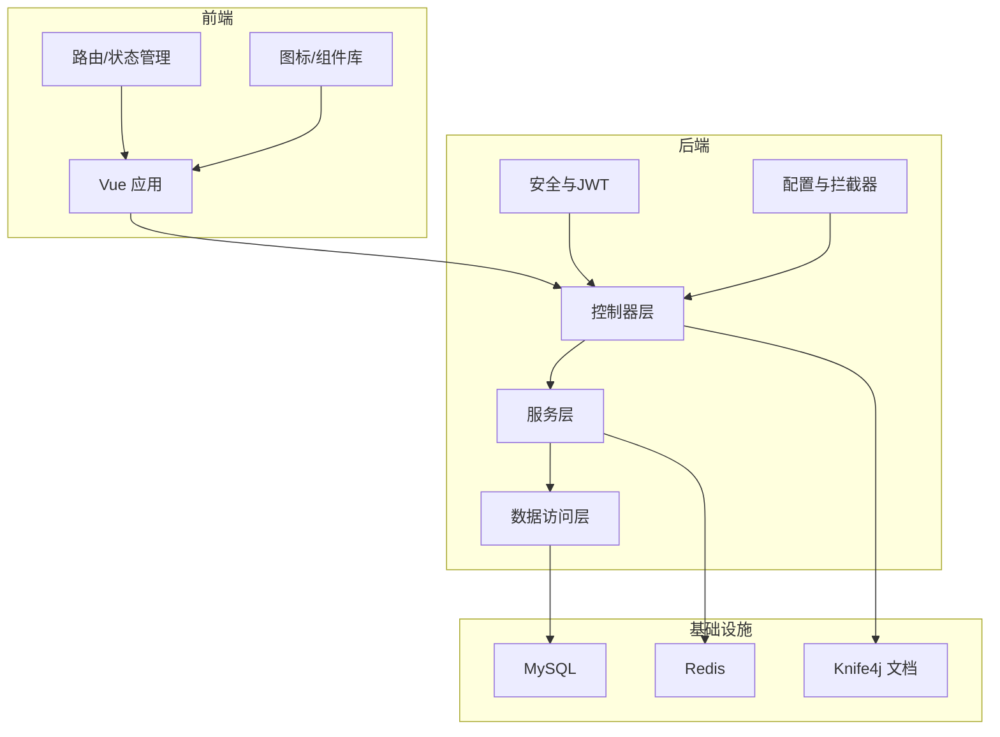
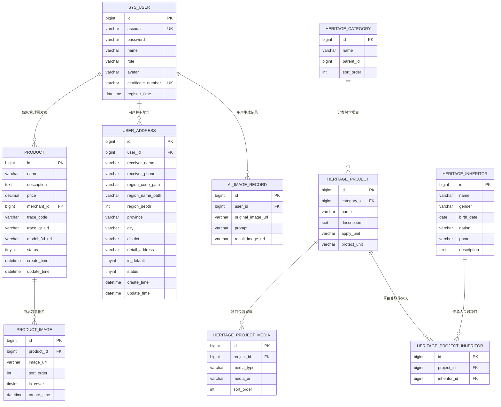
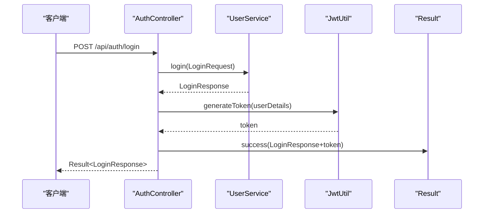
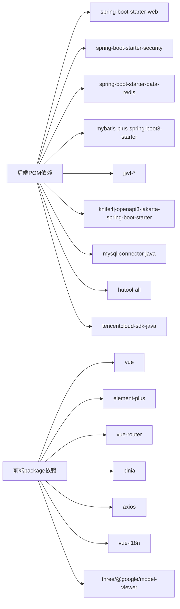

# 设计评审流程

<cite>
**本文引用的文件**   
- [系统设计.md](file://TODO/系统设计.md)
- [数据库设计.md](file://TODO/数据库设计.md)
- [接口清单表.md](file://TODO/接口清单表.md)
- [application.yml](file://backend/src/main/resources/application.yml)
- [pom.xml](file://backend/pom.xml)
- [SecurityConfig.java](file://backend/src/main/java/com/heritage/config/SecurityConfig.java)
- [MybatisPlusConfig.java](file://backend/src/main/java/com/heritage/config/MybatisPlusConfig.java)
- [RedisConfig.java](file://backend/src/main/java/com/heritage/config/RedisConfig.java)
- [GlobalExceptionHandler.java](file://backend/src/main/java/com/heritage/common/GlobalExceptionHandler.java)
- [Result.java](file://backend/src/main/java/com/heritage/common/Result.java)
- [AuthController.java](file://backend/src/main/java/com/heritage/controller/AuthController.java)
- [User.java](file://backend/src/main/java/com/heritage/entity/User.java)
- [Product.java](file://backend/src/main/java/com/heritage/entity/Product.java)
- [package.json](file://frontend/package.json)
- [vite.config.js](file://frontend/vite.config.js)
</cite>

## 目录
1. [引言](#引言)
2. [项目结构](#项目结构)
3. [核心组件](#核心组件)
4. [架构总览](#架构总览)
5. [详细组件分析](#详细组件分析)
6. [依赖分析](#依赖分析)
7. [性能考虑](#性能考虑)
8. [故障排查指南](#故障排查指南)
9. [结论](#结论)
10. [附录](#附录)

## 引言
本设计评审流程面向“非遗产品智能定制商城系统”，聚焦于架构设计评审、数据库设计评审、接口设计评审、UI设计评审与评审标准/评分体系，确保系统在技术选型、性能、安全、一致性与可维护性方面满足设计目标与实现要求。

## 项目结构
系统采用前后端分离架构，后端基于 Spring Boot，前端基于 Vue 3 + Vite，数据库为 MySQL，缓存为 Redis，接口文档通过 Knife4j/OpenAPI 提供。

图表来源
- [application.yml](file://backend/src/main/resources/application.yml#L1-L63)
- [pom.xml](file://backend/pom.xml#L1-L129)
- [vite.config.js](file://frontend/vite.config.js#L1-L22)

章节来源
- [系统设计.md](file://TODO/系统设计.md#L23-L61)
- [application.yml](file://backend/src/main/resources/application.yml#L1-L63)
- [pom.xml](file://backend/pom.xml#L1-L129)
- [vite.config.js](file://frontend/vite.config.js#L1-L22)

## 核心组件
- 后端框架与配置
  - Spring Boot + Spring Security + JWT：认证鉴权与无状态会话
  - MyBatis-Plus：分页、乐观锁、SQL注入防护
  - Knife4j：OpenAPI/Swagger 文档
  - Redis：缓存（按需启用）
- 前端框架与工具
  - Vue 3 + Element Plus + Vue Router + Pinia
  - Vite 代理后端接口，本地开发环境友好
- 统一响应与异常处理
  - Result<T> 统一响应体
  - GlobalExceptionHandler 全局异常处理

章节来源
- [SecurityConfig.java](file://backend/src/main/java/com/heritage/config/SecurityConfig.java#L1-L67)
- [MybatisPlusConfig.java](file://backend/src/main/java/com/heritage/config/MybatisPlusConfig.java#L1-L31)
- [RedisConfig.java](file://backend/src/main/java/com/heritage/config/RedisConfig.java#L1-L46)
- [GlobalExceptionHandler.java](file://backend/src/main/java/com/heritage/common/GlobalExceptionHandler.java#L1-L62)
- [Result.java](file://backend/src/main/java/com/heritage/common/Result.java#L1-L44)
- [application.yml](file://backend/src/main/resources/application.yml#L1-L63)
- [pom.xml](file://backend/pom.xml#L1-L129)
- [package.json](file://frontend/package.json#L1-L28)

## 架构总览
系统采用前后端分离，RESTful API 作为交互协议，JWT 无状态鉴权贯穿全链路，数据库与缓存分别承担持久化与性能优化职责。

图表来源
- [application.yml](file://backend/src/main/resources/application.yml#L1-L63)
- [pom.xml](file://backend/pom.xml#L1-L129)
- [SecurityConfig.java](file://backend/src/main/java/com/heritage/config/SecurityConfig.java#L1-L67)
- [MybatisPlusConfig.java](file://backend/src/main/java/com/heritage/config/MybatisPlusConfig.java#L1-L31)
- [RedisConfig.java](file://backend/src/main/java/com/heritage/config/RedisConfig.java#L1-L46)

## 详细组件分析

### 架构设计评审
- 系统架构合理性
  - 前后端分离、RESTful API、无状态认证，契合现代 Web 架构
  - 前端通过 Vite 代理后端接口，开发体验良好
- 技术选型验证
  - 后端：Spring Boot、Spring Security、JWT、MyBatis-Plus、Knife4j、Redis
  - 前端：Vue 3、Element Plus、Vite、Pinia、Vue Router
  - 数据库：MySQL，缓存：Redis
- 性能考虑
  - MyBatis-Plus 分页拦截器、乐观锁拦截器、SQL 注入防护
  - Redis 序列化配置与连接池参数
- 安全设计
  - CSRF 关闭、Session 策略无状态、匿名放行路径明确
  - 全局异常处理覆盖认证/权限/参数校验等

章节来源
- [系统设计.md](file://TODO/系统设计.md#L23-L61)
- [application.yml](file://backend/src/main/resources/application.yml#L1-L63)
- [pom.xml](file://backend/pom.xml#L1-L129)
- [SecurityConfig.java](file://backend/src/main/java/com/heritage/config/SecurityConfig.java#L1-L67)
- [MybatisPlusConfig.java](file://backend/src/main/java/com/heritage/config/MybatisPlusConfig.java#L1-L31)
- [RedisConfig.java](file://backend/src/main/java/com/heritage/config/RedisConfig.java#L1-L46)
- [GlobalExceptionHandler.java](file://backend/src/main/java/com/heritage/common/GlobalExceptionHandler.java#L1-L62)

### 数据库设计评审
- ER 模型验证
  - 用户与商品、地址、非遗项目、AI 生图记录存在清晰一对多/多对多关系
  - 通过外键与索引保障数据一致性与查询效率
- 表结构设计
  - sys_user：账户、角色、实名认证字段、注册时间
  - product/product_image：商品与图片关联、封面与排序
  - user_address：地区路径与冗余字段，兼容多级行政区与海外
  - heritage_*：分类、项目、媒体、传承人与关系表
  - ai_image_record：定制历史记录，字段简洁利于前端展示
- 索引策略
  - 主键 + 唯一索引 + 辅助索引，覆盖高频查询与过滤条件
- 数据完整性约束
  - 字段长度、允许空值、默认值、枚举范围（如商品状态、地址状态）

图表来源
- [数据库设计.md](file://TODO/数据库设计.md#L327-L337)

章节来源
- [数据库设计.md](file://TODO/数据库设计.md#L1-L370)

### 接口设计评审
- API 规范一致性
  - RESTful 风格，路径语义化，统一前缀 /api
- 参数设计合理性
  - 分页参数 page/size，过滤参数 keyword/name/status 等
  - JWT 认证头 Authorization: Bearer <token>
- 错误处理机制
  - 全局异常处理覆盖认证/权限/参数校验/业务异常
  - 统一响应体 Result<T>，包含 code/message/data
- 版本兼容性
  - 接口清单表记录了变更与兼容性说明，便于演进

图表来源
- [AuthController.java](file://backend/src/main/java/com/heritage/controller/AuthController.java#L1-L48)
- [Result.java](file://backend/src/main/java/com/heritage/common/Result.java#L1-L44)

章节来源
- [接口清单表.md](file://TODO/接口清单表.md#L1-L222)
- [GlobalExceptionHandler.java](file://backend/src/main/java/com/heritage/common/GlobalExceptionHandler.java#L1-L62)
- [Result.java](file://backend/src/main/java/com/heritage/common/Result.java#L1-L44)

### UI 设计评审
- 用户体验设计
  - 前端采用 Element Plus 组件库，提供一致的交互与视觉风格
  - 路由与状态管理（Pinia）支撑复杂页面与用户态
- 界面一致性
  - 组件化开发，主题与样式集中管理
- 响应式布局
  - 基于 Vue 3 的响应式特性，配合 Element Plus 实现跨设备适配
- 无障碍设计
  - 建议补充键盘导航、ARIA 标签与色彩对比度检查，以提升可访问性

章节来源
- [package.json](file://frontend/package.json#L1-L28)
- [vite.config.js](file://frontend/vite.config.js#L1-L22)

## 依赖分析
- 后端依赖
  - Web、Validation、Security、Redis、MySQL、MyBatis-Plus、JWT、Knife4j、Hutool、腾讯云 SDK
- 前端依赖
  - Vue 3、Element Plus、Vue Router、Pinia、Axios、i18n、Three.js/model-viewer

图表来源
- [pom.xml](file://backend/pom.xml#L1-L129)
- [package.json](file://frontend/package.json#L1-L28)

章节来源
- [pom.xml](file://backend/pom.xml#L1-L129)
- [package.json](file://frontend/package.json#L1-L28)

## 性能考虑
- 数据访问层
  - MyBatis-Plus 分页拦截器限制最大每页 500 条，防止超大分页
  - 乐观锁拦截器降低并发写冲突风险
  - SQL 注入防护拦截器阻断非法 SQL
- 缓存与序列化
  - RedisTemplate 使用 Jackson 序列化，支持对象类型安全存储
  - 连接池参数合理，避免资源耗尽
- 接口与文档
  - Knife4j 文档便于联调与压测，减少接口返工成本

章节来源
- [MybatisPlusConfig.java](file://backend/src/main/java/com/heritage/config/MybatisPlusConfig.java#L1-L31)
- [RedisConfig.java](file://backend/src/main/java/com/heritage/config/RedisConfig.java#L1-L46)
- [application.yml](file://backend/src/main/resources/application.yml#L1-L63)

## 故障排查指南
- 认证与权限
  - 401 未登录/过期：检查 Authorization 头是否正确传递
  - 403 无权限：核对用户角色与接口权限配置
- 参数校验
  - 参数校验失败：关注 MethodArgumentNotValidException/BindException 的字段错误信息
- 业务异常
  - BusinessException：捕获并返回具体业务提示
- 全局异常
  - 其他异常：统一返回系统异常提示，便于定位

章节来源
- [GlobalExceptionHandler.java](file://backend/src/main/java/com/heritage/common/GlobalExceptionHandler.java#L1-L62)
- [SecurityConfig.java](file://backend/src/main/java/com/heritage/config/SecurityConfig.java#L1-L67)

## 结论
系统在架构、技术栈、接口规范与数据库设计方面均体现出良好的工程实践。建议在后续评审中重点关注：
- 安全加固：生产环境关闭匿名放行路径、完善 CORS 与限流策略
- 性能优化：引入 Redis 缓存热点数据、慢查询分析与索引优化
- 可靠性：完善监控告警、日志分级与异常追踪
- 易用性：补充无障碍设计与国际化文案

## 附录
- 评审标准与评分体系（建议）
  - 架构合理性（权重 25%）：前后端分离、无状态认证、模块边界清晰
  - 技术选型（权重 20%）：成熟稳定、生态完善、团队熟悉度
  - 性能与可扩展性（权重 20%）：分页/缓存/索引/异步化
  - 安全性（权重 20%）：认证授权、参数校验、敏感信息保护
  - 可维护性（权重 15%）：统一响应、异常处理、文档与注释
  - 评分等级：优秀（≥90）、良好（80-89）、合格（60-79）、待改进（<60）