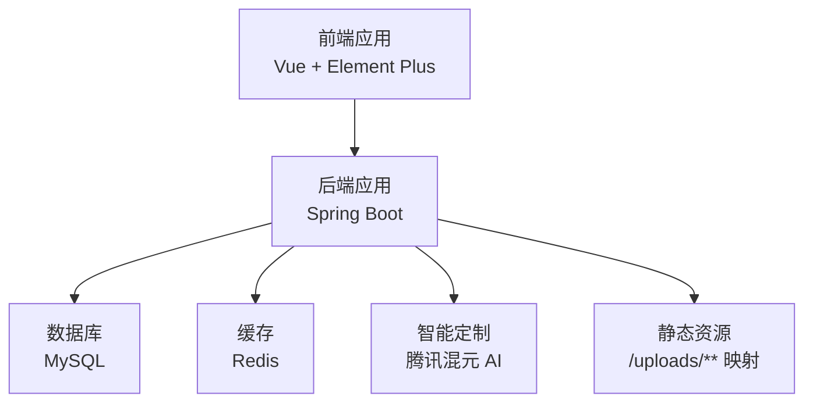
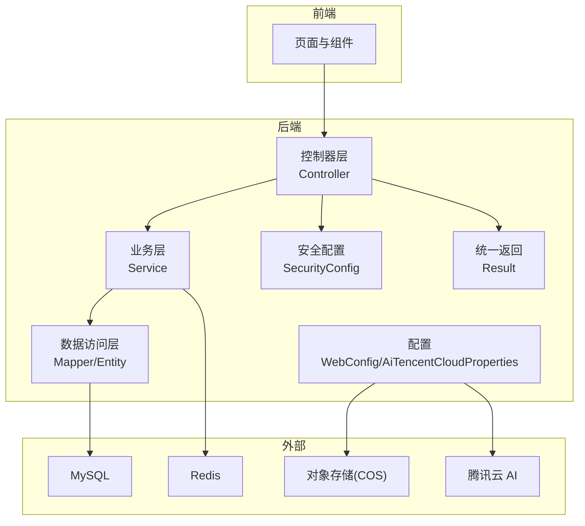
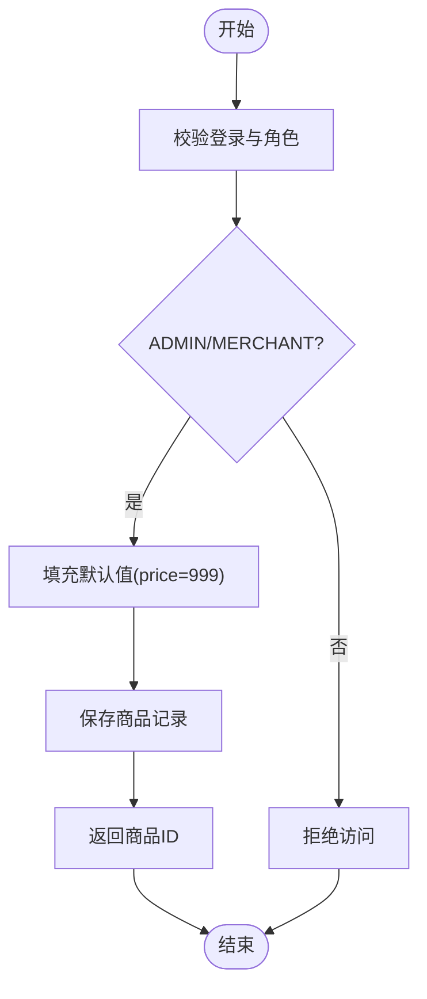
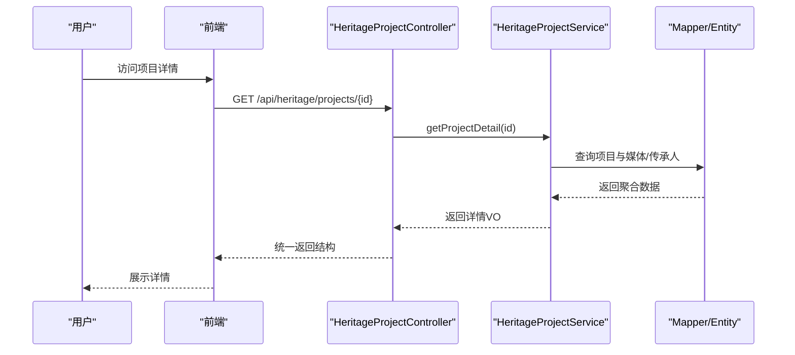
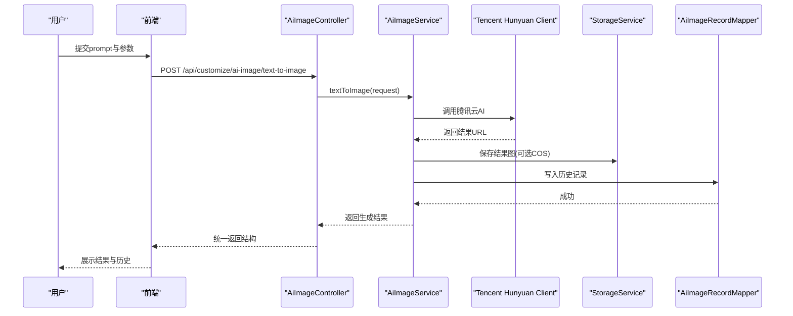
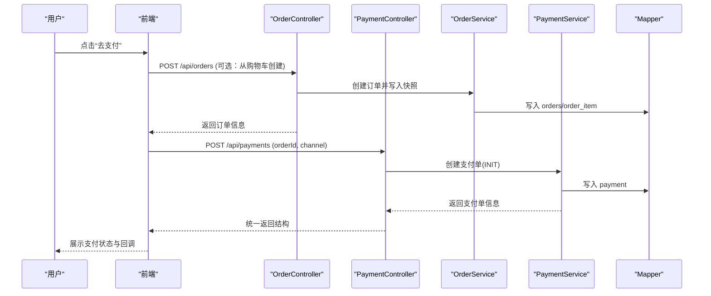
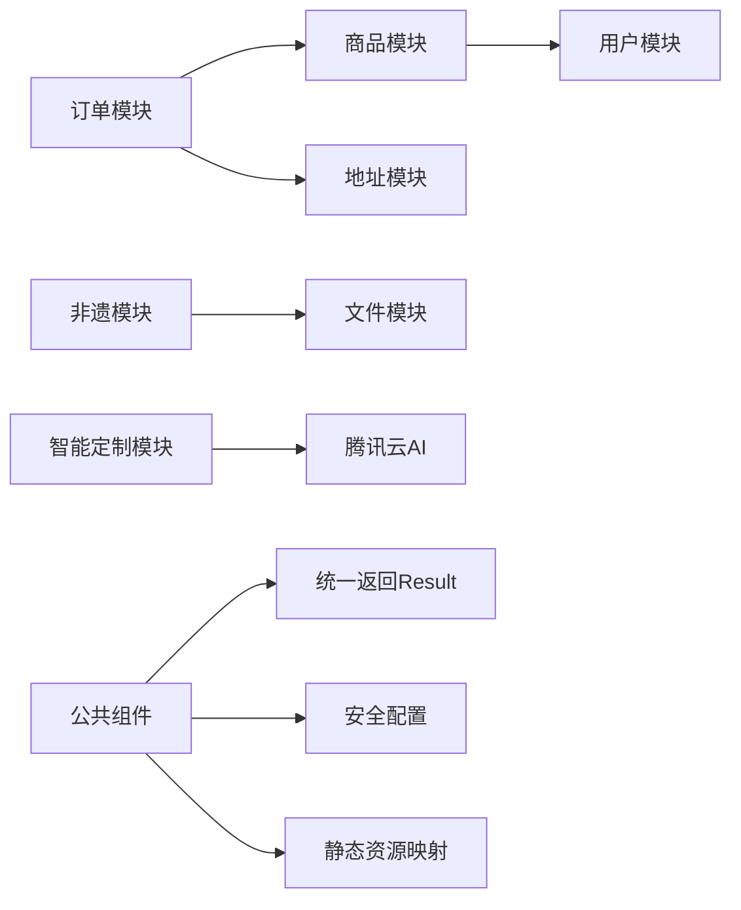

# 需求分析流程

<cite>
**本文引用的文件**
- [系统设计.md](file://TODO/系统设计.md)
- [非遗模块开发任务清单.md](file://TODO/非遗模块开发任务清单.md)
- [非遗智能定制模块开发任务清单.md](file://TODO/非遗智能定制模块开发任务清单.md)
- [商品模块开发任务清单.md](file://TODO/商品模块开发任务清单.md)
- [订单模块开发任务清单.md](file://TODO/订单模块开发任务清单.md)
- [数据库设计.md](file://TODO/数据库设计.md)
- [接口清单表.md](file://TODO/接口清单表.md)
- [商品模块设计方案.md](file://TODO/商品模块设计方案.md)
- [Result.java](file://backend/src/main/java/com/heritage/common/Result.java)
- [WebConfig.java](file://backend/src/main/java/com/heritage/config/WebConfig.java)
- [SecurityConfig.java](file://backend/src/main/java/com/heritage/config/SecurityConfig.java)
- [AiTencentCloudProperties.java](file://backend/src/main/java/com/heritage/config/AiTencentCloudProperties.java)
- [application.yml](file://backend/src/main/resources/application.yml)
</cite>

## 目录
1. [简介](#简介)
2. [项目结构](#项目结构)
3. [核心组件](#核心组件)
4. [架构总览](#架构总览)
5. [详细组件分析](#详细组件分析)
6. [依赖分析](#依赖分析)
7. [性能考虑](#性能考虑)
8. [故障排查指南](#故障排查指南)
9. [结论](#结论)
10. [附录](#附录)

## 简介
本需求分析流程文档面向“非遗产品智能定制商城系统”，基于仓库现有设计文档与任务清单，系统化梳理需求收集、评审、管理与验证方法，确保需求完整准确，为后续设计与开发奠定坚实基础。文档同时给出可操作的流程图与时序图，帮助跨部门协作与质量管控。

## 项目结构
系统采用前后端分离架构，后端基于 Spring Boot，前端基于 Vue + Element Plus，数据库为 MySQL，集成 Redis、JWT、OpenAPI/Swagger 等技术栈。核心模块包括用户与权限、商品与商城、交易链路、非遗文化、智能定制、文件管理等。

**图表来源**
- [系统设计.md](file://TODO/系统设计.md#L23-L61)
- [application.yml](file://backend/src/main/resources/application.yml#L17-L28)
- [WebConfig.java](file://backend/src/main/java/com/heritage/config/WebConfig.java#L16-L21)

**章节来源**
- [系统设计.md](file://TODO/系统设计.md#L7-L61)
- [application.yml](file://backend/src/main/resources/application.yml#L1-L63)

## 核心组件
- 用户与权限模块：注册登录、个人中心、管理员用户管理、实名认证、JWT + Spring Security。
- 商品与商城模块：商品管理（管理员/商家）、前台展示（随机推荐、详情）。
- 交易链路模块：购物车、收货地址、订单、支付。
- 非遗文化模块：分类、项目、传承人，含管理端与公开接口。
- 智能定制模块：AI 文生图/图生图、历史记录、参数规范与存储。
- 文件管理模块：文件上传与静态资源访问。

**章节来源**
- [系统设计.md](file://TODO/系统设计.md#L64-L74)
- [接口清单表.md](file://TODO/接口清单表.md#L1-L222)

## 架构总览
系统采用 RESTful API 分层设计，统一返回结构 Result<T>，安全层通过 JWT + 方法级权限控制，静态资源通过 WebMvcConfigurer 映射到本地 uploads 目录，AI 能力通过腾讯云 AIART 接口封装。

**图表来源**
- [Result.java](file://backend/src/main/java/com/heritage/common/Result.java#L7-L43)
- [SecurityConfig.java](file://backend/src/main/java/com/heritage/config/SecurityConfig.java#L50-L65)
- [WebConfig.java](file://backend/src/main/java/com/heritage/config/WebConfig.java#L16-L21)
- [AiTencentCloudProperties.java](file://backend/src/main/java/com/heritage/config/AiTencentCloudProperties.java#L9-L19)
- [application.yml](file://backend/src/main/resources/application.yml#L43-L62)

## 详细组件分析

### 需求收集方法
- 用户访谈：针对非遗传承人、商家、普通用户与管理员，收集使用痛点、期望功能与交互偏好。
- 竞品分析：分析电商与文化类平台的非遗专区、定制流程与支付闭环，提炼差异化价值点。
- 市场调研：结合非遗政策、消费趋势与数字化转型需求，识别潜在增长机会。
- 现状盘点：基于任务清单与数据库设计，梳理已有功能边界与待实现项，形成需求基线。

**章节来源**
- [非遗模块开发任务清单.md](file://TODO/非遗模块开发任务清单.md#L1-L186)
- [非遗智能定制模块开发任务清单.md](file://TODO/非遗智能定制模块开发任务清单.md#L1-L114)
- [商品模块开发任务清单.md](file://TODO/商品模块开发任务清单.md#L1-L160)
- [订单模块开发任务清单.md](file://TODO/订单模块开发任务清单.md#L1-L198)
- [数据库设计.md](file://TODO/数据库设计.md#L1-L370)

### 需求评审流程
- 需求文档编写规范
  - 结构化模板：背景与目标、范围与边界、功能需求、非功能需求、接口与数据模型、风险与假设。
  - 可追溯性：每个需求绑定唯一编号与来源文件（如任务清单、数据库设计）。
  - 一致性：与接口清单表、实体类设计保持字段与约束一致。
- 评审标准制定
  - 完整性：是否覆盖用户旅程与业务场景。
  - 一致性：与现有数据库与接口设计是否一致。
  - 可行性：技术实现难度与资源投入评估。
  - 优先级：业务价值与紧急程度分级。
- 跨部门评审会议
  - 参会方：产品经理、架构师、后端/前端负责人、测试代表、运维代表。
  - 输出：评审意见、修订建议、决策结论与责任人。
- 需求变更评估机制
  - 变更申请 → 影响评估（范围/成本/排期）→ 评审决策 → 变更实施 → 回归验证 → 文档更新。

**章节来源**
- [接口清单表.md](file://TODO/接口清单表.md#L1-L222)
- [数据库设计.md](file://TODO/数据库设计.md#L1-L370)

### 需求文档管理体系
- 需求追踪矩阵
  - 需求ID → 模块/功能 → 接口/实体 → 任务清单项 → 测试用例 → 状态。
- 需求优先级排序
  - 采用紧急性×重要性矩阵：核心交易链路（订单/支付/购物车）优先；非遗文化与智能定制次之；扩展功能延后。
- 需求版本控制
  - 采用 Git 管理，分支策略：develop（迭代）、release（发布）、hotfix（紧急修复）；文档随版本打标签。

**章节来源**
- [系统设计.md](file://TODO/系统设计.md#L64-L74)
- [接口清单表.md](file://TODO/接口清单表.md#L1-L222)

### 需求验证方法
- 原型验证：基于现有页面与接口，验证核心流程（登录→非遗列表→项目详情→定制→下单→支付）。
- 用户故事验收：以用户角色视角编写验收条件，如“登录用户可查看非遗分类树与项目列表”。
- 需求确认流程：需求评审通过后形成《需求确认书》，签字归档，作为后续开发与测试依据。

**章节来源**
- [非遗模块开发任务清单.md](file://TODO/非遗模块开发任务清单.md#L118-L148)
- [非遗智能定制模块开发任务清单.md](file://TODO/非遗智能定制模块开发任务清单.md#L73-L81)

### 商品模块需求分析
- 功能需求
  - 管理端：商品新增/编辑/删除/上下架、图片管理、分页查询与筛选。
  - 前台：随机推荐商品、商品详情展示（封面、图片、描述、溯源、3D）。
- 非功能需求
  - 安全：JWT + 角色授权；商家操作归属校验。
  - 性能：索引优化；可选缓存。
  - 可维护性：分层清晰、统一返回结构。
- 数据模型
  - product 与 product_image 一对多；merchant_id 关联 sys_user。
- 接口与实现
  - 管理端：/api/products、/api/products/{id}、/api/products/{id}/status、/api/products/{id}/images 等。
  - 前台：/api/shop/recommend、/api/shop/products/{id}。
- 流程图（新增商品）

**图表来源**
- [商品模块开发任务清单.md](file://TODO/商品模块开发任务清单.md#L32-L44)
- [商品模块设计方案.md](file://TODO/商品模块设计方案.md#L14-L63)

**章节来源**
- [商品模块开发任务清单.md](file://TODO/商品模块开发任务清单.md#L1-L160)
- [商品模块设计方案.md](file://TODO/商品模块设计方案.md#L1-L470)
- [接口清单表.md](file://TODO/接口清单表.md#L43-L72)

### 非遗文化模块需求分析
- 功能需求
  - 公开接口：分类树、项目分页列表、项目详情、传承人详情。
  - 管理端接口：分类树/类型新增、项目 CRUD、项目媒体增删改、传承人 CRUD。
- 数据模型
  - heritage_category、heritage_project、heritage_project_media、heritage_inheritor、heritage_project_inheritor。
- 接口与实现
  - 公开：/api/heritage/categories/tree、/api/heritage/projects、/api/heritage/projects/{id}、/api/heritage/inheritors/{id}。
  - 管理端：/api/admin/heritage/**。
- 时序图（项目详情）

**图表来源**
- [非遗模块开发任务清单.md](file://TODO/非遗模块开发任务清单.md#L68-L99)
- [接口清单表.md](file://TODO/接口清单表.md#L165-L200)
- [数据库设计.md](file://TODO/数据库设计.md#L237-L322)

**章节来源**
- [非遗模块开发任务清单.md](file://TODO/非遗模块开发任务清单.md#L1-L186)
- [接口清单表.md](file://TODO/接口清单表.md#L165-L200)
- [数据库设计.md](file://TODO/数据库设计.md#L237-L322)

### 智能定制模块需求分析
- 功能需求
  - 文生图/图生图接口、历史记录分页、参数规范（resolution/count/strength 等）。
- 数据模型
  - ai_image_record：记录 user_id、original_image_url、prompt、result_image_url。
- 接口与实现
  - /api/customize/ai-image/text-to-image、/api/customize/ai-image/image-to-image、/api/customize/ai-image/records。
- 时序图（文生图）

**图表来源**
- [非遗智能定制模块开发任务清单.md](file://TODO/非遗智能定制模块开发任务清单.md#L53-L61)
- [接口清单表.md](file://TODO/接口清单表.md#L153-L162)
- [AiTencentCloudProperties.java](file://backend/src/main/java/com/heritage/config/AiTencentCloudProperties.java#L9-L19)
- [application.yml](file://backend/src/main/resources/application.yml#L43-L53)

**章节来源**
- [非遗智能定制模块开发任务清单.md](file://TODO/非遗智能定制模块开发任务清单.md#L1-L114)
- [接口清单表.md](file://TODO/接口清单表.md#L153-L162)
- [数据库设计.md](file://TODO/数据库设计.md#L179-L199)

### 订单与支付模块需求分析
- 功能需求
  - 购物车：加入/列表/修改数量/勾选/删除/汇总。
  - 订单：从购物车创建、分页列表、详情、取消。
  - 支付：创建支付单、查询状态、模拟收银台确认/取消。
- 数据模型
  - cart_item、orders、order_item、payment；唯一约束与索引设计。
- 接口与实现
  - /api/cart/**、/api/orders、/api/payments。
- 时序图（创建支付单）

**图表来源**
- [订单模块开发任务清单.md](file://TODO/订单模块开发任务清单.md#L93-L117)
- [接口清单表.md](file://TODO/接口清单表.md#L118-L140)

**章节来源**
- [订单模块开发任务清单.md](file://TODO/订单模块开发任务清单.md#L1-L198)
- [接口清单表.md](file://TODO/接口清单表.md#L118-L140)

## 依赖分析
- 模块耦合
  - 商品模块与用户模块通过 merchant_id 关联；订单模块与商品/地址模块通过快照解耦。
  - 非遗模块与文件模块通过 URL 解耦，媒体类型通过枚举区分。
- 外部依赖
  - 腾讯云 AI：SecretId/SecretKey/Region/Endpoint 通过配置注入。
  - 静态资源：/uploads/** 通过 WebConfig 映射本地目录。
- 安全依赖
  - JWT + Spring Security 实现无状态认证与方法级授权。

**图表来源**
- [数据库设计.md](file://TODO/数据库设计.md#L325-L337)
- [AiTencentCloudProperties.java](file://backend/src/main/java/com/heritage/config/AiTencentCloudProperties.java#L9-L19)
- [WebConfig.java](file://backend/src/main/java/com/heritage/config/WebConfig.java#L16-L21)
- [SecurityConfig.java](file://backend/src/main/java/com/heritage/config/SecurityConfig.java#L50-L65)
- [Result.java](file://backend/src/main/java/com/heritage/common/Result.java#L7-L43)

**章节来源**
- [数据库设计.md](file://TODO/数据库设计.md#L325-L337)
- [application.yml](file://backend/src/main/resources/application.yml#L43-L62)

## 性能考虑
- 数据库层面
  - 为高频查询字段建立索引（如 user_id、merchant_id、status、category_id 等）。
  - 合理使用唯一约束（order_no、pay_no）避免重复与回溯。
- 接口与缓存
  - 列表页可引入 Redis 缓存热点数据（如分类树、推荐商品）。
  - 文件访问通过 /uploads/** 直接映射，减少中间层开销。
- 业务流程
  - 购物车/订单/支付链路尽量幂等，避免重复创建与状态不一致。
  - AI 生成任务建议异步化，避免接口超时。

[本节为通用性能建议，无需特定文件来源]

## 故障排查指南
- 统一返回结构
  - 后端统一使用 Result<T>，便于前端一致化处理与错误捕获。
- 安全与权限
  - 未登录或权限不足将被拦截，检查 Authorization 头与角色配置。
- 文件访问
  - 确认 file.upload.path 与 PUBLIC_BASE_URL 配置，静态资源映射路径正确。
- AI 集成
  - 检查腾讯云 SecretId/SecretKey/Region/Endpoint 配置是否正确。
- 接口调试
  - 使用 Knife4j/Swagger 在线调试，核对请求参数与返回结构。

**章节来源**
- [Result.java](file://backend/src/main/java/com/heritage/common/Result.java#L18-L42)
- [SecurityConfig.java](file://backend/src/main/java/com/heritage/config/SecurityConfig.java#L50-L65)
- [WebConfig.java](file://backend/src/main/java/com/heritage/config/WebConfig.java#L16-L21)
- [AiTencentCloudProperties.java](file://backend/src/main/java/com/heritage/config/AiTencentCloudProperties.java#L9-L19)
- [application.yml](file://backend/src/main/resources/application.yml#L54-L62)

## 结论
通过系统化的“需求收集—评审—管理—验证”流程，结合任务清单与数据库设计，能够有效保障非遗产品智能定制商城系统的需求完整性与可追溯性。建议在后续迭代中持续完善需求追踪矩阵与变更评估机制，确保跨团队协作高效、交付质量稳定。

[本节为总结性内容，无需特定文件来源]

## 附录
- 需求基线来源
  - 商品模块：任务清单与设计方案。
  - 非遗模块：任务清单与数据库设计。
  - 智能定制模块：任务清单与接口清单。
  - 订单模块：任务清单与接口清单。
  - 数据模型：数据库设计文档。

**章节来源**
- [商品模块开发任务清单.md](file://TODO/商品模块开发任务清单.md#L1-L160)
- [非遗模块开发任务清单.md](file://TODO/非遗模块开发任务清单.md#L1-L186)
- [非遗智能定制模块开发任务清单.md](file://TODO/非遗智能定制模块开发任务清单.md#L1-L114)
- [订单模块开发任务清单.md](file://TODO/订单模块开发任务清单.md#L1-L198)
- [数据库设计.md](file://TODO/数据库设计.md#L1-L370)
- [接口清单表.md](file://TODO/接口清单表.md#L1-L222)