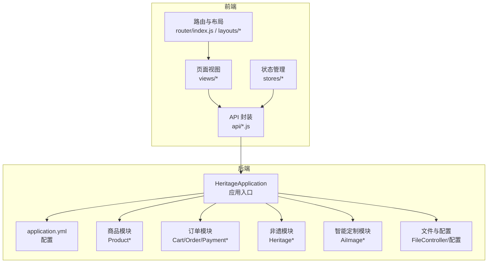
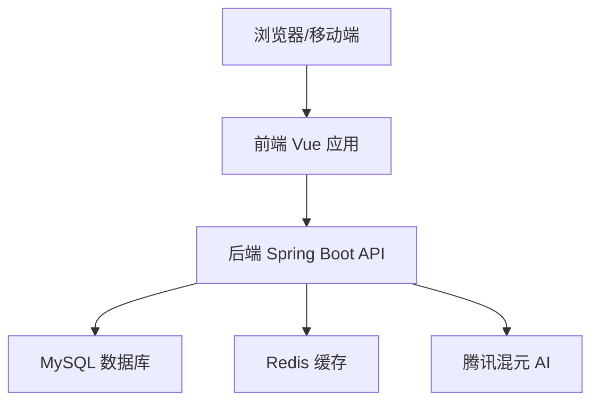
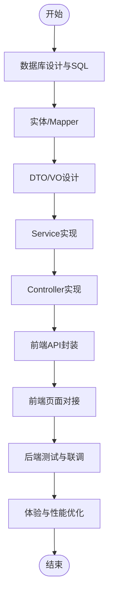
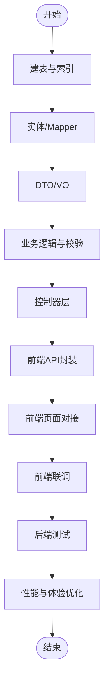
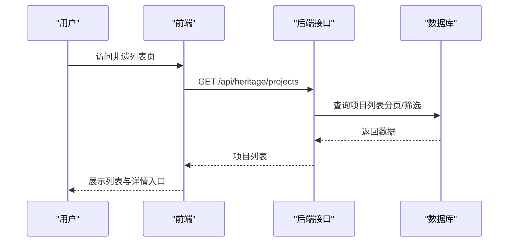
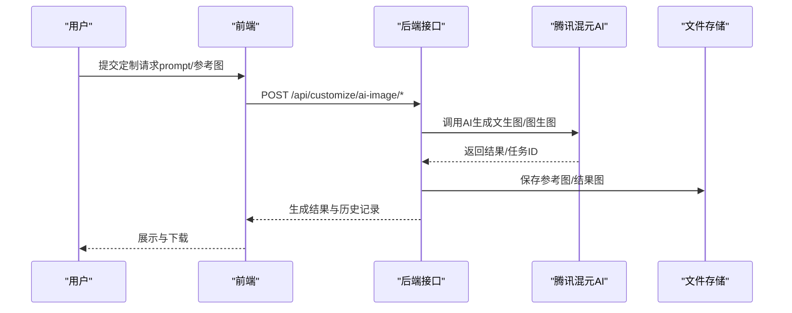
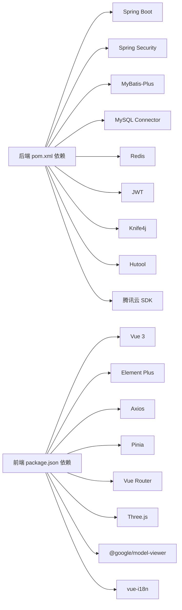

# 项目进度跟踪

<cite>
**本文引用的文件**   
- [系统设计.md](file://TODO/系统设计.md)
- [数据库设计.md](file://TODO/数据库设计.md)
- [接口清单表.md](file://TODO/接口清单表.md)
- [商品模块开发任务清单.md](file://TODO/商品模块开发任务清单.md)
- [订单模块开发任务清单.md](file://TODO/订单模块开发任务清单.md)
- [非遗智能定制模块开发任务清单.md](file://TODO/非遗智能定制模块开发任务清单.md)
- [非遗模块开发任务清单.md](file://TODO/非遗模块开发任务清单.md)
- [问题记录.md](file://TODO/问题记录.md)
- [待优化.md](file://TODO/待优化.md)
- [HeritageApplication.java](file://backend/src/main/java/com/heritage/HeritageApplication.java)
- [application.yml](file://backend/src/main/resources/application.yml)
- [pom.xml](file://backend/pom.xml)
- [package.json](file://frontend/package.json)
</cite>

## 目录
1. [简介](#简介)
2. [项目结构](#项目结构)
3. [核心组件](#核心组件)
4. [架构总览](#架构总览)
5. [详细组件分析](#详细组件分析)
6. [依赖分析](#依赖分析)
7. [性能考虑](#性能考虑)
8. [故障排查指南](#故障排查指南)
9. [结论](#结论)
10. [附录](#附录)

## 简介
本项目为“非遗产品智能定制商城系统”，采用前后端分离架构，后端基于 Spring Boot，前端基于 Vue 3 + Element Plus，集成腾讯混元 AI 进行智能定制（文生图/图生图），并提供非遗文化内容展示、商品管理、订单与支付、收货地址、文件上传等功能。本文档聚焦项目进度跟踪，涵盖甘特图制作、里程碑跟踪、关键路径分析、进度偏差识别、风险管理、质量保证、沟通协调与变更控制，确保项目按期高质量交付。

## 项目结构
项目采用模块化组织，核心目录与职责如下：
- backend：后端工程，包含 Spring Boot 应用、控制器、服务、数据访问层、实体、配置与 SQL 脚本
- frontend：前端工程，包含 API 封装、页面视图、布局、国际化与样式
- TODO：项目文档与任务清单，包含系统设计、数据库设计、模块开发任务清单、接口清单、问题记录与待优化项
- .qoder/.vscode：开发辅助与配置（非核心）

**图表来源**
- [HeritageApplication.java](file://backend/src/main/java/com/heritage/HeritageApplication.java#L1-L13)
- [application.yml](file://backend/src/main/resources/application.yml#L1-L63)

**章节来源**
- [系统设计.md](file://TODO/系统设计.md#L64-L74)
- [商品模块开发任务清单.md](file://TODO/商品模块开发任务清单.md#L1-L160)
- [订单模块开发任务清单.md](file://TODO/订单模块开发任务清单.md#L1-L198)
- [非遗智能定制模块开发任务清单.md](file://TODO/非遗智能定制模块开发任务清单.md#L1-L114)
- [非遗模块开发任务清单.md](file://TODO/非遗模块开发任务清单.md#L1-L186)

## 核心组件
- 用户与权限模块：注册登录、个人中心、管理员用户管理、实名认证
- 商品与商城模块：商品管理（管理员/商家）、前台展示（随机推荐、详情、3D 模型）
- 交易链路模块：购物车、收货地址、订单、支付（模拟收银台）
- 非遗文化模块：分类、项目、传承人、媒体（展示图/流程图/视频）
- 智能定制模块：AI 文生图/图生图、历史记录
- 文件管理模块：文件上传与静态资源访问

以上模块均已在任务清单中明确阶段与完成节点，后端接口清单与数据库设计文档提供了接口与表结构的权威依据。

**章节来源**
- [系统设计.md](file://TODO/系统设计.md#L64-L74)
- [接口清单表.md](file://TODO/接口清单表.md#L1-L222)
- [数据库设计.md](file://TODO/数据库设计.md#L1-L370)

## 架构总览
系统采用前后端分离架构，后端通过 RESTful API 提供服务，前端负责页面与交互，数据库为 MySQL，Redis 作为可选缓存，Knife4j 提供在线接口文档，AI 能力通过腾讯混元接入。

**图表来源**
- [系统设计.md](file://TODO/系统设计.md#L23-L61)
- [application.yml](file://backend/src/main/resources/application.yml#L17-L35)
- [pom.xml](file://backend/pom.xml#L30-L97)

## 详细组件分析

### 商品模块进度跟踪
- 已完成：数据库设计与初始化 SQL、实体与 Mapper、DTO/VO、Service 与 Controller、前后端 API 与页面对接、收货地址模块补充
- 待完成：后端测试（管理员/商家 CRUD、前台随机列表、删除级联）、前端联调（管理端全流程、前台页联调）、体验与性能优化（列表空状态、失败提示、随机推荐缓存）

**图表来源**
- [商品模块开发任务清单.md](file://TODO/商品模块开发任务清单.md#L3-L125)

**章节来源**
- [商品模块开发任务清单.md](file://TODO/商品模块开发任务清单.md#L1-L160)

### 订单模块进度跟踪
- 已完成：数据库设计（购物车、订单、支付表）、实体与 Mapper、DTO/VO、Service 与 Controller、后端编译与测试
- 待完成：前端 API 与页面对接（购物车、订单页、支付流程）、后端测试与联调、体验与性能优化

**图表来源**
- [订单模块开发任务清单.md](file://TODO/订单模块开发任务清单.md#L5-L190)

**章节来源**
- [订单模块开发任务清单.md](file://TODO/订单模块开发任务清单.md#L1-L198)
- [接口清单表.md](file://TODO/接口清单表.md#L103-L141)

### 非遗模块进度跟踪
- 已完成：数据库设计（5 张表）、实体与 Mapper、DTO/VO、Service 与 Controller、前端 API 与页面对接（管理端）
- 待完成：功能测试（分类树、项目列表筛选、详情展示、传承人详情）、异常与边界测试、性能优化（列表筛选缓存、索引验证）

**图表来源**
- [非遗模块开发任务清单.md](file://TODO/非遗模块开发任务清单.md#L68-L148)
- [接口清单表.md](file://TODO/接口清单表.md#L165-L200)

**章节来源**
- [非遗模块开发任务清单.md](file://TODO/非遗模块开发任务清单.md#L1-L186)

### 智能定制模块进度跟踪
- 已完成：数据库设计（ai_image_record）、实体与 Mapper、DTO/VO、Service 与 Controller、前端 API 与页面对接（定制页、历史记录）
- 待完成：功能测试（prompt-only、图生图、参数组合）、异常与边界测试（空/超长 prompt、非图片/超大图片、并发/额度超限）、性能与工程化（异步化、结果图落盘、管理员统计与风控）

**图表来源**
- [非遗智能定制模块开发任务清单.md](file://TODO/非遗智能定制模块开发任务清单.md#L53-L81)
- [接口清单表.md](file://TODO/接口清单表.md#L153-L162)

**章节来源**
- [非遗智能定制模块开发任务清单.md](file://TODO/非遗智能定制模块开发任务清单.md#L1-L114)
- [问题记录.md](file://TODO/问题记录.md#L1-L41)

## 依赖分析
- 后端依赖：Spring Boot、Spring Security、MyBatis-Plus、MySQL、Redis、JWT、Knife4j、Hutool、腾讯云 SDK
- 前端依赖：Vue 3、Element Plus、Axios、Pinia、Vue Router、Three.js、@google/model-viewer、i18n

**图表来源**
- [pom.xml](file://backend/pom.xml#L30-L109)
- [package.json](file://frontend/package.json#L10-L26)

**章节来源**
- [pom.xml](file://backend/pom.xml#L1-L129)
- [package.json](file://frontend/package.json#L1-L28)

## 性能考虑
- 列表查询与索引：订单模块已为购物车、订单、支付表建立必要索引，建议在非遗模块与商品模块复用相同策略，避免 N+1 查询
- 缓存策略：Redis 可用于热点数据（如商品随机推荐、非遗分类树）缓存，降低数据库压力
- 文件存储：AI 生成结果与参考图落盘，建议在生产环境使用对象存储（如 COS）以提升稳定性与访问速度
- 并发与限额：智能定制模块需实现并发控制与额度限制，避免资源滥用

[本节为通用建议，无需特定文件引用]

## 故障排查指南
- 智能定制图生图本地不可用：当参考图 URL 为 localhost/127.0.0.1 时，系统自动降级到旧接口；公网可访问时走混元 3.0 任务接口。可通过配置文件与环境变量调整 PUBLIC_BASE_URL
- 前端开发端口：前端默认 3030，后端 8080，确保跨域与代理配置正确
- 数据库连接：application.yml 中已配置本地 MySQL 与 Redis，确保服务可用

**章节来源**
- [问题记录.md](file://TODO/问题记录.md#L1-L41)
- [application.yml](file://backend/src/main/resources/application.yml#L1-L63)
- [package.json](file://frontend/package.json#L5-L9)

## 结论
项目已形成完善的模块化开发任务清单与接口/数据库设计文档，后端与前端关键模块均已实现阶段性成果。建议以任务清单为甘特图基线，结合里程碑与关键路径分析，持续进行进度偏差识别与风险控制，确保在既定时间内高质量交付。

[本节为总结，无需特定文件引用]

## 附录

### 甘特图制作与里程碑跟踪
- 甘特图基线：以各模块任务清单的“阶段一至阶段七/八/九”为节点，标注起止时间与负责人
- 里程碑：每个模块完成“后端实现并通过编译/测试”、“前端对接完成”、“联调通过”、“上线准备”四个里程碑
- 关键路径：订单模块（购物车/订单/支付）与商品模块（商品/图片/地址）为关键路径，需优先保障资源投入

[本节为方法论，无需特定文件引用]

### 进度偏差识别
- 周报/双周报：每周统计任务勾选比例、阻塞问题、风险登记
- 偏差阈值：关键路径任务延迟≥2 天视为高风险，≥5 天需升级
- 根因分析：针对阻塞性问题（如 AI 接口网络可达性）进行专项攻关

[本节为方法论，无需特定文件引用]

### 风险管理
- 风险识别清单（示例）
  - 技术风险：AI 接口网络可达性限制、并发与额度限制未实现
  - 进度风险：前端联调周期长、第三方 SDK 配置复杂
  - 质量风险：列表 N+1 查询、缓存缺失导致性能瓶颈
- 风险评估等级：高/中/低（基于概率×影响）
- 应对策略：降级方案（AI 本地降级）、并行开发（前后端并行）、性能压测与索引优化
- 监控机制：每日站会、问题升级流程、风险看板

**章节来源**
- [问题记录.md](file://TODO/问题记录.md#L1-L41)
- [待优化.md](file://TODO/待优化.md#L1-L11)

### 质量保证体系
- 质量检查点：单元测试（后端）、接口测试（Knife4j）、端到端联调（前端）
- 质量标准：接口返回格式一致、权限控制严格、异常处理统一
- 质量度量指标：缺陷密度、回归用例通过率、接口平均响应时间、缓存命中率
- 改进措施：引入性能压测、完善异常日志、加强索引与缓存策略

[本节为通用实践，无需特定文件引用]

### 沟通协调机制
- 项目会议制度：每日站会（15 分钟）、双周回顾（30 分钟）、里程碑评审（1 小时）
- 问题升级流程：一线问题（当日解决）、二线问题（2 日内闭环）、三线问题（紧急升级）
- 信息共享平台：任务清单（TODO 文档）、接口文档（Knife4j）、问题记录（问题记录.md）
- 干系人管理：PM、后端、前端、测试、运维按角色明确职责与交付物

[本节为通用实践，无需特定文件引用]

### 变更控制流程
- 变更申请：填写变更说明与影响评估
- 影响评估：技术、测试、联调、文档、培训等维度评估
- 审批流程：PM → 技术负责人 → QA → 发布负责人
- 变更实施：在非高峰时段实施，回滚预案准备
- 变更记录：在各模块文档中维护变更记录，确保可追溯

**章节来源**
- [数据库设计.md](file://TODO/数据库设计.md#L358-L370)
- [商品模块开发任务清单.md](file://TODO/商品模块开发任务清单.md#L152-L160)
- [订单模块开发任务清单.md](file://TODO/订单模块开发任务清单.md#L192-L198)
- [非遗模块开发任务清单.md](file://TODO/非遗模块开发任务清单.md#L179-L186)
- [非遗智能定制模块开发任务清单.md](file://TODO/非遗智能定制模块开发任务清单.md#L105-L114)