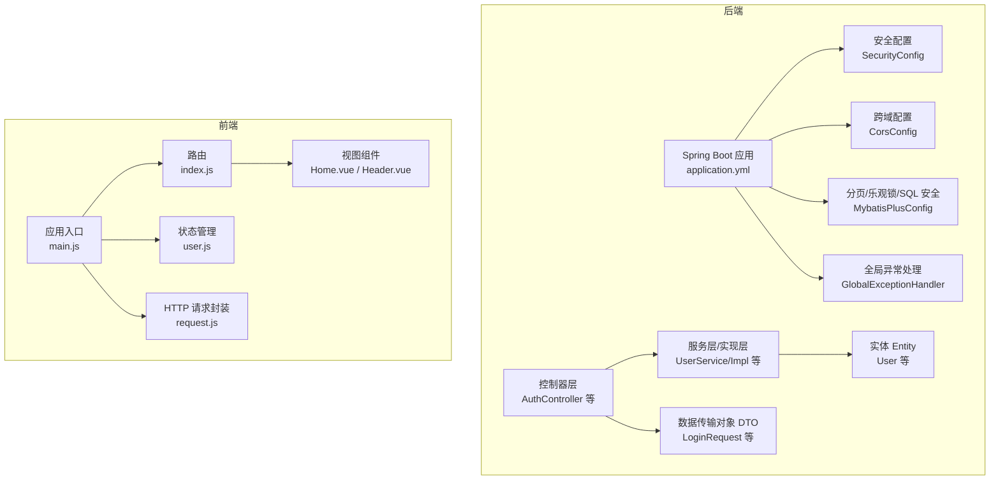
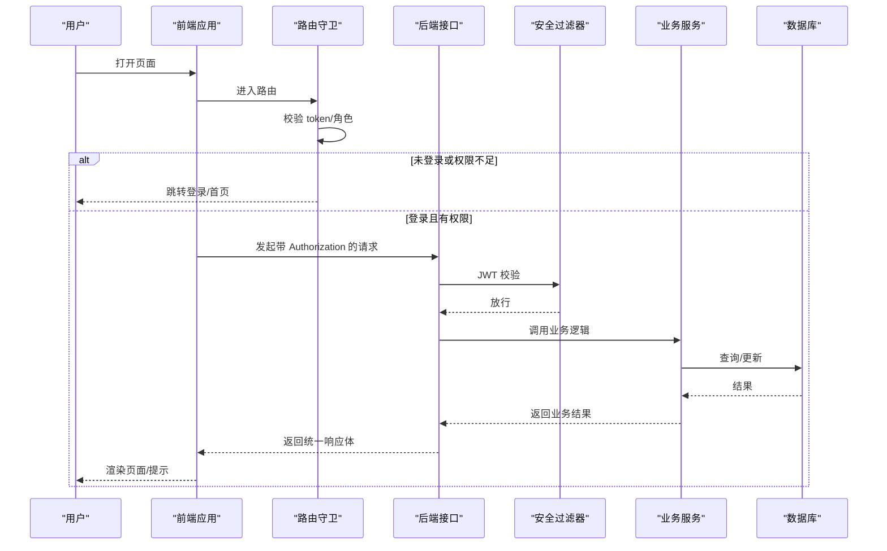
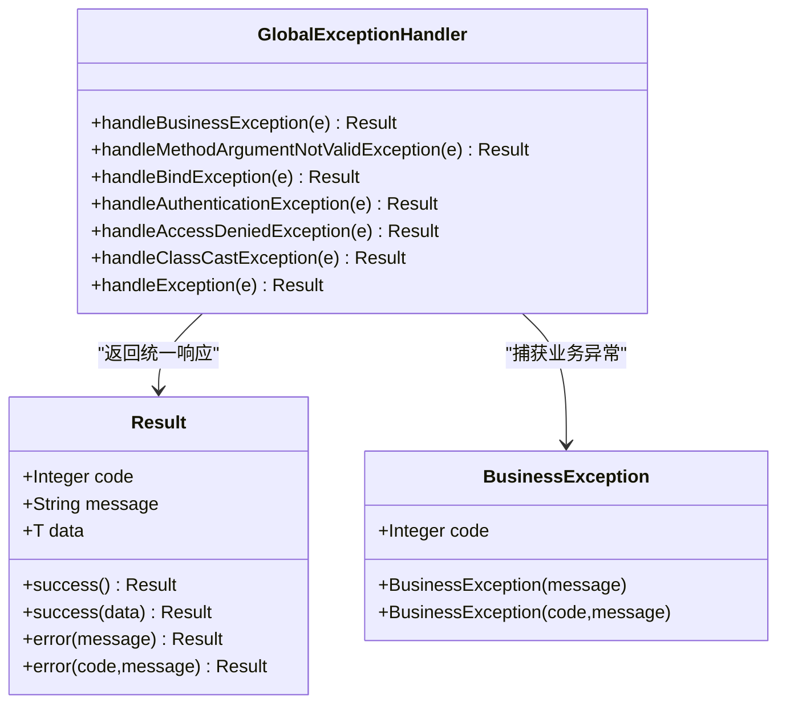
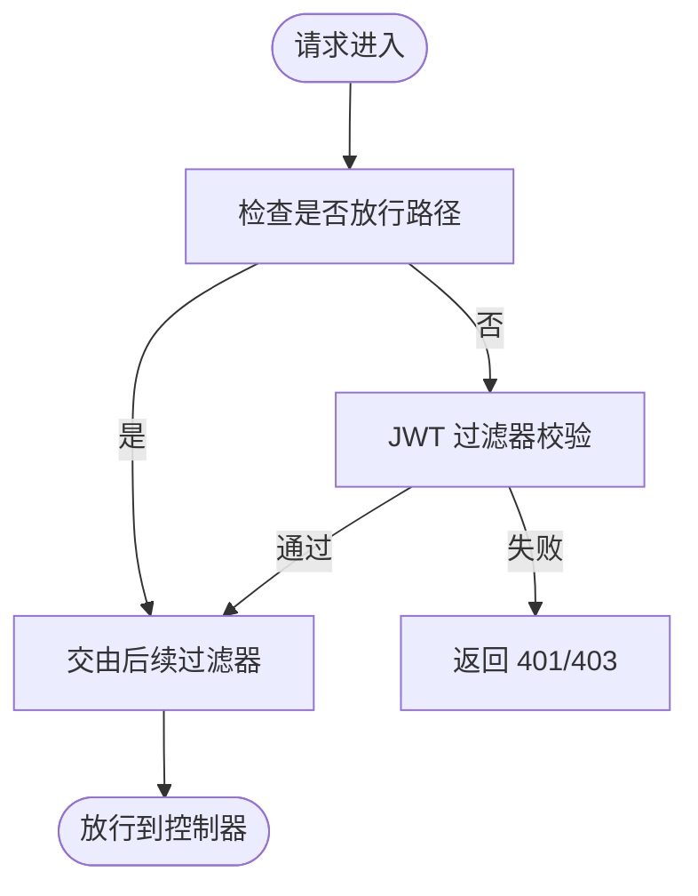
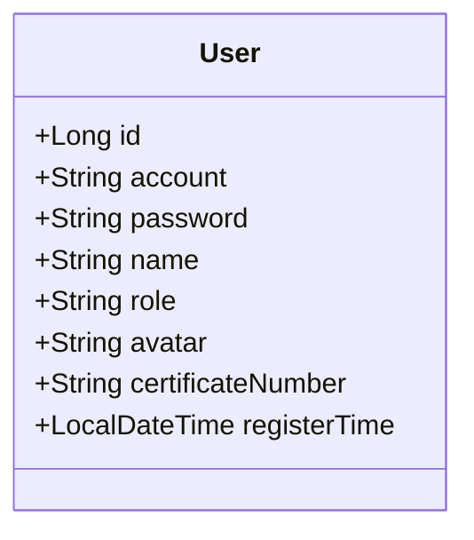
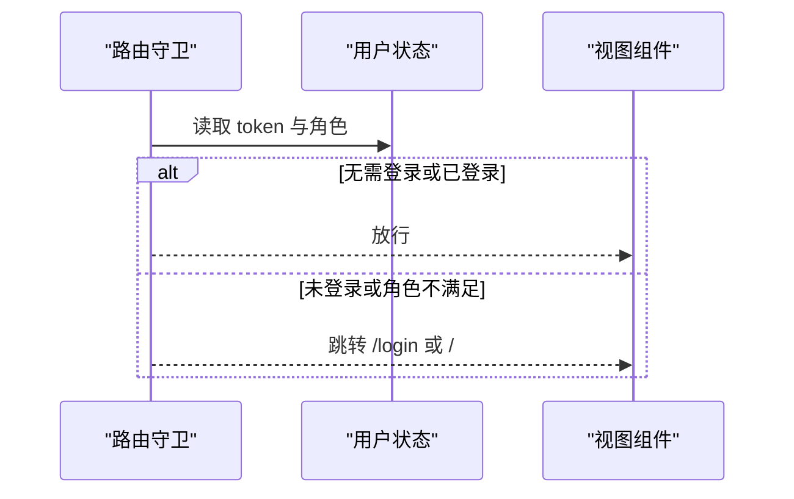
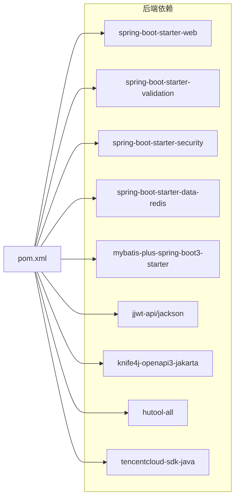

# 开发规范

<cite>
**本文引用的文件**
- [backend/src/main/java/com/heritage/common/GlobalExceptionHandler.java](file://backend/src/main/java/com/heritage/common/GlobalExceptionHandler.java)
- [backend/src/main/java/com/heritage/common/BusinessException.java](file://backend/src/main/java/com/heritage/common/BusinessException.java)
- [backend/src/main/java/com/heritage/common/Result.java](file://backend/src/main/java/com/heritage/common/Result.java)
- [backend/src/main/java/com/heritage/config/SecurityConfig.java](file://backend/src/main/java/com/heritage/config/SecurityConfig.java)
- [backend/src/main/java/com/heritage/config/CorsConfig.java](file://backend/src/main/java/com/heritage/config/CorsConfig.java)
- [backend/src/main/java/com/heritage/config/MybatisPlusConfig.java](file://backend/src/main/java/com/heritage/config/MybatisPlusConfig.java)
- [backend/src/main/resources/application.yml](file://backend/src/main/resources/application.yml)
- [backend/pom.xml](file://backend/pom.xml)
- [backend/src/main/java/com/heritage/controller/AuthController.java](file://backend/src/main/java/com/heritage/controller/AuthController.java)
- [backend/src/main/java/com/heritage/entity/User.java](file://backend/src/main/java/com/heritage/entity/User.java)
- [backend/src/main/java/com/heritage/dto/LoginRequest.java](file://backend/src/main/java/com/heritage/dto/LoginRequest.java)
- [frontend/package.json](file://frontend/package.json)
- [frontend/src/main.js](file://frontend/src/main.js)
- [frontend/vite.config.js](file://frontend/vite.config.js)
- [frontend/src/router/index.js](file://frontend/src/router/index.js)
- [frontend/src/stores/user.js](file://frontend/src/stores/user.js)
- [frontend/src/utils/request.js](file://frontend/src/utils/request.js)
- [frontend/src/views/Home.vue](file://frontend/src/views/Home.vue)
- [frontend/src/components/Header.vue](file://frontend/src/components/Header.vue)
- [.gitignore](file://.gitignore)
</cite>

## 目录
1. [引言](#引言)
2. [项目结构](#项目结构)
3. [核心组件](#核心组件)
4. [架构总览](#架构总览)
5. [详细组件分析](#详细组件分析)
6. [依赖关系分析](#依赖关系分析)
7. [性能考虑](#性能考虑)
8. [故障排查指南](#故障排查指南)
9. [结论](#结论)
10. [附录](#附录)

## 引言
本开发规范面向“非遗产品智能定制商城系统”的后端与前端团队，旨在统一代码风格、提升协作效率与工程质量。内容覆盖：
- Java 后端代码规范（命名约定、注释规范、异常处理）
- Vue 前端代码规范（组件命名、样式规范、状态管理）
- Git 工作流程规范（分支管理、提交信息、合并流程）
- 代码审查标准（清单、质量检查点、问题修复流程）
- 项目目录结构规范、配置文件管理规范与文档编写规范

## 项目结构
项目采用前后端分离架构，后端基于 Spring Boot 3 + MyBatis-Plus，前端基于 Vue 3 + Vite + Pinia + Element Plus。

图表来源
- [backend/src/main/resources/application.yml](file://backend/src/main/resources/application.yml#L1-L63)
- [backend/src/main/java/com/heritage/config/SecurityConfig.java](file://backend/src/main/java/com/heritage/config/SecurityConfig.java#L50-L65)
- [backend/src/main/java/com/heritage/config/CorsConfig.java](file://backend/src/main/java/com/heritage/config/CorsConfig.java#L12-L25)
- [backend/src/main/java/com/heritage/config/MybatisPlusConfig.java](file://backend/src/main/java/com/heritage/config/MybatisPlusConfig.java#L16-L29)
- [backend/src/main/java/com/heritage/common/GlobalExceptionHandler.java](file://backend/src/main/java/com/heritage/common/GlobalExceptionHandler.java#L14-L61)
- [backend/src/main/java/com/heritage/controller/AuthController.java](file://backend/src/main/java/com/heritage/controller/AuthController.java#L17-L47)
- [backend/src/main/java/com/heritage/entity/User.java](file://backend/src/main/java/com/heritage/entity/User.java#L9-L37)
- [backend/src/main/java/com/heritage/dto/LoginRequest.java](file://backend/src/main/java/com/heritage/dto/LoginRequest.java#L6-L14)
- [frontend/src/main.js](file://frontend/src/main.js#L1-L25)
- [frontend/src/router/index.js](file://frontend/src/router/index.js#L142-L175)
- [frontend/src/stores/user.js](file://frontend/src/stores/user.js#L4-L32)
- [frontend/src/utils/request.js](file://frontend/src/utils/request.js#L4-L44)
- [frontend/src/views/Home.vue](file://frontend/src/views/Home.vue#L134-L251)
- [frontend/src/components/Header.vue](file://frontend/src/components/Header.vue#L74-L173)

章节来源
- [backend/src/main/resources/application.yml](file://backend/src/main/resources/application.yml#L1-L63)
- [frontend/package.json](file://frontend/package.json#L1-L28)

## 核心组件
- 统一响应体 Result：所有接口返回统一结构，便于前端处理与错误提示。
- 全局异常处理 GlobalExceptionHandler：集中处理业务异常、参数校验异常、认证/权限异常等。
- 安全与鉴权 SecurityConfig：基于 JWT 的无状态认证，细粒度 URL 放行与拦截。
- 跨域 CorsConfig：前后端联调阶段允许跨域访问。
- MyBatis-Plus 配置：内置分页、乐观锁、SQL 注入防护。
- 前端应用入口 main.js：注册 Pinia、路由、国际化、Element Plus。
- 路由与守卫 router/index.js：按角色控制访问权限与页面标题。
- 状态管理 user.js：基于 Pinia 的本地持久化 token 与用户信息。
- 请求封装 request.js：统一设置 Authorization 头、错误提示与业务码判断。

章节来源
- [backend/src/main/java/com/heritage/common/Result.java](file://backend/src/main/java/com/heritage/common/Result.java#L7-L43)
- [backend/src/main/java/com/heritage/common/GlobalExceptionHandler.java](file://backend/src/main/java/com/heritage/common/GlobalExceptionHandler.java#L14-L61)
- [backend/src/main/java/com/heritage/config/SecurityConfig.java](file://backend/src/main/java/com/heritage/config/SecurityConfig.java#L50-L65)
- [backend/src/main/java/com/heritage/config/CorsConfig.java](file://backend/src/main/java/com/heritage/config/CorsConfig.java#L12-L25)
- [backend/src/main/java/com/heritage/config/MybatisPlusConfig.java](file://backend/src/main/java/com/heritage/config/MybatisPlusConfig.java#L16-L29)
- [frontend/src/main.js](file://frontend/src/main.js#L12-L24)
- [frontend/src/router/index.js](file://frontend/src/router/index.js#L147-L173)
- [frontend/src/stores/user.js](file://frontend/src/stores/user.js#L4-L32)
- [frontend/src/utils/request.js](file://frontend/src/utils/request.js#L4-L44)

## 架构总览
后端通过 Spring MVC 提供 REST 接口，前端通过 Axios 发起请求并携带 JWT Token；路由守卫在前端侧进行基础权限校验；数据库访问通过 MyBatis-Plus 实现。

图表来源
- [frontend/src/router/index.js](file://frontend/src/router/index.js#L147-L173)
- [frontend/src/utils/request.js](file://frontend/src/utils/request.js#L9-L20)
- [backend/src/main/java/com/heritage/config/SecurityConfig.java](file://backend/src/main/java/com/heritage/config/SecurityConfig.java#L50-L65)
- [backend/src/main/java/com/heritage/common/Result.java](file://backend/src/main/java/com/heritage/common/Result.java#L18-L42)

## 详细组件分析

### 后端：统一响应与异常处理
- 统一响应体 Result：包含 code、message、data 字段，提供 success/error 工厂方法，便于前后端契约一致。
- 全局异常处理 GlobalExceptionHandler：覆盖业务异常、参数校验异常、认证/权限异常、通用异常，统一返回 Result 错误结构。
- 业务异常 BusinessException：支持自定义 code 与 message，便于语义化错误返回。

图表来源
- [backend/src/main/java/com/heritage/common/Result.java](file://backend/src/main/java/com/heritage/common/Result.java#L7-L43)
- [backend/src/main/java/com/heritage/common/BusinessException.java](file://backend/src/main/java/com/heritage/common/BusinessException.java#L6-L19)
- [backend/src/main/java/com/heritage/common/GlobalExceptionHandler.java](file://backend/src/main/java/com/heritage/common/GlobalExceptionHandler.java#L14-L61)

章节来源
- [backend/src/main/java/com/heritage/common/Result.java](file://backend/src/main/java/com/heritage/common/Result.java#L7-L43)
- [backend/src/main/java/com/heritage/common/BusinessException.java](file://backend/src/main/java/com/heritage/common/BusinessException.java#L6-L19)
- [backend/src/main/java/com/heritage/common/GlobalExceptionHandler.java](file://backend/src/main/java/com/heritage/common/GlobalExceptionHandler.java#L14-L61)

### 后端：安全与跨域
- 安全配置 SecurityConfig：禁用 CSRF、无状态会话、放行公开接口与静态资源、添加 JWT 过滤器。
- 跨域 CorsConfig：允许任意来源、方法与头，设置预检缓存时长。
- JWT 与认证：控制器中生成 token 并注入到响应中，前端通过请求拦截器携带 Authorization。

图表来源
- [backend/src/main/java/com/heritage/config/SecurityConfig.java](file://backend/src/main/java/com/heritage/config/SecurityConfig.java#L50-L65)
- [backend/src/main/java/com/heritage/controller/AuthController.java](file://backend/src/main/java/com/heritage/controller/AuthController.java#L33-L46)
- [frontend/src/utils/request.js](file://frontend/src/utils/request.js#L9-L16)

章节来源
- [backend/src/main/java/com/heritage/config/SecurityConfig.java](file://backend/src/main/java/com/heritage/config/SecurityConfig.java#L50-L65)
- [backend/src/main/java/com/heritage/config/CorsConfig.java](file://backend/src/main/java/com/heritage/config/CorsConfig.java#L12-L25)
- [backend/src/main/resources/application.yml](file://backend/src/main/resources/application.yml#L39-L41)
- [frontend/src/utils/request.js](file://frontend/src/utils/request.js#L9-L16)

### 后端：数据访问与分页
- MyBatis-Plus 配置：启用分页、乐观锁、SQL 注入防护，限制最大分页条数以保障性能。
- 实体 User：使用注解映射字段与插入时间自动填充。

图表来源
- [backend/src/main/java/com/heritage/entity/User.java](file://backend/src/main/java/com/heritage/entity/User.java#L9-L37)
- [backend/src/main/java/com/heritage/config/MybatisPlusConfig.java](file://backend/src/main/java/com/heritage/config/MybatisPlusConfig.java#L16-L29)

章节来源
- [backend/src/main/java/com/heritage/config/MybatisPlusConfig.java](file://backend/src/main/java/com/heritage/config/MybatisPlusConfig.java#L16-L29)
- [backend/src/main/java/com/heritage/entity/User.java](file://backend/src/main/java/com/heritage/entity/User.java#L9-L37)

### 前端：应用入口与路由
- 应用入口 main.js：注册 Pinia、路由、国际化、Element Plus，挂载应用。
- 路由与守卫：设置页面标题、校验 token 与角色（ADMIN/MERCHANT），重定向至登录或首页。
- 状态管理 user.js：token 与 userInfo 的本地持久化与清理。
- 请求封装 request.js：统一设置 Authorization 头、根据 code 判断错误并提示。

图表来源
- [frontend/src/router/index.js](file://frontend/src/router/index.js#L147-L173)
- [frontend/src/stores/user.js](file://frontend/src/stores/user.js#L4-L32)
- [frontend/src/utils/request.js](file://frontend/src/utils/request.js#L22-L42)

章节来源
- [frontend/src/main.js](file://frontend/src/main.js#L12-L24)
- [frontend/src/router/index.js](file://frontend/src/router/index.js#L147-L173)
- [frontend/src/stores/user.js](file://frontend/src/stores/user.js#L4-L32)
- [frontend/src/utils/request.js](file://frontend/src/utils/request.js#L4-L44)

### 前端：组件与页面
- Header.vue：顶部导航、语言切换、主题切换、用户下拉菜单、登出。
- Home.vue：首页轮播、特色功能、热门商品、非遗分类、统计信息，使用组合式 API 与异步加载。

章节来源
- [frontend/src/components/Header.vue](file://frontend/src/components/Header.vue#L74-L173)
- [frontend/src/views/Home.vue](file://frontend/src/views/Home.vue#L134-L251)

## 依赖关系分析
- 后端依赖：Spring Web、Validation、Security、Redis、MySQL、MyBatis-Plus、JWT、Knife4j、Hutool、腾讯云 SDK。
- 前端依赖：Vue 3、Vue Router、Pinia、Element Plus、Axios、Three.js、@google/model-viewer、Sass、Vite。

图表来源
- [backend/pom.xml](file://backend/pom.xml#L30-L97)

章节来源
- [backend/pom.xml](file://backend/pom.xml#L21-L28)
- [backend/pom.xml](file://backend/pom.xml#L30-L97)
- [frontend/package.json](file://frontend/package.json#L10-L26)

## 性能考虑
- 分页与上限：MyBatis-Plus 分页拦截器限制最大条数，避免超大分页导致数据库压力。
- 无状态与缓存：JWT 无状态减少会话存储；Redis 可用于验证码、限流、会话扩展。
- 前端懒加载：路由与组件使用动态导入，减少首屏体积。
- 图片与模型：上传目录与公共地址配置需结合 CDN 与缓存策略优化加载速度。

章节来源
- [backend/src/main/java/com/heritage/config/MybatisPlusConfig.java](file://backend/src/main/java/com/heritage/config/MybatisPlusConfig.java#L20-L22)
- [backend/src/main/resources/application.yml](file://backend/src/main/resources/application.yml#L59-L62)
- [frontend/src/router/index.js](file://frontend/src/router/index.js#L8-L17)

## 故障排查指南
- 登录/鉴权失败
  - 检查 SecurityConfig 中放行路径与 JWT 过滤器顺序。
  - 确认前端请求头 Authorization 是否正确携带 Bearer Token。
- 参数校验失败
  - 查看 GlobalExceptionHandler 对 MethodArgumentNotValidException/BindException 的处理，定位字段错误消息。
- 业务异常
  - 使用 BusinessException 抛出语义化错误，前端根据 Result.code 判断并提示。
- 跨域问题
  - 确认 CorsConfig 已生效，生产环境建议缩小允许范围。
- 文件上传
  - 检查 application.yml 中上传路径与公共地址配置，确认目录可写。

章节来源
- [backend/src/main/java/com/heritage/config/SecurityConfig.java](file://backend/src/main/java/com/heritage/config/SecurityConfig.java#L50-L65)
- [frontend/src/utils/request.js](file://frontend/src/utils/request.js#L9-L16)
- [backend/src/main/java/com/heritage/common/GlobalExceptionHandler.java](file://backend/src/main/java/com/heritage/common/GlobalExceptionHandler.java#L46-L60)
- [backend/src/main/java/com/heritage/common/BusinessException.java](file://backend/src/main/java/com/heritage/common/BusinessException.java#L10-L18)
- [backend/src/main/java/com/heritage/config/CorsConfig.java](file://backend/src/main/java/com/heritage/config/CorsConfig.java#L12-L25)
- [backend/src/main/resources/application.yml](file://backend/src/main/resources/application.yml#L59-L62)

## 结论
本规范以现有代码实现为基础，明确了后端统一响应与异常处理、安全与跨域策略、前端路由与状态管理的关键实践。建议在后续迭代中持续完善测试与监控体系，确保工程稳定性与可维护性。

## 附录

### 一、Java 后端代码规范
- 命名约定
  - 包名：全部小写，如 com.heritage.module。
  - 类名：帕斯卡命名，如 UserService、UserServiceImpl。
  - 方法/变量：驼峰命名，如 getUserById。
  - 常量：全大写+下划线，如 MAX_PAGE_SIZE。
- 注释规范
  - 类/接口：简述职责与适用场景。
  - 方法：说明入参、返回值、异常、注意事项。
  - 关键逻辑：补充注释解释业务背景或边界条件。
- 异常处理
  - 业务异常统一抛出 BusinessException，明确 code 与 message。
  - 控制器返回 Result.success()/error()，避免直接抛出异常给前端。
  - 全局异常处理器统一处理各类异常，记录日志并返回 Result 错误。

章节来源
- [backend/src/main/java/com/heritage/common/BusinessException.java](file://backend/src/main/java/com/heritage/common/BusinessException.java#L6-L19)
- [backend/src/main/java/com/heritage/common/Result.java](file://backend/src/main/java/com/heritage/common/Result.java#L18-L42)
- [backend/src/main/java/com/heritage/common/GlobalExceptionHandler.java](file://backend/src/main/java/com/heritage/common/GlobalExceptionHandler.java#L14-L61)

### 二、Vue 前端代码规范
- 组件命名
  - 文件名：帕斯卡命名，如 Header.vue、Home.vue。
  - 组件注册：全局图标组件在入口统一注册，局部组件在页面内按需引入。
- 样式规范
  - 使用 scoped 样式隔离作用域；布局采用 CSS Grid/Flex。
  - 主题与暗色模式通过工具函数切换，避免硬编码颜色。
- 状态管理
  - 使用 Pinia 管理 token 与用户信息，统一在 user.js 中维护。
  - 本地持久化仅存放必要字段，避免敏感信息泄露。
- 请求封装
  - request.js 统一设置 baseURL 与 Authorization 头。
  - 根据 Result.code 判断错误并弹窗提示，网络错误统一处理。

章节来源
- [frontend/src/main.js](file://frontend/src/main.js#L15-L17)
- [frontend/src/stores/user.js](file://frontend/src/stores/user.js#L4-L32)
- [frontend/src/utils/request.js](file://frontend/src/utils/request.js#L4-L44)

### 三、Git 工作流程规范
- 分支管理
  - main：稳定发布分支。
  - develop：开发集成分支，从 main 拉取并合并功能分支。
  - feature/*：功能开发分支，完成后合并到 develop。
  - hotfix/*：线上紧急修复分支，从 main 切出，修复后同时合并回 main 与 develop。
- 提交信息格式
  - 类型(scope): 说明
  - 示例：feat(auth): 添加用户登录接口
  - 支持类型：feat、fix、docs、style、refactor、test、chore
- 合并流程
  - 功能分支完成开发后发起 Pull Request，至少一名成员审查通过后合并。
  - 合并前确保通过本地与 CI 校验（编译、单元测试、代码检查）。

章节来源
- [.gitignore](file://.gitignore#L1-L15)

### 四、代码审查标准
- 审查清单
  - 代码风格与命名是否符合规范。
  - 是否存在重复逻辑与可复用模块。
  - 异常处理是否完整，错误信息是否友好。
  - 安全性：是否校验输入、防止 SQL 注入与 XSS。
  - 性能：是否存在不必要的全表扫描、阻塞 IO。
  - 文档：接口注释、README 更新。
- 质量检查点
  - 单元测试覆盖率与关键路径覆盖。
  - 前端组件可测试性与交互完整性。
  - 配置项合理性（端口、超时、缓存）。
- 问题修复流程
  - 发现问题 → 新建 issue → 修复 → 提交 PR → 审查 → 合并 → 回归测试。

### 五、项目目录结构规范
- 后端
  - src/main/java/com/heritage
    - common：统一响应体、异常、工具类
    - config：安全、跨域、MyBatis-Plus、Redis、WebMvc 等配置
    - controller：REST 控制器
    - dto：请求/响应数据传输对象
    - entity：数据库实体
    - mapper：MyBatis 映射
    - service/impl：服务接口与实现
    - security：自定义 UserDetails、UserDetailsService、JwtAuthenticationFilter
    - util：工具类（如 JwtUtil）
    - shop/*：商城相关模块（按需扩展）
- 前端
  - src/
    - api/*：接口封装
    - components/*：通用组件
    - layouts/*：布局组件
    - router/index.js：路由与守卫
    - stores/*：状态管理
    - utils/*：工具函数（请求、主题、国际化）
    - views/*：页面组件
    - assets/styles/*：样式资源
    - i18n/index.js 与 locales/*：国际化
    - main.js：应用入口
    - styles/main.scss：全局样式

章节来源
- [backend/src/main/java/com/heritage/common/Result.java](file://backend/src/main/java/com/heritage/common/Result.java#L7-L43)
- [backend/src/main/java/com/heritage/config/SecurityConfig.java](file://backend/src/main/java/com/heritage/config/SecurityConfig.java#L22-L65)
- [frontend/src/main.js](file://frontend/src/main.js#L1-L25)

### 六、配置文件管理规范
- 后端 application.yml
  - 数据源、Redis、JWT 密钥与过期时间、文件上传路径与公共地址、Knife4j 开关。
  - 环境区分：通过 profiles.active 切换 dev/test/prod。
- 前端 vite.config.js
  - 别名 @ 指向 src，开发服务器端口与代理 /api 指向后端 8080。
- 依赖版本
  - 后端 pom.xml 统一管理版本属性，避免依赖冲突。
  - 前端 package.json 明确运行脚本与依赖版本。

章节来源
- [backend/src/main/resources/application.yml](file://backend/src/main/resources/application.yml#L1-L63)
- [frontend/vite.config.js](file://frontend/vite.config.js#L5-L21)
- [backend/pom.xml](file://backend/pom.xml#L21-L28)

### 七、文档编写规范
- 接口文档：使用 Swagger/Knife4j 自动生成 OpenAPI 文档，保持接口注解与 DTO 一致。
- 任务与设计文档：TODO 目录下的方案与清单作为开发依据，及时更新。
- README：新增模块或变更架构时同步更新。

章节来源
- [backend/src/main/resources/application.yml](file://backend/src/main/resources/application.yml#L54-L57)
- [backend/src/main/java/com/heritage/config/SecurityConfig.java](file://backend/src/main/java/com/heritage/config/SecurityConfig.java#L54-L62)