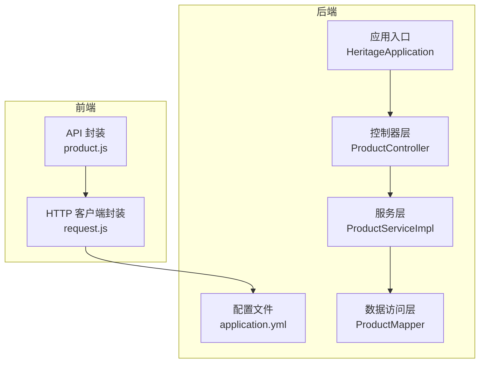
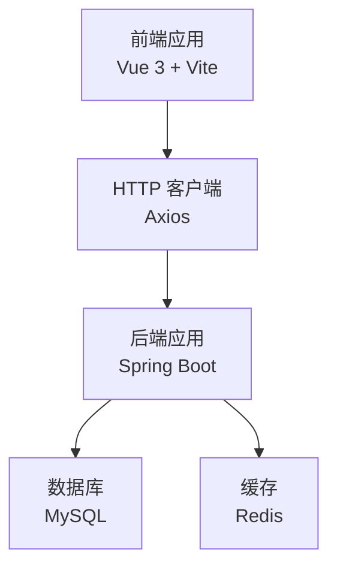
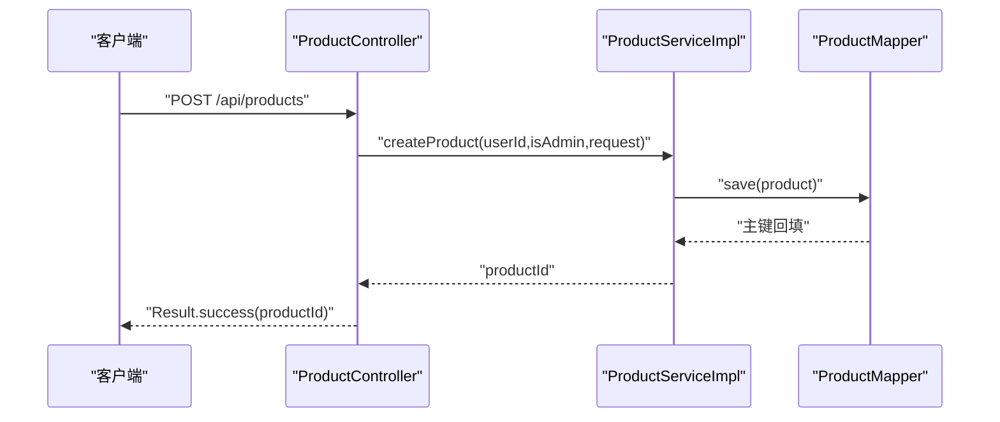
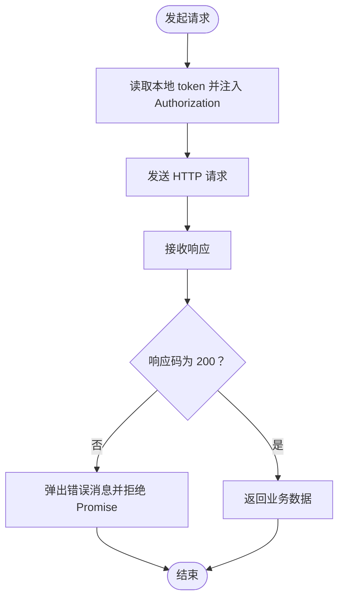
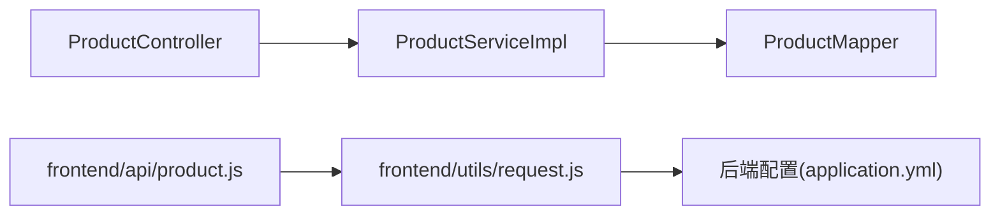

# 测试策略

<cite>
**本文引用的文件**
- [HeritageApplication.java](file://backend/src/main/java/com/heritage/HeritageApplication.java)
- [application.yml](file://backend/src/main/resources/application.yml)
- [pom.xml](file://backend/pom.xml)
- [ProductController.java](file://backend/src/main/java/com/heritage/controller/ProductController.java)
- [ProductServiceImpl.java](file://backend/src/main/java/com/heritage/service/impl/ProductServiceImpl.java)
- [ProductMapper.java](file://backend/src/main/java/com/heritage/mapper/ProductMapper.java)
- [request.js](file://frontend/src/utils/request.js)
- [product.js](file://frontend/src/api/product.js)
- [package.json](file://frontend/package.json)
</cite>

## 目录
1. [引言](#引言)
2. [项目结构](#项目结构)
3. [核心组件](#核心组件)
4. [架构总览](#架构总览)
5. [详细组件分析](#详细组件分析)
6. [依赖分析](#依赖分析)
7. [性能考虑](#性能考虑)
8. [故障排查指南](#故障排查指南)
9. [结论](#结论)
10. [附录](#附录)

## 引言
本测试策略文档面向“非遗产品智能定制商城系统”，旨在建立从单元测试、集成测试到端到端测试的完整质量保障体系。文档覆盖以下方面：
- 单元测试：JUnit 框架使用、Mock 对象创建、测试用例设计原则
- 集成测试：Spring Boot 测试配置、数据库测试隔离、API 接口测试
- 端到端测试：前端测试框架选择、用户流程测试、跨浏览器兼容性测试
- 测试数据管理与环境配置、持续集成测试流程
- 测试覆盖率要求、缺陷跟踪流程与回归测试策略
目标是确保系统质量与快速问题定位。

## 项目结构
系统采用前后端分离架构：
- 后端基于 Spring Boot 3，使用 MyBatis-Plus 进行数据访问，提供 REST API
- 前端基于 Vue 3 + Vite，通过 Axios 发起 HTTP 请求并与后端交互
- 配置文件中包含数据库连接、Redis、JWT、Knife4j 等关键配置

图表来源
- [HeritageApplication.java](file://backend/src/main/java/com/heritage/HeritageApplication.java#L1-L13)
- [application.yml](file://backend/src/main/resources/application.yml#L1-L63)
- [ProductController.java](file://backend/src/main/java/com/heritage/controller/ProductController.java#L1-L130)
- [ProductServiceImpl.java](file://backend/src/main/java/com/heritage/service/impl/ProductServiceImpl.java#L1-L507)
- [ProductMapper.java](file://backend/src/main/java/com/heritage/mapper/ProductMapper.java#L1-L11)
- [product.js](file://frontend/src/api/product.js#L1-L71)
- [request.js](file://frontend/src/utils/request.js#L1-L45)

章节来源
- [HeritageApplication.java](file://backend/src/main/java/com/heritage/HeritageApplication.java#L1-L13)
- [application.yml](file://backend/src/main/resources/application.yml#L1-L63)
- [pom.xml](file://backend/pom.xml#L1-L129)
- [package.json](file://frontend/package.json#L1-L28)

## 核心组件
- 应用入口与启动：负责加载 Spring Boot 应用上下文
- 配置中心：集中管理数据库、Redis、JWT、AI、Knife4j 等配置
- 控制器层：暴露 REST API，进行权限校验与请求转发
- 服务层：实现业务逻辑，包含事务控制、权限断言、状态校验等
- 数据访问层：MyBatis-Plus Mapper 接口，提供基础 CRUD 能力
- 前端 API 层：对后端接口进行封装，统一拦截器处理与错误提示

章节来源
- [HeritageApplication.java](file://backend/src/main/java/com/heritage/HeritageApplication.java#L1-L13)
- [application.yml](file://backend/src/main/resources/application.yml#L1-L63)
- [ProductController.java](file://backend/src/main/java/com/heritage/controller/ProductController.java#L1-L130)
- [ProductServiceImpl.java](file://backend/src/main/java/com/heritage/service/impl/ProductServiceImpl.java#L1-L507)
- [ProductMapper.java](file://backend/src/main/java/com/heritage/mapper/ProductMapper.java#L1-L11)
- [product.js](file://frontend/src/api/product.js#L1-L71)
- [request.js](file://frontend/src/utils/request.js#L1-L45)

## 架构总览
后端通过 Spring MVC 提供 REST 接口，前端通过 Axios 统一发起请求。JWT 用于鉴权，Knife4j 提供在线文档。数据库与缓存分别由 MySQL 和 Redis 提供。

图表来源
- [request.js](file://frontend/src/utils/request.js#L1-L45)
- [application.yml](file://backend/src/main/resources/application.yml#L17-L35)

## 详细组件分析

### 商品模块测试策略
商品模块涉及增删改查、图片管理、状态变更等功能，需重点覆盖：
- 权限校验：管理员与商家角色差异
- 参数校验：名称、价格、状态等字段合法性
- 事务一致性：新增/更新/删除商品及关联图片
- 图片封面策略：封面自动维护、排序与去重
- 分页查询：关键词过滤、状态筛选、排序规则

图表来源
- [ProductController.java](file://backend/src/main/java/com/heritage/controller/ProductController.java#L33-L42)
- [ProductServiceImpl.java](file://backend/src/main/java/com/heritage/service/impl/ProductServiceImpl.java#L37-L53)
- [ProductMapper.java](file://backend/src/main/java/com/heritage/mapper/ProductMapper.java#L1-L11)

章节来源
- [ProductController.java](file://backend/src/main/java/com/heritage/controller/ProductController.java#L1-L130)
- [ProductServiceImpl.java](file://backend/src/main/java/com/heritage/service/impl/ProductServiceImpl.java#L1-L507)
- [ProductMapper.java](file://backend/src/main/java/com/heritage/mapper/ProductMapper.java#L1-L11)

### 前端 API 与拦截器测试要点
- 基础 URL 与超时设置：确保与后端端口一致
- Token 注入：本地存储 token 的读取与 Authorization 头拼接
- 错误处理：统一响应码判断与消息提示，针对特定接口给出明确提示
- 跨域与上传：multipart 支持与文件大小限制

图表来源
- [request.js](file://frontend/src/utils/request.js#L9-L42)

章节来源
- [request.js](file://frontend/src/utils/request.js#L1-L45)
- [product.js](file://frontend/src/api/product.js#L1-L71)
- [application.yml](file://backend/src/main/resources/application.yml#L11-L15)

## 依赖分析
后端依赖关系清晰，控制器依赖服务层，服务层依赖 Mapper 与实体；前端通过 API 文件调用后端接口。

图表来源
- [ProductController.java](file://backend/src/main/java/com/heritage/controller/ProductController.java#L1-L130)
- [ProductServiceImpl.java](file://backend/src/main/java/com/heritage/service/impl/ProductServiceImpl.java#L1-L507)
- [ProductMapper.java](file://backend/src/main/java/com/heritage/mapper/ProductMapper.java#L1-L11)
- [product.js](file://frontend/src/api/product.js#L1-L71)
- [request.js](file://frontend/src/utils/request.js#L1-L45)
- [application.yml](file://backend/src/main/resources/application.yml#L1-L63)

章节来源
- [pom.xml](file://backend/pom.xml#L1-L129)
- [package.json](file://frontend/package.json#L1-L28)

## 性能考虑
- 单元测试：优先使用内存数据库或嵌入式数据库，避免真实 IO；对复杂 SQL 使用最小化数据集
- 集成测试：使用测试容器或内存数据库，启用事务回滚，减少重复初始化
- 前端测试：使用无头浏览器进行自动化，结合截图对比与关键路径测量
- 缓存与数据库：在测试中模拟 Redis 与数据库延迟，验证降级与重试策略

## 故障排查指南
- 后端常见问题
  - 权限不足：检查 JWT 角色与控制器注解权限
  - 参数校验失败：核对 DTO 字段约束与控制器绑定
  - 事务未生效：确认方法可见性与事务注解位置
- 前端常见问题
  - 401/403：确认 token 是否存在且未过期
  - 跨域与上传失败：核对 multipart 配置与文件大小限制
  - 接口报错：根据响应码与消息定位具体接口

章节来源
- [ProductController.java](file://backend/src/main/java/com/heritage/controller/ProductController.java#L19-L21)
- [application.yml](file://backend/src/main/resources/application.yml#L11-L15)
- [request.js](file://frontend/src/utils/request.js#L22-L42)

## 结论
通过分层测试策略与完善的错误处理机制，可有效提升系统稳定性与交付质量。建议以单元测试为基础，集成测试为桥梁，端到端测试为保障，配合持续集成流水线与覆盖率监控，形成闭环的质量保障体系。

## 附录

### 单元测试实施方法
- JUnit 5 与 Mockito
  - 使用 @ExtendWith(MockitoExtension.class) 启用 Mockito
  - 使用 @Mock/@InjectMocks 管理 Mock 对象
  - 使用 @Test、@BeforeEach/@AfterEach 组织测试生命周期
- 测试用例设计原则
  - 三段式：Arrange-Act-Assert
  - 边界值与异常场景优先
  - 保持测试独立，避免共享状态
- 示例关注点
  - 权限断言：管理员与非管理员路径
  - 参数校验：空值、超长、非法状态
  - 事务一致性：回滚与提交边界

### 集成测试策略
- Spring Boot Test
  - 使用 @SpringBootTest 或 @WebMvcTest 加载应用上下文
  - 使用 @AutoConfigureTestDatabase 与 @Import 选择测试配置
- 数据库测试隔离
  - 使用 @Transactional + @Rollback 在每个测试后回滚
  - 使用 @Sql 清理与初始化测试数据
- API 接口测试
  - 使用 TestRestTemplate 或 MockMvc 验证控制器行为
  - 覆盖 2xx/4xx/5xx 场景与鉴权失败路径

### 端到端测试方案
- 前端测试框架
  - 推荐 Playwright 或 Cypress，支持多浏览器与截图对比
- 用户流程测试
  - 登录 → 商品浏览 → 自定义下单 → 支付 → 订单查询
- 跨浏览器兼容性
  - Chrome、Firefox、Safari 无头模式运行
  - 关注布局、交互与文件上传行为

### 测试数据管理与环境配置
- 测试数据
  - 使用固定种子数据与工厂类生成最小化测试集
  - 对敏感字段进行脱敏处理
- 环境配置
  - application-test.yml 与 application.yml 差异化配置
  - 数据库使用内存数据库或测试专用实例
- 持续集成
  - Maven 插件与测试报告聚合
  - 前端构建与静态资源检查

### 测试覆盖率与缺陷跟踪
- 覆盖率要求
  - 行覆盖率 ≥ 80%，分支覆盖率 ≥ 70%
  - 关键业务路径必须达到 100%
- 缺陷跟踪
  - 使用 Jira/禅道 管理缺陷生命周期
  - 每个缺陷附带复现步骤、日志与测试用例
- 回归测试策略
  - 每次发布前执行全量回归
  - 关键模块高频回归，新功能双轨验证