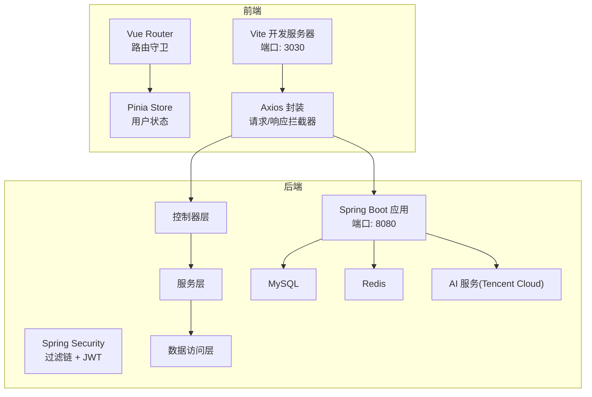
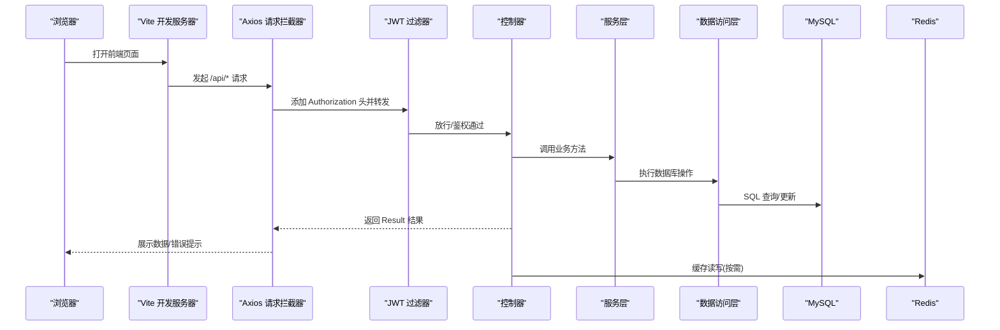
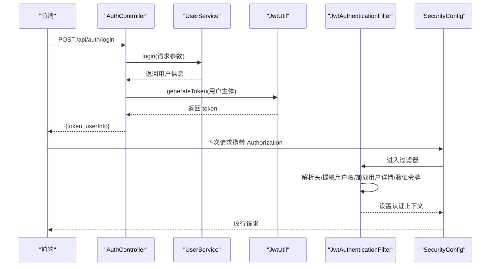
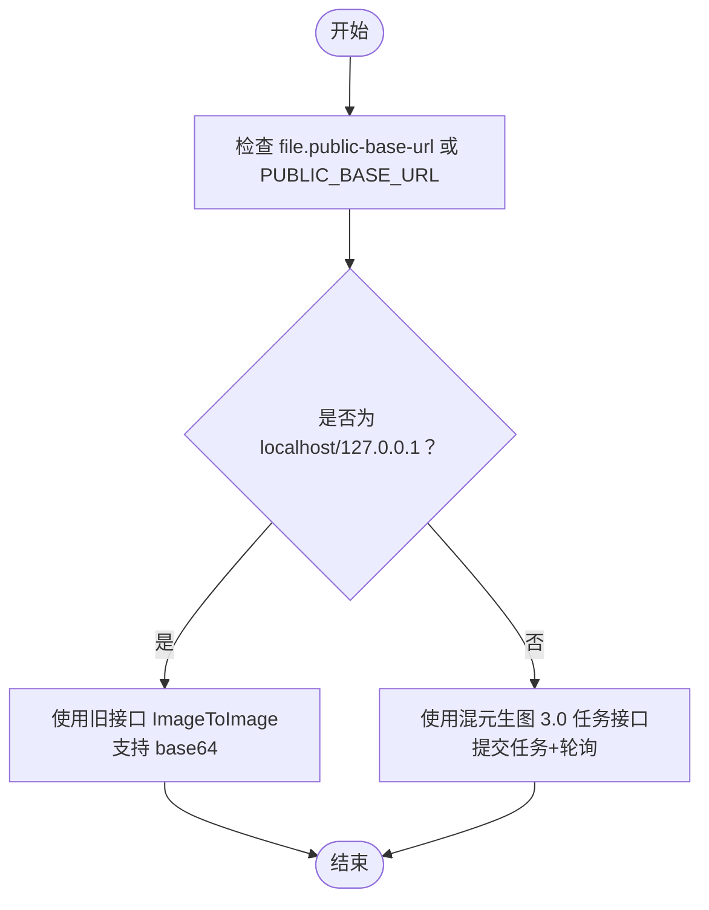
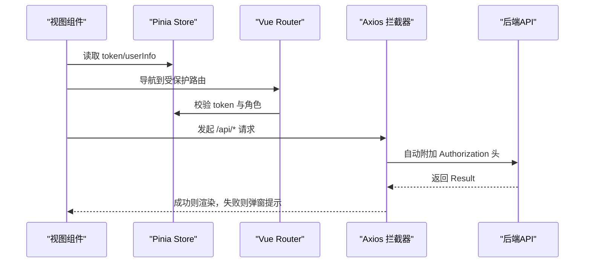
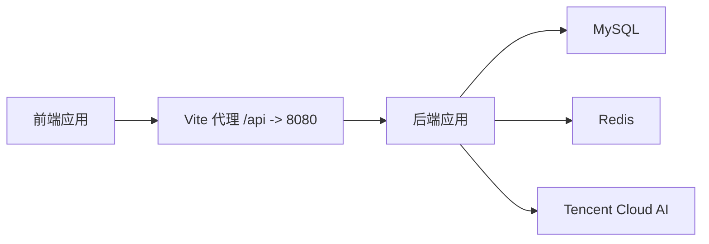

# 调试与故障排除

<cite>
**本文引用的文件**
- [application.yml](file://backend/src/main/resources/application.yml)
- [pom.xml](file://backend/pom.xml)
- [SecurityConfig.java](file://backend/src/main/java/com/heritage/config/SecurityConfig.java)
- [JwtAuthenticationFilter.java](file://backend/src/main/java/com/heritage/security/JwtAuthenticationFilter.java)
- [AuthController.java](file://backend/src/main/java/com/heritage/controller/AuthController.java)
- [GlobalExceptionHandler.java](file://backend/src/main/java/com/heritage/common/GlobalExceptionHandler.java)
- [AiTencentCloudProperties.java](file://backend/src/main/java/com/heritage/config/AiTencentCloudProperties.java)
- [vite.config.js](file://frontend/vite.config.js)
- [request.js](file://frontend/src/utils/request.js)
- [auth.js](file://frontend/src/api/auth.js)
- [user.js](file://frontend/src/stores/user.js)
- [index.js](file://frontend/src/router/index.js)
- [问题记录.md](file://TODO/问题记录.md)
- [待优化.md](file://TODO/待优化.md)
</cite>

## 目录
1. [简介](#简介)
2. [项目结构](#项目结构)
3. [核心组件](#核心组件)
4. [架构总览](#架构总览)
5. [详细组件分析](#详细组件分析)
6. [依赖分析](#依赖分析)
7. [性能考虑](#性能考虑)
8. [故障排除指南](#故障排除指南)
9. [结论](#结论)
10. [附录](#附录)

## 简介
本文件面向非遗产品智能定制商城系统的开发与运维人员，提供从IDE调试配置、断点设置、变量监控与调用栈分析，到后端Spring Boot应用调试、数据库连接调试、JWT认证调试、AI服务调试，再到前端Vue调试策略（含Vue DevTools、网络请求与组件状态调试）的完整指南。同时给出常见问题诊断方法（登录失败、文件上传失败、AI生成异常）、性能分析工具使用建议（内存/CPU/数据库优化）以及错误日志分析与生产问题处理流程。

## 项目结构
系统采用前后端分离架构：
- 后端基于Spring Boot 3.2 + Spring Security + MyBatis-Plus，提供REST API与安全过滤链、全局异常处理、Knife4j文档、Redis缓存、JWT认证、AI服务集成等能力。
- 前端基于Vue 3 + Vite + Element Plus + Pinia + Vue Router，通过Axios封装统一请求拦截器，配合路由守卫与Pinia状态管理实现鉴权与页面导航。

图表来源
- [vite.config.js](file://frontend/vite.config.js#L12-L20)
- [request.js](file://frontend/src/utils/request.js#L4-L7)
- [SecurityConfig.java](file://backend/src/main/java/com/heritage/config/SecurityConfig.java#L50-L62)
- [application.yml](file://backend/src/main/resources/application.yml#L17-L35)
- [AiTencentCloudProperties.java](file://backend/src/main/java/com/heritage/config/AiTencentCloudProperties.java#L9-L18)

章节来源
- [vite.config.js](file://frontend/vite.config.js#L1-L22)
- [application.yml](file://backend/src/main/resources/application.yml#L1-L63)

## 核心组件
- 安全与认证
  - Spring Security配置与JWT过滤链，支持无状态会话策略与细粒度URL放行规则。
  - JWT过滤器在请求进入时解析Authorization头，验证令牌并注入认证上下文。
- 控制器与服务
  - 认证控制器提供登录/注册接口；服务层负责业务逻辑与数据交互。
- 全局异常处理
  - 统一捕获认证、权限、参数校验、业务异常，返回标准化结果。
- AI服务集成
  - 通过属性类读取腾讯云AI密钥与区域配置，结合上传路径与公网基础URL控制图生图接口行为。
- 前端请求与状态
  - Axios拦截器统一添加Authorization头；Pinia持久化token与用户信息；路由守卫控制访问权限。

章节来源
- [SecurityConfig.java](file://backend/src/main/java/com/heritage/config/SecurityConfig.java#L22-L67)
- [JwtAuthenticationFilter.java](file://backend/src/main/java/com/heritage/security/JwtAuthenticationFilter.java#L24-L72)
- [AuthController.java](file://backend/src/main/java/com/heritage/controller/AuthController.java#L17-L48)
- [GlobalExceptionHandler.java](file://backend/src/main/java/com/heritage/common/GlobalExceptionHandler.java#L14-L62)
- [AiTencentCloudProperties.java](file://backend/src/main/java/com/heritage/config/AiTencentCloudProperties.java#L9-L21)
- [request.js](file://frontend/src/utils/request.js#L9-L20)
- [user.js](file://frontend/src/stores/user.js#L4-L33)
- [index.js](file://frontend/src/router/index.js#L147-L173)

## 架构总览
下图展示了从前端到后端的关键交互路径与安全过滤链：

图表来源
- [vite.config.js](file://frontend/vite.config.js#L14-L19)
- [request.js](file://frontend/src/utils/request.js#L9-L20)
- [JwtAuthenticationFilter.java](file://backend/src/main/java/com/heritage/security/JwtAuthenticationFilter.java#L29-L70)
- [AuthController.java](file://backend/src/main/java/com/heritage/controller/AuthController.java#L33-L46)

## 详细组件分析

### 后端调试要点：Spring Boot 应用与安全过滤链
- IDE调试配置
  - 使用VM选项启用远程调试（例如：-agentlib:jdwp=transport=dt_socket,server=y,suspend=n,address=*:5005），在IDE中以Debug模式启动。
  - 在入口类上设置断点，观察应用启动顺序与Bean初始化。
- 断点与变量监控
  - 在JwtAuthenticationFilter的doFilterInternal处设置断点，检查Authorization头、提取的用户名、用户详情与权限集合。
  - 在SecurityConfig的安全过滤链配置处设置断点，验证URL放行规则是否生效。
- 调用栈分析
  - 通过断点查看请求从过滤器到控制器的调用链，定位异常抛出位置。
- 关键配置核对
  - 确认application.yml中的JWT密钥、过期时间、数据库与Redis连接参数正确。
  - 确认Knife4j文档开关与语言设置符合预期。

章节来源
- [JwtAuthenticationFilter.java](file://backend/src/main/java/com/heritage/security/JwtAuthenticationFilter.java#L29-L70)
- [SecurityConfig.java](file://backend/src/main/java/com/heritage/config/SecurityConfig.java#L50-L62)
- [application.yml](file://backend/src/main/resources/application.yml#L17-L41)

### 数据库连接调试
- 连接参数核对
  - application.yml中datasource.url、username、password与driver-class-name应与本地/测试环境一致。
- 连接池与超时
  - max-active、max-wait、max-idle、min-idle与timeout需根据并发与资源情况调整。
- MyBatis-Plus配置
  - 若使用分页插件或元对象处理器，可在启动日志中观察初始化信息，必要时开启SQL日志定位慢查询。

章节来源
- [application.yml](file://backend/src/main/resources/application.yml#L17-L35)
- [pom.xml](file://backend/pom.xml#L58-L61)

### JWT认证调试
- 登录流程
  - 在AuthController的/login接口设置断点，确认请求体绑定与参数校验通过。
  - 生成JWT时确保用户账户名与权限构建正确，返回给前端的token格式为Bearer。
- 过滤器验证
  - 在JwtAuthenticationFilter中检查Authorization头解析、用户名提取、用户详情加载与令牌验证。
  - 观察日志输出，定位“Token验证失败”或“Token验证异常”的具体原因。
- 权限异常处理
  - 全局异常处理器对AccessDeniedException与AuthenticationException进行统一返回，便于前端识别未登录或权限不足。

图表来源
- [AuthController.java](file://backend/src/main/java/com/heritage/controller/AuthController.java#L33-L46)
- [JwtAuthenticationFilter.java](file://backend/src/main/java/com/heritage/security/JwtAuthenticationFilter.java#L38-L67)
- [SecurityConfig.java](file://backend/src/main/java/com/heritage/config/SecurityConfig.java#L50-L62)

章节来源
- [AuthController.java](file://backend/src/main/java/com/heritage/controller/AuthController.java#L26-L46)
- [JwtAuthenticationFilter.java](file://backend/src/main/java/com/heritage/security/JwtAuthenticationFilter.java#L38-L67)
- [GlobalExceptionHandler.java](file://backend/src/main/java/com/heritage/common/GlobalExceptionHandler.java#L16-L32)

### AI服务调试（腾讯云混元文生图/图生图）
- 配置与行为
  - 通过AiTencentCloudProperties读取secretId/secretKey/region/endpoint。
  - 当file.public-base-url未配置或为localhost/127.0.0.1时，图生图自动降级为旧接口（支持base64输入，本地可用）；否则走3.0任务接口（提交任务+轮询结果）。
- 常见问题
  - 本地开发无法直接使用3.0：因为腾讯云服务端需要能访问参考图URL，而localhost/127.0.0.1对其不可达。
- 解决方案
  - 方案A：保持本地开发，图生图自动降级到旧接口。
  - 方案B：将参考图上传至对象存储或使用内网穿透暴露/uploads/**，并将PUBLIC_BASE_URL或file.public-base-url设为公网域名。

图表来源
- [问题记录.md](file://TODO/问题记录.md#L23-L26)
- [AiTencentCloudProperties.java](file://backend/src/main/java/com/heritage/config/AiTencentCloudProperties.java#L9-L18)
- [application.yml](file://backend/src/main/resources/application.yml#L59-L62)

章节来源
- [问题记录.md](file://TODO/问题记录.md#L3-L40)
- [AiTencentCloudProperties.java](file://backend/src/main/java/com/heritage/config/AiTencentCloudProperties.java#L9-L21)
- [application.yml](file://backend/src/main/resources/application.yml#L49-L62)

### 前端调试策略：Vue DevTools、网络请求与组件状态
- Vue DevTools
  - 使用组件树与状态面板查看Pinia中的token与userInfo变化，确认登录后本地存储与状态同步。
- 网络请求调试
  - 在浏览器开发者工具Network中观察/api/*请求，确认Authorization头是否包含Bearer token。
  - 关注响应码与后端返回的Result结构，留意全局拦截器对错误消息的统一提示。
- 组件状态调试
  - 在路由守卫中检查to.meta.requiresAuth与用户角色判断，防止未授权访问。
  - 对于图片加载失败场景，拦截器已针对特定URL路径给出更友好的提示。

图表来源
- [user.js](file://frontend/src/stores/user.js#L4-L33)
- [index.js](file://frontend/src/router/index.js#L147-L173)
- [request.js](file://frontend/src/utils/request.js#L9-L20)
- [auth.js](file://frontend/src/api/auth.js#L3-L8)

章节来源
- [user.js](file://frontend/src/stores/user.js#L4-L33)
- [index.js](file://frontend/src/router/index.js#L147-L173)
- [request.js](file://frontend/src/utils/request.js#L9-L20)
- [auth.js](file://frontend/src/api/auth.js#L3-L8)

## 依赖分析
- 后端依赖
  - Spring Boot Starter Web/Security/Validation/Data Redis/MyBatis-Plus/JWT/Knife4j/TencentCloud SDK等。
- 前端依赖
  - Vue 3、Element Plus、Axios、Pinia、Vue Router、Vite等。
- 代理与跨域
  - 前端Vite通过代理将/api请求转发至后端8080端口，避免跨域问题。

图表来源
- [pom.xml](file://backend/pom.xml#L30-L97)
- [vite.config.js](file://frontend/vite.config.js#L14-L19)

章节来源
- [pom.xml](file://backend/pom.xml#L30-L97)
- [vite.config.js](file://frontend/vite.config.js#L1-L22)

## 性能考虑
- 内存与CPU分析
  - 使用IDE内置Profiler或外部工具（如Java Mission Control、VisualVM、JProfiler）观察堆内存与线程状态，定位内存泄漏与热点方法。
- 数据库性能优化
  - 开启SQL日志（application.yml中设置日志级别），识别慢查询与重复查询；为高频查询字段建立索引；合理使用分页与缓存。
- 缓存策略
  - 利用Redis缓存热点数据与会话信息，减少数据库压力；注意缓存失效策略与一致性。
- 前端性能
  - 使用浏览器性能面板分析首屏渲染、资源加载与重绘；对大图与3D模型资源进行懒加载与压缩。

[本节为通用指导，无需列出章节来源]

## 故障排除指南

### 登录失败
- 现象
  - 前端提示“未登录或登录已过期”，或后端返回401。
- 排查步骤
  - 检查前端localStorage中是否存在token，确认Axios拦截器是否正确附加Authorization头。
  - 在JwtAuthenticationFilter断点检查Authorization头解析、用户名提取与令牌验证日志。
  - 核对application.yml中的JWT密钥与过期时间，确保前后端一致。
  - 查看全局异常处理器对AuthenticationException的统一返回，确认错误消息来源。

章节来源
- [request.js](file://frontend/src/utils/request.js#L9-L20)
- [JwtAuthenticationFilter.java](file://backend/src/main/java/com/heritage/security/JwtAuthenticationFilter.java#L38-L67)
- [GlobalExceptionHandler.java](file://backend/src/main/java/com/heritage/common/GlobalExceptionHandler.java#L22-L32)
- [application.yml](file://backend/src/main/resources/application.yml#L39-L41)

### 文件上传失败
- 现象
  - 上传后端接口报错或长时间无响应。
- 排查步骤
  - 检查application.yml中的multipart大小限制与上传目录配置，确认前端上传文件未超过限制。
  - 确认后端FileController相关接口可访问且未被安全过滤链拦截。
  - 若使用AI图生图，检查file.public-base-url或PUBLIC_BASE_URL是否指向公网可访问地址，避免3.0接口因参考图URL不可达导致失败。

章节来源
- [application.yml](file://backend/src/main/resources/application.yml#L12-L15)
- [application.yml](file://backend/src/main/resources/application.yml#L59-L62)
- [问题记录.md](file://TODO/问题记录.md#L3-L40)

### AI生成异常（文生图/图生图）
- 现象
  - 提交任务后无结果或长时间等待；或出现“参考图URL不可达”相关错误。
- 排查步骤
  - 若为图生图且参考图为本地URL，确认当前处于本地开发环境，系统会自动降级到旧接口；否则需将参考图上传至对象存储或使用内网穿透暴露/uploads/**。
  - 核对AiTencentCloudProperties中的secretId/secretKey/region/endpoint配置，确保与腾讯云控制台一致。
  - 检查后端日志中关于任务提交与轮询的输出，定位异常节点。

章节来源
- [问题记录.md](file://TODO/问题记录.md#L3-L40)
- [AiTencentCloudProperties.java](file://backend/src/main/java/com/heritage/config/AiTencentCloudProperties.java#L9-L18)
- [application.yml](file://backend/src/main/resources/application.yml#L49-L53)

### 权限不足/未授权访问
- 现象
  - 返回403或“无权限访问”。
- 排查步骤
  - 在SecurityConfig中确认URL放行规则与requiresAdmin/requireMerchant等角色要求。
  - 在JwtAuthenticationFilter中确认用户角色是否正确注入到认证上下文中。
  - 查看全局异常处理器对AccessDeniedException的统一处理。

章节来源
- [SecurityConfig.java](file://backend/src/main/java/com/heritage/config/SecurityConfig.java#L54-L62)
- [JwtAuthenticationFilter.java](file://backend/src/main/java/com/heritage/security/JwtAuthenticationFilter.java#L53-L60)
- [GlobalExceptionHandler.java](file://backend/src/main/java/com/heritage/common/GlobalExceptionHandler.java#L16-L20)

### 参数校验失败
- 现象
  - 返回“参数校验失败”或“参数绑定失败”。
- 排查步骤
  - 在控制器层使用@Valid注解的DTO对象，查看全局异常处理器对MethodArgumentNotValidException与BindException的处理，定位具体字段错误。

章节来源
- [GlobalExceptionHandler.java](file://backend/src/main/java/com/heritage/common/GlobalExceptionHandler.java#L46-L60)

### 生产环境问题处理流程
- 日志收集
  - 后端启用统一日志输出，关注全局异常处理器的错误日志与业务异常消息。
- 快速回滚
  - 保留最近一次健康版本的部署包，出现问题时快速回滚。
- 灰度发布
  - 新功能先灰度部分流量，观察日志与指标后再全量发布。
- 监控告警
  - 建立关键接口的SLA监控与告警阈值，及时发现异常波动。

章节来源
- [GlobalExceptionHandler.java](file://backend/src/main/java/com/heritage/common/GlobalExceptionHandler.java#L14-L62)

## 结论
通过IDE调试、安全过滤链与JWT验证的断点与日志分析、AI服务的URL可达性与配置核对、前端请求拦截器与路由守卫的状态联动，可以高效定位并解决系统运行中的各类问题。配合数据库性能优化与缓存策略，可进一步提升系统稳定性与用户体验。

[本节为总结性内容，无需列出章节来源]

## 附录

### 常用调试清单
- 后端
  - 启动参数与远程调试端口
  - Security过滤链URL放行规则
  - JWT密钥与过期时间
  - 数据源与Redis连接参数
  - AI服务密钥与区域配置
- 前端
  - Vite代理与跨域
  - Axios拦截器Authorization头
  - Pinia状态与本地存储
  - 路由守卫角色校验

章节来源
- [application.yml](file://backend/src/main/resources/application.yml#L1-L63)
- [vite.config.js](file://frontend/vite.config.js#L1-L22)
- [request.js](file://frontend/src/utils/request.js#L9-L20)
- [user.js](file://frontend/src/stores/user.js#L4-L33)
- [index.js](file://frontend/src/router/index.js#L147-L173)