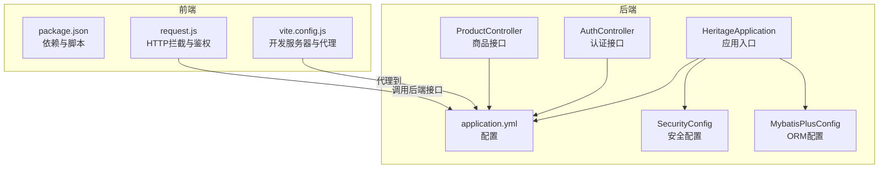
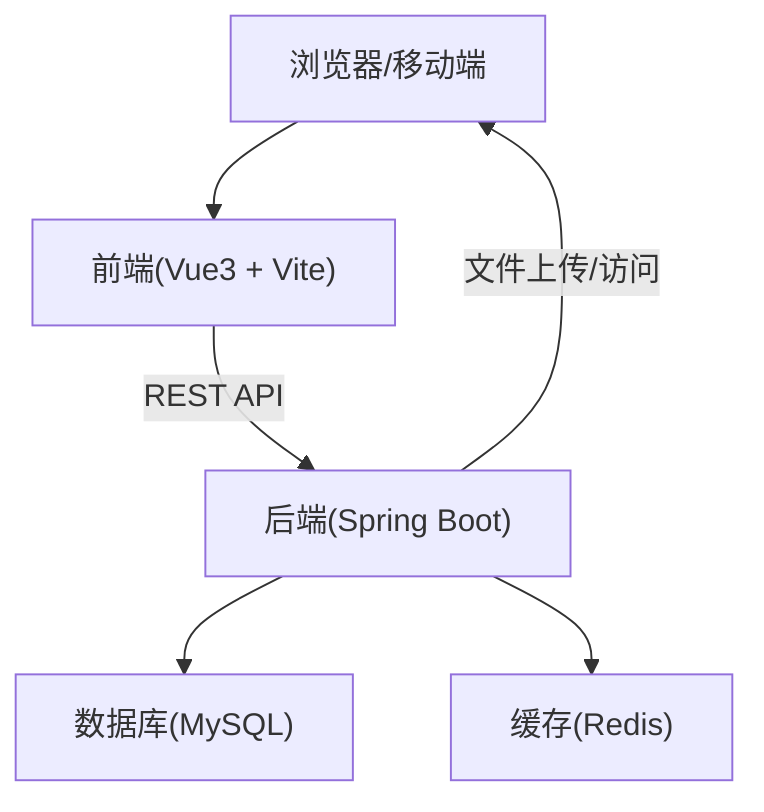
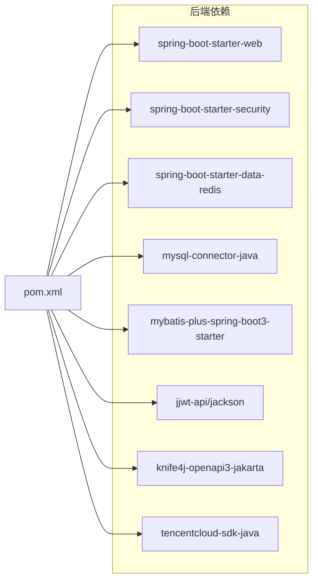

# 快速开始

<cite>
**本文引用的文件**
- [HeritageApplication.java](file://backend/src/main/java/com/heritage/HeritageApplication.java)
- [application.yml](file://backend/src/main/resources/application.yml)
- [pom.xml](file://backend/pom.xml)
- [SecurityConfig.java](file://backend/src/main/java/com/heritage/config/SecurityConfig.java)
- [MybatisPlusConfig.java](file://backend/src/main/java/com/heritage/config/MybatisPlusConfig.java)
- [AuthController.java](file://backend/src/main/java/com/heritage/controller/AuthController.java)
- [ProductController.java](file://backend/src/main/java/com/heritage/controller/ProductController.java)
- [package.json](file://frontend/package.json)
- [vite.config.js](file://frontend/vite.config.js)
- [request.js](file://frontend/src/utils/request.js)
- [setup-maven.ps1](file://setup-maven.ps1)
- [系统设计.md](file://TODO/系统设计.md)
- [数据库设计.md](file://TODO/数据库设计.md)
- [heritage.sql](file://backend/src/main/resources/sql/heritage.sql)
</cite>

## 目录
1. [简介](#简介)
2. [项目结构](#项目结构)
3. [核心组件](#核心组件)
4. [架构总览](#架构总览)
5. [详细组件分析](#详细组件分析)
6. [依赖分析](#依赖分析)
7. [性能考虑](#性能考虑)
8. [故障排查指南](#故障排查指南)
9. [结论](#结论)
10. [附录](#附录)

## 简介
本指南面向首次接触“非遗产品智能定制商城系统”的开发者，提供从环境准备、项目克隆、依赖安装、数据库初始化到启动运行的完整步骤，以及常见问题的解决方案与调试技巧。系统采用前后端分离架构，后端基于 Spring Boot，前端基于 Vue 3，集成 Knife4j 文档、JWT 鉴权、MyBatis-Plus、MySQL 与 Redis 等技术栈。

## 项目结构
- 后端（Spring Boot）
  - 应用入口与配置：应用入口类、Spring 配置、安全配置、MyBatis-Plus 配置、数据库 SQL 初始化脚本
  - 控制器与服务：认证、商品、订单、支付、文件、AI 图像等模块接口
- 前端（Vue 3 + Vite）
  - 构建脚本、代理配置、API 请求封装、路由与视图组件
- 开发辅助
  - Maven 环境变量脚本、设计文档与数据库设计说明

图表来源
- [HeritageApplication.java](file://backend/src/main/java/com/heritage/HeritageApplication.java#L1-L13)
- [application.yml](file://backend/src/main/resources/application.yml#L1-L63)
- [SecurityConfig.java](file://backend/src/main/java/com/heritage/config/SecurityConfig.java#L1-L67)
- [MybatisPlusConfig.java](file://backend/src/main/java/com/heritage/config/MybatisPlusConfig.java#L1-L31)
- [AuthController.java](file://backend/src/main/java/com/heritage/controller/AuthController.java#L1-L48)
- [ProductController.java](file://backend/src/main/java/com/heritage/controller/ProductController.java#L1-L130)
- [package.json](file://frontend/package.json#L1-L28)
- [vite.config.js](file://frontend/vite.config.js#L1-L22)
- [request.js](file://frontend/src/utils/request.js#L1-L45)

章节来源
- [HeritageApplication.java](file://backend/src/main/java/com/heritage/HeritageApplication.java#L1-L13)
- [application.yml](file://backend/src/main/resources/application.yml#L1-L63)
- [pom.xml](file://backend/pom.xml#L1-L129)
- [SecurityConfig.java](file://backend/src/main/java/com/heritage/config/SecurityConfig.java#L1-L67)
- [MybatisPlusConfig.java](file://backend/src/main/java/com/heritage/config/MybatisPlusConfig.java#L1-L31)
- [package.json](file://frontend/package.json#L1-L28)
- [vite.config.js](file://frontend/vite.config.js#L1-L22)
- [request.js](file://frontend/src/utils/request.js#L1-L45)

## 核心组件
- 应用入口与启动
  - 后端通过应用入口类启动 Spring Boot 应用，默认监听端口由配置文件指定
- 配置与连接
  - 数据源连接 MySQL，缓存连接 Redis，文件上传目录与公共访问基地址在配置文件中定义
- 安全与鉴权
  - 基于 Spring Security + JWT，无状态会话策略，开放部分公开接口，其余接口需鉴权
- ORM 与分页
  - MyBatis-Plus 提供分页、乐观锁与防全表更新保护
- 前后端通信
  - 前端通过 Axios 发起请求，自动注入 Authorization 头；Vite 开发服务器通过代理转发到后端

章节来源
- [HeritageApplication.java](file://backend/src/main/java/com/heritage/HeritageApplication.java#L1-L13)
- [application.yml](file://backend/src/main/resources/application.yml#L1-L63)
- [SecurityConfig.java](file://backend/src/main/java/com/heritage/config/SecurityConfig.java#L1-L67)
- [MybatisPlusConfig.java](file://backend/src/main/java/com/heritage/config/MybatisPlusConfig.java#L1-L31)
- [request.js](file://frontend/src/utils/request.js#L1-L45)

## 架构总览
系统采用前后端分离架构，前端通过 REST API 与后端交互，后端提供认证、商品、订单、支付、文件与 AI 图像等接口，数据库与缓存分别承载持久化与缓存需求。

图表来源
- [系统设计.md](file://TODO/系统设计.md#L23-L61)
- [application.yml](file://backend/src/main/resources/application.yml#L17-L35)
- [vite.config.js](file://frontend/vite.config.js#L12-L20)

## 详细组件分析

### 后端启动与配置
- 应用入口
  - 应用入口类负责启动 Spring Boot 应用
- 配置文件
  - 服务器端口、数据源、Redis 连接、JWT 秘钥与过期时间、Knife4j 文档开关、文件上传路径与公共访问基地址
- 安全配置
  - CSRF 关闭、无状态会话、公开接口白名单、JWT 过滤器接入
- ORM 配置
  - 分页、乐观锁、防全表更新拦截器注册

章节来源
- [HeritageApplication.java](file://backend/src/main/java/com/heritage/HeritageApplication.java#L1-L13)
- [application.yml](file://backend/src/main/resources/application.yml#L1-L63)
- [SecurityConfig.java](file://backend/src/main/java/com/heritage/config/SecurityConfig.java#L1-L67)
- [MybatisPlusConfig.java](file://backend/src/main/java/com/heritage/config/MybatisPlusConfig.java#L1-L31)

### 前端开发与代理
- 开发脚本
  - dev/build/preview 脚本，开发端口与主机绑定
- 代理配置
  - 将 /api 前缀请求代理到后端 8080 端口
- 请求封装
  - 自动读取本地 token 并注入 Authorization 头，统一处理响应与错误提示

章节来源
- [package.json](file://frontend/package.json#L1-L28)
- [vite.config.js](file://frontend/vite.config.js#L1-L22)
- [request.js](file://frontend/src/utils/request.js#L1-L45)

### 认证与商品接口示例
- 认证接口
  - 注册与登录接口，登录成功后返回 JWT Token
- 商品接口
  - 管理端商品增删改查、上下架、图片管理等，配合权限注解控制角色

章节来源
- [AuthController.java](file://backend/src/main/java/com/heritage/controller/AuthController.java#L1-L48)
- [ProductController.java](file://backend/src/main/java/com/heritage/controller/ProductController.java#L1-L130)

## 依赖分析
- 后端依赖
  - Spring Web、Validation、Security、Data Redis、MySQL Connector、MyBatis-Plus、JWT、Knife4j、腾讯云 SDK、Lombok 等
- 前端依赖
  - Vue 3、Element Plus、Axios、Pinia、Vue Router、Three.js、@google/model-viewer、Vite 插件等

图表来源
- [pom.xml](file://backend/pom.xml#L30-L97)

章节来源
- [pom.xml](file://backend/pom.xml#L1-L129)

## 性能考虑
- 启动与运行
  - 合理设置 JVM 参数与线程池大小，避免内存溢出
- 数据库
  - 使用分页与索引，避免全表扫描；合理设置连接池参数
- 缓存
  - 对热点数据使用 Redis 缓存，降低数据库压力
- 前端
  - 图片与 3D 模型资源按需加载，减少首屏压力

[本节为通用建议，无需列出章节来源]

## 故障排查指南
- 端口占用
  - 后端默认端口 8080，前端默认端口 3030；如冲突请在配置文件或脚本中调整
- 数据库连接失败
  - 检查配置文件中的数据库 URL、用户名、密码是否正确；确认 MySQL 服务已启动
- Redis 连接失败
  - 检查 Redis 服务状态与连接参数；如未使用可临时关闭相关配置
- 文件上传异常
  - 确认上传目录存在且有写权限；检查配置文件中的上传路径与公共访问基地址
- 跨域与鉴权
  - 前端代理需指向后端地址；登录后确保本地存储 token 正确传递
- Maven 环境
  - 如无法识别 mvn 命令，执行仓库提供的 PowerShell 脚本将 Maven bin 目录加入 PATH

章节来源
- [application.yml](file://backend/src/main/resources/application.yml#L1-L63)
- [vite.config.js](file://frontend/vite.config.js#L12-L20)
- [request.js](file://frontend/src/utils/request.js#L1-L45)
- [setup-maven.ps1](file://setup-maven.ps1#L1-L3)

## 结论
通过本快速开始指南，您应已完成环境准备、项目克隆、依赖安装、数据库初始化与启动运行，并掌握常见问题的排查方法。建议在本地开发完成后，继续阅读系统设计与数据库设计文档，以便深入理解模块职责与数据关系。

[本节为总结性内容，无需列出章节来源]

## 附录

### 环境搭建步骤
- JDK 17
  - 安装 JDK 17，确保 JAVA_HOME 与 PATH 配置正确
- Node.js
  - 安装 Node.js，确保 npm 可用
- MySQL
  - 安装 MySQL，创建数据库与用户，导入初始化 SQL
- Redis（可选）
  - 安装 Redis，确保服务正常运行
- Maven（可选）
  - 若系统未配置 Maven，可执行仓库提供的 PowerShell 脚本将 Maven bin 目录加入 PATH

章节来源
- [pom.xml](file://backend/pom.xml#L21-L28)
- [application.yml](file://backend/src/main/resources/application.yml#L17-L35)
- [setup-maven.ps1](file://setup-maven.ps1#L1-L3)

### 项目克隆与依赖安装
- 克隆仓库至本地
- 后端
  - 使用 Maven 安装依赖并打包（可选）
- 前端
  - 使用 npm 安装依赖

章节来源
- [pom.xml](file://backend/pom.xml#L1-L129)
- [package.json](file://frontend/package.json#L1-L28)

### 数据库初始化
- 创建数据库与用户
- 执行初始化 SQL（系统设计文档与数据库设计文档中包含表结构与关系说明）
- 参考初始化脚本中的表结构与示例数据

章节来源
- [系统设计.md](file://TODO/系统设计.md#L23-L61)
- [数据库设计.md](file://TODO/数据库设计.md#L1-L370)
- [heritage.sql](file://backend/src/main/resources/sql/heritage.sql#L1-L88)

### 启动运行
- 后端
  - 启动应用入口类或使用 Maven 插件运行
- 前端
  - 启动开发服务器，访问前端页面
- 接口文档
  - 启用 Knife4j 后可通过文档页面调试接口

章节来源
- [HeritageApplication.java](file://backend/src/main/java/com/heritage/HeritageApplication.java#L1-L13)
- [application.yml](file://backend/src/main/resources/application.yml#L54-L57)
- [package.json](file://frontend/package.json#L5-L9)

### 本地开发环境验证
- 后端
  - 访问公开接口与受控接口，确认鉴权流程与权限控制
- 前端
  - 登录后访问需要鉴权的页面，确认 token 注入与错误提示
- 文件上传
  - 上传文件后确认可访问与历史记录

章节来源
- [SecurityConfig.java](file://backend/src/main/java/com/heritage/config/SecurityConfig.java#L50-L65)
- [request.js](file://frontend/src/utils/request.js#L9-L42)

### 开发工具与 IDE 配置建议
- 后端
  - 使用支持 Spring Boot 的 IDE（如 IntelliJ IDEA），开启 Lombok 插件
- 前端
  - 使用 VSCode，安装 Vue、ESLint、Prettier 等插件
- 版本要求
  - JDK 17、Node.js 最新 LTS、MySQL 8、Redis 6+

章节来源
- [pom.xml](file://backend/pom.xml#L21-L28)
- [package.json](file://frontend/package.json#L1-L28)
- [系统设计.md](file://TODO/系统设计.md#L47-L61)