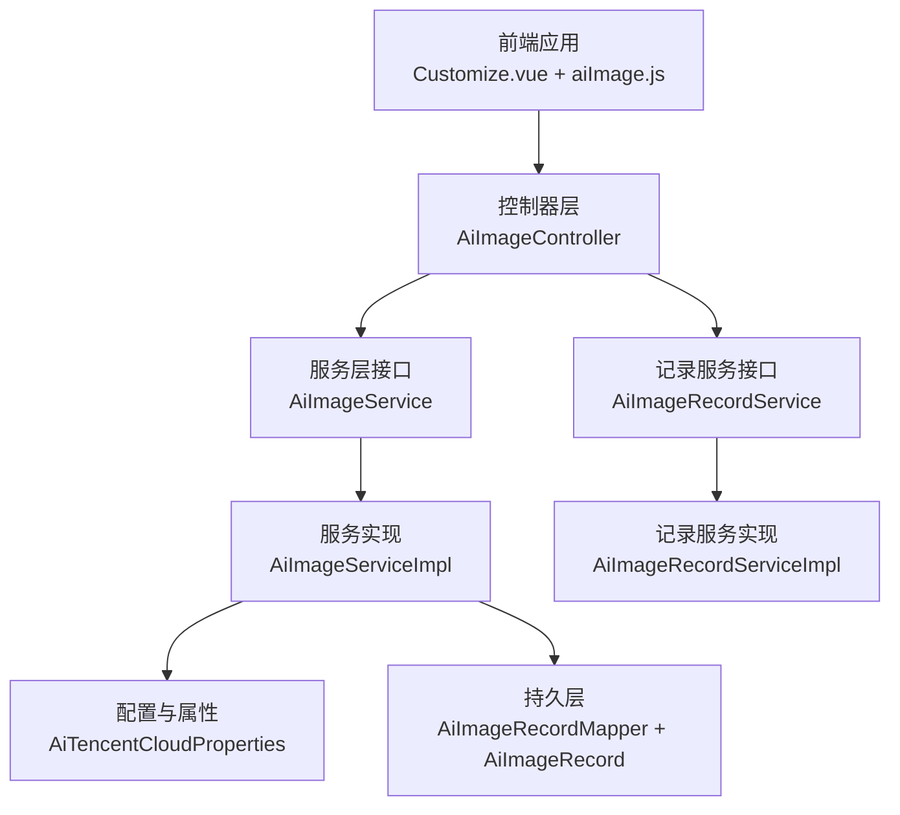
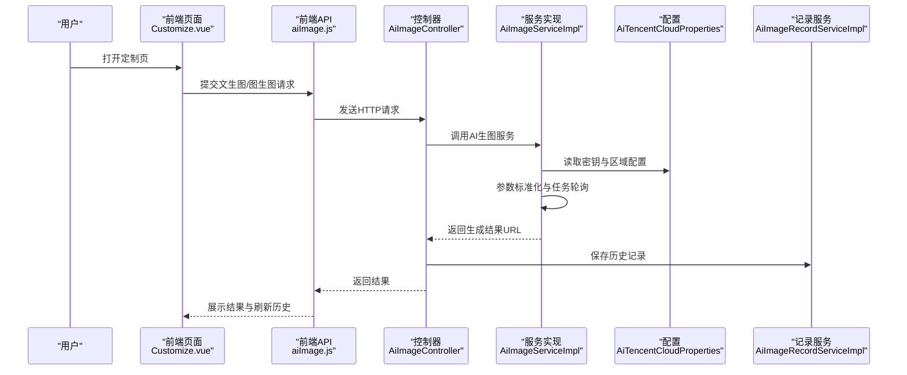
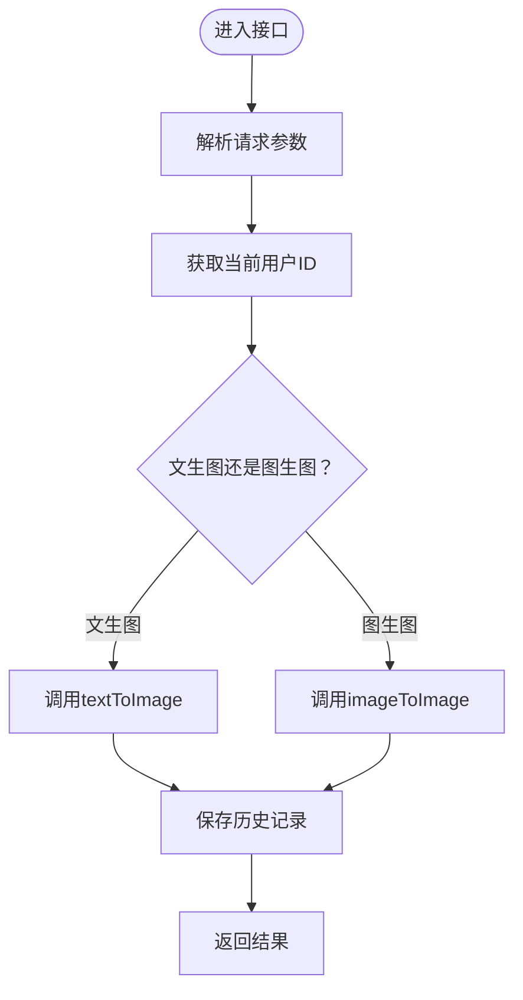
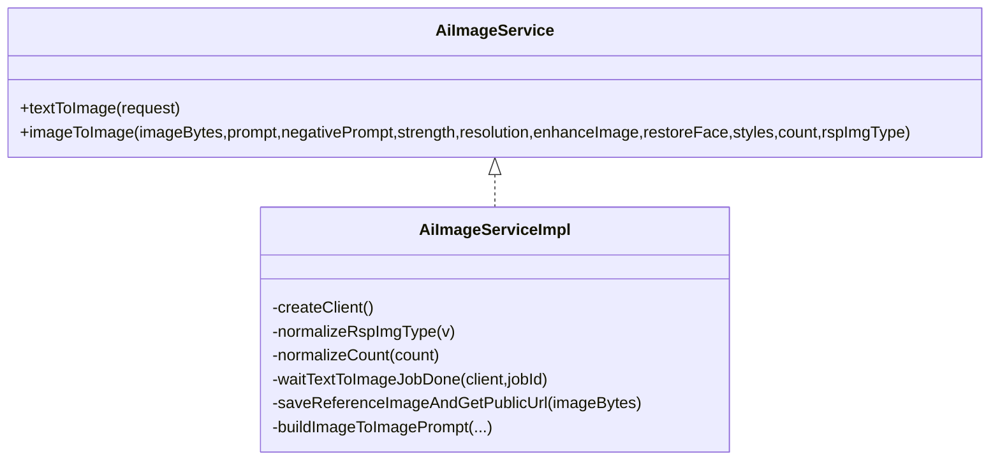
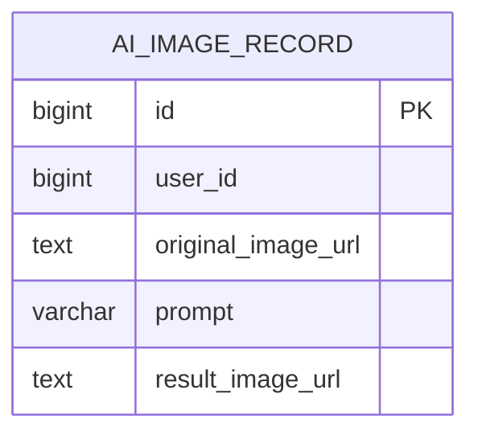
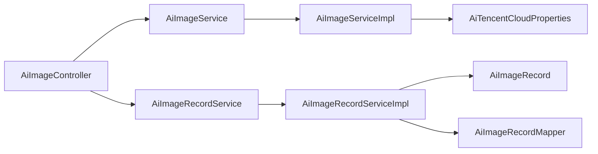
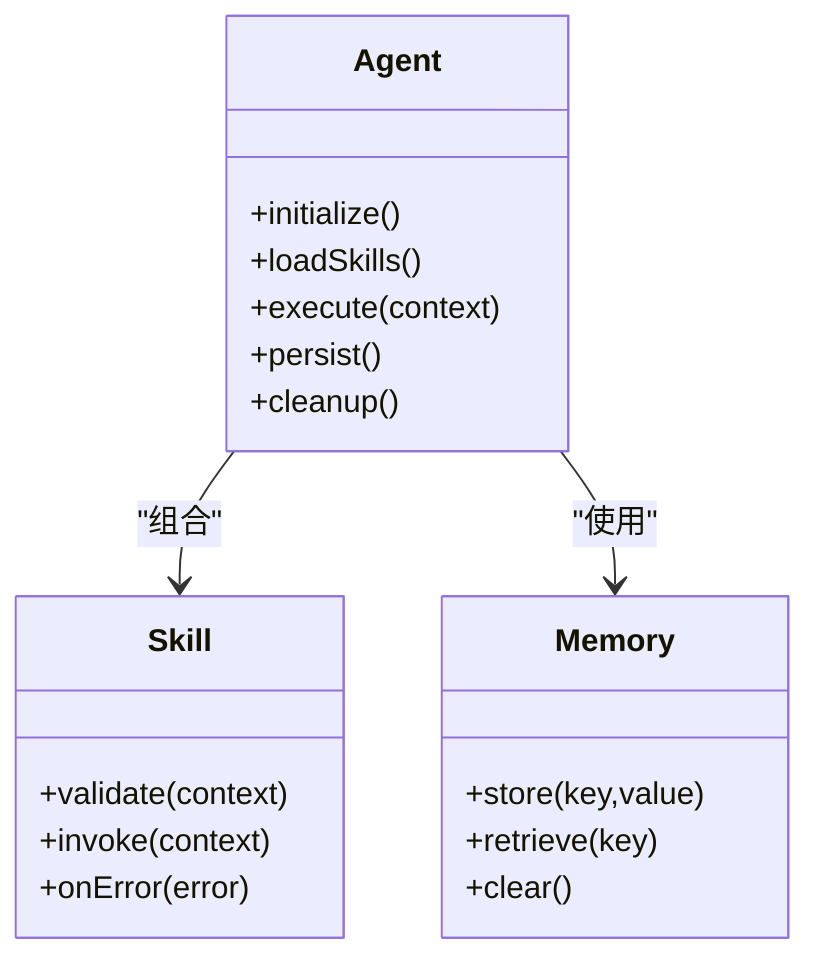

# AI智能体集成

<cite>
**本文引用的文件**
- [TODO/非遗智能定制模块开发任务清单.md](file://TODO/非遗智能定制模块开发任务清单.md)
- [TODO/非遗智能定制模块设计方案.md](file://TODO/非遗智能定制模块设计方案.md)
- [AiImageController.java](file://backend/src/main/java/com/heritage/controller/AiImageController.java)
- [AiImageService.java](file://backend/src/main/java/com/heritage/service/AiImageService.java)
- [AiImageServiceImpl.java](file://backend/src/main/java/com/heritage/service/impl/AiImageServiceImpl.java)
- [AiImageRecordService.java](file://backend/src/main/java/com/heritage/service/AiImageRecordService.java)
- [AiImageRecordServiceImpl.java](file://backend/src/main/java/com/heritage/service/impl/AiImageRecordServiceImpl.java)
- [AiImageRecord.java](file://backend/src/main/java/com/heritage/entity/AiImageRecord.java)
- [AiImageRecordMapper.java](file://backend/src/main/java/com/heritage/mapper/AiImageRecordMapper.java)
- [AiTencentCloudProperties.java](file://backend/src/main/java/com/heritage/config/AiTencentCloudProperties.java)
- [aiImage.js](file://frontend/src/api/aiImage.js)
- [Customize.vue](file://frontend/src/views/Customize.vue)
</cite>

## 目录
1. [简介](#简介)
2. [项目结构](#项目结构)
3. [核心组件](#核心组件)
4. [架构总览](#架构总览)
5. [组件详细分析](#组件详细分析)
6. [依赖关系分析](#依赖关系分析)
7. [性能考量](#性能考量)
8. [故障排查指南](#故障排查指南)
9. [结论](#结论)
10. [附录](#附录)

## 简介
本文件面向非遗产品智能定制商城系统的AI智能体集成，聚焦于“.qoder”目录下的智能体与技能配置体系说明。当前仓库中“.qoder”目录不存在，但系统已实现完整的AI图像生成功能，涵盖文生图与图生图两大模式，具备任务记录、历史查询、并发控制与错误处理等能力。本文将基于现有实现，给出AI智能体的架构设计思路、生命周期管理、状态保持与上下文处理机制的实践方案，并提供开发规范、扩展方法与与业务系统的集成方案，帮助开发者理解与扩展该AI智能体系统。

## 项目结构
系统围绕“智能定制-AI生图”模块构建，采用前后端分离与标准的后端分层架构：
- 前端：提供定制页面与API封装，负责用户交互与结果展示
- 后端：控制器层、服务层、持久层与配置层，负责业务编排、AI能力接入与数据持久化
- 数据库：ai_image_record表用于记录用户生成的历史记录

图表来源
- [AiImageController.java](file://backend/src/main/java/com/heritage/controller/AiImageController.java#L41-L320)
- [AiImageService.java](file://backend/src/main/java/com/heritage/service/AiImageService.java#L6-L21)
- [AiImageServiceImpl.java](file://backend/src/main/java/com/heritage/service/impl/AiImageServiceImpl.java#L35-L430)
- [AiImageRecordService.java](file://backend/src/main/java/com/heritage/service/AiImageRecordService.java#L11-L16)
- [AiImageRecordServiceImpl.java](file://backend/src/main/java/com/heritage/service/impl/AiImageRecordServiceImpl.java#L17-L65)
- [AiImageRecord.java](file://backend/src/main/java/com/heritage/entity/AiImageRecord.java#L9-L29)
- [AiImageRecordMapper.java](file://backend/src/main/java/com/heritage/mapper/AiImageRecordMapper.java#L7-L11)
- [AiTencentCloudProperties.java](file://backend/src/main/java/com/heritage/config/AiTencentCloudProperties.java)

章节来源
- [AiImageController.java](file://backend/src/main/java/com/heritage/controller/AiImageController.java#L41-L320)
- [AiImageServiceImpl.java](file://backend/src/main/java/com/heritage/service/impl/AiImageServiceImpl.java#L35-L430)
- [AiImageRecordServiceImpl.java](file://backend/src/main/java/com/heritage/service/impl/AiImageRecordServiceImpl.java#L17-L65)
- [AiImageRecord.java](file://backend/src/main/java/com/heritage/entity/AiImageRecord.java#L9-L29)
- [AiImageRecordMapper.java](file://backend/src/main/java/com/heritage/mapper/AiImageRecordMapper.java#L7-L11)
- [AiTencentCloudProperties.java](file://backend/src/main/java/com/heritage/config/AiTencentCloudProperties.java)

## 核心组件
- 控制器层：提供REST接口，负责鉴权、参数解析、结果组装与历史记录落库
- 服务层接口与实现：封装AI能力调用（文生图/图生图）、参数标准化、错误映射与任务轮询
- 记录服务与实体：负责生成记录的持久化与分页查询
- 配置层：读取腾讯云密钥、区域、端点与公共URL等配置
- 前端API与页面：封装请求、展示结果与历史记录

章节来源
- [AiImageController.java](file://backend/src/main/java/com/heritage/controller/AiImageController.java#L41-L320)
- [AiImageService.java](file://backend/src/main/java/com/heritage/service/AiImageService.java#L6-L21)
- [AiImageServiceImpl.java](file://backend/src/main/java/com/heritage/service/impl/AiImageServiceImpl.java#L35-L430)
- [AiImageRecordService.java](file://backend/src/main/java/com/heritage/service/AiImageRecordService.java#L11-L16)
- [AiImageRecordServiceImpl.java](file://backend/src/main/java/com/heritage/service/impl/AiImageRecordServiceImpl.java#L17-L65)
- [AiImageRecord.java](file://backend/src/main/java/com/heritage/entity/AiImageRecord.java#L9-L29)
- [AiTencentCloudProperties.java](file://backend/src/main/java/com/heritage/config/AiTencentCloudProperties.java)

## 架构总览
系统采用“控制器-服务-持久层-配置”的分层架构，结合腾讯混元AI能力实现智能定制功能。控制器负责用户交互与参数校验，服务层负责AI调用与任务轮询，持久层负责记录落库，配置层提供外部能力接入参数。

图表来源
- [AiImageController.java](file://backend/src/main/java/com/heritage/controller/AiImageController.java#L58-L97)
- [AiImageServiceImpl.java](file://backend/src/main/java/com/heritage/service/impl/AiImageServiceImpl.java#L52-L206)
- [AiImageRecordServiceImpl.java](file://backend/src/main/java/com/heritage/service/impl/AiImageRecordServiceImpl.java#L20-L38)
- [aiImage.js](file://frontend/src/api/aiImage.js)
- [Customize.vue](file://frontend/src/views/Customize.vue)

## 组件详细分析

### 控制器层：AiImageController
- 职责
  - 文生图接口：接收JSON参数，调用服务生成图片并保存历史记录
  - 图生图接口：接收multipart表单，保存参考图到本地并调用服务生成图片，保存历史记录
  - 历史记录接口：分页查询当前用户的生成记录
  - 鉴权：从安全上下文中获取当前用户ID
- 关键流程
  - 参数归一化与URL构建
  - 参考图保存与结果图持久化
  - 失败时抛出业务异常

图表来源
- [AiImageController.java](file://backend/src/main/java/com/heritage/controller/AiImageController.java#L58-L97)

章节来源
- [AiImageController.java](file://backend/src/main/java/com/heritage/controller/AiImageController.java#L41-L320)

### 服务层：AiImageService 与 AiImageServiceImpl
- 职责
  - 文生图：提交任务、轮询任务完成、组装结果
  - 图生图：支持两种模式（基于文本作业或直接图生图），参数标准化与强度校验
  - 错误映射：将SDK异常映射为业务异常
- 关键机制
  - 任务轮询：根据状态码轮询，超时与失败处理
  - 参数归一化：分辨率、数量、响应类型等
  - 图片保存：根据配置决定是否使用公网URL与本地落盘

图表来源
- [AiImageService.java](file://backend/src/main/java/com/heritage/service/AiImageService.java#L6-L21)
- [AiImageServiceImpl.java](file://backend/src/main/java/com/heritage/service/impl/AiImageServiceImpl.java#L35-L430)

章节来源
- [AiImageService.java](file://backend/src/main/java/com/heritage/service/AiImageService.java#L6-L21)
- [AiImageServiceImpl.java](file://backend/src/main/java/com/heritage/service/impl/AiImageServiceImpl.java#L35-L430)

### 记录服务与实体：AiImageRecordService 与 AiImageRecord
- 职责
  - 保存记录：批量保存结果URL，支持多图场景
  - 分页查询：按用户ID查询历史记录并转换为VO
- 数据模型
  - ai_image_record：包含用户ID、参考图URL、提示词、结果图URL

图表来源
- [AiImageRecord.java](file://backend/src/main/java/com/heritage/entity/AiImageRecord.java#L9-L29)
- [AiImageRecordMapper.java](file://backend/src/main/java/com/heritage/mapper/AiImageRecordMapper.java#L7-L11)

章节来源
- [AiImageRecordService.java](file://backend/src/main/java/com/heritage/service/AiImageRecordService.java#L11-L16)
- [AiImageRecordServiceImpl.java](file://backend/src/main/java/com/heritage/service/impl/AiImageRecordServiceImpl.java#L17-L65)
- [AiImageRecord.java](file://backend/src/main/java/com/heritage/entity/AiImageRecord.java#L9-L29)

### 前端集成：aiImage.js 与 Customize.vue
- 职责
  - 封装API：提供textToImage、imageToImage、pageAiImageRecords方法
  - 页面交互：定制页展示输入区、参数区、结果区与历史区
- 集成要点
  - 生成中状态、失败提示与历史记录刷新
  - 前端对文生图/图生图历史记录的分组展示策略

章节来源
- [aiImage.js](file://frontend/src/api/aiImage.js)
- [Customize.vue](file://frontend/src/views/Customize.vue)

## 依赖关系分析
- 控制器依赖服务接口与记录服务接口
- 服务实现依赖配置类与腾讯云SDK
- 记录服务依赖实体与Mapper
- 前端依赖控制器提供的REST接口

图表来源
- [AiImageController.java](file://backend/src/main/java/com/heritage/controller/AiImageController.java#L41-L320)
- [AiImageService.java](file://backend/src/main/java/com/heritage/service/AiImageService.java#L6-L21)
- [AiImageServiceImpl.java](file://backend/src/main/java/com/heritage/service/impl/AiImageServiceImpl.java#L35-L430)
- [AiImageRecordService.java](file://backend/src/main/java/com/heritage/service/AiImageRecordService.java#L11-L16)
- [AiImageRecordServiceImpl.java](file://backend/src/main/java/com/heritage/service/impl/AiImageRecordServiceImpl.java#L17-L65)
- [AiImageRecord.java](file://backend/src/main/java/com/heritage/entity/AiImageRecord.java#L9-L29)
- [AiImageRecordMapper.java](file://backend/src/main/java/com/heritage/mapper/AiImageRecordMapper.java#L7-L11)
- [AiTencentCloudProperties.java](file://backend/src/main/java/com/heritage/config/AiTencentCloudProperties.java)

章节来源
- [AiImageController.java](file://backend/src/main/java/com/heritage/controller/AiImageController.java#L41-L320)
- [AiImageServiceImpl.java](file://backend/src/main/java/com/heritage/service/impl/AiImageServiceImpl.java#L35-L430)
- [AiImageRecordServiceImpl.java](file://backend/src/main/java/com/heritage/service/impl/AiImageRecordServiceImpl.java#L17-L65)

## 性能考量
- 同步调用与任务轮询：当前实现为同步接口，存在请求耗时长与超时风险
- 并发控制：建议引入用户级并发限制与全局限流，避免触发腾讯侧并发限制
- 异步任务：建议升级为异步任务模式，前端轮询或使用SSE/WebSocket
- 存储优化：建议将参考图与结果图落盘至对象存储（如COS），提升稳定性与可访问性
- 缓存与CDN：前端缓存最近一次结果与参数，结合CDN加速访问

章节来源
- [TODO/非遗智能定制模块设计方案.md](file://TODO/非遗智能定制模块设计方案.md#L74-L87)
- [TODO/非遗智能定制模块开发任务清单.md](file://TODO/非遗智能定制模块开发任务清单.md#L98-L101)

## 故障排查指南
- 常见错误
  - 未登录：控制器从安全上下文获取用户ID失败
  - 图片读取失败：文件读取异常或非图片类型
  - 参考图保存失败：本地文件写入异常
  - 腾讯云接口调用失败：SDK异常映射为业务异常
  - 任务超时：轮询超过最大等待时间
- 排查步骤
  - 检查鉴权与用户上下文
  - 校验文件类型与大小
  - 查看配置项（密钥、区域、端点、公共URL）
  - 观察任务状态码与错误信息
  - 检查存储路径与权限

章节来源
- [AiImageController.java](file://backend/src/main/java/com/heritage/controller/AiImageController.java#L99-L105)
- [AiImageServiceImpl.java](file://backend/src/main/java/com/heritage/service/impl/AiImageServiceImpl.java#L266-L280)
- [AiImageServiceImpl.java](file://backend/src/main/java/com/heritage/service/impl/AiImageServiceImpl.java#L380-L418)

## 结论
当前系统已实现完整的AI图像生成功能，具备清晰的分层架构与完善的错误处理机制。尽管“.qoder”目录尚未存在，但基于现有实现，可将其作为未来智能体与技能体系的扩展容器。建议优先完善异步任务、并发控制与对象存储落盘，以提升系统稳定性与可扩展性。

## 附录

### AI智能体架构设计（概念性）
以下为基于现有实现的智能体架构设计思路，供“.qoder”目录落地时参考：
- Agent：封装用户意图识别、参数提取与任务编排
- Skill：封装具体技能（如文生图、图生图、风格迁移、质量增强）
- Memory：维护上下文与历史记录，支持多轮对话与参数复用
- 生命周期：初始化、加载技能、执行、持久化、清理
- 上下文处理：参数归一化、错误映射、结果组装与历史落库

### 开发规范
- 接口定义
  - 请求参数：必填与可选字段明确，类型与范围校验
  - 响应格式：统一Result包装，错误码与错误信息规范化
- 参数传递
  - 参数归一化：去除空白、默认值填充、范围校验
  - 上下文传递：通过Context对象传递用户ID、历史记录与中间态
- 结果处理
  - 成功：组装结果URL列表，落库历史记录
  - 失败：捕获异常并映射为业务错误，返回明确提示

章节来源
- [AiImageService.java](file://backend/src/main/java/com/heritage/service/AiImageService.java#L6-L21)
- [AiImageServiceImpl.java](file://backend/src/main/java/com/heritage/service/impl/AiImageServiceImpl.java#L229-L264)
- [AiImageController.java](file://backend/src/main/java/com/heritage/controller/AiImageController.java#L107-L132)

### 技能扩展方法
- 创建自定义技能
  - 定义技能接口与实现，遵循参数校验与错误处理规范
  - 在Agent中注册与编排技能调用
- 智能体组合
  - 通过上下文传递与结果组装，实现多技能串联与并行
  - 使用Memory保存中间态，支持多轮对话与参数复用

章节来源
- [AiImageService.java](file://backend/src/main/java/com/heritage/service/AiImageService.java#L6-L21)
- [AiImageServiceImpl.java](file://backend/src/main/java/com/heritage/service/impl/AiImageServiceImpl.java#L35-L430)

### 与业务系统集成方案
- 用户交互
  - 前端定制页提供参数面板与结果展示，支持历史记录分组
  - 生成中状态与失败提示，刷新历史记录
- 任务调度
  - 后端提供同步/异步两种模式，建议逐步升级为异步任务
  - 引入并发控制与限流，避免触发外部服务限制
- 结果反馈
  - 统一结果URL落盘至对象存储，保证长期可访问
  - 前端缓存最近一次结果与参数，提升用户体验

章节来源
- [TODO/非遗智能定制模块开发任务清单.md](file://TODO/非遗智能定制模块开发任务清单.md#L74-L81)
- [TODO/非遗智能定制模块设计方案.md](file://TODO/非遗智能定制模块设计方案.md#L224-L264)
- [AiImageController.java](file://backend/src/main/java/com/heritage/controller/AiImageController.java#L58-L97)
- [AiImageRecordServiceImpl.java](file://backend/src/main/java/com/heritage/service/impl/AiImageRecordServiceImpl.java#L20-L38)