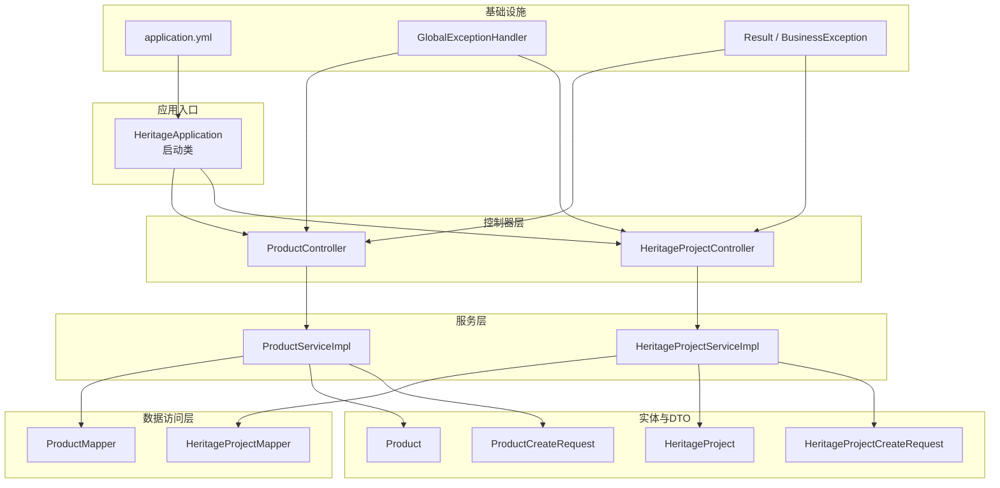
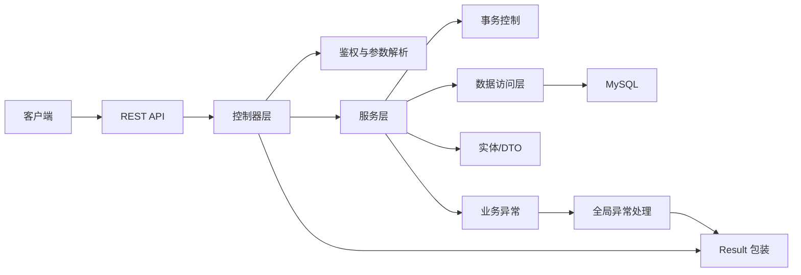
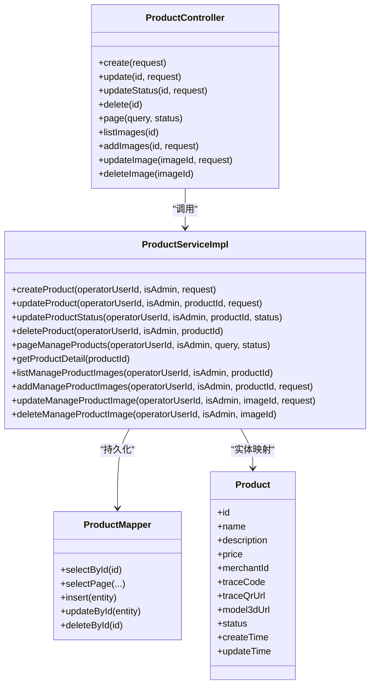
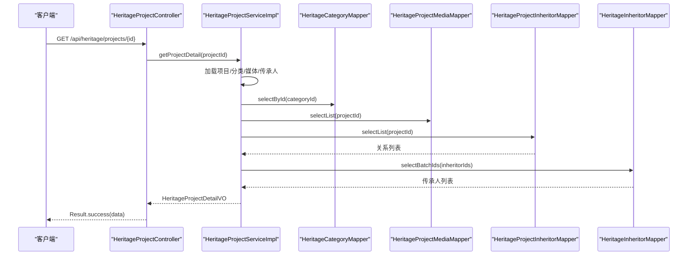
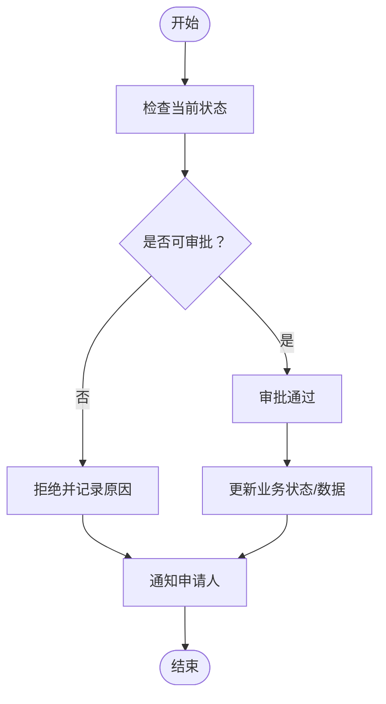
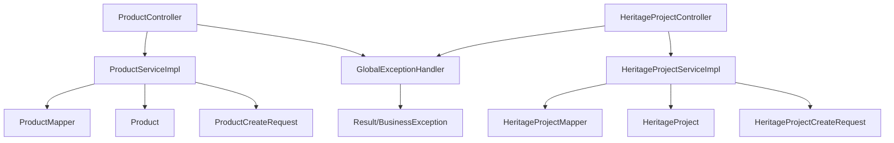

# 业务逻辑扩展

<cite>
**本文引用的文件**
- [HeritageApplication.java](file://backend/src/main/java/com/heritage/HeritageApplication.java)
- [Result.java](file://backend/src/main/java/com/heritage/common/Result.java)
- [BusinessException.java](file://backend/src/main/java/com/heritage/common/BusinessException.java)
- [GlobalExceptionHandler.java](file://backend/src/main/java/com/heritage/common/GlobalExceptionHandler.java)
- [application.yml](file://backend/src/main/resources/application.yml)
- [ProductController.java](file://backend/src/main/java/com/heritage/controller/ProductController.java)
- [ProductServiceImpl.java](file://backend/src/main/java/com/heritage/service/impl/ProductServiceImpl.java)
- [Product.java](file://backend/src/main/java/com/heritage/entity/Product.java)
- [ProductCreateRequest.java](file://backend/src/main/java/com/heritage/dto/ProductCreateRequest.java)
- [ProductMapper.java](file://backend/src/main/java/com/heritage/mapper/ProductMapper.java)
- [HeritageProjectController.java](file://backend/src/main/java/com/heritage/controller/HeritageProjectController.java)
- [HeritageProjectServiceImpl.java](file://backend/src/main/java/com/heritage/service/impl/HeritageProjectServiceImpl.java)
- [HeritageProject.java](file://backend/src/main/java/com/heritage/entity/HeritageProject.java)
- [HeritageProjectCreateRequest.java](file://backend/src/main/java/com/heritage/dto/HeritageProjectCreateRequest.java)
- [heritage.sql](file://backend/src/main/resources/sql/heritage.sql)
</cite>

## 目录
1. [引言](#引言)
2. [项目结构](#项目结构)
3. [核心组件](#核心组件)
4. [架构总览](#架构总览)
5. [详细组件分析](#详细组件分析)
6. [依赖关系分析](#依赖关系分析)
7. [性能考量](#性能考量)
8. [故障排查指南](#故障排查指南)
9. [结论](#结论)
10. [附录](#附录)

## 引言
本扩展文档面向“非遗产品智能定制商城系统”，在现有业务框架基础上，提供服务层、DTO/Entity、控制器层的扩展模式与最佳实践，涵盖新业务逻辑添加、现有逻辑修改、业务规则配置化、审批流程与状态机设计、工作流集成建议、以及业务数据扩展策略（新增字段、迁移与兼容）。目标是在满足当前需求的同时，保持系统的稳定性与可维护性。

## 项目结构
后端采用标准的分层架构：控制器层负责HTTP请求入口与鉴权；服务层承载业务逻辑与事务控制；数据访问层基于MyBatis-Plus；实体与DTO分别承担持久化与传输模型职责；全局异常处理统一返回结果包装；配置文件集中管理数据库、Redis、JWT与AI能力开关等。

图表来源
- [HeritageApplication.java](file://backend/src/main/java/com/heritage/HeritageApplication.java#L1-L13)
- [ProductController.java](file://backend/src/main/java/com/heritage/controller/ProductController.java#L1-L130)
- [ProductServiceImpl.java](file://backend/src/main/java/com/heritage/service/impl/ProductServiceImpl.java#L1-L507)
- [ProductMapper.java](file://backend/src/main/java/com/heritage/mapper/ProductMapper.java#L1-L11)
- [Product.java](file://backend/src/main/java/com/heritage/entity/Product.java#L1-L50)
- [ProductCreateRequest.java](file://backend/src/main/java/com/heritage/dto/ProductCreateRequest.java#L1-L22)
- [HeritageProjectController.java](file://backend/src/main/java/com/heritage/controller/HeritageProjectController.java#L1-L40)
- [HeritageProjectServiceImpl.java](file://backend/src/main/java/com/heritage/service/impl/HeritageProjectServiceImpl.java#L1-L536)
- [HeritageProject.java](file://backend/src/main/java/com/heritage/entity/HeritageProject.java#L1-L32)
- [HeritageProjectCreateRequest.java](file://backend/src/main/java/com/heritage/dto/HeritageProjectCreateRequest.java#L1-L26)
- [application.yml](file://backend/src/main/resources/application.yml#L1-L63)
- [GlobalExceptionHandler.java](file://backend/src/main/java/com/heritage/common/GlobalExceptionHandler.java#L1-L62)
- [Result.java](file://backend/src/main/java/com/heritage/common/Result.java#L1-L44)
- [BusinessException.java](file://backend/src/main/java/com/heritage/common/BusinessException.java#L1-L20)

章节来源
- [HeritageApplication.java](file://backend/src/main/java/com/heritage/HeritageApplication.java#L1-L13)
- [application.yml](file://backend/src/main/resources/application.yml#L1-L63)

## 核心组件
- 统一响应包装：Result 提供成功/错误返回体，约定 code/message/data 结构，便于前端统一处理。
- 全局异常处理：GlobalExceptionHandler 将业务异常、参数校验异常、认证/权限异常统一转换为 Result，保证接口一致性。
- DTO/Entity 设计：DTO 聚焦传输与校验，Entity 聚焦持久化映射，二者分离降低耦合。
- 服务层事务边界：服务层使用 @Transactional 控制事务，结合权限校验与状态校验，保障数据一致性。
- 控制器层鉴权与入参：控制器通过 Spring Security 获取当前用户，结合 @PreAuthorize 进行角色级权限控制。

章节来源
- [Result.java](file://backend/src/main/java/com/heritage/common/Result.java#L1-L44)
- [BusinessException.java](file://backend/src/main/java/com/heritage/common/BusinessException.java#L1-L20)
- [GlobalExceptionHandler.java](file://backend/src/main/java/com/heritage/common/GlobalExceptionHandler.java#L1-L62)
- [ProductController.java](file://backend/src/main/java/com/heritage/controller/ProductController.java#L1-L130)
- [ProductServiceImpl.java](file://backend/src/main/java/com/heritage/service/impl/ProductServiceImpl.java#L1-L507)

## 架构总览
系统遵循“控制器-服务-数据访问-实体”的分层，控制器负责鉴权与参数封装，服务层实现业务规则与事务，数据访问层屏蔽SQL细节，实体与DTO分别承担持久化与传输职责。全局异常处理器贯穿所有控制器，确保错误语义一致。

图表来源
- [ProductController.java](file://backend/src/main/java/com/heritage/controller/ProductController.java#L1-L130)
- [ProductServiceImpl.java](file://backend/src/main/java/com/heritage/service/impl/ProductServiceImpl.java#L1-L507)
- [ProductMapper.java](file://backend/src/main/java/com/heritage/mapper/ProductMapper.java#L1-L11)
- [GlobalExceptionHandler.java](file://backend/src/main/java/com/heritage/common/GlobalExceptionHandler.java#L1-L62)
- [Result.java](file://backend/src/main/java/com/heritage/common/Result.java#L1-L44)

## 详细组件分析

### 商品模块（服务层扩展模式）
- 新增业务逻辑
  - 在服务层新增方法时，优先在 Service 接口中声明，实现类中实现具体逻辑，保持接口契约稳定。
  - 对外暴露的业务方法应包含权限校验与状态校验，避免越权与非法状态变更。
  - 使用 @Transactional 明确事务边界，确保多表写入的一致性。
- 现有逻辑修改
  - 修改字段校验规则时，集中在服务层 validate 方法内，便于复用与测试。
  - 若需调整默认值或默认状态，统一在创建流程中设置，避免分散逻辑。
- 业务规则配置化
  - 对于状态码、默认值、阈值等，建议从配置文件或常量中读取，必要时引入配置中心，便于灰度与回滚。
- DTO/Entity 扩展
  - DTO 增加字段时，需同步在控制器层进行校验注解与文档标注；服务层对新增字段进行非空/范围校验。
  - Entity 增加字段时，需配合数据库迁移脚本与 MyBatis-Plus 映射，确保序列化/反序列化兼容。
- 控制器层扩展
  - 新增接口时，遵循现有鉴权注解与返回体规范，统一使用 Result.success()/error()。
  - 对于复杂查询，使用 PageQuery 作为分页参数载体，保持接口风格一致。

图表来源
- [ProductController.java](file://backend/src/main/java/com/heritage/controller/ProductController.java#L1-L130)
- [ProductServiceImpl.java](file://backend/src/main/java/com/heritage/service/impl/ProductServiceImpl.java#L1-L507)
- [ProductMapper.java](file://backend/src/main/java/com/heritage/mapper/ProductMapper.java#L1-L11)
- [Product.java](file://backend/src/main/java/com/heritage/entity/Product.java#L1-L50)

章节来源
- [ProductController.java](file://backend/src/main/java/com/heritage/controller/ProductController.java#L1-L130)
- [ProductServiceImpl.java](file://backend/src/main/java/com/heritage/service/impl/ProductServiceImpl.java#L1-L507)
- [Product.java](file://backend/src/main/java/com/heritage/entity/Product.java#L1-L50)
- [ProductCreateRequest.java](file://backend/src/main/java/com/heritage/dto/ProductCreateRequest.java#L1-L22)
- [ProductMapper.java](file://backend/src/main/java/com/heritage/mapper/ProductMapper.java#L1-L11)

### 非遗项目模块（服务层扩展模式）
- 新增业务逻辑
  - 项目媒体管理（图片/工艺图/视频）支持类型白名单与排序字段，新增/更新/删除均需校验存在性与类型合法性。
  - 项目与传承人关联关系批量维护，先清理旧关系再插入新关系，保证一致性。
- 现有逻辑修改
  - 列表页聚合分类名与传承人名列表，通过一次查询+内存聚合减少多次数据库往返。
  - 详情页按顺序加载媒体与关联传承人，避免重复查询。
- 业务规则配置化
  - 媒体类型白名单集中定义，便于扩展新类型。
- DTO/Entity 扩展
  - DTO 中对必填字段进行校验，服务层对类型与URL进行非空与格式校验。
  - 实体字段与数据库表结构一一对应，新增字段需同步迁移。
- 控制器层扩展
  - 接口命名与鉴权保持与商品模块一致，统一返回 Result。

图表来源
- [HeritageProjectController.java](file://backend/src/main/java/com/heritage/controller/HeritageProjectController.java#L1-L40)
- [HeritageProjectServiceImpl.java](file://backend/src/main/java/com/heritage/service/impl/HeritageProjectServiceImpl.java#L1-L536)
- [HeritageProject.java](file://backend/src/main/java/com/heritage/entity/HeritageProject.java#L1-L32)
- [HeritageProjectCreateRequest.java](file://backend/src/main/java/com/heritage/dto/HeritageProjectCreateRequest.java#L1-L26)

章节来源
- [HeritageProjectController.java](file://backend/src/main/java/com/heritage/controller/HeritageProjectController.java#L1-L40)
- [HeritageProjectServiceImpl.java](file://backend/src/main/java/com/heritage/service/impl/HeritageProjectServiceImpl.java#L1-L536)
- [HeritageProject.java](file://backend/src/main/java/com/heritage/entity/HeritageProject.java#L1-L32)
- [HeritageProjectCreateRequest.java](file://backend/src/main/java/com/heritage/dto/HeritageProjectCreateRequest.java#L1-L26)

### 审批流程、状态机与工作流集成（设计建议）
- 状态机设计
  - 商品状态：例如草稿/上架/下架，使用整型枚举值表示，服务层集中校验状态转换合法性。
  - 非遗项目状态：可引入“待审核/审核通过/审核拒绝”等状态，配合审批流程。
- 审批流程
  - 新增审批任务时，在服务层创建审批记录并设置初始状态，控制器提供审批操作接口。
  - 审批通过/拒绝时，触发相应业务动作（如商品上架、项目发布）。
- 工作流集成
  - 可选集成轻量工作流引擎（如 Flowable/Spring WebFlux + 状态机），将审批节点、条件判断、分支合并抽象为流程图。
  - 对于简单场景，可在服务层以“状态+审批记录”驱动，避免过度工程化。

（本图为概念性流程示意，无需图表来源）

## 依赖关系分析
- 控制器依赖服务接口，服务实现依赖 Mapper 与实体，形成清晰的单向依赖。
- DTO 仅用于输入输出，不参与持久化，避免污染实体。
- 全局异常处理横切所有控制器，统一错误返回。

图表来源
- [ProductController.java](file://backend/src/main/java/com/heritage/controller/ProductController.java#L1-L130)
- [ProductServiceImpl.java](file://backend/src/main/java/com/heritage/service/impl/ProductServiceImpl.java#L1-L507)
- [ProductMapper.java](file://backend/src/main/java/com/heritage/mapper/ProductMapper.java#L1-L11)
- [Product.java](file://backend/src/main/java/com/heritage/entity/Product.java#L1-L50)
- [ProductCreateRequest.java](file://backend/src/main/java/com/heritage/dto/ProductCreateRequest.java#L1-L22)
- [HeritageProjectController.java](file://backend/src/main/java/com/heritage/controller/HeritageProjectController.java#L1-L40)
- [HeritageProjectServiceImpl.java](file://backend/src/main/java/com/heritage/service/impl/HeritageProjectServiceImpl.java#L1-L536)
- [HeritageProject.java](file://backend/src/main/java/com/heritage/entity/HeritageProject.java#L1-L32)
- [HeritageProjectCreateRequest.java](file://backend/src/main/java/com/heritage/dto/HeritageProjectCreateRequest.java#L1-L26)
- [GlobalExceptionHandler.java](file://backend/src/main/java/com/heritage/common/GlobalExceptionHandler.java#L1-L62)
- [Result.java](file://backend/src/main/java/com/heritage/common/Result.java#L1-L44)
- [BusinessException.java](file://backend/src/main/java/com/heritage/common/BusinessException.java#L1-L20)

章节来源
- [ProductController.java](file://backend/src/main/java/com/heritage/controller/ProductController.java#L1-L130)
- [HeritageProjectController.java](file://backend/src/main/java/com/heritage/controller/HeritageProjectController.java#L1-L40)
- [GlobalExceptionHandler.java](file://backend/src/main/java/com/heritage/common/GlobalExceptionHandler.java#L1-L62)

## 性能考量
- 分页查询：使用 PageQuery 与数据库索引，避免一次性加载大量数据。
- N+1 查询：通过批量查询与内存聚合（如项目列表聚合分类名、传承人名）减少数据库往返。
- 缓存策略：对热点数据（如分类树、热门项目）引入 Redis 缓存，设置合理过期时间。
- 事务粒度：尽量缩小事务范围，避免长事务锁表；批量写入时考虑分批提交。
- 参数校验前置：在控制器层完成基础校验，减少无效服务调用。

（本节为通用指导，无需章节来源）

## 故障排查指南
- 统一错误返回
  - 使用 Result.error(code, message) 返回业务错误，便于前端识别与提示。
  - 全局异常处理器捕获业务异常、参数校验异常、认证/权限异常，统一返回 Result。
- 常见问题定位
  - 权限不足：确认用户角色与资源权限，检查 @PreAuthorize 注解。
  - 参数校验失败：查看 MethodArgumentNotValidException 的字段错误信息。
  - 数据不存在：确认主键是否存在，服务层抛出 BusinessException 并由全局异常处理转换为 Result。
- 日志与监控
  - 在服务层关键路径增加日志，结合异常处理器记录堆栈，便于快速定位。

章节来源
- [GlobalExceptionHandler.java](file://backend/src/main/java/com/heritage/common/GlobalExceptionHandler.java#L1-L62)
- [Result.java](file://backend/src/main/java/com/heritage/common/Result.java#L1-L44)
- [BusinessException.java](file://backend/src/main/java/com/heritage/common/BusinessException.java#L1-L20)

## 结论
通过在现有框架上遵循“控制器-服务-数据访问-实体/DTO”的分层设计，结合统一的异常处理与返回体规范，可以高效地扩展新业务逻辑。建议将业务规则配置化、状态机与审批流程标准化，并在数据层做好字段扩展与迁移策略，从而在满足当前需求的同时，保持系统的稳定性与可演进性。

## 附录

### 业务数据扩展策略
- 新增字段
  - 实体层：在 Entity 中新增字段，确保与数据库列名一致。
  - DTO 层：在对应 Request/VO 中新增字段，补充校验注解与文档说明。
  - Mapper/SQL：在 MyBatis-Plus 与 SQL 脚本中同步新增字段映射与默认值。
- 数据迁移
  - 使用数据库迁移工具（如 Flyway/Liquibase）管理版本化迁移脚本，确保多环境一致。
  - 对历史数据进行补全或默认值填充，避免空值影响业务。
- 兼容性处理
  - 字段新增时保留默认值与空值兼容，避免破坏既有接口行为。
  - 对外接口返回 VO 时，注意向前兼容，新增字段可为空但不破坏已有字段结构。

章节来源
- [Product.java](file://backend/src/main/java/com/heritage/entity/Product.java#L1-L50)
- [ProductCreateRequest.java](file://backend/src/main/java/com/heritage/dto/ProductCreateRequest.java#L1-L22)
- [HeritageProject.java](file://backend/src/main/java/com/heritage/entity/HeritageProject.java#L1-L32)
- [HeritageProjectCreateRequest.java](file://backend/src/main/java/com/heritage/dto/HeritageProjectCreateRequest.java#L1-L26)
- [heritage.sql](file://backend/src/main/resources/sql/heritage.sql#L1-L88)