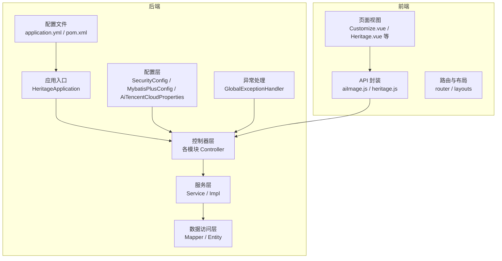
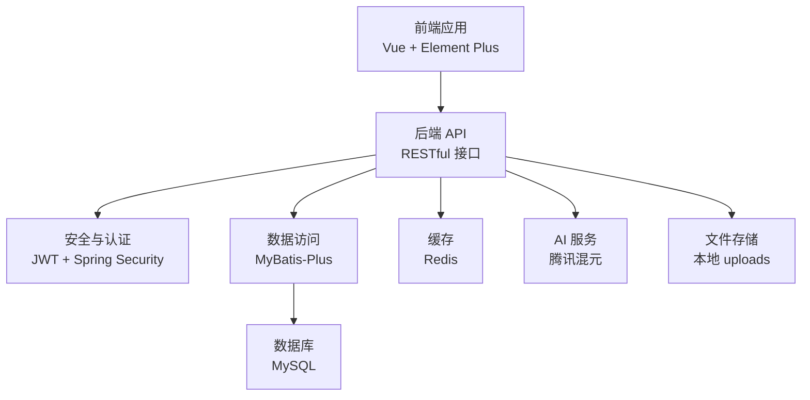
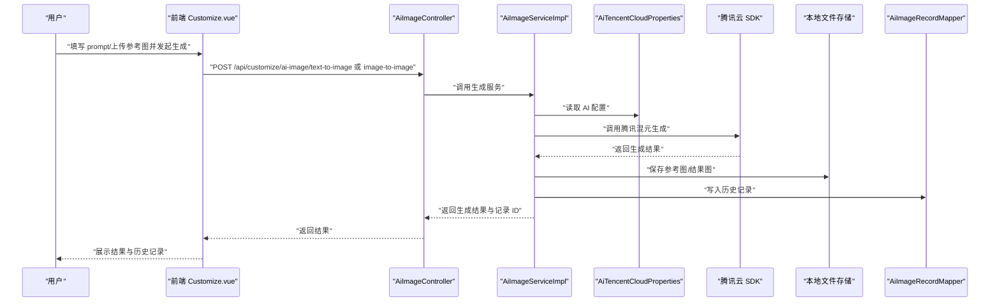
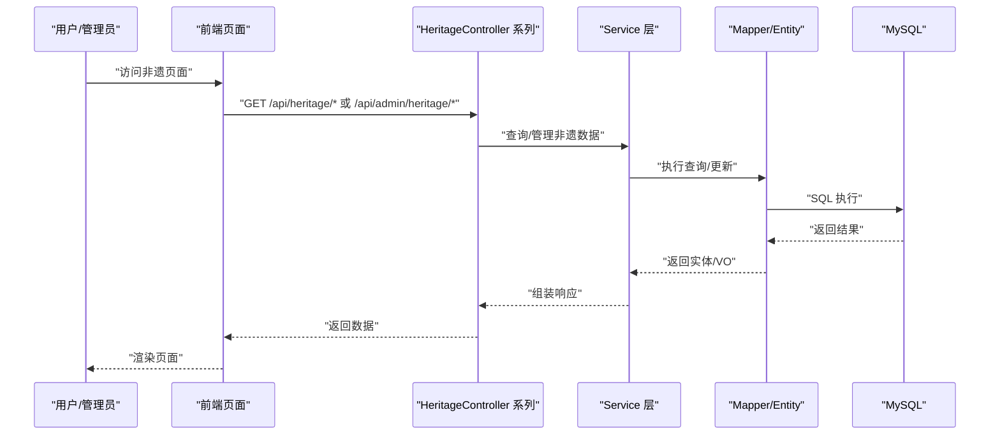
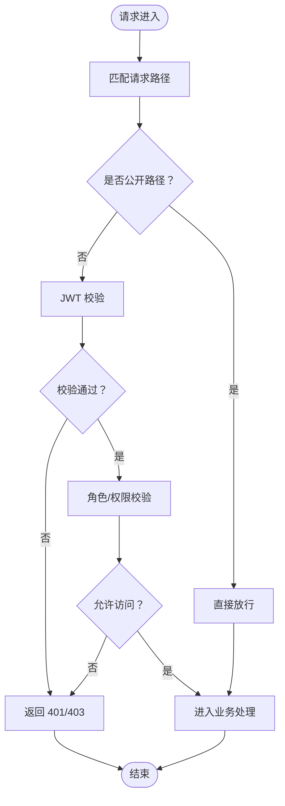
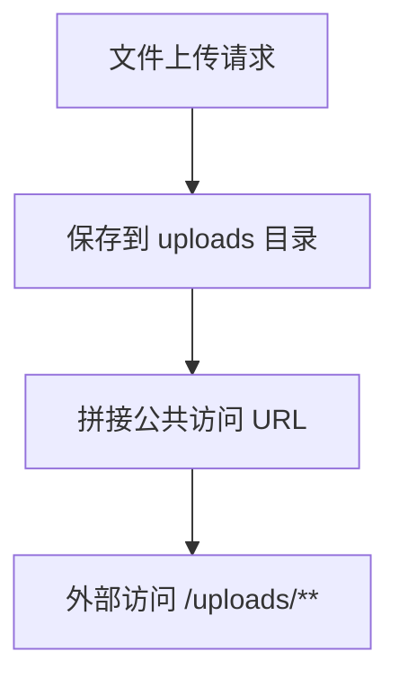
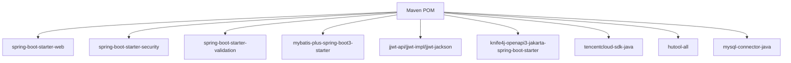

# 扩展与定制

<cite>
**本文引用的文件**
- [HeritageApplication.java](file://backend/src/main/java/com/heritage/HeritageApplication.java)
- [application.yml](file://backend/src/main/resources/application.yml)
- [AiTencentCloudProperties.java](file://backend/src/main/java/com/heritage/config/AiTencentCloudProperties.java)
- [SecurityConfig.java](file://backend/src/main/java/com/heritage/config/SecurityConfig.java)
- [MybatisPlusConfig.java](file://backend/src/main/java/com/heritage/config/MybatisPlusConfig.java)
- [GlobalExceptionHandler.java](file://backend/src/main/java/com/heritage/common/GlobalExceptionHandler.java)
- [pom.xml](file://backend/pom.xml)
- [系统设计.md](file://TODO/系统设计.md)
- [非遗智能定制模块开发任务清单.md](file://TODO/非遗智能定制模块开发任务清单.md)
- [非遗模块开发任务清单.md](file://TODO/非遗模块开发任务清单.md)
- [AiImageController.java](file://backend/src/main/java/com/heritage/controller/AiImageController.java)
- [AiImageServiceImpl.java](file://backend/src/main/java/com/heritage/service/impl/AiImageServiceImpl.java)
- [AiImageService.java](file://backend/src/main/java/com/heritage/service/AiImageService.java)
- [AiImageRecordServiceImpl.java](file://backend/src/main/java/com/heritage/service/impl/AiImageRecordServiceImpl.java)
- [AiImageRecordService.java](file://backend/src/main/java/com/heritage/service/AiImageRecordService.java)
- [AiImageRecordMapper.java](file://backend/src/main/java/com/heritage/mapper/AiImageRecordMapper.java)
- [AiImageRecord.java](file://backend/src/main/java/com/heritage/entity/AiImageRecord.java)
- [AiTextToImageRequest.java](file://backend/src/main/java/com/heritage/dto/AiTextToImageRequest.java)
- [AiImageGenerateResponse.java](file://backend/src/main/java/com/heritage/dto/AiImageGenerateResponse.java)
- [AiImageRecordVO.java](file://backend/src/main/java/com/heritage/dto/AiImageRecordVO.java)
- [aiImage.js](file://frontend/src/api/aiImage.js)
- [Customize.vue](file://frontend/src/views/Customize.vue)
- [HeritageCategoryController.java](file://backend/src/main/java/com/heritage/controller/HeritageCategoryController.java)
- [HeritageProjectController.java](file://backend/src/main/java/com/heritage/controller/HeritageProjectController.java)
- [HeritageInheritorController.java](file://backend/src/main/java/com/heritage/controller/HeritageInheritorController.java)
- [HeritageAdminCategoryController.java](file://backend/src/main/java/com/heritage/controller/HeritageAdminCategoryController.java)
- [HeritageAdminProjectController.java](file://backend/src/main/java/com/heritage/controller/HeritageAdminProjectController.java)
- [HeritageAdminInheritorController.java](file://backend/src/main/java/com/heritage/controller/HeritageAdminInheritorController.java)
- [heritage.js](file://frontend/src/api/heritage.js)
- [Heritage.vue](file://frontend/src/views/admin/Heritage.vue)
- [PaymentController.java](file://backend/src/main/java/com/heritage/controller/PaymentController.java)
- [OrderController.java](file://backend/src/main/java/com/heritage/controller/OrderController.java)
- [CartController.java](file://backend/src/main/java/com/heritage/controller/CartController.java)
- [ProductController.java](file://backend/src/main/java/com/heritage/controller/ProductController.java)
- [FileController.java](file://backend/src/main/java/com/heritage/controller/FileController.java)
- [ShopProductController.java](file://backend/src/main/java/com/heritage/controller/ShopProductController.java)
- [UserAddressController.java](file://backend/src/main/java/com/heritage/controller/UserAddressController.java)
- [CertificateController.java](file://backend/src/main/java/com/heritage/controller/CertificateController.java)
- [AuthController.java](file://backend/src/main/java/com/heritage/controller/AuthController.java)
- [UserController.java](file://backend/src/main/java/com/heritage/controller/UserController.java)
- [ai_image_record.sql](file://backend/src/main/resources/sql/ai_image_record.sql)
- [heritage.sql](file://backend/src/main/resources/sql/heritage.sql)
</cite>

## 目录
1. [简介](#简介)
2. [项目结构](#项目结构)
3. [核心组件](#核心组件)
4. [架构总览](#架构总览)
5. [详细组件分析](#详细组件分析)
6. [依赖分析](#依赖分析)
7. [性能考虑](#性能考虑)
8. [故障排查指南](#故障排查指南)
9. [结论](#结论)
10. [附录](#附录)

## 简介
本文件面向“非遗产品智能定制商城系统”的扩展与定制需求，系统采用前后端分离架构，后端基于 Spring Boot，前端基于 Vue。系统已内置智能定制模块（对接腾讯混元 AI）、非遗文化内容模块、用户与权限模块、商品与交易模块、文件上传与静态资源访问等。本文档重点说明：
- 可扩展性设计与定制化开发方案
- AI 智能体系统的集成方法（.qoder 目录下的智能体与技能配置）
- 第三方服务集成扩展点（支付、物流、AI 服务）
- 功能模块扩展指南、界面定制方法与业务逻辑修改策略
- 插件开发规范、配置管理方案与版本兼容性处理

## 项目结构
系统采用模块化分层设计，后端按领域模块划分（用户、商品、订单、非遗、智能定制、文件等），并通过统一的控制器、服务、数据访问层与实体模型组织业务逻辑；前端按页面与功能模块组织，通过 API 封装与路由进行页面编排。

图表来源
- [HeritageApplication.java](file://backend/src/main/java/com/heritage/HeritageApplication.java#L1-L13)
- [SecurityConfig.java](file://backend/src/main/java/com/heritage/config/SecurityConfig.java#L1-L67)
- [MybatisPlusConfig.java](file://backend/src/main/java/com/heritage/config/MybatisPlusConfig.java#L1-L31)
- [AiTencentCloudProperties.java](file://backend/src/main/java/com/heritage/config/AiTencentCloudProperties.java#L1-L21)
- [GlobalExceptionHandler.java](file://backend/src/main/java/com/heritage/common/GlobalExceptionHandler.java#L1-L62)
- [application.yml](file://backend/src/main/resources/application.yml#L1-L63)
- [pom.xml](file://backend/pom.xml#L1-L129)

章节来源
- [系统设计.md](file://TODO/系统设计.md#L23-L61)
- [HeritageApplication.java](file://backend/src/main/java/com/heritage/HeritageApplication.java#L1-L13)
- [application.yml](file://backend/src/main/resources/application.yml#L1-L63)

## 核心组件
- 应用入口与启动：应用入口负责启动 Spring Boot 应用，加载配置与组件。
- 安全与认证：基于 Spring Security + JWT，提供无状态认证、权限拦截与跨域配置。
- ORM 与分页：MyBatis-Plus 提供分页、乐观锁与 SQL 注入防护。
- 全局异常处理：统一捕获业务异常、认证异常、参数校验异常等，返回标准化响应。
- 配置管理：application.yml 管理数据库、Redis、JWT、AI 服务、Knife4j 文档与文件上传路径等。
- 智能定制模块：封装腾讯混元 AI 的文生图/图生图调用，提供历史记录与本地文件落盘。
- 非遗文化模块：提供分类树、项目列表/详情、传承人详情与管理端接口。
- 文件上传与静态资源：统一上传目录与公共访问基址，支持 AI 历史结果与商品媒体资源。

章节来源
- [HeritageApplication.java](file://backend/src/main/java/com/heritage/HeritageApplication.java#L1-L13)
- [SecurityConfig.java](file://backend/src/main/java/com/heritage/config/SecurityConfig.java#L1-L67)
- [MybatisPlusConfig.java](file://backend/src/main/java/com/heritage/config/MybatisPlusConfig.java#L1-L31)
- [GlobalExceptionHandler.java](file://backend/src/main/java/com/heritage/common/GlobalExceptionHandler.java#L1-L62)
- [application.yml](file://backend/src/main/resources/application.yml#L1-L63)

## 架构总览
系统采用前后端分离架构，后端通过 RESTful API 提供服务，前端负责页面渲染与交互。安全层通过 JWT 与 Spring Security 控制访问，ORM 层通过 MyBatis-Plus 提供数据访问能力，AI 服务通过配置注入与服务封装对接第三方模型。

图表来源
- [系统设计.md](file://TODO/系统设计.md#L23-L61)
- [SecurityConfig.java](file://backend/src/main/java/com/heritage/config/SecurityConfig.java#L50-L65)
- [MybatisPlusConfig.java](file://backend/src/main/java/com/heritage/config/MybatisPlusConfig.java#L16-L29)
- [application.yml](file://backend/src/main/resources/application.yml#L17-L35)
- [AiTencentCloudProperties.java](file://backend/src/main/java/com/heritage/config/AiTencentCloudProperties.java#L9-L19)

## 详细组件分析

### 智能定制模块（AI 文生图/图生图）
智能定制模块通过控制器暴露文生图与图生图接口，服务层封装腾讯混元 SDK 调用与错误映射，持久层记录生成历史，前端提供定制页面与历史记录展示。

图表来源
- [AiImageController.java](file://backend/src/main/java/com/heritage/controller/AiImageController.java)
- [AiImageServiceImpl.java](file://backend/src/main/java/com/heritage/service/impl/AiImageServiceImpl.java)
- [AiTencentCloudProperties.java](file://backend/src/main/java/com/heritage/config/AiTencentCloudProperties.java#L9-L19)
- [AiImageRecordMapper.java](file://backend/src/main/java/com/heritage/mapper/AiImageRecordMapper.java)
- [aiImage.js](file://frontend/src/api/aiImage.js)
- [Customize.vue](file://frontend/src/views/Customize.vue)

章节来源
- [非遗智能定制模块开发任务清单.md](file://TODO/非遗智能定制模块开发任务清单.md#L53-L81)
- [AiImageController.java](file://backend/src/main/java/com/heritage/controller/AiImageController.java)
- [AiImageServiceImpl.java](file://backend/src/main/java/com/heritage/service/impl/AiImageServiceImpl.java)
- [AiImageRecordServiceImpl.java](file://backend/src/main/java/com/heritage/service/impl/AiImageRecordServiceImpl.java)
- [AiImageRecordService.java](file://backend/src/main/java/com/heritage/service/AiImageRecordService.java)
- [AiImageRecordMapper.java](file://backend/src/main/java/com/heritage/mapper/AiImageRecordMapper.java)
- [AiImageRecord.java](file://backend/src/main/java/com/heritage/entity/AiImageRecord.java)
- [AiTextToImageRequest.java](file://backend/src/main/java/com/heritage/dto/AiTextToImageRequest.java)
- [AiImageGenerateResponse.java](file://backend/src/main/java/com/heritage/dto/AiImageGenerateResponse.java)
- [AiImageRecordVO.java](file://backend/src/main/java/com/heritage/dto/AiImageRecordVO.java)
- [ai_image_record.sql](file://backend/src/main/resources/sql/ai_image_record.sql)

### 非遗文化模块（分类/项目/传承人）
非遗模块提供公开接口与管理端接口，支持分类树、项目列表/详情、传承人详情与管理端的增删改查与媒体维护。

图表来源
- [HeritageCategoryController.java](file://backend/src/main/java/com/heritage/controller/HeritageCategoryController.java)
- [HeritageProjectController.java](file://backend/src/main/java/com/heritage/controller/HeritageProjectController.java)
- [HeritageInheritorController.java](file://backend/src/main/java/com/heritage/controller/HeritageInheritorController.java)
- [HeritageAdminCategoryController.java](file://backend/src/main/java/com/heritage/controller/HeritageAdminCategoryController.java)
- [HeritageAdminProjectController.java](file://backend/src/main/java/com/heritage/controller/HeritageAdminProjectController.java)
- [HeritageAdminInheritorController.java](file://backend/src/main/java/com/heritage/controller/HeritageAdminInheritorController.java)
- [heritage.js](file://frontend/src/api/heritage.js)
- [Heritage.vue](file://frontend/src/views/admin/Heritage.vue)
- [heritage.sql](file://backend/src/main/resources/sql/heritage.sql)

章节来源
- [非遗模块开发任务清单.md](file://TODO/非遗模块开发任务清单.md#L68-L100)
- [HeritageCategoryController.java](file://backend/src/main/java/com/heritage/controller/HeritageCategoryController.java)
- [HeritageProjectController.java](file://backend/src/main/java/com/heritage/controller/HeritageProjectController.java)
- [HeritageInheritorController.java](file://backend/src/main/java/com/heritage/controller/HeritageInheritorController.java)
- [HeritageAdminCategoryController.java](file://backend/src/main/java/com/heritage/controller/HeritageAdminCategoryController.java)
- [HeritageAdminProjectController.java](file://backend/src/main/java/com/heritage/controller/HeritageAdminProjectController.java)
- [HeritageAdminInheritorController.java](file://backend/src/main/java/com/heritage/controller/HeritageAdminInheritorController.java)
- [heritage.js](file://frontend/src/api/heritage.js)
- [Heritage.vue](file://frontend/src/views/admin/Heritage.vue)
- [heritage.sql](file://backend/src/main/resources/sql/heritage.sql)

### 安全与认证（JWT + Spring Security）
系统通过 Spring Security + JWT 实现无状态认证与权限控制，统一拦截器链路与权限表达式，开放部分静态资源与公开接口。

图表来源
- [SecurityConfig.java](file://backend/src/main/java/com/heritage/config/SecurityConfig.java#L50-L65)

章节来源
- [SecurityConfig.java](file://backend/src/main/java/com/heritage/config/SecurityConfig.java#L1-L67)
- [GlobalExceptionHandler.java](file://backend/src/main/java/com/heritage/common/GlobalExceptionHandler.java#L1-L62)

### 文件上传与静态资源
系统通过配置文件指定上传目录与公共访问基址，AI 历史结果与商品媒体等资源通过统一路径对外提供访问。

图表来源
- [application.yml](file://backend/src/main/resources/application.yml#L59-L62)
- [FileController.java](file://backend/src/main/java/com/heritage/controller/FileController.java)

章节来源
- [application.yml](file://backend/src/main/resources/application.yml#L59-L62)
- [FileController.java](file://backend/src/main/java/com/heritage/controller/FileController.java)

## 依赖分析
后端依赖采用 Maven 管理，核心依赖包括 Spring Boot Web、Security、Validation、MyBatis-Plus、JWT、Knife4j、腾讯云 SDK、Hutool、MySQL Connector 等。这些依赖共同支撑系统的安全、数据访问、接口文档与第三方服务集成。

图表来源
- [pom.xml](file://backend/pom.xml#L30-L97)

章节来源
- [pom.xml](file://backend/pom.xml#L1-L129)

## 性能考虑
- 分页与索引：MyBatis-Plus 提供分页与乐观锁/注入防护，建议在高频查询字段建立索引（如 ai_image_record 的用户索引与可能的排序字段）。
- 缓存：Redis 可用于热点数据缓存与会话状态存储，按需启用与配置。
- 异步与队列：智能定制模块建议引入异步任务与队列，避免接口阻塞与超时。
- 文件存储：生产环境建议替换为对象存储（如 COS），降低本地磁盘压力与 URL 过期风险。
- 并发与配额：在服务层实现用户/全局并发控制与额度限制，保障系统稳定性。

章节来源
- [MybatisPlusConfig.java](file://backend/src/main/java/com/heritage/config/MybatisPlusConfig.java#L16-L29)
- [非遗智能定制模块开发任务清单.md](file://TODO/非遗智能定制模块开发任务清单.md#L49-L101)

## 故障排查指南
- 权限与认证异常：检查 JWT 令牌是否正确传递与未过期，确认 Security 配置的放行路径与拦截范围。
- 参数校验异常：关注统一异常处理器对 MethodArgumentNotValidException 与 BindException 的处理，定位字段校验失败原因。
- 业务异常：业务异常由 BusinessException 抛出并统一包装，检查日志输出与错误消息。
- 文件访问异常：确认 uploads 目录存在且可访问，公共基址配置正确。
- AI 服务异常：检查腾讯云配置是否正确，网络连通性与 SDK 调用链路。

章节来源
- [GlobalExceptionHandler.java](file://backend/src/main/java/com/heritage/common/GlobalExceptionHandler.java#L1-L62)
- [SecurityConfig.java](file://backend/src/main/java/com/heritage/config/SecurityConfig.java#L50-L65)
- [application.yml](file://backend/src/main/resources/application.yml#L59-L62)
- [AiTencentCloudProperties.java](file://backend/src/main/java/com/heritage/config/AiTencentCloudProperties.java#L9-L19)

## 结论
系统在架构层面具备良好的可扩展性与可维护性，通过模块化设计与统一的配置、安全、异常处理机制，为后续的功能扩展与第三方服务集成提供了清晰的路径。建议在保持现有分层与职责边界的基础上，逐步完善异步化、缓存、对象存储与智能体/技能体系的集成，持续提升系统的性能与用户体验。

## 附录

### AI 智能体系统集成方案（.qoder 目录）
- 当前仓库中 .qoder 目录存在 agents 与 skills 子目录，但未发现具体配置文件。建议在此目录下按以下规范组织：
  - agents：存放智能体定义与行为配置，建议采用 YAML/JSON 格式，包含名称、描述、技能集合、触发条件与执行策略。
  - skills：存放可复用的技能模块，如“文生图生成”、“图生图风格迁移”、“历史记录查询”等，每个技能应定义输入/输出规范与调用方式。
  - 集成方式：在后端服务层新增适配器，将 .qoder 的智能体与技能映射到系统的服务接口，统一通过控制器暴露 REST API，前端通过 API 封装调用。
- 与现有智能定制模块的关系：.qoder 的智能体可作为更高层的编排器，将文生图/图生图与历史记录查询等技能组合为完整流程，减少前端复杂度。

章节来源
- [.qoder 目录结构](file://.qoder)

### 第三方服务集成扩展点
- 支付系统：在支付模块新增支付网关适配器（如微信、支付宝），通过统一的支付服务接口对接，支持下单、回调与对账。
- 物流服务：在订单模块新增物流适配器，对接主流物流平台，支持发货、跟踪与签收状态同步。
- AI 服务：除腾讯混元外，可新增其他 AI 服务提供商适配器，统一参数映射与错误处理，通过配置切换不同供应商。

章节来源
- [PaymentController.java](file://backend/src/main/java/com/heritage/controller/PaymentController.java)
- [OrderController.java](file://backend/src/main/java/com/heritage/controller/OrderController.java)

### 功能模块扩展指南
- 新增领域模块：遵循现有分层（Controller → Service → Mapper/Entity），提供 DTO/VO、Mapper、Service 接口与实现、Controller 接口与前端 API 封装。
- 界面定制：在前端按页面模块组织组件与路由，通过 API 封装与 i18n/主题切换实现界面定制。
- 业务逻辑修改：优先通过配置与策略模式扩展，避免硬编码；对核心流程进行单元测试与集成测试覆盖。

章节来源
- [系统设计.md](file://TODO/系统设计.md#L64-L74)

### 插件开发规范与配置管理
- 插件规范：插件应提供 SPI 接口与默认实现，通过配置启用/禁用；插件间避免强耦合，通过事件/消息总线解耦。
- 配置管理：集中于 application.yml，敏感配置通过环境变量注入；新增配置项需提供默认值与文档说明。
- 版本兼容：依赖版本在 pom.xml 中统一管理，升级前进行兼容性测试与回归测试；对第三方 SDK 的升级需评估接口变更与行为差异。

章节来源
- [application.yml](file://backend/src/main/resources/application.yml#L1-L63)
- [pom.xml](file://backend/pom.xml#L21-L28)