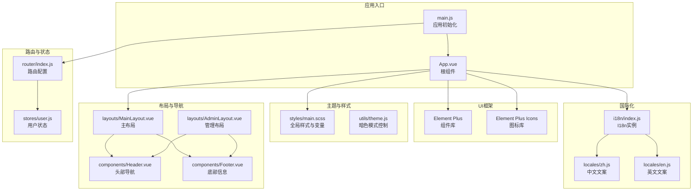
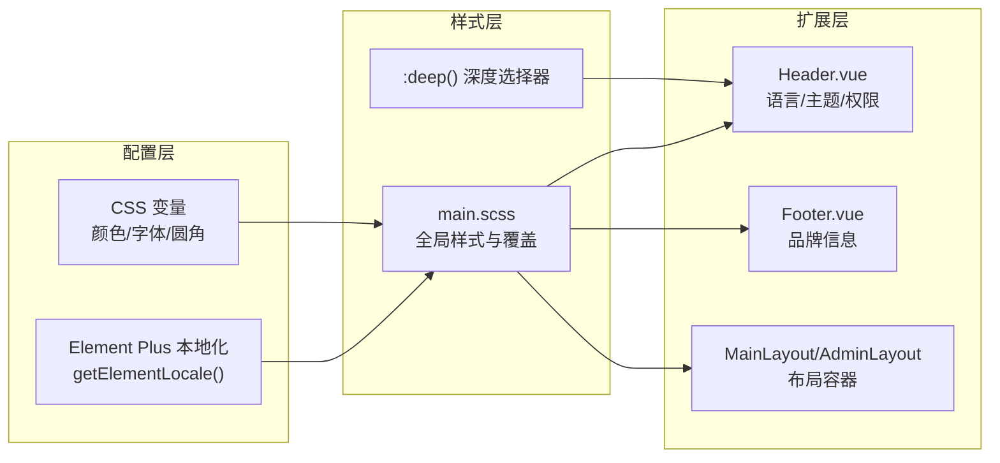
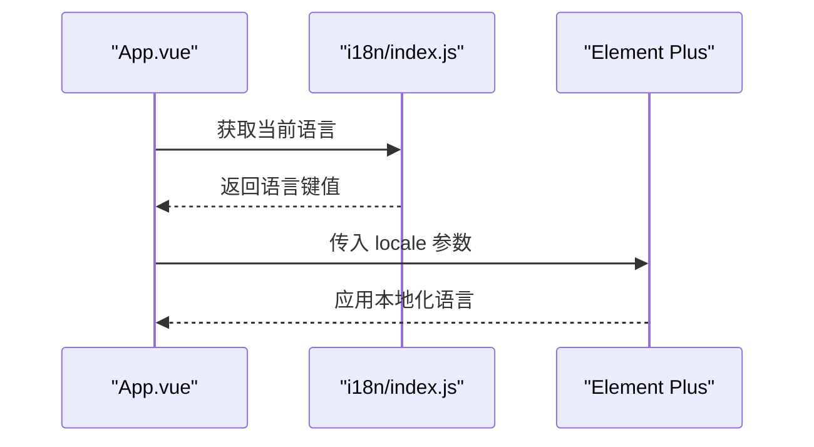
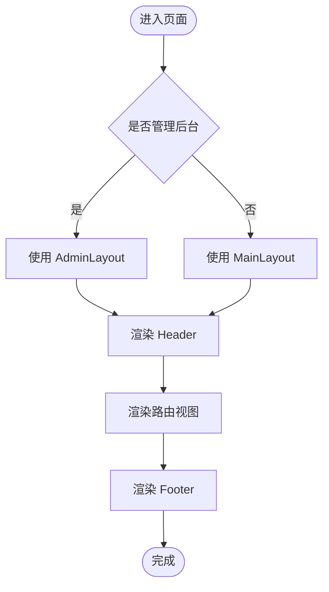
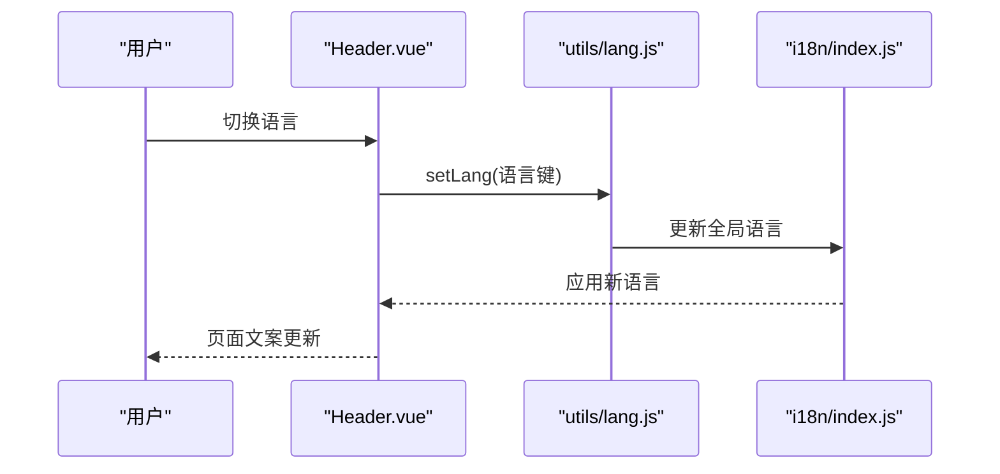
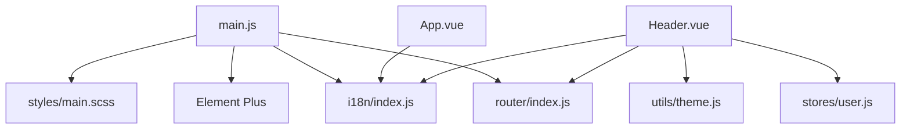

# 界面定制方案

<cite>
**本文档引用的文件**
- [package.json](file://frontend/package.json)
- [main.js](file://frontend/src/main.js)
- [vite.config.js](file://frontend/vite.config.js)
- [App.vue](file://frontend/src/App.vue)
- [main.scss](file://frontend/src/styles/main.scss)
- [index.js](file://frontend/src/i18n/index.js)
- [en.js](file://frontend/src/locales/en.js)
- [zh.js](file://frontend/src/locales/zh.js)
- [theme.js](file://frontend/src/utils/theme.js)
- [Header.vue](file://frontend/src/components/Header.vue)
- [Footer.vue](file://frontend/src/components/Footer.vue)
- [MainLayout.vue](file://frontend/src/layouts/MainLayout.vue)
- [AdminLayout.vue](file://frontend/src/layouts/AdminLayout.vue)
- [lang.js](file://frontend/src/utils/lang.js)
- [index.js](file://frontend/src/router/index.js)
</cite>

## 目录
1. [简介](#简介)
2. [项目结构](#项目结构)
3. [核心组件](#核心组件)
4. [架构总览](#架构总览)
5. [详细组件分析](#详细组件分析)
6. [依赖关系分析](#依赖关系分析)
7. [性能考虑](#性能考虑)
8. [故障排除指南](#故障排除指南)
9. [结论](#结论)
10. [附录](#附录)

## 简介
本方案面向“非遗产品智能定制商城”系统的前端界面定制，围绕组件化设计与可扩展性，系统性阐述以下主题：
- 基于 Element Plus 的界面定制策略（主题变量、样式覆盖、组件扩展）
- 布局系统定制（Header、Footer、侧边栏等）
- 国际化支持（多语言添加、文案管理、文化适配）
- 响应式设计与移动端适配
- 品牌视觉系统定制（Logo替换、色彩体系、字体选择）
- 在保持一致性的同时满足个性化需求

## 项目结构
前端采用 Vue 3 + Vite 架构，使用 Element Plus 作为 UI 组件库，Pinia 进行状态管理，vue-i18n 实现国际化，路由按功能划分布局与视图。

图表来源
- [main.js](file://frontend/src/main.js#L1-L25)
- [App.vue](file://frontend/src/App.vue#L1-L40)
- [main.scss](file://frontend/src/styles/main.scss#L1-L174)
- [index.js](file://frontend/src/i18n/index.js#L1-L24)
- [zh.js](file://frontend/src/locales/zh.js#L1-L45)
- [en.js](file://frontend/src/locales/en.js#L1-L45)
- [theme.js](file://frontend/src/utils/theme.js#L1-L26)
- [MainLayout.vue](file://frontend/src/layouts/MainLayout.vue#L1-L28)
- [AdminLayout.vue](file://frontend/src/layouts/AdminLayout.vue#L1-L32)
- [Header.vue](file://frontend/src/components/Header.vue#L1-L283)
- [Footer.vue](file://frontend/src/components/Footer.vue#L1-L96)
- [index.js](file://frontend/src/router/index.js#L1-L176)

章节来源
- [package.json](file://frontend/package.json#L1-L28)
- [vite.config.js](file://frontend/vite.config.js#L1-L22)

## 核心组件
- 应用入口与框架集成：在应用启动时注册 Element Plus、图标、国际化与全局样式，统一注入 Element Plus 的本地化语言。
- 全局样式与主题：通过 CSS 变量定义主色、文本色、边框色、背景色等，配合 Element Plus 暗色模式变量实现夜间模式。
- 国际化：基于 vue-i18n 提供中英双语，Element Plus 的语言包与业务文案解耦，便于扩展其他语言。
- 布局系统：MainLayout 与 AdminLayout 将 Header、内容区、Footer 组合，支持不同角色的后台布局差异。
- 头部导航：集成菜单、语言切换、暗色模式切换、用户下拉菜单与权限控制。
- 底部信息：展示公司信息、快速链接与版权信息。

章节来源
- [main.js](file://frontend/src/main.js#L1-L25)
- [App.vue](file://frontend/src/App.vue#L1-L40)
- [main.scss](file://frontend/src/styles/main.scss#L1-L174)
- [index.js](file://frontend/src/i18n/index.js#L1-L24)
- [Header.vue](file://frontend/src/components/Header.vue#L1-L283)
- [Footer.vue](file://frontend/src/components/Footer.vue#L1-L96)
- [MainLayout.vue](file://frontend/src/layouts/MainLayout.vue#L1-L28)
- [AdminLayout.vue](file://frontend/src/layouts/AdminLayout.vue#L1-L32)

## 架构总览
前端界面定制遵循“配置优先、样式覆盖、组件扩展”的三层策略：
- 配置层：通过 Element Plus 的 locale 注入与 CSS 变量集中管理主题。
- 样式层：以 SCSS 变量与全局样式为主，结合深度作用选择器对第三方组件进行局部覆盖。
- 扩展层：在现有组件基础上增加业务能力（如头部导航的语言切换、暗色模式、权限菜单）。

图表来源
- [main.js](file://frontend/src/main.js#L1-L25)
- [App.vue](file://frontend/src/App.vue#L1-L40)
- [main.scss](file://frontend/src/styles/main.scss#L1-L174)
- [Header.vue](file://frontend/src/components/Header.vue#L1-L283)
- [Footer.vue](file://frontend/src/components/Footer.vue#L1-L96)
- [MainLayout.vue](file://frontend/src/layouts/MainLayout.vue#L1-L28)
- [AdminLayout.vue](file://frontend/src/layouts/AdminLayout.vue#L1-L32)

## 详细组件分析

### Element Plus 定制策略
- 主题变量配置
  - 使用 CSS 变量集中定义主色、文本色、边框色、背景色等，便于全局替换与夜间模式切换。
  - 引入 Element Plus 暗色模式变量文件，实现自动适配。
- 样式覆盖
  - 通过 :deep() 选择器对 Element Plus 组件进行局部样式覆盖，避免影响全局。
  - 在 main.scss 中对表格、卡片、按钮组等常用组件进行统一风格化。
- 组件扩展
  - 在 App.vue 中通过 el-config-provider 注入 Element Plus 本地化语言，确保日期、分页等组件文案随系统语言变化。

图表来源
- [App.vue](file://frontend/src/App.vue#L1-L40)
- [index.js](file://frontend/src/i18n/index.js#L1-L24)
- [main.js](file://frontend/src/main.js#L1-L25)

章节来源
- [main.scss](file://frontend/src/styles/main.scss#L1-L174)
- [App.vue](file://frontend/src/App.vue#L1-L40)
- [index.js](file://frontend/src/i18n/index.js#L1-L24)
- [main.js](file://frontend/src/main.js#L1-L25)

### 布局系统定制方案
- 主布局与管理布局
  - MainLayout 用于普通用户前台，AdminLayout 用于管理后台，两者均复用 Header 与 Footer。
  - 通过布局容器设置内容区的上内边距，保证内容不被固定头部遮挡。
- 侧边栏个性化配置
  - 当前未内置侧边栏组件，可在 AdminLayout 或 MerchantLayout 中引入侧边栏组件，统一通过路由元信息控制菜单项显示与权限。
  - 建议将侧边栏菜单数据源化，支持从后端动态加载或本地配置文件维护。

图表来源
- [MainLayout.vue](file://frontend/src/layouts/MainLayout.vue#L1-L28)
- [AdminLayout.vue](file://frontend/src/layouts/AdminLayout.vue#L1-L32)
- [index.js](file://frontend/src/router/index.js#L1-L176)

章节来源
- [MainLayout.vue](file://frontend/src/layouts/MainLayout.vue#L1-L28)
- [AdminLayout.vue](file://frontend/src/layouts/AdminLayout.vue#L1-L32)
- [index.js](file://frontend/src/router/index.js#L1-L176)

### 国际化支持定制方法
- 新语言添加流程
  - 在 locales 目录新增语言文件（如 ja.js），导出业务文案对象。
  - 在 i18n/index.js 中注册新语言与 Element Plus 对应语言包，并在 messages 中合并。
  - 在 Header.vue 的语言切换下拉菜单中新增选项，调用 lang.js 的 setLang 方法更新语言。
- 文案管理
  - 业务文案与 Element Plus 语言包分离，便于独立迭代与测试。
  - 支持回退语言（fallbackLocale），确保缺失翻译时有默认文案。
- 文化适配
  - 菜单文案、按钮文案、表单占位符等需结合目标文化习惯进行本地化。
  - 注意日期格式、数字格式、货币符号等细节，必要时引入日期/数字格式化库。

图表来源
- [Header.vue](file://frontend/src/components/Header.vue#L1-L283)
- [lang.js](file://frontend/src/utils/lang.js#L1-L9)
- [index.js](file://frontend/src/i18n/index.js#L1-L24)
- [zh.js](file://frontend/src/locales/zh.js#L1-L45)
- [en.js](file://frontend/src/locales/en.js#L1-L45)

章节来源
- [index.js](file://frontend/src/i18n/index.js#L1-L24)
- [lang.js](file://frontend/src/utils/lang.js#L1-L9)
- [Header.vue](file://frontend/src/components/Header.vue#L1-L283)
- [zh.js](file://frontend/src/locales/zh.js#L1-L45)
- [en.js](file://frontend/src/locales/en.js#L1-L45)

### 响应式设计与移动端适配
- 移动端适配策略
  - 在 Header.vue 中使用媒体查询对头部容器内边距与元素间距进行优化。
  - 建议在 main.scss 中为常用断点（如 768px、1024px）定义变量，统一控制栅格与布局。
  - 表单与按钮尺寸在小屏设备上适当缩小，确保触摸可点击区域不小于 44px。
- 触摸交互优化
  - 下拉菜单、开关、按钮等交互元素在移动端提供清晰反馈。
  - 避免在移动端使用 hover 作为唯一触发方式，提供明确的点击反馈。

章节来源
- [Header.vue](file://frontend/src/components/Header.vue#L211-L215)
- [main.scss](file://frontend/src/styles/main.scss#L1-L174)

### 品牌视觉系统定制指南
- Logo 替换
  - 在 Header.vue 的 logo 区域直接替换为自定义 Logo 图片或 SVG，保持与品牌规范一致的尺寸与比例。
- 色彩体系调整
  - 修改 main.scss 中的 CSS 变量（如主色、成功色、警告色、危险色、文本色、边框色、背景色）即可全局生效。
  - 结合 Element Plus 暗色模式变量，确保深浅两套主题一致的视觉体验。
- 字体选择
  - 在 main.scss 中统一设置全局字体族，兼顾中英文排版与可读性。
  - 为标题与正文设置合适的字号与行高，确保在不同设备上的阅读体验。

章节来源
- [Header.vue](file://frontend/src/components/Header.vue#L204-L209)
- [main.scss](file://frontend/src/styles/main.scss#L3-L25)
- [theme.js](file://frontend/src/utils/theme.js#L1-L26)

## 依赖关系分析
- 框架与工具
  - Vue 3、Element Plus、vue-i18n、Pinia、vue-router、Vite。
- 关键依赖关系
  - main.js 依赖 i18n、Element Plus、路由与全局样式。
  - App.vue 依赖 i18n 并向 Element Plus 注入本地化语言。
  - Header.vue 依赖 i18n、路由、用户状态与主题工具。
  - 路由根据用户角色与权限决定可访问的布局与视图。

图表来源
- [main.js](file://frontend/src/main.js#L1-L25)
- [App.vue](file://frontend/src/App.vue#L1-L40)
- [Header.vue](file://frontend/src/components/Header.vue#L1-L283)
- [index.js](file://frontend/src/router/index.js#L1-L176)
- [index.js](file://frontend/src/i18n/index.js#L1-L24)
- [main.scss](file://frontend/src/styles/main.scss#L1-L174)
- [theme.js](file://frontend/src/utils/theme.js#L1-L26)

章节来源
- [package.json](file://frontend/package.json#L10-L26)
- [main.js](file://frontend/src/main.js#L1-L25)
- [index.js](file://frontend/src/router/index.js#L1-L176)

## 性能考虑
- 组件懒加载：路由中已使用动态导入，减少首屏体积。
- 图标按需注册：通过遍历 Element Plus Icons 并全局注册，避免重复引入。
- 样式按需覆盖：仅在需要的组件中使用 :deep()，避免全局污染。
- 暗色模式缓存：通过 localStorage 缓存主题偏好，减少重复计算。

## 故障排除指南
- 国际化文案未生效
  - 检查 i18n/index.js 中 messages 是否包含新语言，以及 getElementLocale 是否返回对应语言包。
  - 确认 Header.vue 的语言切换逻辑与 utils/lang.js 协同工作。
- Element Plus 本地化不匹配
  - 确保 App.vue 中通过 el-config-provider 注入的 locale 与 i18n 全局语言一致。
- 暗色模式切换异常
  - 检查 utils/theme.js 中类名切换与 localStorage 存储逻辑。
- 响应式布局错乱
  - 在 Header.vue 或 main.scss 中检查媒体查询断点与样式优先级。

章节来源
- [index.js](file://frontend/src/i18n/index.js#L1-L24)
- [Header.vue](file://frontend/src/components/Header.vue#L1-L283)
- [theme.js](file://frontend/src/utils/theme.js#L1-L26)
- [App.vue](file://frontend/src/App.vue#L1-L40)

## 结论
本方案提供了从配置到样式的完整界面定制路径：通过 CSS 变量与 Element Plus 本地化实现主题一致性；通过 :deep() 与组件扩展满足个性化需求；通过路由与权限控制实现多角色布局差异化；通过国际化与品牌视觉系统保障跨语言与跨文化体验。建议在后续迭代中进一步完善侧边栏、菜单数据源化与更多断点的响应式适配。

## 附录
- 开发与构建
  - 开发服务器：端口 3030，代理至后端 8080。
  - 构建产物输出至 dist 目录，静态资源位于 dist/assets。
- 代码别名
  - @ 指向 src 目录，便于统一导入路径。

章节来源
- [vite.config.js](file://frontend/vite.config.js#L1-L22)
- [package.json](file://frontend/package.json#L1-L28)