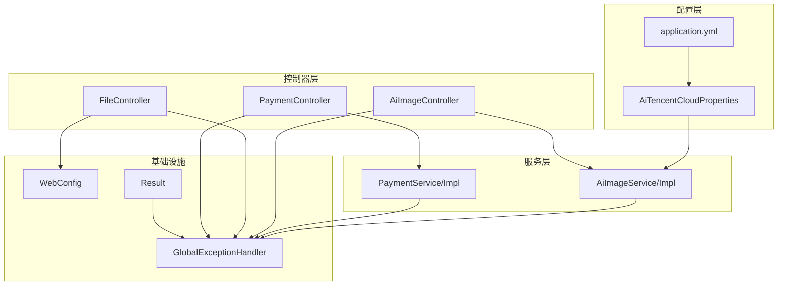
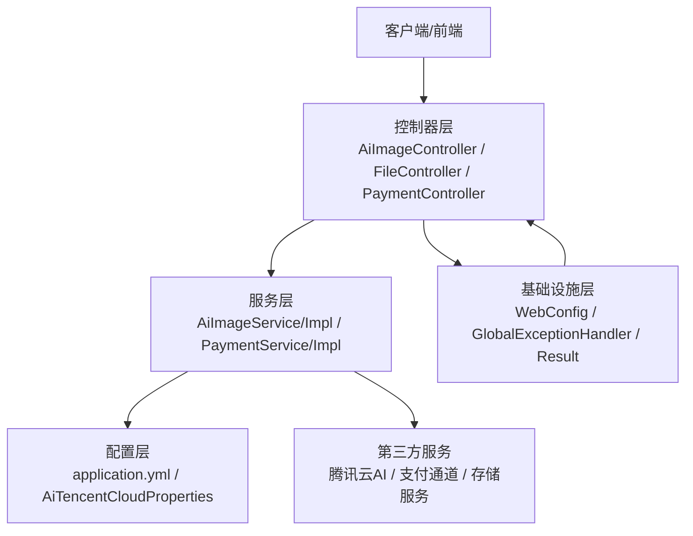
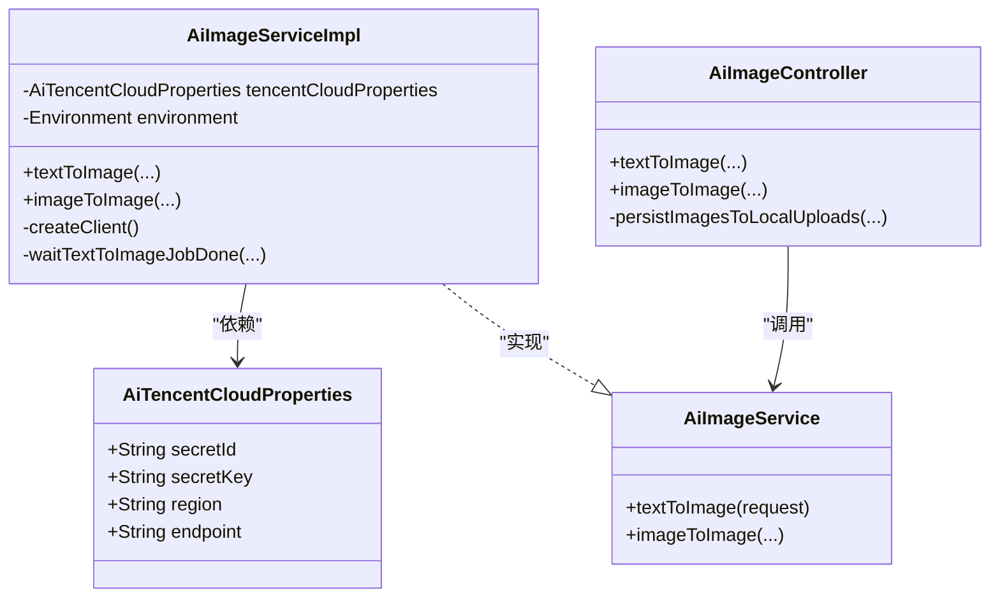
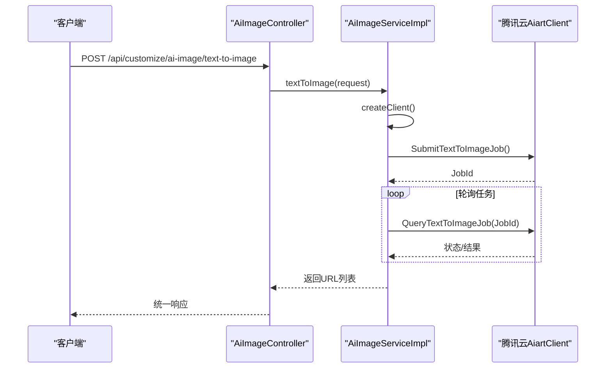
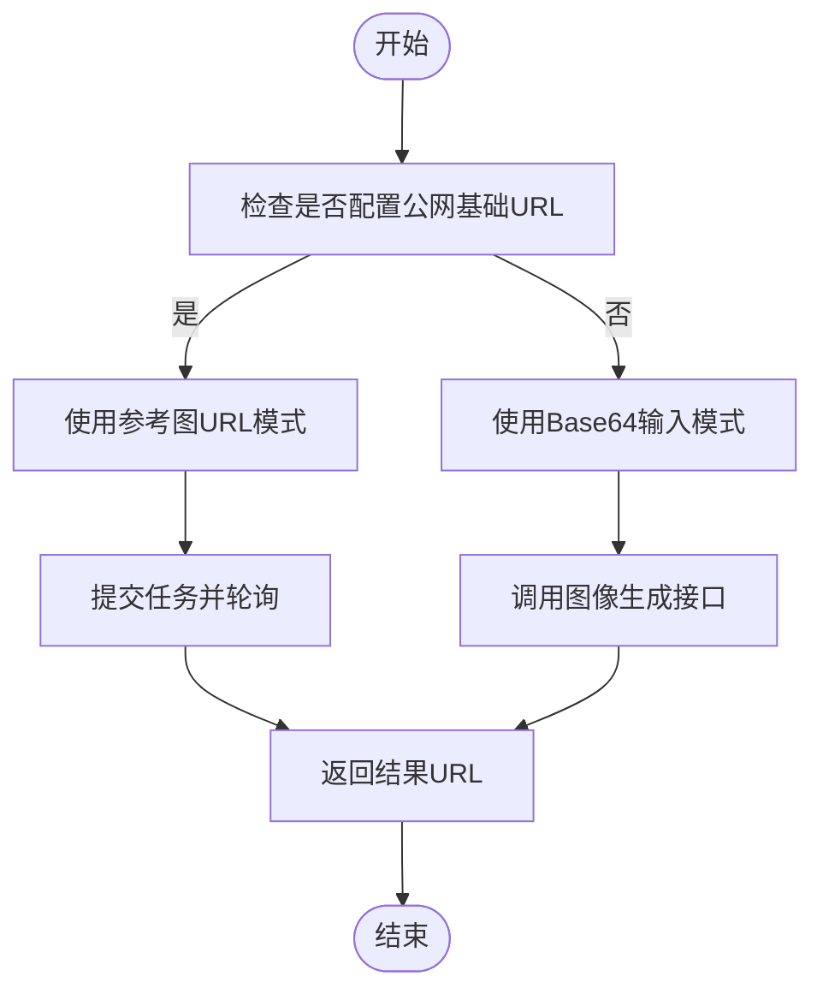
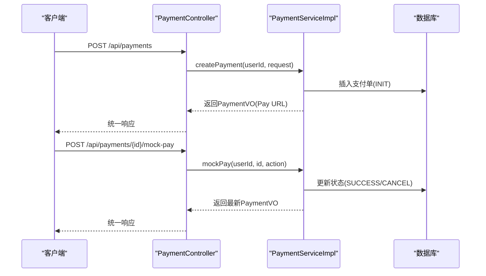
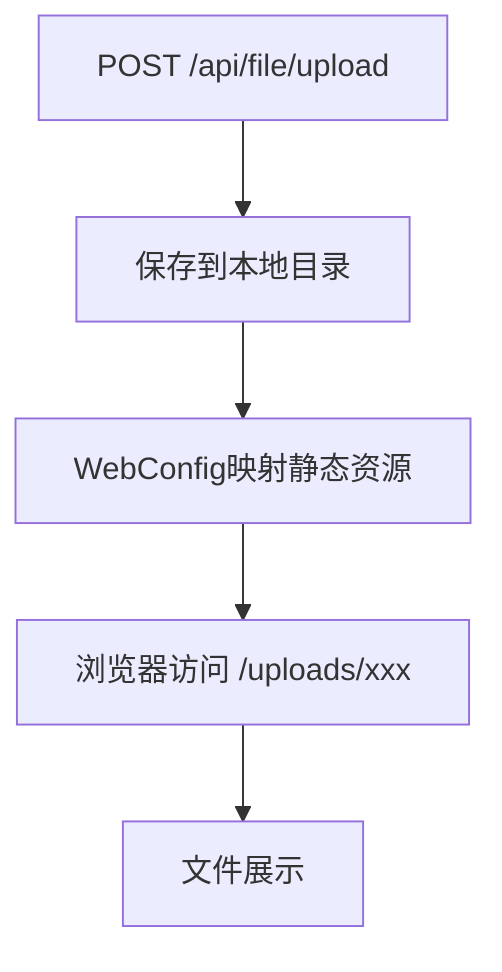
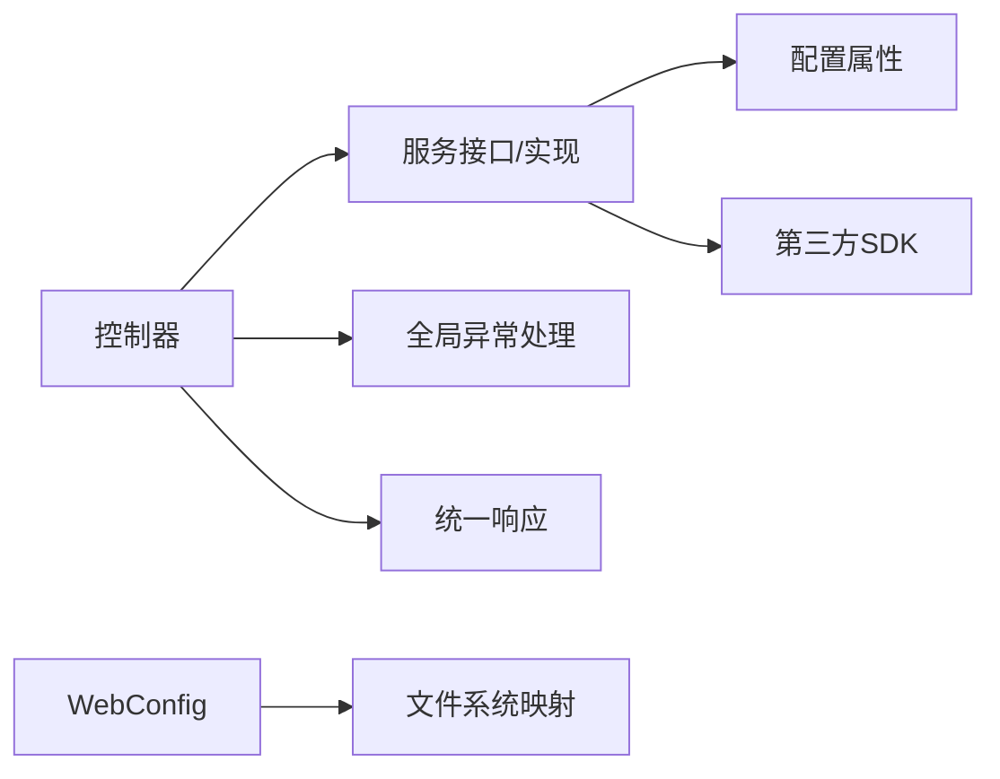

# 第三方服务集成

<cite>
**本文引用的文件**
- [application.yml](file://backend/src/main/resources/application.yml)
- [AiTencentCloudProperties.java](file://backend/src/main/java/com/heritage/config/AiTencentCloudProperties.java)
- [AiImageController.java](file://backend/src/main/java/com/heritage/controller/AiImageController.java)
- [AiImageService.java](file://backend/src/main/java/com/heritage/service/AiImageService.java)
- [AiImageServiceImpl.java](file://backend/src/main/java/com/heritage/service/impl/AiImageServiceImpl.java)
- [FileController.java](file://backend/src/main/java/com/heritage/controller/FileController.java)
- [WebConfig.java](file://backend/src/main/java/com/heritage/config/WebConfig.java)
- [PaymentController.java](file://backend/src/main/java/com/heritage/controller/PaymentController.java)
- [PaymentService.java](file://backend/src/main/java/com/heritage/service/PaymentService.java)
- [PaymentServiceImpl.java](file://backend/src/main/java/com/heritage/service/impl/PaymentServiceImpl.java)
- [GlobalExceptionHandler.java](file://backend/src/main/java/com/heritage/common/GlobalExceptionHandler.java)
- [Result.java](file://backend/src/main/java/com/heritage/common/Result.java)
- [BusinessException.java](file://backend/src/main/java/com/heritage/common/BusinessException.java)
- [接口清单表.md](file://TODO/接口清单表.md)
- [数据库设计.md](file://TODO/数据库设计.md)
</cite>

## 目录
1. [简介](#简介)
2. [项目结构](#项目结构)
3. [核心组件](#核心组件)
4. [架构总览](#架构总览)
5. [详细组件分析](#详细组件分析)
6. [依赖关系分析](#依赖关系分析)
7. [性能考量](#性能考量)
8. [故障排查指南](#故障排查指南)
9. [结论](#结论)
10. [附录](#附录)

## 简介
本文件面向“非遗产品智能定制商城系统”的第三方服务集成，聚焦以下目标：
- 腾讯云AI服务（混元AI生图）的集成方式：包括配置项、SDK封装、错误处理与异步任务轮询。
- 支付系统的扩展点：统一支付接口设计与Mock通道，便于接入微信支付、支付宝等第三方支付渠道。
- 文件存储服务的扩展方案：本地存储与静态资源映射，便于替换为COS、OSS等云存储。
- 物流服务集成指南：基于现有地址模型与订单流程，给出对接快递查询与配送服务的扩展建议。
- API网关与统一接口封装策略：通过统一响应体、全局异常处理与控制器层封装，形成可扩展的接口层。

## 项目结构
系统采用Spring Boot标准目录结构，后端位于backend，前端位于frontend。第三方服务集成主要涉及：
- 配置层：application.yml与AiTencentCloudProperties负责外部服务参数注入。
- 控制器层：AiImageController、FileController、PaymentController提供对外统一接口。
- 服务层：AiImageService/Impl、PaymentService/Impl实现业务逻辑与第三方服务交互。
- 基础设施：WebConfig提供静态资源映射；GlobalExceptionHandler与Result统一异常与响应格式。

图表来源
- [application.yml](file://backend/src/main/resources/application.yml#L43-L63)
- [AiTencentCloudProperties.java](file://backend/src/main/java/com/heritage/config/AiTencentCloudProperties.java#L1-L21)
- [AiImageController.java](file://backend/src/main/java/com/heritage/controller/AiImageController.java#L1-L320)
- [FileController.java](file://backend/src/main/java/com/heritage/controller/FileController.java#L1-L62)
- [PaymentController.java](file://backend/src/main/java/com/heritage/controller/PaymentController.java#L1-L56)
- [AiImageService.java](file://backend/src/main/java/com/heritage/service/AiImageService.java#L1-L21)
- [AiImageServiceImpl.java](file://backend/src/main/java/com/heritage/service/impl/AiImageServiceImpl.java#L1-L430)
- [PaymentService.java](file://backend/src/main/java/com/heritage/service/PaymentService.java#L1-L17)
- [WebConfig.java](file://backend/src/main/java/com/heritage/config/WebConfig.java#L1-L23)
- [GlobalExceptionHandler.java](file://backend/src/main/java/com/heritage/common/GlobalExceptionHandler.java#L1-L62)
- [Result.java](file://backend/src/main/java/com/heritage/common/Result.java#L1-L44)

章节来源
- [application.yml](file://backend/src/main/resources/application.yml#L1-L63)
- [AiTencentCloudProperties.java](file://backend/src/main/java/com/heritage/config/AiTencentCloudProperties.java#L1-L21)
- [AiImageController.java](file://backend/src/main/java/com/heritage/controller/AiImageController.java#L1-L320)
- [FileController.java](file://backend/src/main/java/com/heritage/controller/FileController.java#L1-L62)
- [PaymentController.java](file://backend/src/main/java/com/heritage/controller/PaymentController.java#L1-L56)
- [AiImageService.java](file://backend/src/main/java/com/heritage/service/AiImageService.java#L1-L21)
- [AiImageServiceImpl.java](file://backend/src/main/java/com/heritage/service/impl/AiImageServiceImpl.java#L1-L430)
- [PaymentService.java](file://backend/src/main/java/com/heritage/service/PaymentService.java#L1-L17)
- [WebConfig.java](file://backend/src/main/java/com/heritage/config/WebConfig.java#L1-L23)
- [GlobalExceptionHandler.java](file://backend/src/main/java/com/heritage/common/GlobalExceptionHandler.java#L1-L62)
- [Result.java](file://backend/src/main/java/com/heritage/common/Result.java#L1-L44)

## 核心组件
- 腾讯云AI服务集成
  - 配置项：在配置文件中定义secretId、secretKey、region、endpoint等参数，通过AiTencentCloudProperties注入。
  - SDK封装：AiImageServiceImpl封装腾讯云AiartClient的初始化、请求构造、异步任务轮询与错误归一化。
  - 控制器：AiImageController提供文生图、图生图、历史记录等接口，并负责结果持久化与URL构建。
- 支付系统扩展点
  - 统一接口：PaymentController提供创建支付单、查询支付单、模拟收银台动作确认/取消。
  - 扩展通道：PaymentService/Impl中通过通道枚举与Mock通道，便于替换为微信支付、支付宝等。
- 文件存储服务扩展
  - 本地存储：FileController负责文件上传，WebConfig提供静态资源映射，便于替换为COS/OSS等云存储。
- API网关与统一接口
  - 统一响应：Result封装统一响应体，包含code、message、data。
  - 全局异常：GlobalExceptionHandler集中处理业务异常、参数异常与认证异常，保证对外一致的错误格式。

章节来源
- [application.yml](file://backend/src/main/resources/application.yml#L43-L63)
- [AiTencentCloudProperties.java](file://backend/src/main/java/com/heritage/config/AiTencentCloudProperties.java#L1-L21)
- [AiImageController.java](file://backend/src/main/java/com/heritage/controller/AiImageController.java#L1-L320)
- [AiImageServiceImpl.java](file://backend/src/main/java/com/heritage/service/impl/AiImageServiceImpl.java#L1-L430)
- [PaymentController.java](file://backend/src/main/java/com/heritage/controller/PaymentController.java#L1-L56)
- [PaymentService.java](file://backend/src/main/java/com/heritage/service/PaymentService.java#L1-L17)
- [FileController.java](file://backend/src/main/java/com/heritage/controller/FileController.java#L1-L62)
- [WebConfig.java](file://backend/src/main/java/com/heritage/config/WebConfig.java#L1-L23)
- [GlobalExceptionHandler.java](file://backend/src/main/java/com/heritage/common/GlobalExceptionHandler.java#L1-L62)
- [Result.java](file://backend/src/main/java/com/heritage/common/Result.java#L1-L44)

## 架构总览
系统通过控制器层统一对外暴露REST接口，服务层封装具体业务与第三方服务交互，配置层提供外部服务参数，基础设施层提供统一响应与异常处理。

图表来源
- [AiImageController.java](file://backend/src/main/java/com/heritage/controller/AiImageController.java#L1-L320)
- [FileController.java](file://backend/src/main/java/com/heritage/controller/FileController.java#L1-L62)
- [PaymentController.java](file://backend/src/main/java/com/heritage/controller/PaymentController.java#L1-L56)
- [AiImageServiceImpl.java](file://backend/src/main/java/com/heritage/service/impl/AiImageServiceImpl.java#L1-L430)
- [PaymentServiceImpl.java](file://backend/src/main/java/com/heritage/service/impl/PaymentServiceImpl.java#L65-L210)
- [application.yml](file://backend/src/main/resources/application.yml#L43-L63)
- [AiTencentCloudProperties.java](file://backend/src/main/java/com/heritage/config/AiTencentCloudProperties.java#L1-L21)
- [WebConfig.java](file://backend/src/main/java/com/heritage/config/WebConfig.java#L1-L23)
- [GlobalExceptionHandler.java](file://backend/src/main/java/com/heritage/common/GlobalExceptionHandler.java#L1-L62)
- [Result.java](file://backend/src/main/java/com/heritage/common/Result.java#L1-L44)

## 详细组件分析

### 腾讯云AI服务集成
- 配置与注入
  - 在配置文件中定义腾讯云AI相关参数，AiTencentCloudProperties通过@ConfigurationProperties前缀绑定。
  - AiImageServiceImpl从属性对象读取密钥、区域与端点，若缺失则抛出业务异常。
- SDK封装与调用
  - 初始化AiartClient，设置HTTP超时与连接参数。
  - 文生图：提交任务后轮询任务状态，直到完成或失败，最终返回URL列表。
  - 图生图：根据是否配置公网基础URL决定使用“参考图URL”还是“Base64输入”，并支持增强、修复人脸、风格等参数。
- 错误处理与超时控制
  - 对SDK异常进行消息截断与归一化，避免敏感信息泄露。
  - 任务轮询最大等待时间与指数退避间隔，防止长时间占用线程。
- 结果持久化与URL构建
  - 控制器层将返回的图片URL或Base64转换为本地持久化文件，并返回统一的相对路径，便于前端展示。

图表来源
- [AiTencentCloudProperties.java](file://backend/src/main/java/com/heritage/config/AiTencentCloudProperties.java#L1-L21)
- [AiImageService.java](file://backend/src/main/java/com/heritage/service/AiImageService.java#L1-L21)
- [AiImageServiceImpl.java](file://backend/src/main/java/com/heritage/service/impl/AiImageServiceImpl.java#L1-L430)
- [AiImageController.java](file://backend/src/main/java/com/heritage/controller/AiImageController.java#L1-L320)

图表来源
- [AiImageController.java](file://backend/src/main/java/com/heritage/controller/AiImageController.java#L58-L65)
- [AiImageServiceImpl.java](file://backend/src/main/java/com/heritage/service/impl/AiImageServiceImpl.java#L52-L91)

图表来源
- [AiImageServiceImpl.java](file://backend/src/main/java/com/heritage/service/impl/AiImageServiceImpl.java#L320-L330)
- [AiImageServiceImpl.java](file://backend/src/main/java/com/heritage/service/impl/AiImageServiceImpl.java#L114-L148)
- [AiImageServiceImpl.java](file://backend/src/main/java/com/heritage/service/impl/AiImageServiceImpl.java#L149-L199)

章节来源
- [application.yml](file://backend/src/main/resources/application.yml#L43-L63)
- [AiTencentCloudProperties.java](file://backend/src/main/java/com/heritage/config/AiTencentCloudProperties.java#L1-L21)
- [AiImageController.java](file://backend/src/main/java/com/heritage/controller/AiImageController.java#L1-L320)
- [AiImageServiceImpl.java](file://backend/src/main/java/com/heritage/service/impl/AiImageServiceImpl.java#L1-L430)

### 支付系统集成扩展点
- 统一接口设计
  - 创建支付单：接收订单ID与支付渠道，返回支付单号、金额、渠道与Pay URL。
  - 查询支付单：按用户与支付单ID查询状态。
  - 模拟收银台：支持CONFIRM/CANCEL两种动作，便于联调与测试。
- 通道扩展策略
  - 渠道枚举：通过normalizeChannel统一规范化渠道名称，默认MOCK。
  - Mock通道：返回mockpay://协议的Pay URL，便于前端识别与后续替换为真实支付网关。
  - 第三方支付接入：在PaymentService/Impl中新增渠道分支，调用对应SDK或HTTP网关，完成后回写状态与支付时间。

图表来源
- [PaymentController.java](file://backend/src/main/java/com/heritage/controller/PaymentController.java#L29-L48)
- [PaymentService.java](file://backend/src/main/java/com/heritage/service/PaymentService.java#L1-L17)
- [PaymentServiceImpl.java](file://backend/src/main/java/com/heritage/service/impl/PaymentServiceImpl.java#L65-L210)

章节来源
- [PaymentController.java](file://backend/src/main/java/com/heritage/controller/PaymentController.java#L1-L56)
- [PaymentService.java](file://backend/src/main/java/com/heritage/service/PaymentService.java#L1-L17)
- [PaymentServiceImpl.java](file://backend/src/main/java/com/heritage/service/impl/PaymentServiceImpl.java#L65-L210)
- [接口清单表.md](file://TODO/接口清单表.md#L135-L156)

### 文件存储服务扩展方案
- 当前实现
  - FileController接收multipart文件，生成UUID文件名并保存到配置的上传目录，返回相对URL。
  - WebConfig将/uploads/**映射为静态资源，便于浏览器直接访问。
- 扩展方案
  - 替换为COS/OSS：在FileController中注入云存储客户端，上传后返回云端URL；同时保持WebConfig对静态资源的映射策略不变。
  - 多存储后端：通过抽象存储服务接口，按环境变量选择本地或云存储实现，保证控制器层无侵入。

图表来源
- [FileController.java](file://backend/src/main/java/com/heritage/controller/FileController.java#L29-L60)
- [WebConfig.java](file://backend/src/main/java/com/heritage/config/WebConfig.java#L16-L21)

章节来源
- [FileController.java](file://backend/src/main/java/com/heritage/controller/FileController.java#L1-L62)
- [WebConfig.java](file://backend/src/main/java/com/heritage/config/WebConfig.java#L1-L23)

### 物流服务集成指南
- 地址模型
  - 收货地址表支持路径式地区存储与默认地址标记，便于对接物流/快递查询服务。
- 集成建议
  - 快递查询：在订单创建后，调用第三方快递查询接口，传入运单号与收货地址信息，回写物流状态与轨迹。
  - 配送服务：对接配送平台API，传入收货地址、商品重量与体积，获取实时报价与时效。
  - 状态同步：通过定时任务或回调通知，同步物流状态至订单系统。

章节来源
- [数据库设计.md](file://TODO/数据库设计.md#L201-L222)

### API网关与统一接口封装策略
- 统一响应体
  - Result封装code、message、data，控制器层统一返回Result.success()/error()。
- 全局异常处理
  - GlobalExceptionHandler集中捕获业务异常、参数异常与认证异常，返回标准化错误信息。
- 控制器层职责
  - 仅负责参数解析、鉴权与调用服务层，不直接处理第三方服务细节，保证接口层清晰与可测试性。

章节来源
- [Result.java](file://backend/src/main/java/com/heritage/common/Result.java#L1-L44)
- [GlobalExceptionHandler.java](file://backend/src/main/java/com/heritage/common/GlobalExceptionHandler.java#L1-L62)
- [AiImageController.java](file://backend/src/main/java/com/heritage/controller/AiImageController.java#L1-L320)
- [FileController.java](file://backend/src/main/java/com/heritage/controller/FileController.java#L1-L62)
- [PaymentController.java](file://backend/src/main/java/com/heritage/controller/PaymentController.java#L1-L56)

## 依赖关系分析
- 控制器依赖服务接口，服务实现依赖配置属性与第三方SDK。
- 全局异常处理与统一响应贯穿所有控制器，保证错误与响应格式一致。
- WebConfig依赖上传路径配置，确保静态资源映射正确。

图表来源
- [AiImageController.java](file://backend/src/main/java/com/heritage/controller/AiImageController.java#L1-L320)
- [AiImageServiceImpl.java](file://backend/src/main/java/com/heritage/service/impl/AiImageServiceImpl.java#L1-L430)
- [AiTencentCloudProperties.java](file://backend/src/main/java/com/heritage/config/AiTencentCloudProperties.java#L1-L21)
- [GlobalExceptionHandler.java](file://backend/src/main/java/com/heritage/common/GlobalExceptionHandler.java#L1-L62)
- [Result.java](file://backend/src/main/java/com/heritage/common/Result.java#L1-L44)
- [WebConfig.java](file://backend/src/main/java/com/heritage/config/WebConfig.java#L1-L23)

章节来源
- [AiImageController.java](file://backend/src/main/java/com/heritage/controller/AiImageController.java#L1-L320)
- [AiImageServiceImpl.java](file://backend/src/main/java/com/heritage/service/impl/AiImageServiceImpl.java#L1-L430)
- [AiTencentCloudProperties.java](file://backend/src/main/java/com/heritage/config/AiTencentCloudProperties.java#L1-L21)
- [GlobalExceptionHandler.java](file://backend/src/main/java/com/heritage/common/GlobalExceptionHandler.java#L1-L62)
- [Result.java](file://backend/src/main/java/com/heritage/common/Result.java#L1-L44)
- [WebConfig.java](file://backend/src/main/java/com/heritage/config/WebConfig.java#L1-L23)

## 性能考量
- 腾讯云AI任务轮询
  - 设置最大等待时间与指数退避，避免长时间阻塞线程；合理设置HTTP超时参数。
- 文件上传
  - 控制单次上传大小与并发数，结合CDN与静态资源缓存提升访问性能。
- 支付流程
  - 使用幂等设计与状态机，减少重复调用；对第三方回调进行签名校验与去重。

## 故障排查指南
- 业务异常
  - BusinessException统一包装错误码与消息，便于前端提示与日志追踪。
- 全局异常
  - 认证异常、参数校验异常、绑定异常均被统一拦截，避免异常栈泄露。
- 常见问题定位
  - 腾讯云AI：检查secretId/secretKey/region/endpoint配置是否正确；关注任务轮询超时与错误码。
  - 文件上传：确认上传目录存在且有写权限；检查静态资源映射路径。
  - 支付通道：确认渠道名称规范化；Mock通道Pay URL是否正确生成。

章节来源
- [BusinessException.java](file://backend/src/main/java/com/heritage/common/BusinessException.java#L1-L20)
- [GlobalExceptionHandler.java](file://backend/src/main/java/com/heritage/common/GlobalExceptionHandler.java#L1-L62)
- [AiImageServiceImpl.java](file://backend/src/main/java/com/heritage/service/impl/AiImageServiceImpl.java#L380-L418)
- [FileController.java](file://backend/src/main/java/com/heritage/controller/FileController.java#L40-L60)
- [PaymentServiceImpl.java](file://backend/src/main/java/com/heritage/service/impl/PaymentServiceImpl.java#L192-L196)

## 结论
系统通过清晰的分层设计与统一的响应/异常处理机制，实现了对腾讯云AI、支付与文件存储等第三方服务的可插拔集成。未来可在支付通道与存储后端引入更多实现，保持控制器层稳定与可扩展性。

## 附录
- 接口清单（节选）
  - 支付相关：创建支付单、查询支付单、模拟收银台动作确认/取消。
  - 文件上传：上传文件。
  - AI生图：文生图、图生图、历史记录分页。

章节来源
- [接口清单表.md](file://TODO/接口清单表.md#L135-L156)