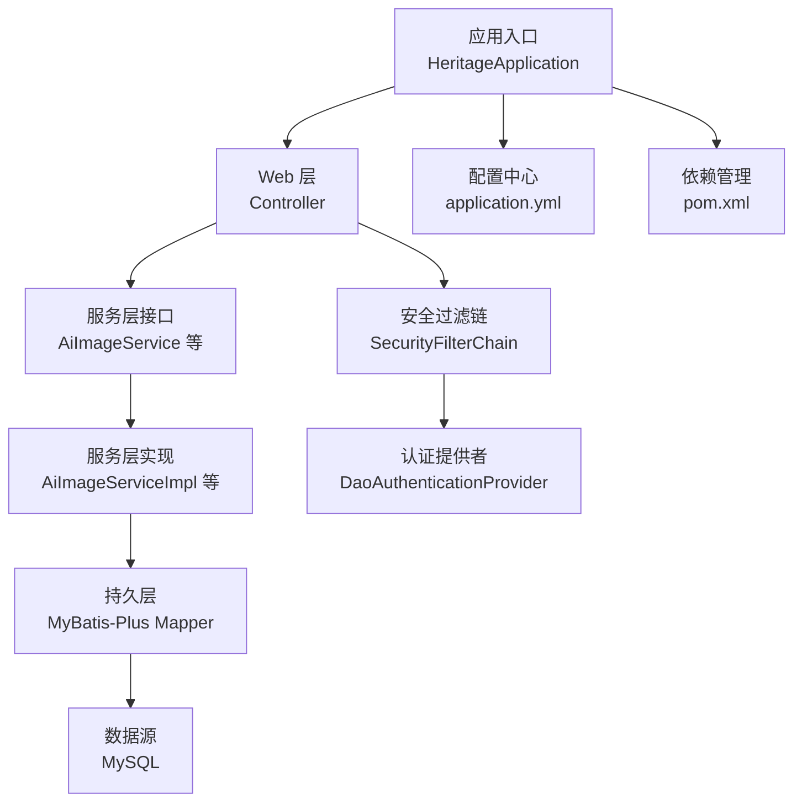
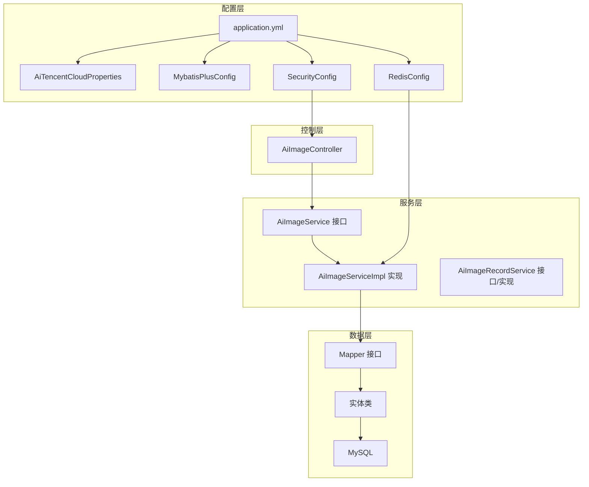
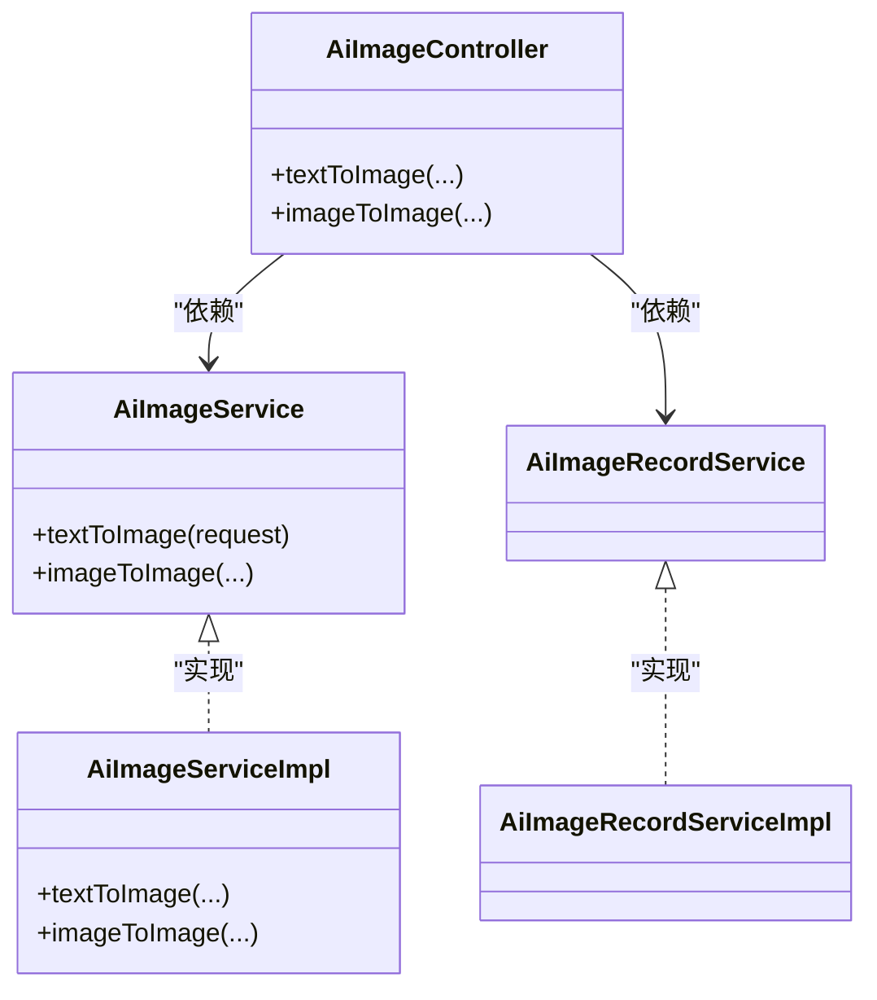
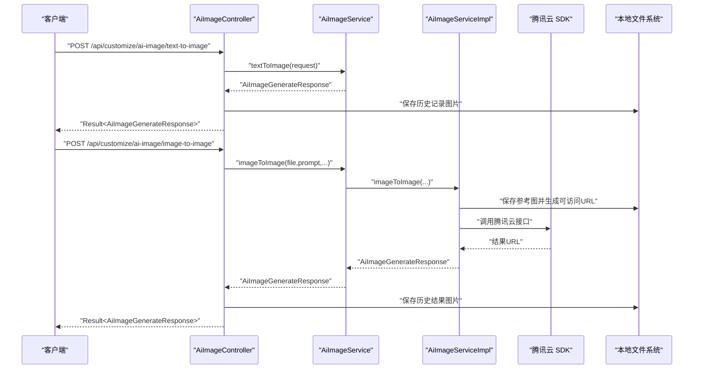
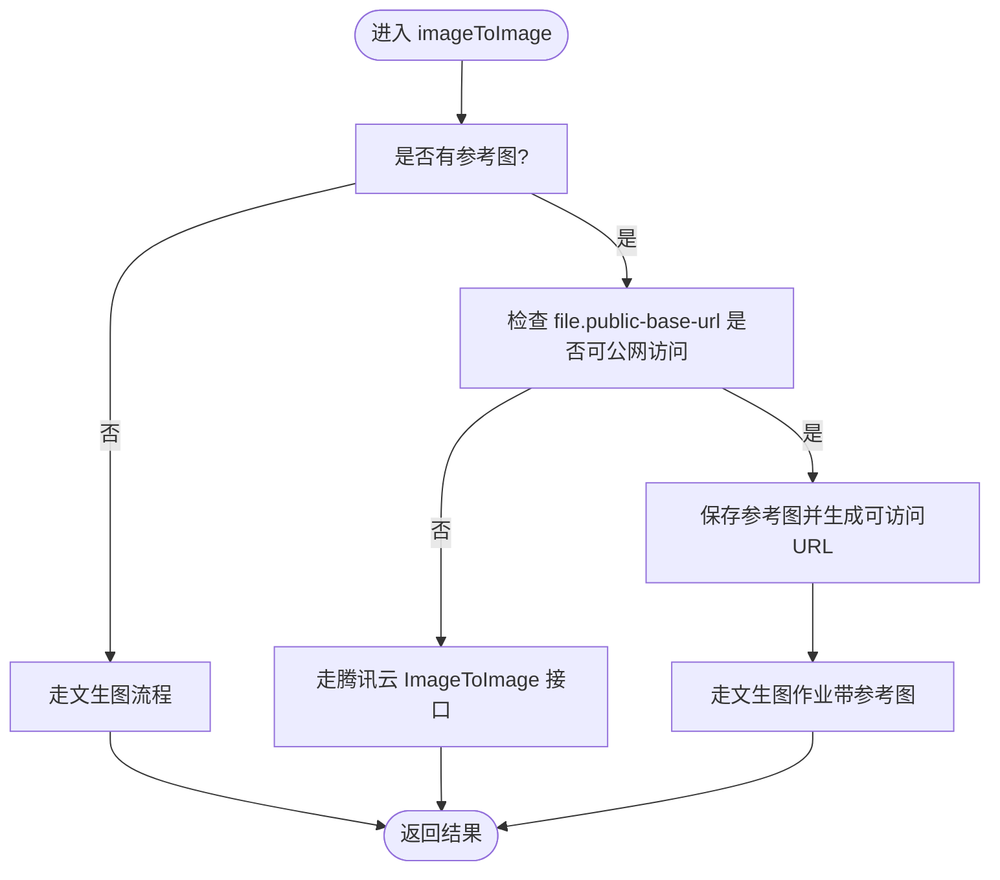
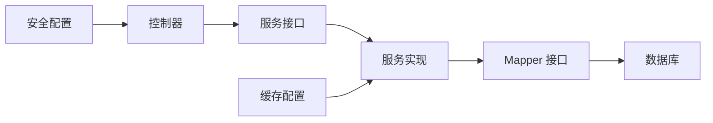

# 系统扩展机制

<cite>
**本文引用的文件**
- [HeritageApplication.java](file://backend/src/main/java/com/heritage/HeritageApplication.java)
- [application.yml](file://backend/src/main/resources/application.yml)
- [pom.xml](file://backend/pom.xml)
- [AiTencentCloudProperties.java](file://backend/src/main/java/com/heritage/config/AiTencentCloudProperties.java)
- [MybatisPlusConfig.java](file://backend/src/main/java/com/heritage/config/MybatisPlusConfig.java)
- [RedisConfig.java](file://backend/src/main/java/com/heritage/config/RedisConfig.java)
- [SecurityConfig.java](file://backend/src/main/java/com/heritage/config/SecurityConfig.java)
- [AiImageService.java](file://backend/src/main/java/com/heritage/service/AiImageService.java)
- [AiImageServiceImpl.java](file://backend/src/main/java/com/heritage/service/impl/AiImageServiceImpl.java)
- [AiImageController.java](file://backend/src/main/java/com/heritage/controller/AiImageController.java)
- [AiImageRecordService.java](file://backend/src/main/java/com/heritage/service/AiImageRecordService.java)
- [AiImageRecordServiceImpl.java](file://backend/src/main/java/com/heritage/service/impl/AiImageRecordServiceImpl.java)
- [AiImageRecordVO.java](file://backend/src/main/java/com/heritage/dto/AiImageRecordVO.java)
- [AiTextToImageRequest.java](file://backend/src/main/java/com/heritage/dto/AiTextToImageRequest.java)
- [AiImageGenerateResponse.java](file://backend/src/main/java/com/heritage/dto/AiImageGenerateResponse.java)
- [PageQuery.java](file://backend/src/main/java/com/heritage/dto/PageQuery.java)
- [BusinessException.java](file://backend/src/main/java/com/heritage/common/BusinessException.java)
- [Result.java](file://backend/src/main/java/com/heritage/common/Result.java)
- [GlobalExceptionHandler.java](file://backend/src/main/java/com/heritage/common/GlobalExceptionHandler.java)
- [JwtAuthenticationFilter.java](file://backend/src/main/java/com/heritage/security/JwtAuthenticationFilter.java)
- [CustomUserDetails.java](file://backend/src/main/java/com/heritage/security/CustomUserDetails.java)
- [CustomUserDetailsService.java](file://backend/src/main/java/com/heritage/security/CustomUserDetailsService.java)
- [HeritageCategory.java](file://backend/src/main/java/com/heritage/entity/HeritageCategory.java)
- [HeritageProject.java](file://backend/src/main/java/com/heritage/entity/HeritageProject.java)
- [HeritageInheritor.java](file://backend/src/main/java/com/heritage/entity/HeritageInheritor.java)
- [Product.java](file://backend/src/main/java/com/heritage/entity/Product.java)
- [Orders.java](file://backend/src/main/java/com/heritage/entity/Orders.java)
- [OrderItem.java](file://backend/src/main/java/com/heritage/entity/OrderItem.java)
- [User.java](file://backend/src/main/java/com/heritage/entity/User.java)
- [Certificate.java](file://backend/src/main/java/com/heritage/entity/Certificate.java)
- [Cart.java](file://backend/src/main/java/com/heritage/entity/Cart.java)
- [UserAddress.java](file://backend/src/main/java/com/heritage/entity/UserAddress.java)
- [AiImageRecord.java](file://backend/src/main/java/com/heritage/entity/AiImageRecord.java)
- [HeritageCategoryMapper.java](file://backend/src/main/java/com/heritage/mapper/HeritageCategoryMapper.java)
- [HeritageProjectMapper.java](file://backend/src/main/java/com/heritage/mapper/HeritageProjectMapper.java)
- [HeritageInheritorMapper.java](file://backend/src/main/java/com/heritage/mapper/HeritageInheritorMapper.java)
- [ProductMapper.java](file://backend/src/main/java/com/heritage/mapper/ProductMapper.java)
- [OrdersMapper.java](file://backend/src/main/java/com/heritage/mapper/OrdersMapper.java)
- [OrderItemMapper.java](file://backend/src/main/java/com/heritage/mapper/OrderItemMapper.java)
- [UserMapper.java](file://backend/src/main/java/com/heritage/mapper/UserMapper.java)
- [CertificateMapper.java](file://backend/src/main/java/com/heritage/mapper/CertificateMapper.java)
- [CartMapper.java](file://backend/src/main/java/com/heritage/mapper/CartMapper.java)
- [AiImageRecordMapper.java](file://backend/src/main/java/com/heritage/mapper/AiImageRecordMapper.java)
- [HeritageCategoryServiceImpl.java](file://backend/src/main/java/com/heritage/service/impl/HeritageCategoryServiceImpl.java)
- [HeritageProjectServiceImpl.java](file://backend/src/main/java/com/heritage/service/impl/HeritageProjectServiceImpl.java)
- [HeritageInheritorServiceImpl.java](file://backend/src/main/java/com/heritage/service/impl/HeritageInheritorServiceImpl.java)
- [ProductServiceImpl.java](file://backend/src/main/java/com/heritage/service/impl/ProductServiceImpl.java)
- [OrderServiceImpl.java](file://backend/src/main/java/com/heritage/service/impl/OrderServiceImpl.java)
- [PaymentServiceImpl.java](file://backend/src/main/java/com/heritage/service/impl/PaymentServiceImpl.java)
- [UserServiceImpl.java](file://backend/src/main/java/com/heritage/service/impl/UserServiceImpl.java)
- [CertificateServiceImpl.java](file://backend/src/main/java/com/heritage/service/impl/CertificateServiceImpl.java)
- [CartServiceImpl.java](file://backend/src/main/java/com/heritage/service/impl/CartServiceImpl.java)
- [AiImageRecordServiceImpl.java](file://backend/src/main/java/com/heritage/service/impl/AiImageRecordServiceImpl.java)
- [HeritageCategoryController.java](file://backend/src/main/java/com/heritage/controller/HeritageCategoryController.java)
- [HeritageProjectController.java](file://backend/src/main/java/com/heritage/controller/HeritageProjectController.java)
- [HeritageInheritorController.java](file://backend/src/main/java/com/heritage/controller/HeritageInheritorController.java)
- [ProductController.java](file://backend/src/main/java/com/heritage/controller/ProductController.java)
- [OrderController.java](file://backend/src/main/java/com/heritage/controller/OrderController.java)
- [PaymentController.java](file://backend/src/main/java/com/heritage/controller/PaymentController.java)
- [UserController.java](file://backend/src/main/java/com/heritage/controller/UserController.java)
- [CertificateController.java](file://backend/src/main/java/com/heritage/controller/CertificateController.java)
- [CartController.java](file://backend/src/main/java/com/heritage/controller/CartController.java)
- [AiImageController.java](file://backend/src/main/java/com/heritage/controller/AiImageController.java)
- [HeritageAdminCategoryController.java](file://backend/src/main/java/com/heritage/controller/HeritageAdminCategoryController.java)
- [HeritageAdminProjectController.java](file://backend/src/main/java/com/heritage/controller/HeritageAdminProjectController.java)
- [HeritageAdminInheritorController.java](file://backend/src/main/java/com/heritage/controller/HeritageAdminInheritorController.java)
- [ShopProductController.java](file://backend/src/main/java/com/heritage/controller/ShopProductController.java)
- [FileController.java](file://backend/src/main/java/com/heritage/controller/FileController.java)
- [AuthController.java](file://backend/src/main/java/com/heritage/controller/AuthController.java)
- [ai-image-record.sql](file://backend/src/main/resources/sql/ai_image_record.sql)
- [user.sql](file://backend/src/main/resources/sql/user.sql)
- [product.sql](file://backend/src/main/resources/sql/product.sql)
- [order.sql](file://backend/src/main/resources/sql/order.sql)
- [certificate.sql](file://backend/src/main/resources/sql/certificate.sql)
- [cart.sql](file://backend/src/main/resources/sql/cart.sql)
- [heritage.sql](file://backend/src/main/resources/sql/heritage.sql)
- [payment.sql](file://backend/src/main/resources/sql/payment.sql)
- [user_address.sql](file://backend/src/main/resources/sql/user_address.sql)
- [冗余文件处理计划.md](file://TODO/冗余文件处理计划.md)
- [非遗智能定制模块开发任务清单.md](file://TODO/非遗智能定制模块开发任务清单.md)
- [非遗智能定制模块设计方案.md](file://TODO/非遗智能定制模块设计方案.md)
</cite>

## 目录
1. [简介](#简介)
2. [项目结构](#项目结构)
3. [核心组件](#核心组件)
4. [架构总览](#架构总览)
5. [详细组件分析](#详细组件分析)
6. [依赖关系分析](#依赖关系分析)
7. [性能考量](#性能考量)
8. [故障排查指南](#故障排查指南)
9. [结论](#结论)
10. [附录](#附录)

## 简介
本文件面向“非遗产品智能定制商城系统”的扩展机制，系统基于 Spring Boot 3.2.0 构建，采用模块化与接口驱动的设计思路，围绕以下目标展开：
- 明确可扩展性设计原则与架构模式
- 解释 Spring Boot 自动配置与条件注解的使用及扩展点
- 阐述插件化架构的实现方式（接口定义、SPI 机制与动态加载策略）
- 提供模块化开发指南（配置文件与依赖管理）
- 给出扩展点识别方法、向后兼容性与版本管理策略
- 使开发者能快速理解系统的扩展边界与最佳实践

## 项目结构
系统采用标准的 Spring Boot 分层结构：
- 应用入口与配置：HeritageApplication、application.yml、pom.xml
- 配置模块：MybatisPlusConfig、RedisConfig、SecurityConfig、AiTencentCloudProperties
- 控制器层：各领域控制器（商品、订单、用户、非遗、AI生图等）
- 服务层：接口与实现（AiImageService、AiImageRecordService 等）
- 数据传输对象：DTO（AiTextToImageRequest、AiImageGenerateResponse、AiImageRecordVO、PageQuery 等）
- 实体与映射：entity 与 mapper
- 安全与工具：JwtAuthenticationFilter、自定义 UserDetails、全局异常处理、通用 Result 包装
- 资源与静态文件：SQL 初始化脚本、上传目录 uploads

图表来源
- [HeritageApplication.java](file://backend/src/main/java/com/heritage/HeritageApplication.java#L1-L13)
- [application.yml](file://backend/src/main/resources/application.yml#L1-L63)
- [pom.xml](file://backend/pom.xml#L1-L129)

章节来源
- [HeritageApplication.java](file://backend/src/main/java/com/heritage/HeritageApplication.java#L1-L13)
- [application.yml](file://backend/src/main/resources/application.yml#L1-L63)
- [pom.xml](file://backend/pom.xml#L1-L129)

## 核心组件
- 应用入口与启动：通过@SpringBootApplication 启动，扫描并注册组件。
- 配置体系：application.yml 提供基础配置；AiTencentCloudProperties 通过@ConfigurationProperties 绑定外部配置。
- 安全体系：SecurityConfig 定义无状态 JWT 过滤链与放行规则。
- 数据访问：MybatisPlusConfig 注册分页、乐观锁、SQL 防护等插件。
- 缓存与序列化：RedisConfig 统一 RedisTemplate 序列化策略。
- 业务扩展点：AiImageService 接口与 AiImageServiceImpl 实现，支持文生图/图生图两种模式。

章节来源
- [AiTencentCloudProperties.java](file://backend/src/main/java/com/heritage/config/AiTencentCloudProperties.java#L1-L21)
- [MybatisPlusConfig.java](file://backend/src/main/java/com/heritage/config/MybatisPlusConfig.java#L1-L31)
- [RedisConfig.java](file://backend/src/main/java/com/heritage/config/RedisConfig.java#L1-L46)
- [SecurityConfig.java](file://backend/src/main/java/com/heritage/config/SecurityConfig.java#L1-L67)
- [AiImageService.java](file://backend/src/main/java/com/heritage/service/AiImageService.java#L1-L21)
- [AiImageServiceImpl.java](file://backend/src/main/java/com/heritage/service/impl/AiImageServiceImpl.java#L1-L430)

## 架构总览
系统采用“接口 + 实现 + 配置 + 控制器”的分层扩展模式：
- 接口定义：AiImageService、AiImageRecordService 等，约束扩展能力
- 实现注入：AiImageServiceImpl、AiImageRecordServiceImpl 等，承载具体逻辑
- 配置驱动：application.yml 与 @ConfigurationProperties，实现外部化配置
- 控制器编排：AiImageController 组织请求、调用服务、返回 Result 包装
- 安全与缓存：SecurityFilterChain 与 RedisTemplate 提供横切能力

图表来源
- [application.yml](file://backend/src/main/resources/application.yml#L1-L63)
- [AiTencentCloudProperties.java](file://backend/src/main/java/com/heritage/config/AiTencentCloudProperties.java#L1-L21)
- [MybatisPlusConfig.java](file://backend/src/main/java/com/heritage/config/MybatisPlusConfig.java#L1-L31)
- [RedisConfig.java](file://backend/src/main/java/com/heritage/config/RedisConfig.java#L1-L46)
- [SecurityConfig.java](file://backend/src/main/java/com/heritage/config/SecurityConfig.java#L1-L67)
- [AiImageController.java](file://backend/src/main/java/com/heritage/controller/AiImageController.java#L1-L320)
- [AiImageService.java](file://backend/src/main/java/com/heritage/service/AiImageService.java#L1-L21)
- [AiImageServiceImpl.java](file://backend/src/main/java/com/heritage/service/impl/AiImageServiceImpl.java#L1-L430)

## 详细组件分析

### Spring Boot 自动配置与条件注解
- @SpringBootApplication：组合了 @SpringBootConfiguration、@EnableAutoConfiguration、@ComponentScan，负责应用启动与组件扫描。
- @ConfigurationProperties：AiTencentCloudProperties 将 ai.tencetcloud.* 键绑定为属性对象，便于外部化配置与测试替换。
- MybatisPlusConfig：通过 @MapperScan 扫描 Mapper 接口，注册 MyBatis-Plus 插件（分页、乐观锁、SQL 防护）。
- RedisConfig：定义 RedisTemplate 序列化策略，统一 JSON 序列化与键序列化。
- SecurityConfig：定义无状态安全过滤链，放行公开接口，其余请求需鉴权。

扩展点识别与最佳实践：
- 使用 @ConditionalOnProperty、@ConditionalOnMissingBean 等条件注解，实现按需装配与覆盖。
- 将第三方 SDK 配置（如腾讯云）抽取为独立 Properties 类，便于替换与测试。
- 将跨领域能力（缓存、安全、分页）下沉为配置类，降低业务耦合。

章节来源
- [HeritageApplication.java](file://backend/src/main/java/com/heritage/HeritageApplication.java#L1-L13)
- [AiTencentCloudProperties.java](file://backend/src/main/java/com/heritage/config/AiTencentCloudProperties.java#L1-L21)
- [MybatisPlusConfig.java](file://backend/src/main/java/com/heritage/config/MybatisPlusConfig.java#L1-L31)
- [RedisConfig.java](file://backend/src/main/java/com/heritage/config/RedisConfig.java#L1-L46)
- [SecurityConfig.java](file://backend/src/main/java/com/heritage/config/SecurityConfig.java#L1-L67)

### 插件化架构与 SPI 机制
系统当前未显式使用 JDK SPI 文件，但具备良好的插件化扩展基础：
- 接口定义：AiImageService、AiImageRecordService 等，形成稳定的扩展契约。
- 动态加载策略：可通过 @Qualifier、@Primary、@Profile、@ConditionalOnProperty 等实现多实现切换与按环境启用。
- 外部化配置：application.yml 与 AiTencentCloudProperties 支持不同供应商/版本的参数切换。

建议的 SPI 实现步骤：
- 定义 SPI 接口与默认实现
- 在 META-INF/services 下放置接口全限定名与实现类映射
- 通过 Spring 的 @ImportResource 或自定义 ImportSelector 加载 SPI 配置
- 使用 @ConditionalOnProperty 按配置启用不同实现

图表来源
- [AiImageService.java](file://backend/src/main/java/com/heritage/service/AiImageService.java#L1-L21)
- [AiImageServiceImpl.java](file://backend/src/main/java/com/heritage/service/impl/AiImageServiceImpl.java#L1-L430)
- [AiImageRecordService.java](file://backend/src/main/java/com/heritage/service/AiImageRecordService.java)
- [AiImageRecordServiceImpl.java](file://backend/src/main/java/com/heritage/service/impl/AiImageRecordServiceImpl.java)
- [AiImageController.java](file://backend/src/main/java/com/heritage/controller/AiImageController.java#L1-L320)

章节来源
- [AiImageService.java](file://backend/src/main/java/com/heritage/service/AiImageService.java#L1-L21)
- [AiImageServiceImpl.java](file://backend/src/main/java/com/heritage/service/impl/AiImageServiceImpl.java#L1-L430)
- [AiImageRecordService.java](file://backend/src/main/java/com/heritage/service/AiImageRecordService.java)
- [AiImageRecordServiceImpl.java](file://backend/src/main/java/com/heritage/service/impl/AiImageRecordServiceImpl.java)
- [AiImageController.java](file://backend/src/main/java/com/heritage/controller/AiImageController.java#L1-L320)

### AI 生图模块工作流
AI 生图模块通过控制器编排服务层，服务层根据配置与环境变量选择调用路径（文生图或图生图），并在需要时将参考图上传至本地目录，供前端访问。

图表来源
- [AiImageController.java](file://backend/src/main/java/com/heritage/controller/AiImageController.java#L1-L320)
- [AiImageService.java](file://backend/src/main/java/com/heritage/service/AiImageService.java#L1-L21)
- [AiImageServiceImpl.java](file://backend/src/main/java/com/heritage/service/impl/AiImageServiceImpl.java#L1-L430)

章节来源
- [AiImageController.java](file://backend/src/main/java/com/heritage/controller/AiImageController.java#L1-L320)
- [AiImageServiceImpl.java](file://backend/src/main/java/com/heritage/service/impl/AiImageServiceImpl.java#L1-L430)

### 条件逻辑与参数校验流程
图生图与文生图的分流逻辑依赖环境变量与参数校验，确保在不同部署环境下选择最优路径。

图表来源
- [AiImageServiceImpl.java](file://backend/src/main/java/com/heritage/service/impl/AiImageServiceImpl.java#L320-L330)
- [AiImageServiceImpl.java](file://backend/src/main/java/com/heritage/service/impl/AiImageServiceImpl.java#L332-L361)

章节来源
- [AiImageServiceImpl.java](file://backend/src/main/java/com/heritage/service/impl/AiImageServiceImpl.java#L320-L330)
- [AiImageServiceImpl.java](file://backend/src/main/java/com/heritage/service/impl/AiImageServiceImpl.java#L332-L361)

### 模块化开发指南
- 依赖管理：通过 pom.xml 统一版本与依赖，新增模块时遵循版本属性与依赖范围管理。
- 配置文件：application.yml 提供全局配置，AiTencentCloudProperties 提供外部化配置，便于按环境切换。
- 控制器与服务：新增功能优先定义接口与实现，控制器只负责编排与返回包装。
- 数据访问：通过 MyBatis-Plus Config 注册插件，保持分页、乐观锁等横切能力一致。
- 安全与缓存：SecurityConfig 与 RedisConfig 作为横切能力下沉，减少业务侵入。

章节来源
- [pom.xml](file://backend/pom.xml#L1-L129)
- [application.yml](file://backend/src/main/resources/application.yml#L1-L63)
- [AiTencentCloudProperties.java](file://backend/src/main/java/com/heritage/config/AiTencentCloudProperties.java#L1-L21)
- [MybatisPlusConfig.java](file://backend/src/main/java/com/heritage/config/MybatisPlusConfig.java#L1-L31)
- [RedisConfig.java](file://backend/src/main/java/com/heritage/config/RedisConfig.java#L1-L46)
- [SecurityConfig.java](file://backend/src/main/java/com/heritage/config/SecurityConfig.java#L1-L67)

### 扩展点识别方法
- 接口层：AiImageService、AiImageRecordService 等，识别为稳定扩展点
- 配置层：AiTencentCloudProperties、application.yml，识别为外部化扩展点
- 控制器层：AiImageController，识别为编排扩展点
- 安全层：SecurityConfig，识别为权限与过滤扩展点
- 数据层：MyBatis-Plus 插件，识别为数据访问扩展点

章节来源
- [AiImageService.java](file://backend/src/main/java/com/heritage/service/AiImageService.java#L1-L21)
- [AiImageRecordService.java](file://backend/src/main/java/com/heritage/service/AiImageRecordService.java)
- [AiTencentCloudProperties.java](file://backend/src/main/java/com/heritage/config/AiTencentCloudProperties.java#L1-L21)
- [AiImageController.java](file://backend/src/main/java/com/heritage/controller/AiImageController.java#L1-L320)
- [SecurityConfig.java](file://backend/src/main/java/com/heritage/config/SecurityConfig.java#L1-L67)
- [MybatisPlusConfig.java](file://backend/src/main/java/com/heritage/config/MybatisPlusConfig.java#L1-L31)

### 向后兼容性与版本管理策略
- 向后兼容：接口层保持稳定，新增参数建议可选并提供默认值；服务层实现中对可选参数进行兼容处理。
- 版本管理：pom.xml 统一管理依赖版本，新增模块时遵循版本属性；配置项命名清晰，避免破坏性变更。
- 运行时产物：uploads 目录为运行时产物，建议加入忽略规则，避免仓库膨胀与误用。

章节来源
- [pom.xml](file://backend/pom.xml#L21-L28)
- [冗余文件处理计划.md](file://TODO/冗余文件处理计划.md#L85-L104)

## 依赖关系分析
系统主要依赖关系如下：
- 控制器依赖服务接口
- 服务接口由实现类提供
- 服务实现依赖 Mapper 与配置
- 安全配置与缓存配置为横切能力

图表来源
- [AiImageController.java](file://backend/src/main/java/com/heritage/controller/AiImageController.java#L1-L320)
- [AiImageService.java](file://backend/src/main/java/com/heritage/service/AiImageService.java#L1-L21)
- [AiImageServiceImpl.java](file://backend/src/main/java/com/heritage/service/impl/AiImageServiceImpl.java#L1-L430)
- [MybatisPlusConfig.java](file://backend/src/main/java/com/heritage/config/MybatisPlusConfig.java#L1-L31)
- [SecurityConfig.java](file://backend/src/main/java/com/heritage/config/SecurityConfig.java#L1-L67)
- [RedisConfig.java](file://backend/src/main/java/com/heritage/config/RedisConfig.java#L1-L46)

章节来源
- [AiImageController.java](file://backend/src/main/java/com/heritage/controller/AiImageController.java#L1-L320)
- [AiImageService.java](file://backend/src/main/java/com/heritage/service/AiImageService.java#L1-L21)
- [AiImageServiceImpl.java](file://backend/src/main/java/com/heritage/service/impl/AiImageServiceImpl.java#L1-L430)
- [MybatisPlusConfig.java](file://backend/src/main/java/com/heritage/config/MybatisPlusConfig.java#L1-L31)
- [SecurityConfig.java](file://backend/src/main/java/com/heritage/config/SecurityConfig.java#L1-L67)
- [RedisConfig.java](file://backend/src/main/java/com/heritage/config/RedisConfig.java#L1-L46)

## 性能考量
- 分页与锁：MybatisPlusConfig 注册分页与乐观锁插件，避免全表扫描与并发冲突。
- 缓存：RedisConfig 统一序列化策略，提升缓存命中率与序列化效率。
- 安全：无状态 JWT 过滤链减少会话开销。
- I/O：AI 生图模块对上传与历史记录的文件 I/O 进行路径规范化与异常兜底，避免阻塞与异常扩散。

章节来源
- [MybatisPlusConfig.java](file://backend/src/main/java/com/heritage/config/MybatisPlusConfig.java#L1-L31)
- [RedisConfig.java](file://backend/src/main/java/com/heritage/config/RedisConfig.java#L1-L46)
- [SecurityConfig.java](file://backend/src/main/java/com/heritage/config/SecurityConfig.java#L1-L67)
- [AiImageController.java](file://backend/src/main/java/com/heritage/controller/AiImageController.java#L161-L272)

## 故障排查指南
- 业务异常：BusinessException 用于封装业务错误信息，配合 Result 统一返回。
- 全局异常：GlobalExceptionHandler 提供全局异常捕获与统一响应。
- 安全异常：SecurityConfig 中的放行规则与 JWT 过滤链，确保未登录与越权访问被正确拦截。
- 文件上传：FileController 提供上传与静态资源访问，结合 application.yml 的 multipart 配置与 uploads 目录。

章节来源
- [BusinessException.java](file://backend/src/main/java/com/heritage/common/BusinessException.java)
- [GlobalExceptionHandler.java](file://backend/src/main/java/com/heritage/common/GlobalExceptionHandler.java)
- [SecurityConfig.java](file://backend/src/main/java/com/heritage/config/SecurityConfig.java#L50-L65)
- [application.yml](file://backend/src/main/resources/application.yml#L11-L15)
- [FileController.java](file://backend/src/main/java/com/heritage/controller/FileController.java)

## 结论
本系统通过接口驱动、配置外化、安全与缓存横切能力下沉，形成了清晰的扩展边界与可演进的架构。开发者可在不破坏现有契约的前提下，通过接口扩展、配置切换与条件装配实现功能扩展与版本演进。建议在新增模块时遵循本文给出的扩展点识别、向后兼容与版本管理策略，确保系统长期可维护性与可扩展性。

## 附录
- 开发任务与方案参考：非遗智能定制模块开发任务清单、非遗智能定制模块设计方案
- 运行时产物清理建议：冗余文件处理计划

章节来源
- [非遗智能定制模块开发任务清单.md](file://TODO/非遗智能定制模块开发任务清单.md#L1-L49)
- [非遗智能定制模块设计方案.md](file://TODO/非遗智能定制模块设计方案.md#L154-L202)
- [冗余文件处理计划.md](file://TODO/冗余文件处理计划.md#L85-L104)