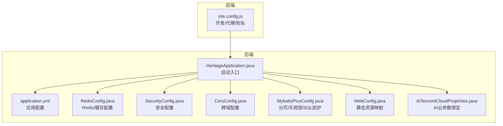
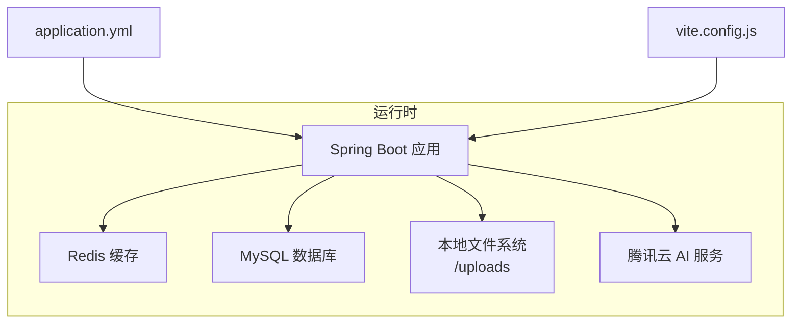
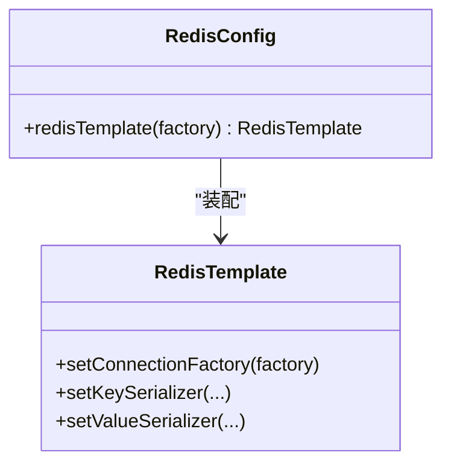
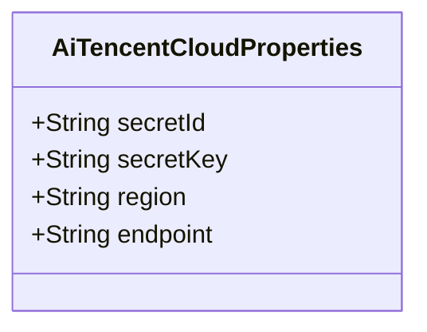
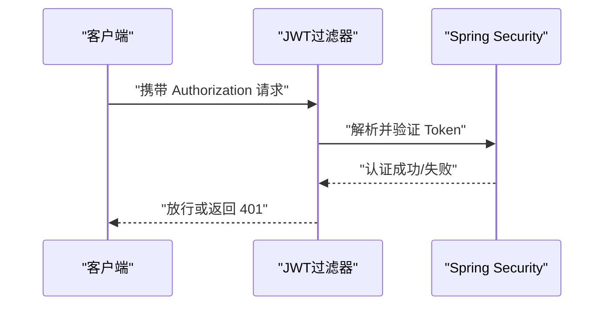
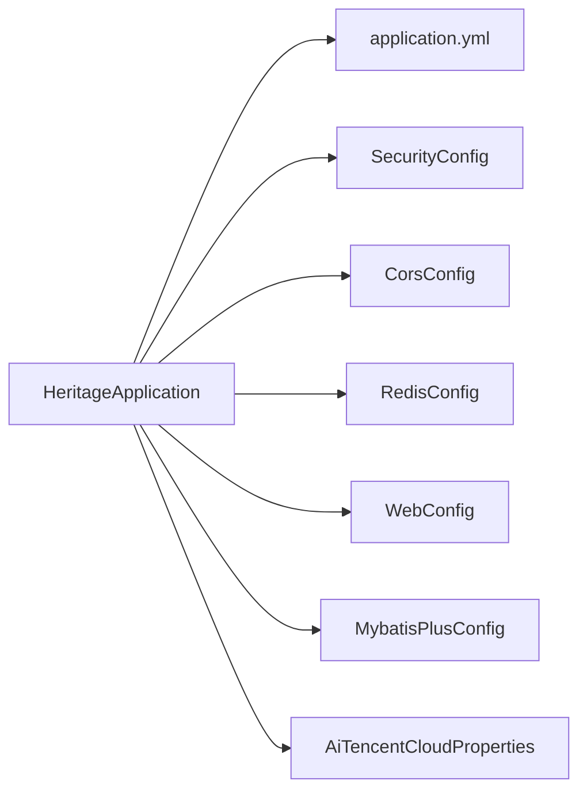

# 配置管理方案

<cite>
**本文引用的文件**
- [application.yml](file://backend/src/main/resources/application.yml)
- [pom.xml](file://backend/pom.xml)
- [HeritageApplication.java](file://backend/src/main/java/com/heritage/HeritageApplication.java)
- [RedisConfig.java](file://backend/src/main/java/com/heritage/config/RedisConfig.java)
- [AiTencentCloudProperties.java](file://backend/src/main/java/com/heritage/config/AiTencentCloudProperties.java)
- [CorsConfig.java](file://backend/src/main/java/com/heritage/config/CorsConfig.java)
- [SecurityConfig.java](file://backend/src/main/java/com/heritage/config/SecurityConfig.java)
- [WebConfig.java](file://backend/src/main/java/com/heritage/config/WebConfig.java)
- [MybatisPlusConfig.java](file://backend/src/main/java/com/heritage/config/MybatisPlusConfig.java)
- [vite.config.js](file://frontend/vite.config.js)
</cite>

## 目录
1. [引言](#引言)
2. [项目结构](#项目结构)
3. [核心组件](#核心组件)
4. [架构总览](#架构总览)
5. [详细组件分析](#详细组件分析)
6. [依赖关系分析](#依赖关系分析)
7. [性能考量](#性能考量)
8. [故障排查指南](#故障排查指南)
9. [结论](#结论)
10. [附录](#附录)

## 引言
本方案面向“非遗产品智能定制商城系统”，围绕后端 Spring Boot 与前端 Vite 的配置体系，提供从配置优先级、多环境管理、数据库与缓存配置、第三方服务集成到版本控制与变更管理、热更新与监控策略的完整落地建议。目标是帮助团队建立统一、可追溯、可审计且安全的配置管理规范。

## 项目结构
系统采用前后端分离架构：
- 后端基于 Spring Boot 3.2.0，使用 Maven 构建，核心配置集中在 application.yml，并通过 Java 配置类扩展功能（如 Redis、安全、跨域、MyBatis-Plus 等）。
- 前端基于 Vite，通过 vite.config.js 提供开发服务器、代理与路径别名等配置。

图表来源
- [HeritageApplication.java](file://backend/src/main/java/com/heritage/HeritageApplication.java#L1-L13)
- [application.yml](file://backend/src/main/resources/application.yml#L1-L63)
- [RedisConfig.java](file://backend/src/main/java/com/heritage/config/RedisConfig.java#L1-L46)
- [SecurityConfig.java](file://backend/src/main/java/com/heritage/config/SecurityConfig.java#L1-L67)
- [CorsConfig.java](file://backend/src/main/java/com/heritage/config/CorsConfig.java#L1-L27)
- [MybatisPlusConfig.java](file://backend/src/main/java/com/heritage/config/MybatisPlusConfig.java#L1-L31)
- [WebConfig.java](file://backend/src/main/java/com/heritage/config/WebConfig.java#L1-L23)
- [AiTencentCloudProperties.java](file://backend/src/main/java/com/heritage/config/AiTencentCloudProperties.java#L1-L21)
- [vite.config.js](file://frontend/vite.config.js#L1-L22)

章节来源
- [HeritageApplication.java](file://backend/src/main/java/com/heritage/HeritageApplication.java#L1-L13)
- [application.yml](file://backend/src/main/resources/application.yml#L1-L63)
- [vite.config.js](file://frontend/vite.config.js#L1-L22)

## 核心组件
- 应用配置中心：application.yml 负责服务端口、数据源、Redis、JWT、Knife4j、文件上传路径与公共访问基地址等全局配置。
- 安全与跨域：SecurityConfig 与 CorsConfig 分别负责无状态认证链路与跨域策略。
- 缓存与序列化：RedisConfig 统一 RedisTemplate 的键值序列化策略，启用 Spring Cache。
- ORM 与分页：MybatisPlusConfig 注册分页、乐观锁与 SQL 防护插件。
- 文件资源：WebConfig 将本地上传目录映射为静态资源访问路径。
- 第三方服务：AiTencentCloudProperties 用于绑定腾讯云 AI 服务的密钥与区域等参数。
- 前端工程：vite.config.js 提供开发服务器端口、API 代理与路径别名。

章节来源
- [application.yml](file://backend/src/main/resources/application.yml#L1-L63)
- [SecurityConfig.java](file://backend/src/main/java/com/heritage/config/SecurityConfig.java#L1-L67)
- [CorsConfig.java](file://backend/src/main/java/com/heritage/config/CorsConfig.java#L1-L27)
- [RedisConfig.java](file://backend/src/main/java/com/heritage/config/RedisConfig.java#L1-L46)
- [MybatisPlusConfig.java](file://backend/src/main/java/com/heritage/config/MybatisPlusConfig.java#L1-L31)
- [WebConfig.java](file://backend/src/main/java/com/heritage/config/WebConfig.java#L1-L23)
- [AiTencentCloudProperties.java](file://backend/src/main/java/com/heritage/config/AiTencentCloudProperties.java#L1-L21)
- [vite.config.js](file://frontend/vite.config.js#L1-L22)

## 架构总览
下图展示配置在系统中的作用与交互：

图表来源
- [application.yml](file://backend/src/main/resources/application.yml#L1-L63)
- [vite.config.js](file://frontend/vite.config.js#L1-L22)

## 详细组件分析

### Spring Boot 配置优先级与多环境管理
- 配置优先级（从高到低，来自 Spring Boot 官方机制）：
  1) 命令行参数
  2) SPRING_APPLICATION_JSON
  3) 系统环境变量
  4) 操作系统用户配置目录下的 spring.config.import
  5) application-{profile}.yml
  6) application.yml
  7) @PropertySource
  8) 默认属性
- 多环境实践建议：
  - 开发环境：本地 application-dev.yml，设置本地 MySQL、Redis、JWT 密钥与文件上传路径。
  - 测试环境：application-test.yml，使用独立数据库与缓存实例，降低日志级别。
  - 生产环境：application-prod.yml，敏感信息通过环境变量注入，禁用 Swagger/Knife4j 文档端点或仅限内网访问。
  - 使用 spring.profiles.active 指定当前激活的 profile；避免在主配置中硬编码生产敏感信息。
- 当前仓库现状：
  - application.yml 中已设置 spring.profiles.active: mock，建议替换为 dev/test/prod 并配套 profile 文件。
  - JWT 密钥与数据库凭据应通过环境变量注入，避免提交到版本库。

章节来源
- [application.yml](file://backend/src/main/resources/application.yml#L36-L37)

### 数据库连接配置最佳实践
- 连接池与驱动：使用 MySQL Connector/J 8.0，结合 MyBatis-Plus starter。
- 连接参数：建议开启时区与字符集，合理设置最大连接数、空闲超时与连接生命周期。
- 安全性：数据库凭据通过环境变量注入；生产环境使用只读账号用于查询，写入使用专用账号。
- 连接字符串示例要点（不直接粘贴）：包含主机、端口、数据库名、字符集与时区参数；避免明文密码。

章节来源
- [application.yml](file://backend/src/main/resources/application.yml#L17-L21)
- [pom.xml](file://backend/pom.xml#L52-L55)

### 缓存配置与 Redis 最佳实践
- 序列化策略：使用 JSON 序列化以提升可读性与跨语言兼容性；键采用 String，值采用 JSON。
- 连接与池参数：根据 QPS 设置最大连接、最大等待与空闲阈值；设置合理的超时时间。
- 命名规范：统一前缀与过期策略；对热点数据设置短 TTL，对长尾数据设置较长 TTL。
- 降级与容错：在 Redis 不可用时允许业务继续运行（快速失败或熔断）。

图表来源
- [RedisConfig.java](file://backend/src/main/java/com/heritage/config/RedisConfig.java#L1-L46)

章节来源
- [RedisConfig.java](file://backend/src/main/java/com/heritage/config/RedisConfig.java#L1-L46)
- [application.yml](file://backend/src/main/resources/application.yml#L23-L35)

### 第三方服务配置（以腾讯云 AI 为例）
- 参数绑定：通过 @ConfigurationProperties 将 ai.tencentloud.* 映射到实体类，便于集中管理与校验。
- 环境变量注入：secretId/secretKey 通过环境变量注入，避免硬编码；endpoint/region 可按需调整。
- 安全性：最小权限原则；定期轮换密钥；限制域名与 IP 白名单。

图表来源
- [AiTencentCloudProperties.java](file://backend/src/main/java/com/heritage/config/AiTencentCloudProperties.java#L1-L21)
- [application.yml](file://backend/src/main/resources/application.yml#L43-L53)

章节来源
- [AiTencentCloudProperties.java](file://backend/src/main/java/com/heritage/config/AiTencentCloudProperties.java#L1-L21)
- [application.yml](file://backend/src/main/resources/application.yml#L43-L53)

### 安全与跨域配置
- 安全策略：无状态会话（STATELESS），JWT 过滤器在用户名密码过滤器之前执行；开放部分公开接口，其余请求均需认证。
- 跨域策略：允许任意来源模式、凭证、方法与头，设置合理 Max-Age。
- 建议：生产环境限制允许来源与头字段，关闭调试类文档端点。

图表来源
- [SecurityConfig.java](file://backend/src/main/java/com/heritage/config/SecurityConfig.java#L50-L62)

章节来源
- [SecurityConfig.java](file://backend/src/main/java/com/heritage/config/SecurityConfig.java#L1-L67)
- [CorsConfig.java](file://backend/src/main/java/com/heritage/config/CorsConfig.java#L1-L27)

### 文件上传与静态资源映射
- 上传路径：通过配置项 file.upload.path 指定，默认 uploads；可通过环境变量覆盖。
- 静态映射：将 /uploads/** 映射到本地绝对路径，便于浏览器直接访问。
- 安全性：限制上传类型与大小；对文件名进行规范化处理；必要时启用 CDN 与鉴权。

章节来源
- [application.yml](file://backend/src/main/resources/application.yml#L59-L62)
- [WebConfig.java](file://backend/src/main/java/com/heritage/config/WebConfig.java#L1-L23)

### 前端构建配置管理（Vite）
- 开发服务器：端口 3030，配置 /api 代理到后端 8080，便于联调。
- 路径别名：@ 指向 src，提升导入可读性。
- 环境变量：通过 .env 或构建脚本注入变量；区分开发/测试/生产环境。
- 打包优化：按需引入插件；开启代码分割与 Tree Shaking；产物输出目录与哈希命名策略统一。

章节来源
- [vite.config.js](file://frontend/vite.config.js#L1-L22)

### 配置模板与标准化示例
- application.yml 关键键位建议：
  - server.port
  - spring.profiles.active
  - spring.datasource.* 与 spring.data.redis.*
  - jwt.secret 与 jwt.expiration
  - knife4j.enable 与 knife4j.setting.language
  - file.upload.path 与 file.public-base-url
  - ai.tencentcloud.secret-id/key/region/endpoint
- 前端 vite.config.js 建议：
  - server.port 与 proxy.target
  - resolve.alias['@']
  - 构建输出目录与 public 目录

章节来源
- [application.yml](file://backend/src/main/resources/application.yml#L1-L63)
- [vite.config.js](file://frontend/vite.config.js#L1-L22)

## 依赖关系分析
- 启动入口与配置装配：
  - HeritageApplication 作为 Spring Boot 启动类，加载 application.yml 与各 Java 配置类。
- 配置类之间的耦合：
  - WebConfig 依赖 application.yml 的 file.upload.path。
  - SecurityConfig 依赖 JwtAuthenticationFilter 与 UserDetailsService。
  - RedisConfig 依赖 Redis 连接工厂。
  - MybatisPlusConfig 依赖 Mapper 扫描与拦截器注册。
  - AiTencentCloudProperties 为外部服务提供参数绑定。

图表来源
- [HeritageApplication.java](file://backend/src/main/java/com/heritage/HeritageApplication.java#L1-L13)
- [application.yml](file://backend/src/main/resources/application.yml#L1-L63)
- [SecurityConfig.java](file://backend/src/main/java/com/heritage/config/SecurityConfig.java#L1-L67)
- [CorsConfig.java](file://backend/src/main/java/com/heritage/config/CorsConfig.java#L1-L27)
- [RedisConfig.java](file://backend/src/main/java/com/heritage/config/RedisConfig.java#L1-L46)
- [WebConfig.java](file://backend/src/main/java/com/heritage/config/WebConfig.java#L1-L23)
- [MybatisPlusConfig.java](file://backend/src/main/java/com/heritage/config/MybatisPlusConfig.java#L1-L31)
- [AiTencentCloudProperties.java](file://backend/src/main/java/com/heritage/config/AiTencentCloudProperties.java#L1-L21)

章节来源
- [HeritageApplication.java](file://backend/src/main/java/com/heritage/HeritageApplication.java#L1-L13)
- [application.yml](file://backend/src/main/resources/application.yml#L1-L63)

## 性能考量
- 数据库层：合理设置连接池大小与超时；开启慢查询日志；对高频查询建立索引。
- 缓存层：热点数据预热；设置合适的 TTL；使用批量操作减少网络往返。
- 安全层：JWT 解析与校验尽量轻量；避免在过滤器中做重 IO 操作。
- 前端层：按需加载与懒加载；压缩与缓存静态资源；CDN 加速。

## 故障排查指南
- 启动失败（无法加载配置）：
  - 检查 application.yml 语法与缩进；确认 spring.profiles.active 对应的 profile 文件存在。
  - 确认环境变量是否正确注入（如数据库密码、AI 密钥）。
- Redis 连接异常：
  - 核对 host/port/database/timeout；检查连接池参数；确认防火墙与容器网络。
- 文件上传失败：
  - 检查 file.upload.path 是否可写；确认 WebConfig 已生效；浏览器访问 /uploads/** 是否可达。
- 跨域问题：
  - 确认 CORS 配置是否生效；浏览器开发者工具查看预检请求结果。
- 前端代理无效：
  - 检查 vite.config.js 的 server.proxy.target 与 /api 前缀是否匹配后端路由。

章节来源
- [application.yml](file://backend/src/main/resources/application.yml#L1-L63)
- [WebConfig.java](file://backend/src/main/java/com/heritage/config/WebConfig.java#L1-L23)
- [CorsConfig.java](file://backend/src/main/java/com/heritage/config/CorsConfig.java#L1-L27)
- [vite.config.js](file://frontend/vite.config.js#L1-L22)

## 结论
通过明确的配置优先级与多环境策略、严格的敏感信息治理、完善的缓存与数据库配置、清晰的第三方服务参数绑定以及前端构建与代理配置，可以显著提升系统的稳定性、可维护性与安全性。建议尽快完善 profile 文件与环境变量注入，建立配置变更的评审与回滚流程，并引入配置监控与告警机制。

## 附录

### 配置热更新与监控建议
- 配置热更新：
  - Spring Cloud Config 或 Nacos/Consul 等配置中心；对非敏感配置支持动态刷新。
  - 对于 Redis/JWT 等关键配置，建议重启生效或配合灰度发布。
- 配置监控：
  - 记录配置变更日志；对敏感字段进行脱敏展示；对配置加载失败进行告警。
  - 在 CI/CD 中增加配置校验步骤（YAML 语法、必填项校验）。

### 版本控制与变更管理流程
- 规范：
  - 所有配置文件纳入版本控制；敏感信息通过环境变量或加密存储。
  - 变更必须通过 Pull Request，至少一名 reviewer 审核；重大变更需会议评审。
- 追溯：
  - 使用 Git 标签标记配置版本；在 PR 描述中说明影响范围与回滚预案。
- 安全：
  - 禁止提交包含真实密钥的配置；使用 Vault/KMS 管理密钥；最小权限原则。