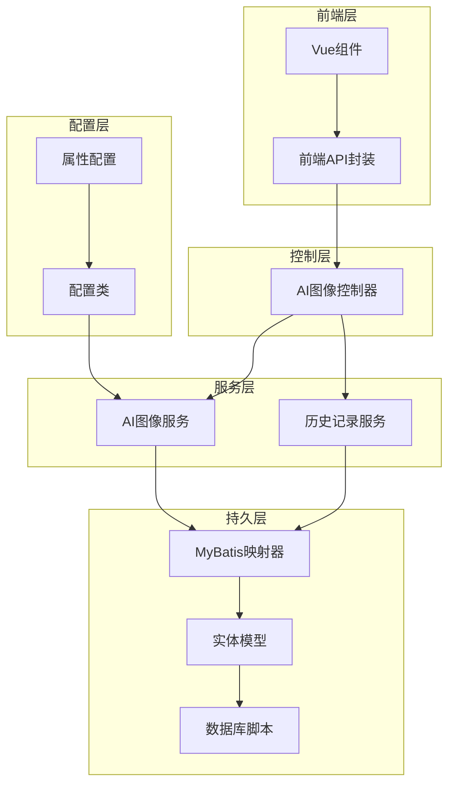
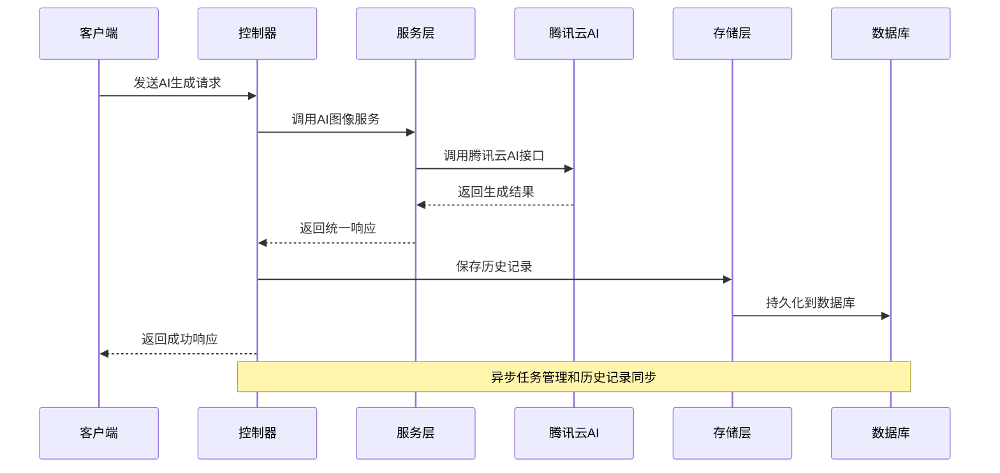
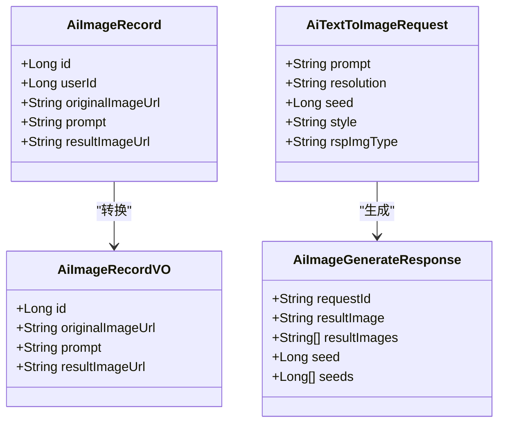
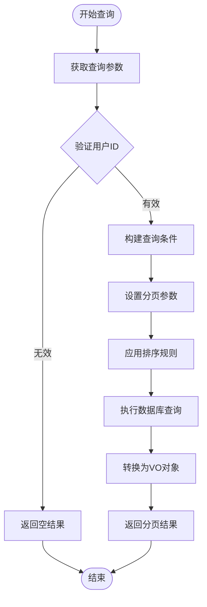
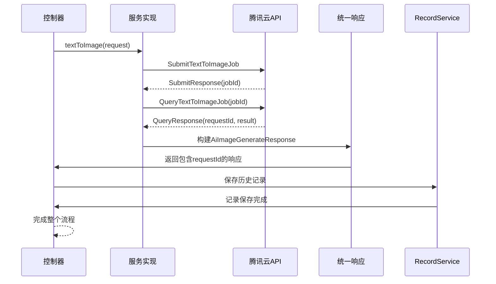
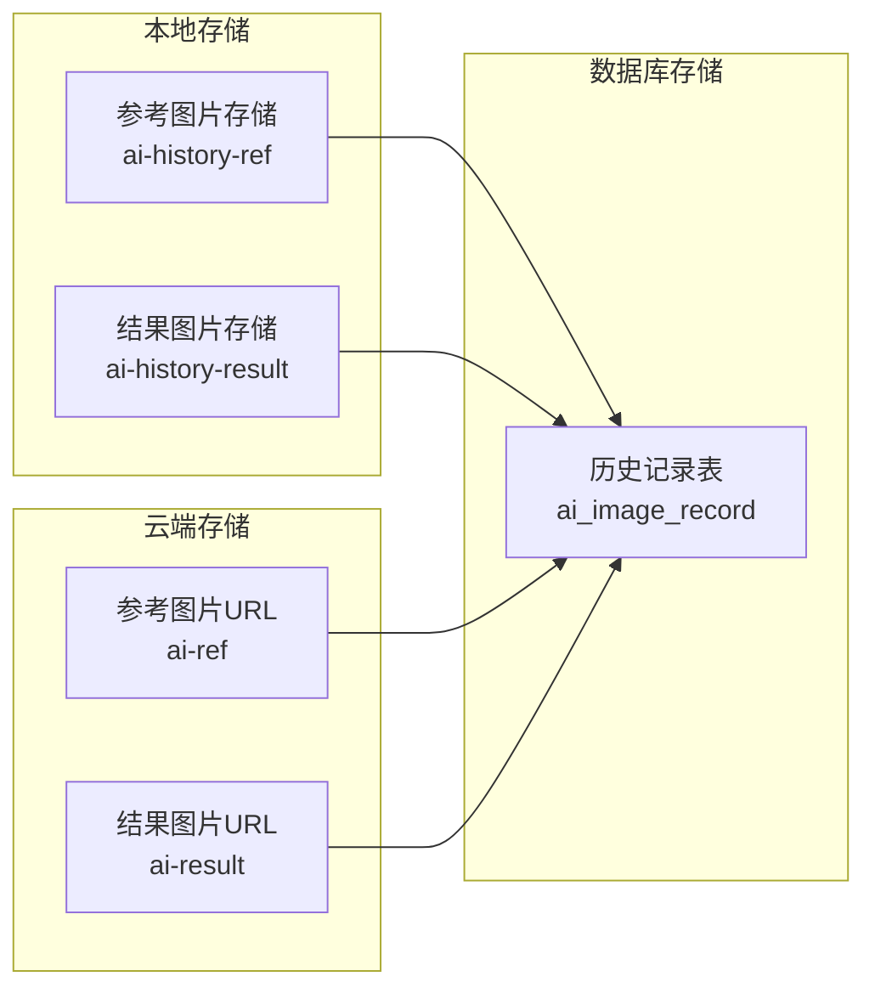
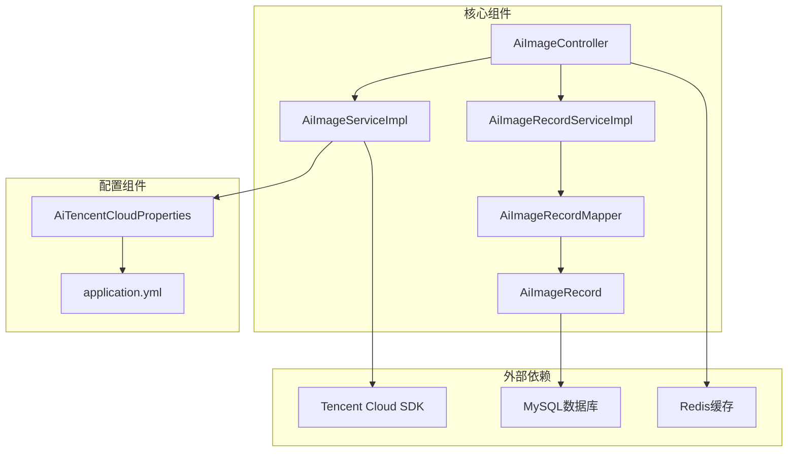
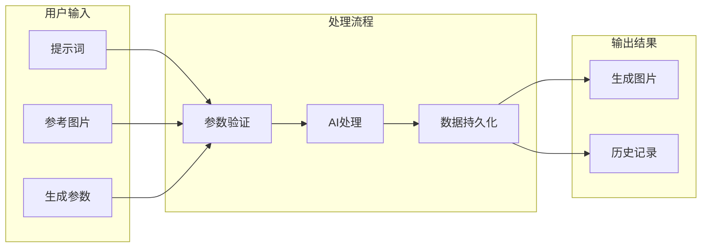

# AI智能定制数据模型

<cite>
**本文档引用的文件**
- [AiImageRecord.java](file://backend/src/main/java/com/heritage/entity/AiImageRecord.java)
- [AiImageRecordVO.java](file://backend/src/main/java/com/heritage/dto/AiImageRecordVO.java)
- [AiTextToImageRequest.java](file://backend/src/main/java/com/heritage/dto/AiTextToImageRequest.java)
- [AiImageGenerateResponse.java](file://backend/src/main/java/com/heritage/dto/AiImageGenerateResponse.java)
- [AiImageController.java](file://backend/src/main/java/com/heritage/controller/AiImageController.java)
- [AiImageService.java](file://backend/src/main/java/com/heritage/service/AiImageService.java)
- [AiImageServiceImpl.java](file://backend/src/main/java/com/heritage/service/impl/AiImageServiceImpl.java)
- [AiImageRecordService.java](file://backend/src/main/java/com/heritage/service/AiImageRecordService.java)
- [AiImageRecordServiceImpl.java](file://backend/src/main/java/com/heritage/service/impl/AiImageRecordServiceImpl.java)
- [AiImageRecordMapper.java](file://backend/src/main/java/com/heritage/mapper/AiImageRecordMapper.java)
- [ai_image_record.sql](file://backend/src/main/resources/sql/ai_image_record.sql)
- [AiTencentCloudProperties.java](file://backend/src/main/java/com/heritage/config/AiTencentCloudProperties.java)
- [application.yml](file://backend/src/main/resources/application.yml)
- [Result.java](file://backend/src/main/java/com/heritage/common/Result.java)
- [BusinessException.java](file://backend/src/main/java/com/heritage/common/BusinessException.java)
- [GlobalExceptionHandler.java](file://backend/src/main/java/com/heritage/common/GlobalExceptionHandler.java)
- [aiImage.js](file://frontend/src/api/aiImage.js)
</cite>

## 目录
1. [简介](#简介)
2. [项目结构](#项目结构)
3. [核心组件](#核心组件)
4. [架构概览](#架构概览)
5. [详细组件分析](#详细组件分析)
6. [依赖关系分析](#依赖关系分析)
7. [性能考虑](#性能考虑)
8. [故障排除指南](#故障排除指南)
9. [结论](#结论)
10. [附录](#附录)

## 简介
本文件为AI智能定制数据模型的技术文档，专注于AI图像生成记录(AiImageRecord)实体的设计与实现。文档详细说明了生成参数、提示词、生成结果、用户关联、时间戳等字段的设计理念，解释了AI定制的历史记录管理机制，包括记录查询、删除策略、存储优化。同时阐述了AI服务调用的追踪机制，包括请求ID、响应状态、错误日志、耗时统计。提供了AI数据的存储策略、清理规则和性能监控方案，并包含AI定制流程中的数据流转、缓存机制和质量控制措施。

## 项目结构
该项目采用标准的Spring Boot三层架构设计，主要包含以下层次：



**图表来源**
- [AiImageController.java](file://backend/src/main/java/com/heritage/controller/AiImageController.java#L1-L320)
- [AiImageServiceImpl.java](file://backend/src/main/java/com/heritage/service/impl/AiImageServiceImpl.java#L1-L430)
- [AiImageRecordServiceImpl.java](file://backend/src/main/java/com/heritage/service/impl/AiImageRecordServiceImpl.java#L1-L65)

**章节来源**
- [AiImageController.java](file://backend/src/main/java/com/heritage/controller/AiImageController.java#L1-L320)
- [application.yml](file://backend/src/main/resources/application.yml#L1-L63)

## 核心组件
AI智能定制系统的核心组件围绕AI图像生成和历史记录管理展开，主要包括：

### 数据模型层
- **AiImageRecord实体**：存储AI图像生成的完整历史记录
- **AiImageRecordVO视图对象**：用于历史记录的对外展示
- **AiTextToImageRequest请求对象**：文生图的输入参数封装
- **AiImageGenerateResponse响应对象**：AI服务的统一响应格式

### 服务层
- **AiImageService接口**：定义AI图像生成功能的服务契约
- **AiImageRecordService接口**：定义历史记录管理的服务契约
- **AiImageServiceImpl实现类**：腾讯云AI服务的具体实现
- **AiImageRecordServiceImpl实现类**：历史记录服务的具体实现

### 控制层
- **AiImageController控制器**：AI图像功能的HTTP接口入口

**章节来源**
- [AiImageRecord.java](file://backend/src/main/java/com/heritage/entity/AiImageRecord.java#L1-L29)
- [AiImageRecordVO.java](file://backend/src/main/java/com/heritage/dto/AiImageRecordVO.java#L1-L17)
- [AiTextToImageRequest.java](file://backend/src/main/java/com/heritage/dto/AiTextToImageRequest.java#L1-L21)
- [AiImageGenerateResponse.java](file://backend/src/main/java/com/heritage/dto/AiImageGenerateResponse.java#L1-L20)

## 架构概览
系统采用分层架构设计，实现了清晰的关注点分离：



**图表来源**
- [AiImageController.java](file://backend/src/main/java/com/heritage/controller/AiImageController.java#L58-L97)
- [AiImageServiceImpl.java](file://backend/src/main/java/com/heritage/service/impl/AiImageServiceImpl.java#L52-L91)
- [AiImageRecordServiceImpl.java](file://backend/src/main/java/com/heritage/service/impl/AiImageRecordServiceImpl.java#L20-L38)

系统架构特点：
- **分层清晰**：表现层、业务层、数据访问层职责明确
- **接口隔离**：通过接口定义服务契约，便于扩展和测试
- **异步处理**：AI生成任务采用异步轮询机制
- **数据持久化**：完整的数据模型设计支持历史记录管理

## 详细组件分析

### AI图像记录实体设计

#### 数据模型结构
AiImageRecord实体是整个AI定制系统的核心数据载体，采用简洁而实用的设计理念：



**图表来源**
- [AiImageRecord.java](file://backend/src/main/java/com/heritage/entity/AiImageRecord.java#L11-L27)
- [AiImageRecordVO.java](file://backend/src/main/java/com/heritage/dto/AiImageRecordVO.java#L6-L15)
- [AiTextToImageRequest.java](file://backend/src/main/java/com/heritage/dto/AiTextToImageRequest.java#L7-L19)
- [AiImageGenerateResponse.java](file://backend/src/main/java/com/heritage/dto/AiImageGenerateResponse.java#L8-L19)

#### 字段设计分析
系统在字段设计上体现了以下考虑：

**用户关联字段** (`userId`)
- 建立用户与生成记录的一对多关系
- 支持用户历史记录的独立查询和管理
- 为后续的用户行为分析提供数据基础

**生成参数字段**
- `originalImageUrl`：存储原始参考图片的URL，支持图生图场景
- `prompt`：存储生成提示词，支持文生图和图生图场景
- `resultImageUrl`：存储最终生成图片的URL

**索引策略**
数据库层面建立了`idx_user_id`索引，优化用户维度的查询性能。

**章节来源**
- [AiImageRecord.java](file://backend/src/main/java/com/heritage/entity/AiImageRecord.java#L1-L29)
- [ai_image_record.sql](file://backend/src/main/resources/sql/ai_image_record.sql#L1-L10)

### 历史记录管理机制

#### 查询机制
历史记录查询采用分页设计，支持用户维度的数据检索：



**图表来源**
- [AiImageRecordServiceImpl.java](file://backend/src/main/java/com/heritage/service/impl/AiImageRecordServiceImpl.java#L40-L62)

#### 存储优化策略
系统采用了多层次的存储优化策略：

1. **URL长度限制**：所有存储的URL长度不超过255字符
2. **批量插入优化**：单次生成可能产生多张图片，系统采用批量插入减少数据库交互
3. **索引优化**：针对用户ID建立索引，优化查询性能

**章节来源**
- [AiImageRecordServiceImpl.java](file://backend/src/main/java/com/heritage/service/impl/AiImageRecordServiceImpl.java#L1-L65)

### AI服务调用追踪机制

#### 请求ID追踪
系统在AI服务调用中实现了完整的请求追踪机制：



**图表来源**
- [AiImageServiceImpl.java](file://backend/src/main/java/com/heritage/service/impl/AiImageServiceImpl.java#L76-L90)
- [AiImageGenerateResponse.java](file://backend/src/main/java/com/heritage/dto/AiImageGenerateResponse.java#L10)

#### 错误日志和状态管理
系统实现了完善的错误处理和状态追踪：

1. **异常分类处理**：区分业务异常、参数异常、系统异常
2. **错误码标准化**：使用统一的错误码和消息格式
3. **日志记录**：详细的错误日志便于问题排查

**章节来源**
- [AiImageServiceImpl.java](file://backend/src/main/java/com/heritage/service/impl/AiImageServiceImpl.java#L380-L418)
- [GlobalExceptionHandler.java](file://backend/src/main/java/com/heritage/common/GlobalExceptionHandler.java#L1-L62)

### 数据存储策略和清理规则

#### 存储架构
系统采用混合存储策略：



**图表来源**
- [AiImageController.java](file://backend/src/main/java/com/heritage/controller/AiImageController.java#L134-L159)
- [AiImageServiceImpl.java](file://backend/src/main/java/com/heritage/service/impl/AiImageServiceImpl.java#L332-L361)

#### 清理规则
系统制定了合理的数据清理策略：

1. **临时文件清理**：参考图片和结果图片在生成后进行本地存储
2. **历史记录保留**：用户历史记录永久保存，支持查询和回溯
3. **存储空间管理**：通过URL引用避免重复存储大文件

**章节来源**
- [AiImageController.java](file://backend/src/main/java/com/heritage/controller/AiImageController.java#L161-L197)
- [AiImageServiceImpl.java](file://backend/src/main/java/com/heritage/service/impl/AiImageServiceImpl.java#L332-L378)

### 性能监控方案

#### 超时控制
系统实现了多层次的超时控制机制：

| 组件 | 超时设置 | 说明 |
|------|----------|------|
| HTTP客户端 | 180秒 | 腾讯云API调用超时 |
| 任务轮询 | 最长600秒 | 文生图任务完成等待 |
| 文件上传 | 10MB限制 | 防止大文件占用资源 |

#### 质量控制措施
1. **参数验证**：严格的输入参数验证和默认值处理
2. **格式标准化**：统一的响应格式和错误处理
3. **资源管理**：及时释放临时文件和网络连接

**章节来源**
- [AiImageServiceImpl.java](file://backend/src/main/java/com/heritage/service/impl/AiImageServiceImpl.java#L42-L47)
- [application.yml](file://backend/src/main/resources/application.yml#L12-L15)

## 依赖关系分析

### 组件依赖图
系统各组件之间存在清晰的依赖关系：



**图表来源**
- [AiImageController.java](file://backend/src/main/java/com/heritage/controller/AiImageController.java#L51-L53)
- [AiImageServiceImpl.java](file://backend/src/main/java/com/heritage/service/impl/AiImageServiceImpl.java#L49-L50)
- [AiTencentCloudProperties.java](file://backend/src/main/java/com/heritage/config/AiTencentCloudProperties.java#L9-L19)

### 数据流分析
AI定制流程中的数据流转体现了高效的设计：



**图表来源**
- [AiImageController.java](file://backend/src/main/java/com/heritage/controller/AiImageController.java#L58-L97)
- [AiImageServiceImpl.java](file://backend/src/main/java/com/heritage/service/impl/AiImageServiceImpl.java#L93-L206)

**章节来源**
- [AiImageController.java](file://backend/src/main/java/com/heritage/controller/AiImageController.java#L1-L320)
- [AiImageServiceImpl.java](file://backend/src/main/java/com/heritage/service/impl/AiImageServiceImpl.java#L1-L430)

## 性能考虑
基于系统实现，以下是关键的性能优化建议：

### 存储性能优化
1. **索引优化**：确保`user_id`索引的有效性
2. **批量操作**：合理使用批量插入减少数据库压力
3. **缓存策略**：利用Redis缓存热点数据

### 网络性能优化
1. **连接池管理**：合理配置HTTP客户端连接池
2. **超时设置**：根据实际需求调整超时参数
3. **重试机制**：实现智能的失败重试策略

### 处理性能优化
1. **异步处理**：继续使用异步任务处理长时间运行的操作
2. **资源管理**：及时释放临时文件和网络连接
3. **内存管理**：避免大文件的重复加载

## 故障排除指南

### 常见问题诊断
系统提供了完善的异常处理机制：

#### 参数验证错误
- **症状**：参数校验失败导致的业务异常
- **原因**：输入参数不符合业务规则
- **解决方案**：检查前端传参和后端验证逻辑

#### 服务调用异常
- **症状**：腾讯云API调用失败
- **原因**：网络问题、认证失败、配额限制
- **解决方案**：检查配置文件和网络连接

#### 存储异常
- **症状**：文件保存失败
- **原因**：磁盘空间不足、权限问题
- **解决方案**：检查存储路径和权限设置

**章节来源**
- [GlobalExceptionHandler.java](file://backend/src/main/java/com/heritage/common/GlobalExceptionHandler.java#L1-L62)
- [BusinessException.java](file://backend/src/main/java/com/heritage/common/BusinessException.java#L1-L20)

### 日志分析
系统采用结构化的日志记录：

1. **错误级别**：区分不同严重程度的日志
2. **上下文信息**：包含请求ID和用户信息
3. **性能指标**：记录关键操作的耗时

## 结论
AI智能定制数据模型展现了良好的工程实践，具有以下特点：

### 设计优势
1. **数据模型简洁**：核心字段设计合理，满足业务需求
2. **架构清晰**：分层架构便于维护和扩展
3. **异常处理完善**：全面的错误处理和日志记录
4. **性能考虑周全**：多层面的性能优化策略

### 技术亮点
1. **异步任务处理**：高效的AI生成任务管理
2. **混合存储策略**：平衡成本和性能的存储方案
3. **统一响应格式**：规范化的API设计
4. **安全机制完善**：基于JWT的用户认证和授权

### 改进建议
1. **监控告警**：增加更细粒度的性能监控
2. **缓存优化**：引入Redis缓存提升查询性能
3. **分布式部署**：支持水平扩展的架构设计
4. **数据备份**：建立完善的数据备份和恢复机制

该系统为非遗智能定制业务提供了坚实的技术基础，通过持续的优化和完善，能够更好地支撑业务发展和用户体验提升。

## 附录

### API接口规范
系统提供RESTful API接口，支持完整的AI图像生成功能：

| 接口 | 方法 | 描述 | 请求参数 | 响应数据 |
|------|------|------|----------|----------|
| /api/customize/ai-image/text-to-image | POST | 文生图 | AiTextToImageRequest | AiImageGenerateResponse |
| /api/customize/ai-image/image-to-image | POST | 图生图 | 文件+参数 | AiImageGenerateResponse |
| /api/customize/ai-image/records | GET | 历史记录查询 | 分页参数 | Page<AiImageRecordVO> |

### 配置参数说明
系统支持多种配置参数，可通过application.yml进行配置：

| 参数名 | 默认值 | 说明 |
|--------|--------|------|
| file.upload.path | uploads | 文件上传根目录 |
| file.public-base-url | 空 | 公网访问的基础URL |
| ai.tencentcloud.secret-id | 空 | 腾讯云API密钥ID |
| ai.tencentcloud.secret-key | 空 | 腾讯云API密钥 |
| jwt.secret | 固定值 | JWT签名密钥 |
| jwt.expiration | 604800000 | JWT过期时间(毫秒) |

### 数据库设计
AI图像记录表采用简洁的设计，支持高效的查询和存储：

```sql
CREATE TABLE IF NOT EXISTS `ai_image_record` (
    `id` BIGINT NOT NULL AUTO_INCREMENT,
    `user_id` BIGINT NOT NULL,
    `original_image_url` TEXT DEFAULT NULL,
    `result_image_url` TEXT NOT NULL,
    `prompt` VARCHAR(500) DEFAULT NULL,
    PRIMARY KEY (`id`),
    KEY `idx_user_id` (`user_id`)
) ENGINE=InnoDB DEFAULT CHARSET=utf8mb4;
```