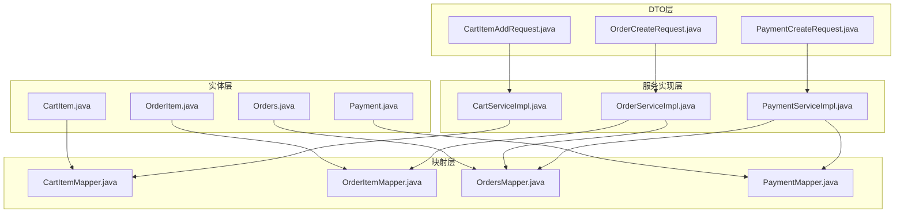
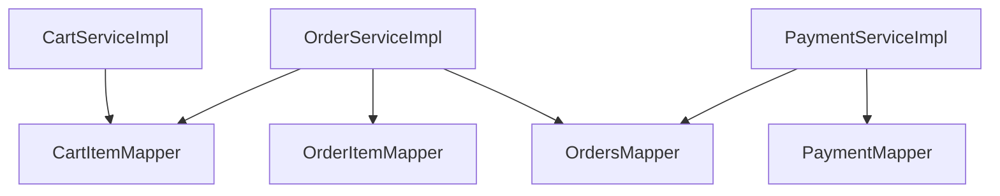
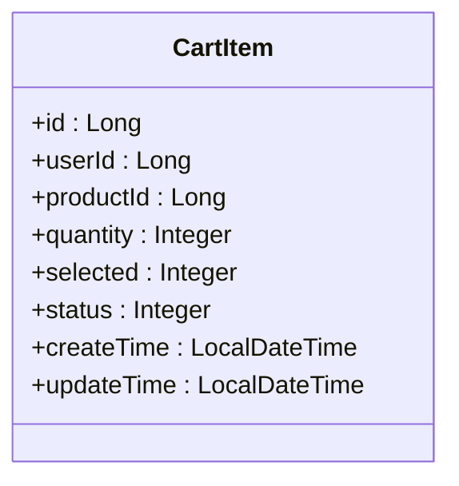
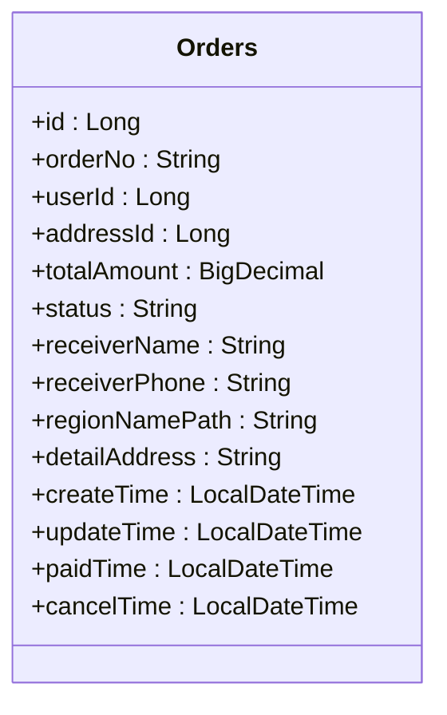
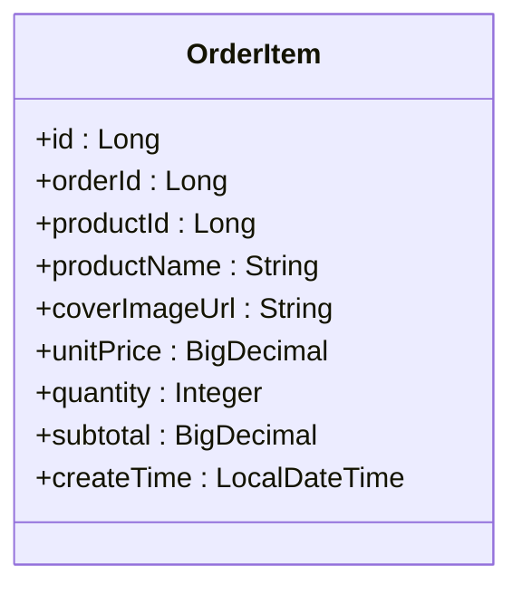
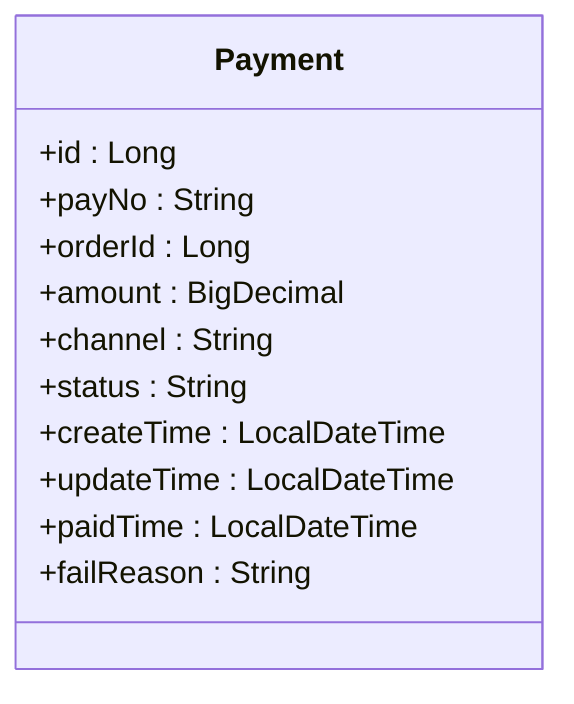
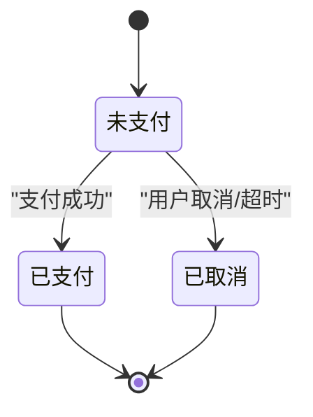
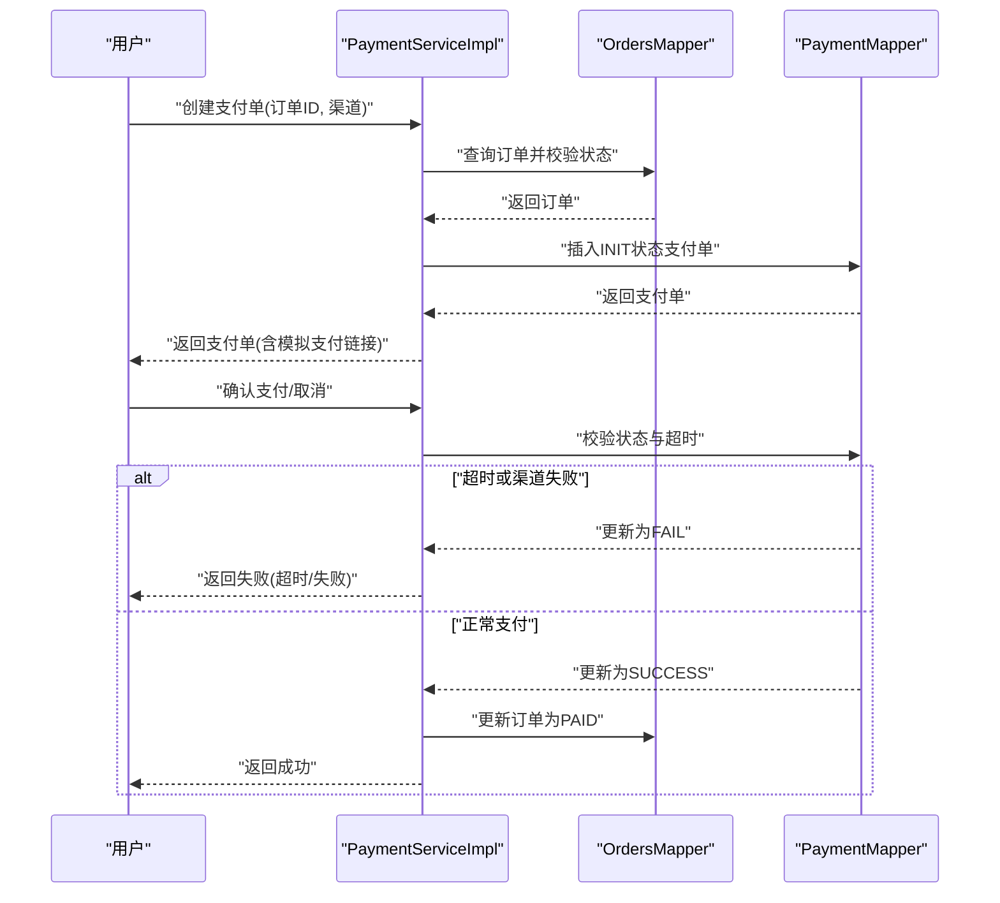
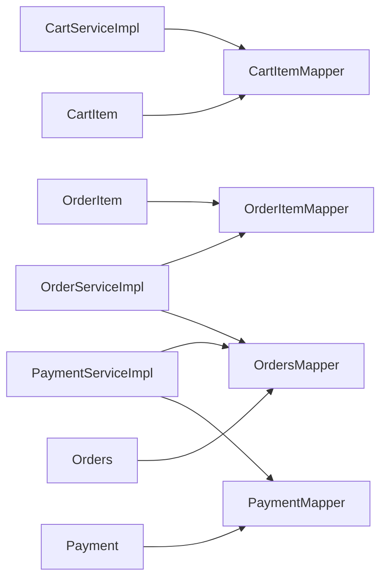

# 交易数据模型

<cite>
**本文引用的文件**
- [CartItem.java](file://backend/src/main/java/com/heritage/entity/CartItem.java)
- [OrderItem.java](file://backend/src/main/java/com/heritage/entity/OrderItem.java)
- [Orders.java](file://backend/src/main/java/com/heritage/entity/Orders.java)
- [Payment.java](file://backend/src/main/java/com/heritage/entity/Payment.java)
- [CartItemMapper.java](file://backend/src/main/java/com/heritage/mapper/CartItemMapper.java)
- [OrderItemMapper.java](file://backend/src/main/java/com/heritage/mapper/OrderItemMapper.java)
- [OrdersMapper.java](file://backend/src/main/java/com/heritage/mapper/OrdersMapper.java)
- [PaymentMapper.java](file://backend/src/main/java/com/heritage/mapper/PaymentMapper.java)
- [CartServiceImpl.java](file://backend/src/main/java/com/heritage/service/impl/CartServiceImpl.java)
- [OrderServiceImpl.java](file://backend/src/main/java/com/heritage/service/impl/OrderServiceImpl.java)
- [PaymentServiceImpl.java](file://backend/src/main/java/com/heritage/service/impl/PaymentServiceImpl.java)
- [CartItemAddRequest.java](file://backend/src/main/java/com/heritage/dto/CartItemAddRequest.java)
- [OrderCreateRequest.java](file://backend/src/main/java/com/heritage/dto/OrderCreateRequest.java)
- [PaymentCreateRequest.java](file://backend/src/main/java/com/heritage/dto/PaymentCreateRequest.java)
- [BusinessException.java](file://backend/src/main/java/com/heritage/common/BusinessException.java)
</cite>

## 目录
1. [引言](#引言)
2. [项目结构](#项目结构)
3. [核心组件](#核心组件)
4. [架构概览](#架构概览)
5. [详细组件分析](#详细组件分析)
6. [依赖分析](#依赖分析)
7. [性能考虑](#性能考虑)
8. [故障排查指南](#故障排查指南)
9. [结论](#结论)

## 引言
本文件系统性梳理交易数据模型，围绕购物车(CartItem)、订单(Orders)、订单项(OrderItem)与支付(Payment)四大核心实体，阐明其设计目标、字段语义、业务规则与服务层实现要点，并给出状态流转图、支付流程设计与事务一致性保障机制，帮助开发者与产品人员快速理解与使用。

## 项目结构
交易相关代码采用分层架构：实体(entity)定义数据模型；映射器(mapper)负责持久化；服务实现(service impl)承载业务逻辑；DTO封装接口入参与出参；控制器(controller)对外暴露REST接口。交易模块的关键文件如下：

图表来源
- [CartItem.java](file://backend/src/main/java/com/heritage/entity/CartItem.java#L1-L39)
- [OrderItem.java](file://backend/src/main/java/com/heritage/entity/OrderItem.java#L1-L43)
- [Orders.java](file://backend/src/main/java/com/heritage/entity/Orders.java#L1-L58)
- [Payment.java](file://backend/src/main/java/com/heritage/entity/Payment.java#L1-L46)
- [CartItemMapper.java](file://backend/src/main/java/com/heritage/mapper/CartItemMapper.java#L1-L10)
- [OrderItemMapper.java](file://backend/src/main/java/com/heritage/mapper/OrderItemMapper.java#L1-L10)
- [OrdersMapper.java](file://backend/src/main/java/com/heritage/mapper/OrdersMapper.java#L1-L10)
- [PaymentMapper.java](file://backend/src/main/java/com/heritage/mapper/PaymentMapper.java#L1-L10)
- [CartServiceImpl.java](file://backend/src/main/java/com/heritage/service/impl/CartServiceImpl.java#L1-L200)
- [OrderServiceImpl.java](file://backend/src/main/java/com/heritage/service/impl/OrderServiceImpl.java#L1-L200)
- [PaymentServiceImpl.java](file://backend/src/main/java/com/heritage/service/impl/PaymentServiceImpl.java#L1-L200)
- [CartItemAddRequest.java](file://backend/src/main/java/com/heritage/dto/CartItemAddRequest.java#L1-L16)
- [OrderCreateRequest.java](file://backend/src/main/java/com/heritage/dto/OrderCreateRequest.java#L1-L12)
- [PaymentCreateRequest.java](file://backend/src/main/java/com/heritage/dto/PaymentCreateRequest.java#L1-L14)

章节来源
- [CartItem.java](file://backend/src/main/java/com/heritage/entity/CartItem.java#L1-L39)
- [OrderItem.java](file://backend/src/main/java/com/heritage/entity/OrderItem.java#L1-L43)
- [Orders.java](file://backend/src/main/java/com/heritage/entity/Orders.java#L1-L58)
- [Payment.java](file://backend/src/main/java/com/heritage/entity/Payment.java#L1-L46)
- [CartItemMapper.java](file://backend/src/main/java/com/heritage/mapper/CartItemMapper.java#L1-L10)
- [OrderItemMapper.java](file://backend/src/main/java/com/heritage/mapper/OrderItemMapper.java#L1-L10)
- [OrdersMapper.java](file://backend/src/main/java/com/heritage/mapper/OrdersMapper.java#L1-L10)
- [PaymentMapper.java](file://backend/src/main/java/com/heritage/mapper/PaymentMapper.java#L1-L10)
- [CartServiceImpl.java](file://backend/src/main/java/com/heritage/service/impl/CartServiceImpl.java#L1-L200)
- [OrderServiceImpl.java](file://backend/src/main/java/com/heritage/service/impl/OrderServiceImpl.java#L1-L200)
- [PaymentServiceImpl.java](file://backend/src/main/java/com/heritage/service/impl/PaymentServiceImpl.java#L1-L200)
- [CartItemAddRequest.java](file://backend/src/main/java/com/heritage/dto/CartItemAddRequest.java#L1-L16)
- [OrderCreateRequest.java](file://backend/src/main/java/com/heritage/dto/OrderCreateRequest.java#L1-L12)
- [PaymentCreateRequest.java](file://backend/src/main/java/com/heritage/dto/PaymentCreateRequest.java#L1-L14)

## 核心组件
- 购物车(CartItem)
  - 字段要点：用户标识、商品标识、数量、选中状态、状态、时间戳
  - 关联关系：一对一关联用户与商品；与订单项通过订单ID间接关联
  - 业务要点：新增、修改数量、切换选中、删除（软删除）
- 订单(Orders)
  - 字段要点：订单号、用户ID、地址ID、总金额、状态、收件人信息、时间戳
  - 关联关系：一对多关联订单项；与支付一对一关联
  - 业务要点：从购物车批量生成订单、分页查询、详情加载、取消
- 订单项(OrderItem)
  - 字段要点：订单ID、商品快照（名称、封面）、单价、数量、小计
  - 关联关系：多对一关联订单；与商品快照保持一致
  - 业务要点：由购物车聚合生成，用于订单详情展示与统计
- 支付(Payment)
  - 字段要点：支付流水号、订单ID、金额、渠道、状态、时间戳、失败原因
  - 关联关系：一对一关联订单
  - 业务要点：创建支付单、模拟支付确认/取消、超时与渠道失败处理

章节来源
- [CartItem.java](file://backend/src/main/java/com/heritage/entity/CartItem.java#L1-L39)
- [OrderItem.java](file://backend/src/main/java/com/heritage/entity/OrderItem.java#L1-L43)
- [Orders.java](file://backend/src/main/java/com/heritage/entity/Orders.java#L1-L58)
- [Payment.java](file://backend/src/main/java/com/heritage/entity/Payment.java#L1-L46)

## 架构概览
交易模块遵循“请求-服务-映射-实体”的分层设计，所有关键业务操作均在服务层以事务包裹，确保一致性。

图表来源
- [CartServiceImpl.java](file://backend/src/main/java/com/heritage/service/impl/CartServiceImpl.java#L1-L200)
- [OrderServiceImpl.java](file://backend/src/main/java/com/heritage/service/impl/OrderServiceImpl.java#L1-L200)
- [PaymentServiceImpl.java](file://backend/src/main/java/com/heritage/service/impl/PaymentServiceImpl.java#L1-L200)
- [CartItemMapper.java](file://backend/src/main/java/com/heritage/mapper/CartItemMapper.java#L1-L10)
- [OrdersMapper.java](file://backend/src/main/java/com/heritage/mapper/OrdersMapper.java#L1-L10)
- [OrderItemMapper.java](file://backend/src/main/java/com/heritage/mapper/OrderItemMapper.java#L1-L10)
- [PaymentMapper.java](file://backend/src/main/java/com/heritage/mapper/PaymentMapper.java#L1-L10)

## 详细组件分析

### 购物车模型(CartItem)设计
- 用户关联
  - 通过用户ID字段与用户建立业务关联，服务层在操作前校验登录态
- 商品关联
  - 通过商品ID字段与商品建立业务关联，新增时会校验商品有效性与上架状态
- 数量管理
  - 新增时支持设置数量，默认为1；更新数量时进行合法性校验
- 选中状态
  - 选中状态仅允许0/1值，用于结算筛选
- 状态与生命周期
  - 状态=1表示有效，=0表示失效（如下单后清空选中与状态）

图表来源
- [CartItem.java](file://backend/src/main/java/com/heritage/entity/CartItem.java#L1-L39)

章节来源
- [CartItem.java](file://backend/src/main/java/com/heritage/entity/CartItem.java#L1-L39)
- [CartServiceImpl.java](file://backend/src/main/java/com/heritage/service/impl/CartServiceImpl.java#L38-L90)
- [CartServiceImpl.java](file://backend/src/main/java/com/heritage/service/impl/CartServiceImpl.java#L138-L173)
- [CartItemAddRequest.java](file://backend/src/main/java/com/heritage/dto/CartItemAddRequest.java#L1-L16)

### 订单实体(Orders)结构
- 订单号生成
  - 服务层在创建订单时生成唯一订单号，确保幂等与可追溯
- 用户信息与地址
  - 绑定用户ID与地址ID；下单时校验地址归属与有效性
- 订单状态
  - 初始状态为未支付；支付成功后更新为已支付；支持取消
- 总金额计算
  - 基于订单项小计累加得到，避免重复计算与精度丢失

图表来源
- [Orders.java](file://backend/src/main/java/com/heritage/entity/Orders.java#L1-L58)

章节来源
- [Orders.java](file://backend/src/main/java/com/heritage/entity/Orders.java#L1-L58)
- [OrderServiceImpl.java](file://backend/src/main/java/com/heritage/service/impl/OrderServiceImpl.java#L52-L146)
- [OrderCreateRequest.java](file://backend/src/main/java/com/heritage/dto/OrderCreateRequest.java#L1-L12)

### 订单项模型(OrderItem)设计
- 商品快照
  - 记录下单时的商品名称与封面URL，保证历史一致性
- 数量与单价
  - 与购物车下单时一致，单价取自下单时刻商品价格
- 小计金额
  - 单价×数量，用于订单总金额汇总

图表来源
- [OrderItem.java](file://backend/src/main/java/com/heritage/entity/OrderItem.java#L1-L43)

章节来源
- [OrderItem.java](file://backend/src/main/java/com/heritage/entity/OrderItem.java#L1-L43)
- [OrderServiceImpl.java](file://backend/src/main/java/com/heritage/service/impl/OrderServiceImpl.java#L88-L117)

### 支付模型(Payment)结构
- 支付方式
  - 渠道字段支持标准化处理，便于后续接入真实支付通道
- 支付状态
  - 初始化、成功、失败三态；失败原因可记录超时或渠道失败
- 支付流水号
  - 服务层生成支付流水号，确保可追踪
- 回调处理
  - 当前实现提供模拟支付流程，演示超时与失败场景处理

图表来源
- [Payment.java](file://backend/src/main/java/com/heritage/entity/Payment.java#L1-L46)

章节来源
- [Payment.java](file://backend/src/main/java/com/heritage/entity/Payment.java#L1-L46)
- [PaymentServiceImpl.java](file://backend/src/main/java/com/heritage/service/impl/PaymentServiceImpl.java#L34-L73)
- [PaymentCreateRequest.java](file://backend/src/main/java/com/heritage/dto/PaymentCreateRequest.java#L1-L14)

### 订单状态流转图

图表来源
- [OrderServiceImpl.java](file://backend/src/main/java/com/heritage/service/impl/OrderServiceImpl.java#L194-L200)
- [PaymentServiceImpl.java](file://backend/src/main/java/com/heritage/service/impl/PaymentServiceImpl.java#L120-L162)

### 支付流程设计

图表来源
- [PaymentServiceImpl.java](file://backend/src/main/java/com/heritage/service/impl/PaymentServiceImpl.java#L34-L162)
- [OrdersMapper.java](file://backend/src/main/java/com/heritage/mapper/OrdersMapper.java#L1-L10)
- [PaymentMapper.java](file://backend/src/main/java/com/heritage/mapper/PaymentMapper.java#L1-L10)

### 事务一致性保证机制
- 购物车到订单
  - 在创建订单的服务方法中开启事务：写入订单、批量写入订单项、批量更新购物车状态
- 订单到支付
  - 创建支付单与更新订单状态在同一事务内完成，避免中间态不一致
- 幂等与重试
  - 支付单创建时按订单与初始化状态查询是否存在，避免重复创建

章节来源
- [OrderServiceImpl.java](file://backend/src/main/java/com/heritage/service/impl/OrderServiceImpl.java#L52-L146)
- [PaymentServiceImpl.java](file://backend/src/main/java/com/heritage/service/impl/PaymentServiceImpl.java#L34-L73)
- [PaymentServiceImpl.java](file://backend/src/main/java/com/heritage/service/impl/PaymentServiceImpl.java#L96-L162)

### 并发控制、库存锁定与订单超时
- 并发控制
  - 服务层方法使用@Transactional标注，结合数据库事务隔离级别与锁机制，保证读写一致性
- 库存锁定策略
  - 当前代码未体现库存扣减逻辑；建议在生成订单前对商品库存进行预占（例如新增库存锁定表），在支付成功后转正，在超时/取消后释放
- 订单超时处理
  - 支付确认阶段引入超时阈值，超时则标记支付失败；订单层面可在业务侧增加定时任务扫描未支付订单并自动取消

章节来源
- [CartServiceImpl.java](file://backend/src/main/java/com/heritage/service/impl/CartServiceImpl.java#L38-L90)
- [OrderServiceImpl.java](file://backend/src/main/java/com/heritage/service/impl/OrderServiceImpl.java#L52-L146)
- [PaymentServiceImpl.java](file://backend/src/main/java/com/heritage/service/impl/PaymentServiceImpl.java#L31-L32)
- [PaymentServiceImpl.java](file://backend/src/main/java/com/heritage/service/impl/PaymentServiceImpl.java#L120-L133)

### 交易数据与用户、商品、支付系统的集成关系
- 用户(User)
  - 购物车与订单绑定用户ID，支付单通过订单反查用户，确保权限校验
- 商品(Product)
  - 购物车与订单项均引用商品ID；下单时读取商品快照（名称、封面、价格）以保证历史一致性
- 支付系统
  - 当前为模拟支付流程；真实接入时需在支付成功回调中更新支付单与订单状态

章节来源
- [CartServiceImpl.java](file://backend/src/main/java/com/heritage/service/impl/CartServiceImpl.java#L53-L59)
- [OrderServiceImpl.java](file://backend/src/main/java/com/heritage/service/impl/OrderServiceImpl.java#L91-L98)
- [OrderServiceImpl.java](file://backend/src/main/java/com/heritage/service/impl/OrderServiceImpl.java#L110-L116)
- [PaymentServiceImpl.java](file://backend/src/main/java/com/heritage/service/impl/PaymentServiceImpl.java#L97-L100)

## 依赖分析
- 实体与映射器
  - 实体类通过注解映射到数据库表；映射器继承基础接口，提供通用CRUD能力
- 服务实现与实体
  - 服务实现通过注入映射器访问数据库；在业务方法中组合多个实体与DTO
- DTO与服务
  - DTO作为接口契约，约束入参合法性；服务层进行参数校验与业务编排

图表来源
- [CartItem.java](file://backend/src/main/java/com/heritage/entity/CartItem.java#L1-L39)
- [OrderItem.java](file://backend/src/main/java/com/heritage/entity/OrderItem.java#L1-L43)
- [Orders.java](file://backend/src/main/java/com/heritage/entity/Orders.java#L1-L58)
- [Payment.java](file://backend/src/main/java/com/heritage/entity/Payment.java#L1-L46)
- [CartItemMapper.java](file://backend/src/main/java/com/heritage/mapper/CartItemMapper.java#L1-L10)
- [OrderItemMapper.java](file://backend/src/main/java/com/heritage/mapper/OrderItemMapper.java#L1-L10)
- [OrdersMapper.java](file://backend/src/main/java/com/heritage/mapper/OrdersMapper.java#L1-L10)
- [PaymentMapper.java](file://backend/src/main/java/com/heritage/mapper/PaymentMapper.java#L1-L10)
- [CartServiceImpl.java](file://backend/src/main/java/com/heritage/service/impl/CartServiceImpl.java#L1-L200)
- [OrderServiceImpl.java](file://backend/src/main/java/com/heritage/service/impl/OrderServiceImpl.java#L1-L200)
- [PaymentServiceImpl.java](file://backend/src/main/java/com/heritage/service/impl/PaymentServiceImpl.java#L1-L200)

## 性能考虑
- 批量查询与去重
  - 订单与购物车查询时对商品ID进行去重，减少重复查询
- 分页与排序
  - 订单列表分页查询并按创建时间与ID降序，提升检索效率
- 金额计算
  - 使用高精度数值类型进行累计，避免浮点误差

章节来源
- [OrderServiceImpl.java](file://backend/src/main/java/com/heritage/service/impl/OrderServiceImpl.java#L80-L87)
- [OrderServiceImpl.java](file://backend/src/main/java/com/heritage/service/impl/OrderServiceImpl.java#L154-L160)
- [CartServiceImpl.java](file://backend/src/main/java/com/heritage/service/impl/CartServiceImpl.java#L181-L200)

## 故障排查指南
- 通用异常
  - 登录态缺失、无权限、参数非法、资源不存在等错误通过统一异常类抛出
- 常见问题定位
  - 购物车：商品不存在、商品已下架、数量不合法、选中状态非法
  - 订单：地址无效、无选中商品、商品状态异常
  - 支付：订单状态非未支付、支付单已存在、确认超时、渠道失败

章节来源
- [BusinessException.java](file://backend/src/main/java/com/heritage/common/BusinessException.java#L1-L20)
- [CartServiceImpl.java](file://backend/src/main/java/com/heritage/service/impl/CartServiceImpl.java#L40-L59)
- [OrderServiceImpl.java](file://backend/src/main/java/com/heritage/service/impl/OrderServiceImpl.java#L54-L78)
- [PaymentServiceImpl.java](file://backend/src/main/java/com/heritage/service/impl/PaymentServiceImpl.java#L36-L53)
- [PaymentServiceImpl.java](file://backend/src/main/java/com/heritage/service/impl/PaymentServiceImpl.java#L83-L91)
- [PaymentServiceImpl.java](file://backend/src/main/java/com/heritage/service/impl/PaymentServiceImpl.java#L120-L144)

## 结论
交易数据模型以清晰的实体边界与严格的业务校验为基础，配合服务层事务与DTO契约，实现了从购物车到订单再到支付的完整闭环。建议在现有基础上补充库存锁定与订单超时处理，并在支付回调中完善真实支付通道对接，以进一步提升系统的可靠性与一致性。