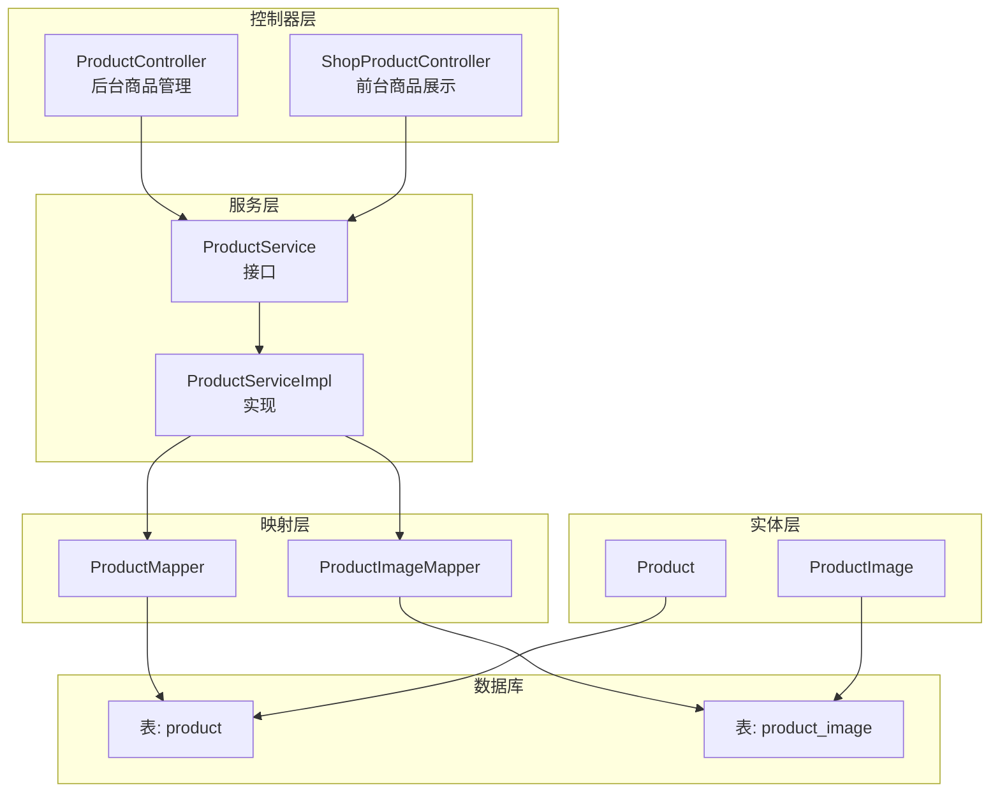
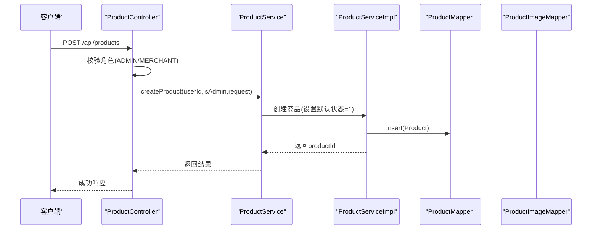
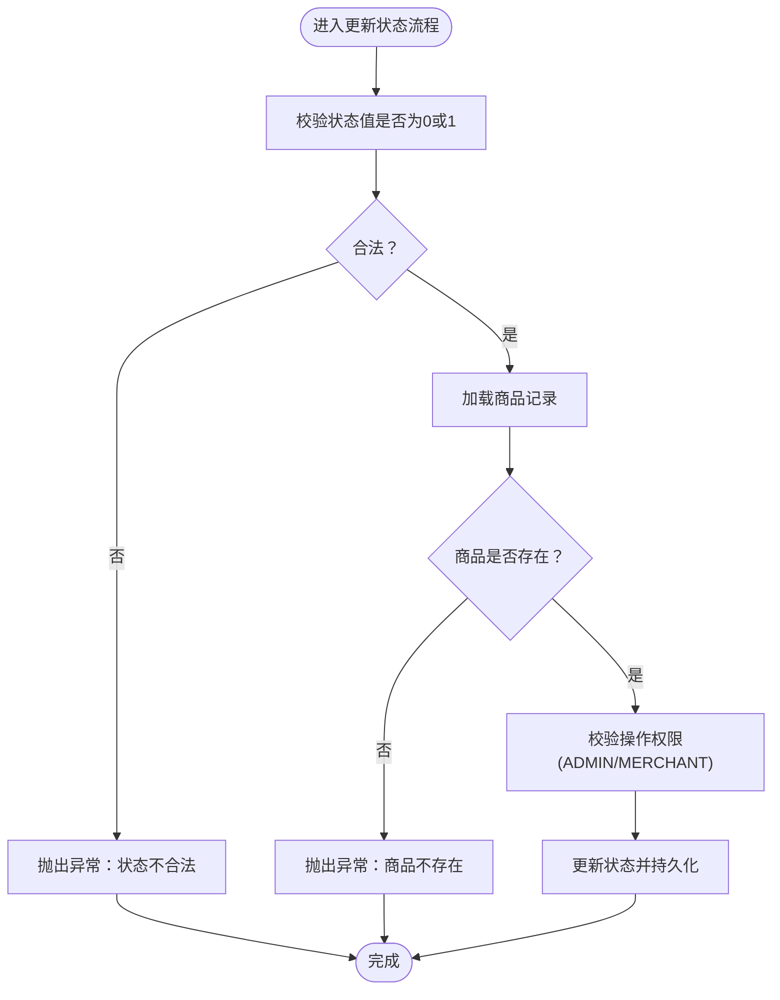
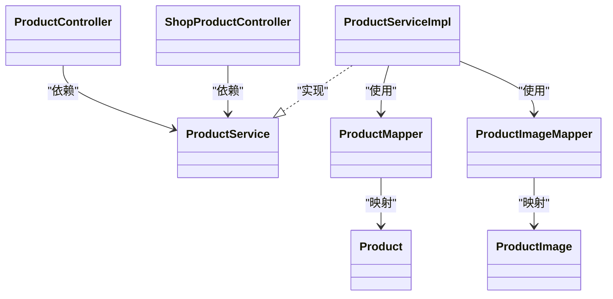

# 商品数据模型

<cite>
**本文引用的文件**
- [Product.java](file://backend/src/main/java/com/heritage/entity/Product.java)
- [ProductImage.java](file://backend/src/main/java/com/heritage/entity/ProductImage.java)
- [ProductMapper.java](file://backend/src/main/java/com/heritage/mapper/ProductMapper.java)
- [ProductImageMapper.java](file://backend/src/main/java/com/heritage/mapper/ProductImageMapper.java)
- [ProductService.java](file://backend/src/main/java/com/heritage/service/ProductService.java)
- [ProductServiceImpl.java](file://backend/src/main/java/com/heritage/service/impl/ProductServiceImpl.java)
- [ProductController.java](file://backend/src/main/java/com/heritage/controller/ProductController.java)
- [ShopProductController.java](file://backend/src/main/java/com/heritage/controller/ShopProductController.java)
- [ProductCreateRequest.java](file://backend/src/main/java/com/heritage/dto/ProductCreateRequest.java)
- [ProductUpdateRequest.java](file://backend/src/main/java/com/heritage/dto/ProductUpdateRequest.java)
- [ProductImageAddRequest.java](file://backend/src/main/java/com/heritage/dto/ProductImageAddRequest.java)
- [ProductImageUpdateRequest.java](file://backend/src/main/java/com/heritage/dto/ProductImageUpdateRequest.java)
- [ProductVO.java](file://backend/src/main/java/com/heritage/dto/ProductVO.java)
- [ProductImageVO.java](file://backend/src/main/java/com/heritage/dto/ProductImageVO.java)
- [product.sql](file://backend/src/main/resources/sql/product.sql)
</cite>

## 目录
1. [简介](#简介)
2. [项目结构](#项目结构)
3. [核心组件](#核心组件)
4. [架构总览](#架构总览)
5. [详细组件分析](#详细组件分析)
6. [依赖分析](#依赖分析)
7. [性能考虑](#性能考虑)
8. [故障排查指南](#故障排查指南)
9. [结论](#结论)
10. [附录](#附录)

## 简介
本文件系统性梳理“商品数据模型”的设计与实现，覆盖以下方面：
- 商品实体(Product)的核心字段与业务语义
- 商品图片(ProductImage)的结构、排序与封面策略
- 商品状态管理机制（上架/下架/销售状态）
- 表结构定义、字段约束、索引设计与查询优化
- 数据访问模式、缓存策略与性能优化
- 商品与用户、订单、非遗项目的关联关系与一致性保障

## 项目结构
围绕商品模块的关键文件组织如下：
- 实体层：Product、ProductImage
- 映射层：ProductMapper、ProductImageMapper
- 服务层：ProductService 及其实现 ProductServiceImpl
- 控制器层：ProductController（后台）、ShopProductController（前台）
- DTO 层：ProductCreateRequest、ProductUpdateRequest、ProductImageAddRequest、ProductImageUpdateRequest、ProductVO、ProductImageVO
- 数据库脚本：product.sql

图表来源
- [ProductController.java](file://backend/src/main/java/com/heritage/controller/ProductController.java#L25-L130)
- [ShopProductController.java](file://backend/src/main/java/com/heritage/controller/ShopProductController.java#L17-L38)
- [ProductService.java](file://backend/src/main/java/com/heritage/service/ProductService.java#L16-L39)
- [ProductServiceImpl.java](file://backend/src/main/java/com/heritage/service/impl/ProductServiceImpl.java#L30-L507)
- [ProductMapper.java](file://backend/src/main/java/com/heritage/mapper/ProductMapper.java#L7-L9)
- [ProductImageMapper.java](file://backend/src/main/java/com/heritage/mapper/ProductImageMapper.java#L7-L9)
- [Product.java](file://backend/src/main/java/com/heritage/entity/Product.java#L12-L48)
- [ProductImage.java](file://backend/src/main/java/com/heritage/entity/ProductImage.java#L11-L32)
- [product.sql](file://backend/src/main/resources/sql/product.sql#L1-L45)

章节来源
- [ProductController.java](file://backend/src/main/java/com/heritage/controller/ProductController.java#L25-L130)
- [ShopProductController.java](file://backend/src/main/java/com/heritage/controller/ShopProductController.java#L17-L38)
- [ProductService.java](file://backend/src/main/java/com/heritage/service/ProductService.java#L16-L39)
- [ProductServiceImpl.java](file://backend/src/main/java/com/heritage/service/impl/ProductServiceImpl.java#L30-L507)
- [ProductMapper.java](file://backend/src/main/java/com/heritage/mapper/ProductMapper.java#L7-L9)
- [ProductImageMapper.java](file://backend/src/main/java/com/heritage/mapper/ProductImageMapper.java#L7-L9)
- [Product.java](file://backend/src/main/java/com/heritage/entity/Product.java#L12-L48)
- [ProductImage.java](file://backend/src/main/java/com/heritage/entity/ProductImage.java#L11-L32)
- [product.sql](file://backend/src/main/resources/sql/product.sql#L1-L45)

## 核心组件
- 商品实体 Product
  - 关键字段：id、name、description、price、merchantId、traceCode、traceQrUrl、model3dUrl、status、createTime、updateTime
  - 字段约束：名称与描述必填；价格非负；默认状态为上架；带时间戳自动维护
- 商品图片实体 ProductImage
  - 关键字段：id、productId、imageUrl、sortOrder、isCover、createTime
  - 字段约束：图片URL必填；排序默认从0递增；isCover仅允许0/1
- 服务接口与实现
  - 支持创建、更新、上下架、删除、分页查询、详情查询、随机推荐、图片管理等
  - 权限控制：管理员与商家角色，非管理员仅能操作自身名下的商品
  - 状态校验：仅允许0/1两个状态
- 控制器
  - 后台管理：/api/products 提供增删改查与图片管理
  - 前台展示：/api/shop/recommend 与 /api/shop/products/{id} 提供推荐与详情

章节来源
- [Product.java](file://backend/src/main/java/com/heritage/entity/Product.java#L12-L48)
- [ProductImage.java](file://backend/src/main/java/com/heritage/entity/ProductImage.java#L11-L32)
- [ProductService.java](file://backend/src/main/java/com/heritage/service/ProductService.java#L16-L39)
- [ProductServiceImpl.java](file://backend/src/main/java/com/heritage/service/impl/ProductServiceImpl.java#L38-L134)
- [ProductController.java](file://backend/src/main/java/com/heritage/controller/ProductController.java#L33-L75)
- [ShopProductController.java](file://backend/src/main/java/com/heritage/controller/ShopProductController.java#L25-L35)

## 架构总览
商品模块遵循经典的分层架构：控制器接收请求并鉴权，服务层编排业务规则与数据访问，映射层通过 MyBatis-Plus 访问数据库，实体承载表结构。

图表来源
- [ProductController.java](file://backend/src/main/java/com/heritage/controller/ProductController.java#L33-L42)
- [ProductService.java](file://backend/src/main/java/com/heritage/service/ProductService.java#L18-L18)
- [ProductServiceImpl.java](file://backend/src/main/java/com/heritage/service/impl/ProductServiceImpl.java#L38-L53)
- [ProductMapper.java](file://backend/src/main/java/com/heritage/mapper/ProductMapper.java#L7-L9)

## 详细组件分析

### 商品实体 Product 设计
- 字段与含义
  - id：自增主键
  - name：商品名称，最大长度限制
  - description：商品描述
  - price：单价，精度支持到分
  - merchantId：所属商户ID，用于权限隔离
  - traceCode/traceQrUrl/model3dUrl：溯源码、溯源二维码、3D模型URL，可为空
  - status：商品状态（0/1），默认1表示上架
  - createTime/updateTime：时间戳自动维护
- 约束与校验
  - DTO 层对名称、描述必填，价格非负
  - 服务层对状态进行合法性校验
- 业务语义
  - 默认上架状态，便于新创建商品直接对外销售
  - 通过 merchantId 与用户表关联，实现商户维度的数据隔离

章节来源
- [Product.java](file://backend/src/main/java/com/heritage/entity/Product.java#L12-L48)
- [ProductCreateRequest.java](file://backend/src/main/java/com/heritage/dto/ProductCreateRequest.java#L10-L20)
- [ProductUpdateRequest.java](file://backend/src/main/java/com/heritage/dto/ProductUpdateRequest.java#L9-L25)
- [ProductServiceImpl.java](file://backend/src/main/java/com/heritage/service/impl/ProductServiceImpl.java#L38-L105)

### 商品图片模型 ProductImage
- 字段与含义
  - id：自增主键
  - productId：所属商品ID
  - imageUrl：图片URL
  - sortOrder：排序序号，数值越小越靠前
  - isCover：是否为主图（0/1），同一商品仅允许一个主图
  - createTime：创建时间
- 存储策略与一致性
  - 新增图片时按当前最大排序+1追加，确保顺序稳定
  - 若未设置过主图且允许首图设为主图，则自动将第一张图片置为主图
  - 更新/删除图片后，若无主图则自动选择最早的一张作为主图，保证始终有封面
- 查询与排序
  - 按 isCover 降序、sortOrder 升序、id 升序排列，优先返回主图

章节来源
- [ProductImage.java](file://backend/src/main/java/com/heritage/entity/ProductImage.java#L11-L32)
- [ProductImageAddRequest.java](file://backend/src/main/java/com/heritage/dto/ProductImageAddRequest.java#L10-L16)
- [ProductImageUpdateRequest.java](file://backend/src/main/java/com/heritage/dto/ProductImageUpdateRequest.java#L9-L19)
- [ProductServiceImpl.java](file://backend/src/main/java/com/heritage/service/impl/ProductServiceImpl.java#L205-L249)
- [ProductServiceImpl.java](file://backend/src/main/java/com/heritage/service/impl/ProductServiceImpl.java#L251-L295)
- [ProductServiceImpl.java](file://backend/src/main/java/com/heritage/service/impl/ProductServiceImpl.java#L485-L505)

### 商品状态管理机制
- 状态枚举
  - 0：下架
  - 1：上架
- 规则
  - 仅允许上述两个状态值
  - 上架商品参与前台推荐与详情展示
  - 下架商品不对外展示
- 控制流程

图表来源
- [ProductServiceImpl.java](file://backend/src/main/java/com/heritage/service/impl/ProductServiceImpl.java#L107-L118)
- [ProductServiceImpl.java](file://backend/src/main/java/com/heritage/service/impl/ProductServiceImpl.java#L323-L327)

章节来源
- [ProductServiceImpl.java](file://backend/src/main/java/com/heritage/service/impl/ProductServiceImpl.java#L107-L118)
- [ProductServiceImpl.java](file://backend/src/main/java/com/heritage/service/impl/ProductServiceImpl.java#L323-L327)

### 表结构定义、字段约束与索引设计
- 表 product
  - 字段：id、name、description、price、merchant_id、trace_code、trace_qr_url、model_3d_url、status、create_time、update_time
  - 约束：名称与描述非空；价格非负；默认状态=1；时间戳自动维护
  - 索引：idx_merchant_id、idx_status
- 表 product_image
  - 字段：id、product_id、image_url、sort_order、is_cover、create_time
  - 约束：图片URL非空；排序默认0；is_cover仅0/1
  - 索引：idx_product_id、idx_product_cover（联合索引，加速按商品与主图查询）

章节来源
- [product.sql](file://backend/src/main/resources/sql/product.sql#L1-L16)
- [product.sql](file://backend/src/main/resources/sql/product.sql#L18-L28)

### 查询优化策略
- 分页与筛选
  - 支持按状态、关键词/名称模糊匹配、按创建时间倒序
  - 非管理员仅查询自身商品
- 批量填充
  - 一次查询批量图片与商户名称，减少多次往返
  - 图片查询按 isCover、sortOrder、id 排序，保证封面优先与稳定顺序
- 随机推荐
  - 使用 ORDER BY RAND() 获取随机商品，注意在大表上可能产生性能开销
  - 服务层对推荐数量进行归一化，避免极端值

章节来源
- [ProductServiceImpl.java](file://backend/src/main/java/com/heritage/service/impl/ProductServiceImpl.java#L136-L165)
- [ProductServiceImpl.java](file://backend/src/main/java/com/heritage/service/impl/ProductServiceImpl.java#L180-L193)
- [ProductServiceImpl.java](file://backend/src/main/java/com/heritage/service/impl/ProductServiceImpl.java#L352-L400)
- [ProductServiceImpl.java](file://backend/src/main/java/com/heritage/service/impl/ProductServiceImpl.java#L402-L441)

### 数据访问模式与缓存策略
- 数据访问模式
  - 使用 MyBatis-Plus 的 BaseMapper 与 LambdaQueryWrapper 进行条件查询与排序
  - 通过聚合查询一次性获取商品、图片、商户信息，降低N+1风险
- 缓存策略建议
  - 商品详情与热门推荐可引入Redis缓存，设置合理TTL
  - 主图与图片列表可缓存，变更时失效对应Key
  - 注意缓存与数据库的一致性，采用写后失效或版本号机制

（本节为通用优化建议，不直接分析具体代码文件）

### 商品与用户、订单、非遗项目的关联关系与一致性
- 与用户的关系
  - merchantId 关联用户表，用于权限控制与商户名称回显
  - 服务层在填充商户名称时尝试从用户表批量查询，增强一致性
- 与订单的关系
  - 订单项通过商品ID关联商品，商品状态影响订单流程（如售罄/下架后的订单处理）
  - 建议在订单创建时快照商品状态与价格，避免后续变更影响历史订单
- 与非遗项目的关系
  - 商品可携带 trace_code、trace_qr_url、model3dUrl 等字段，支撑溯源与3D展示
  - 与非遗项目存在业务关联，但具体外键关系需结合其他表结构确认

章节来源
- [ProductServiceImpl.java](file://backend/src/main/java/com/heritage/service/impl/ProductServiceImpl.java#L402-L441)
- [Product.java](file://backend/src/main/java/com/heritage/entity/Product.java#L28-L38)

## 依赖分析
- 组件耦合
  - 控制器依赖服务接口，服务实现依赖映射接口与用户映射
  - 实体与数据库表一一对应，字段命名与注解保持一致
- 外部依赖
  - MyBatis-Plus 提供 ORM 能力
  - Spring Security 提供鉴权能力
- 潜在循环依赖
  - 当前结构清晰，未发现循环依赖

图表来源
- [ProductController.java](file://backend/src/main/java/com/heritage/controller/ProductController.java#L31-L31)
- [ShopProductController.java](file://backend/src/main/java/com/heritage/controller/ShopProductController.java#L23-L23)
- [ProductService.java](file://backend/src/main/java/com/heritage/service/ProductService.java#L16-L16)
- [ProductServiceImpl.java](file://backend/src/main/java/com/heritage/service/impl/ProductServiceImpl.java#L32-L32)
- [ProductMapper.java](file://backend/src/main/java/com/heritage/mapper/ProductMapper.java#L7-L7)
- [ProductImageMapper.java](file://backend/src/main/java/com/heritage/mapper/ProductImageMapper.java#L7-L7)
- [Product.java](file://backend/src/main/java/com/heritage/entity/Product.java#L12-L12)
- [ProductImage.java](file://backend/src/main/java/com/heritage/entity/ProductImage.java#L11-L11)

章节来源
- [ProductController.java](file://backend/src/main/java/com/heritage/controller/ProductController.java#L25-L130)
- [ShopProductController.java](file://backend/src/main/java/com/heritage/controller/ShopProductController.java#L17-L38)
- [ProductService.java](file://backend/src/main/java/com/heritage/service/ProductService.java#L16-L39)
- [ProductServiceImpl.java](file://backend/src/main/java/com/heritage/service/impl/ProductServiceImpl.java#L30-L507)
- [ProductMapper.java](file://backend/src/main/java/com/heritage/mapper/ProductMapper.java#L7-L9)
- [ProductImageMapper.java](file://backend/src/main/java/com/heritage/mapper/ProductImageMapper.java#L7-L9)
- [Product.java](file://backend/src/main/java/com/heritage/entity/Product.java#L12-L48)
- [ProductImage.java](file://backend/src/main/java/com/heritage/entity/ProductImage.java#L11-L32)

## 性能考虑
- 索引优化
  - product 表已建立 merchant_id 与 status 索引，利于按商户与状态筛选
  - product_image 表已建立联合索引 (product_id, is_cover)，有利于封面优先与按商品查询
- 查询优化
  - 分页查询与排序分离，避免全表扫描
  - 批量查询图片与用户信息，减少往返次数
- 随机查询
  - ORDER BY RAND() 在大表上成本较高，建议配合分页与限制条数，或引入替代方案（如基于ID范围的随机取样）
- 并发与事务
  - 图片新增/更新/删除涉及封面一致性，已在服务层通过原子事务与重排逻辑保证

（本节提供通用指导，不直接分析具体代码文件）

## 故障排查指南
- 常见错误与定位
  - “商品不存在”：检查 productId 是否正确，或商品是否已被删除
  - “无权限操作该商品”：确认当前用户角色与商品 merchantId 是否匹配
  - “商品状态不合法”：仅允许 0/1，检查传入值
  - “图片列表不能为空”：新增图片时 imageUrls 必须非空且去重后非空
- 排查步骤
  - 核对控制器鉴权注解与用户角色
  - 检查服务层权限断言与状态校验
  - 查看图片封面一致性逻辑是否被触发（新增/更新/删除后 ensureCoverImage）

章节来源
- [ProductServiceImpl.java](file://backend/src/main/java/com/heritage/service/impl/ProductServiceImpl.java#L109-L118)
- [ProductServiceImpl.java](file://backend/src/main/java/com/heritage/service/impl/ProductServiceImpl.java#L209-L215)
- [ProductServiceImpl.java](file://backend/src/main/java/com/heritage/service/impl/ProductServiceImpl.java#L253-L266)
- [ProductServiceImpl.java](file://backend/src/main/java/com/heritage/service/impl/ProductServiceImpl.java#L314-L321)

## 结论
商品数据模型以简洁明确的字段设计与严格的业务规则为基础，结合完善的权限控制与图片封面一致性保障，满足了后台管理与前台展示的需求。通过合理的索引与批量查询策略，能够在中等规模数据下保持较好的性能。建议在生产环境中进一步引入缓存与异步处理，并对随机查询与大表场景进行专项优化。

## 附录
- 接口一览（与商品相关）
  - 后台管理
    - POST /api/products：新增商品
    - PUT /api/products/{id}：更新商品
    - PUT /api/products/{id}/status：更新商品状态
    - DELETE /api/products/{id}：删除商品
    - GET /api/products：分页查询商品
    - GET /api/products/{id}/images：查询商品图片
    - POST /api/products/{id}/images：新增商品图片
    - PUT /api/products/images/{imageId}：更新商品图片
    - DELETE /api/products/images/{imageId}：删除商品图片
  - 前台展示
    - GET /api/shop/recommend：随机推荐商品
    - GET /api/shop/products/{id}：商品详情

章节来源
- [ProductController.java](file://backend/src/main/java/com/heritage/controller/ProductController.java#L33-L128)
- [ShopProductController.java](file://backend/src/main/java/com/heritage/controller/ShopProductController.java#L25-L35)