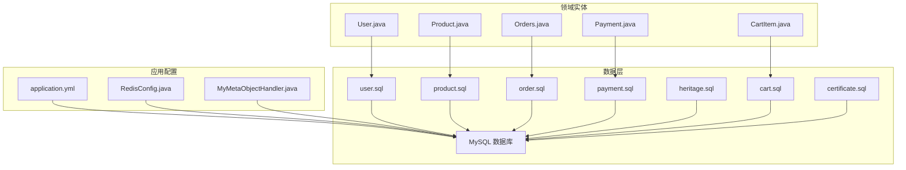
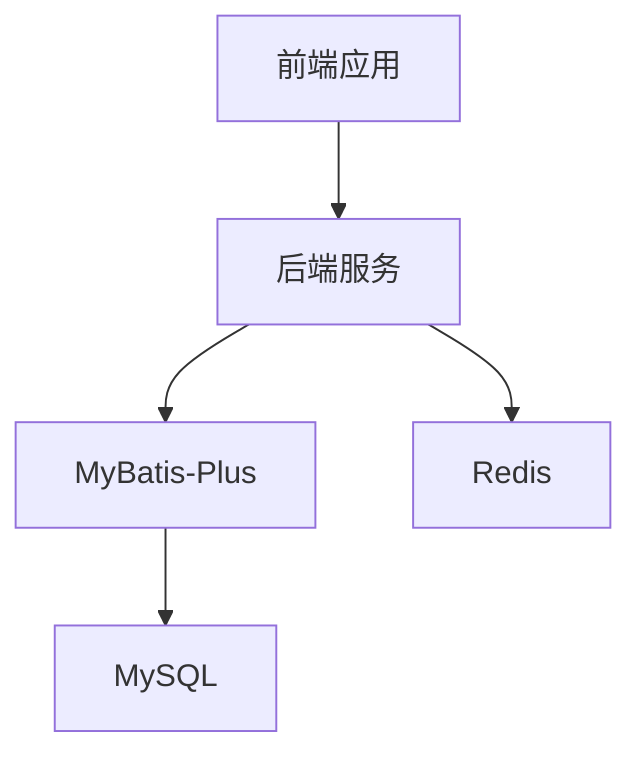
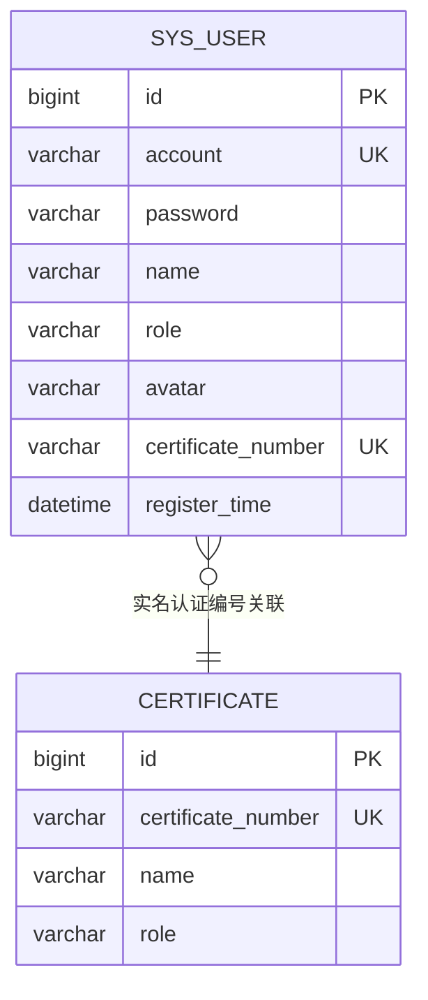
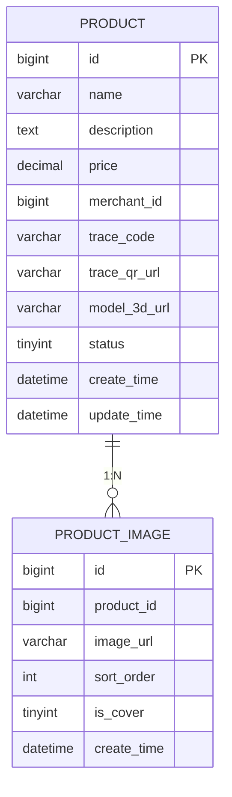
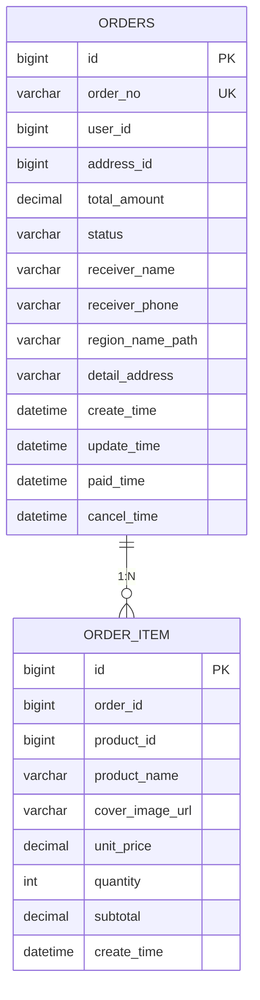
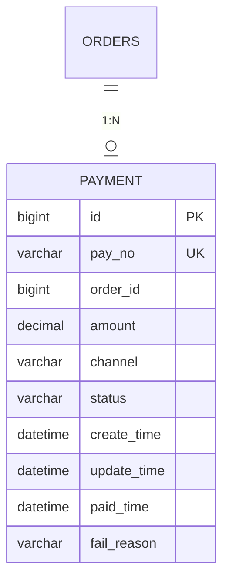
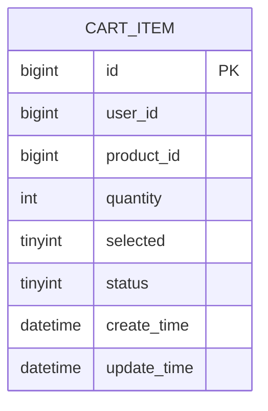
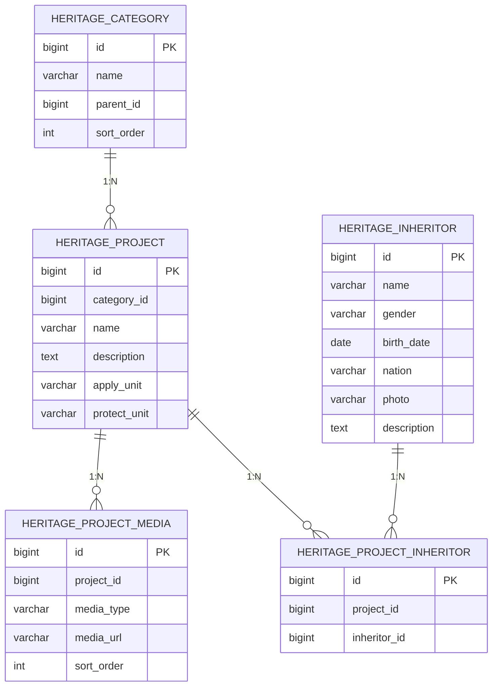

# 数据模型设计

<cite>
**本文引用的文件**
- [数据库设计.md](file://TODO/数据库设计.md)
- [user.sql](file://backend/src/main/resources/sql/user.sql)
- [product.sql](file://backend/src/main/resources/sql/product.sql)
- [order.sql](file://backend/src/main/resources/sql/order.sql)
- [payment.sql](file://backend/src/main/resources/sql/payment.sql)
- [heritage.sql](file://backend/src/main/resources/sql/heritage.sql)
- [cart.sql](file://backend/src/main/resources/sql/cart.sql)
- [certificate.sql](file://backend/src/main/resources/sql/certificate.sql)
- [application.yml](file://backend/src/main/resources/application.yml)
- [User.java](file://backend/src/main/java/com/heritage/entity/User.java)
- [Product.java](file://backend/src/main/java/com/heritage/entity/Product.java)
- [Orders.java](file://backend/src/main/java/com/heritage/entity/Orders.java)
- [Payment.java](file://backend/src/main/java/com/heritage/entity/Payment.java)
- [CartItem.java](file://backend/src/main/java/com/heritage/entity/CartItem.java)
- [MyMetaObjectHandler.java](file://backend/src/main/java/com/heritage/config/MyMetaObjectHandler.java)
- [RedisConfig.java](file://backend/src/main/java/com/heritage/config/RedisConfig.java)
</cite>

## 目录
1. [简介](#简介)
2. [项目结构](#项目结构)
3. [核心组件](#核心组件)
4. [架构总览](#架构总览)
5. [详细组件分析](#详细组件分析)
6. [依赖分析](#依赖分析)
7. [性能考虑](#性能考虑)
8. [故障排查指南](#故障排查指南)
9. [结论](#结论)
10. [附录](#附录)

## 简介
本文件为“非遗产品智能定制商城系统”的数据模型设计文档，覆盖用户、商品、非遗文化、订单与交易等核心实体，明确表结构、主外键关系、索引策略、数据完整性与一致性保障机制，并给出 ER 图、表结构说明、字段定义、数据访问模式、缓存策略与性能优化建议，以及数据生命周期、备份恢复与迁移方案。

## 项目结构
系统采用前后端分离架构，后端基于 Spring Boot + MyBatis-Plus，数据库为 MySQL，缓存为 Redis。数据模型由 SQL 初始化脚本与实体类共同体现，配置文件集中管理数据源与缓存连接。



**图表来源**
- [application.yml](file://backend/src/main/resources/application.yml#L17-L35)
- [RedisConfig.java](file://backend/src/main/java/com/heritage/config/RedisConfig.java#L20-L44)
- [MyMetaObjectHandler.java](file://backend/src/main/java/com/heritage/config/MyMetaObjectHandler.java#L12-L25)
- [user.sql](file://backend/src/main/resources/sql/user.sql#L7-L31)
- [product.sql](file://backend/src/main/resources/sql/product.sql#L1-L28)
- [order.sql](file://backend/src/main/resources/sql/order.sql#L4-L38)
- [payment.sql](file://backend/src/main/resources/sql/payment.sql#L3-L17)
- [heritage.sql](file://backend/src/main/resources/sql/heritage.sql#L7-L58)
- [cart.sql](file://backend/src/main/resources/sql/cart.sql#L3-L17)
- [certificate.sql](file://backend/src/main/resources/sql/certificate.sql#L2-L10)

**章节来源**
- [application.yml](file://backend/src/main/resources/application.yml#L1-L63)
- [user.sql](file://backend/src/main/resources/sql/user.sql#L1-L45)
- [product.sql](file://backend/src/main/resources/sql/product.sql#L1-L45)
- [order.sql](file://backend/src/main/resources/sql/order.sql#L1-L39)
- [payment.sql](file://backend/src/main/resources/sql/payment.sql#L1-L18)
- [heritage.sql](file://backend/src/main/resources/sql/heritage.sql#L1-L88)
- [cart.sql](file://backend/src/main/resources/sql/cart.sql#L1-L18)
- [certificate.sql](file://backend/src/main/resources/sql/certificate.sql#L1-L31)

## 核心组件
本节对关键实体进行逐项说明，包括字段定义、约束、索引与业务语义。

- 用户模型（sys_user）
  - 字段要点：账号、密码（加密存储）、角色、头像、实名认证编号、注册时间
  - 约束与索引：主键、账号唯一、实名认证编号唯一、角色索引
  - 业务规则：角色取值 ADMIN/USER/MERCHANT；密码使用 BCrypt 存储；注册时间自动填充
  - 映射实体：User.java

- 商品模型（product）
  - 字段要点：名称、描述、单价、商家ID、溯源码、3D模型地址、状态、时间戳
  - 约束与索引：主键、商家ID索引、状态索引
  - 业务规则：状态枚举 1 上架/0 下架；3D 模型地址可空；自动更新时间戳
  - 映射实体：Product.java

- 商品图片模型（product_image）
  - 字段要点：商品ID、图片URL、排序、是否封面、时间戳
  - 约束与索引：主键、商品ID索引、(商品ID, 封面)复合索引
  - 业务规则：封面图唯一性由业务保证；排序决定详情页轮播顺序
  - 映射实体：无直接实体类（通过 Mapper 使用）

- 订单模型（orders）
  - 字段要点：订单号、用户ID、地址ID、总金额、状态、收货人信息、地址路径、时间戳、支付/取消时间
  - 约束与索引：主键、订单号唯一、用户ID/状态/用户ID+地址索引
  - 业务规则：状态枚举 UNPAID/PAID/CANCEL；地址路径支持多级行政区与海外
  - 映射实体：Orders.java

- 订单明细模型（order_item）
  - 字段要点：订单ID、商品ID、商品名、封面图、单价、数量、小计、时间戳
  - 约证与索引：主键、订单ID索引
  - 业务规则：小计=单价×数量；冗余商品名与封面图便于查询展示
  - 映射实体：无直接实体类（通过 Mapper 使用）

- 交易模型（payment）
  - 字段要点：支付单号、订单ID、金额、渠道、状态、时间戳、支付时间、失败原因
  - 约束与索引：主键、支付单号唯一、订单ID索引
  - 业务规则：状态枚举 INIT/PROCESS/SUCCESS/FAIL；渠道 MOCK 示例
  - 映射实体：Payment.java

- 购物车模型（cart_item）
  - 字段要点：用户ID、商品ID、数量、选中状态、状态、时间戳
  - 约束与索引：主键、(用户ID, 商品ID)唯一、用户ID/选中/状态复合索引
  - 业务规则：唯一约束确保同用户同商品仅一条购物车记录；选中状态 1/0
  - 映射实体：CartItem.java

- 证件模型（certificate）
  - 字段要点：证件号、真实姓名、角色
  - 约束与索引：主键、证件号唯一、角色索引
  - 业务规则：角色 ADMIN/USER/MERCHANT；用于实名认证与权限控制
  - 映射实体：无直接实体类（通过 Mapper 使用）

- 非遗文化模型
  - 非遗分类（heritage_category）：主键、名称、父级ID、排序
  - 非遗项目（heritage_project）：主键、分类ID、名称、描述、申报/保护单位
  - 项目媒体（heritage_project_media）：主键、项目ID、媒体类型、URL、排序
  - 传承人（heritage_inheritor）：主键、姓名、性别、出生日期、民族、照片、介绍
  - 项目-传承人（heritage_project_inheritor）：主键、项目ID、传承人ID，唯一约束（项目ID, 传承人ID）
  - 约束与索引：分类/项目/媒体/传承人均有相应索引；关系表唯一约束保证去重
  - 映射实体：无直接实体类（通过 Mapper 使用）

**章节来源**
- [数据库设计.md](file://TODO/数据库设计.md#L31-L370)
- [user.sql](file://backend/src/main/resources/sql/user.sql#L7-L31)
- [product.sql](file://backend/src/main/resources/sql/product.sql#L1-L28)
- [order.sql](file://backend/src/main/resources/sql/order.sql#L4-L38)
- [payment.sql](file://backend/src/main/resources/sql/payment.sql#L3-L17)
- [cart.sql](file://backend/src/main/resources/sql/cart.sql#L3-L17)
- [certificate.sql](file://backend/src/main/resources/sql/certificate.sql#L2-L10)
- [heritage.sql](file://backend/src/main/resources/sql/heritage.sql#L7-L58)
- [User.java](file://backend/src/main/java/com/heritage/entity/User.java#L11-L37)
- [Product.java](file://backend/src/main/java/com/heritage/entity/Product.java#L13-L48)
- [Orders.java](file://backend/src/main/java/com/heritage/entity/Orders.java#L13-L57)
- [Payment.java](file://backend/src/main/java/com/heritage/entity/Payment.java#L13-L45)
- [CartItem.java](file://backend/src/main/java/com/heritage/entity/CartItem.java#L12-L38)

## 架构总览
系统数据层由 MySQL 承载，Redis 作为缓存层，Spring Boot 应用通过 MyBatis-Plus 访问数据库。实体类与数据库表一一对应，MyMetaObjectHandler 自动填充时间字段，application.yml 统一配置数据源与缓存。



**图表来源**
- [application.yml](file://backend/src/main/resources/application.yml#L17-L35)
- [RedisConfig.java](file://backend/src/main/java/com/heritage/config/RedisConfig.java#L20-L44)
- [MyMetaObjectHandler.java](file://backend/src/main/java/com/heritage/config/MyMetaObjectHandler.java#L12-L25)

## 详细组件分析

### 用户模型（sys_user）与实名认证（certificate）
- 设计要点
  - sys_user：账号唯一、密码加密、角色区分、实名认证编号唯一、注册时间
  - certificate：预置合法证件，角色与用户角色一致
- 业务流程
  - 用户提交认证：系统校验证件号与姓名匹配且未被占用，成功则回写用户表的实名认证编号
- 索引策略
  - sys_user：uk_account、uk_certificate_number、idx_role
  - certificate：uk_certificate_number、idx_role



**图表来源**
- [user.sql](file://backend/src/main/resources/sql/user.sql#L7-L31)
- [certificate.sql](file://backend/src/main/resources/sql/certificate.sql#L2-L10)

**章节来源**
- [数据库设计.md](file://TODO/数据库设计.md#L31-L125)
- [user.sql](file://backend/src/main/resources/sql/user.sql#L7-L31)
- [certificate.sql](file://backend/src/main/resources/sql/certificate.sql#L2-L10)

### 商品模型（product）与图片（product_image）
- 设计要点
  - product：单价、商家ID、状态、3D 模型地址、时间戳
  - product_image：排序、封面图、商品ID
- 关系映射
  - product 与 product_image 为 1:N
- 索引策略
  - product：idx_merchant_id、idx_status
  - product_image：idx_product_id、idx_product_cover



**图表来源**
- [product.sql](file://backend/src/main/resources/sql/product.sql#L1-L28)

**章节来源**
- [数据库设计.md](file://TODO/数据库设计.md#L128-L176)
- [product.sql](file://backend/src/main/resources/sql/product.sql#L1-L28)

### 订单模型（orders）与明细（order_item）
- 设计要点
  - orders：订单号唯一、收货人信息、地址路径、状态、时间戳、支付/取消时间
  - order_item：冗余商品名与封面图、小计
- 关系映射
  - orders 与 order_item 为 1:N
- 索引策略
  - orders：uk_order_no、idx_user_id、idx_user_status、idx_user_address
  - order_item：idx_order_id



**图表来源**
- [order.sql](file://backend/src/main/resources/sql/order.sql#L4-L38)

**章节来源**
- [数据库设计.md](file://TODO/数据库设计.md#L325-L337)
- [order.sql](file://backend/src/main/resources/sql/order.sql#L4-L38)

### 交易模型（payment）
- 设计要点
  - 支付单号唯一、订单ID、金额、渠道、状态、时间戳、支付时间、失败原因
- 关系映射
  - payment 与 orders 为 N:1（一个订单可能有多个支付流水，示例使用单条支付记录）
- 索引策略
  - uk_pay_no、idx_order_id



**图表来源**
- [payment.sql](file://backend/src/main/resources/sql/payment.sql#L3-L17)

**章节来源**
- [payment.sql](file://backend/src/main/resources/sql/payment.sql#L3-L17)

### 购物车模型（cart_item）
- 设计要点
  - 用户ID+商品ID 唯一、数量、选中状态、状态、时间戳
- 索引策略
  - uk_user_product、idx_user_id、idx_user_selected、idx_user_status



**图表来源**
- [cart.sql](file://backend/src/main/resources/sql/cart.sql#L3-L17)

**章节来源**
- [cart.sql](file://backend/src/main/resources/sql/cart.sql#L3-L17)

### 非遗文化模型（heritage_*）
- 设计要点
  - heritage_category：树形分类
  - heritage_project：关联分类、单位信息
  - heritage_project_media：媒体类型（展示图、工艺图、视频）
  - heritage_inheritor：传承人信息
  - heritage_project_inheritor：多对多关系，唯一约束去重
- 索引策略
  - heritage_category：idx_parent_id
  - heritage_project：idx_category_id
  - heritage_project_media：idx_project_id、idx_project_type
  - heritage_inheritor：idx_name
  - heritage_project_inheritor：uk_project_inheritor、idx_project_id、idx_inheritor_id



**图表来源**
- [heritage.sql](file://backend/src/main/resources/sql/heritage.sql#L7-L58)

**章节来源**
- [database_design.md](file://TODO/数据库设计.md#L237-L322)
- [heritage.sql](file://backend/src/main/resources/sql/heritage.sql#L7-L58)

### 智能定制记录（ai_image_record）
- 设计要点
  - 记录用户 AI 生图历史，字段简化，便于历史展示
- 索引策略
  - idx_user_id

**章节来源**
- [数据库设计.md](file://TODO/数据库设计.md#L179-L198)

## 依赖分析
- 实体与表映射
  - User ↔ sys_user
  - Product ↔ product
  - Orders ↔ orders
  - Payment ↔ payment
  - CartItem ↔ cart_item
- 时间字段自动填充
  - MyMetaObjectHandler 在插入/更新时自动填充 register_time、update_time
- 缓存与配置
  - RedisConfig 定义序列化策略与连接模板
  - application.yml 配置数据源与 Redis 连接

```mermaid
classDiagram
class User {
+Long id
+String account
+String password
+String name
+String role
+String avatar
+String certificateNumber
+LocalDateTime registerTime
}
class Product {
+Long id
+String name
+String description
+BigDecimal price
+Long merchantId
+String traceCode
+String traceQrUrl
+String model3dUrl
+Integer status
+LocalDateTime createTime
+LocalDateTime updateTime
}
class Orders {
+Long id
+String orderNo
+Long userId
+Long addressId
+BigDecimal totalAmount
+String status
+String receiverName
+String receiverPhone
+String regionNamePath
+String detailAddress
+LocalDateTime createTime
+LocalDateTime updateTime
+LocalDateTime paidTime
+LocalDateTime cancelTime
}
class Payment {
+Long id
+String payNo
+Long orderId
+BigDecimal amount
+String channel
+String status
+LocalDateTime createTime
+LocalDateTime updateTime
+LocalDateTime paidTime
+String failReason
}
class CartItem {
+Long id
+Long userId
+Long productId
+Integer quantity
+Integer selected
+Integer status
+LocalDateTime createTime
+LocalDateTime updateTime
}
User <.. Product : "商家ID关联"
Orders <.. Payment : "1 : N"
Orders <.. CartItem : "1 : N"
```

**图表来源**
- [User.java](file://backend/src/main/java/com/heritage/entity/User.java#L11-L37)
- [Product.java](file://backend/src/main/java/com/heritage/entity/Product.java#L13-L48)
- [Orders.java](file://backend/src/main/java/com/heritage/entity/Orders.java#L13-L57)
- [Payment.java](file://backend/src/main/java/com/heritage/entity/Payment.java#L13-L45)
- [CartItem.java](file://backend/src/main/java/com/heritage/entity/CartItem.java#L12-L38)

**章节来源**
- [MyMetaObjectHandler.java](file://backend/src/main/java/com/heritage/config/MyMetaObjectHandler.java#L12-L25)
- [RedisConfig.java](file://backend/src/main/java/com/heritage/config/RedisConfig.java#L20-L44)
- [application.yml](file://backend/src/main/resources/application.yml#L17-L35)

## 性能考虑
- 索引优化
  - 用户/订单/支付/商品/购物车均按高频查询字段建立索引，避免全表扫描
  - 复合索引覆盖常见过滤条件（如用户+状态、用户+地址）
- 时间字段
  - 使用自动更新时间戳减少应用层逻辑，降低错误率
- 缓存策略
  - Redis 用于热点数据与会话缓存，结合 JSON 序列化提升传输效率
- 数据分页与查询
  - 建议在订单、商品、非遗项目等大表使用分页查询与覆盖索引
- 写入优化
  - 批量插入与事务合并，避免频繁小事务

[本节为通用性能建议，无需特定文件引用]

## 故障排查指南
- 数据库连接
  - 检查 application.yml 中数据库 URL、用户名、密码与时区配置
- 缓存连接
  - 检查 Redis 主机、端口、超时与连接池配置
- 实体映射
  - 确认实体类字段命名与表字段一致（驼峰与下划线映射）
- 时间字段填充
  - 若未填充 register_time/update_time，检查 MyMetaObjectHandler 是否生效
- 常见错误
  - 唯一约束冲突：账号、订单号、支付单号、(用户ID, 商品ID)、(项目ID, 传承人ID)
  - 外键约束：删除/更新前确认关联数据已清理或迁移

**章节来源**
- [application.yml](file://backend/src/main/resources/application.yml#L17-L35)
- [RedisConfig.java](file://backend/src/main/java/com/heritage/config/RedisConfig.java#L20-L44)
- [MyMetaObjectHandler.java](file://backend/src/main/java/com/heritage/config/MyMetaObjectHandler.java#L12-L25)

## 结论
本数据模型围绕用户管理与实名认证、商品与非遗文化、订单与交易、购物车等核心业务域构建，通过合理的主外键关系、索引设计与自动时间填充，保障数据一致性与查询性能。配合 Redis 缓存与统一配置，满足系统扩展与高并发需求。后续可在智能定制、溯源与营销活动等方面沿用现有设计范式进行扩展。

## 附录
- 数据访问模式
  - MyBatis-Plus Mapper + Service 层封装 CRUD 与复杂查询
  - 实体类与表字段映射，避免硬编码 SQL
- 缓存策略
  - RedisTemplate 统一序列化配置，适用于对象缓存与分布式会话
- 生命周期与备份恢复
  - 建议定期导出结构与增量数据，结合 binlog 做时间点恢复
- 迁移方案
  - 使用 Flyway/Liquibase 管理版本迁移，先建索引再导入数据，最后切换流量

[本节为通用实践建议，无需特定文件引用]