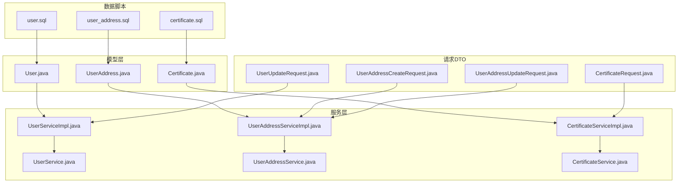
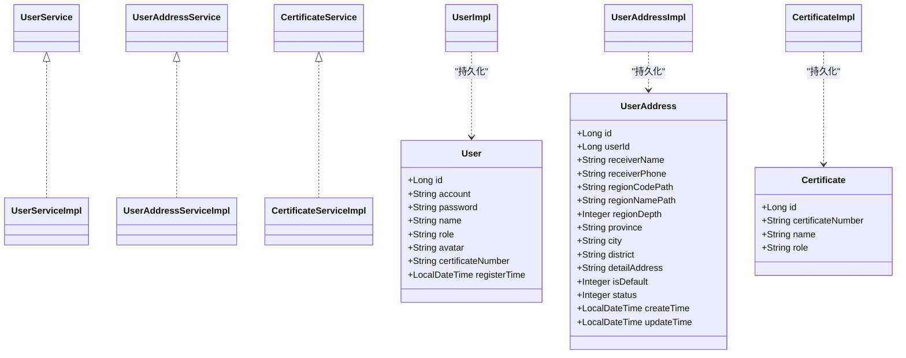
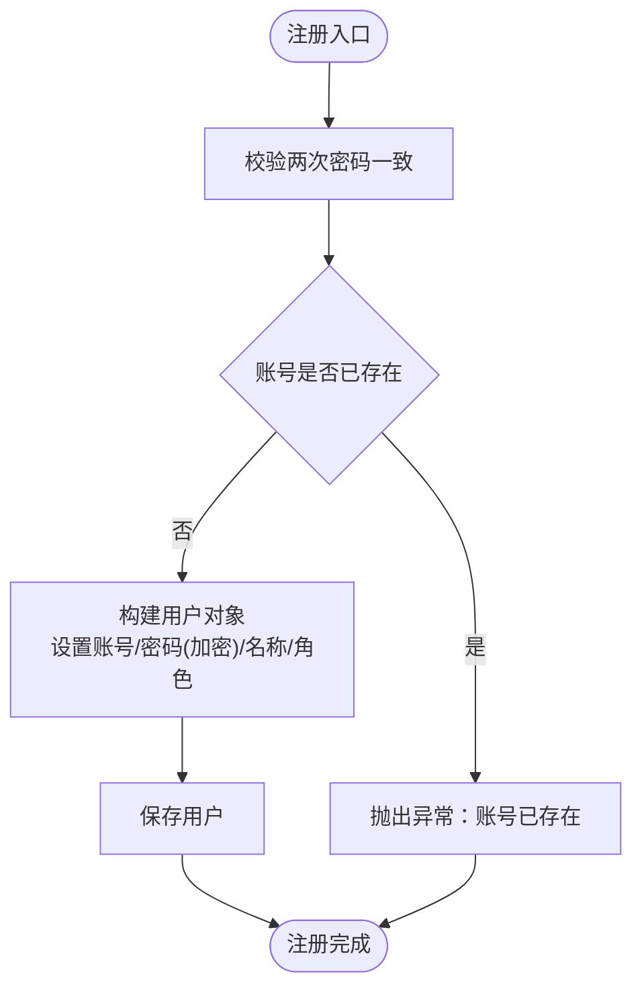
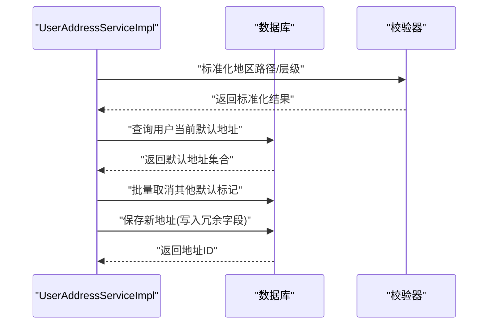
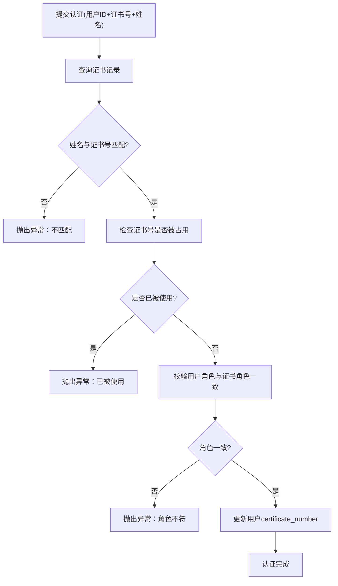
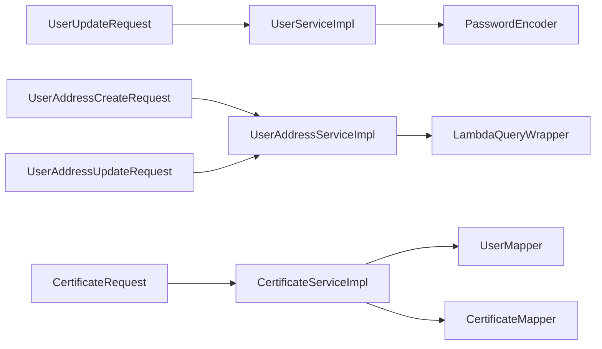

# 用户数据模型

<cite>
**本文引用的文件**
- [User.java](file://backend/src/main/java/com/heritage/entity/User.java)
- [UserAddress.java](file://backend/src/main/java/com/heritage/entity/UserAddress.java)
- [Certificate.java](file://backend/src/main/java/com/heritage/entity/Certificate.java)
- [UserServiceImpl.java](file://backend/src/main/java/com/heritage/service/impl/UserServiceImpl.java)
- [UserAddressServiceImpl.java](file://backend/src/main/java/com/heritage/service/impl/UserAddressServiceImpl.java)
- [CertificateServiceImpl.java](file://backend/src/main/java/com/heritage/service/impl/CertificateServiceImpl.java)
- [UserService.java](file://backend/src/main/java/com/heritage/service/UserService.java)
- [UserAddressService.java](file://backend/src/main/java/com/heritage/service/UserAddressService.java)
- [CertificateService.java](file://backend/src/main/java/com/heritage/service/CertificateService.java)
- [UserUpdateRequest.java](file://backend/src/main/java/com/heritage/dto/UserUpdateRequest.java)
- [UserAddressCreateRequest.java](file://backend/src/main/java/com/heritage/dto/UserAddressCreateRequest.java)
- [UserAddressUpdateRequest.java](file://backend/src/main/java/com/heritage/dto/UserAddressUpdateRequest.java)
- [CertificateRequest.java](file://backend/src/main/java/com/heritage/dto/CertificateRequest.java)
- [user.sql](file://backend/src/main/resources/sql/user.sql)
- [user_address.sql](file://backend/src/main/resources/sql/user_address.sql)
- [certificate.sql](file://backend/src/main/resources/sql/certificate.sql)
- [application.yml](file://backend/src/main/resources/application.yml)
- [数据库设计.md](file://TODO/数据库设计.md)
</cite>

## 目录
1. [简介](#简介)
2. [项目结构](#项目结构)
3. [核心组件](#核心组件)
4. [架构总览](#架构总览)
5. [详细组件分析](#详细组件分析)
6. [依赖分析](#依赖分析)
7. [性能考虑](#性能考虑)
8. [故障排查指南](#故障排查指南)
9. [结论](#结论)
10. [附录](#附录)

## 简介
本文件聚焦于用户数据模型，系统化梳理用户实体(User)、用户地址(UserAddress)与实名认证(Certificate)三者的设计与实现，覆盖字段定义、数据类型、约束与索引策略、业务流程、权限控制与数据安全等方面，并解释其与系统其他模块的关联关系。

## 项目结构
用户数据模型相关代码位于后端 Java 工程的 entity、dto、service、mapper、controller 层，配合 SQL 初始化脚本与设计文档，形成“模型-服务-接口-脚本”的完整闭环。

图表来源
- [User.java](file://backend/src/main/java/com/heritage/entity/User.java#L1-L38)
- [UserAddress.java](file://backend/src/main/java/com/heritage/entity/UserAddress.java#L1-L60)
- [Certificate.java](file://backend/src/main/java/com/heritage/entity/Certificate.java#L1-L22)
- [UserService.java](file://backend/src/main/java/com/heritage/service/UserService.java#L1-L22)
- [UserAddressService.java](file://backend/src/main/java/com/heritage/service/UserAddressService.java#L1-L23)
- [CertificateService.java](file://backend/src/main/java/com/heritage/service/CertificateService.java#L1-L17)
- [UserServiceImpl.java](file://backend/src/main/java/com/heritage/service/impl/UserServiceImpl.java#L1-L181)
- [UserAddressServiceImpl.java](file://backend/src/main/java/com/heritage/service/impl/UserAddressServiceImpl.java#L1-L248)
- [CertificateServiceImpl.java](file://backend/src/main/java/com/heritage/service/impl/CertificateServiceImpl.java#L1-L118)
- [UserUpdateRequest.java](file://backend/src/main/java/com/heritage/dto/UserUpdateRequest.java#L1-L16)
- [UserAddressCreateRequest.java](file://backend/src/main/java/com/heritage/dto/UserAddressCreateRequest.java#L1-L42)
- [UserAddressUpdateRequest.java](file://backend/src/main/java/com/heritage/dto/UserAddressUpdateRequest.java#L1-L35)
- [CertificateRequest.java](file://backend/src/main/java/com/heritage/dto/CertificateRequest.java#L1-L17)
- [user.sql](file://backend/src/main/resources/sql/user.sql#L1-L45)
- [user_address.sql](file://backend/src/main/resources/sql/user_address.sql#L1-L24)
- [certificate.sql](file://backend/src/main/resources/sql/certificate.sql#L1-L31)

章节来源
- [User.java](file://backend/src/main/java/com/heritage/entity/User.java#L1-L38)
- [UserAddress.java](file://backend/src/main/java/com/heritage/entity/UserAddress.java#L1-L60)
- [Certificate.java](file://backend/src/main/java/com/heritage/entity/Certificate.java#L1-L22)
- [user.sql](file://backend/src/main/resources/sql/user.sql#L1-L45)
- [user_address.sql](file://backend/src/main/resources/sql/user_address.sql#L1-L24)
- [certificate.sql](file://backend/src/main/resources/sql/certificate.sql#L1-L31)

## 核心组件
- 用户实体(User)：承载登录凭证(account/password)、基本信息(name/avatar)、角色(role)、实名认证标识(certificate_number)与注册时间(register_time)。
- 用户地址(UserAddress)：承载收货地址、地区路径(region_name_path/region_code_path)、层级(region_depth)、默认标记(is_default)、状态(status)与时间戳(create_time/update_time)。
- 实名认证(Certificate)：承载证件号(certificate_number)、真实姓名(name)与角色(role)，用于认证核验与绑定。

章节来源
- [User.java](file://backend/src/main/java/com/heritage/entity/User.java#L11-L37)
- [UserAddress.java](file://backend/src/main/java/com/heritage/entity/UserAddress.java#L13-L58)
- [Certificate.java](file://backend/src/main/java/com/heritage/entity/Certificate.java#L8-L21)

## 架构总览
用户数据模型在服务层由 UserService、UserAddressService、CertificateService 统一抽象，具体实现类负责业务规则与事务控制；DTO 层提供请求参数校验与传输对象；SQL 脚本定义表结构、索引与初始数据。

图表来源
- [User.java](file://backend/src/main/java/com/heritage/entity/User.java#L11-L37)
- [UserAddress.java](file://backend/src/main/java/com/heritage/entity/UserAddress.java#L13-L58)
- [Certificate.java](file://backend/src/main/java/com/heritage/entity/Certificate.java#L8-L21)
- [UserService.java](file://backend/src/main/java/com/heritage/service/UserService.java#L8-L21)
- [UserAddressService.java](file://backend/src/main/java/com/heritage/service/UserAddressService.java#L11-L22)
- [CertificateService.java](file://backend/src/main/java/com/heritage/service/CertificateService.java#L7-L16)
- [UserServiceImpl.java](file://backend/src/main/java/com/heritage/service/impl/UserServiceImpl.java#L22-L46)
- [UserAddressServiceImpl.java](file://backend/src/main/java/com/heritage/service/impl/UserAddressServiceImpl.java#L25-L64)
- [CertificateServiceImpl.java](file://backend/src/main/java/com/heritage/service/impl/CertificateServiceImpl.java#L18-L58)

## 详细组件分析

### 用户实体(User)设计
- 字段与类型
  - id: 主键，自增
  - account: 登录账号，唯一索引
  - password: 密文存储，BCrypt
  - name: 显示名称
  - role: 角色枚举(ADMIN/USER/MERCHANT)
  - avatar: 头像URL
  - certificateNumber: 与证书绑定后的唯一标识
  - registerTime: 注册时间
- 约束与索引
  - 唯一索引：account、certificate_number
  - 普通索引：role
- 安全与权限
  - 密码经 BCrypt 存储，登录时比对
  - 角色字段用于权限分级与业务控制
- 业务逻辑
  - 注册时校验账号唯一性与密码一致性
  - 登录时校验账号存在与密码正确性
  - 更新信息时支持名称、头像、密码更新（密码再次加密）

图表来源
- [UserServiceImpl.java](file://backend/src/main/java/com/heritage/service/impl/UserServiceImpl.java#L26-L46)
- [user.sql](file://backend/src/main/resources/sql/user.sql#L7-L20)

章节来源
- [User.java](file://backend/src/main/java/com/heritage/entity/User.java#L11-L37)
- [user.sql](file://backend/src/main/resources/sql/user.sql#L7-L20)
- [UserServiceImpl.java](file://backend/src/main/java/com/heritage/service/impl/UserServiceImpl.java#L26-L75)

### 用户地址(UserAddress)模型
- 字段与类型
  - id: 主键，自增
  - userId: 所属用户
  - receiverName/receiverPhone: 收货人信息
  - regionNamePath/regionCodePath: 地区名称/编码路径，支持多级与海外
  - regionDepth: 地区层级深度
  - province/city/district: 冗余前三级名称
  - detailAddress: 详细地址
  - isDefault/status: 默认标记与状态
  - create_time/update_time: 时间戳
- 约束与索引
  - 唯一索引：id
  - 复合索引：(user_id)、(user_id,is_default)、(user_id,region_depth)
- 地址管理规则
  - 默认地址唯一性：同一用户仅一条默认地址
  - 地区路径标准化：去除空段，计算层级深度
  - 冗余字段：根据地区路径自动填充前三级
  - 列表排序：优先默认地址，再按更新/创建时间倒序
- 验证规则
  - 创建/更新时对必填字段进行长度与非空校验
  - 地区层级必须为正数
  - 仅对有效状态的地址进行操作

图表来源
- [UserAddressServiceImpl.java](file://backend/src/main/java/com/heritage/service/impl/UserAddressServiceImpl.java#L27-L64)
- [UserAddressServiceImpl.java](file://backend/src/main/java/com/heritage/service/impl/UserAddressServiceImpl.java#L161-L174)
- [user_address.sql](file://backend/src/main/resources/sql/user_address.sql#L3-L23)

章节来源
- [UserAddress.java](file://backend/src/main/java/com/heritage/entity/UserAddress.java#L13-L58)
- [UserAddressServiceImpl.java](file://backend/src/main/java/com/heritage/service/impl/UserAddressServiceImpl.java#L27-L159)
- [user_address.sql](file://backend/src/main/resources/sql/user_address.sql#L3-L23)

### 实名认证(Certificate)模型
- 字段与类型
  - id: 主键，自增
  - certificateNumber: 证件号，唯一索引
  - name: 真实姓名
  - role: 对应角色(ADMIN/USER/MERCHANT)
- 认证流程
  - 校验证书号与姓名匹配
  - 校验证书号未被其他用户使用
  - 校验用户角色与证书角色一致
  - 将证书号回写至用户表的 certificate_number 字段
- 数据来源
  - 证书表为预置数据，包含 ADMIN/USER/MERCHANT 三类角色
- 安全与合规
  - 证书号唯一性保障
  - 角色一致性校验防止越权

图表来源
- [CertificateServiceImpl.java](file://backend/src/main/java/com/heritage/service/impl/CertificateServiceImpl.java#L22-L58)
- [certificate.sql](file://backend/src/main/resources/sql/certificate.sql#L2-L10)

章节来源
- [Certificate.java](file://backend/src/main/java/com/heritage/entity/Certificate.java#L8-L21)
- [CertificateServiceImpl.java](file://backend/src/main/java/com/heritage/service/impl/CertificateServiceImpl.java#L22-L116)
- [certificate.sql](file://backend/src/main/resources/sql/certificate.sql#L2-L31)

## 依赖分析
- 实体与服务
  - User 与 Certificate 通过 certificate_number 建立弱关联（用户侧存证书号，证书侧存角色）
  - UserAddress 通过 userId 强关联用户
- 服务层依赖
  - UserServiceImpl 依赖 PasswordEncoder 进行密码加密
  - UserAddressServiceImpl 依赖 LambdaQueryWrapper 进行地址查询与默认地址清理
  - CertificateServiceImpl 依赖 UserMapper 与 CertificateMapper 进行双向校验与更新
- DTO 与校验
  - UserUpdateRequest、UserAddressCreateRequest、UserAddressUpdateRequest、CertificateRequest 提供参数校验
- 配置与环境
  - application.yml 提供数据库连接、Redis、JWT 密钥与过期时间等配置

图表来源
- [UserServiceImpl.java](file://backend/src/main/java/com/heritage/service/impl/UserServiceImpl.java#L24-L46)
- [UserAddressServiceImpl.java](file://backend/src/main/java/com/heritage/service/impl/UserAddressServiceImpl.java#L3-L21)
- [CertificateServiceImpl.java](file://backend/src/main/java/com/heritage/service/impl/CertificateServiceImpl.java#L3-L20)
- [UserUpdateRequest.java](file://backend/src/main/java/com/heritage/dto/UserUpdateRequest.java#L1-L16)
- [UserAddressCreateRequest.java](file://backend/src/main/java/com/heritage/dto/UserAddressCreateRequest.java#L1-L42)
- [UserAddressUpdateRequest.java](file://backend/src/main/java/com/heritage/dto/UserAddressUpdateRequest.java#L1-L35)
- [CertificateRequest.java](file://backend/src/main/java/com/heritage/dto/CertificateRequest.java#L1-L17)

章节来源
- [application.yml](file://backend/src/main/resources/application.yml#L17-L41)

## 性能考虑
- 索引策略
  - sys_user：uk_account、uk_certificate_number、idx_role，支撑登录、唯一性与角色筛选
  - user_address：idx_user_id、idx_user_default、idx_user_region_depth，支撑用户维度查询、默认地址定位与层级检索
- 查询优化
  - 地址列表按默认优先、时间倒序，减少前端二次排序成本
  - 默认地址切换采用批量更新取消其他默认，避免重复扫描
- 缓存与会话
  - JWT 密钥与过期时间集中配置，便于统一管理与轮换
- 存储与加密
  - 密码使用 BCrypt，兼顾安全性与性能

[本节为通用性能建议，无需特定文件引用]

## 故障排查指南
- 用户注册/登录
  - 账号已存在：检查 uk_account 唯一性约束
  - 密码不一致：确认两次输入一致
  - 账号或密码错误：确认明文密码与 BCrypt 匹配
- 地址管理
  - 地区为空或层级非法：确保 regionNamePath 非空且层级为正
  - 无权限操作地址：确认地址属于当前用户且状态有效
  - 默认地址冲突：系统会自动取消其他默认标记
- 实名认证
  - 证件号不存在或姓名不匹配：核对证书表数据
  - 证件号已被使用：检查是否存在重复绑定
  - 角色不符：确认用户角色与证书角色一致

章节来源
- [UserServiceImpl.java](file://backend/src/main/java/com/heritage/service/impl/UserServiceImpl.java#L28-L60)
- [UserAddressServiceImpl.java](file://backend/src/main/java/com/heritage/service/impl/UserAddressServiceImpl.java#L176-L184)
- [CertificateServiceImpl.java](file://backend/src/main/java/com/heritage/service/impl/CertificateServiceImpl.java#L24-L58)

## 结论
用户数据模型通过清晰的实体边界、严格的参数校验与完善的索引策略，实现了登录认证、地址管理与实名认证的核心业务需求。服务层封装了关键业务规则与事务控制，结合 DTO 的参数约束与 SQL 脚本的结构定义，形成了高内聚、低耦合的数据层设计。建议在后续迭代中持续关注索引命中率与查询路径优化，并保持证书号与角色的一致性校验作为安全基线。

## 附录

### 字段与约束对照表
- sys_user
  - 字段：id、account、password、name、role、avatar、certificate_number、register_time
  - 约束：PRIMARY、UNIQUE(uk_account, uk_certificate_number)、KEY(idx_role)
- certificate
  - 字段：id、certificate_number、name、role
  - 约束：PRIMARY、UNIQUE(uk_certificate_number)、KEY(idx_role)
- user_address
  - 字段：id、user_id、receiver_name、receiver_phone、region_name_path、region_code_path、region_depth、province、city、district、detail_address、is_default、status、create_time、update_time
  - 约束：PRIMARY、KEY(idx_user_id)、KEY(idx_user_default)、KEY(idx_user_region_depth)

章节来源
- [user.sql](file://backend/src/main/resources/sql/user.sql#L7-L20)
- [certificate.sql](file://backend/src/main/resources/sql/certificate.sql#L2-L10)
- [user_address.sql](file://backend/src/main/resources/sql/user_address.sql#L3-L23)
- [数据库设计.md](file://TODO/数据库设计.md#L31-L234)