# 非遗文化数据模型

<cite>
**本文引用的文件**
- [HeritageCategory.java](file://backend/src/main/java/com/heritage/entity/HeritageCategory.java)
- [HeritageProject.java](file://backend/src/main/java/com/heritage/entity/HeritageProject.java)
- [HeritageInheritor.java](file://backend/src/main/java/com/heritage/entity/HeritageInheritor.java)
- [HeritageProjectInheritor.java](file://backend/src/main/java/com/heritage/entity/HeritageProjectInheritor.java)
- [HeritageProjectMedia.java](file://backend/src/main/java/com/heritage/entity/HeritageProjectMedia.java)
- [HeritageCategoryCreateRequest.java](file://backend/src/main/java/com/heritage/dto/HeritageCategoryCreateRequest.java)
- [HeritageCategoryTreeVO.java](file://backend/src/main/java/com/heritage/dto/HeritageCategoryTreeVO.java)
- [HeritageProjectDetailVO.java](file://backend/src/main/java/com/heritage/dto/HeritageProjectDetailVO.java)
- [HeritageInheritorDetailVO.java](file://backend/src/main/java/com/heritage/dto/HeritageInheritorDetailVO.java)
- [HeritageCategoryController.java](file://backend/src/main/java/com/heritage/controller/HeritageCategoryController.java)
- [HeritageCategoryService.java](file://backend/src/main/java/com/heritage/service/HeritageCategoryService.java)
- [HeritageProjectService.java](file://backend/src/main/java/com/heritage/service/HeritageProjectService.java)
- [HeritageInheritorService.java](file://backend/src/main/java/com/heritage/service/HeritageInheritorService.java)
- [heritage.sql](file://backend/src/main/resources/sql/heritage.sql)
- [数据库设计.md](file://TODO/数据库设计.md)
</cite>

## 目录
1. [简介](#简介)
2. [项目结构](#项目结构)
3. [核心组件](#核心组件)
4. [架构总览](#架构总览)
5. [详细组件分析](#详细组件分析)
6. [依赖分析](#依赖分析)
7. [性能考虑](#性能考虑)
8. [故障排查指南](#故障排查指南)
9. [结论](#结论)
10. [附录](#附录)

## 简介
本文件系统化梳理“非遗文化数据模型”的实体关系与业务规则，覆盖以下关键主题：
- 文化分类（HeritageCategory）的层级结构、父子关系与树形管理
- 传承项目（HeritageProject）的结构与与分类的关联
- 传承人（HeritageInheritor）的结构与展示
- 项目-传承人关联（HeritageProjectInheritor）的多对多关系设计
- 文化媒体（HeritageProjectMedia）的多媒体资源管理（图片、视频、3D模型等）
- 完整的ER图、表关系说明与业务规则约束
- 非遗数据的层次结构管理、内容审核机制与文化价值保护策略

## 项目结构
本项目采用分层架构，核心数据模型位于实体层（entity），业务接口位于服务层（service），对外接口由控制器（controller）暴露。数据库结构定义于SQL脚本与设计文档中。

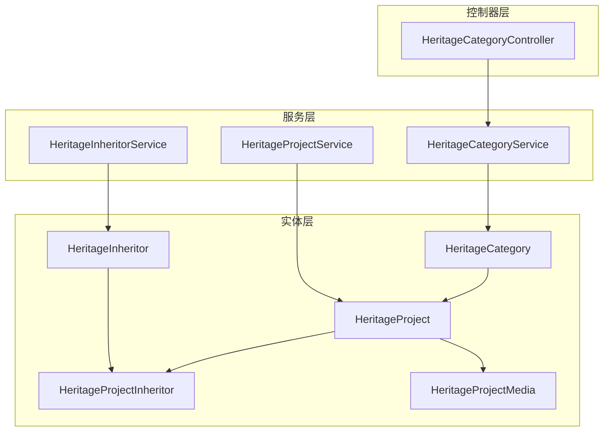

图表来源
- [HeritageCategory.java](file://backend/src/main/java/com/heritage/entity/HeritageCategory.java#L1-L26)
- [HeritageProject.java](file://backend/src/main/java/com/heritage/entity/HeritageProject.java#L1-L32)
- [HeritageInheritor.java](file://backend/src/main/java/com/heritage/entity/HeritageInheritor.java#L1-L37)
- [HeritageProjectInheritor.java](file://backend/src/main/java/com/heritage/entity/HeritageProjectInheritor.java#L1-L23)
- [HeritageProjectMedia.java](file://backend/src/main/java/com/heritage/entity/HeritageProjectMedia.java#L1-L29)
- [HeritageCategoryService.java](file://backend/src/main/java/com/heritage/service/HeritageCategoryService.java#L1-L16)
- [HeritageProjectService.java](file://backend/src/main/java/com/heritage/service/HeritageProjectService.java#L1-L36)
- [HeritageInheritorService.java](file://backend/src/main/java/com/heritage/service/HeritageInheritorService.java#L1-L29)
- [HeritageCategoryController.java](file://backend/src/main/java/com/heritage/controller/HeritageCategoryController.java#L1-L30)

章节来源
- [HeritageCategory.java](file://backend/src/main/java/com/heritage/entity/HeritageCategory.java#L1-L26)
- [HeritageProject.java](file://backend/src/main/java/com/heritage/entity/HeritageProject.java#L1-L32)
- [HeritageInheritor.java](file://backend/src/main/java/com/heritage/entity/HeritageInheritor.java#L1-L37)
- [HeritageProjectInheritor.java](file://backend/src/main/java/com/heritage/entity/HeritageProjectInheritor.java#L1-L23)
- [HeritageProjectMedia.java](file://backend/src/main/java/com/heritage/entity/HeritageProjectMedia.java#L1-L29)
- [HeritageCategoryService.java](file://backend/src/main/java/com/heritage/service/HeritageCategoryService.java#L1-L16)
- [HeritageProjectService.java](file://backend/src/main/java/com/heritage/service/HeritageProjectService.java#L1-L36)
- [HeritageInheritorService.java](file://backend/src/main/java/com/heritage/service/HeritageInheritorService.java#L1-L29)
- [HeritageCategoryController.java](file://backend/src/main/java/com/heritage/controller/HeritageCategoryController.java#L1-L30)

## 核心组件
本节聚焦四个核心实体及其关系，结合数据库表结构与DTO/VO，说明数据模型的职责与约束。

- 文化分类（HeritageCategory）
  - 职责：构建非遗项目的分类层级，支持父子关系与排序
  - 关键字段：id、name、parentId、sortOrder
  - 约束：父节点通过 parentId 引用自身；sortOrder 控制同级排序
- 传承项目（HeritageProject）
  - 职责：承载非遗项目的主体信息，关联至分类
  - 关键字段：id、categoryId、name、description、applyUnit、protectUnit
  - 约束：categoryId 外键关联分类
- 传承人（HeritageInheritor）
  - 职责：记录传承人的基本信息与简介
  - 关键字段：id、name、gender、birthDate、nation、photo、description
  - 约束：name 建有索引，便于检索
- 项目-传承人关联（HeritageProjectInheritor）
  - 职责：多对多关系桥接，确保唯一性
  - 关键字段：id、projectId、inheritorId
  - 约束：联合唯一索引（projectId, inheritorId）
- 文化媒体（HeritageProjectMedia）
  - 职责：管理项目相关的多媒体资源
  - 关键字段：id、projectId、mediaType、mediaUrl、sortOrder
  - 约束：按项目+类型建立复合索引，支持高效查询

章节来源
- [HeritageCategory.java](file://backend/src/main/java/com/heritage/entity/HeritageCategory.java#L1-L26)
- [HeritageProject.java](file://backend/src/main/java/com/heritage/entity/HeritageProject.java#L1-L32)
- [HeritageInheritor.java](file://backend/src/main/java/com/heritage/entity/HeritageInheritor.java#L1-L37)
- [HeritageProjectInheritor.java](file://backend/src/main/java/com/heritage/entity/HeritageProjectInheritor.java#L1-L23)
- [HeritageProjectMedia.java](file://backend/src/main/java/com/heritage/entity/HeritageProjectMedia.java#L1-L29)

## 架构总览
非遗模块的典型调用链路如下：

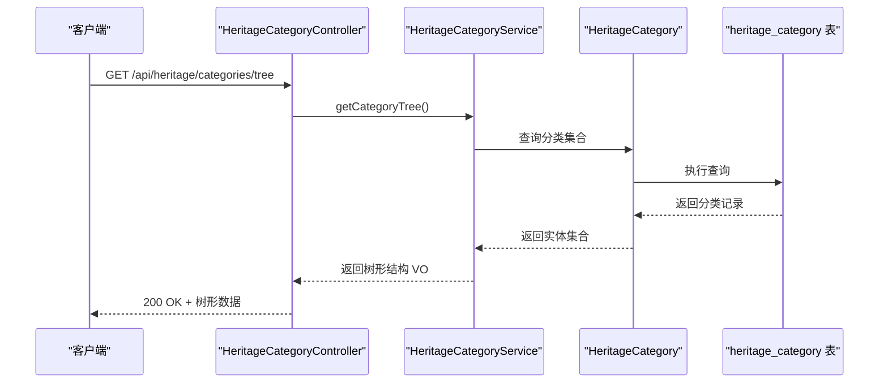

图表来源
- [HeritageCategoryController.java](file://backend/src/main/java/com/heritage/controller/HeritageCategoryController.java#L1-L30)
- [HeritageCategoryService.java](file://backend/src/main/java/com/heritage/service/HeritageCategoryService.java#L1-L16)
- [HeritageCategory.java](file://backend/src/main/java/com/heritage/entity/HeritageCategory.java#L1-L26)
- [heritage.sql](file://backend/src/main/resources/sql/heritage.sql#L7-L14)

章节来源
- [HeritageCategoryController.java](file://backend/src/main/java/com/heritage/controller/HeritageCategoryController.java#L1-L30)
- [HeritageCategoryService.java](file://backend/src/main/java/com/heritage/service/HeritageCategoryService.java#L1-L16)
- [HeritageCategory.java](file://backend/src/main/java/com/heritage/entity/HeritageCategory.java#L1-L26)
- [heritage.sql](file://backend/src/main/resources/sql/heritage.sql#L7-L14)

## 详细组件分析

### 文化分类（HeritageCategory）模型
- 设计要点
  - 层级结构：通过 parentId 指向自身，形成可变深度的树形结构
  - 排序控制：sortOrder 用于同级排序，便于前端渲染
  - 索引优化：对 parentId 建立索引，加速父子查询
- 数据模型类图

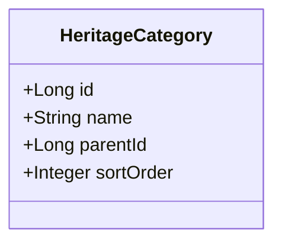

图表来源
- [HeritageCategory.java](file://backend/src/main/java/com/heritage/entity/HeritageCategory.java#L1-L26)

- 树形管理
  - DTO：HeritageCategoryTreeVO 提供树形结构的输出载体，包含 children 列表
  - 控制器：HeritageCategoryController 暴露分类树接口
  - 服务：HeritageCategoryService 提供树形组装能力

章节来源
- [HeritageCategory.java](file://backend/src/main/java/com/heritage/entity/HeritageCategory.java#L1-L26)
- [HeritageCategoryTreeVO.java](file://backend/src/main/java/com/heritage/dto/HeritageCategoryTreeVO.java#L1-L22)
- [HeritageCategoryController.java](file://backend/src/main/java/com/heritage/controller/HeritageCategoryController.java#L1-L30)
- [HeritageCategoryService.java](file://backend/src/main/java/com/heritage/service/HeritageCategoryService.java#L1-L16)

### 传承项目（HeritageProject）实体
- 设计要点
  - 与分类的关联：categoryId 外键指向 heritage_category
  - 项目信息：name、description、applyUnit、protectUnit
  - 多媒体与传承人：通过关联表与媒体表进行扩展
- 数据模型类图

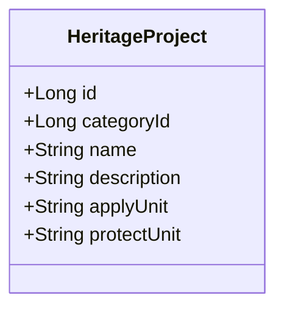

图表来源
- [HeritageProject.java](file://backend/src/main/java/com/heritage/entity/HeritageProject.java#L1-L32)

- 业务规则
  - 分类外键约束：categoryId 必须存在且有效
  - 描述与单位字段为必填，保障项目信息完整性

章节来源
- [HeritageProject.java](file://backend/src/main/java/com/heritage/entity/HeritageProject.java#L1-L32)
- [heritage.sql](file://backend/src/main/resources/sql/heritage.sql#L16-L25)

### 传承人（HeritageInheritor）模型
- 设计要点
  - 基本信息：name、gender、birthDate、nation
  - 展示资源：photo 用于头像或作品展示
  - 简介：description 用于详细说明
- 数据模型类图

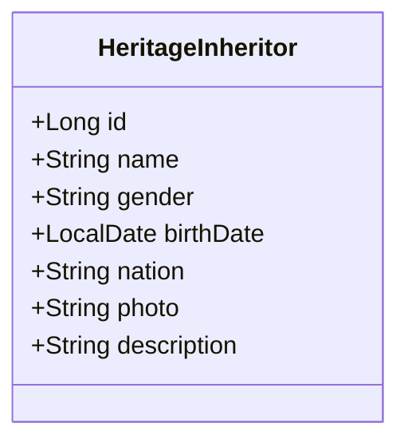

图表来源
- [HeritageInheritor.java](file://backend/src/main/java/com/heritage/entity/HeritageInheritor.java#L1-L37)

- 索引与检索
  - name 建有索引，便于按名称检索与去重

章节来源
- [HeritageInheritor.java](file://backend/src/main/java/com/heritage/entity/HeritageInheritor.java#L1-L37)
- [heritage.sql](file://backend/src/main/resources/sql/heritage.sql#L38-L48)

### 项目-传承人关联（HeritageProjectInheritor）多对多关系
- 设计要点
  - 关联表：记录项目与传承人的绑定关系
  - 唯一性：联合唯一索引（projectId, inheritorId）防止重复绑定
  - 索引：分别对 projectId 与 inheritorId 建立索引，提升查询效率
- ER 关系图

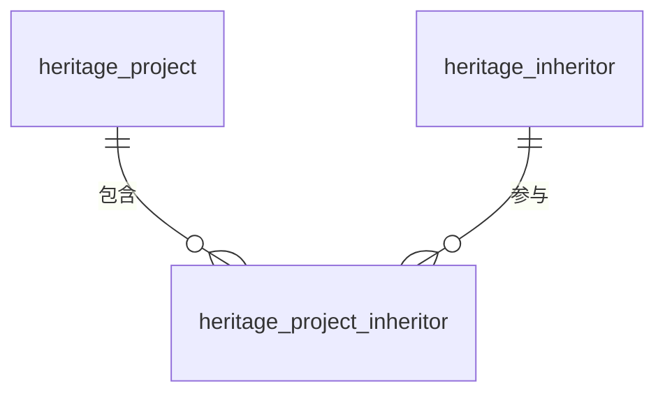

图表来源
- [HeritageProjectInheritor.java](file://backend/src/main/java/com/heritage/entity/HeritageProjectInheritor.java#L1-L23)
- [heritage.sql](file://backend/src/main/resources/sql/heritage.sql#L50-L58)

- 业务规则
  - 一个项目可绑定多个传承人，一个传承人也可参与多个项目
  - 绑定关系必须唯一，避免重复关联

章节来源
- [HeritageProjectInheritor.java](file://backend/src/main/java/com/heritage/entity/HeritageProjectInheritor.java#L1-L23)
- [heritage.sql](file://backend/src/main/resources/sql/heritage.sql#L50-L58)

### 文化媒体（HeritageProjectMedia）模型
- 设计要点
  - 多媒体类型：mediaType 支持展示图、工艺流程图、视频等
  - 排序：sortOrder 控制资源展示顺序
  - 索引：对（project_id, media_type）建立复合索引，支持按类型检索
- 数据模型类图

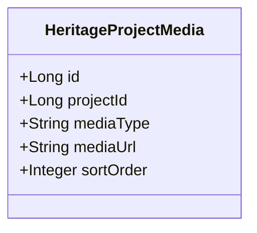

图表来源
- [HeritageProjectMedia.java](file://backend/src/main/java/com/heritage/entity/HeritageProjectMedia.java#L1-L29)

- 业务规则
  - 项目外键约束：projectId 必须存在且有效
  - 类型与URL：mediaType 与 mediaUrl 为必填，保障资源可访问性

章节来源
- [HeritageProjectMedia.java](file://backend/src/main/java/com/heritage/entity/HeritageProjectMedia.java#L1-L29)
- [heritage.sql](file://backend/src/main/resources/sql/heritage.sql#L27-L36)

### 项目详情与媒体聚合（VO）
- HeritageProjectDetailVO
  - 职责：封装项目详情、分类名称、媒体列表与传承人列表
  - 关键字段：id、categoryId、categoryName、name、description、applyUnit、protectUnit、medias、inheritors
- 数据模型类图

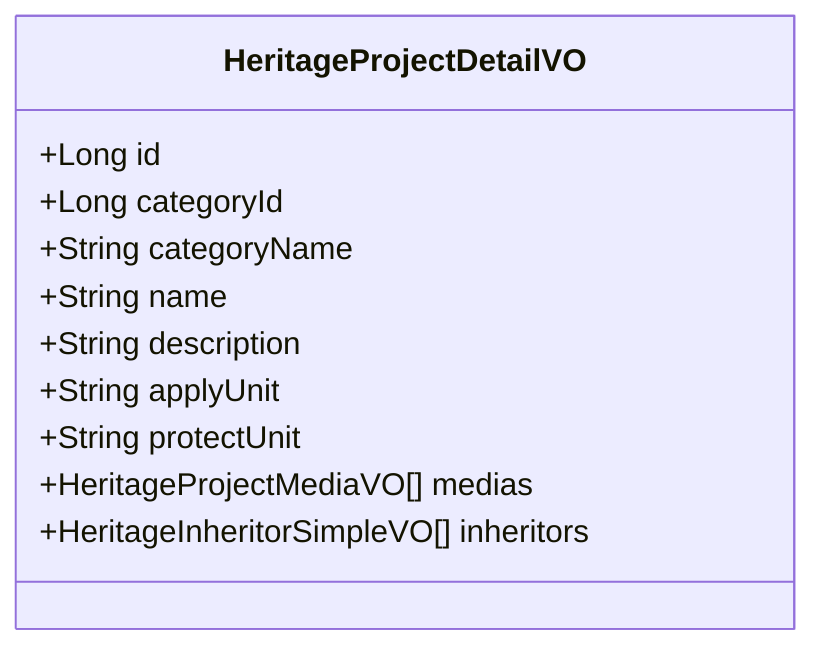

图表来源
- [HeritageProjectDetailVO.java](file://backend/src/main/java/com/heritage/dto/HeritageProjectDetailVO.java#L1-L30)

- 业务规则
  - medias 与 inheritors 为聚合字段，用于一次性返回项目相关资源
  - 适用于详情页与列表页的数据拼装

章节来源
- [HeritageProjectDetailVO.java](file://backend/src/main/java/com/heritage/dto/HeritageProjectDetailVO.java#L1-L30)

### 传承人详情（VO）
- HeritageInheritorDetailVO
  - 职责：封装传承人信息与参与的项目列表
  - 关键字段：id、name、gender、birthDate、nation、photo、description、projects
- 数据模型类图

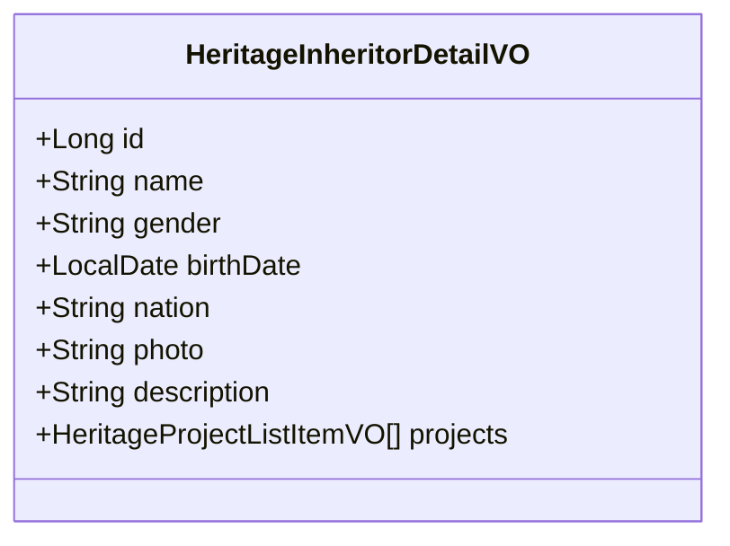

图表来源
- [HeritageInheritorDetailVO.java](file://backend/src/main/java/com/heritage/dto/HeritageInheritorDetailVO.java#L1-L29)

章节来源
- [HeritageInheritorDetailVO.java](file://backend/src/main/java/com/heritage/dto/HeritageInheritorDetailVO.java#L1-L29)

### 分类创建请求（DTO）
- HeritageCategoryCreateRequest
  - 职责：接收分类创建请求参数
  - 关键字段：name、parentId、sortOrder
- 数据模型类图

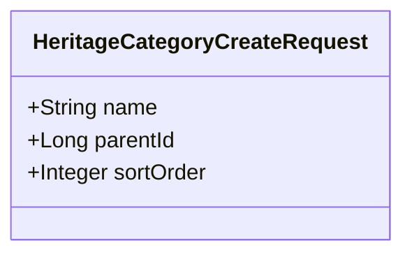

图表来源
- [HeritageCategoryCreateRequest.java](file://backend/src/main/java/com/heritage/dto/HeritageCategoryCreateRequest.java#L1-L17)

章节来源
- [HeritageCategoryCreateRequest.java](file://backend/src/main/java/com/heritage/dto/HeritageCategoryCreateRequest.java#L1-L17)

## 依赖分析
- 实体间依赖
  - HeritageProject 依赖 HeritageCategory（外键）
  - HeritageProjectInheritor 连接 HeritageProject 与 HeritageInheritor（多对多）
  - HeritageProjectMedia 依赖 HeritageProject（外键）
- 服务层依赖
  - HeritageCategoryService、HeritageProjectService、HeritageInheritorService 分别管理对应实体
- 控制器依赖
  - HeritageCategoryController 依赖 HeritageCategoryService

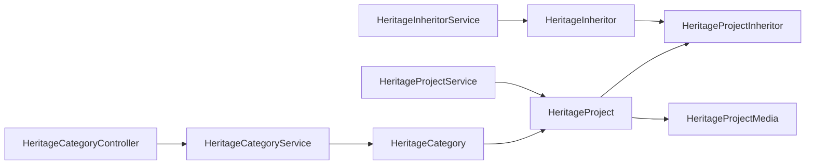

图表来源
- [HeritageCategory.java](file://backend/src/main/java/com/heritage/entity/HeritageCategory.java#L1-L26)
- [HeritageProject.java](file://backend/src/main/java/com/heritage/entity/HeritageProject.java#L1-L32)
- [HeritageInheritor.java](file://backend/src/main/java/com/heritage/entity/HeritageInheritor.java#L1-L37)
- [HeritageProjectInheritor.java](file://backend/src/main/java/com/heritage/entity/HeritageProjectInheritor.java#L1-L23)
- [HeritageProjectMedia.java](file://backend/src/main/java/com/heritage/entity/HeritageProjectMedia.java#L1-L29)
- [HeritageCategoryService.java](file://backend/src/main/java/com/heritage/service/HeritageCategoryService.java#L1-L16)
- [HeritageProjectService.java](file://backend/src/main/java/com/heritage/service/HeritageProjectService.java#L1-L36)
- [HeritageInheritorService.java](file://backend/src/main/java/com/heritage/service/HeritageInheritorService.java#L1-L29)
- [HeritageCategoryController.java](file://backend/src/main/java/com/heritage/controller/HeritageCategoryController.java#L1-L30)

章节来源
- [HeritageCategory.java](file://backend/src/main/java/com/heritage/entity/HeritageCategory.java#L1-L26)
- [HeritageProject.java](file://backend/src/main/java/com/heritage/entity/HeritageProject.java#L1-L32)
- [HeritageInheritor.java](file://backend/src/main/java/com/heritage/entity/HeritageInheritor.java#L1-L37)
- [HeritageProjectInheritor.java](file://backend/src/main/java/com/heritage/entity/HeritageProjectInheritor.java#L1-L23)
- [HeritageProjectMedia.java](file://backend/src/main/java/com/heritage/entity/HeritageProjectMedia.java#L1-L29)
- [HeritageCategoryService.java](file://backend/src/main/java/com/heritage/service/HeritageCategoryService.java#L1-L16)
- [HeritageProjectService.java](file://backend/src/main/java/com/heritage/service/HeritageProjectService.java#L1-L36)
- [HeritageInheritorService.java](file://backend/src/main/java/com/heritage/service/HeritageInheritorService.java#L1-L29)
- [HeritageCategoryController.java](file://backend/src/main/java/com/heritage/controller/HeritageCategoryController.java#L1-L30)

## 性能考虑
- 索引策略
  - heritage_category：idx_parent_id（加速树形查询）
  - heritage_project：idx_category_id（加速分类筛选）
  - heritage_project_media：idx_project_id、idx_project_type（加速按项目与类型检索）
  - heritage_inheritor：idx_name（加速按名称检索）
  - heritage_project_inheritor：uk_project_inheritor、idx_project_id、idx_inheritor_id（保证唯一性与高效查询）
- 查询模式
  - 树形查询：先查根节点，再递归加载子节点
  - 详情聚合：一次查询项目、媒体、传承人，减少往返
- 缓存建议
  - 分类树与热门项目详情可引入缓存，降低数据库压力

## 故障排查指南
- 常见问题与定位
  - 分类树为空：检查 heritage_category 表是否存在数据与索引是否生效
  - 项目详情缺失媒体：确认 heritage_project_media 是否存在且按项目与类型正确索引
  - 传承人重复绑定：检查 heritage_project_inheritor 的唯一索引是否触发
  - 项目删除后残留媒体：确认删除流程是否级联清理媒体与关联关系
- 排查步骤
  - 核对表结构与索引：参照 heritage.sql
  - 核对DTO/VO字段映射：确保前后端字段一致
  - 核对服务层调用链：从控制器到服务再到实体与SQL

章节来源
- [heritage.sql](file://backend/src/main/resources/sql/heritage.sql#L7-L58)

## 结论
本数据模型以清晰的层级结构与严格的外键约束为基础，实现了非遗分类、项目、传承人与多媒体资源的有机整合。通过合理的索引与VO聚合，兼顾了查询性能与前端展示需求。建议在后续迭代中完善内容审核与文化价值保护策略，确保数据质量与文化安全。

## 附录

### ER 图（逻辑）
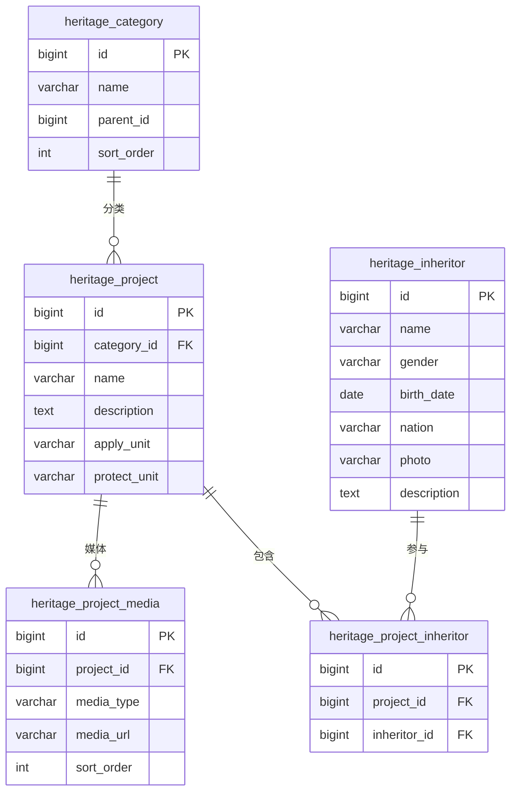

图表来源
- [heritage.sql](file://backend/src/main/resources/sql/heritage.sql#L7-L58)

### 表关系说明与业务规则
- heritage_category → heritage_project：一对多，按 parentId 维护树形层级
- heritage_project → heritage_project_media：一对多，按项目与类型组织资源
- heritage_project ↔ heritage_inheritor：多对多，通过 heritage_project_inheritor 绑定
- 业务规则
  - 分类树：支持无限层级，排序由 sort_order 控制
  - 项目信息：categoryId 必填，描述与单位必填
  - 媒体资源：按类型与排序组织，支持展示图、流程图、视频等
  - 传承人：按名称索引，支持详情聚合展示
  - 关联唯一性：项目-传承人绑定唯一，避免重复

章节来源
- [数据库设计.md](file://TODO/数据库设计.md#L325-L337)
- [heritage.sql](file://backend/src/main/resources/sql/heritage.sql#L7-L58)