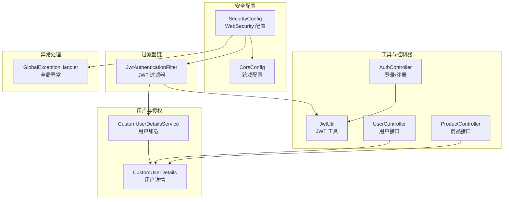
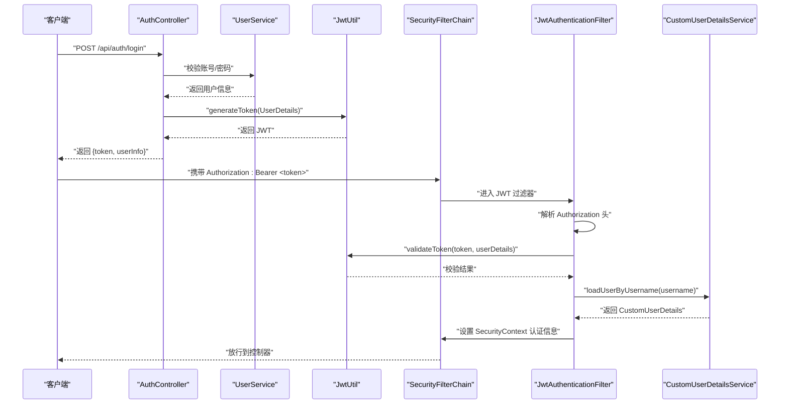
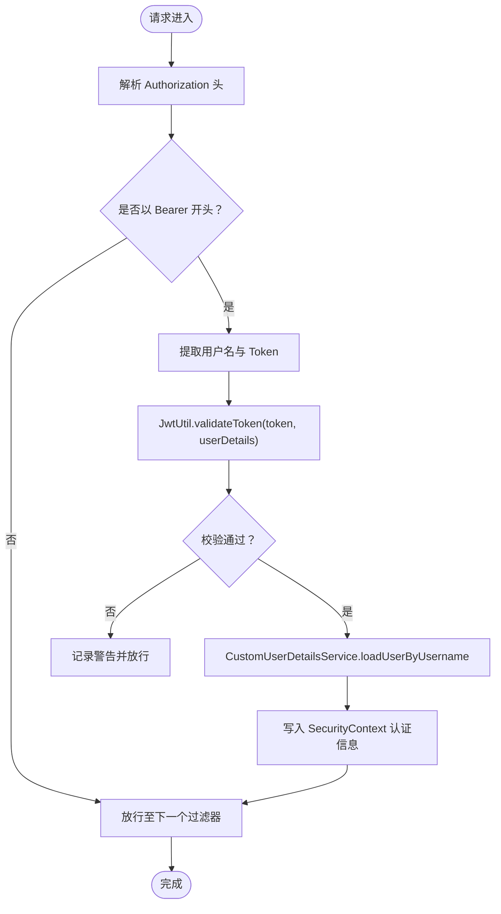
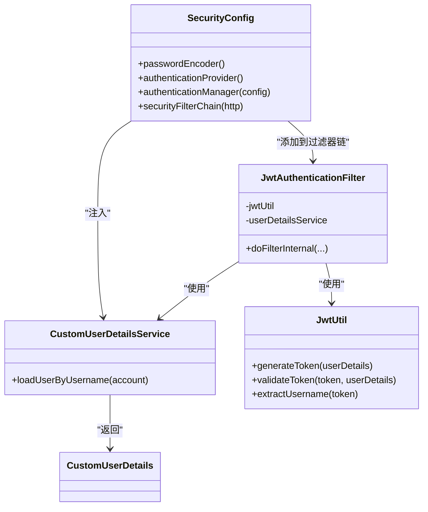
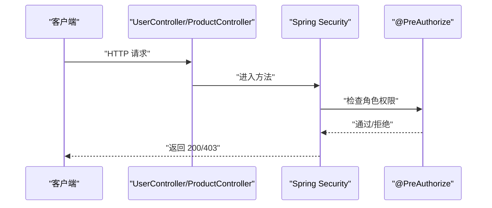
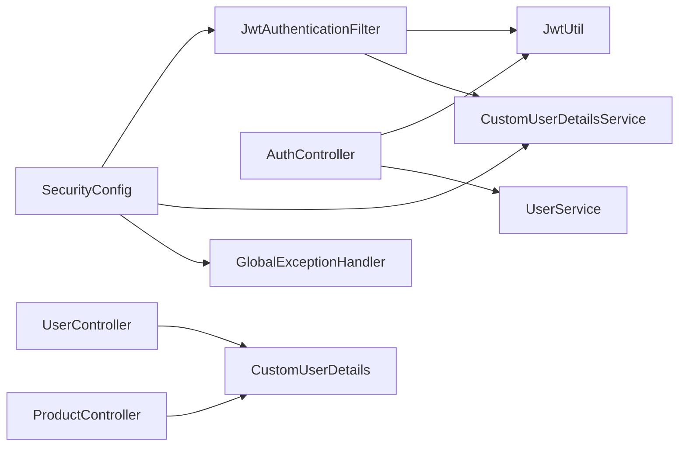

# 安全架构设计

<cite>
**本文引用的文件**
- [SecurityConfig.java](file://backend/src/main/java/com/heritage/config/SecurityConfig.java)
- [JwtAuthenticationFilter.java](file://backend/src/main/java/com/heritage/security/JwtAuthenticationFilter.java)
- [CustomUserDetailsService.java](file://backend/src/main/java/com/heritage/security/CustomUserDetailsService.java)
- [CustomUserDetails.java](file://backend/src/main/java/com/heritage/security/CustomUserDetails.java)
- [JwtUtil.java](file://backend/src/main/java/com/heritage/util/JwtUtil.java)
- [AuthController.java](file://backend/src/main/java/com/heritage/controller/AuthController.java)
- [UserController.java](file://backend/src/main/java/com/heritage/controller/UserController.java)
- [ProductController.java](file://backend/src/main/java/com/heritage/controller/ProductController.java)
- [GlobalExceptionHandler.java](file://backend/src/main/java/com/heritage/common/GlobalExceptionHandler.java)
- [application.yml](file://backend/src/main/resources/application.yml)
- [CorsConfig.java](file://backend/src/main/java/com/heritage/config/CorsConfig.java)
- [UserServiceImpl.java](file://backend/src/main/java/com/heritage/service/impl/UserServiceImpl.java)
</cite>

## 目录
1. [简介](#简介)
2. [项目结构](#项目结构)
3. [核心组件](#核心组件)
4. [架构总览](#架构总览)
5. [详细组件分析](#详细组件分析)
6. [依赖关系分析](#依赖关系分析)
7. [性能与安全特性](#性能与安全特性)
8. [故障排查指南](#故障排查指南)
9. [结论](#结论)

## 简介
本文件为“非遗产品智能定制商城系统”的安全架构设计文档，聚焦于基于 JWT 的无状态认证机制、Spring Security 配置与自定义过滤器、RBAC 权限控制与方法级安全、密码加密方案、会话管理策略以及 CSRF 防护现状与建议。文档同时给出安全配置类与核心组件的实现要点、调用流程图与依赖关系图，并提供安全最佳实践与常见威胁的防护建议。

## 项目结构
后端采用 Spring Boot + Spring Security 架构，安全相关代码主要分布在以下包与文件：
- 配置层：SecurityConfig（Web 安全）、CorsConfig（跨域）
- 过滤器层：JwtAuthenticationFilter（JWT 解析与认证）
- 用户体系：CustomUserDetails、CustomUserDetailsService（用户加载与授权）
- 工具层：JwtUtil（JWT 生成与校验）
- 控制器层：AuthController（登录/注册）、UserController、ProductController（方法级 RBAC）
- 全局异常：GlobalExceptionHandler（统一异常映射）

图表来源
- [SecurityConfig.java](file://backend/src/main/java/com/heritage/config/SecurityConfig.java#L22-L66)
- [JwtAuthenticationFilter.java](file://backend/src/main/java/com/heritage/security/JwtAuthenticationFilter.java#L24-L72)
- [CustomUserDetailsService.java](file://backend/src/main/java/com/heritage/security/CustomUserDetailsService.java#L17-L39)
- [CustomUserDetails.java](file://backend/src/main/java/com/heritage/security/CustomUserDetails.java#L10-L23)
- [JwtUtil.java](file://backend/src/main/java/com/heritage/util/JwtUtil.java#L18-L81)
- [AuthController.java](file://backend/src/main/java/com/heritage/controller/AuthController.java#L21-L48)
- [UserController.java](file://backend/src/main/java/com/heritage/controller/UserController.java#L24-L91)
- [ProductController.java](file://backend/src/main/java/com/heritage/controller/ProductController.java#L31-L53)
- [GlobalExceptionHandler.java](file://backend/src/main/java/com/heritage/common/GlobalExceptionHandler.java#L14-L62)

章节来源
- [SecurityConfig.java](file://backend/src/main/java/com/heritage/config/SecurityConfig.java#L22-L66)
- [CorsConfig.java](file://backend/src/main/java/com/heritage/config/CorsConfig.java#L10-L26)

## 核心组件
- 安全配置类 SecurityConfig：启用 Web 安全与方法级安全，禁用 CSRF，设置无状态会话，配置放行路径与 JWT 过滤器。
- 自定义 JWT 过滤器 JwtAuthenticationFilter：从 Authorization 头解析 Bearer Token，调用 JwtUtil 校验，加载用户详情并写入 SecurityContext。
- 用户详情与加载器：CustomUserDetails 扩展 Spring Security User，携带用户 ID；CustomUserDetailsService 基于账户查询用户并授予 ROLE_* 角色。
- JWT 工具 JwtUtil：负责密钥生成、Token 生成、解析与校验。
- 认证控制器 AuthController：登录时生成 JWT 返回给客户端。
- 方法级 RBAC：通过 PreAuthorize 注解在控制器方法上声明角色权限。
- 全局异常处理：对认证/授权异常进行统一响应。

章节来源
- [SecurityConfig.java](file://backend/src/main/java/com/heritage/config/SecurityConfig.java#L22-L66)
- [JwtAuthenticationFilter.java](file://backend/src/main/java/com/heritage/security/JwtAuthenticationFilter.java#L24-L72)
- [CustomUserDetails.java](file://backend/src/main/java/com/heritage/security/CustomUserDetails.java#L10-L23)
- [CustomUserDetailsService.java](file://backend/src/main/java/com/heritage/security/CustomUserDetailsService.java#L17-L39)
- [JwtUtil.java](file://backend/src/main/java/com/heritage/util/JwtUtil.java#L18-L81)
- [AuthController.java](file://backend/src/main/java/com/heritage/controller/AuthController.java#L21-L48)
- [UserController.java](file://backend/src/main/java/com/heritage/controller/UserController.java#L57-L89)
- [ProductController.java](file://backend/src/main/java/com/heritage/controller/ProductController.java#L31-L53)
- [GlobalExceptionHandler.java](file://backend/src/main/java/com/heritage/common/GlobalExceptionHandler.java#L14-L62)

## 架构总览
系统采用无状态认证，客户端登录成功后获得 JWT，后续请求在 Authorization 头中携带 Bearer Token。JWT 过滤器在每个请求到达控制器前解析并验证 Token，将认证信息写入 SecurityContext，控制器可基于方法注解进行 RBAC 控制。

图表来源
- [AuthController.java](file://backend/src/main/java/com/heritage/controller/AuthController.java#L33-L46)
- [JwtUtil.java](file://backend/src/main/java/com/heritage/util/JwtUtil.java#L61-L79)
- [JwtAuthenticationFilter.java](file://backend/src/main/java/com/heritage/security/JwtAuthenticationFilter.java#L29-L70)
- [CustomUserDetailsService.java](file://backend/src/main/java/com/heritage/security/CustomUserDetailsService.java#L21-L37)
- [SecurityConfig.java](file://backend/src/main/java/com/heritage/config/SecurityConfig.java#L50-L65)

## 详细组件分析

### 基于 JWT 的无状态认证机制
- Token 生成：登录成功后，AuthController 使用 JwtUtil 为用户构建 UserDetails 并生成 JWT。
- Token 验证：JwtAuthenticationFilter 从请求头提取 Bearer Token，调用 JwtUtil 校验签名与有效期，并通过 CustomUserDetailsService 加载用户详情，最终将认证信息写入 SecurityContext。
- 会话策略：SecurityConfig 设置为无状态会话，避免服务器端会话存储，提升横向扩展能力。

图表来源
- [JwtAuthenticationFilter.java](file://backend/src/main/java/com/heritage/security/JwtAuthenticationFilter.java#L29-L70)
- [JwtUtil.java](file://backend/src/main/java/com/heritage/util/JwtUtil.java#L76-L79)
- [CustomUserDetailsService.java](file://backend/src/main/java/com/heritage/security/CustomUserDetailsService.java#L21-L37)

章节来源
- [AuthController.java](file://backend/src/main/java/com/heritage/controller/AuthController.java#L33-L46)
- [JwtUtil.java](file://backend/src/main/java/com/heritage/util/JwtUtil.java#L18-L81)
- [JwtAuthenticationFilter.java](file://backend/src/main/java/com/heritage/security/JwtAuthenticationFilter.java#L24-L72)
- [SecurityConfig.java](file://backend/src/main/java/com/heritage/config/SecurityConfig.java#L50-L65)

### Spring Security 配置与自定义过滤器
- 安全配置：SecurityConfig 启用 Web 与方法级安全，禁用 CSRF，设置 SessionCreationPolicy 为 STATELESS，放行公开接口（认证、静态资源、Swagger），其余请求均需认证。
- 认证提供者：DaoAuthenticationProvider + BCrypt 密码编码器，结合自定义 UserDetailsService 实现。
- 过滤器链：在 UsernamePasswordAuthenticationFilter 之前插入 JwtAuthenticationFilter，确保在常规表单认证前完成 JWT 校验。

图表来源
- [SecurityConfig.java](file://backend/src/main/java/com/heritage/config/SecurityConfig.java#L22-L66)
- [JwtAuthenticationFilter.java](file://backend/src/main/java/com/heritage/security/JwtAuthenticationFilter.java#L24-L27)
- [CustomUserDetailsService.java](file://backend/src/main/java/com/heritage/security/CustomUserDetailsService.java#L17-L39)
- [JwtUtil.java](file://backend/src/main/java/com/heritage/util/JwtUtil.java#L18-L81)
- [CustomUserDetails.java](file://backend/src/main/java/com/heritage/security/CustomUserDetails.java#L10-L23)

章节来源
- [SecurityConfig.java](file://backend/src/main/java/com/heritage/config/SecurityConfig.java#L22-L66)

### 权限控制策略：RBAC 与方法级安全
- 基于角色的访问控制（RBAC）：CustomUserDetailsService 将用户角色映射为 ROLE_* 授权；控制器方法使用 @PreAuthorize("hasRole('ADMIN')") 或组合条件（如 "hasRole('ADMIN') or hasRole('MERCHANT')"）实现细粒度权限控制。
- 方法级安全：SecurityConfig 启用方法级安全（@EnableMethodSecurity），配合 @PreAuthorize 在控制器层直接声明权限要求，无需在拦截器中重复判断。

图表来源
- [UserController.java](file://backend/src/main/java/com/heritage/controller/UserController.java#L57-L89)
- [ProductController.java](file://backend/src/main/java/com/heritage/controller/ProductController.java#L31-L53)
- [SecurityConfig.java](file://backend/src/main/java/com/heritage/config/SecurityConfig.java#L24)

章节来源
- [CustomUserDetailsService.java](file://backend/src/main/java/com/heritage/security/CustomUserDetailsService.java#L31-L36)
- [UserController.java](file://backend/src/main/java/com/heritage/controller/UserController.java#L57-L89)
- [ProductController.java](file://backend/src/main/java/com/heritage/controller/ProductController.java#L31-L53)
- [SecurityConfig.java](file://backend/src/main/java/com/heritage/config/SecurityConfig.java#L24)

### 密码加密方案
- 登录密码采用 BCrypt 编码：SecurityConfig 提供 BCryptPasswordEncoder；UserServiceImpl 在注册与修改密码时使用 PasswordEncoder 进行编码存储。
- 登录校验：UserServiceImpl 使用 matches 比较明文与数据库中 BCrypt 编码值。

章节来源
- [SecurityConfig.java](file://backend/src/main/java/com/heritage/config/SecurityConfig.java#L31-L34)
- [UserServiceImpl.java](file://backend/src/main/java/com/heritage/service/impl/UserServiceImpl.java#L24-L46)
- [UserServiceImpl.java](file://backend/src/main/java/com/heritage/service/impl/UserServiceImpl.java#L58-L60)

### 会话管理与 CSRF 防护
- 会话策略：SecurityConfig 设置 SessionCreationPolicy 为 STATELESS，系统采用无状态会话，不创建/使用服务器端会话。
- CSRF 防护：SecurityConfig 显式禁用 CSRF，适用于前后端分离的无状态 API 场景。

章节来源
- [SecurityConfig.java](file://backend/src/main/java/com/heritage/config/SecurityConfig.java#L52-L53)
- [SecurityConfig.java](file://backend/src/main/java/com/heritage/config/SecurityConfig.java#L52)

### 跨域与前端交互
- CORS：CorsConfig 提供宽松的跨域策略（允许所有源、方法与头部），便于前端调试与联调。
- 建议：生产环境应限制允许的源与头部，仅开放必要路径。

章节来源
- [CorsConfig.java](file://backend/src/main/java/com/heritage/config/CorsConfig.java#L12-L25)

### 异常处理与安全响应
- 全局异常：GlobalExceptionHandler 对 AccessDeniedException、AuthenticationException、ClassCastException 等进行统一处理，返回标准化错误码与消息。
- 安全异常映射：未登录/过期映射为 401，无权限映射为 403。

章节来源
- [GlobalExceptionHandler.java](file://backend/src/main/java/com/heritage/common/GlobalExceptionHandler.java#L16-L32)

## 依赖关系分析
- 组件耦合：SecurityConfig 作为装配中心，依赖 JwtAuthenticationFilter、UserDetailsService；JwtAuthenticationFilter 依赖 JwtUtil 与 UserDetailsService；AuthController 依赖 JwtUtil 与 UserService。
- 外部依赖：JwtUtil 依赖 Jwt 库与配置项（jwt.secret、jwt.expiration）；SecurityConfig 依赖 Spring Security 核心组件。

图表来源
- [SecurityConfig.java](file://backend/src/main/java/com/heritage/config/SecurityConfig.java#L22-L66)
- [JwtAuthenticationFilter.java](file://backend/src/main/java/com/heritage/security/JwtAuthenticationFilter.java#L24-L27)
- [JwtUtil.java](file://backend/src/main/java/com/heritage/util/JwtUtil.java#L18-L81)
- [AuthController.java](file://backend/src/main/java/com/heritage/controller/AuthController.java#L21-L48)
- [UserController.java](file://backend/src/main/java/com/heritage/controller/UserController.java#L24-L91)
- [ProductController.java](file://backend/src/main/java/com/heritage/controller/ProductController.java#L31-L53)
- [GlobalExceptionHandler.java](file://backend/src/main/java/com/heritage/common/GlobalExceptionHandler.java#L14-L62)

章节来源
- [application.yml](file://backend/src/main/resources/application.yml#L39-L41)

## 性能与安全特性
- 性能特性
  - 无状态会话：避免服务器端会话存储，降低内存与缓存压力，利于水平扩展。
  - 过滤器链轻量：JWT 校验仅在必要路径执行，减少不必要的开销。
- 安全特性
  - JWT 密钥与有效期：JwtUtil 支持配置密钥与过期时间，建议生产环境使用强密钥与合理过期策略。
  - 方法级 RBAC：精确控制接口访问权限，降低越权风险。
  - 参数校验：控制器 DTO 层具备基础字段校验，配合全局异常处理统一响应。

章节来源
- [SecurityConfig.java](file://backend/src/main/java/com/heritage/config/SecurityConfig.java#L52-L53)
- [JwtUtil.java](file://backend/src/main/java/com/heritage/util/JwtUtil.java#L18-L81)
- [application.yml](file://backend/src/main/resources/application.yml#L39-L41)

## 故障排查指南
- 401 未登录/登录过期
  - 可能原因：Token 缺失、格式错误、签名无效、已过期。
  - 排查步骤：确认请求头 Authorization 是否为 Bearer Token；检查 jwt.expiration 与 jwt.secret 配置；核对客户端存储与刷新逻辑。
- 403 无权限访问
  - 可能原因：用户角色不足或方法级权限注解未通过。
  - 排查步骤：确认用户角色映射为 ROLE_*；检查 @PreAuthorize 角色表达式。
- 登录失败
  - 可能原因：账号不存在或密码不匹配。
  - 排查步骤：确认账号唯一性与密码编码一致性；检查 BCrypt 匹配逻辑。
- 跨域问题
  - 可能原因：生产环境 CORS 过于宽松或未正确配置。
  - 排查步骤：调整 CorsConfig 允许的源与头部，仅开放必要路径。

章节来源
- [GlobalExceptionHandler.java](file://backend/src/main/java/com/heritage/common/GlobalExceptionHandler.java#L16-L32)
- [JwtUtil.java](file://backend/src/main/java/com/heritage/util/JwtUtil.java#L76-L79)
- [application.yml](file://backend/src/main/resources/application.yml#L39-L41)

## 结论
本系统采用无状态 JWT 认证与 Spring Security 的方法级 RBAC 控制，结合 BCrypt 密码编码与全局异常处理，形成完整的安全体系。建议在生产环境中强化密钥管理、缩短 Token 过期时间、完善刷新策略与审计日志，并收紧 CORS 策略，持续提升安全性与可观测性。