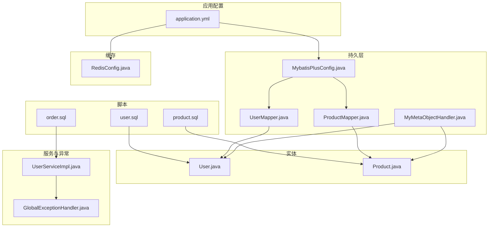
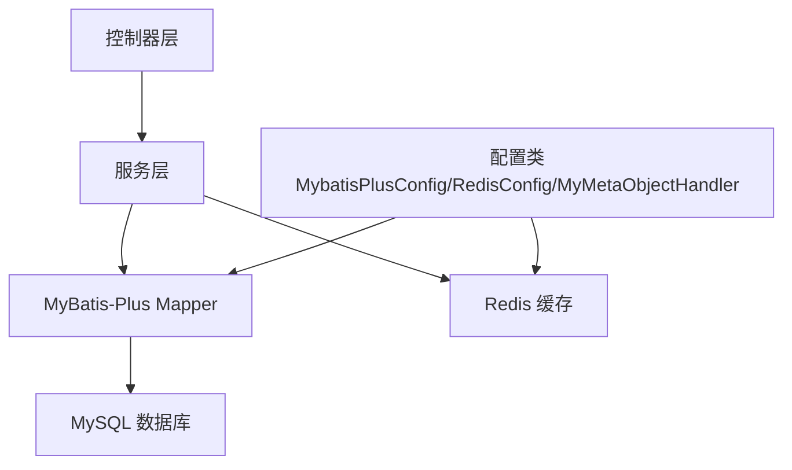
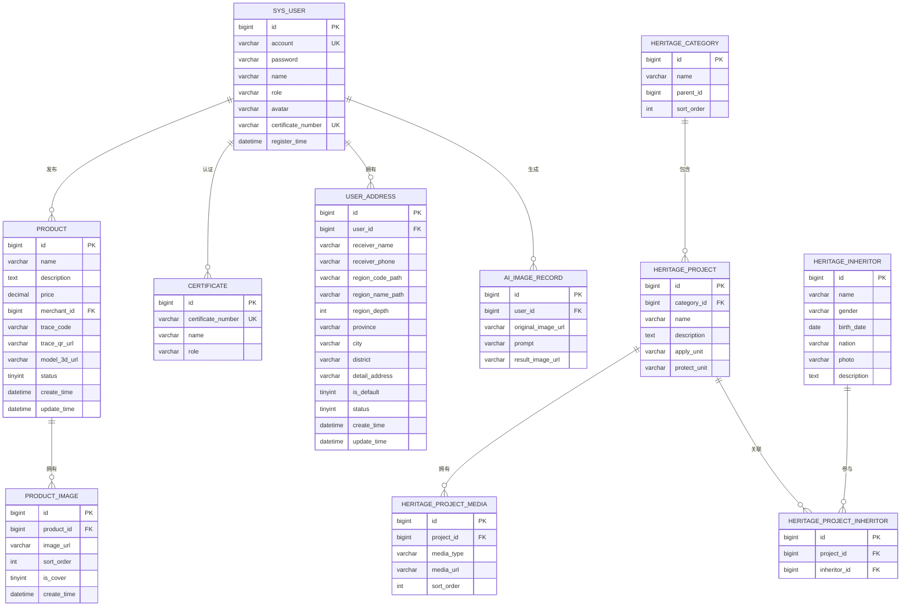
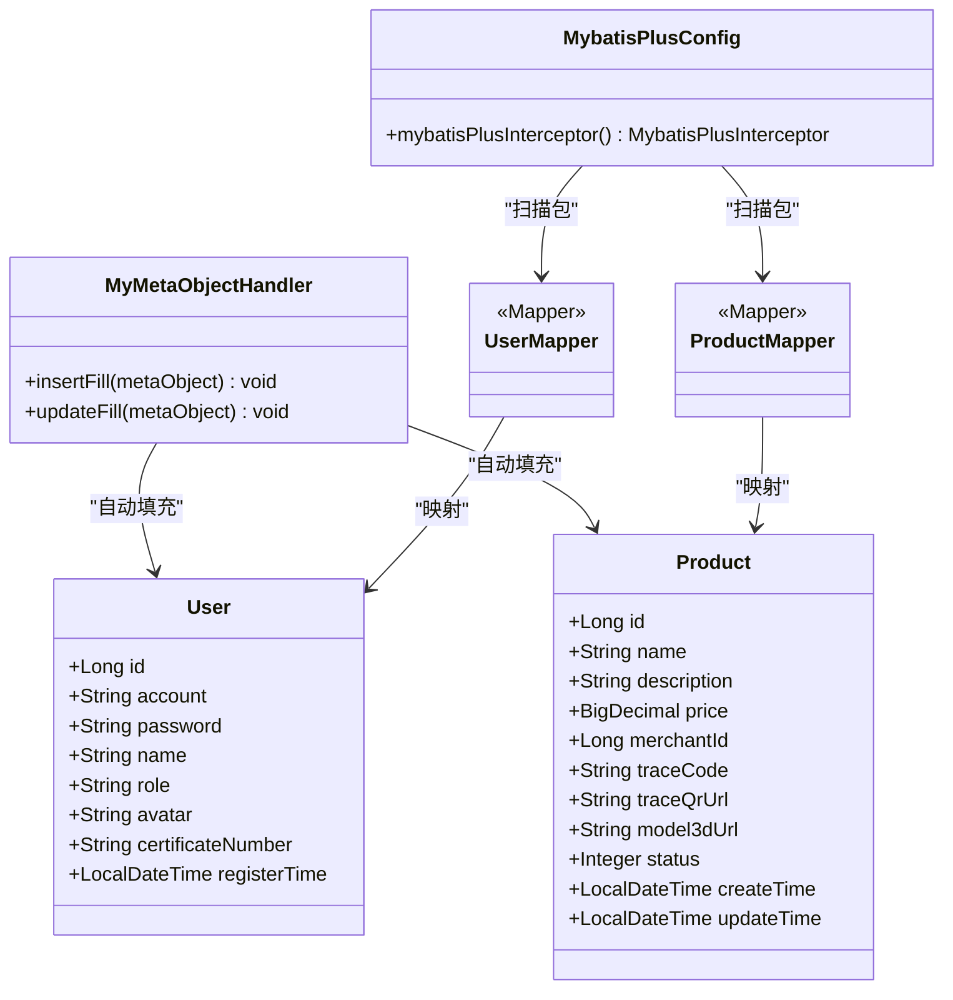
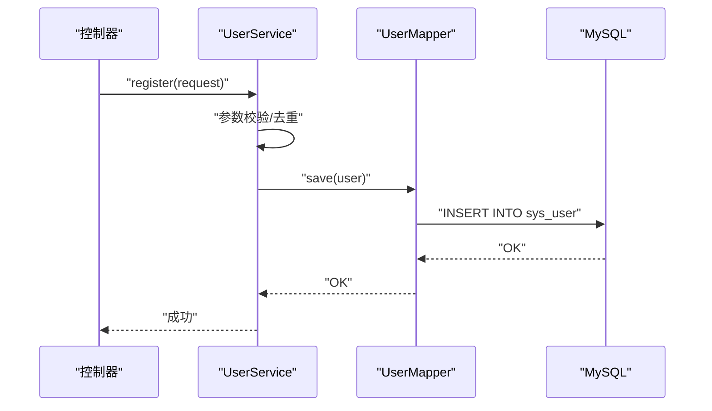
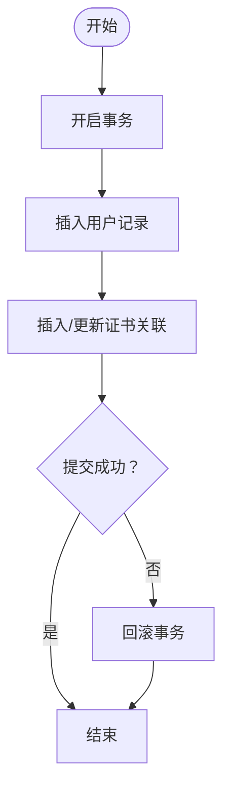
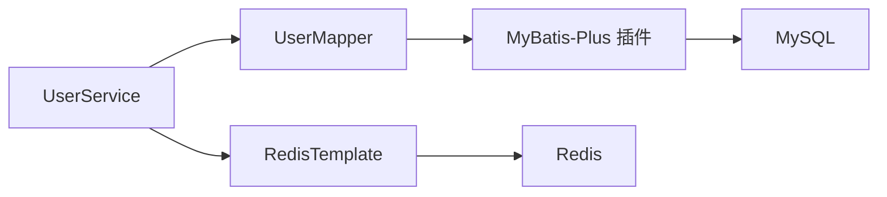

# 数据架构设计

<cite>
**本文引用的文件**
- [application.yml](file://backend/src/main/resources/application.yml)
- [MybatisPlusConfig.java](file://backend/src/main/java/com/heritage/config/MybatisPlusConfig.java)
- [RedisConfig.java](file://backend/src/main/java/com/heritage/config/RedisConfig.java)
- [MyMetaObjectHandler.java](file://backend/src/main/java/com/heritage/config/MyMetaObjectHandler.java)
- [数据库设计.md](file://TODO/数据库设计.md)
- [User.java](file://backend/src/main/java/com/heritage/entity/User.java)
- [Product.java](file://backend/src/main/java/com/heritage/entity/Product.java)
- [UserMapper.java](file://backend/src/main/java/com/heritage/mapper/UserMapper.java)
- [ProductMapper.java](file://backend/src/main/java/com/heritage/mapper/ProductMapper.java)
- [user.sql](file://backend/src/main/resources/sql/user.sql)
- [product.sql](file://backend/src/main/resources/sql/product.sql)
- [order.sql](file://backend/src/main/resources/sql/order.sql)
- [UserServiceImpl.java](file://backend/src/main/java/com/heritage/service/impl/UserServiceImpl.java)
- [GlobalExceptionHandler.java](file://backend/src/main/java/com/heritage/common/GlobalExceptionHandler.java)
</cite>

## 目录
1. [简介](#简介)
2. [项目结构](#项目结构)
3. [核心组件](#核心组件)
4. [架构总览](#架构总览)
5. [详细组件分析](#详细组件分析)
6. [依赖分析](#依赖分析)
7. [性能考虑](#性能考虑)
8. [故障排查指南](#故障排查指南)
9. [结论](#结论)
10. [附录](#附录)

## 简介
本文件为“非遗产品智能定制商城系统”的数据架构设计文档，聚焦于关系型数据库的ER模型设计与表结构优化、MyBatis-Plus配置与使用（通用Mapper、自动填充等）、Redis缓存策略（键设计、过期策略、一致性）、数据访问层设计模式（DAO与Repository）、数据库连接池与事务管理、数据迁移与备份恢复方案，以及性能优化建议。文档以仓库中的数据库设计说明、配置类、实体与Mapper、SQL脚本为基础，结合代码实现进行系统化梳理。

## 项目结构
后端采用Spring Boot工程，数据层由MyBatis-Plus与MySQL驱动构成，缓存采用Redis，配置集中在application.yml中。核心目录与文件如下：
- 配置：application.yml（数据源、Redis、JWT、AI等）
- MyBatis-Plus：MybatisPlusConfig.java（分页、乐观锁、SQL注入拦截器）
- 自动填充：MyMetaObjectHandler.java（insert/update自动填充时间）
- 缓存：RedisConfig.java（Jackson序列化、模板配置）
- 实体与Mapper：User.java、Product.java、UserMapper.java、ProductMapper.java
- SQL脚本：user.sql、product.sql、order.sql等
- 业务与异常：UserServiceImpl.java、GlobalExceptionHandler.java

图表来源
- [application.yml](file://backend/src/main/resources/application.yml#L17-L35)
- [MybatisPlusConfig.java](file://backend/src/main/java/com/heritage/config/MybatisPlusConfig.java#L12-L29)
- [MyMetaObjectHandler.java](file://backend/src/main/java/com/heritage/config/MyMetaObjectHandler.java#L10-L25)
- [RedisConfig.java](file://backend/src/main/java/com/heritage/config/RedisConfig.java#L16-L44)
- [User.java](file://backend/src/main/java/com/heritage/entity/User.java#L9-L37)
- [Product.java](file://backend/src/main/java/com/heritage/entity/Product.java#L12-L48)
- [UserMapper.java](file://backend/src/main/java/com/heritage/mapper/UserMapper.java#L12-L26)
- [ProductMapper.java](file://backend/src/main/java/com/heritage/mapper/ProductMapper.java#L7-L9)
- [user.sql](file://backend/src/main/resources/sql/user.sql#L6-L20)
- [product.sql](file://backend/src/main/resources/sql/product.sql#L1-L16)
- [order.sql](file://backend/src/main/resources/sql/order.sql#L4-L24)
- [UserServiceImpl.java](file://backend/src/main/java/com/heritage/service/impl/UserServiceImpl.java#L20-L46)
- [GlobalExceptionHandler.java](file://backend/src/main/java/com/heritage/common/GlobalExceptionHandler.java#L12-L44)

章节来源
- [application.yml](file://backend/src/main/resources/application.yml#L1-L63)
- [MybatisPlusConfig.java](file://backend/src/main/java/com/heritage/config/MybatisPlusConfig.java#L1-L31)
- [RedisConfig.java](file://backend/src/main/java/com/heritage/config/RedisConfig.java#L1-L46)
- [MyMetaObjectHandler.java](file://backend/src/main/java/com/heritage/config/MyMetaObjectHandler.java#L1-L26)
- [User.java](file://backend/src/main/java/com/heritage/entity/User.java#L1-L38)
- [Product.java](file://backend/src/main/java/com/heritage/entity/Product.java#L1-L50)
- [UserMapper.java](file://backend/src/main/java/com/heritage/mapper/UserMapper.java#L1-L27)
- [ProductMapper.java](file://backend/src/main/java/com/heritage/mapper/ProductMapper.java#L1-L11)
- [user.sql](file://backend/src/main/resources/sql/user.sql#L1-L45)
- [product.sql](file://backend/src/main/resources/sql/product.sql#L1-L45)
- [order.sql](file://backend/src/main/resources/sql/order.sql#L1-L39)
- [UserServiceImpl.java](file://backend/src/main/java/com/heritage/service/impl/UserServiceImpl.java#L1-L181)
- [GlobalExceptionHandler.java](file://backend/src/main/java/com/heritage/common/GlobalExceptionHandler.java#L1-L62)

## 核心组件
- 数据库与连接池：基于application.yml配置MySQL数据源，使用Druid或HikariCP作为默认连接池（由Spring Boot自动装配）。建议在生产环境显式配置连接池参数（最大活跃数、最小空闲、超时等）。
- MyBatis-Plus：启用分页插件（MySQL）、乐观锁插件、SQL注入拦截器，Mapper扫描包为com.heritage.mapper。
- 自动填充：MyMetaObjectHandler对insert/update时自动填充register_time等字段。
- Redis缓存：RedisConfig定义JSON序列化模板，支持缓存注解@EnableCaching。
- 实体与Mapper：User、Product等实体映射至对应表，Mapper继承BaseMapper获得通用CRUD能力。
- 事务与异常：UserServiceImpl使用@Transactional标注业务方法；全局异常处理器统一返回Result。

章节来源
- [application.yml](file://backend/src/main/resources/application.yml#L17-L35)
- [MybatisPlusConfig.java](file://backend/src/main/java/com/heritage/config/MybatisPlusConfig.java#L12-L29)
- [MyMetaObjectHandler.java](file://backend/src/main/java/com/heritage/config/MyMetaObjectHandler.java#L10-L25)
- [RedisConfig.java](file://backend/src/main/java/com/heritage/config/RedisConfig.java#L16-L44)
- [User.java](file://backend/src/main/java/com/heritage/entity/User.java#L9-L37)
- [Product.java](file://backend/src/main/java/com/heritage/entity/Product.java#L12-L48)
- [UserMapper.java](file://backend/src/main/java/com/heritage/mapper/UserMapper.java#L12-L26)
- [ProductMapper.java](file://backend/src/main/java/com/heritage/mapper/ProductMapper.java#L7-L9)
- [UserServiceImpl.java](file://backend/src/main/java/com/heritage/service/impl/UserServiceImpl.java#L20-L46)
- [GlobalExceptionHandler.java](file://backend/src/main/java/com/heritage/common/GlobalExceptionHandler.java#L12-L44)

## 架构总览
系统数据层采用“实体-映射-服务-控制器”分层，MyBatis-Plus提供通用Mapper与插件增强，Redis提供热点数据缓存，事务在服务层控制。

图表来源
- [MybatisPlusConfig.java](file://backend/src/main/java/com/heritage/config/MybatisPlusConfig.java#L12-L29)
- [RedisConfig.java](file://backend/src/main/java/com/heritage/config/RedisConfig.java#L16-L44)
- [MyMetaObjectHandler.java](file://backend/src/main/java/com/heritage/config/MyMetaObjectHandler.java#L10-L25)
- [UserMapper.java](file://backend/src/main/java/com/heritage/mapper/UserMapper.java#L12-L26)
- [ProductMapper.java](file://backend/src/main/java/com/heritage/mapper/ProductMapper.java#L7-L9)

## 详细组件分析

### ER模型与表结构设计
- 设计原则：遵循第三范式、可扩展、安全（密码加密）、角色分离。
- 核心表与关系：
  - sys_user（1）——（N）product：商家/管理员发布商品
  - product（1）——（N）product_image：商品多图
  - sys_user（1）——（N）ai_image_record：用户生图历史
  - sys_user（1）——（N）certificate：实名认证关联
  - sys_user（1）——（N）user_address：用户多地址
  - heritage_category（1）——（N）heritage_project：分类-项目
  - heritage_project（1）——（N）heritage_project_media：项目媒体资源
  - heritage_project（1）——（N）heritage_project_inheritor：项目-传承人
  - heritage_inheritor（1）——（N）heritage_project_inheritor：传承人参与项目

图表来源
- [数据库设计.md](file://TODO/数据库设计.md#L325-L337)
- [user.sql](file://backend/src/main/resources/sql/user.sql#L6-L20)
- [product.sql](file://backend/src/main/resources/sql/product.sql#L1-L16)
- [order.sql](file://backend/src/main/resources/sql/order.sql#L4-L24)

章节来源
- [数据库设计.md](file://TODO/数据库设计.md#L1-L370)
- [user.sql](file://backend/src/main/resources/sql/user.sql#L1-L45)
- [product.sql](file://backend/src/main/resources/sql/product.sql#L1-L45)
- [order.sql](file://backend/src/main/resources/sql/order.sql#L1-L39)

### MyBatis-Plus配置与使用
- 插件配置：分页（MySQL）、乐观锁、SQL注入拦截（防止全表更新/删除）。
- Mapper扫描：com.heritage.mapper包下自动扫描BaseMapper接口。
- 通用Mapper：UserMapper、ProductMapper继承BaseMapper，获得通用CRUD。
- 自动填充：MyMetaObjectHandler在插入/更新时填充register_time等字段。

图表来源
- [MybatisPlusConfig.java](file://backend/src/main/java/com/heritage/config/MybatisPlusConfig.java#L12-L29)
- [MyMetaObjectHandler.java](file://backend/src/main/java/com/heritage/config/MyMetaObjectHandler.java#L10-L25)
- [UserMapper.java](file://backend/src/main/java/com/heritage/mapper/UserMapper.java#L12-L26)
- [ProductMapper.java](file://backend/src/main/java/com/heritage/mapper/ProductMapper.java#L7-L9)
- [User.java](file://backend/src/main/java/com/heritage/entity/User.java#L9-L37)
- [Product.java](file://backend/src/main/java/com/heritage/entity/Product.java#L12-L48)

章节来源
- [MybatisPlusConfig.java](file://backend/src/main/java/com/heritage/config/MybatisPlusConfig.java#L1-L31)
- [MyMetaObjectHandler.java](file://backend/src/main/java/com/heritage/config/MyMetaObjectHandler.java#L1-L26)
- [UserMapper.java](file://backend/src/main/java/com/heritage/mapper/UserMapper.java#L1-L27)
- [ProductMapper.java](file://backend/src/main/java/com/heritage/mapper/ProductMapper.java#L1-L11)
- [User.java](file://backend/src/main/java/com/heritage/entity/User.java#L1-L38)
- [Product.java](file://backend/src/main/java/com/heritage/entity/Product.java#L1-L50)

### Redis缓存策略
- 序列化：使用Jackson2JsonRedisSerializer存储对象，StringRedisSerializer存储键。
- 键设计：采用“模块:业务ID:子资源”形式，如“user:123:profile”、“product:456:images”。
- 过期策略：对高频读低写的数据设置短 TTL（如5-15分钟），对静态数据设置较长 TTL（如1小时以上）。
- 一致性：写操作先更新DB，再删除缓存；读操作命中不到则回源DB并写入缓存。
- 并发：热点key使用本地互斥锁或分布式锁，避免缓存击穿。

章节来源
- [RedisConfig.java](file://backend/src/main/java/com/heritage/config/RedisConfig.java#L16-L44)

### 数据访问层设计模式
- DAO模式：Mapper接口承担DAO职责，提供CRUD与条件查询。
- Repository模式：Service层封装业务仓储，组合Mapper实现复杂查询与事务控制。
- 示例：UserServiceImpl组合UserMapper，实现注册、登录、分页查询等业务。

图表来源
- [UserServiceImpl.java](file://backend/src/main/java/com/heritage/service/impl/UserServiceImpl.java#L26-L46)
- [UserMapper.java](file://backend/src/main/java/com/heritage/mapper/UserMapper.java#L12-L26)
- [user.sql](file://backend/src/main/resources/sql/user.sql#L6-L20)

章节来源
- [UserServiceImpl.java](file://backend/src/main/java/com/heritage/service/impl/UserServiceImpl.java#L1-L181)
- [UserMapper.java](file://backend/src/main/java/com/heritage/mapper/UserMapper.java#L1-L27)

### 数据库连接池、事务管理与数据迁移
- 连接池：application.yml配置MySQL驱动与URL、用户名、密码；建议在生产显式配置连接池参数。
- 事务：UserServiceImpl使用@Transactional标注业务方法，确保注册、密码更新等操作的原子性。
- 异常：GlobalExceptionHandler统一捕获业务异常与参数校验异常，返回标准Result结构。
- 数据迁移：使用SQL脚本初始化表结构与基础数据（如certificate预置数据、product与product_image样例数据）。

图表来源
- [UserServiceImpl.java](file://backend/src/main/java/com/heritage/service/impl/UserServiceImpl.java#L26-L46)
- [user.sql](file://backend/src/main/resources/sql/user.sql#L22-L44)
- [product.sql](file://backend/src/main/resources/sql/product.sql#L18-L28)

章节来源
- [application.yml](file://backend/src/main/resources/application.yml#L17-L21)
- [UserServiceImpl.java](file://backend/src/main/java/com/heritage/service/impl/UserServiceImpl.java#L137-L181)
- [GlobalExceptionHandler.java](file://backend/src/main/java/com/heritage/common/GlobalExceptionHandler.java#L12-L44)
- [user.sql](file://backend/src/main/resources/sql/user.sql#L1-L45)
- [product.sql](file://backend/src/main/resources/sql/product.sql#L1-L45)

### 订单与支付相关表（扩展）
- orders：订单主表，包含订单号、用户、地址、金额、状态、时间戳等。
- order_item：订单项明细，包含商品快照、单价、数量、小计等。
- 建议：为用户维度的订单查询建立复合索引（user_id, status），为订单号建立唯一索引。

章节来源
- [order.sql](file://backend/src/main/resources/sql/order.sql#L4-L38)

## 依赖分析
- 组件耦合：Service依赖Mapper，Mapper依赖MyBatis-Plus插件与数据库；RedisConfig独立但被缓存使用。
- 外部依赖：MySQL驱动、Redis客户端、Jackson序列化库。
- 潜在风险：跨模块事务一致性、缓存穿透与雪崩、分页上限与排序稳定性。

图表来源
- [UserServiceImpl.java](file://backend/src/main/java/com/heritage/service/impl/UserServiceImpl.java#L20-L46)
- [UserMapper.java](file://backend/src/main/java/com/heritage/mapper/UserMapper.java#L12-L26)
- [MybatisPlusConfig.java](file://backend/src/main/java/com/heritage/config/MybatisPlusConfig.java#L12-L29)
- [RedisConfig.java](file://backend/src/main/java/com/heritage/config/RedisConfig.java#L16-L44)

章节来源
- [UserServiceImpl.java](file://backend/src/main/java/com/heritage/service/impl/UserServiceImpl.java#L1-L181)
- [UserMapper.java](file://backend/src/main/java/com/heritage/mapper/UserMapper.java#L1-L27)
- [MybatisPlusConfig.java](file://backend/src/main/java/com/heritage/config/MybatisPlusConfig.java#L1-L31)
- [RedisConfig.java](file://backend/src/main/java/com/heritage/config/RedisConfig.java#L1-L46)

## 性能考虑
- 查询优化
  - 为高频过滤字段建立合适索引（如sys_user.idx_role、product.idx_merchant_id、orders.idx_user_status）。
  - 使用分页插件限制最大每页数量，避免超大分页。
- 写入优化
  - 批量插入/更新使用MyBatis-Plus批量工具或JDBC批处理。
  - 控制并发写入，必要时引入队列削峰。
- 缓存优化
  - 对热点数据设置合理TTL，避免长期驻留内存。
  - 使用本地缓存（Caffeine）与Redis双层缓存，降低穿透概率。
- 连接池优化
  - 设置最大连接数、空闲超时、获取超时，监控连接池指标。
- 事务优化
  - 将长事务拆分为多个短事务，减少锁竞争。
  - 使用只读事务与乐观锁提升并发性能。

## 故障排查指南
- 登录/认证异常：检查密码编码器匹配逻辑与账户是否存在。
- 参数校验异常：关注MethodArgumentNotValidException与BindException的默认消息。
- 权限异常：AccessDeniedException返回403，确认鉴权链路。
- 业务异常：BusinessException统一捕获并返回友好提示。
- 数据库异常：核对SQL日志与索引使用情况，检查分页上限与排序字段。

章节来源
- [GlobalExceptionHandler.java](file://backend/src/main/java/com/heritage/common/GlobalExceptionHandler.java#L12-L61)
- [UserServiceImpl.java](file://backend/src/main/java/com/heritage/service/impl/UserServiceImpl.java#L26-L75)

## 结论
本数据架构以MyBatis-Plus与Redis为核心，结合合理的ER模型与索引设计，满足非遗商城系统的用户、商品、订单、非遗文化等模块的数据需求。通过自动填充、分页与乐观锁插件提升开发效率与数据一致性；通过缓存策略与连接池配置保障性能与稳定性。建议在生产环境完善连接池参数、缓存一致性策略与监控告警体系。

## 附录
- 数据库初始化脚本位置
  - 用户与证书：[user.sql](file://backend/src/main/resources/sql/user.sql#L1-L45)
  - 商品与图片：[product.sql](file://backend/src/main/resources/sql/product.sql#L1-L45)
  - 订单与订单项：[order.sql](file://backend/src/main/resources/sql/order.sql#L1-L39)
- 配置文件
  - 应用配置：[application.yml](file://backend/src/main/resources/application.yml#L1-L63)
- 关键类
  - MyBatis-Plus配置：[MybatisPlusConfig.java](file://backend/src/main/java/com/heritage/config/MybatisPlusConfig.java#L1-L31)
  - 自动填充：[MyMetaObjectHandler.java](file://backend/src/main/java/com/heritage/config/MyMetaObjectHandler.java#L1-L26)
  - Redis缓存：[RedisConfig.java](file://backend/src/main/java/com/heritage/config/RedisConfig.java#L1-L46)
  - 实体与Mapper：[User.java](file://backend/src/main/java/com/heritage/entity/User.java#L1-L38)、[Product.java](file://backend/src/main/java/com/heritage/entity/Product.java#L1-L50)、[UserMapper.java](file://backend/src/main/java/com/heritage/mapper/UserMapper.java#L1-L27)、[ProductMapper.java](file://backend/src/main/java/com/heritage/mapper/ProductMapper.java#L1-L11)
  - 业务与异常：[UserServiceImpl.java](file://backend/src/main/java/com/heritage/service/impl/UserServiceImpl.java#L1-L181)、[GlobalExceptionHandler.java](file://backend/src/main/java/com/heritage/common/GlobalExceptionHandler.java#L1-L62)