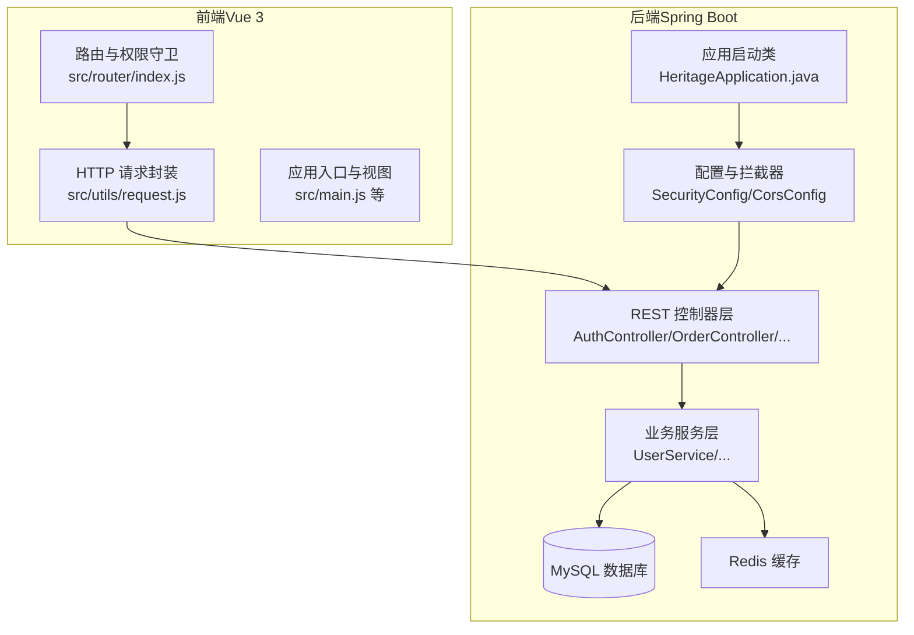
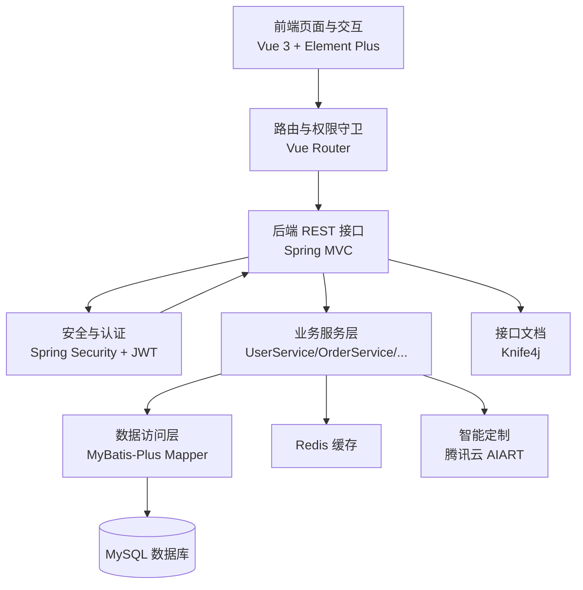
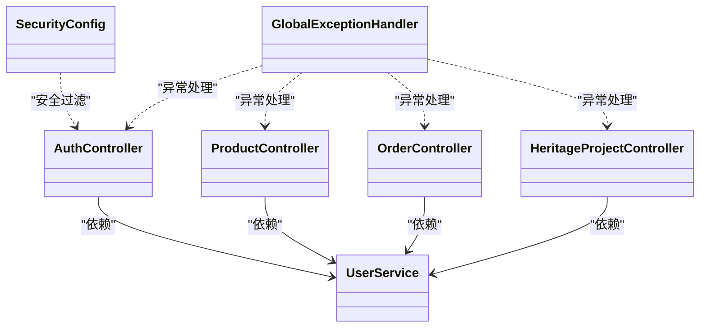
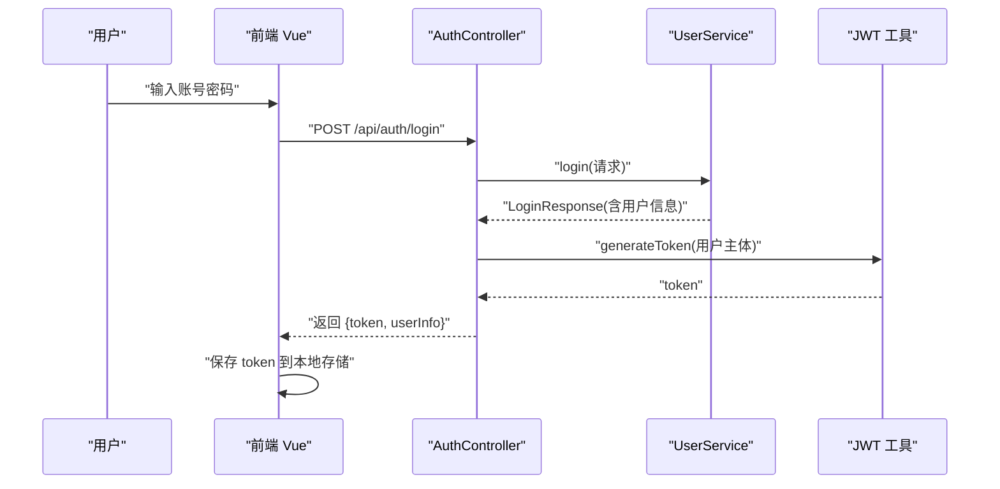
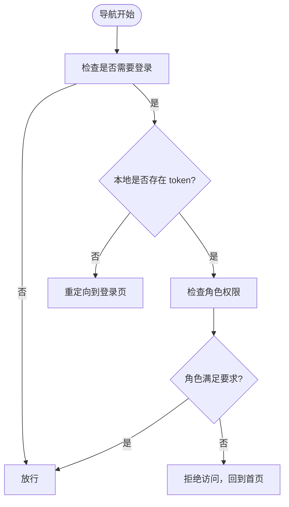
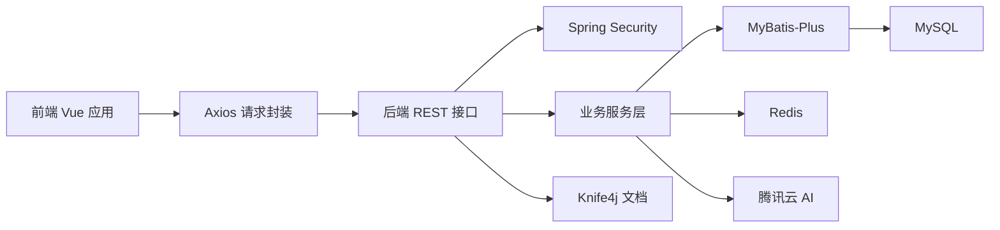
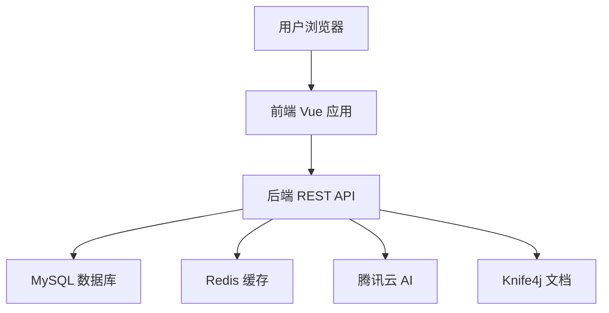

# 整体架构设计

<cite>
**本文引用的文件**
- [HeritageApplication.java](file://backend/src/main/java/com/heritage/HeritageApplication.java)
- [application.yml](file://backend/src/main/resources/application.yml)
- [pom.xml](file://backend/pom.xml)
- [SecurityConfig.java](file://backend/src/main/java/com/heritage/config/SecurityConfig.java)
- [CorsConfig.java](file://backend/src/main/java/com/heritage/config/CorsConfig.java)
- [GlobalExceptionHandler.java](file://backend/src/main/java/com/heritage/common/GlobalExceptionHandler.java)
- [AuthController.java](file://backend/src/main/java/com/heritage/controller/AuthController.java)
- [ProductController.java](file://backend/src/main/java/com/heritage/controller/ProductController.java)
- [OrderController.java](file://backend/src/main/java/com/heritage/controller/OrderController.java)
- [HeritageProjectController.java](file://backend/src/main/java/com/heritage/controller/HeritageProjectController.java)
- [UserService.java](file://backend/src/main/java/com/heritage/service/UserService.java)
- [package.json](file://frontend/package.json)
- [index.js](file://frontend/src/router/index.js)
- [request.js](file://frontend/src/utils/request.js)
- [系统设计.md](file://TODO/系统设计.md)
</cite>

## 目录
1. [引言](#引言)
2. [项目结构](#项目结构)
3. [核心组件](#核心组件)
4. [架构总览](#架构总览)
5. [详细组件分析](#详细组件分析)
6. [依赖分析](#依赖分析)
7. [性能考虑](#性能考虑)
8. [故障排查指南](#故障排查指南)
9. [结论](#结论)
10. [附录](#附录)

## 引言
本文件面向“非遗产品智能定制商城系统”，提供整体架构设计文档。系统采用前后端分离架构，后端基于 Spring Boot，前端基于 Vue 3，通过 RESTful API 协作；数据库采用 MySQL，缓存采用 Redis，文件存储采用本地 uploads 目录。系统以模块化设计为核心，围绕用户管理、商品管理、非遗文化、智能定制、订单交易等模块展开，强调可扩展性与可维护性。

## 项目结构
系统由后端 Spring Boot 应用与前端 Vue 应用组成，二者通过 HTTP/HTTPS 进行通信。后端负责业务逻辑、安全控制、数据持久化与第三方 AI 能力集成；前端负责页面渲染、路由控制、用户交互与 API 请求封装。

图表来源
- [HeritageApplication.java](file://backend/src/main/java/com/heritage/HeritageApplication.java#L1-L13)
- [SecurityConfig.java](file://backend/src/main/java/com/heritage/config/SecurityConfig.java#L1-L67)
- [CorsConfig.java](file://backend/src/main/java/com/heritage/config/CorsConfig.java#L1-L27)
- [AuthController.java](file://backend/src/main/java/com/heritage/controller/AuthController.java#L1-L48)
- [OrderController.java](file://backend/src/main/java/com/heritage/controller/OrderController.java#L1-L67)
- [UserService.java](file://backend/src/main/java/com/heritage/service/UserService.java#L1-L22)
- [application.yml](file://backend/src/main/resources/application.yml#L1-L63)
- [index.js](file://frontend/src/router/index.js#L1-L176)
- [request.js](file://frontend/src/utils/request.js#L1-L45)

章节来源
- [HeritageApplication.java](file://backend/src/main/java/com/heritage/HeritageApplication.java#L1-L13)
- [application.yml](file://backend/src/main/resources/application.yml#L1-L63)
- [pom.xml](file://backend/pom.xml#L1-L129)
- [系统设计.md](file://TODO/系统设计.md#L23-L61)

## 核心组件
- 后端启动与配置
  - 应用入口负责启动 Spring Boot 容器。
  - 安全配置启用无状态 JWT 认证，禁用 CSRF，设置跨域策略，开放静态资源访问。
  - 全局异常处理器集中处理业务异常、认证异常、参数校验异常等。
- 前端路由与请求
  - 路由系统支持主站、管理后台、商家后台三套布局，配合权限守卫实现角色级访问控制。
  - HTTP 请求封装统一设置基础 URL 与 Authorization 头，拦截响应并提示错误。
- 关键模块控制器
  - 认证模块：注册、登录并颁发 JWT。
  - 商品模块：支持管理员与商家维度的商品增删改查、上下架与图片管理。
  - 订单模块：支持下单、分页查询、详情与取消。
  - 非遗项目模块：提供项目列表与详情查询。

章节来源
- [SecurityConfig.java](file://backend/src/main/java/com/heritage/config/SecurityConfig.java#L1-L67)
- [GlobalExceptionHandler.java](file://backend/src/main/java/com/heritage/common/GlobalExceptionHandler.java#L1-L62)
- [AuthController.java](file://backend/src/main/java/com/heritage/controller/AuthController.java#L1-L48)
- [ProductController.java](file://backend/src/main/java/com/heritage/controller/ProductController.java#L1-L130)
- [OrderController.java](file://backend/src/main/java/com/heritage/controller/OrderController.java#L1-L67)
- [HeritageProjectController.java](file://backend/src/main/java/com/heritage/controller/HeritageProjectController.java#L1-L40)
- [index.js](file://frontend/src/router/index.js#L1-L176)
- [request.js](file://frontend/src/utils/request.js#L1-L45)

## 架构总览
系统采用分层架构与微服务思想相结合的设计：
- 表现层（前端）
  - Vue 3 + Element Plus 实现页面与交互；Pinia 状态管理；Vue Router 路由与权限守卫。
- 业务层（后端）
  - 控制器层负责请求接入与权限注解；服务层承载业务规则；实体与 Mapper 负责数据映射。
- 数据访问层（后端）
  - MyBatis-Plus 提供通用 CRUD 与分页；MySQL 存储业务数据；Redis 缓存热点数据。
- 外部集成
  - Knife4j 提供 OpenAPI 文档；腾讯云 AI（AIART）用于智能定制图片生成；文件上传至本地 uploads。

图表来源
- [package.json](file://frontend/package.json#L1-L28)
- [index.js](file://frontend/src/router/index.js#L1-L176)
- [request.js](file://frontend/src/utils/request.js#L1-L45)
- [SecurityConfig.java](file://backend/src/main/java/com/heritage/config/SecurityConfig.java#L1-L67)
- [application.yml](file://backend/src/main/resources/application.yml#L1-L63)
- [pom.xml](file://backend/pom.xml#L1-L129)

## 详细组件分析

### 分层架构与职责划分
- 表现层
  - 负责页面渲染、用户交互、路由跳转与权限控制；通过 Axios 统一封装请求，自动附加 Token。
- 业务层
  - 控制器层：接收请求、参数校验、权限校验、调用服务层并返回统一响应包装。
  - 服务层：实现业务规则、事务控制、角色与权限判断、与数据访问层交互。
- 数据访问层
  - Mapper/ServiceImpl：基于 MyBatis-Plus 执行 SQL；配合分页插件与元对象填充器。
- 配置与基础设施
  - 安全配置：无状态 JWT、跨域、静态资源放行、方法级权限控制。
  - 全局异常：集中处理业务、认证、参数校验与系统异常，统一返回 Result 包装。

图表来源
- [AuthController.java](file://backend/src/main/java/com/heritage/controller/AuthController.java#L1-L48)
- [ProductController.java](file://backend/src/main/java/com/heritage/controller/ProductController.java#L1-L130)
- [OrderController.java](file://backend/src/main/java/com/heritage/controller/OrderController.java#L1-L67)
- [HeritageProjectController.java](file://backend/src/main/java/com/heritage/controller/HeritageProjectController.java#L1-L40)
- [UserService.java](file://backend/src/main/java/com/heritage/service/UserService.java#L1-L22)
- [SecurityConfig.java](file://backend/src/main/java/com/heritage/config/SecurityConfig.java#L1-L67)
- [GlobalExceptionHandler.java](file://backend/src/main/java/com/heritage/common/GlobalExceptionHandler.java#L1-L62)

章节来源
- [SecurityConfig.java](file://backend/src/main/java/com/heritage/config/SecurityConfig.java#L1-L67)
- [GlobalExceptionHandler.java](file://backend/src/main/java/com/heritage/common/GlobalExceptionHandler.java#L1-L62)
- [UserService.java](file://backend/src/main/java/com/heritage/service/UserService.java#L1-L22)

### 前后端协作机制（API 流程）
- 登录流程
  - 前端提交用户名/密码，后端验证并通过服务层生成登录响应。
  - 后端使用 JWT 工具生成 Token 并返回给前端。
  - 前端将 Token 存入本地存储并在后续请求头中携带 Authorization: Bearer <token>。

图表来源
- [AuthController.java](file://backend/src/main/java/com/heritage/controller/AuthController.java#L1-L48)
- [UserService.java](file://backend/src/main/java/com/heritage/service/UserService.java#L1-L22)
- [request.js](file://frontend/src/utils/request.js#L1-L45)

章节来源
- [AuthController.java](file://backend/src/main/java/com/heritage/controller/AuthController.java#L1-L48)
- [request.js](file://frontend/src/utils/request.js#L1-L45)

### 权限与路由控制
- 角色与权限
  - 管理员（ADMIN）、商家（MERCHANT）、普通用户（USER）三类角色。
  - 控制器层使用 @PreAuthorize 注解进行方法级权限控制。
- 前端路由守卫
  - 路由 meta 字段标记 requiresAuth、requiresAdmin、requiresMerchant 等。
  - 守卫读取用户状态与角色，决定是否放行或重定向到登录页。

图表来源
- [index.js](file://frontend/src/router/index.js#L147-L173)
- [ProductController.java](file://backend/src/main/java/com/heritage/controller/ProductController.java#L34-L42)

章节来源
- [index.js](file://frontend/src/router/index.js#L1-L176)
- [ProductController.java](file://backend/src/main/java/com/heritage/controller/ProductController.java#L1-L130)

### 模块化设计与服务边界
- 用户与权限模块
  - 负责注册、登录、个人中心、用户管理与角色权限控制。
- 商品与商城模块
  - 商品增删改查、上下架、图片管理；支持分页与列表查询。
- 交易链路模块
  - 购物车、收货地址、订单创建、分页查询、详情与取消。
- 非遗文化模块
  - 项目列表与详情、分类树、媒体资源管理（管理端）。
- 智能定制模块
  - 基于第三方 AI 生成图片，提供历史记录与交互界面。
- 文件管理模块
  - 本地上传目录 uploads，静态资源映射与访问。

章节来源
- [系统设计.md](file://TODO/系统设计.md#L64-L74)
- [ProductController.java](file://backend/src/main/java/com/heritage/controller/ProductController.java#L1-L130)
- [OrderController.java](file://backend/src/main/java/com/heritage/controller/OrderController.java#L1-L67)
- [HeritageProjectController.java](file://backend/src/main/java/com/heritage/controller/HeritageProjectController.java#L1-L40)

## 依赖分析
- 技术栈与版本
  - 后端：Spring Boot 3、Spring Security、MyBatis-Plus、MySQL、Redis、JWT、Knife4j、腾讯云 SDK。
  - 前端：Vue 3、Element Plus、Vue Router、Axios、Pinia、Three.js、@google/model-viewer。
- 组件间依赖关系
  - 前端通过 Axios 调用后端 /api/* 接口；后端控制器依赖服务层；服务层依赖 Mapper 与外部能力（AI、Redis）。
  - 安全配置与全局异常处理贯穿控制器层，确保一致的鉴权与错误处理体验。

图表来源
- [package.json](file://frontend/package.json#L1-L28)
- [request.js](file://frontend/src/utils/request.js#L1-L45)
- [pom.xml](file://backend/pom.xml#L1-L129)
- [application.yml](file://backend/src/main/resources/application.yml#L1-L63)

章节来源
- [pom.xml](file://backend/pom.xml#L1-L129)
- [package.json](file://frontend/package.json#L1-L28)

## 性能考虑
- 响应时间与吞吐量
  - 后端使用无状态 JWT，避免会话开销；Redis 可用于热点数据缓存与会话状态存储。
  - MyBatis-Plus 分页插件减少大列表查询压力。
- 网络与并发
  - 前端 Axios 默认超时配置可按需调整；后端 CORS 放宽跨域，利于开发联调。
- 存储与文件
  - 本地 uploads 目录适合开发与演示；生产环境建议使用对象存储并开启 CDN。
- 可扩展性
  - 控制器层职责单一，便于拆分微服务；模块边界清晰，支持按需独立部署与扩容。

## 故障排查指南
- 认证与权限
  - 未登录或 Token 过期：前端拦截器会提示错误；后端全局异常捕获统一返回 401。
  - 权限不足：后端返回 403，前端提示无权限访问。
- 参数校验
  - 参数校验失败：后端返回字段级错误信息，前端弹出提示。
- 系统异常
  - 服务器内部错误：统一返回系统异常提示，建议查看后端日志定位问题。
- 文件访问
  - 商品图片获取失败：前端拦截器对特定路径给出更友好的提示，建议检查后端重启与静态资源映射。

章节来源
- [GlobalExceptionHandler.java](file://backend/src/main/java/com/heritage/common/GlobalExceptionHandler.java#L1-L62)
- [request.js](file://frontend/src/utils/request.js#L22-L42)

## 结论
本系统通过前后端分离与模块化设计，实现了非遗文化与智能定制的深度融合。后端以 Spring Boot 为核心，结合安全、缓存与文档工具，提供稳定可靠的业务支撑；前端以 Vue 3 为基础，构建灵活的路由与权限体系。整体架构清晰、职责明确、易于扩展，为后续迭代与功能拓展打下坚实基础。

## 附录
- 系统上下文图（概念示意）
