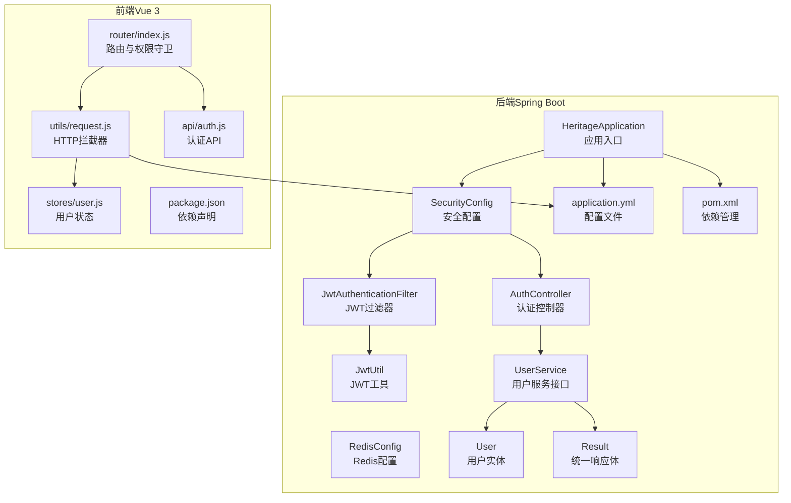
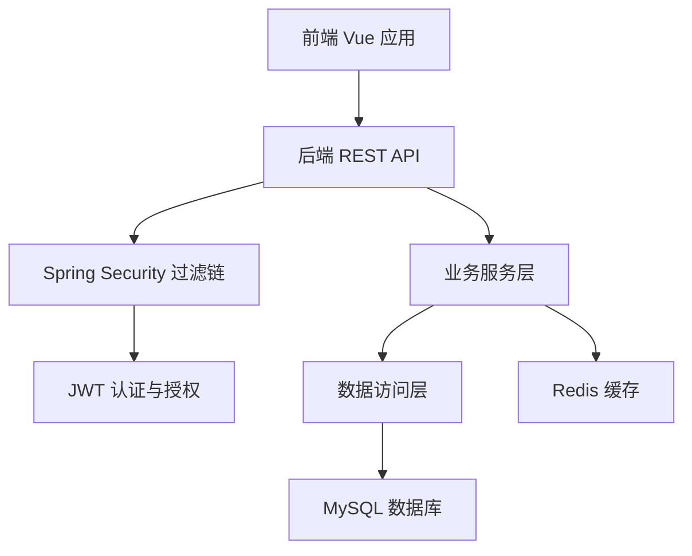
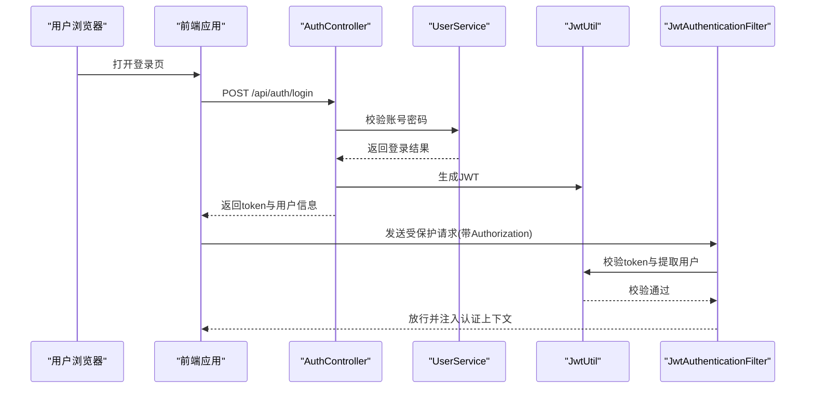
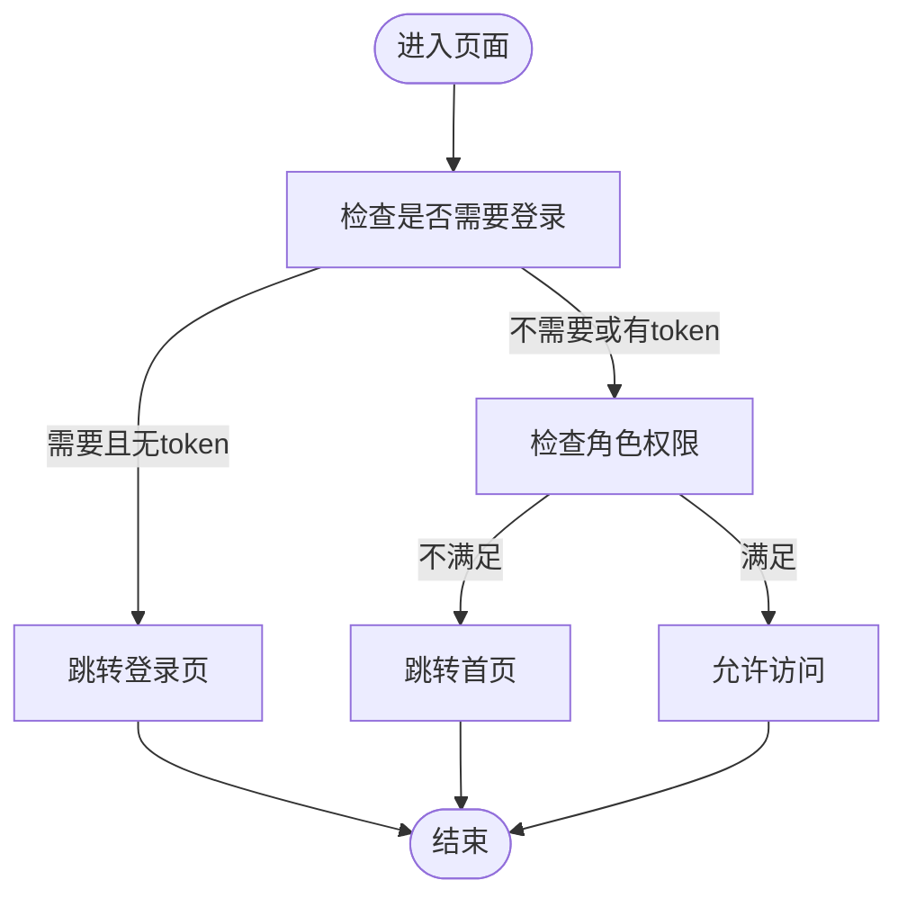
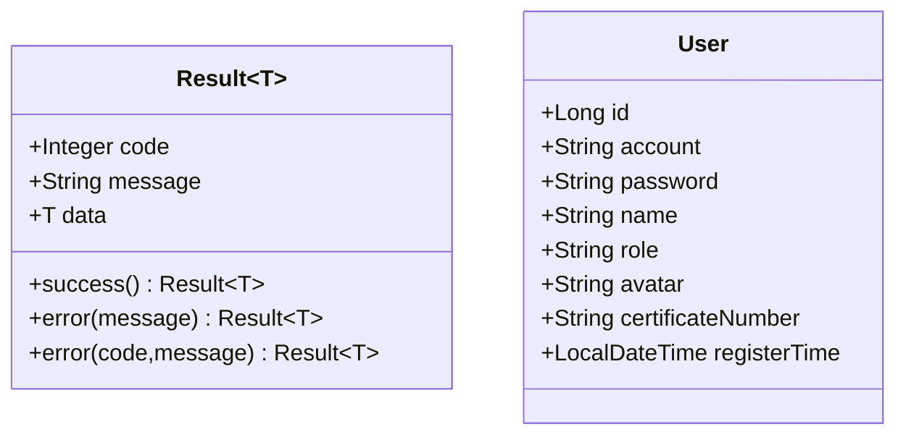
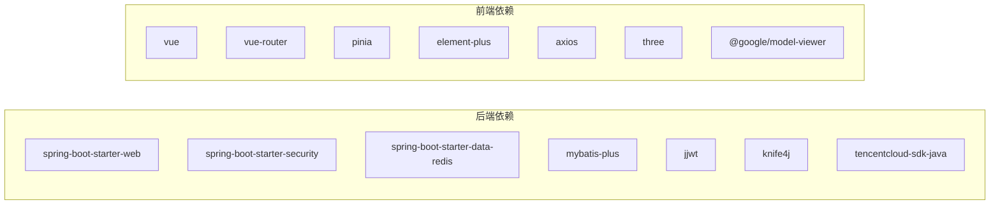

# 系统架构设计

<cite>
**本文引用的文件**
- [HeritageApplication.java](file://backend/src/main/java/com/heritage/HeritageApplication.java)
- [application.yml](file://backend/src/main/resources/application.yml)
- [pom.xml](file://backend/pom.xml)
- [SecurityConfig.java](file://backend/src/main/java/com/heritage/config/SecurityConfig.java)
- [JwtAuthenticationFilter.java](file://backend/src/main/java/com/heritage/security/JwtAuthenticationFilter.java)
- [JwtUtil.java](file://backend/src/main/java/com/heritage/util/JwtUtil.java)
- [RedisConfig.java](file://backend/src/main/java/com/heritage/config/RedisConfig.java)
- [AuthController.java](file://backend/src/main/java/com/heritage/controller/AuthController.java)
- [UserService.java](file://backend/src/main/java/com/heritage/service/UserService.java)
- [User.java](file://backend/src/main/java/com/heritage/entity/User.java)
- [Result.java](file://backend/src/main/java/com/heritage/common/Result.java)
- [package.json](file://frontend/package.json)
- [index.js](file://frontend/src/router/index.js)
- [request.js](file://frontend/src/utils/request.js)
- [user.js](file://frontend/src/stores/user.js)
- [auth.js](file://frontend/src/api/auth.js)
</cite>

## 目录
1. [引言](#引言)
2. [项目结构](#项目结构)
3. [核心组件](#核心组件)
4. [架构总览](#架构总览)
5. [详细组件分析](#详细组件分析)
6. [依赖分析](#依赖分析)
7. [性能考虑](#性能考虑)
8. [故障排查指南](#故障排查指南)
9. [结论](#结论)
10. [附录](#附录)

## 引言
本系统为“非遗产品智能定制商城”，采用前后端分离架构：后端基于 Spring Boot 3 技术栈提供 REST API，前端基于 Vue 3 + Pinia + Element Plus 构建单页应用。系统通过 JWT 实现无状态认证与授权，结合 Spring Security 过滤链完成统一鉴权；数据库采用 MySQL，缓存采用 Redis；AI 图像生成功能集成腾讯云 AI 能力。系统支持多角色（普通用户、管理员、商户），并提供商品、订单、非遗文化、用户地址、证书等模块。

## 项目结构
- 后端工程（Java/Spring Boot）
  - 应用入口与配置：HeritageApplication、application.yml、pom.xml
  - 安全与认证：SecurityConfig、JwtAuthenticationFilter、JwtUtil
  - 缓存：RedisConfig
  - 控制器与服务：AuthController、UserService 及其实现、实体与 Mapper
  - 统一响应体：Result
- 前端工程（Vue 3）
  - 路由与权限守卫：router/index.js
  - 请求封装与拦截器：utils/request.js
  - 状态管理：stores/user.js
  - API 封装：api/auth.js 等
  - 依赖：package.json

图表来源
- [HeritageApplication.java](file://backend/src/main/java/com/heritage/HeritageApplication.java#L1-L13)
- [SecurityConfig.java](file://backend/src/main/java/com/heritage/config/SecurityConfig.java#L1-L67)
- [JwtAuthenticationFilter.java](file://backend/src/main/java/com/heritage/security/JwtAuthenticationFilter.java#L1-L72)
- [JwtUtil.java](file://backend/src/main/java/com/heritage/util/JwtUtil.java#L1-L81)
- [RedisConfig.java](file://backend/src/main/java/com/heritage/config/RedisConfig.java#L1-L46)
- [AuthController.java](file://backend/src/main/java/com/heritage/controller/AuthController.java#L1-L48)
- [UserService.java](file://backend/src/main/java/com/heritage/service/UserService.java#L1-L22)
- [User.java](file://backend/src/main/java/com/heritage/entity/User.java#L1-L38)
- [Result.java](file://backend/src/main/java/com/heritage/common/Result.java#L1-L44)
- [application.yml](file://backend/src/main/resources/application.yml#L1-L63)
- [pom.xml](file://backend/pom.xml#L1-L129)
- [index.js](file://frontend/src/router/index.js#L1-L176)
- [request.js](file://frontend/src/utils/request.js#L1-L45)
- [user.js](file://frontend/src/stores/user.js#L1-L33)
- [auth.js](file://frontend/src/api/auth.js#L1-L132)
- [package.json](file://frontend/package.json#L1-L28)

章节来源
- [HeritageApplication.java](file://backend/src/main/java/com/heritage/HeritageApplication.java#L1-L13)
- [application.yml](file://backend/src/main/resources/application.yml#L1-L63)
- [pom.xml](file://backend/pom.xml#L1-L129)
- [package.json](file://frontend/package.json#L1-L28)

## 核心组件
- 应用入口与启动
  - 后端通过 Spring Boot 启动类加载自动配置，绑定端口与数据库、Redis、JWT 等配置。
- 安全与认证
  - 基于 Spring Security 的无状态会话策略，使用 JWT 拦截器解析与验证令牌，结合自定义用户详情服务完成授权。
- 缓存
  - RedisTemplate 使用 JSON 序列化，开启注解式缓存，提升热点数据访问性能。
- 统一响应体
  - Result 提供统一的 code/message/data 结构，简化前后端契约。
- 前后端通信
  - 前端 Axios 封装基础 URL 与请求/响应拦截器，自动注入 Authorization 头；Pinia 管理 token 与用户信息；路由守卫根据角色控制访问。

章节来源
- [HeritageApplication.java](file://backend/src/main/java/com/heritage/HeritageApplication.java#L1-L13)
- [SecurityConfig.java](file://backend/src/main/java/com/heritage/config/SecurityConfig.java#L1-L67)
- [JwtAuthenticationFilter.java](file://backend/src/main/java/com/heritage/security/JwtAuthenticationFilter.java#L1-L72)
- [JwtUtil.java](file://backend/src/main/java/com/heritage/util/JwtUtil.java#L1-L81)
- [RedisConfig.java](file://backend/src/main/java/com/heritage/config/RedisConfig.java#L1-L46)
- [Result.java](file://backend/src/main/java/com/heritage/common/Result.java#L1-L44)
- [request.js](file://frontend/src/utils/request.js#L1-L45)
- [user.js](file://frontend/src/stores/user.js#L1-L33)
- [index.js](file://frontend/src/router/index.js#L1-L176)

## 架构总览
系统采用典型的三层架构与微服务思想的模块化设计：
- 表现层（前端 Vue）
  - 单页应用，路由驱动页面切换，权限守卫控制访问，状态持久化到本地存储。
- 控制层（后端 Spring MVC）
  - RESTful 控制器负责请求接入与响应封装；安全过滤器链统一处理认证与授权。
- 业务层（Service）
  - 领域服务编排业务流程，DAO 层访问数据库。
- 数据与缓存层
  - MySQL 存储业务数据；Redis 缓存热点数据与会话信息。

图表来源
- [index.js](file://frontend/src/router/index.js#L1-L176)
- [request.js](file://frontend/src/utils/request.js#L1-L45)
- [SecurityConfig.java](file://backend/src/main/java/com/heritage/config/SecurityConfig.java#L1-L67)
- [JwtAuthenticationFilter.java](file://backend/src/main/java/com/heritage/security/JwtAuthenticationFilter.java#L1-L72)
- [application.yml](file://backend/src/main/resources/application.yml#L1-L63)

## 详细组件分析

### 安全架构与认证流程
- 认证机制
  - 登录成功后，后端生成 JWT 并返回给前端；后续请求由前端在请求头注入 Authorization: Bearer <token>。
  - 后端通过 JwtAuthenticationFilter 解析令牌，调用 JwtUtil 校验签名与有效期，并从 UserDetails 加载用户信息与权限，写入 SecurityContext。
- 授权策略
  - SecurityConfig 对特定公开路径放行，其余请求需认证；同时预留方法级安全注解能力。
- 密钥与加密
  - JWT 密钥来自配置文件，运行时校验长度并确保安全；密码采用 BCrypt 加密存储。

图表来源
- [AuthController.java](file://backend/src/main/java/com/heritage/controller/AuthController.java#L1-L48)
- [JwtAuthenticationFilter.java](file://backend/src/main/java/com/heritage/security/JwtAuthenticationFilter.java#L1-L72)
- [JwtUtil.java](file://backend/src/main/java/com/heritage/util/JwtUtil.java#L1-L81)
- [SecurityConfig.java](file://backend/src/main/java/com/heritage/config/SecurityConfig.java#L1-L67)
- [request.js](file://frontend/src/utils/request.js#L1-L45)

章节来源
- [AuthController.java](file://backend/src/main/java/com/heritage/controller/AuthController.java#L1-L48)
- [JwtAuthenticationFilter.java](file://backend/src/main/java/com/heritage/security/JwtAuthenticationFilter.java#L1-L72)
- [JwtUtil.java](file://backend/src/main/java/com/heritage/util/JwtUtil.java#L1-L81)
- [SecurityConfig.java](file://backend/src/main/java/com/heritage/config/SecurityConfig.java#L1-L67)
- [request.js](file://frontend/src/utils/request.js#L1-L45)

### 前端路由与权限守卫
- 路由设计
  - 主布局、管理后台、商家后台三套布局，子路由覆盖首页、非遗文化、商品、定制、个人中心、购物车、订单等。
- 权限控制
  - 路由元信息标记 requiresAuth、requiresAdmin、requiresMerchant；全局前置守卫读取 Pinia 中 token 与角色，未满足条件重定向至登录或首页。
- 请求拦截
  - Axios 在请求前注入 Authorization 头，响应拦截统一处理错误码与提示。

图表来源
- [index.js](file://frontend/src/router/index.js#L1-L176)
- [user.js](file://frontend/src/stores/user.js#L1-L33)
- [request.js](file://frontend/src/utils/request.js#L1-L45)

章节来源
- [index.js](file://frontend/src/router/index.js#L1-L176)
- [user.js](file://frontend/src/stores/user.js#L1-L33)
- [request.js](file://frontend/src/utils/request.js#L1-L45)

### 统一响应体与数据模型
- 统一响应体
  - Result 提供 success/error 工厂方法，约定 code=200 表示成功，便于前端统一处理。
- 用户实体
  - User 映射 sys_user 表，包含账户、密码（敏感字段忽略序列化）、角色、头像、证书号等字段。

图表来源
- [Result.java](file://backend/src/main/java/com/heritage/common/Result.java#L1-L44)
- [User.java](file://backend/src/main/java/com/heritage/entity/User.java#L1-L38)

章节来源
- [Result.java](file://backend/src/main/java/com/heritage/common/Result.java#L1-L44)
- [User.java](file://backend/src/main/java/com/heritage/entity/User.java#L1-L38)

### 微服务思想与模块化设计
- 服务边界
  - 控制器按功能域划分（认证、商品、订单、非遗、用户等），每个领域相对独立，便于演进与测试。
- 职责分离
  - 控制器仅负责参数接收与响应封装；服务层承担业务编排；DAO 层专注数据访问；工具类（如 JwtUtil）提供横切能力。
- 可扩展性
  - 通过接口与实现分离（如 UserService 接口 + 实现类），可在不改动上层的情况下替换实现或引入缓存。

章节来源
- [AuthController.java](file://backend/src/main/java/com/heritage/controller/AuthController.java#L1-L48)
- [UserService.java](file://backend/src/main/java/com/heritage/service/UserService.java#L1-L22)

## 依赖分析
- 后端依赖
  - Web、Security、Redis、MyBatis-Plus、JWT、Knife4j、腾讯云 SDK、测试等。
- 前端依赖
  - Vue 3、Vue Router、Pinia、Element Plus、Axios、Three.js、@google/model-viewer 等。

图表来源
- [pom.xml](file://backend/pom.xml#L1-L129)
- [package.json](file://frontend/package.json#L1-L28)

章节来源
- [pom.xml](file://backend/pom.xml#L1-L129)
- [package.json](file://frontend/package.json#L1-L28)

## 性能考虑
- 无状态认证
  - JWT 无状态，避免服务器端会话存储，降低横向扩展复杂度。
- 缓存策略
  - RedisConfig 配置 JSON 序列化与键空间策略，建议对热点查询（如商品详情、分类树）增加缓存；注意缓存失效与一致性。
- 数据库优化
  - 合理索引（主键、唯一键、常用查询条件），分页查询避免一次性加载大结果集。
- 文件上传
  - application.yml 限制上传大小，建议对大图进行缩略图与 CDN 分发。
- 前端性能
  - 路由懒加载、组件按需加载、Axios 超时与重试策略（当前超时配置为无限，建议按场景调整）。

## 故障排查指南
- 登录后无法访问受保护资源
  - 检查前端是否正确在请求头注入 Authorization；后端日志中查看 JwtAuthenticationFilter 是否解析到 token 并校验通过。
- Token 校验失败
  - 检查密钥长度与配置项；确认签发方与接收方一致；核对过期时间与服务器时间。
- 跨域与静态资源
  - application.yml 中已配置跨域与静态资源放行路径；若仍异常，检查网关或反向代理配置。
- 响应码非 200
  - 前端 request.js 已统一拦截并提示；关注后端异常处理器与业务异常类型。

章节来源
- [JwtAuthenticationFilter.java](file://backend/src/main/java/com/heritage/security/JwtAuthenticationFilter.java#L1-L72)
- [request.js](file://frontend/src/utils/request.js#L1-L45)
- [SecurityConfig.java](file://backend/src/main/java/com/heritage/config/SecurityConfig.java#L1-L67)
- [application.yml](file://backend/src/main/resources/application.yml#L1-L63)

## 结论
本系统以 Spring Boot 与 Vue 为核心，构建了清晰的前后端分离架构。通过 JWT 无状态认证与 Spring Security 统一授权、Redis 缓存与 MySQL 数据持久化，满足非遗产品智能定制商城的功能需求。模块化设计遵循单一职责与接口分离，具备良好的可维护性与扩展性。建议在生产环境中进一步完善密钥管理、缓存策略、监控告警与安全审计。

## 附录
- 关键配置要点
  - JWT 密钥与过期时间：application.yml
  - 数据源与 Redis：application.yml
  - 文件上传路径与公共访问基址：application.yml
- 前端开发与构建
  - 开发端口：3030；后端接口基址：http://localhost:8080
  - 依赖安装与构建：package.json scripts

章节来源
- [application.yml](file://backend/src/main/resources/application.yml#L1-L63)
- [package.json](file://frontend/package.json#L1-L28)